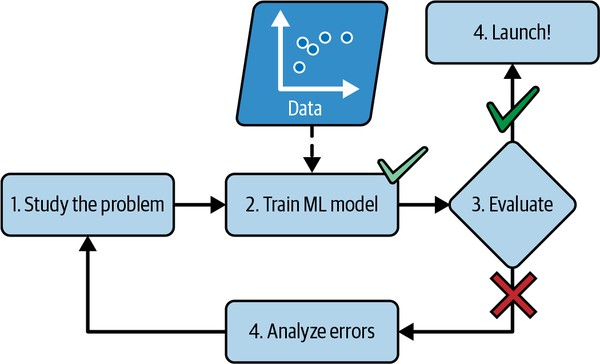
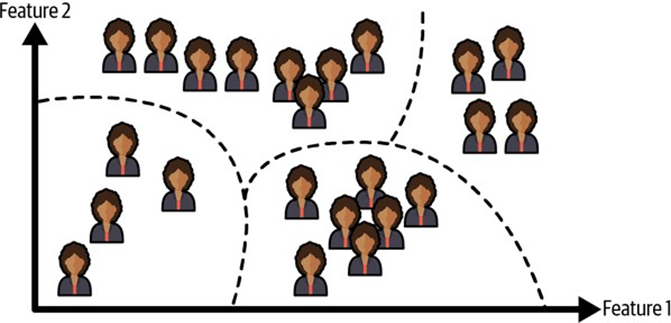
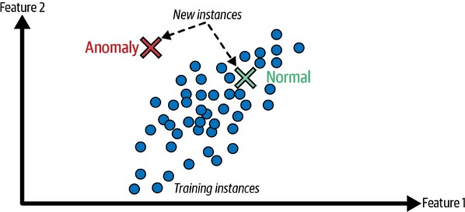
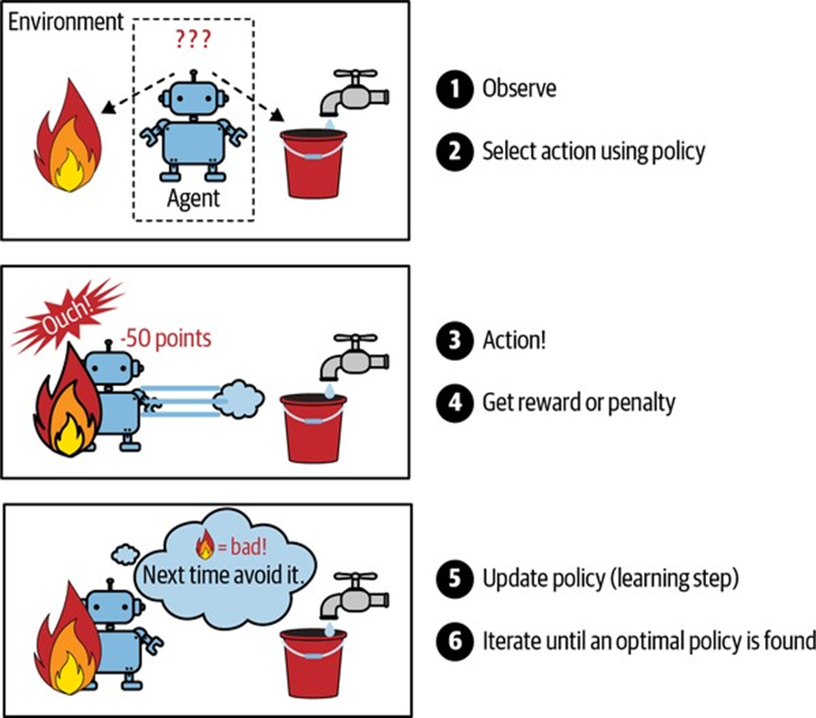

<!-- tabs:start -->

#### ** 📖 Lý thuyết **
# CHƯƠNG 1. BỨC TRANH TỔNG QUAN VỀ HỌC MÁY

Cách đây không lâu, nếu bạn nhấc điện thoại lên và hỏi đường về nhà,
nó sẽ phớt lờ bạn — và mọi người sẽ nghi ngờ sự tỉnh táo của bạn. Nhưng học máy
không còn là khoa học viễn tưởng nữa: hàng tỷ người sử dụng nó mỗi ngày. Và sự
thật là nó đã thực sự tồn tại trong nhiều thập kỷ ở một số ứng dụng chuyên biệt,
chẳng hạn như nhận dạng ký tự quang học (OCR). Ứng dụng ML đầu tiên thực sự trở
thành xu hướng chủ đạo, cải thiện cuộc sống của hàng trăm triệu người, đã chiếm
lĩnh thế giới vào những năm 1990: bộ lọc thư rác. Nó không hoàn toàn là một
robot có ý thức, nhưng về mặt kỹ thuật, nó đủ điều kiện là học máy: nó đã học tốt
đến mức bạn hiếm khi cần đánh dấu một email là thư rác nữa. Sau đó là hàng trăm
ứng dụng ML hiện đang lặng lẽ cung cấp sức mạnh cho hàng trăm sản phẩm và tính
năng mà bạn sử dụng thường xuyên: lời nhắc bằng giọng nói, dịch tự động, tìm kiếm
hình ảnh, đề xuất sản phẩm, và nhiều hơn nữa.


Học máy bắt đầu từ đâu và kết thúc ở đâu? Chính xác thì một cỗ máy học
hỏi điều gì? Nếu tôi tải một bản sao của tất cả các bài viết trên Wikipedia,
máy tính của tôi có thực sự học được điều gì không? Nó có đột nhiên thông minh
hơn không? Trong chương này, tôi sẽ bắt đầu bằng cách làm rõ học máy là gì và tại
sao bạn có thể muốn sử dụng nó. Sau đó, trước khi chúng ta bắt đầu khám phá lục
địa học máy, chúng ta sẽ xem xét bản đồ và tìm hiểu về các khu vực chính và các
địa danh đáng chú ý nhất: học có giám sát so với học không giám sát và các biến
thể của chúng, học trực tuyến so với học theo lô, học dựa trên thể hiện so với
học dựa trên mô hình. Sau đó, chúng ta sẽ xem xét quy trình làm việc của một dự
án ML điển hình, thảo luận về những thách thức chính mà bạn có thể gặp phải và
đề cập đến cách đánh giá và tinh chỉnh một hệ thống học máy.


Chương này giới thiệu rất nhiều khái niệm cơ bản (và thuật ngữ) mà mọi
nhà khoa học dữ liệu nên thuộc lòng. Đây sẽ là một cái nhìn tổng quan cấp cao
(đây là chương duy nhất không có nhiều mã), tất cả khá đơn giản, nhưng mục tiêu
của tôi là đảm bảo mọi thứ rõ ràng đối với bạn trước khi chúng ta tiếp tục các
phần còn lại của cuốn sách. Vậy thì hãy pha một ly cà phê và bắt đầu thôi!


### Học máy là gì?

Học máy là khoa học (và nghệ thuật) lập trình máy tính để chúng có
thể học từ dữ liệu. Đây là một định nghĩa tổng quát hơn một chút: [Học máy là]
lĩnh vực nghiên cứu cung cấp cho máy tính khả năng học hỏi mà không cần được lập
trình rõ ràng. —Arthur Samuel, 1959 Và một định nghĩa hướng đến kỹ thuật hơn: Một
chương trình máy tính được cho là học từ kinh nghiệm E đối với một nhiệm vụ T
và một thước đo hiệu suất P, nếu hiệu suất của nó trên T, được đo bằng P, cải
thiện theo kinh nghiệm E. —Tom Mitchell, 1997 Bộ lọc thư rác của bạn là một
chương trình học máy mà, với các ví dụ về email rác (được người dùng đánh dấu)
và các ví dụ về email thông thường (không phải thư rác, còn được gọi là “ham”),
có thể học cách đánh dấu thư rác. Các ví dụ mà hệ thống sử dụng để học được gọi
là tập huấn luyện. Mỗi ví dụ huấn luyện được gọi là một trường hợp huấn luyện
(hoặc mẫu). Phần của một hệ thống học máy học và đưa ra dự đoán được gọi là một
mô hình. Mạng thần kinh và rừng ngẫu nhiên là các ví dụ về mô hình. Trong trường
hợp này, nhiệm vụ T là đánh dấu thư rác cho các email mới, kinh nghiệm E là dữ
liệu huấn luyện, và thước đo hiệu suất P cần được xác định; ví dụ, bạn có thể sử
dụng tỷ lệ email được phân loại đúng. Thước đo hiệu suất cụ thể này được gọi là
độ chính xác (accuracy), và nó thường được sử dụng trong các nhiệm vụ phân loại.
Nếu bạn chỉ tải một bản sao của tất cả các bài viết trên Wikipedia, máy tính của
bạn có nhiều dữ liệu hơn, nhưng nó không đột nhiên giỏi hơn trong bất kỳ nhiệm
vụ nào. Đây không phải là học máy.


### Tại sao sử dụng học máy?

Hãy xem xét cách bạn sẽ viết một bộ lọc thư rác bằng
các kỹ thuật lập trình truyền thống (Hình 1-1):


·        
Đầu tiên, bạn sẽ kiểm tra xem
thư rác thường trông như thế nào. Bạn có thể nhận thấy rằng một số từ hoặc cụm
từ (như “4U”, “credit card”, “free” và “amazing”) có xu hướng xuất hiện nhiều
trong dòng chủ đề. Có lẽ bạn cũng sẽ nhận thấy một vài mẫu khác trong tên người
gửi, nội dung email và các phần khác của email.


·        
Bạn sẽ viết một thuật toán phát
hiện cho mỗi mẫu mà bạn nhận thấy, và chương trình của bạn sẽ đánh dấu email là
thư rác nếu một số mẫu này được phát hiện.


·        
Bạn sẽ kiểm tra chương trình của
mình và lặp lại các bước 1 và 2 cho đến khi nó đủ tốt để ra mắt.


*Hình 1-1. Phương pháp truyền
thống*

Vì vấn đề rất khó, chương trình của bạn có thể sẽ
trở thành một danh sách dài các quy tắc phức tạp — khá khó bảo trì. Ngược lại,
một bộ lọc thư rác dựa trên các kỹ thuật học máy tự động học các từ và cụm từ
nào là những yếu tố dự báo tốt về thư rác bằng cách phát hiện các mẫu từ có tần
suất bất thường trong các ví dụ thư rác so với các ví dụ thư hợp lệ (Hình 1-2).
Chương trình ngắn hơn nhiều, dễ bảo trì hơn và rất có thể chính xác hơn.





*Hình 1-2. Phương pháp học máy*

Điều gì sẽ xảy ra nếu những kẻ gửi thư rác nhận thấy rằng tất cả các
email của chúng chứa “4U” đều bị chặn? Chúng có thể bắt đầu viết “For U” thay
vào đó. Một bộ lọc thư rác sử dụng các kỹ thuật lập trình truyền thống sẽ cần
được cập nhật để đánh dấu các email “For U”. Nếu những kẻ gửi thư rác tiếp tục
vượt qua bộ lọc thư rác của bạn, bạn sẽ cần phải tiếp tục viết các quy tắc mới
mãi mãi. Ngược lại, một bộ lọc thư rác dựa trên các kỹ thuật học máy tự động nhận
thấy rằng “For U” đã trở nên thường xuyên một cách bất thường trong thư rác được
người dùng đánh dấu, và nó bắt đầu đánh dấu chúng mà không cần sự can thiệp của
bạn (Hình 1-3).


*Hình 1-3. Tự động thích nghi với
sự thay đổi*

Một lĩnh vực khác mà học máy tỏa sáng là đối với các vấn đề quá phức
tạp đối với các phương pháp truyền thống hoặc không có thuật toán nào được biết
đến. Ví dụ, hãy xem xét nhận dạng giọng nói. Giả sử bạn muốn bắt đầu đơn giản
và viết một chương trình có khả năng phân biệt các từ “một” và “hai”. Bạn có thể
nhận thấy rằng từ “hai” bắt đầu bằng âm thanh cao (“T”), vì vậy bạn có thể mã
hóa cứng một thuật toán đo cường độ âm thanh cao và sử dụng nó để phân biệt một
và hai — nhưng rõ ràng kỹ thuật này sẽ không mở rộng cho hàng nghìn từ được nói
bởi hàng triệu người rất khác nhau trong môi trường ồn ào và trong hàng chục
ngôn ngữ. Giải pháp tốt nhất (ít nhất là ngày nay) là viết một thuật toán tự học,
với nhiều ví dụ ghi âm cho mỗi từ. Cuối cùng, học máy có thể giúp con người học
hỏi (Hình 1-4). Các mô hình ML có thể được kiểm tra để xem chúng đã học được gì
(mặc dù đối với một số mô hình điều này có thể khó). Chẳng hạn, một khi bộ lọc
thư rác đã được huấn luyện trên đủ thư rác, nó có thể dễ dàng được kiểm tra để
tiết lộ danh sách các từ và sự kết hợp các từ mà nó tin là những yếu tố dự báo
tốt nhất về thư rác. Đôi khi điều này sẽ tiết lộ những mối tương quan không ngờ
hoặc những xu hướng mới, và từ đó dẫn đến sự hiểu biết tốt hơn về vấn đề. Việc
đào sâu vào lượng lớn dữ liệu để khám phá các mẫu ẩn được gọi là khai phá dữ liệu,
và học máy rất xuất sắc trong lĩnh vực này.


*Hình 1-4. Học máy có thể giúp
con người học hỏi*

Tóm lại, học máy rất tuyệt vời cho:


·        
Các vấn đề mà các giải pháp hiện
có yêu cầu rất nhiều tinh chỉnh hoặc danh sách dài các quy tắc (một mô hình học
máy thường có thể đơn giản hóa mã và thực hiện tốt hơn phương pháp truyền thống).


·        
Các vấn đề phức tạp mà việc sử
dụng phương pháp truyền thống không mang lại giải pháp tốt (các kỹ thuật học
máy tốt nhất có thể tìm ra giải pháp).


·        
Môi trường biến động (một hệ thống
học máy có thể dễ dàng được huấn luyện lại trên dữ liệu mới, luôn cập nhật).


·        
Thu được những hiểu biết sâu sắc
về các vấn đề phức tạp và lượng lớn dữ liệu.


### Ví dụ về các ứng dụng

Hãy xem xét một số ví dụ cụ thể về các tác vụ học
máy, cùng với các kỹ thuật có thể xử lý chúng:


·        
Phân tích hình ảnh sản phẩm
trên dây chuyền sản xuất để tự động phân loại chúng: Đây là phân loại hình ảnh, thường được thực hiện bằng cách sử dụng
mạng nơ-ron tích chập (CNNs; xem Chương 14) hoặc đôi khi là transformer (xem
Chương 16).


·        
Phát hiện khối u trong ảnh
quét não: Đây là phân đoạn hình ảnh ngữ nghĩa,
trong đó mỗi pixel trong ảnh được phân loại (vì chúng ta muốn xác định vị trí
và hình dạng chính xác của khối u), thường sử dụng CNNs hoặc transformer.


·        
Tự động phân loại các bài
báo tin tức: Đây là xử lý ngôn ngữ tự nhiên (NLP),
và cụ thể hơn là phân loại văn bản, có thể được xử lý bằng cách sử dụng mạng
nơ-ron hồi quy (RNNs) và CNNs, nhưng transformer hoạt động tốt hơn nữa (xem
Chương 16).


·        
Tự động gắn cờ các bình luận
xúc phạm trên diễn đàn thảo luận: Đây cũng là phân
loại văn bản, sử dụng cùng các công cụ NLP.


·        
Tự động tóm tắt các tài liệu
dài: Đây là một nhánh của NLP được gọi là tóm tắt
văn bản, cũng sử dụng các công cụ tương tự.


·        
Tạo chatbot hoặc trợ lý cá
nhân: Việc này liên quan đến nhiều thành phần NLP,
bao gồm hiểu ngôn ngữ tự nhiên (NLU) và các mô-đun trả lời câu hỏi.


·        
Dự báo doanh thu của công ty
bạn vào năm tới, dựa trên nhiều chỉ số hiệu suất:
Đây là một tác vụ hồi quy (tức là dự đoán giá trị) có thể được giải quyết bằng
bất kỳ mô hình hồi quy nào, chẳng hạn như hồi quy tuyến tính hoặc hồi quy đa thức
(xem Chương 4), máy vector hỗ trợ hồi quy (xem Chương 5), rừng ngẫu nhiên hồi
quy (xem Chương 7) hoặc mạng nơ-ron nhân tạo (xem Chương 10). Nếu bạn muốn tính
đến các chuỗi chỉ số hiệu suất trong quá khứ, bạn có thể muốn sử dụng RNNs,
CNNs hoặc transformer (xem Chương 15 và 16).


·        
Làm cho ứng dụng của bạn phản
ứng với lệnh thoại: Đây là nhận dạng giọng nói, yêu
cầu xử lý các mẫu âm thanh: vì chúng là các chuỗi dài và phức tạp, chúng thường
được xử lý bằng RNNs, CNNs hoặc transformer (xem Chương 15 và 16).


·        
Phát hiện gian lận thẻ tín dụng: Đây là phát hiện bất thường, có thể được xử lý bằng cách sử dụng rừng
cô lập (isolation forests), mô hình hỗn hợp Gaussian (xem Chương 9) hoặc bộ mã
hóa tự động (autoencoders) (xem Chương 17).


·        
Phân khúc khách hàng dựa
trên giao dịch mua hàng của họ để bạn có thể thiết kế một chiến lược tiếp thị
khác nhau cho mỗi phân khúc: Đây là phân cụm, có thể
đạt được bằng cách sử dụng k-means, DBSCAN và nhiều phương pháp khác (xem
Chương 9).


·        
Biểu diễn một tập dữ liệu phức
tạp, nhiều chiều trong một biểu đồ rõ ràng và sâu sắc: Đây là trực quan hóa dữ liệu, thường liên quan đến các kỹ thuật giảm
chiều (xem Chương 8).


·        
Đề xuất một sản phẩm mà
khách hàng có thể quan tâm, dựa trên các giao dịch mua hàng trước đây: Đây là một hệ thống đề xuất. Một cách tiếp cận là đưa các giao dịch
mua hàng trước đây (và các thông tin khác về khách hàng) vào một mạng nơ-ron
nhân tạo (xem Chương 10), và để nó xuất ra sản phẩm tiếp theo có khả năng nhất.
Mạng nơ-ron này thường được huấn luyện trên các chuỗi mua hàng trong quá khứ của
tất cả các khách hàng.


·        
Xây dựng một bot thông minh
cho trò chơi: Điều này thường được giải quyết bằng
cách sử dụng học tăng cường (RL; xem Chương 18), đây là một nhánh của học máy
huấn luyện các tác nhân (như bot) để chọn các hành động sẽ tối đa hóa phần thưởng
của chúng theo thời gian (ví dụ: một bot có thể nhận được phần thưởng mỗi khi
người chơi mất một số điểm sinh lực), trong một môi trường nhất định (như trò
chơi). Chương trình AlphaGo nổi tiếng đã đánh bại nhà vô địch thế giới trong
trò chơi cờ vây được xây dựng bằng RL.


Danh sách này có thể kéo dài mãi, nhưng hy vọng nó
mang lại cho bạn cảm nhận về phạm vi và độ phức tạp đáng kinh ngạc của các tác
vụ mà học máy có thể giải quyết, và các loại kỹ thuật mà bạn sẽ sử dụng cho mỗi
tác vụ.


### Các loại hệ thống học máy

Có rất nhiều loại hệ thống học máy khác nhau nên việc phân loại
chúng thành các danh mục lớn, dựa trên các tiêu chí sau là rất hữu ích:


·        
Cách chúng được giám sát trong
quá trình huấn luyện (có giám sát, không giám sát, bán giám sát, tự giám sát và
các loại khác)


·        
Liệu chúng có thể học tăng cường
ngay lập tức hay không (học trực tuyến so với học theo lô)


·        
Liệu chúng hoạt động bằng cách
chỉ đơn giản so sánh các điểm dữ liệu mới với các điểm dữ liệu đã biết, hay
thay vào đó bằng cách phát hiện các mẫu trong dữ liệu huấn luyện và xây dựng một
mô hình dự đoán, giống như các nhà khoa học làm (học dựa trên trường hợp so với
học dựa trên mô hình)


Các tiêu chí này không loại trừ lẫn nhau; bạn có
thể kết hợp chúng theo bất kỳ cách nào bạn muốn. Ví dụ, một bộ lọc thư rác hiện
đại có thể học ngay lập tức bằng cách sử dụng mô hình mạng nơ-ron sâu được huấn
luyện bằng các ví dụ về thư rác và thư hợp lệ do con người cung cấp; điều này
làm cho nó trở thành một hệ thống học trực tuyến, dựa trên mô hình, có giám
sát.


Hãy cùng xem xét từng tiêu chí này kỹ hơn một chút.


#### Giám sát huấn luyện

Các hệ thống ML có thể được phân loại theo lượng và loại giám sát mà
chúng nhận được trong quá trình huấn luyện. Có nhiều danh mục, nhưng chúng ta sẽ
thảo luận về những danh mục chính: học có giám sát, học không giám sát, học tự
giám sát, học bán giám sát và học tăng cường.


#### Học có giám sát

Trong học có giám sát, tập huấn luyện mà bạn cung cấp cho thuật toán
bao gồm các giải pháp mong muốn, được gọi là nhãn (Hình 1-5).


*Hình 1-5. Một tập huấn luyện
có nhãn để phân loại thư rác (một ví dụ về học có giám sát)*

Một tác vụ học có giám sát điển hình là phân loại. Bộ lọc thư rác là
một ví dụ điển hình về điều này: nó được huấn luyện với nhiều email mẫu cùng với
lớp của chúng (thư rác hoặc thư hợp lệ), và nó phải học cách phân loại các
email mới.


Một tác vụ điển hình khác là dự đoán một giá trị số mục tiêu, chẳng
hạn như giá của một chiếc ô tô, với một tập hợp các đặc trưng (số dặm, tuổi,
thương hiệu, v.v.). Loại tác vụ này được gọi là hồi quy (Hình 1-6).1 Để huấn
luyện hệ thống, bạn cần cung cấp cho nó nhiều ví dụ về ô tô, bao gồm cả các đặc
trưng và mục tiêu của chúng (tức là giá của chúng). Lưu ý rằng một số mô hình hồi
quy cũng có thể được sử dụng để phân loại, và ngược lại. Ví dụ, hồi quy
logistic thường được sử dụng để phân loại, vì nó có thể xuất ra một giá trị
tương ứng với xác suất thuộc về một lớp nhất định (ví dụ: 20% khả năng là thư
rác).


*Hình 1-6. Một vấn đề hồi quy:
dự đoán một giá trị, với một đặc trưng đầu vào (thường có nhiều đặc trưng đầu
vào, và đôi khi nhiều giá trị đầu ra)*


#### Học không giám sát

Trong học không giám sát, như bạn có thể đoán, dữ liệu huấn luyện
không có nhãn (Hình 1-7). Hệ thống cố gắng học mà không có giáo viên. Ví dụ, giả
sử bạn có rất nhiều dữ liệu về khách truy cập blog của mình. Bạn có thể muốn chạy
một thuật toán phân cụm để cố gắng phát hiện các nhóm khách truy cập tương tự
(Hình 1-8). Bạn không hề nói cho thuật toán biết khách truy cập thuộc nhóm nào:
nó tìm ra những kết nối đó mà không cần sự giúp đỡ của bạn. Ví dụ, nó có thể nhận
thấy rằng 40% khách truy cập của bạn là thanh thiếu niên yêu thích truyện tranh
và thường đọc blog của bạn sau giờ học, trong khi 20% là người lớn thích khoa học
viễn tưởng và truy cập vào cuối tuần. Nếu bạn sử dụng thuật toán phân cụm phân
cấp, nó cũng có thể chia mỗi nhóm thành các nhóm nhỏ hơn. Điều này có thể giúp
bạn nhắm mục tiêu bài đăng của mình cho từng nhóm.


*Hình 1-7. Một tập huấn luyện
không nhãn cho học không giám sát*





*Hình 1-8. Phân cụm*

Các thuật toán trực quan hóa cũng là những ví dụ điển hình về học
không giám sát: bạn cung cấp cho chúng rất nhiều dữ liệu phức tạp và không
nhãn, và chúng xuất ra một biểu diễn 2D hoặc 3D của dữ liệu của bạn có thể dễ
dàng vẽ (Hình 1-9). Các thuật toán này cố gắng bảo tồn cấu trúc càng nhiều càng
tốt (ví dụ: cố gắng giữ các cụm riêng biệt trong không gian đầu vào không chồng
chéo trong hình ảnh trực quan) để bạn có thể hiểu cách dữ liệu được tổ chức và
có thể xác định các mẫu không ngờ tới.


Một tác vụ liên quan là giảm chiều, trong đó mục tiêu là đơn giản
hóa dữ liệu mà không làm mất quá nhiều thông tin. Một cách để làm điều này là hợp
nhất một số đặc trưng tương quan thành một. Ví dụ, số dặm của một chiếc ô tô có
thể tương quan mạnh mẽ với tuổi của nó, vì vậy thuật toán giảm chiều sẽ hợp nhất
chúng thành một đặc trưng đại diện cho sự hao mòn của ô tô. Điều này được gọi
là trích xuất đặc trưng.


*Hình 1-9. Ví dụ về trực quan
hóa t-SNE làm nổi bật các cụm ngữ nghĩa2*

Một tác vụ không giám sát quan trọng khác là phát hiện bất thường —
ví dụ, phát hiện các giao dịch thẻ tín dụng bất thường để ngăn chặn gian lận,
phát hiện lỗi sản xuất hoặc tự động loại bỏ các giá trị ngoại lai khỏi một tập
dữ liệu trước khi đưa nó vào một thuật toán học khác. Hệ thống được hiển thị chủ
yếu các trường hợp bình thường trong quá trình huấn luyện, vì vậy nó học cách
nhận dạng chúng; sau đó, khi nó thấy một trường hợp mới, nó có thể biết liệu nó
trông giống như một trường hợp bình thường hay nó có khả năng là một bất thường
(xem Hình 1-10). Một tác vụ rất giống là phát hiện sự mới lạ: nó nhằm mục đích
phát hiện các trường hợp mới trông khác với tất cả các trường hợp trong tập huấn
luyện. Điều này yêu cầu có một tập huấn luyện rất “sạch”, không có bất kỳ trường
hợp nào mà bạn muốn thuật toán phát hiện. Ví dụ, nếu bạn có hàng nghìn bức ảnh
chó, và 1% trong số đó là chó Chihuahua, thì thuật toán phát hiện sự mới lạ
không nên coi những bức ảnh Chihuahua mới là mới lạ. Mặt khác, các thuật toán
phát hiện bất thường có thể coi những con chó này rất hiếm và rất khác so với
những con chó khác đến mức chúng có thể phân loại chúng là bất thường (không có
ý xúc phạm chó Chihuahua).





*Hình 1-10. Phát hiện bất thường*

Cuối cùng, một tác vụ không giám sát phổ biến khác là học luật kết hợp,
trong đó mục tiêu là đào sâu vào lượng lớn dữ liệu và khám phá các mối quan hệ
thú vị giữa các thuộc tính. Ví dụ, giả sử bạn sở hữu một siêu thị. Chạy một luật
kết hợp trên nhật ký bán hàng của bạn có thể tiết lộ rằng những người mua sốt
thịt nướng và khoai tây chiên cũng có xu hướng mua bít tết. Do đó, bạn có thể
muốn đặt những mặt hàng này gần nhau.


#### Học bán giám sát

Vì việc gắn nhãn dữ liệu thường tốn thời gian và chi phí, bạn thường
sẽ có rất nhiều trường hợp không nhãn, và ít trường hợp có nhãn. Một số thuật
toán có thể xử lý dữ liệu được gắn nhãn một phần. Điều này được gọi là học bán
giám sát (Hình 1-11).


*Hình 1-11. Học bán giám sát với
hai lớp (tam giác và hình vuông): các ví dụ không nhãn (vòng tròn) giúp phân loại
một trường hợp mới (dấu chữ thập) vào lớp tam giác thay vì lớp hình vuông, mặc
dù nó gần với các hình vuông có nhãn hơn*

Một số dịch vụ lưu trữ ảnh, chẳng hạn như Google Photos, là những ví
dụ điển hình về điều này. Khi bạn tải tất cả ảnh gia đình của mình lên dịch vụ,
nó sẽ tự động nhận ra rằng cùng một người A xuất hiện trong ảnh 1, 5 và 11,
trong khi một người B khác xuất hiện trong ảnh 2, 5 và 7. Đây là phần không
giám sát của thuật toán (phân cụm). Bây giờ tất cả những gì hệ thống cần là bạn
cho nó biết những người này là ai. Chỉ cần thêm một nhãn cho mỗi người3 và nó
có thể đặt tên cho mọi người trong mọi bức ảnh, điều này hữu ích cho việc tìm
kiếm ảnh. Hầu hết các thuật toán học bán giám sát là sự kết hợp của các thuật
toán không giám sát và có giám sát. Ví dụ, một thuật toán phân cụm có thể được
sử dụng để nhóm các trường hợp tương tự lại với nhau, và sau đó mỗi trường hợp
không nhãn có thể được gắn nhãn với nhãn phổ biến nhất trong cụm của nó. Khi
toàn bộ tập dữ liệu được gắn nhãn, có thể sử dụng bất kỳ thuật toán học có giám
sát nào.


#### Học tự giám sát

Một cách tiếp cận khác đối với học máy liên quan đến việc thực sự tạo
ra một tập dữ liệu được gắn nhãn đầy đủ từ một tập dữ liệu hoàn toàn không được
gắn nhãn. Một lần nữa, khi toàn bộ tập dữ liệu được gắn nhãn, bất kỳ thuật toán
học có giám sát nào cũng có thể được sử dụng. Cách tiếp cận này được gọi là học
tự giám sát. Ví dụ, nếu bạn có một tập dữ liệu lớn các hình ảnh không được gắn
nhãn, bạn có thể che ngẫu nhiên một phần nhỏ của mỗi hình ảnh và sau đó huấn
luyện một mô hình để khôi phục hình ảnh gốc (Hình 1-12). Trong quá trình huấn
luyện, các hình ảnh bị che được sử dụng làm đầu vào cho mô hình, và các hình ảnh
gốc được sử dụng làm nhãn.


*Hình 1-12. Ví dụ học tự giám
sát: đầu vào (trái) và mục tiêu (phải)*

Mô hình thu được có thể khá hữu ích, ví dụ, để sửa chữa các hình ảnh
bị hỏng hoặc xóa các đối tượng không mong muốn khỏi hình ảnh. Nhưng thường thì
một mô hình được huấn luyện bằng học tự giám sát không phải là mục tiêu cuối
cùng. Bạn thường muốn tinh chỉnh và điều chỉnh mô hình cho một tác vụ hơi khác
— một tác vụ mà bạn thực sự quan tâm. Ví dụ, giả sử điều bạn thực sự muốn là có
một mô hình phân loại vật nuôi: với một bức ảnh của bất kỳ vật nuôi nào, nó sẽ
cho bạn biết nó thuộc loài nào. Nếu bạn có một tập dữ liệu lớn các bức ảnh vật
nuôi không được gắn nhãn, bạn có thể bắt đầu bằng cách huấn luyện một mô hình sửa
chữa hình ảnh bằng học tự giám sát. Một khi nó hoạt động tốt, nó sẽ có thể phân
biệt các loài vật nuôi khác nhau: khi nó sửa chữa một hình ảnh mèo bị che mặt,
nó phải biết không thêm mặt chó vào. Giả sử kiến trúc mô hình của bạn cho phép
(và hầu hết các kiến trúc mạng nơ-ron đều làm vậy), thì có thể tinh chỉnh mô
hình để nó dự đoán loài vật nuôi thay vì sửa chữa hình ảnh. Bước cuối cùng bao
gồm việc tinh chỉnh mô hình trên một tập dữ liệu được gắn nhãn: mô hình đã biết
mèo, chó và các loài vật nuôi khác trông như thế nào, vì vậy bước này chỉ cần
thiết để mô hình có thể học ánh xạ giữa các loài mà nó đã biết và các nhãn mà
chúng ta mong đợi từ nó.


Một số người coi học tự giám sát là một phần của học không giám sát,
vì nó xử lý các tập dữ liệu hoàn toàn không được gắn nhãn. Nhưng học tự giám
sát sử dụng các nhãn (được tạo) trong quá trình huấn luyện, vì vậy về mặt đó nó
gần với học có giám sát hơn. Và thuật ngữ “học không giám sát” thường được sử dụng
khi xử lý các tác vụ như phân cụm, giảm chiều hoặc phát hiện bất thường, trong
khi học tự giám sát tập trung vào các tác vụ giống như học có giám sát: chủ yếu
là phân loại và hồi quy. Nói tóm lại, tốt nhất nên coi học tự giám sát là một
loại riêng.


#### Học tăng cường





*Hình 1-13. Học tăng cường*

Học tăng cường là một loại khác biệt. Hệ thống học, được gọi là tác
nhân trong ngữ cảnh này, có thể quan sát môi trường, chọn và thực hiện các hành
động, và nhận lại phần thưởng (hoặc hình phạt dưới dạng phần thưởng tiêu cực,
như được hiển thị trong Hình 1-13). Sau đó, nó phải tự học chiến lược tốt nhất,
được gọi là chính sách, để đạt được phần thưởng cao nhất theo thời gian. Một
chính sách xác định hành động mà tác nhân nên chọn khi nó ở trong một tình huống
nhất định.


Ví dụ, nhiều robot triển khai các thuật toán học tăng cường để học
cách đi bộ. Chương trình AlphaGo của DeepMind cũng là một ví dụ điển hình về học
tăng cường: nó đã gây chú ý vào tháng 5 năm 2017 khi đánh bại Ke Jie, người
chơi cờ vây số một thế giới vào thời điểm đó. Nó đã học được chính sách chiến
thắng của mình bằng cách phân tích hàng triệu ván đấu, và sau đó tự chơi nhiều
ván đấu với chính mình. Lưu ý rằng quá trình học đã bị tắt trong các ván đấu với
nhà vô địch; AlphaGo chỉ đơn thuần áp dụng chính sách mà nó đã học. Như bạn sẽ
thấy trong phần tiếp theo, đây được gọi là học ngoại tuyến.


#### Học theo lô so với học trực tuyến

Một tiêu chí khác được sử dụng để phân loại các hệ thống học máy là
liệu hệ thống có thể học tăng cường từ một luồng dữ liệu đến hay không.


#### Học theo lô

Trong học theo lô, hệ thống không thể học tăng cường: nó phải được
huấn luyện bằng cách sử dụng tất cả dữ liệu có sẵn. Điều này thường sẽ tốn rất
nhiều thời gian và tài nguyên tính toán, vì vậy nó thường được thực hiện ngoại
tuyến. Đầu tiên hệ thống được huấn luyện, và sau đó nó được đưa vào sản xuất và
chạy mà không học thêm nữa; nó chỉ áp dụng những gì nó đã học. Điều này được gọi
là học ngoại tuyến. Thật không may, hiệu suất của mô hình có xu hướng suy giảm
từ từ theo thời gian, đơn giản vì thế giới tiếp tục phát triển trong khi mô
hình vẫn không thay đổi. Hiện tượng này thường được gọi là phân rã mô hình
(model rot) hoặc trôi dữ liệu (data drift). Giải pháp là thường xuyên huấn luyện
lại mô hình trên dữ liệu cập nhật. Tần suất bạn cần làm điều đó phụ thuộc vào
trường hợp sử dụng: nếu mô hình phân loại hình ảnh mèo và chó, hiệu suất của nó
sẽ suy giảm rất chậm, nhưng nếu mô hình xử lý các hệ thống phát triển nhanh, ví
dụ như đưa ra dự đoán trên thị trường tài chính, thì nó có thể suy giảm khá
nhanh.


Nếu bạn muốn một hệ thống học theo lô biết về dữ liệu mới (chẳng hạn
như một loại thư rác mới), bạn cần huấn luyện một phiên bản mới của hệ thống từ
đầu trên toàn bộ tập dữ liệu (không chỉ dữ liệu mới mà còn cả dữ liệu cũ), sau
đó thay thế mô hình cũ bằng mô hình mới. May mắn thay, toàn bộ quá trình huấn
luyện, đánh giá và triển khai một hệ thống học máy có thể được tự động hóa khá
dễ dàng (như chúng ta đã thấy trong Hình 1-3), vì vậy ngay cả một hệ thống học
theo lô cũng có thể thích nghi với sự thay đổi. Chỉ cần cập nhật dữ liệu và huấn
luyện một phiên bản mới của hệ thống từ đầu thường xuyên khi cần. Giải pháp này
đơn giản và thường hoạt động tốt, nhưng việc huấn luyện bằng cách sử dụng toàn
bộ tập dữ liệu có thể mất nhiều giờ, vì vậy bạn thường chỉ huấn luyện một hệ thống
mới mỗi 24 giờ hoặc thậm chí chỉ hàng tuần. Nếu hệ thống của bạn cần thích nghi
với dữ liệu thay đổi nhanh chóng (ví dụ: để dự đoán giá cổ phiếu), thì bạn cần
một giải pháp phản ứng nhanh hơn. Ngoài ra, việc huấn luyện trên toàn bộ tập dữ
liệu đòi hỏi rất nhiều tài nguyên tính toán (CPU, không gian bộ nhớ, không gian
đĩa, I/O đĩa, I/O mạng, v.v.). Nếu bạn có nhiều dữ liệu và bạn tự động hóa hệ
thống của mình để huấn luyện lại từ đầu mỗi ngày, nó sẽ tốn rất nhiều tiền. Nếu
lượng dữ liệu quá lớn, thậm chí có thể không thể sử dụng thuật toán học theo
lô. Cuối cùng, nếu hệ thống của bạn cần có khả năng học tự động và nó có tài
nguyên hạn chế (ví dụ: một ứng dụng điện thoại thông minh hoặc một robot trên
sao Hỏa), thì việc mang theo lượng lớn dữ liệu huấn luyện và tốn nhiều tài
nguyên để huấn luyện hàng giờ mỗi ngày là một trở ngại. Một lựa chọn tốt hơn
trong tất cả các trường hợp này là sử dụng các thuật toán có khả năng học tăng
dần.


#### Học trực tuyến

Trong học trực tuyến, bạn huấn luyện hệ thống tăng dần bằng cách
cung cấp cho nó các phiên bản dữ liệu một cách tuần tự, riêng lẻ hoặc theo các
nhóm nhỏ gọi là mini-batches. Mỗi bước học nhanh và rẻ, vì vậy hệ thống có thể
học về dữ liệu mới ngay lập tức, khi nó đến (xem Hình 1-14).


*Hình 1-14. Trong học trực tuyến,
một mô hình được huấn luyện và triển khai vào sản xuất, và sau đó nó tiếp tục học
khi dữ liệu mới đến*

Học trực tuyến hữu ích cho các hệ thống cần thích nghi với sự thay đổi
cực kỳ nhanh chóng (ví dụ: để phát hiện các mẫu mới trên thị trường chứng
khoán). Nó cũng là một lựa chọn tốt nếu bạn có tài nguyên tính toán hạn chế; ví
dụ, nếu mô hình được huấn luyện trên thiết bị di động. Ngoài ra, các thuật toán
học trực tuyến có thể được sử dụng để huấn luyện các mô hình trên các tập dữ liệu
khổng lồ không thể chứa trong bộ nhớ chính của một máy (đây được gọi là học
ngoài bộ nhớ). Thuật toán tải một phần dữ liệu, chạy một bước huấn luyện trên dữ
liệu đó, và lặp lại quá trình cho đến khi nó đã chạy trên tất cả dữ liệu (xem
Hình 1-15).


*Hình 1-15. Sử dụng học trực
tuyến để xử lý các tập dữ liệu khổng lồ*

Một tham số quan trọng của các hệ thống học trực tuyến là tốc độ
chúng nên thích nghi với dữ liệu thay đổi: đây được gọi là tốc độ học (learning
rate). Nếu bạn đặt tốc độ học cao, thì hệ thống của bạn sẽ nhanh chóng thích
nghi với dữ liệu mới, nhưng nó cũng sẽ có xu hướng nhanh chóng quên dữ liệu cũ
(và bạn không muốn một bộ lọc thư rác chỉ gắn cờ những loại thư rác mới nhất mà
nó được hiển thị). Ngược lại, nếu bạn đặt tốc độ học thấp, hệ thống sẽ có quán
tính hơn; tức là nó sẽ học chậm hơn, nhưng nó cũng sẽ ít nhạy cảm hơn với nhiễu
trong dữ liệu mới hoặc với các chuỗi điểm dữ liệu không đại diện (các giá trị
ngoại lai).


Một thách thức lớn với học trực tuyến là nếu dữ liệu xấu được đưa
vào hệ thống, hiệu suất của hệ thống sẽ suy giảm, có thể nhanh chóng (tùy thuộc
vào chất lượng dữ liệu và tốc độ học). Nếu đó là một hệ thống đang hoạt động,
khách hàng của bạn sẽ nhận thấy. Ví dụ, dữ liệu xấu có thể đến từ một lỗi (ví dụ:
một cảm biến bị trục trặc trên một robot), hoặc nó có thể đến từ một người nào
đó đang cố gắng gian lận hệ thống (ví dụ: gửi thư rác vào công cụ tìm kiếm để cố
gắng xếp hạng cao trong kết quả tìm kiếm). Để giảm thiểu rủi ro này, bạn cần
theo dõi hệ thống của mình chặt chẽ và nhanh chóng tắt chế độ học (và có thể
quay lại trạng thái hoạt động trước đó) nếu bạn phát hiện hiệu suất giảm sút. Bạn
cũng có thể muốn theo dõi dữ liệu đầu vào và phản ứng với dữ liệu bất thường;
ví dụ, sử dụng thuật toán phát hiện bất thường (xem Chương 9).


### Học dựa trên thực thể và học
dựa trên mô hình

Một cách khác để phân loại các hệ thống học máy là dựa vào cách
chúng tổng quát hóa. Hầu hết các tác vụ học máy đều liên quan đến việc đưa ra dự
đoán. Điều này có nghĩa là, với một số ví dụ huấn luyện, hệ thống cần có khả
năng đưa ra dự đoán tốt cho các ví dụ mà nó chưa từng thấy trước đây (tổng quát
hóa). Có một thước đo hiệu suất tốt trên dữ liệu huấn luyện là tốt, nhưng không
đủ; mục tiêu thực sự là thực hiện tốt trên các trường hợp mới. Có hai cách tiếp
cận chính để tổng quát hóa: học dựa trên trường hợp và học dựa trên mô hình.


#### Học dựa trên thực thể

Có lẽ hình thức học đơn giản nhất là học thuộc lòng. Nếu bạn tạo một
bộ lọc thư rác theo cách này, nó sẽ chỉ đánh dấu tất cả các email giống hệt với
các email đã được người dùng đánh dấu — không phải là giải pháp tồi tệ nhất,
nhưng chắc chắn không phải là tốt nhất. Thay vì chỉ đánh dấu các email giống hệt
với các email thư rác đã biết, bộ lọc thư rác của bạn có thể được lập trình để
cũng đánh dấu các email rất giống với các email thư rác đã biết. Điều này yêu cầu
một thước đo sự tương đồng giữa hai email. Một thước đo sự tương đồng (rất cơ bản)
giữa hai email có thể là đếm số từ chúng có chung. Hệ thống sẽ đánh dấu một
email là thư rác nếu nó có nhiều từ chung với một email thư rác đã biết. Đây được
gọi là học dựa trên trường hợp: hệ thống học thuộc lòng các ví dụ, sau đó tổng
quát hóa sang các trường hợp mới bằng cách sử dụng một thước đo sự tương đồng để
so sánh chúng với các ví dụ đã học (hoặc một tập hợp con của chúng). Ví dụ,
trong Hình 1-16, trường hợp mới sẽ được phân loại là một tam giác vì đa số các trường
hợp tương tự nhất thuộc về lớp đó.


*Hình 1-16. Học dựa trên trường
hợp*


#### Học dựa trên mô hình và quy trình làm việc
học máy điển hình

Một cách khác để tổng quát hóa từ một tập hợp các ví dụ là xây dựng
một mô hình từ các ví dụ này và sau đó sử dụng mô hình đó để đưa ra dự đoán.
Đây được gọi là học dựa trên mô hình (Hình 1-17).


*Hình 1-17. Học dựa trên mô
hình*

Ví dụ, giả sử bạn muốn biết liệu tiền có làm cho con người hạnh phúc
hay không, vì vậy bạn tải dữ liệu Chỉ số Cuộc sống Tốt đẹp từ trang web của
OECD và số liệu thống kê của Ngân hàng Thế giới về tổng sản phẩm quốc nội (GDP)
trên đầu người. Sau đó, bạn nối các bảng và sắp xếp theo GDP trên đầu người. Bảng
1-1 hiển thị một phần trích dẫn những gì bạn nhận được.


Bảng 1-1. Tiền có làm con người hạnh phúc hơn không?


| Quốc gia | GDP trên đầu người (USD) | Hài lòng cuộc sống |
|---|---|---|
| Thổ Nhĩ Kỳ | 28.384 | 5.5 |
| Hungary | 31.008 | 5.6 |
| Pháp | 42.026 | 6.5 |
| Hoa Kỳ | 60.236 | 6.9 |
| New Zealand | 42.404 | 7.3 |
| Úc | 48.698 | 7.3 |
| Đan Mạch | 55.938 | 7.6 |


Hãy vẽ dữ liệu cho các quốc gia này (Hình 1-18).


*Hình 1-18. Bạn có thấy xu hướng
nào ở đây không?*

Có vẻ như có một xu hướng ở đây! Mặc dù dữ liệu nhiễu (tức là một phần
ngẫu nhiên), có vẻ như sự hài lòng cuộc sống tăng lên gần như tuyến tính khi
GDP trên đầu người của quốc gia tăng lên. Vì vậy, bạn quyết định mô hình hóa sự
hài lòng cuộc sống như một hàm tuyến tính của GDP trên đầu người. Bước này được
gọi là chọn mô hình: bạn đã chọn một mô hình tuyến tính về sự hài lòng cuộc sống
chỉ với một thuộc tính, GDP trên đầu người (Phương trình 1-1).


Phương trình 1-1. A simple linear model


Mô hình này có hai tham số mô hình, θ0 và θ1.
Bằng cách điều chỉnh các tham số này, bạn có thể làm cho mô hình của mình đại
diện cho bất kỳ hàm tuyến tính nào, như được hiển thị trong Hình 1-19.


*Hình 1-19. Một vài mô hình
tuyến tính có thể*

Trước khi bạn có thể sử dụng mô hình của mình, bạn cần xác định các
giá trị tham số θ0 và θ1. Làm thế nào bạn có thể biết giá
trị nào sẽ làm cho mô hình của bạn hoạt động tốt nhất? Để trả lời câu hỏi này,
bạn cần chỉ định một thước đo hiệu suất. Bạn có thể định nghĩa một hàm tiện ích
(hoặc hàm phù hợp) đo lường mức độ tốt của mô hình, hoặc bạn có thể định nghĩa
một hàm chi phí đo lường mức độ tồi tệ của nó. Đối với các vấn đề hồi quy tuyến
tính, mọi người thường sử dụng một hàm chi phí đo lường khoảng cách giữa các dự
đoán của mô hình tuyến tính và các ví dụ huấn luyện; mục tiêu là giảm thiểu khoảng
cách này. Đây là lúc thuật toán hồi quy tuyến tính xuất hiện: bạn cung cấp cho
nó các ví dụ huấn luyện của mình, và nó tìm ra các tham số làm cho mô hình tuyến
tính phù hợp nhất với dữ liệu của bạn. Đây được gọi là huấn luyện mô hình.
Trong trường hợp của chúng ta, thuật toán tìm thấy rằng các giá trị tham số tối
ưu là θ0 = 3.75 và θ1 = 6.78 × 10–5.


Bây giờ mô hình phù hợp với dữ liệu huấn luyện càng gần càng tốt (đối
với một mô hình tuyến tính), như bạn có thể thấy trong Hình 1-20.


*Hình 1-20. Mô hình tuyến tính
phù hợp nhất với dữ liệu huấn luyện*

Cuối cùng, bạn đã sẵn sàng chạy mô hình để đưa ra dự đoán. Ví dụ, giả
sử bạn muốn biết người Síp hạnh phúc đến mức nào, và dữ liệu của OECD không có
câu trả lời. May mắn thay, bạn có thể sử dụng mô hình của mình để đưa ra một dự
đoán tốt: bạn tra cứu GDP trên đầu người của Síp, tìm thấy $37.655, và sau đó
áp dụng mô hình của bạn và tìm thấy rằng sự hài lòng cuộc sống có khả năng nằm
đâu đó khoảng 3.75 + 37.655 × 6.78 × 10–5 = 6.30. Để kích thích sự
tò mò của bạn, Ví dụ 1-1 hiển thị mã Python tải dữ liệu, tách đầu vào X khỏi
nhãn y, tạo biểu đồ phân tán để trực quan hóa, sau đó huấn luyện một mô hình
tuyến tính và đưa ra dự đoán.5


Ví dụ 1-1. Huấn luyện và chạy một mô hình tuyến tính bằng
Scikit-Learn


```python
import matplotlib.pyplot as plt
import numpy as np
import pandas as pd
from sklearn.linear_model import LinearRegression

# Tải và chuẩn bị dữ liệu
data_root =
"https://github.com/ageron/data/raw/main/"
lifesat = pd.read_csv(data_root +
"lifesat/lifesat.csv")
X = lifesat[["GDP per capita
(USD)"]].values
y = lifesat[["Life satisfaction"]].values

# Trực quan hóa dữ liệu
lifesat.plot(kind='scatter', grid=True,
            
x="GDP per capita (USD)", y="Life satisfaction")
plt.axis([23_500, 62_500, 4, 9])
plt.show()

# Chọn một mô hình tuyến tính
model = LinearRegression()

# Huấn luyện mô hình
model.fit(X, y)

# Dự đoán cho Síp
X_new = [[37_655.2]] # GDP trên đầu người của Síp năm
2020
print(model.predict(X_new)) # đầu ra: [[6.30165767]]
```

LƯU Ý Nếu bạn sử dụng thuật toán học dựa trên trường
hợp thay vào đó, bạn sẽ thấy rằng Israel có GDP trên đầu người gần nhất với Síp
($38.341), và vì dữ liệu OECD cho chúng ta biết rằng sự hài lòng cuộc sống của
người Israel là 7.2, bạn sẽ dự đoán sự hài lòng cuộc sống là 7.2 cho Síp. Nếu bạn
phóng to một chút và nhìn vào hai quốc gia gần nhất tiếp theo, bạn sẽ tìm thấy
Litva và Slovenia, cả hai đều có mức độ hài lòng cuộc sống là 5.9. Trung bình cộng
ba giá trị này, bạn nhận được 6.33, khá gần với dự đoán dựa trên mô hình của bạn.
Thuật toán đơn giản này được gọi là hồi quy k-láng giềng gần nhất (trong ví dụ
này, k = 3). Thay thế mô hình hồi quy tuyến tính bằng hồi quy k-láng giềng gần
nhất trong đoạn mã trước dễ dàng như việc thay thế các dòng này:


```python
from sklearn.linear_model import
LinearRegression
model = LinearRegression()
```

bằng hai dòng này:


```python
from sklearn.neighbors import
KNeighborsRegressor
model = KNeighborsRegressor(n_neighbors=3)
```

Nếu mọi thứ diễn ra tốt đẹp, mô hình của bạn sẽ
đưa ra những dự đoán tốt. Nếu không, bạn có thể cần sử dụng thêm các thuộc tính
(tỷ lệ việc làm, sức khỏe, ô nhiễm không khí, v.v.), nhận được nhiều dữ liệu huấn
luyện hơn hoặc chất lượng tốt hơn, hoặc có thể chọn một mô hình mạnh hơn (ví dụ:
mô hình hồi quy đa thức). Tóm lại:


·        
Bạn đã nghiên cứu dữ liệu.


·        
Bạn đã chọn một mô hình.


·        
Bạn đã huấn luyện nó trên dữ liệu
huấn luyện (tức là thuật toán học đã tìm kiếm các giá trị tham số mô hình để giảm
thiểu hàm chi phí).


·        
Cuối cùng, bạn đã áp dụng mô
hình để đưa ra dự đoán về các trường hợp mới (đây được gọi là suy luận), hy vọng
rằng mô hình này sẽ tổng quát hóa tốt.


Đây là những gì một dự án học máy điển hình trông
giống như vậy. Trong Chương 2, bạn sẽ trải nghiệm điều này trực tiếp bằng cách
thực hiện một dự án từ đầu đến cuối. Chúng ta đã đi được một chặng đường dài
cho đến nay: bạn đã biết học máy thực sự là gì, tại sao nó hữu ích, một số loại
hệ thống ML phổ biến nhất là gì và quy trình làm việc của một dự án điển hình
trông như thế nào. Bây giờ hãy xem điều gì có thể xảy ra sai sót trong quá
trình học và ngăn bạn đưa ra dự đoán chính xác.


### Những thách thức chính của học
máy

Tóm lại, vì nhiệm vụ chính của bạn là chọn một mô
hình và huấn luyện nó trên một số dữ liệu, hai điều có thể sai là “mô hình kém”
và “dữ liệu kém”. Hãy bắt đầu với các ví dụ về dữ liệu kém.


#### Số lượng dữ liệu huấn luyện không đủ

Để một đứa trẻ mới biết đi học thế nào là một quả táo, tất cả những
gì bạn cần làm là chỉ vào một quả táo và nói “quả táo” (có thể lặp lại thủ tục
này vài lần). Bây giờ đứa trẻ có thể nhận ra những quả táo với đủ màu sắc và
hình dạng. Thật thiên tài. Học máy chưa đạt đến trình độ đó; nó cần rất nhiều dữ
liệu để hầu hết các thuật toán học máy hoạt động đúng cách. Ngay cả đối với các
vấn đề rất đơn giản, bạn thường cần hàng nghìn ví dụ, và đối với các vấn đề phức
tạp như nhận dạng hình ảnh hoặc giọng nói, bạn có thể cần hàng triệu ví dụ (trừ
khi bạn có thể sử dụng lại các phần của một mô hình hiện có).


HIỆU QUẢ KHÔNG HỢP LÝ CỦA DỮ LIỆU


Trong một bài báo nổi tiếng được xuất bản năm 2001, các nhà nghiên cứu
của Microsoft Michele Banko và Eric Brill đã chỉ ra rằng các thuật toán học máy
rất khác nhau, bao gồm cả những thuật toán khá đơn giản, hoạt động gần như tốt
như nhau trên một vấn đề phức tạp về giải mơ hồ ngôn ngữ tự nhiên6 khi chúng được
cung cấp đủ dữ liệu (như bạn có thể thấy trong Hình 1-21). Như các tác giả đã
nói, “những kết quả này gợi ý rằng chúng ta có thể muốn xem xét lại sự đánh đổi
giữa việc dành thời gian và tiền bạc cho phát triển thuật toán so với việc dành
nó cho phát triển kho ngữ liệu”. Ý tưởng rằng dữ liệu quan trọng hơn thuật toán
đối với các vấn đề phức tạp đã được Peter Norvig và cộng sự phổ biến hơn nữa
trong một bài báo có tựa đề “The Unreasonable Effectiveness of Data”, được xuất
bản năm 2009.7 Tuy nhiên, cần lưu ý rằng các tập dữ liệu nhỏ và vừa vẫn rất phổ
biến, và không phải lúc nào cũng dễ dàng hoặc rẻ để có được dữ liệu huấn luyện
bổ sung — vì vậy đừng từ bỏ thuật toán vội.


Hình 1.21. Tầm quan trọng của
dữ liệu so với thuật toán.


#### Dữ liệu huấn luyện không đại diện

Để tổng quát hóa tốt, điều quan trọng là dữ liệu huấn luyện của bạn
phải đại diện cho các trường hợp mới mà bạn muốn tổng quát hóa. Điều này đúng
cho dù bạn sử dụng học dựa trên trường hợp hay học dựa trên mô hình. Ví dụ, tập
hợp các quốc gia bạn đã sử dụng trước đó để huấn luyện mô hình tuyến tính không
hoàn toàn đại diện; nó không chứa bất kỳ quốc gia nào có GDP trên đầu người thấp
hơn 23.500 đô la hoặc cao hơn 62.500 đô la. Hình 1-22 cho thấy dữ liệu trông
như thế nào khi bạn thêm các quốc gia như vậy. Nếu bạn huấn luyện một mô hình
tuyến tính trên dữ liệu này, bạn sẽ nhận được đường liền nét, trong khi mô hình
cũ được biểu thị bằng đường chấm chấm. Như bạn có thể thấy, việc thêm một vài
quốc gia bị thiếu không chỉ làm thay đổi đáng kể mô hình mà còn làm rõ rằng một
mô hình tuyến tính đơn giản như vậy có lẽ sẽ không bao giờ hoạt động tốt. Có vẻ
như các quốc gia rất giàu không hạnh phúc hơn các quốc gia giàu vừa phải (thực
tế, họ dường như hơi bất hạnh hơn một chút!), và ngược lại, một số quốc gia
nghèo có vẻ hạnh phúc hơn nhiều quốc gia giàu. Bằng cách sử dụng một tập huấn
luyện không đại diện, bạn đã huấn luyện một mô hình không có khả năng đưa ra dự
đoán chính xác, đặc biệt đối với các quốc gia rất nghèo và rất giàu.


*Hình 1-22. Một mẫu huấn luyện
đại diện hơn*

Điều quan trọng là phải sử dụng một tập huấn luyện đại diện cho các
trường hợp bạn muốn tổng quát hóa. Điều này thường khó hơn nghe có vẻ: nếu mẫu
quá nhỏ, bạn sẽ có nhiễu lấy mẫu (tức là dữ liệu không đại diện do ngẫu nhiên),
nhưng ngay cả các mẫu rất lớn cũng có thể không đại diện nếu phương pháp lấy mẫu
bị lỗi. Điều này được gọi là sai lệch lấy mẫu.


VÍ DỤ VỀ SAI LỆCH LẤY MẪU


Có lẽ ví dụ nổi tiếng nhất về sai lệch lấy mẫu xảy
ra trong cuộc bầu cử tổng thống Hoa Kỳ năm 1936, đối đầu giữa Landon và
Roosevelt: The Literary Digest đã tiến hành một cuộc thăm dò rất lớn, gửi thư đến
khoảng 10 triệu người. Nó nhận được 2,4 triệu câu trả lời, và dự đoán với độ
tin cậy cao rằng Landon sẽ nhận được 57% số phiếu. Thay vào đó, Roosevelt đã
giành chiến thắng với 62% số phiếu. Sai sót nằm ở phương pháp lấy mẫu của The
Literary Digest: Đầu tiên, để có được địa chỉ gửi các cuộc thăm dò, The Literary
Digest đã sử dụng danh bạ điện thoại, danh sách người đăng ký tạp chí, danh
sách thành viên câu lạc bộ và những thứ tương tự. Tất cả các danh sách này có
xu hướng ưu tiên những người giàu có hơn, những người có nhiều khả năng bỏ phiếu
cho Đảng Cộng hòa (do đó là Landon). Thứ hai, chưa đến 25% số người được thăm
dò đã trả lời. Điều này lại gây ra sai lệch lấy mẫu, bằng cách có khả năng loại
trừ những người không quan tâm nhiều đến chính trị, những người không thích The
Literary Digest và các nhóm quan trọng khác. Đây là một loại sai lệch lấy mẫu đặc
biệt được gọi là sai lệch không phản hồi. Đây là một ví dụ khác: giả sử bạn muốn
xây dựng một hệ thống để nhận dạng video nhạc funk. Một cách để xây dựng tập huấn
luyện của bạn là tìm kiếm “nhạc funk” trên YouTube và sử dụng các video kết quả.
Nhưng điều này giả định rằng công cụ tìm kiếm của YouTube trả về một tập hợp
các video đại diện cho tất cả các video nhạc funk trên YouTube. Trong thực tế,
kết quả tìm kiếm có khả năng bị sai lệch theo hướng các nghệ sĩ nổi tiếng (và nếu
bạn sống ở Brazil, bạn sẽ nhận được rất nhiều video “funk carioca”, không giống
James Brown chút nào). Mặt khác, làm thế nào khác bạn có thể có một tập huấn
luyện lớn?


#### Dữ liệu chất lượng kém

Rõ ràng, nếu dữ liệu huấn luyện của bạn đầy lỗi, giá trị ngoại lai
và nhiễu (ví dụ: do đo lường kém chất lượng), nó sẽ khiến hệ thống khó phát hiện
các mẫu cơ bản, do đó hệ thống của bạn ít có khả năng hoạt động tốt. Thường thì
việc dành thời gian để làm sạch dữ liệu huấn luyện của bạn là rất đáng giá. Sự
thật là, hầu hết các nhà khoa học dữ liệu dành một phần đáng kể thời gian của họ
để làm điều đó. Sau đây là một vài ví dụ khi bạn muốn làm sạch dữ liệu huấn luyện:


·        
Nếu một số trường hợp rõ ràng
là giá trị ngoại lai, có thể hữu ích khi loại bỏ chúng hoặc cố gắng khắc phục lỗi
theo cách thủ công.


·        
Nếu một số trường hợp thiếu một
vài đặc trưng (ví dụ: 5% khách hàng của bạn không ghi rõ tuổi), bạn phải quyết
định xem bạn muốn bỏ qua thuộc tính này hoàn toàn, bỏ qua các trường hợp này,
điền vào các giá trị bị thiếu (ví dụ: bằng tuổi trung bình), hoặc huấn luyện một
mô hình có đặc trưng và một mô hình không có nó.


#### Đặc trưng không liên quan

Như người ta thường nói: đầu vào rác, đầu ra rác.
Hệ thống của bạn sẽ chỉ có khả năng học nếu dữ liệu huấn luyện chứa đủ các đặc
trưng liên quan và không quá nhiều đặc trưng không liên quan. Một phần quan trọng
trong thành công của một dự án học máy là đưa ra một tập hợp các đặc trưng tốt
để huấn luyện. Quá trình này, được gọi là kỹ thuật đặc trưng (feature
engineering), bao gồm các bước sau:


·        
Chọn đặc trưng (chọn các đặc
trưng hữu ích nhất để huấn luyện trong số các đặc trưng hiện có).


·        
Trích xuất đặc trưng (kết hợp
các đặc trưng hiện có để tạo ra một đặc trưng hữu ích hơn — như chúng ta đã thấy
trước đây, các thuật toán giảm chiều có thể giúp ích).


·        
Tạo các đặc trưng mới bằng cách
thu thập dữ liệu mới.


Bây giờ chúng ta đã xem xét nhiều ví dụ về dữ liệu
kém, hãy cùng xem xét một vài ví dụ về thuật toán kém.


#### Quá khớp dữ liệu huấn luyện (Overfitting
the Training Data)

Giả sử bạn đang thăm một quốc gia xa lạ và tài xế taxi lừa bạn. Bạn
có thể bị cám dỗ mà nói rằng tất cả các tài xế taxi ở quốc gia đó đều là kẻ trộm.
Tổng quát hóa quá mức là điều mà con người chúng ta quá thường xuyên làm, và thật
không may, máy móc cũng có thể rơi vào bẫy tương tự nếu chúng ta không cẩn thận.
Trong học máy, điều này được gọi là quá khớp: nó có nghĩa là mô hình hoạt động
tốt trên dữ liệu huấn luyện, nhưng nó không tổng quát hóa tốt. Hình 1-23 cho thấy
một ví dụ về mô hình hài lòng cuộc sống đa thức bậc cao mà quá khớp mạnh mẽ dữ
liệu huấn luyện. Mặc dù nó hoạt động tốt hơn nhiều trên dữ liệu huấn luyện so với
mô hình tuyến tính đơn giản, bạn có thực sự tin vào các dự đoán của nó không?


*Hình 1-23. Quá khớp dữ liệu
huấn luyện*

Các mô hình phức tạp như mạng nơ-ron sâu có thể phát hiện các mẫu
tinh vi trong dữ liệu, nhưng nếu tập huấn luyện nhiễu, hoặc nếu nó quá nhỏ, điều
này gây ra nhiễu lấy mẫu, thì mô hình có khả năng phát hiện các mẫu trong chính
nhiễu (như trong ví dụ về tài xế taxi). Rõ ràng các mẫu này sẽ không tổng quát
hóa sang các trường hợp mới. Ví dụ, giả sử bạn cung cấp cho mô hình hài lòng cuộc
sống của mình nhiều thuộc tính hơn, bao gồm cả những thuộc tính không cung cấp
thông tin như tên quốc gia. Trong trường hợp đó, một mô hình phức tạp có thể
phát hiện các mẫu như việc tất cả các quốc gia trong dữ liệu huấn luyện có chữ
“w” trong tên đều có mức độ hài lòng cuộc sống lớn hơn 7: New Zealand (7.3), Na
Uy (7.6), Thụy Điển (7.3) và Thụy Sĩ (7.5). Bạn tự tin đến mức nào rằng quy tắc
hài lòng với chữ “w” tổng quát hóa sang Rwanda hoặc Zimbabwe? Rõ ràng mẫu này
xuất hiện trong dữ liệu huấn luyện hoàn toàn do ngẫu nhiên, nhưng mô hình không
có cách nào để biết liệu một mẫu là thật hay chỉ đơn giản là kết quả của nhiễu
trong dữ liệu.


Việc hạn chế một mô hình để làm cho nó đơn giản hơn và giảm nguy cơ
quá khớp được gọi là chính quy hóa (regularization). Ví dụ, mô hình tuyến tính
mà chúng ta đã định nghĩa trước đó có hai tham số, θ0 và θ1. Điều này cung cấp
cho thuật toán học hai mức độ tự do để điều chỉnh mô hình theo dữ liệu huấn luyện:
nó có thể điều chỉnh cả chiều cao (θ0) và độ dốc (θ1) của đường thẳng.
Nếu chúng ta buộc θ1 = 0, thuật toán sẽ chỉ có một mức độ tự do và sẽ
gặp khó khăn hơn nhiều trong việc phù hợp dữ liệu đúng cách: tất cả những gì nó
có thể làm là di chuyển đường thẳng lên hoặc xuống để gần nhất có thể với các
trường hợp huấn luyện, vì vậy nó sẽ kết thúc xung quanh giá trị trung bình. Một
mô hình rất đơn giản! Nếu chúng ta cho phép thuật toán sửa đổi θ1 nhưng chúng
ta buộc nó phải giữ nó nhỏ, thì thuật toán học sẽ có hiệu quả ở đâu đó giữa một
và hai mức độ tự do. Nó sẽ tạo ra một mô hình đơn giản hơn so với mô hình có
hai mức độ tự do, nhưng phức tạp hơn mô hình chỉ có một. Bạn muốn tìm sự cân bằng
phù hợp giữa việc phù hợp hoàn hảo với dữ liệu huấn luyện và giữ cho mô hình đủ
đơn giản để đảm bảo rằng nó sẽ tổng quát hóa tốt. Hình 1-24 cho thấy ba mô
hình. Đường chấm chấm đại diện cho mô hình gốc được huấn luyện trên các quốc
gia được biểu thị bằng hình tròn (không có các quốc gia được biểu thị bằng hình
vuông), đường liền nét là mô hình thứ hai của chúng ta được huấn luyện với tất
cả các quốc gia (hình tròn và hình vuông), và đường đứt nét là một mô hình được
huấn luyện với cùng dữ liệu với mô hình đầu tiên nhưng có ràng buộc chính quy
hóa. Bạn có thể thấy rằng chính quy hóa đã buộc mô hình phải có độ dốc nhỏ hơn:
mô hình này không phù hợp với dữ liệu huấn luyện (hình tròn) tốt như mô hình đầu
tiên, nhưng nó thực sự tổng quát hóa tốt hơn cho các ví dụ mới mà nó không thấy
trong quá trình huấn luyện (hình vuông).


*Hình 1-24. Chính quy hóa giảm
nguy cơ quá khớp*

Mức độ chính quy hóa cần áp dụng trong quá trình học có thể được kiểm
soát bởi một siêu tham số. Siêu tham số là một tham số của thuật toán học
(không phải của mô hình). Do đó, nó không bị ảnh hưởng bởi chính thuật toán học;
nó phải được đặt trước khi huấn luyện và duy trì không đổi trong quá trình huấn
luyện. Nếu bạn đặt siêu tham số chính quy hóa thành một giá trị rất lớn, bạn sẽ
nhận được một mô hình gần như phẳng (độ dốc gần bằng không); thuật toán học gần
như chắc chắn sẽ không quá khớp dữ liệu huấn luyện, nhưng nó sẽ ít có khả năng
tìm ra một giải pháp tốt. Điều chỉnh siêu tham số là một phần quan trọng của việc
xây dựng một hệ thống học máy (bạn sẽ thấy một ví dụ chi tiết trong chương tiếp
theo).


#### Dưới khớp dữ liệu huấn luyện
(Underfitting the Training Data)

Như bạn có thể đoán, dưới khớp là ngược lại của
quá khớp: nó xảy ra khi mô hình của bạn quá đơn giản để học cấu trúc tiềm ẩn của
dữ liệu. Ví dụ, một mô hình tuyến tính về sự hài lòng cuộc sống dễ bị dưới khớp;
thực tế phức tạp hơn mô hình, vì vậy các dự đoán của nó chắc chắn sẽ không
chính xác, ngay cả trên các ví dụ huấn luyện. Dưới đây là các lựa chọn chính để
khắc phục vấn đề này:


·        
Chọn một mô hình mạnh hơn, với
nhiều tham số hơn.


·        
Cung cấp các đặc trưng tốt hơn
cho thuật toán học (kỹ thuật đặc trưng).


·        
Giảm các ràng buộc trên mô hình
(ví dụ bằng cách giảm siêu tham số chính quy hóa).


Nhìn lại


Đến bây giờ bạn đã biết rất nhiều về học máy. Tuy
nhiên, chúng ta đã đi qua quá nhiều khái niệm đến nỗi bạn có thể cảm thấy hơi lạc
lối, vì vậy hãy lùi lại và nhìn vào bức tranh lớn:


·        
Học máy là về việc làm cho máy
móc giỏi hơn trong một số nhiệm vụ bằng cách học từ dữ liệu, thay vì phải lập
trình các quy tắc một cách rõ ràng.


·        
Có nhiều loại hệ thống ML khác
nhau: có giám sát hay không, theo lô hay trực tuyến, dựa trên trường hợp hay dựa
trên mô hình.


·        
Trong một dự án ML, bạn thu thập
dữ liệu vào một tập huấn luyện, và bạn cung cấp tập huấn luyện đó cho một thuật
toán học. Nếu thuật toán dựa trên mô hình, nó sẽ điều chỉnh một số tham số để
phù hợp với mô hình với tập huấn luyện (tức là để đưa ra dự đoán tốt trên chính
tập huấn luyện), và sau đó hy vọng nó cũng sẽ có thể đưa ra dự đoán tốt trên
các trường hợp mới. Nếu thuật toán dựa trên trường hợp, nó chỉ học thuộc lòng
các ví dụ và tổng quát hóa sang các trường hợp mới bằng cách sử dụng một thước
đo sự tương đồng để so sánh chúng với các trường hợp đã học.


·        
Hệ thống sẽ không hoạt động tốt
nếu tập huấn luyện của bạn quá nhỏ, hoặc nếu dữ liệu không đại diện, nhiễu, hoặc
bị ô nhiễm bởi các đặc trưng không liên quan (đầu vào rác, đầu ra rác). Cuối
cùng, mô hình của bạn không được quá đơn giản (trong trường hợp đó nó sẽ dưới
khớp) cũng không được quá phức tạp (trong trường hợp đó nó sẽ quá khớp). Chỉ
còn một chủ đề quan trọng cuối cùng cần đề cập: một khi bạn đã huấn luyện một
mô hình, bạn không muốn chỉ “hy vọng” nó tổng quát hóa sang các trường hợp mới.
Bạn muốn đánh giá nó và tinh chỉnh nó nếu cần thiết. Hãy xem cách làm điều đó.


### Kiểm thử và xác thực

Cách duy nhất để biết một mô hình sẽ tổng quát
hóa tốt đến mức nào cho các trường hợp mới là thực sự thử nó trên các trường hợp
mới. Một cách để làm điều đó là đưa mô hình của bạn vào sản xuất và theo dõi hiệu
suất của nó. Điều này hoạt động tốt, nhưng nếu mô hình của bạn cực kỳ tệ, người
dùng của bạn sẽ phàn nàn — không phải là ý tưởng tốt nhất. Một lựa chọn tốt hơn
là chia dữ liệu của bạn thành hai tập hợp: tập huấn luyện và tập kiểm thử. Như
những cái tên này ngụ ý, bạn huấn luyện mô hình của mình bằng cách sử dụng tập
huấn luyện, và bạn kiểm thử nó bằng cách sử dụng tập kiểm thử. Tỷ lệ lỗi trên
các trường hợp mới được gọi là lỗi tổng quát hóa (hoặc lỗi ngoài mẫu), và bằng
cách đánh giá mô hình của bạn trên tập kiểm thử, bạn sẽ có được ước tính về lỗi
này. Giá trị này cho bạn biết mô hình của bạn sẽ hoạt động tốt như thế nào trên
các trường hợp mà nó chưa từng thấy trước đây. Nếu lỗi huấn luyện thấp (tức là
mô hình của bạn mắc ít lỗi trên tập huấn luyện) nhưng lỗi tổng quát hóa cao, điều
đó có nghĩa là mô hình của bạn đang quá khớp dữ liệu huấn luyện.


#### Điều chỉnh siêu tham số và chọn mô hình

Đánh giá một mô hình đủ đơn giản: chỉ cần sử dụng một tập kiểm thử.
Nhưng giả sử bạn đang phân vân giữa hai loại mô hình (ví dụ, một mô hình tuyến
tính và một mô hình đa thức): làm thế nào bạn có thể quyết định giữa chúng? Một
lựa chọn là huấn luyện cả hai và so sánh mức độ chúng tổng quát hóa bằng cách sử
dụng tập kiểm thử. Bây giờ giả sử rằng mô hình tuyến tính tổng quát hóa tốt
hơn, nhưng bạn muốn áp dụng một số chính quy hóa để tránh quá khớp. Câu hỏi là,
làm thế nào bạn chọn giá trị của siêu tham số chính quy hóa? Một lựa chọn là huấn
luyện 100 mô hình khác nhau bằng cách sử dụng 100 giá trị khác nhau cho siêu
tham số này. Giả sử bạn tìm thấy giá trị siêu tham số tốt nhất tạo ra một mô
hình có lỗi tổng quát hóa thấp nhất — ví dụ, chỉ 5% lỗi. Bạn triển khai mô hình
này vào sản xuất, nhưng thật không may, nó không hoạt động tốt như mong đợi và
tạo ra 15% lỗi. Chuyện gì vừa xảy ra? Vấn đề là bạn đã đo lường lỗi tổng quát
hóa nhiều lần trên tập kiểm thử, và bạn đã điều chỉnh mô hình và siêu tham số để
tạo ra mô hình tốt nhất cho tập hợp cụ thể đó. Điều này có nghĩa là mô hình
không có khả năng hoạt động tốt trên dữ liệu mới. Một giải pháp phổ biến cho vấn
đề này được gọi là xác thực giữ lại (holdout validation) (Hình 1-25): bạn chỉ cần
giữ lại một phần của tập huấn luyện để đánh giá một số mô hình ứng cử viên và
chọn mô hình tốt nhất. Tập giữ lại mới được gọi là tập xác thực (hoặc tập phát
triển, hoặc tập dev). Cụ thể hơn, bạn huấn luyện nhiều mô hình với các siêu
tham số khác nhau trên tập huấn luyện đã giảm (tức là toàn bộ tập huấn luyện trừ
tập xác thực), và bạn chọn mô hình hoạt động tốt nhất trên tập xác thực. Sau
quá trình xác thực giữ lại này, bạn huấn luyện mô hình tốt nhất trên toàn bộ tập
huấn luyện (bao gồm tập xác thực), và điều này mang lại cho bạn mô hình cuối
cùng. Cuối cùng, bạn đánh giá mô hình cuối cùng này trên tập kiểm thử để có được
ước tính về lỗi tổng quát hóa.


*Hình 1-25. Lựa chọn mô hình bằng
cách sử dụng xác thực giữ lại*

Giải pháp này thường hoạt động khá tốt. Tuy nhiên, nếu tập xác thực
quá nhỏ, thì việc đánh giá mô hình sẽ không chính xác: bạn có thể chọn nhầm một
mô hình kém tối ưu. Ngược lại, nếu tập xác thực quá lớn, thì tập huấn luyện còn
lại sẽ nhỏ hơn nhiều so với toàn bộ tập huấn luyện. Tại sao điều này lại tệ?
Vâng, vì mô hình cuối cùng sẽ được huấn luyện trên toàn bộ tập huấn luyện, nên
việc so sánh các mô hình ứng cử viên được huấn luyện trên một tập huấn luyện nhỏ
hơn nhiều là không lý tưởng. Nó giống như việc chọn người chạy nước rút nhanh
nhất để tham gia marathon. Một cách để giải quyết vấn đề này là thực hiện xác
thực chéo lặp lại, sử dụng nhiều tập xác thực nhỏ. Mỗi mô hình được đánh giá một
lần trên mỗi tập xác thực sau khi nó được huấn luyện trên phần còn lại của dữ
liệu. Bằng cách lấy trung bình tất cả các đánh giá của một mô hình, bạn sẽ có
được một thước đo hiệu suất chính xác hơn nhiều. Tuy nhiên, có một nhược điểm:
thời gian huấn luyện được nhân lên theo số lượng tập xác thực.


Suy khớp dữ liệu huấn luyện


Như bạn có thể đoán, suy khớp là ngược lại của quá khớp: nó xảy ra
khi mô hình của bạn quá đơn giản để học cấu trúc cơ bản của dữ liệu. Ví dụ, một
mô hình tuyến tính về sự hài lòng cuộc sống dễ bị suy khớp; thực tế phức tạp
hơn mô hình, vì vậy các dự đoán của nó chắc chắn sẽ không chính xác, ngay cả
trên các ví dụ huấn luyện. Dưới đây là các lựa chọn chính để khắc phục vấn đề
này:


·        
Chọn một mô hình mạnh hơn, với
nhiều tham số hơn.


·        
Cung cấp các đặc trưng tốt hơn
cho thuật toán học (kỹ thuật đặc trưng).


·        
Giảm các ràng buộc trên mô hình
(ví dụ bằng cách giảm siêu tham số chính quy hóa).


Nhìn lại Đến bây giờ bạn đã biết rất nhiều về học
máy. Tuy nhiên, chúng ta đã đi qua quá nhiều khái niệm đến nỗi bạn có thể cảm
thấy hơi lạc lối, vì vậy hãy lùi lại và nhìn vào bức tranh lớn:


·        
Học máy là về việc làm cho máy
móc giỏi hơn trong một số nhiệm vụ bằng cách học từ dữ liệu, thay vì phải lập
trình các quy tắc một cách rõ ràng.


·        
Có nhiều loại hệ thống ML khác
nhau: có giám sát hay không, theo lô hay trực tuyến, dựa trên trường hợp hay dựa
trên mô hình.


·        
Trong một dự án ML, bạn thu thập
dữ liệu vào một tập huấn luyện, và bạn cung cấp tập huấn luyện đó cho một thuật
toán học. Nếu thuật toán dựa trên mô hình, nó sẽ điều chỉnh một số tham số để
phù hợp với mô hình với tập huấn luyện (tức là để đưa ra dự đoán tốt trên chính
tập huấn luyện), và sau đó hy vọng nó cũng sẽ có thể đưa ra dự đoán tốt trên
các trường hợp mới. Nếu thuật toán dựa trên trường hợp, nó chỉ học thuộc lòng
các ví dụ và tổng quát hóa sang các trường hợp mới bằng cách sử dụng một thước
đo sự tương đồng để so sánh chúng với các trường hợp đã học.


·        
Hệ thống sẽ không hoạt động tốt
nếu tập huấn luyện của bạn quá nhỏ, hoặc nếu dữ liệu không đại diện, nhiễu, hoặc
bị ô nhiễm bởi các đặc trưng không liên quan (đầu vào rác, đầu ra rác). Cuối
cùng, mô hình của bạn không được quá đơn giản (trong trường hợp đó nó sẽ dưới
khớp) cũng không được quá phức tạp (trong trường hợp đó nó sẽ quá khớp).


Chỉ còn một chủ đề quan trọng cuối cùng cần đề cập:
một khi bạn đã huấn luyện một mô hình, bạn không muốn chỉ “hy vọng” nó tổng
quát hóa sang các trường hợp mới. Bạn muốn đánh giá nó và tinh chỉnh nó nếu cần
thiết. Hãy xem cách làm điều đó.


Kiểm thử và xác thực Cách duy nhất để biết một mô hình sẽ tổng quát
hóa tốt đến mức nào cho các trường hợp mới là thực sự thử nó trên các trường hợp
mới. Một cách để làm điều đó là đưa mô hình của bạn vào sản xuất và theo dõi hiệu
suất của nó. Điều này hoạt động tốt, nhưng nếu mô hình của bạn cực kỳ tệ, người
dùng của bạn sẽ phàn nàn — không phải là ý tưởng tốt nhất. Một lựa chọn tốt hơn
là chia dữ liệu của bạn thành hai tập hợp: tập huấn luyện và tập kiểm thử. Như
những cái tên này ngụ ý, bạn huấn luyện mô hình của mình bằng cách sử dụng tập
huấn luyện, và bạn kiểm thử nó bằng cách sử dụng tập kiểm thử. Tỷ lệ lỗi trên
các trường hợp mới được gọi là lỗi tổng quát hóa (hoặc lỗi ngoài mẫu), và bằng
cách đánh giá mô hình của bạn trên tập kiểm thử, bạn sẽ có được ước tính về lỗi
này. Giá trị này cho bạn biết mô hình của bạn sẽ hoạt động tốt như thế nào trên
các trường hợp mà nó chưa từng thấy trước đây. Nếu lỗi huấn luyện thấp (tức là
mô hình của bạn mắc ít lỗi trên tập huấn luyện) nhưng lỗi tổng quát hóa cao, điều
đó có nghĩa là mô hình của bạn đang quá khớp dữ liệu huấn luyện.


Điều chỉnh siêu tham số và chọn mô hình Đánh giá một mô hình đủ đơn
giản: chỉ cần sử dụng một tập kiểm thử. Nhưng giả sử bạn đang phân vân giữa hai
loại mô hình (ví dụ, một mô hình tuyến tính và một mô hình đa thức): làm thế
nào bạn có thể quyết định giữa chúng? Một lựa chọn là huấn luyện cả hai và so
sánh mức độ chúng tổng quát hóa bằng cách sử dụng tập kiểm thử. Bây giờ giả sử
rằng mô hình tuyến tính tổng quát hóa tốt hơn, nhưng bạn muốn áp dụng một số
chính quy hóa để tránh quá khớp. Câu hỏi là, làm thế nào bạn chọn giá trị của
siêu tham số chính quy hóa? Một lựa chọn là huấn luyện 100 mô hình khác nhau bằng
cách sử dụng 100 giá trị khác nhau cho siêu tham số này. Giả sử bạn tìm thấy
giá trị siêu tham số tốt nhất tạo ra một mô hình có lỗi tổng quát hóa thấp nhất
— ví dụ, chỉ 5% lỗi. Bạn triển khai mô hình này vào sản xuất, nhưng thật không
may, nó không hoạt động tốt như mong đợi và tạo ra 15% lỗi. Chuyện gì vừa xảy
ra? Vấn đề là bạn đã đo lường lỗi tổng quát hóa nhiều lần trên tập kiểm thử, và
bạn đã điều chỉnh mô hình và siêu tham số để tạo ra mô hình tốt nhất cho tập hợp
cụ thể đó. Điều này có nghĩa là mô hình không có khả năng hoạt động tốt trên dữ
liệu mới. Một giải pháp phổ biến cho vấn đề này được gọi là xác thực giữ lại
(holdout validation) (Hình 1-25): bạn chỉ cần giữ lại một phần của tập huấn luyện
để đánh giá một số mô hình ứng cử viên và chọn mô hình tốt nhất. Tập giữ lại mới
được gọi là tập xác thực (hoặc tập phát triển, hoặc tập dev). Cụ thể hơn, bạn
huấn luyện nhiều mô hình với các siêu tham số khác nhau trên tập huấn luyện đã
giảm (tức là toàn bộ tập huấn luyện trừ tập xác thực), và bạn chọn mô hình hoạt
động tốt nhất trên tập xác thực. Sau quá trình xác thực giữ lại này, bạn huấn
luyện mô hình tốt nhất trên toàn bộ tập huấn luyện (bao gồm tập xác thực), và
điều này mang lại cho bạn mô hình cuối cùng. Cuối cùng, bạn đánh giá mô hình cuối
cùng này trên tập kiểm thử để có được ước tính về lỗi tổng quát hóa.


*Hình 1-25. Lựa chọn mô hình bằng
cách sử dụng xác thực giữ lại*

Giải pháp này thường hoạt động khá tốt. Tuy nhiên, nếu tập xác thực
quá nhỏ, thì việc đánh giá mô hình sẽ không chính xác: bạn có thể chọn nhầm một
mô hình kém tối ưu. Ngược lại, nếu tập xác thực quá lớn, thì tập huấn luyện còn
lại sẽ nhỏ hơn nhiều so với toàn bộ tập huấn luyện. Tại sao điều này lại tệ?
Vâng, vì mô hình cuối cùng sẽ được huấn luyện trên toàn bộ tập huấn luyện, nên
việc so sánh các mô hình ứng cử viên được huấn luyện trên một tập huấn luyện nhỏ
hơn nhiều là không lý tưởng. Nó giống như việc chọn người chạy nước rút nhanh
nhất để tham gia marathon. Một cách để giải quyết vấn đề này là thực hiện xác
thực chéo lặp lại, sử dụng nhiều tập xác thực nhỏ. Mỗi mô hình được đánh giá một
lần trên mỗi tập xác thực sau khi nó được huấn luyện trên phần còn lại của dữ
liệu. Bằng cách lấy trung bình tất cả các đánh giá của một mô hình, bạn sẽ có
được một thước đo hiệu suất chính xác hơn nhiều. Tuy nhiên, có một nhược điểm:
thời gian huấn luyện được nhân lên theo số lượng tập xác thực.


Sự không khớp dữ liệu Trong một số trường
hợp, rất dễ để có được một lượng lớn dữ liệu để huấn luyện, nhưng dữ liệu này
có thể sẽ không hoàn toàn đại diện cho dữ liệu sẽ được sử dụng trong sản xuất.
Ví dụ, giả sử bạn muốn tạo một ứng dụng di động để chụp ảnh hoa và tự động xác
định loài của chúng. Bạn có thể dễ dàng tải xuống hàng triệu bức ảnh hoa trên
web, nhưng chúng sẽ không hoàn toàn đại diện cho những bức ảnh thực sự sẽ được
chụp bằng ứng dụng trên thiết bị di động. Có lẽ bạn chỉ có 1.000 bức ảnh đại diện
(tức là thực sự được chụp bằng ứng dụng). Trong trường hợp này, quy tắc quan trọng
nhất cần nhớ là cả tập xác thực và tập kiểm thử phải càng đại diện càng tốt cho
dữ liệu bạn mong muốn sử dụng trong sản xuất, vì vậy chúng nên được cấu tạo độc
quyền từ các bức ảnh đại diện: bạn có thể xáo trộn chúng và đặt một nửa vào tập
xác thực và một nửa vào tập kiểm thử (đảm bảo rằng không có bản sao hoặc gần bản
sao nào xuất hiện trong cả hai tập). Sau khi huấn luyện mô hình của bạn trên
các bức ảnh web, nếu bạn nhận thấy hiệu suất của mô hình trên tập xác thực đáng
thất vọng, bạn sẽ không biết liệu điều này là do mô hình của bạn đã quá khớp tập
huấn luyện, hay liệu điều này chỉ do sự không khớp giữa các bức ảnh web và các
bức ảnh ứng dụng di động. Một giải pháp là giữ lại một số bức ảnh huấn luyện (từ
web) trong một tập hợp khác mà Andrew Ng đặt tên là tập train-dev (Hình 1-26).
Sau khi mô hình được huấn luyện (trên tập huấn luyện, không phải trên tập
train-dev), bạn có thể đánh giá nó trên tập train-dev. Nếu mô hình hoạt động
kém, thì nó chắc chắn đã quá khớp tập huấn luyện, vì vậy bạn nên cố gắng đơn giản
hóa hoặc chính quy hóa mô hình, lấy thêm dữ liệu huấn luyện và làm sạch dữ liệu
huấn luyện. Nhưng nếu nó hoạt động tốt trên tập train-dev, thì bạn có thể đánh
giá mô hình trên tập dev. Nếu nó hoạt động kém, thì vấn đề phải đến từ sự không
khớp dữ liệu. Bạn có thể cố gắng giải quyết vấn đề này bằng cách tiền xử lý các
hình ảnh web để làm cho chúng trông giống hơn với các bức ảnh sẽ được chụp bởi ứng
dụng di động, và sau đó huấn luyện lại mô hình. Khi bạn có một mô hình hoạt động
tốt trên cả tập train-dev và tập dev, bạn có thể đánh giá nó lần cuối trên tập
kiểm thử để biết nó có khả năng hoạt động tốt như thế nào trong sản xuất.


*Hình 1-26. Khi dữ liệu thực
khan hiếm (phải), bạn có thể sử dụng dữ liệu phong phú tương tự (trái) để huấn
luyện và giữ lại một số dữ liệu đó trong tập train-dev để đánh giá quá khớp; dữ
liệu thực sau đó được sử dụng để đánh giá sự không khớp dữ liệu (tập dev) và để
đánh giá hiệu suất của mô hình cuối cùng (tập kiểm thử)*

ĐỊNH LÝ KHÔNG CÓ BỮA ĂN MIỄN
PHÍ


Một mô hình là một biểu diễn đơn giản hóa của dữ
liệu. Các đơn giản hóa có nghĩa là loại bỏ các chi tiết thừa thãi không có khả
năng tổng quát hóa sang các trường hợp mới. Khi bạn chọn một loại mô hình cụ thể,
bạn đang ngầm đưa ra các giả định về dữ liệu. Ví dụ, nếu bạn chọn một mô hình
tuyến tính, bạn đang ngầm giả định rằng dữ liệu về cơ bản là tuyến tính và khoảng
cách giữa các trường hợp và đường thẳng chỉ là nhiễu, có thể bỏ qua an toàn.
Trong một bài báo nổi tiếng năm 1996,9 David Wolpert đã chứng minh rằng nếu bạn
không đưa ra bất kỳ giả định nào về dữ liệu, thì không có lý do gì để ưu tiên
mô hình này hơn mô hình khác. Điều này được gọi là định lý No Free Lunch (NFL).
Đối với một số tập dữ liệu, mô hình tốt nhất là mô hình tuyến tính, trong khi đối
với các tập dữ liệu khác, đó là mạng nơ-ron. Không có mô hình nào được đảm bảo a
priori sẽ hoạt động tốt hơn (do đó có tên định lý). Cách duy nhất để biết
chắc chắn mô hình nào là tốt nhất là đánh giá tất cả chúng. Vì điều này không
thể, trong thực tế bạn đưa ra một số giả định hợp lý về dữ liệu và chỉ đánh giá
một vài mô hình hợp lý. Ví dụ, đối với các tác vụ đơn giản, bạn có thể đánh giá
các mô hình tuyến tính với các mức độ chính quy hóa khác nhau, và đối với một vấn
đề phức tạp, bạn có thể đánh giá các mạng nơ-ron khác nhau.


### Bài tập

Trong chương này, chúng ta đã đề cập đến một số khái niệm quan trọng
nhất trong học máy. Trong các chương tiếp theo, chúng ta sẽ đi sâu hơn và viết
nhiều mã hơn, nhưng trước khi làm điều đó, hãy đảm bảo bạn có thể trả lời các
câu hỏi sau:


·        
Bạn sẽ định nghĩa học máy như
thế nào?


·        
Bạn có thể kể tên bốn loại ứng
dụng mà nó tỏa sáng không?


·        
Tập huấn luyện có nhãn là gì?


·        
Hai tác vụ có giám sát phổ biến
nhất là gì?


·        
Bạn có thể kể tên bốn tác vụ
không giám sát phổ biến không?


·        
Bạn sẽ sử dụng loại thuật toán
nào để cho phép một robot đi trên nhiều địa hình không xác định khác nhau?


·        
Bạn sẽ sử dụng loại thuật toán
nào để phân khúc khách hàng của mình thành nhiều nhóm?


·        
Bạn sẽ coi vấn đề phát hiện thư
rác là một vấn đề học có giám sát hay một vấn đề học không giám sát?


·        
Hệ thống học trực tuyến là gì?


·        
Học ngoài lõi (out-of-core
learning) là gì?


·        
Loại thuật toán nào dựa vào một
thước đo tương tự để đưa ra dự đoán?


·        
Sự khác biệt giữa tham số mô
hình và siêu tham số mô hình là gì?


·        
Các thuật toán dựa trên mô hình
tìm kiếm điều gì? Chiến lược phổ biến nhất mà chúng sử dụng để thành công là
gì? Chúng đưa ra dự đoán như thế nào?


·        
Bạn có thể kể tên bốn trong số
những thách thức chính trong học máy không?


·        
Nếu mô hình của bạn hoạt động tốt
trên dữ liệu huấn luyện nhưng tổng quát hóa kém cho các trường hợp mới, điều gì
đang xảy ra? Bạn có thể kể tên ba giải pháp khả thi không?


·        
Tập kiểm thử là gì, và tại sao
bạn muốn sử dụng nó?


·        
Mục đích của tập xác thực là
gì?


·        
Tập train-dev là gì, khi nào bạn
cần nó, và bạn sử dụng nó như thế nào?


·        
Điều gì có thể sai nếu bạn điều
chỉnh siêu tham số bằng cách sử dụng tập kiểm thử? Lời giải cho các bài tập này
có sẵn ở cuối sổ ghi chép của chương này, tại https://homl.info/colab3 .


1 Thực tế thú vị: tên nghe có vẻ kỳ lạ này là một
thuật ngữ thống kê được Francis Galton giới thiệu khi ông nghiên cứu thực tế là
con cái của những người cao có xu hướng thấp hơn cha mẹ chúng. Vì con cái thấp
hơn, ông gọi đây là hồi quy về giá trị trung bình. Tên này sau đó được áp dụng
cho các phương pháp ông sử dụng để phân tích mối tương quan giữa các biến. 2
Lưu ý cách động vật được tách biệt khá tốt với xe cộ và ngựa gần với hươu nhưng
xa chim. Hình ảnh được tái bản với sự cho phép của Richard Socher et al.,
“Zero-Shot Learning Through Cross-Modal Transfer”, Proceedings of the 26th
International Conference on Neural Information Processing Systems 1 (2013):
935–943. 3 Đó là khi hệ thống hoạt động hoàn hảo. Trong thực tế, nó thường tạo
ra một vài cụm cho mỗi người, và đôi khi trộn lẫn hai người trông giống nhau,
vì vậy bạn có thể cần cung cấp một vài nhãn cho mỗi người và làm sạch thủ công
một số cụm. 4 Theo quy ước, chữ cái Hy Lạp θ (theta) thường được sử dụng để biểu
thị các tham số mô hình. 5 Không sao nếu bạn chưa hiểu tất cả mã; tôi sẽ trình
bày Scikit-Learn trong các chương tiếp theo. 6 Ví dụ, biết nên viết “to”,
“two”, hay “too”, tùy thuộc vào ngữ cảnh. 7 Peter Norvig et al., “The
Unreasonable Effectiveness of Data”, IEEE Intelligent Systems 24, no. 2 (2009):
8–12. 8 Hình ảnh được tái bản với sự cho phép của Michele Banko và Eric Brill,
“Scaling to Very Very Large Corpora for Natural Language Disambiguation”,
Proceedings of the 39th Annual Meeting of the Association for Computational
Linguistics (2001): 26–33. 9 David Wolpert, “The Lack of A Priori Distinctions
Between Learning Algorithms”, Neural Computation 8, no. 7 (1996): 1341–1390.

#### ** 🎦 Slide Bài Giảng **
<object data="TaiLieu/slideML/Slide_ML_Chap01.pdf#view=FitH" type="application/pdf" class="pdf-container">
    <p>Trình duyệt của bạn không hỗ trợ xem PDF nhúng. <a href="TaiLieu/slideML/Slide_ML_Chap01.pdf" target="_blank">Nhấn vào đây để tải Slide Bài Giảng</a>.</p>
</object>
<p style="text-align: right;"><a href="TaiLieu/slideML/Slide_ML_Chap01.pdf" target="_blank" style="font-weight: bold; color: #1a73e8;">📥 Tải về Slide Bài Giảng (PDF)</a></p>

#### ** 🎥 Video **

<iframe src="Video/Chapter_01/index.html" width="100%" height="600px" style="border: none; border-radius: 8px; box-shadow: 0 4px 12px rgba(0,0,0,0.1);" allowfullscreen></iframe>


#### ** 📝 Trắc nghiệm **
*Đang cập nhật...*

#### ** 💻 Thực hành **

<div class="practice-container" style="background: #f8faff; border: 1px solid #cce0ff; border-radius: 8px; padding: 20px; margin-top: 15px;">
  <h3 style="margin-top:0; color: #1a73e8; display:flex; align-items:center; gap:8px;">🚀 Bài tập Thực hành Jupyter Notebook</h3>
  <p>Dưới đây là các sổ tay (notebook) chứa mã nguồn Python thực hành cho chương này. Bạn có thể mở trực tiếp trên Google Colab để chạy thử nghiệm, hoặc tải file về máy.</p>
  <ul style="list-style-type: none; padding-left: 0;">
    <li style="margin-bottom: 15px; padding: 15px; background: white; border-radius: 6px; box-shadow: 0 2px 4px rgba(0,0,0,0.05);">
      <strong style="font-size:16px;">Thực hành Tổng quan Học máy (Main)</strong><br>
      <div style="margin-top: 10px; display: flex; gap: 10px; flex-wrap: wrap;">
        <a href="https://colab.research.google.com/github/tranthanhthangbmt/machineLearningWeb/blob/main/TaiLieu/NotebookJupyter/01_the_machine_learning_landscape.ipynb" target="_blank" style="background: #fbbc04; color: #fff; padding: 6px 14px; border-radius: 6px; text-decoration: none; font-size: 14px; font-weight: 600; box-shadow: 0 2px 4px rgba(251,188,4,0.3);">🔥 Mở trên Google Colab</a>
        <a href="TaiLieu/NotebookJupyter/01_the_machine_learning_landscape.ipynb" download style="background: #1a73e8; color: white; padding: 6px 14px; border-radius: 6px; text-decoration: none; font-size: 14px; font-weight: 600; box-shadow: 0 2px 4px rgba(26,115,232,0.3);">💾 Tải file .ipynb về máy</a>
      </div>
    </li>
    <li style="margin-bottom: 15px; padding: 15px; background: white; border-radius: 6px; box-shadow: 0 2px 4px rgba(0,0,0,0.05);">
      <strong style="font-size:16px;">Bổ trợ: Đại số tuyến tính căn bản</strong><br>
      <div style="margin-top: 10px; display: flex; gap: 10px; flex-wrap: wrap;">
        <a href="https://colab.research.google.com/github/tranthanhthangbmt/machineLearningWeb/blob/main/TaiLieu/NotebookJupyter/math_linear_algebra.ipynb" target="_blank" style="background: #fbbc04; color: #fff; padding: 6px 14px; border-radius: 6px; text-decoration: none; font-size: 14px; font-weight: 600; box-shadow: 0 2px 4px rgba(251,188,4,0.3);">🔥 Mở trên Google Colab</a>
        <a href="TaiLieu/NotebookJupyter/math_linear_algebra.ipynb" download style="background: #1a73e8; color: white; padding: 6px 14px; border-radius: 6px; text-decoration: none; font-size: 14px; font-weight: 600; box-shadow: 0 2px 4px rgba(26,115,232,0.3);">💾 Tải file .ipynb về máy</a>
      </div>
    </li>
    <li style="margin-bottom: 15px; padding: 15px; background: white; border-radius: 6px; box-shadow: 0 2px 4px rgba(0,0,0,0.05);">
      <strong style="font-size:16px;">Bổ trợ: Làm quen với Numpy</strong><br>
      <div style="margin-top: 10px; display: flex; gap: 10px; flex-wrap: wrap;">
        <a href="https://colab.research.google.com/github/tranthanhthangbmt/machineLearningWeb/blob/main/TaiLieu/NotebookJupyter/tools_numpy.ipynb" target="_blank" style="background: #fbbc04; color: #fff; padding: 6px 14px; border-radius: 6px; text-decoration: none; font-size: 14px; font-weight: 600; box-shadow: 0 2px 4px rgba(251,188,4,0.3);">🔥 Mở trên Google Colab</a>
        <a href="TaiLieu/NotebookJupyter/tools_numpy.ipynb" download style="background: #1a73e8; color: white; padding: 6px 14px; border-radius: 6px; text-decoration: none; font-size: 14px; font-weight: 600; box-shadow: 0 2px 4px rgba(26,115,232,0.3);">💾 Tải file .ipynb về máy</a>
      </div>
    </li>
  </ul>
  <div style="margin-top: 20px; border-top: 1px dashed #cce0ff; padding-top: 15px;">
    <strong>Hoặc truy cập toàn bộ kho tài liệu:</strong> <a href="https://drive.google.com/drive/folders/1nRV7W748VkSldg-BaKdcejBV-sBP47_M?usp=sharing" target="_blank" style="color: #1a73e8; font-weight: bold;">Thư mục Google Drive Thực hành</a>
  </div>
</div>

<!-- tabs:end -->