<!-- tabs:start -->

#### ** 📚 Thuật ngữ & Khái niệm **

*Dưới đây là tổng hợp toàn bộ các thuật ngữ, khái niệm cốt lõi, công thức và mã nguồn minh họa trong Chương 1 để bạn tra cứu nhanh.*


<details>
<summary><b style="font-size:1.2em">PHẦN 1: ĐỊNH NGHĨA HỌC MÁY, QUY TRÌNH TRUYỀN THỐNG VS HỌC MÁY & KHAI PHÁ DỮ LIỆU</b></summary>
<br>

**1. Học máy (Machine Learning)**

*   **Giải thích bản chất:** 
    Học máy là sự kết hợp giữa khoa học và nghệ thuật lập trình máy tính để chúng có thể tự học hỏi từ dữ liệu. Để hiểu một cách tường tận, tài liệu cung cấp hai định nghĩa lịch sử kinh điển:
    *   **Định nghĩa tổng quát (Arthur Samuel, 1959):** *"Học máy là lĩnh vực nghiên cứu cung cấp cho máy tính khả năng học hỏi mà không cần được lập trình một cách rõ ràng"*.
    *   **Định nghĩa kỹ thuật (Tom Mitchell, 1997):** Một chương trình máy tính được gọi là học hỏi từ **Kinh nghiệm E (Experience)** đối với một **Nhiệm vụ T (Task)** và một **Thước đo hiệu suất P (Performance)**, nếu hiệu suất hoạt động của nó trên nhiệm vụ T, đo lường bởi thước đo P, được cải thiện thông qua kinh nghiệm E.
    
    *Các thuật ngữ nền tảng đi kèm:*
    *   **Tập huấn luyện (Training Set):** Tập hợp các ví dụ/mẫu dữ liệu mà hệ thống sử dụng để học.
    *   **Trường hợp huấn luyện (Training Instance/Sample):** Mỗi ví dụ hoặc mẫu dữ liệu đơn lẻ nằm trong tập huấn luyện.
    *   **Mô hình (Model):** Phần cốt lõi của một hệ thống Học máy chịu trách nhiệm học các mẫu từ dữ liệu và đưa ra dự đoán mới (ví dụ: mạng thần kinh, rừng ngẫu nhiên...).
*   **Ví dụ thực tế trong tài liệu:**
    Hệ thống **Bộ lọc thư rác (Spam Filter)**:
    *   **Nhiệm vụ T:** Đánh dấu hoặc phân loại thư rác đối với các email mới nhận.
    *   **Kinh nghiệm E:** Các email mẫu (gồm cả email rác được gắn nhãn và email thường - "ham") dùng để huấn luyện mô hình.
    *   **Thước đo hiệu suất P:** Tỷ lệ email được phân loại chính xác, hay còn gọi là **Độ chính xác (Accuracy)**.
    
    *Lưu ý từ tài liệu:* Nếu bạn chỉ tải một bản sao của tất cả bài viết trên Wikipedia về máy tính, máy tính của bạn chỉ đơn thuần có nhiều dữ liệu hơn chứ không giỏi hơn trong một nhiệm vụ cụ thể nào. Đây **không phải** là Học máy.

---

**2. So sánh Quy trình lập trình truyền thống vs Học máy**

*   **Giải thích bản chất:**
    *   **Quy trình truyền thống:** Lập trình viên phải tự nghiên cứu vấn đề, phát hiện các quy luật thủ công bằng mắt hoặc thống kê thô, sau đó tự tay viết (mã hóa cứng) một danh sách dài các quy tắc logic phức tạp. Hệ thống này rất cồng kềnh, cực kỳ khó bảo trì và dễ bị lỗi khi các mẫu hành vi trong thực tế thay đổi.
    *   **Quy trình Học máy:** Lập trình viên cung cấp cho thuật toán một tập dữ liệu huấn luyện lớn. Thuật toán Học máy sẽ tự động truy quét dữ liệu, phát hiện các mối tương quan có tần suất xuất hiện bất thường để xây dựng các dự báo chính xác. Chương trình tạo ra ngắn hơn nhiều, dễ bảo trì và thích ứng linh hoạt một cách tự động.

*   **Giải thích trực quan dựa trên sơ đồ luồng hệ thống:**
    *   **Quy trình truyền thống (Hình 1-1):** 
        
        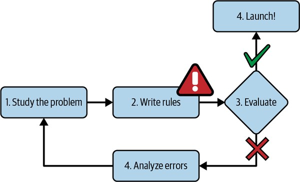
        <span style="display: block; color: #333; font-style: italic; text-align: center; margin-top: 5px; margin-bottom: 15px;"><b>Hình 1-1: Sơ đồ Quy trình Lập trình Truyền thống</b></span>

        
        Dựa trên sơ đồ trong ảnh **`multimodal_39`**:
        *   Quy trình vận hành theo tuyến tính: **Nghiên cứu vấn đề (Study the problem)** $\rightarrow$ **Tự viết các quy tắc (Write rules)** $\rightarrow$ **Đánh giá (Evaluate)**.
        *   Nếu kết quả đánh giá không đạt (nhánh dấu $\times$ màu đỏ): Quay lại bước 1 và lặp lại vòng tuần hoàn.
        *   Nếu đạt yêu cầu (nhánh tích v xanh): Tiến hành **Ra mắt (Launch!)**.
        *   *Hạn chế:* Điểm nghẽn nằm ở bước "Write rules" (được cảnh báo bằng biểu tượng tam giác đỏ chấm than). Khi bài toán phức tạp, danh sách luật này sẽ phình to mất kiểm soát.
    
    *   **Quy trình Học máy (Hình 1-2):**
        
        
        <span style="display: block; color: #333; font-style: italic; text-align: center; margin-top: 5px; margin-bottom: 15px;"><b>Hình 1-2: Sơ đồ Quy trình Học máy tương tác</b></span>

        
        Dựa trên sơ đồ trong ảnh **`multimodal_40`**:
        *   Lập trình viên không viết luật thủ công. Bước "Write rules" được thay thế hoàn toàn bằng bước **Huấn luyện mô hình ML (Train ML model)**.
        *   Mô hình được huấn luyện dựa trên lượng dữ liệu phong phú đầu vào. Sau đó, quy trình đi đến bước **Đánh giá (Evaluate)** và **Ra mắt (Launch!)** tương tự.
    
    *   **Quy trình Tự thích thích ứng (Hình 1-3):**
        
        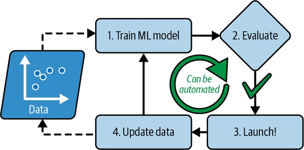
        <span style="display: block; color: #333; font-style: italic; text-align: center; margin-top: 5px; margin-bottom: 15px;"><b>Hình 1-3: Cơ chế tự động cập nhật dữ liệu và tái huấn luyện</b></span>

        
        Dựa trên sơ đồ trong ảnh **`multimodal_41`**:
        *   Hệ thống Học máy có khả năng tự động hóa quy trình cải tiến: Khi mô hình đã ra mắt, dữ liệu mới liên tục đổ về từ thực tế sinh hoạt dọn rác của người dùng (**Update data**) $\rightarrow$ dữ liệu mới nạp vào tập huấn luyện $\rightarrow$ kích hoạt tự động tái huấn luyện mô hình (**Train ML model**). Quy trình này giúp hệ thống tự động thích ứng với các thay đổi mà không cần con người can thiệp. (Ví dụ: khi kẻ gửi thư rác đổi cụm từ "4U" thành "For U", mô hình tự động phát hiện cụm từ này xuất hiện nhiều bất thường trong thư rác và tự động chặn).

---

**3. Khai phá dữ liệu (Data Mining)**

*   **Giải thích bản chất:** 
    Một mô hình Học máy sau khi huấn luyện thành công không chỉ phục vụ việc dự đoán tự động, mà bản thân cấu trúc đã học của nó là một kho tàng thông tin. Bằng cách kiểm tra và phân tích xem mô hình đã học được những đặc trưng hay mối tương quan nào mạnh nhất, con người có thể phát hiện ra các quy luật ẩn sâu trong dữ liệu mà trước đây mắt thường không thể thấy. Quá trình đào sâu vào lượng dữ liệu khổng lồ để khám phá các mẫu ẩn này được gọi là **Khai phá dữ liệu (Data Mining)**.
*   **Ví dụ thực tế trong tài liệu:**
    Sau khi huấn luyện bộ lọc thư rác, chúng ta có thể kiểm tra danh sách các từ và sự kết hợp từ mà mô hình tin là yếu tố dự báo thư rác tốt nhất. Việc này giúp phát hiện ra các xu hướng gửi thư rác mới của tin tặc.

*   **Giải thích trực quan dựa trên sơ đồ (Hình 1-4):**
    
    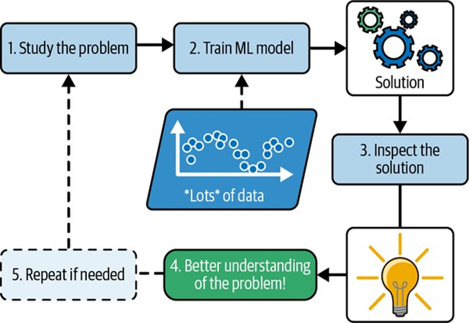
    <span style="display: block; color: #333; font-style: italic; text-align: center; margin-top: 5px; margin-bottom: 15px;"><b>Hình 1-4: Sơ đồ Học máy giúp con người học hỏi và khai phá tri thức</b></span>

    
    Dựa trên sơ đồ trong ảnh **`multimodal_42`**:
    *   Dữ liệu thô đưa vào huấn luyện mô hình Học máy (**Train ML model**).
    *   Khi có mô hình tốt, chúng ta tiến hành bước **Kiểm tra giải pháp (Inspect the solution)** để xem mô hình đưa ra quyết định dựa trên cơ sở nào.
    *   Kết quả thu được sẽ mang lại **Hiểu biết sâu sắc hơn về vấn đề (Better understanding of the problem!)**, tạo thành một luồng phản hồi ngược giúp con người điều chỉnh lại cách nghiên cứu vấn đề.

---

**4. Dự báo Chỉ số Hài lòng Cuộc sống (Life Satisfaction) dựa trên GDP (Ví dụ 1-1)**

*   **Giải thích bản chất:**
    Tài liệu giới thiệu một nghiên cứu thực tế về mối tương quan giữa sự thịnh vượng kinh tế của một quốc gia đại diện bởi **GDP đầu người (GDP per capita)** và chỉ số hạnh phúc đại diện bởi **Mức độ hài lòng cuộc sống (Life satisfaction)**. 
    
    Để giải quyết bài toán hồi quy (regression) này, tài liệu so sánh hai phương pháp tổng quát hóa khác nhau:
    1.  **Hồi quy tuyến tính (Linear Regression - Học dựa trên mô hình):** Giả định mối quan hệ giữa GDP và sự hài lòng cuộc sống có dạng đường thẳng. Mô hình sẽ tối thiểu hóa khoảng cách sai số bình phương giữa đường thẳng dự đoán và các điểm dữ liệu thực tế để tìm ra hai tham số tối ưu $\theta_0$ và $\theta_1$.
    2.  **Hồi quy k-Láng giềng gần nhất (k-Nearest Neighbors Regression - Học dựa trên thực thể):** Không giả định bất kỳ hàm số nào. Khi cần dự đoán sự hài lòng cho một quốc gia mới, mô hình sẽ tìm $k$ quốc gia có GDP đầu người gần nhất trong tập huấn luyện, sau đó tính trung bình cộng chỉ số hài lòng của chúng để đưa ra kết quả dự đoán.

*   **Giải thích trực quan dựa trên hình ảnh:**
    *   **Hình 1-18 (Dữ liệu thô):** 
        
        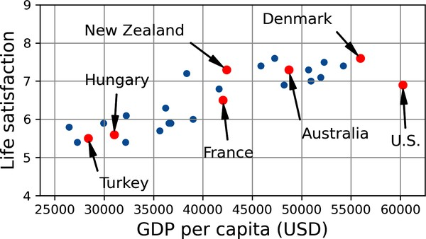
        <span style="display: block; color: #333; font-style: italic; text-align: center; margin-top: 5px; margin-bottom: 15px;"><b>Hình 1-18: Biểu đồ phân tán dữ liệu GDP đầu người và Chỉ số Hài lòng cuộc sống</b></span>

        
        Biểu đồ phân tán trong ảnh **`multimodal_0`** cho thấy xu hướng rõ rệt: khi GDP đầu người tăng dần từ \$25.000 lên \$60.000, các điểm dữ liệu sự hài lòng cuộc sống cũng có xu hướng đi lên gần như tuyến tính (từ mức 5.0 lên gần 8.0).
    *   **Hình 1-20 (Mô hình tuyến tính tối ưu nhất):**
        
        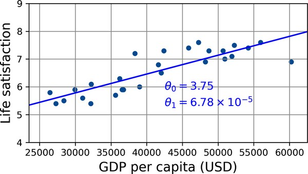
        <span style="display: block; color: #333; font-style: italic; text-align: center; margin-top: 5px; margin-bottom: 15px;"><b>Hình 1-20: Đường thẳng hồi quy tuyến tính phù hợp nhất</b></span>

        
        Biểu đồ trong ảnh **`multimodal_59`** biểu diễn đường thẳng tối ưu nhất được huấn luyện bởi thuật toán Hồi quy tuyến tính. Đường thẳng có phương trình:
        
        $$\text{life\_satisfaction} = 3.75 + 6.78 \times 10^{-5} \times \text{GDP\_per\_capita} \quad$$
        
        Khi áp dụng mô hình này để dự đoán cho quốc gia **Síp (Cyprus)** có GDP đầu người là **\$37.655**, ta dóng thẳng đứng từ tọa độ \$37.655 trên trục hoành lên gặp đường thẳng hồi quy tại điểm đỏ, dóng ngang sang trục tung thu được giá trị dự đoán là **`6.30`** (Hình ảnh hiển thị chi tiết tại ảnh **`multimodal_3`** và **`multimodal_34`**).

*   **Mã nguồn Python minh họa (Tái lập Ví dụ 1-1 & So sánh với KNN):**
    ```python
    import matplotlib.pyplot as plt
    import numpy as np
    import pandas as pd
    from sklearn.linear_model import LinearRegression
    from sklearn.neighbors import KNeighborsRegressor

    # 1. Tải và chuẩn bị dữ liệu (Ví dụ 1-1 từ tài liệu)
    data_root = "https://github.com/ageron/data/raw/main/"
    lifesat = pd.read_csv(data_root + "lifesat/lifesat.csv")
    
    X = lifesat[["GDP per capita (USD)"]].values
    y = lifesat[["Life satisfaction"]].values

    # 2. Trực quan hóa dữ liệu gốc (Hình 1-18)
    lifesat.plot(kind='scatter', grid=True,
                 x="GDP per capita (USD)", y="Life satisfaction")
    plt.axis()
    plt.show()

    # ==========================================
    # PHƯƠNG PHÁP A: HỌC DỰA TRÊN MÔ HÌNH (Linear Regression)
    # ==========================================
    # Chọn mô hình tuyến tính
    model_linear = LinearRegression()

    # Huấn luyện mô hình trên dữ liệu thực tế
    model_linear.fit(X, y)

    # Đưa ra dự đoán cho quốc gia Síp (Cyprus) có GDP là $37,655.2
    X_new = [[37655.2]]
    pred_linear = model_linear.predict(X_new)
    print(f"Dự đoán của Hồi quy tuyến tính cho Síp: {pred_linear:.2f}") # Kết quả: 6.30

    # ==========================================
    # PHƯƠNG PHÁP B: HỌC DỰA TRÊN THỰC THỂ (k-Nearest Neighbors với k = 3)
    # ==========================================
    # Thay thế mô hình tuyến tính bằng Hồi quy láng giềng gần nhất (k = 3)
    model_knn = KNeighborsRegressor(n_neighbors=3)
    model_knn.fit(X, y)

    pred_knn = model_knn.predict(X_new)
    print(f"Dự đoán của k-NN (k = 3) cho Síp: {pred_knn:.2f}") # Kết quả: 6.33
    
    # Giải thích từ tài liệu: 3 quốc gia có GDP gần Síp ($37.655) nhất là:
    # Israel ($38.341 - Hài lòng: 7.2), Litva (Hài lòng: 5.9), và Slovenia (Hài lòng: 5.9).
    # Trung bình cộng: (7.2 + 5.9 + 5.9) / 3 = 6.33.
    ```

---

Tôi đã hoàn thành việc biên soạn **Phần 2: Giám sát huấn luyện** của **Chương 1: Bức tranh tổng quan về Học máy** một cách trực quan, chi tiết và khoa học nhất, đồng thời cập nhật nhật ký tiến độ dự án của chúng ta. 

Dưới đây là chi tiết nội dung của phần này:

---

---

</details>

<details>
<summary><b style="font-size:1.2em">PHẦN 2: CÁC HÌNH THỨC GIÁM SÁT HUÂN LUYỆN TRONG HỌC MÁY</b></summary>
<br>

**1. Học có giám sát (Supervised Learning)**

*   **Giải thích bản chất:** 
    Trong học có giám sát, tập dữ liệu huấn luyện mà bạn cung cấp cho thuật toán đã bao gồm sẵn các kết quả mong muốn, được gọi là **nhãn (labels)**. Nhiệm vụ của mô hình là tìm ra quy luật ánh xạ từ đặc trưng đầu vào để dự đoán nhãn cho các mẫu dữ liệu mới.
*   **Ví dụ thực tế trong tài liệu:**
    *   **Phân loại (Classification):** Bộ lọc thư rác. Mô hình được huấn luyện bằng hàng ngàn email đã được gán nhãn trước là "thư rác" (spam) hoặc "thư hợp lệ" (ham). Nhiệm vụ của nó là học cách phân loại chính xác các email mới nhận.
    *   **Hồi quy (Regression):** Dự báo một giá trị số mục tiêu (ví dụ: giá của một chiếc ô tô) dựa trên một tập hợp các đặc trưng đầu vào (như số dặm, tuổi thọ, thương hiệu...). Để huấn luyện, hệ thống cần được cung cấp nhiều ví dụ về ô tô kèm theo giá bán thực tế của chúng.
    *   *Mối liên hệ đặc biệt:* Một số mô hình hồi quy có thể dùng để phân loại và ngược lại. Ví dụ, **Hồi quy Logistic** thường được sử dụng cho bài toán phân loại vì nó có khả năng xuất ra một giá trị số thực từ 0 đến 1 thể hiện xác suất thuộc về một lớp nhất định (như 20% khả năng là thư rác).
*   **Giải thích trực quan dựa trên sơ đồ (Hình 1-5):**
    
    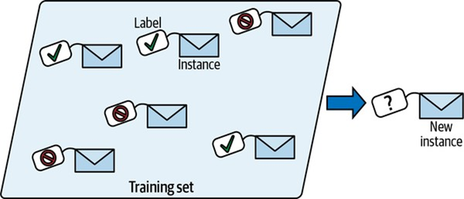
    <span style="display: block; color: #333; font-style: italic; text-align: center; margin-top: 5px; margin-bottom: 15px;"><b>Hình 1-5: Một tập huấn luyện có nhãn để phân loại thư rác</b></span>

    
    Dựa trên sơ đồ trong ảnh **`multimodal_39`**:
    *   Chúng ta thấy một tập huấn luyện (**Training set**) gồm các bức thư điện tử (bản ghi dữ liệu - **Instance**). Mỗi bức thư đều có một chiếc thẻ treo đi kèm ghi rõ nhãn "tích xanh" (đại diện cho thư sạch) hoặc nhãn "cấm" (đại diện cho thư rác). 
    *   Khi một bản ghi mới (**New instance**) xuất hiện dưới dạng một phong bì có gắn dấu hỏi chấm (`?`), mô hình sẽ dựa trên các mẫu nhãn đã học để dự đoán và gán nhãn chính xác cho nó.

*   **Mã nguồn Python minh họa (Hồi quy Logistic phân loại nhị phân cơ bản):**
    ```python
    from sklearn.linear_model import LogisticRegression
    import numpy as np

    # Giả lập dữ liệu huấn luyện: 1 đặc trưng đầu vào (Ví dụ: Số từ nhạy cảm trong email)
    # Nhãn: 1 là Thư rác, 0 là Thư sạch
    X_train = np.array([,,,,,])
    y_train = np.array()

    # Khởi tạo và huấn luyện mô hình hồi quy Logistic
    log_reg = LogisticRegression()
    log_reg.fit(X_train, y_train)

    # Dự đoán cho một email mới có 7 từ nhạy cảm
    X_new = np.array([])
    prediction = log_reg.predict(X_new)
    probability = log_reg.predict_proba(X_new)

    print("Nhãn dự đoán (1 là Spam, 0 là Ham):", prediction)
    print(f"Xác suất thuộc các lớp (Ham, Spam): {probability.round(4)}")
    ```

---

**2. Học không giám sát (Unsupervised Learning)**

*   **Giải thích bản chất:** 
    Trong học không giám sát, dữ liệu huấn luyện hoàn toàn **không được gán nhãn**. Hệ thống phải tự nỗ lực khám phá cấu trúc ẩn, các mối liên kết hoặc phân phối của dữ liệu mà không có bất kỳ sự hướng dẫn nào từ giáo viên.
*   **Ví dụ thực tế trong tài liệu:**
    *   **Phân cụm (Clustering):** Phân khúc khách truy cập blog. Thuật toán tự phát hiện các nhóm khách hàng có hành vi tương đồng (ví dụ: nhóm 40% là học sinh thích đọc truyện tranh sau giờ học, nhóm 20% là người lớn thích khoa học viễn tưởng đọc vào cuối tuần).
    *   **Trực quan hóa & Giảm chiều (Visualization & Dimensionality Reduction):** Thuật toán trực quan hóa (như t-SNE) nhận vào dữ liệu nhiều chiều phức tạp, xuất ra biểu diễn 2D hoặc 3D giúp con người vẽ đồ thị và nhận diện các cấu trúc phân cụm tự nhiên. Giảm chiều giúp đơn giản hóa dữ liệu bằng cách hợp nhất các đặc trưng tương quan (ví dụ: gộp số dặm đã đi và tuổi thọ của xe thành đặc trưng "độ hao mòn" duy nhất).
    *   **Phát hiện bất thường (Anomaly Detection):** Học từ các mẫu dữ liệu bình thường để gán nhãn cảnh báo cho các trường hợp bất thường (ví dụ: giao dịch thẻ tín dụng giả mạo, lỗi sản xuất).
    *   **Học luật kết hợp (Association Rule Learning):** Đào sâu vào lượng giao dịch khổng lồ để tìm ra mối liên hệ thú vị (ví dụ: khách siêu thị mua bít tết và sốt thịt nướng thì cũng thường mua thêm khoai tây chiên).
*   **Giải thích trực quan dựa trên sơ đồ (Hình 1-10):**
    
    
    <span style="display: block; color: #333; font-style: italic; text-align: center; margin-top: 5px; margin-bottom: 15px;"><b>Hình 1-10: Sơ đồ phát hiện bất thường</b></span>

    
    Dựa trên sơ đồ trong ảnh **`multimodal_44`**:
    *   Chúng ta quan sát thấy một tập dữ liệu gồm các điểm tròn xanh phân bổ trên mặt phẳng hai chiều (Feature 1 và Feature 2). Mô hình được huấn luyện chủ yếu trên cụm dữ liệu bình thường tập trung dày đặc ở trung tâm (**Normal**). 
    *   Khi một điểm dữ liệu mới xuất hiện có vị trí rất xa cụm trung tâm này (ký hiệu bằng dấu chữ thập đỏ `X` kèm nhãn **Anomaly**), hệ thống sẽ lập tức nhận diện nó là một điểm dị thường do nó nằm ngoài phạm vi phân bổ thông thường đã học.

*   **Mã nguồn Python minh họa (Phân cụm K-Means không giám sát):**
    ```python
    from sklearn.cluster import KMeans
    import numpy as np

    # Giả lập dữ liệu tọa độ của khách hàng truy cập blog (không có nhãn)
    X_customers = np.array([[1.2, 0.8], [1.0, 1.1], [1.5, 0.9],
                            [8.2, 9.1], [9.0, 8.5], [8.6, 8.8]])

    # Áp dụng thuật toán K-Means phân thành 2 cụm độc lập
    kmeans = KMeans(n_clusters=2, random_state=42, n_init="auto")
    kmeans.fit(X_customers)

    # In ra các nhãn nhóm tự động gán cho từng khách hàng
    print("Nhãn nhóm tự động của các khách hàng:", kmeans.labels_)
    # Kết quả sẽ phân tách rõ rệt: 3 khách hàng đầu thuộc nhóm 0, 3 khách sau thuộc nhóm 1
    ```

---

**3. Học bán giám sát (Semi-supervised Learning)**

*   **Giải thích bản chất:** 
    Do việc dán nhãn thủ công cho hàng triệu dữ liệu tốn cực kỳ nhiều thời gian và chi phí, các dự án thực tế thường rơi vào tình trạng **dữ liệu không nhãn chiếm đa số, dữ liệu có nhãn chiếm một tỷ lệ rất nhỏ**. Học bán giám sát là sự kết hợp thông minh giữa thuật toán có giám sát và không giám sát nhằm tận dụng tối đa lượng dữ liệu không nhãn khổng lồ để cải thiện độ chính xác phân loại của mô hình.
*   **Ví dụ thực tế trong tài liệu:**
    *   **Google Photos:** Khi bạn tải ảnh lên đám mây, hệ thống tự động nhận diện khuôn mặt giống nhau xuất hiện trong nhiều bức ảnh khác nhau (đây là phần không giám sát - Phân cụm). Sau đó, hệ thống chỉ cần bạn gán nhãn tên cho một bức ảnh duy nhất của từng khuôn mặt (đây là phần có giám sát) để tự động đặt tên chính xác cho người đó trên toàn bộ hàng ngàn bức ảnh còn lại.
*   **Giải thích trực quan dựa trên sơ đồ (Hình 1-11):**
    
    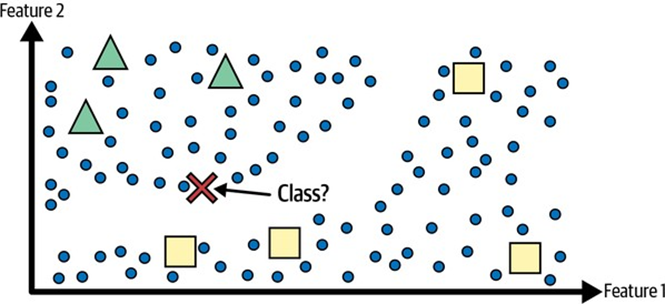
    <span style="display: block; color: #333; font-style: italic; text-align: center; margin-top: 5px; margin-bottom: 15px;"><b>Hình 1-11: Sơ đồ minh họa Học bán giám sát</b></span>

    
    Dựa trên sơ đồ trong ảnh **`multimodal_51`**:
    *   Chúng ta thấy một không gian dữ liệu gồm một vài hình Tam giác màu xanh lá và một vài hình Vuông màu vàng đại diện cho lớp có nhãn. Hàng chục vòng tròn nhỏ màu xanh dương rải rác đại diện cho các trường hợp không nhãn. 
    *   Một trường hợp kiểm thử mới (Dấu chữ thập đỏ `X`) nằm ở ranh giới giữa hai nhóm. Nếu chỉ dùng dữ liệu có nhãn (học có giám sát), dấu chữ thập `X` nằm gần các hình vuông có nhãn hơn nên sẽ bị phân loại sai thành hình vuông. 
    *   Tuy nhiên, nhờ sự hiện diện của các vòng tròn không nhãn, thuật toán bán giám sát nhận diện ra được một cấu trúc liên tục nối liền dấu chữ thập `X` với cụm tam giác ở phía trên. Kết quả là mô hình vẽ được đường biên quyết định tối ưu (đường nét đứt) và phân loại chính xác dấu chữ thập `X` vào lớp Tam giác.

*   **Mã nguồn Python minh họa (Thuật toán truyền nhãn Label Spreading):**
    ```python
    from sklearn.semi_supervised import LabelSpreading
    import numpy as np

    # Giả lập tập dữ liệu: nhãn -1 đại diện cho các mẫu chưa được dán nhãn
    X_semi = np.array([[1.0, 1.0], [1.2, 0.9], [1.1, 1.1],  # Cụm 1
                       [8.0, 8.0], [8.5, 7.9], [8.2, 8.1]]) # Cụm 2
    # Chỉ dán nhãn cho phần tử đầu tiên (nhãn 0) và phần tử thứ tư (nhãn 1)
    y_semi = np.array([0, -1, -1, 1, -1, -1])

    # Khởi tạo và huấn luyện mô hình truyền nhãn
    label_spread = LabelSpreading(kernel='knn', n_neighbors=2)
    label_spread.fit(X_semi, y_semi)

    # Xem kết quả truyền nhãn tự động cho toàn bộ tập dữ liệu
    print("Nhãn sau khi truyền tự động:", label_spread.transduction_)
    # Kết quả kỳ vọng: array()
    ```

---

**4. Học tự giám sát (Self-supervised Learning)**

*   **Giải thích bản chất:** 
    Học tự giám sát là một cách tiếp cận đặc biệt nhằm **tự động tạo ra một tập dữ liệu có nhãn đầy đủ từ một tập dữ liệu hoàn toàn không được gắn nhãn**. Bản chất kỹ thuật là mô hình tự che giấu hoặc biến đổi một phần dữ liệu đầu vào, sau đó tự đặt mục tiêu (nhãn) là khôi phục hoặc dự đoán lại phần dữ liệu bị thiếu đó. 
    
    Học tự giám sát thường được sử dụng như một bước **Tiền huấn luyện (Pre-training)** để mô hình học được các biểu diễn đặc trưng sâu sắc trước khi thực hiện **Tinh chỉnh (Fine-tuning)** trên một tập dữ liệu có nhãn thực tế nhỏ hơn nhiều.
*   **Ví dụ thực tế trong tài liệu:**
    Huấn luyện một mô hình sửa chữa hình ảnh bị hỏng. Hệ thống nhận vào một lượng lớn ảnh không nhãn từ internet, tự ý che một phần nhỏ của mỗi bức ảnh (làm đầu vào) và dùng chính bức ảnh gốc sạch ban đầu để làm nhãn huấn luyện. Một khi nó hoạt động tốt, nó sẽ tự động phân biệt được các đặc trưng ngữ nghĩa tốt (khi nó sửa chữa một hình ảnh mèo bị che mặt, nó phải biết tự bù đắp mặt mèo mà không vẽ nhầm thành mặt chó).
*   **Giải thích trực quan dựa trên sơ đồ (Hình 1-12):**
    
    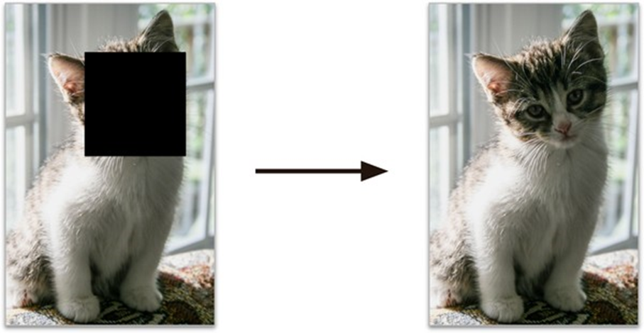
    <span style="display: block; color: #333; font-style: italic; text-align: center; margin-top: 5px; margin-bottom: 15px;"><b>Hình 1-12: Ví dụ học tự giám sát: đầu vào (trái) và mục tiêu (phải)</b></span>

    
    Dựa trên sơ đồ trong ảnh **`multimodal_46`**:
    *   **Đầu vào (ảnh bên trái):** Một bức ảnh mèo con dễ thương bị dán đè một khối hình vuông màu đen che khuất hoàn toàn phần mặt của chú mèo.
    *   **Mục tiêu huấn luyện (ảnh bên phải - Nhãn):** Là bức ảnh mèo con gốc nguyên vẹn và sắc nét. Mô hình phải tự tìm hiểu các liên kết pixel xung quanh phần bị che để tái cấu trúc lại phần bị che giấu này.

*   **Mã nguồn Python minh họa (Tạo nhiễu che và nhãn tự giám sát bằng NumPy):**
    ```python
    import numpy as np

    # Giả lập một hình ảnh phẳng 1 chiều kích thước 10 pixel
    original_image = np.array()

    # Bước tự giám sát: Tự tạo mặt nạ che khuất (mask) ngẫu nhiên làm đầu vào huấn luyện
    input_masked = original_image.copy()
    input_masked[3:7] = 0  # Che các pixel ở giữa bằng màu đen (0)

    # Nhãn mục tiêu chính là bức ảnh gốc nguyên vẹn ban đầu!
    target_labels = original_image.copy()

    print("Đầu vào mô hình (Bị che):", input_masked)
    print("Nhãn mục tiêu tự giám sát:", target_labels)
    ```

---

**5. Học tăng cường (Reinforcement Learning)**

*   **Giải thích bản chất:** 
    Học tăng cường là một trường phái hoàn toàn khác biệt. Hệ thống học (được gọi là **Tác nhân - Agent**) sẽ liên tục tương tác với một **Môi trường (Environment)** thông qua việc quan sát trạng thái, đưa ra quyết định thực hiện các **Hành động (Actions)**. 
    
    Dựa trên kết quả của hành động, môi trường sẽ phản hồi lại cho tác nhân các tín hiệu **Phần thưởng (Rewards)** hoặc **Hình phạt (Penalties - phần thưởng âm)**. Mục tiêu tối thượng của tác nhân là tự động tìm ra và tối ưu hóa một chiến lược hành động (được gọi là **Chính sách - Policy**) nhằm tối đa hóa tổng số phần thưởng tích lũy thu được theo thời gian.
*   **Ví dụ thực tế trong tài liệu:**
    *   **Robot học đi bộ:** Các robot thực hiện hành trình bước đi trên các địa hình gồ ghề không xác định, liên tục hiệu chỉnh khớp chân dựa trên phần thưởng khi tiến về phía trước và hình phạt khi bị ngã.
    *   **AlphaGo (DeepMind):** Hệ thống chơi cờ vây siêu cấp học chính sách chiến thắng bằng cách tự chơi hàng triệu ván đấu chống lại chính nó.
*   **Giải thích trực quan dựa trên sơ đồ (Hình 1-13):**
    
    
    <span style="display: block; color: #333; font-style: italic; text-align: center; margin-top: 5px; margin-bottom: 15px;"><b>Hình 1-13: Quy trình hoạt động của Học tăng cường</b></span>

    
    Dựa trên sơ đồ trong ảnh **`multimodal_47`**:
    *   Chúng ta thấy quy trình tuần hoàn khép kín gồm 6 bước của một chú robot nhỏ (Agent):
        1.  **Observe (Quan sát):** Robot quan sát môi trường xung quanh (nhận thấy bên trái có ngọn lửa bùng cháy, bên phải có một vòi nước đang chảy và một chiếc xô rỗng).
        2.  **Select action using policy (Chọn hành động dựa trên chính sách):** Robot đưa ra quyết định di chuyển.
        3.  **Action! (Hành động):** Robot di chuyển sang bên trái và chạm tay vào ngọn lửa.
        4.  **Get reward or penalty (Nhận phần thưởng hoặc hình phạt):** Vì chạm vào lửa bị bỏng, môi trường phạt robot nặng nề (**-50 points** kèm tiếng kêu "Ouch!").
        5.  **Update policy (Cập nhật chính sách - Bước học tập):** Robot ghi nhớ sâu sắc bài học kinh nghiệm: *"Chạm vào lửa = rất tệ! Lần sau phải chủ động né tránh"*.
        6.  **Iterate (Lặp lại):** Robot tiếp tục thử nghiệm hướng đi mới (sang phải lấy nước dập lửa) cho đến khi tìm ra chuỗi hành động tối ưu để hoàn thành nhiệm vụ an toàn.

---

# BẢNG TỔNG HỢP SO SÁNH CÁC HÌNH THỨC GIÁM SÁT HUÂN LUYỆN

Dưới đây là bảng đối chiếu tóm tắt giúp bạn dễ dàng hệ thống hóa toàn bộ kiến thức của Phần 2:

| Tiêu chí đối chiếu | Học có giám sát (Supervised) | Học không giám sát (Unsupervised) | Học bán giám sát (Semi-supervised) | Học tự giám sát (Self-supervised) | Học tăng cường (Reinforcement) |
| :--- | :---: | :---: | :---: | :---: | :---: |
| **Trạng thái nhãn gốc** | Có nhãn đầy đủ | Hoàn toàn không nhãn | Chỉ có một phần rất nhỏ có nhãn | Hoàn toàn không nhãn | Không có nhãn (chỉ có tín hiệu phần thưởng) |
| **Cơ chế nhãn khi học** | Sử dụng nhãn của con người cung cấp | Không sử dụng nhãn | Truyền nhãn tự động từ cụm sang mẫu trống | Tự tạo nhãn bằng cách che/biến đổi dữ liệu | Tự tối ưu hóa qua thử sai và phần thưởng |
| **Tác vụ tiêu biểu** | Phân loại, Hồi quy | Phân cụm, Giảm chiều, Phát hiện dị thường | Phân khúc, Phân loại dữ liệu khan hiếm nhãn | Tiền huấn luyện mô hình sâu, Khôi phục ảnh | Robot tự hành, Bot chơi game trí tuệ |

---

---

</details>

<details>
<summary><b style="font-size:1.2em">PHẦN 3: CÁC HÌNH THỨC TỔNG QUÁT HÓA – HỌC DỰA TRÊN THỰC THỂ VS HỌC DỰA TRÊN MÔ HÌNH</b></summary>
<br>

Hầu hết các tác vụ Học máy đều hướng tới một mục tiêu tối thượng: **đưa ra dự đoán chính xác cho các mẫu dữ liệu mới chưa từng thấy trong quá trình huấn luyện (khả năng Tổng quát hóa - Generalization)** [cite: 80, 101]. Thước đo hiệu suất cao trên tập huấn luyện chỉ là điều kiện cần; khả năng hoạt động tốt trên dữ liệu thực tế mới là điều kiện đủ. 

Để đạt được khả năng tổng quát hóa này, Học máy chia thành hai trường phái tiếp cận tư duy hoàn toàn khác biệt: **Học dựa trên thực thể (Instance-based Learning)** và **Học dựa trên mô hình (Model-based Learning)** [cite: 80, 86, 101].

---

**1. Học dựa trên thực thể (Instance-based Learning)**

*   **Giải thích bản chất:** 
    Đây là hình thức học tập trực quan và đơn giản nhất, hoạt động dựa trên cơ chế **học thuộc lòng (rote learning)**. Hệ thống sẽ trực tiếp ghi nhớ toàn bộ các ví dụ huấn luyện được cung cấp [cite: 27, 102, 120]. 
    
    Khi xuất hiện một mẫu dữ liệu mới cần dự đoán, hệ thống sẽ sử dụng một **Thước đo độ tương đồng (Similarity Measure)** để so sánh mẫu mới đó với các mẫu đã ghi nhớ, từ đó gán nhãn hoặc ước tính giá trị dựa trên các mẫu tương đồng nhất [cite: 27, 102, 120].
*   **Giải thích trực quan dựa trên sơ đồ (Hình 1-16):**
    
    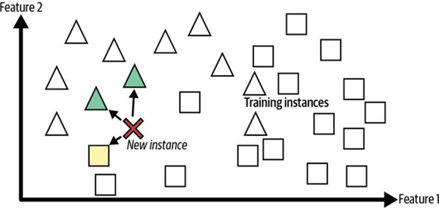
    <span style="display: block; color: #333; font-style: italic; text-align: center; margin-top: 5px; margin-bottom: 15px;"><b>Hình 1-16: Cơ chế phân loại của Học dựa trên thực thể</b></span>

    
    Dựa trên sơ đồ trong ảnh **`multimodal_64`**:
    *   **Tập huấn luyện (Training instances):** Gồm các hình Tam giác và hình Vuông đã biết trước nhãn, phân bổ rải rác trên không gian đặc trưng hai chiều (Feature 1 và Feature 2).
    *   **Trường hợp mới (New instance):** Được ký hiệu bằng một dấu chữ thập màu đỏ (`X`) ở chính giữa.
    *   **Cơ chế ra quyết định:** Hệ thống vẽ ra 3 mũi tên nối từ dấu `X` đến 3 điểm dữ liệu láng giềng nằm gần nó nhất (gồm 2 hình Tam giác xanh và 1 hình Vuông vàng). Vì đa số các trường hợp tương tự nhất thuộc về lớp Tam giác (tỷ lệ 2/3), dấu chữ thập `X` lập tức được phân loại an toàn vào lớp Tam giác.
*   **Ví dụ thực tế trong tài liệu:**
    *   **Hồi quy k-Láng giềng gần nhất (k-Nearest Neighbors Regression):** Để dự đoán mức độ hài lòng cuộc sống của nước Síp (Cyprus), thuật toán không tính toán hàm số nào. Nó chỉ tra cứu ra 3 quốc gia có GDP đầu người gần với Síp nhất trong cơ sở dữ liệu: Israel (Hài lòng: 7.2), Litva (Hài lòng: 5.9), và Slovenia (Hài lòng: 5.9). Điểm dự đoán cuối cùng là trung bình cộng của 3 quốc gia này: $\frac{7.2 + 5.9 + 5.9}{3} = \mathbf{6.33}$.

---

**2. Học dựa trên mô hình (Model-based Learning)**

*   **Giải thích bản chất:** 
    Khác với việc ghi nhớ máy móc toàn bộ dữ liệu, học dựa trên mô hình lựa chọn cách tiếp cận khái quát hơn: **phát hiện các mẫu (patterns) ẩn sâu trong tập huấn luyện để xây dựng nên một mô hình toán học dự đoán**, tương tự như cách các nhà khoa học phát minh định luật [cite: 86, 103, 120].
    
    Một khi mô hình toán học này đã được huấn luyện (xác định xong các tham số tối ưu), chúng ta **có thể giải phóng và xóa bỏ toàn bộ tập dữ liệu huấn luyện thô** để tiết kiệm bộ nhớ. Việc đưa ra dự đoán cho mẫu mới (suy luận) chỉ đơn giản là nạp dữ liệu vào phương trình toán học đã xây dựng.
*   **Giải thích trực quan dựa trên sơ đồ (Hình 1-17):**
    
    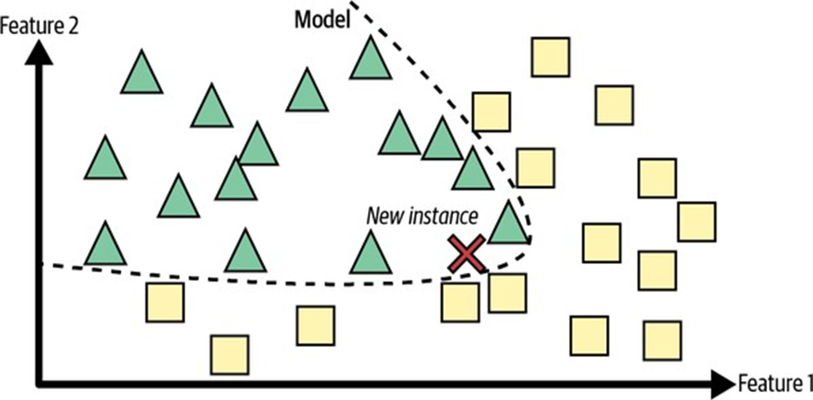
    <span style="display: block; color: #333; font-style: italic; text-align: center; margin-top: 5px; margin-bottom: 15px;"><b>Hình 1-17: Quy trình tổng quát của Học dựa trên mô hình</b></span>

    
    Dựa trên sơ đồ trong ảnh **`multimodal_65`**:
    *   Từ tập huấn luyện ban đầu (hình Tam giác và hình Vuông phân bổ lộn xộn), thuật toán tìm cách vẽ ra một **Đường biên quyết định (Decision Boundary)** phân tách tối ưu hai lớp dữ liệu (đường đứt nét cong).
    *   Đường cong này chính là mô hình toán học đại diện cho cấu trúc dữ liệu. Khi có dấu chữ thập đỏ `X` mới rơi vào vùng bên trái đường biên, nó được gán nhãn ngay là Tam giác mà không cần so sánh khoảng cách cụ thể với từng điểm dữ liệu thô.

---

**3. Thiết lập Mô hình tuyến tính đơn giản (Ví dụ 1-1)**

*   **Giải thích bản chất:**
    Để hiểu cách một mô hình học tập tham số từ dữ liệu thực tế, tài liệu phân tích chi tiết bài toán **Dự báo chỉ số hài lòng cuộc sống dựa trên GDP đầu người** [cite: 103, 104]. Bước đi đầu tiên của nhà khoa học dữ liệu là quan sát dữ liệu thô để đưa ra giả định mô hình (Model Selection).

*   **Trực quan hóa Dữ liệu thô (Hình 1-18):**
    
    
    <span style="display: block; color: #333; font-style: italic; text-align: center; margin-top: 5px; margin-bottom: 15px;"><b>Hình 1-18: Biểu đồ phân tán GDP đầu người và Chỉ số Hài lòng cuộc sống</b></span>

    
    Dựa trên biểu đồ phân tán trong ảnh **`multimodal_0`** (và bản dán nhãn các quốc gia tiêu biểu ở ảnh **`multimodal_1`** / **`multimodal_66`**):
    *   Các điểm dữ liệu phân bổ theo một xu hướng đi lên rất rõ ràng từ góc dưới bên trái lên góc trên bên phải. Các quốc gia nghèo như Thổ Nhĩ Kỳ có GDP thấp (~ \$28.000) và chỉ số hài lòng thấp (~ 5.5). Ngược lại, các quốc gia giàu như Đan Mạch có GDP rất cao (~ \$56.000) và chỉ số hài lòng rất cao (~ 7.6).
    *   Mặc dù dữ liệu có nhiễu ngẫu nhiên, xu hướng này gợi ý rằng mức độ hài lòng cuộc sống tăng lên gần như tuyến tính theo sự tăng trưởng của GDP đầu người. Do đó, chúng ta đưa ra quyết định chọn **Mô hình tuyến tính (Linear Model)** đơn giản làm giả thuyết nghiên cứu.

*   **Bản chất Toán học của Mô hình (Phương trình 1-1):**
    
    Phương trình tuyến tính biểu diễn mối quan hệ này có dạng (ảnh **`multimodal_67`**):
    
    $$\text{life\_satisfaction} = \theta_0 + \theta_1 \times \text{GDP\_per\_capita} \quad \text{}$$
    
    *Trong đó:*
    *   $\theta_0$ và $\theta_1$ là hai **Tham số mô hình (Model Parameters)**.
    *   $\theta_0$ (Intercept): Điểm giao cắt với trục tung, thể hiện mức độ hài lòng cơ bản giả định khi GDP bằng 0.
    *   $\theta_1$ (Slope / Coefficient): Hệ số góc, thể hiện tốc độ tăng trưởng của chỉ số hạnh phúc ứng với mỗi đô la GDP đầu người tăng thêm.
    *   Mô hình này có chính xác **2 mức độ tự do (Degrees of Freedom)** để điều chỉnh độ cao và độ dốc của đường thẳng nhằm khớp tốt nhất với dữ liệu thực tế.

---

**4. Tìm kiếm tham số tối ưu thông qua Hàm chi phí (Cost Function)**

*   **Giải thích bản chất:**
    Trước khi huấn luyện, các tham số $\theta_0$ và $\theta_1$ có thể nhận bất kỳ giá trị ngẫu nhiên nào, tạo ra vô số đường thẳng hồi quy sai lệch. 
    
    *Trực quan hóa các mô hình giả định (Hình 1-19):*
    
    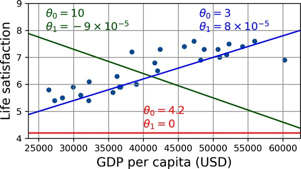
    <span style="display: block; color: #333; font-style: italic; text-align: center; margin-top: 5px; margin-bottom: 15px;"><b>Hình 1-19: Các đường thẳng tuyến tính giả định ban đầu khi thay đổi tham số</b></span>

    
    Dựa trên đồ thị trong ảnh **`multimodal_2`** / **`multimodal_68`**:
    *   **Đường màu đỏ ($\theta_0 = 4.2, \theta_1 = 0$):** Một đường thẳng nằm ngang hoàn toàn phẳng lì, ám chỉ hạnh phúc không liên quan gì đến tiền bạc (mô hình quá đơn giản) [cite: 15, 117].
    *   **Đường màu xanh lá ($\theta_0 = 10, \theta_1 = -9 \times 10^{-5}$):** Một đường thẳng dốc ngược đi xuống, ám chỉ càng nhiều tiền con người càng đau khổ (đi ngược lại xu hướng thực tế).
    *   **Đường màu xanh dương ($\theta_0 = 3, \theta_1 = 8 \times 10^{-5}$):** Một đường thẳng dốc đi lên tương đối hợp lý.
    
    *Bản chất kỹ thuật của quá trình Huấn luyện (Training):*
    Để chọn ra đường thẳng tốt nhất, chúng ta cần một thước đo định lượng để đánh giá. Chúng ta thiết lập một **Hàm chi phí (Cost Function)** đo lường khoảng cách sai lệch (tổng bình phương sai số) giữa giá trị dự đoán của mô hình và các ví dụ thực tế trong tập huấn luyện [cite: 28, 105]. 
    
    Nhiệm vụ của thuật toán hồi quy tuyến tính là thực hiện tối ưu hóa: tìm kiếm cặp giá trị $(\theta_0, \theta_1)$ sao cho **tối thiểu hóa tối đa hàm chi phí này** [cite: 28, 105, 110].

*   **Kết quả Huấn luyện Tối ưu (Hình 1-20):**
    Sau khi chạy thuật toán tối ưu hóa trên dữ liệu 7 quốc gia mẫu, Scikit-Learn tìm ra bộ tham số hoàn hảo nhất là:
    
    $$\theta_0 = 3.75 \quad \text{và} \quad \theta_1 = 6.78 \times 10^{-5} \quad \text{[cite: 16, 105]}$$
    
    Đường thẳng hồi quy tuyến tính phù hợp nhất này được vẽ rực rỡ trên đồ thị **Hình 1-20** (ảnh **`multimodal_3`** / **`multimodal_69`**).

*   **Cơ chế dự đoán (Suy luận - Inference) cho quốc gia Síp:**
    
    $$\text{Hình 1-20 (Chi tiết): Quá trình nội suy giá trị hạnh phúc của nước Síp}$$
    
    Dựa trên đồ thị trong ảnh **`multimodal_4`** / **`multimodal_45`** (dưới cùng):
    *   Nước Síp (Cyprus) là một quốc gia không có sẵn chỉ số hạnh phúc trong dữ liệu gốc. GDP đầu người của Síp tra cứu được là **\$37.655** [cite: 17, 106].
    *   Để đưa ra dự đoán, hệ thống dóng một đường nét đứt màu đỏ thẳng đứng từ vị trí tọa độ $x = 37.655$ trên trục hoành lên cắt đường hồi quy tuyến tính màu xanh dương tại một điểm tròn màu đỏ [cite: 18, 106].
    *   Dóng ngang từ điểm đỏ này sang trục tung, mô hình trả về giá trị dự đoán chính xác là:
        
        $$\hat{y} = 3.75 + 37.655 \times 6.78 \times 10^{-5} \approx \mathbf{6.30} \quad \text{[cite: 18, 106]}$$

---

**5. Mã nguồn Python thực chiến (Tái lập Ví dụ 1-1 & So sánh trực tiếp)**

Đoạn mã hoàn chỉnh dưới đây tải dữ liệu trực tuyến, tách lọc đặc trưng, huấn luyện song song hai trường phái (Hồi quy tuyến tính - dựa trên mô hình và k-NN - dựa trên thực thể) để đối chiếu dự báo cho nước Síp:

```python
import matplotlib.pyplot as plt
import numpy as np
import pandas as pd
from sklearn.linear_model import LinearRegression
from sklearn.neighbors import KNeighborsRegressor

# 1. Tải bộ dữ liệu Hài lòng cuộc sống từ kho lưu trữ của tác giả
data_url = "https://github.com/ageron/data/raw/main/lifesat/lifesat.csv"
lifesat = pd.read_csv(data_url)

# 2. Chuẩn bị ma trận đặc trưng X (GDP) và vector nhãn y (Life Satisfaction)
X = lifesat[["GDP per capita (USD)"]].values
y = lifesat[["Life satisfaction"]].values

# 3. Trực quan hóa dữ liệu thô để xác định xu hướng (Hình 1-18)
lifesat.plot(kind='scatter', grid=True,
             x="GDP per capita (USD)", y="Life satisfaction")
plt.axis()
plt.title("Hình 1-18: Trực quan hóa dữ liệu thô")
plt.show()

# ===================================================
# CÁCH 1: TIẾP CẬN DỰA TRÊN MÔ HÌNH (Linear Regression)
# ===================================================
# Chọn mô hình tuyến tính và huấn luyện (Tìm kiếm theta_0 và theta_1)
model_linear = LinearRegression()
model_linear.fit(X, y)

# Trích xuất các tham số tối ưu học được
t0 = model_linear.intercept_
t1 = model_linear.coef_
print("--- KẾT QUẢ HUẤN LUYỆN DỰA TRÊN MÔ HÌNH ---")
print(f"Hệ số chặn (theta_0): {t0:.2f}")  # Kết quả: 3.75
print(f"Hệ số dốc (theta_1): {t1:.2e}")   # Kết quả: 6.78e-05

# Đưa ra dự đoán suy luận cho Síp (GDP = $37,655.2)
X_cyprus = [[37655.2]]
prediction_linear = model_linear.predict(X_cyprus)
print(f"Chỉ số hạnh phúc dự đoán của Síp (Linear): {prediction_linear:.2f}") # Kết quả: 6.30

# ===================================================
# CÁCH 2: TIẾP CẬN DỰA TRÊN THỰC THỂ (k-NN Regression)
# ===================================================
# Thay đổi mô hình sang k-Nearest Neighbors với k = 3
model_knn = KNeighborsRegressor(n_neighbors=3)
model_knn.fit(X, y)

# Đưa ra dự đoán cho nước Síp dựa trên độ tương đồng láng giềng
prediction_knn = model_knn.predict(X_cyprus)
print("\n--- KẾT QUẢ HỌC DỰA TRÊN THỰC THỂ ---")
print(f"Chỉ số hạnh phúc dự đoán của Síp (k-NN, k=3): {prediction_knn:.2f}") # Kết quả: 6.33
```

---

---

</details>

<details>
<summary><b style="font-size:1.2em">PHẦN 4: CÁC THÁCH THỨC CỐT LÕI CỦA HỌC MÁY (DỮ LIỆU KÉM & THUẬT TOÁN KÉM)</b></summary>
<br>

Trong Học máy, hai nguyên nhân lớn nhất khiến một dự án thất bại là **"Dữ liệu kém"** và **"Thuật toán kém"**. Dưới đây là danh sách các thách thức cốt lõi được sắp xếp theo trình tự logic, đi từ các vấn đề liên quan đến chất lượng/số lượng dữ liệu trước khi chuyển sang các hạn chế của mô hình toán học [cite: 107, 113].

---

**1. Thiếu hụt số lượng dữ liệu huấn luyện (Insufficient Training Data)**

*   **Giải thích bản chất:** 
    Bộ não con người có khả năng tổng quát hóa phi thường (ví dụ: chỉ cần chỉ cho một đứa trẻ vài quả táo là nó có thể nhận ra quả táo ở mọi hình dạng, màu sắc). Ngược lại, hầu hết các thuật toán Học máy hiện nay vẫn chưa đạt tới trình độ đó; chúng đòi hỏi một **lượng dữ liệu khổng lồ** để có thể tự học và hoạt động chính xác. 
    Đối với các tác vụ đơn giản, bạn cần hàng ngàn ví dụ; còn đối với các bài toán phức tạp như nhận dạng giọng nói hoặc thị giác máy tính, con số này phải lên tới hàng triệu mẫu dữ liệu thực tế.
*   **Ví dụ thực tế trong tài liệu ("Hiệu quả không hợp lý của dữ liệu"):**
    Tài liệu trích dẫn nghiên cứu lịch sử kinh điển của Michele Banko và Eric Brill (2001) về bài toán giải quyết mơ hồ ngôn ngữ tự nhiên (ví dụ phân biệt các từ dễ nhầm lẫn như "to", "two", hoặc "too" dựa trên ngữ cảnh). Nghiên cứu chỉ ra rằng khi lượng dữ liệu huấn luyện tăng lên, hiệu suất của tất cả các thuật toán — ngay cả những thuật toán đơn giản nhất — đều được cải thiện rõ rệt và đạt độ chính xác gần như tương đương nhau.
*   **Giải thích trực quan dựa trên sơ đồ (Hình 1-21):**
    
    
    <span style="display: block; color: #333; font-style: italic; text-align: center; margin-top: 5px; margin-bottom: 15px;"><b>Hình 1-21: Biểu đồ nghiên cứu của Banko và Brill về tầm quan trọng của quy mô dữ liệu</b></span>

    
    Dựa trên đồ thị thực tế trong ảnh **`multimodal_64`**:
    *   **Trục hoành (X-axis):** Biểu thị quy mô dữ liệu tính bằng triệu từ (`Millions of Words`), chạy theo thang đo logarithm từ 0.1 triệu đến 1.000 triệu (1 tỷ) từ.
    *   **Trục tung (Y-axis):** Biểu thị độ chính xác trên tập kiểm thử (`Test Accuracy`), chạy từ 0.70 (70%) đến 1.00 (100%).
    *   **Phân tích đường cong:** 
        *   Khi lượng dữ liệu cực kỳ khan hiếm (0.1 triệu từ), thuật toán phức tạp như *Winnow* hoạt động rất tệ (độ chính xác chỉ đạt khoảng 75%), trong khi thuật toán đơn giản dựa trên bộ nhớ (*Memory-Based*) lại dẫn đầu ở mức hơn 83%.
        *   Tuy nhiên, khi quy mô dữ liệu được bơm lớn lên mốc 1.000 triệu từ, **toàn bộ 4 thuật toán khác nhau** (*Memory-Based*, *Winnow*, *Perceptron*, *Naïve Bayes*) đều hội tụ sát nhau ở ngưỡng độ chính xác cực cao (**96% - 98%**). 
    *   *Thông điệp cốt lõi:* Trong nhiều trường hợp phức tạp, việc dành thời gian và ngân sách để **thu thập và phát triển kho dữ liệu huấn luyện phong phú** sẽ mang lại hiệu quả vượt trội hơn nhiều so với việc sa đà vào thiết kế và tinh chỉnh thuật toán phức tạp.

---

**2. Dữ liệu huấn luyện không mang tính đại diện (Unrepresentative Training Data)**

*   **Giải thích bản chất:** 
    Để mô hình có khả năng tổng quát hóa tốt khi gặp dữ liệu thực tế ngoài đời, điều kiện tiên quyết là **tập dữ liệu huấn luyện phải đại diện cho toàn bộ các trường hợp mới mà bạn muốn dự đoán**. Nếu tập huấn luyện bị lệch hoặc thiếu vắng một phân khúc dữ liệu quan trọng, mô hình sẽ đưa ra các dự báo sai lệch và không chính xác đối với phân khúc đó.
    *   **Nhiễu lấy mẫu (Sampling Noise):** Xảy ra khi kích thước mẫu quá nhỏ, khiến các đặc tính của mẫu bị sai lệch do ngẫu nhiên.
    *   **Sai lệch lấy mẫu (Sampling Bias):** Xảy ra ngay cả khi mẫu dữ liệu rất lớn nhưng phương pháp thu thập dữ liệu bị lỗi, khiến một nhóm đối tượng bị thiên vị hoặc bị bỏ sót hoàn toàn khỏi tập dữ liệu.
*   **Ví dụ thực tế trong tài liệu:**
    *   *Sai lệch bầu cử tổng thống Mỹ năm 1936:* Tạp chí *The Literary Digest* khảo sát 10 triệu người (và nhận lại 2.4 triệu phản hồi), dự đoán Landon thắng cử với 57% phiếu. Thực tế Roosevelt thắng áp đảo với 62% phiếu. Sai lầm nằm ở phương pháp lấy mẫu: họ lấy địa chỉ từ danh bạ điện thoại và thành viên câu lạc bộ — những danh sách thiên vị cho những người giàu có (có xu hướng bầu cho Đảng Cộng hòa).
    *   *Bài toán GDP và sự hài lòng cuộc sống:* Tập dữ liệu ban đầu chỉ gồm các quốc gia có GDP từ \$23.500 đến \$62.500, hoàn toàn bỏ qua các quốc gia rất nghèo hoặc rất giàu.
*   **Giải thích trực quan dựa trên sơ đồ (Hình 1-22):**
    
    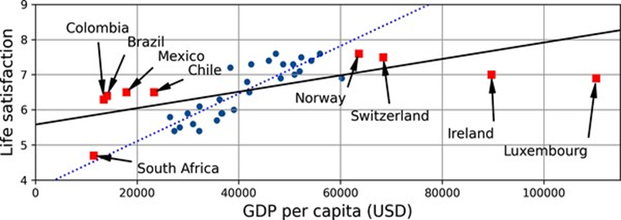
    <span style="display: block; color: #333; font-style: italic; text-align: center; margin-top: 5px; margin-bottom: 15px;"><b>Hình 1-22: So sánh mô hình tuyến tính trên tập dữ liệu khuyết thiếu và tập dữ liệu đại diện</b></span>

    
    Dựa trên biểu đồ trong ảnh **`multimodal_4`** / **`multimodal_41`**:
    *   **Các điểm tròn màu xanh dương:** Là tập dữ liệu huấn luyện gốc bị giới hạn.
    *   **Các điểm vuông màu đỏ:** Là các quốc gia bị thiếu hụt trước đó (gồm các nước nghèo như Nam Phi ở vùng GDP thấp, và các nước rất giàu như Na Uy, Thụy Sĩ, Luxembourg ở vùng GDP cao) [cite: 13, 109].
    *   **Đường chấm chấm màu xanh dương (Linear model on partial data):** Là mô hình tuyến tính cũ được huấn luyện trên tập dữ liệu khuyết. Đường này dốc thẳng lên một cách lạc quan.
    *   **Đường liền nét màu đen (Linear model on all data):** Là mô hình tuyến tính mới sau khi bổ sung các điểm vuông màu đỏ [cite: 14, 17]. 
    *   *Phân tích trực quan:* Đường thẳng màu đen có độ dốc thấp hơn nhiều so với đường cũ. Việc thêm dữ liệu đại diện đã làm rõ một sự thật: **mối quan hệ thực tế giữa GDP và hạnh phúc không đơn thuần là tuyến tính phẳng**. Ở các quốc gia rất giàu (GDP > \$60.000), sự hài lòng cuộc sống có xu hướng đi ngang hoặc thậm chí sụt giảm nhẹ (Na Uy và Thụy Sĩ có chỉ số hài lòng thấp hơn Đan Mạch mặc dù giàu hơn nhiều) [cite: 13, 109].

---

**3. Dữ liệu chất lượng kém (Poor-Quality Data)**

*   **Giải thích bản chất:** 
    Nếu dữ liệu huấn luyện của bạn chứa quá nhiều lỗi đo lường, giá trị ngoại lai dị biệt (outliers) hoặc các giá trị khuyết rỗng (NaN) do hệ thống thu thập kém chất lượng, thuật toán sẽ gặp cực kỳ nhiều khó khăn trong việc phát hiện ra các quy luật bản chất thực sự. Hệ thống Học máy sẽ rơi vào tình trạng **"Đầu vào rác, đầu ra rác" (Garbage In, Garbage Out)**.
*   **Cách thức giải quyết trong thực tế:**
    Để nâng cao chất lượng dữ liệu, các nhà khoa học dữ liệu thường phải dành phần lớn thời gian dự án để thực hiện làm sạch dữ liệu (Data Cleaning) thông qua các bước:
    *   **Xử lý ngoại lai:** Loại bỏ hoặc chỉnh sửa thủ công các dòng dữ liệu bị lỗi cảm biến hoặc ghi nhận sai lệch rõ rệt.
    *   **Xử lý khuyết thiếu:** Nếu một thuộc tính bị khuyết ở 5% số mẫu, ta có thể chọn bỏ qua thuộc tính đó, bỏ qua các mẫu bị khuyết, điền khuyết bằng giá trị trung vị/trung bình, hoặc huấn luyện song song hai phiên bản mô hình.

---

**4. Quá khớp dữ liệu huấn luyện (Overfitting)**

*   **Giải thích bản chất:** 
    Quá khớp là hiện tượng mô hình hoạt động cực kỳ hoàn hảo, đạt điểm số tối đa trên tập dữ liệu huấn luyện nhưng lại **thất bại thảm hại khi đưa vào dự đoán các mẫu dữ liệu mới** (khả năng tổng quát hóa kém) [cite: 22, 113]. 
    
    Bản chất là do mô hình quá phức tạp so với lượng dữ liệu thực tế, dẫn đến việc nó học thuộc lòng cả các **nhiễu ngẫu nhiên hoặc các mẫu giả định hoàn toàn do ngẫu nhiên tạo ra** trong tập huấn luyện.
*   **Ví dụ thực tế trong tài liệu ("Quy tắc chữ w"):**
    Nếu ta cung cấp cho mô hình quá nhiều đặc trưng không liên quan như tên quốc gia. Một mô hình sâu và phức tạp có thể tự phát hiện ra một quy luật vô nghĩa: *"tất cả các quốc gia trong tập huấn luyện có chữ 'w' trong tên đều có mức độ hài lòng > 7"* (như Ne**w** Zealand - 7.3, Nor**w**ay - 7.6, S**w**eden - 7.3, S**w**itzerland - 7.5). Quy luật này rõ ràng xuất hiện ngẫu nhiên và chắc chắn sẽ bị sập hoàn toàn khi áp dụng cho các quốc gia khác như R**w**anda hoặc Zimbab**w**e.
*   **Giải thích trực quan dựa trên đồ thị đa thức bậc cao (Hình 1-23):**
    
    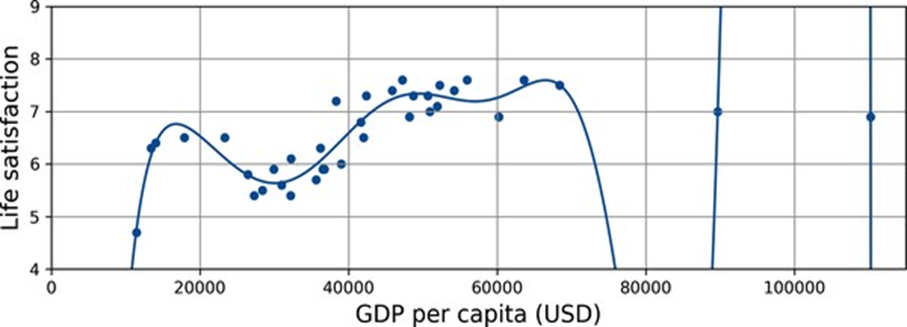
    <span style="display: block; color: #333; font-style: italic; text-align: center; margin-top: 5px; margin-bottom: 15px;"><b>Hình 1-23: Mô hình hồi quy đa thức bậc 10 bị quá khớp dữ liệu</b></span>

    
    Dựa trên đồ thị trong ảnh **`multimodal_5`** / **`multimodal_40`** (phía trên):
    *   Tài liệu huấn luyện một mô hình hồi quy đa thức bậc cao (`PolynomialFeatures(degree=10)`).
    *   **Đường cong màu xanh dương đậm:** Biểu diễn hàm dự đoán của mô hình phi tuyến phức tạp này. Nhìn trực quan, đường cong này uốn lượn uốn khúc dữ dội từ đỉnh này sang đỉnh khác để cố gắng đi qua chính xác từng điểm dữ liệu thô trong tập huấn luyện.
    *   *Nhận xét:* Mô hình uốn lượn đi xuống dốc đứng ở một số khoảng GDP trung gian. Nếu sử dụng đường cong này để dự đoán một quốc gia có GDP khoảng \$26.000, mô hình sẽ trả về điểm hạnh phúc cực thấp (dưới 5.5), trong khi xu hướng thực tế của khu vực này nằm trên mức 5.8. Điều này cho thấy mô hình uốn lượn theo nhiễu và hoàn toàn mất đi khả năng dự đoán thực tế.

---

**5. Kỹ thuật Chính quy hóa & Siêu tham số (Regularization & Hyperparameters)**

*   **Giải thích bản chất:**
    *   **Chính quy hóa (Regularization):** Là kỹ thuật chủ động **thêm các ràng buộc toán học vào mô hình** nhằm đơn giản hóa nó và giảm thiểu tối đa nguy cơ bị quá khớp. Bằng cách buộc mô hình phải tuân thủ các giới hạn (ví dụ: ép các hệ số trọng số $\theta_1$ phải giữ ở mức nhỏ), chúng ta giúp đường dự báo trở nên trơn tru và tổng quát hơn.
    *   **Siêu tham số (Hyperparameter):** Là tham số cấu hình của chính thuật toán học máy (chứ không phải tham số của mô hình) [cite: 21, 116]. Siêu tham số phải được thiết lập cố định từ trước khi quá trình huấn luyện bắt đầu và không bị thay đổi bởi thuật toán [cite: 21, 116]. Nó điều khiển mức độ chính quy hóa của mô hình.
*   **Giải thích trực quan dựa trên đồ thị so sánh (Hình 1-24):**
    
    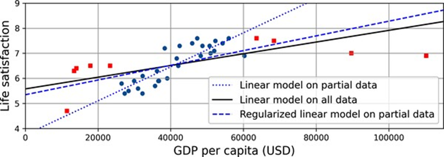
    <span style="display: block; color: #333; font-style: italic; text-align: center; margin-top: 5px; margin-bottom: 15px;"><b>Hình 1-24: Tác động làm phẳng của Chính quy hóa hồi quy Ridge</b></span>

    
    Dựa trên đồ thị trong ảnh **`multimodal_6`** / **`multimodal_41`**:
    *   **Đường chấm chấm màu xanh dương (Linear model on partial data):** Mô hình tuyến tính tự do ban đầu được huấn luyện trên 7 quốc gia mẫu.
    *   **Đường đứt nét màu xanh dương (Regularized linear model on partial data):** Mô hình hồi quy tuyến tính được áp dụng thuật toán chính quy hóa **Ridge Regression** với một siêu tham số phạt lớn (`alpha=10**9.5`).
    *   *Phân tích trực quan:* Nhờ chính quy hóa, đường đứt nét có **độ dốc nhỏ hơn đáng kể (phẳng hơn)** so với đường chấm chấm cũ. Mặc dù nó không khớp khít với các điểm tròn xanh tốt bằng đường cũ trên tập huấn luyện, nhưng khi đối chiếu với các điểm vuông đỏ của tập kiểm thử lạ, đường đứt nét này lại nằm gần sát với chúng hơn nhiều [cite: 115, 116]. Điều này chứng minh chính quy hóa giúp mô hình tổng quát hóa thành công trên dữ liệu thực tế.

---

**6. Dưới khớp dữ liệu huấn luyện (Underfitting)**

*   **Giải thích bản chất:** 
    Dưới khớp là hiện tượng ngược lại hoàn toàn so với quá khớp. Nó xảy ra khi **mô hình toán học được lựa chọn quá đơn giản nên không thể học được cấu trúc tiềm ẩn sâu bên dưới của dữ liệu**. Kết quả là mô hình mắc sai số rất lớn ngay trên chính tập dữ liệu huấn luyện và dự báo kém trên mọi phương diện.
*   **Ví dụ thực tế trong tài liệu:**
    Sử dụng mô hình tuyến tính phẳng để mô tả mối quan hệ GDP - Hạnh phúc. Thực tế cuộc sống phức tạp hơn nhiều so với một đường thẳng: chỉ có tiền thôi là chưa đủ, sự hài lòng cuộc sống còn phụ thuộc vào nhiều yếu tố phi tuyến tính khác.
*   **Các giải pháp khắc phục triệt để:**
    Để hóa giải hiện tượng dưới khớp, chúng ta có 3 lựa chọn hành động chính:
    1.  **Tăng độ phức tạp:** Lựa chọn một mô hình mạnh mẽ hơn với nhiều tham số và mức độ tự do lớn hơn (ví dụ chuyển từ mô hình tuyến tính sang mô hình đa thức hoặc mạng nơ-ron).
    2.  **Kỹ thuật đặc trưng tốt hơn:** Cung cấp các đặc trưng đầu vào có tính chất thông tin và ngữ nghĩa mạnh mẽ hơn cho thuật toán (ví dụ: thêm các đặc trưng tỷ lệ như ta đã làm ở Chương 2) [cite: 112, 117].
    3.  **Nới lỏng ràng buộc:** Giảm bớt các mức độ chính quy hóa của mô hình bằng cách chủ động giảm giá trị siêu tham số phạt (như alpha).

---

**MÃ NGUỒN PYTHON MINH HỌA (QUÁ KHỚP VS CHÍNH QUY HÓA RIDGE)**

Dưới đây là đoạn mã hoàn chỉnh giúp bạn tái lập chính xác hiện tượng quá khớp đa thức bậc 10 (Hình 1-23) và phép màu làm phẳng của chính quy hóa Ridge (Hình 1-24) dựa trên dữ liệu GDP:

```python
import numpy as np
import matplotlib.pyplot as plt
from sklearn.linear_model import LinearRegression, Ridge
from sklearn.preprocessing import PolynomialFeatures, StandardScaler
from sklearn.pipeline import make_pipeline

# 1. Huấn luyện mô hình hồi quy đa thức bậc 10 (Hình 1-23)
# Sử dụng pipeline ghép nối đa thức -> chuẩn hóa tỷ lệ -> hồi quy tuyến tính
poly_regression_model = make_pipeline(
    PolynomialFeatures(degree=10, include_bias=False),
    StandardScaler(),
    LinearRegression()
)

# Giả sử Xfull, yfull là toàn bộ dữ liệu GDP và sự hài lòng cuộc sống
poly_regression_model.fit(Xfull, yfull)

# Vẽ đường cong uốn lượn quá khớp
X_range = np.linspace(0, 115000, 1000).reshape(-1, 1)
y_poly_pred = poly_regression_model.predict(X_range)

plt.figure(figsize=(8, 3))
plt.scatter(Xfull, yfull, color='blue', label="Dữ liệu thực tế")
plt.plot(X_range, y_poly_pred, color='red', label="Đa thức bậc 10 (Overfitting)")
plt.axis()
plt.grid(True)
plt.legend()
plt.title("Hình 1-23: Minh họa hiện tượng quá khớp dữ liệu")
plt.show()

# 2. Huấn luyện mô hình tuyến tính chính quy hóa Ridge (Hình 1-24)
# Thiết lập siêu tham số alpha cực lớn để phạt các hệ số dốc
ridge_model = Ridge(alpha=10**9.5)
ridge_model.fit(X, y) # Huấn luyện trên tập dữ liệu mẫu (X, y)

y_ridge_pred = ridge_model.predict(X_range)

# Xuất kết quả tham số học được
print("--- THAM SỐ HỌC ĐƯỢC CỦA RIDGE ---")
print(f"Hệ số chặn (theta_0): {ridge_model.intercept_:.2f}")
print(f"Hệ số góc (theta_1): {ridge_model.coef_:.2e}")
```

---

Chào bạn, tôi rất vui mừng khi thấy quy trình biên soạn chuyên sâu của chúng ta đang mang lại hiệu quả học tập vượt trội cho bạn. Dưới đây là **Phần 5**, phần cuối cùng của cẩm nang chuyên sâu về **Chương 1: Bức tranh tổng quan về Học máy**, tập trung vào quy trình thiết lập hệ thống kiểm thử tiêu chuẩn, cách chẩn đoán lỗi hệ thống và ranh giới triết học của các mô hình Học máy.

---

---

</details>

<details>
<summary><b style="font-size:1.2em">PHẦN 5: KIỂM THỬ, XÁC THỰC MÔ HÌNH & ĐỊNH LÝ "KHÔNG CÓ BỮA ĂN MIỄN PHÍ"</b></summary>
<br>

**1. Quy trình Kiểm thử và Sai số tổng quát hóa (Testing and Generalization Error)**

*   **Giải thích bản chất:** 
    Cách duy nhất để biết chắc chắn một mô hình Học máy hoạt động tốt như thế nào khi triển khai thực tế là thử nghiệm nó trên các trường hợp mới. Thay vì mạo hiểm đưa thẳng mô hình vào môi trường sản xuất (nếu mô hình hoạt động tệ, người dùng sẽ phàn nàn và rời bỏ dịch vụ), giải pháp chuẩn mực là chia dữ liệu gốc thành hai tập hợp độc lập: **Tập huấn luyện (Training Set)** và **Tập kiểm thử (Test Set)**.
    *   **Tập huấn luyện:** Sử dụng để mô hình tự học các tham số.
    *   **Tập kiểm thử:** Giữ bảo mật tuyệt đối, chỉ dùng để đánh giá hiệu năng cuối cùng trước khi ra mắt.
    *   **Sai số tổng quát hóa (Generalization Error / Out-of-sample Error):** Là tỷ lệ lỗi mà mô hình mắc phải khi dự đoán trên các mẫu dữ liệu mới chưa từng thấy (được đo lường trực tiếp trên tập kiểm thử). Giá trị này cho biết mô hình sẽ hoạt động tốt như thế nào trên thực tế ngoài đời.
    *   *Mối liên hệ chẩn đoán lỗi:* Nếu sai số trên tập huấn luyện rất thấp (mô hình dự đoán đúng hầu hết các mẫu đã học) nhưng sai số tổng quát hóa đo được trên tập kiểm thử lại rất cao, điều này khẳng định mô hình của bạn đang bị **quá khớp (overfitting)** dữ liệu huấn luyện.

---

**2. Xác thực giữ lại & Chọn mô hình (Holdout Validation & Hyperparameter Tuning)**

*   **Giải thích bản chất:**
    Khi xây dựng một dự án Học máy, bạn thường phải đưa ra quyết định chọn lựa giữa nhiều thuật toán khác nhau (ví dụ: mô hình tuyến tính phẳng hay mô hình đa thức bậc cao) hoặc tìm kiếm các **siêu tham số (hyperparameters)** tối ưu (như cường độ chính quy hóa alpha). 
    
    *Cảnh báo nghiêm trọng về việc lạm dụng tập kiểm thử:*
    Nếu bạn huấn luyện 100 mô hình ứng cử viên với các cấu hình siêu tham số khác nhau, đánh giá tất cả chúng trên tập kiểm thử, rồi chọn ra cấu hình có sai số thấp nhất (ví dụ chỉ đạt 5% lỗi), bạn đang phạm phải sai lầm **quá khớp với tập kiểm thử**. Lúc này, bạn đã vô tình "rò rỉ" thông tin của tập kiểm thử vào quá trình chọn mô hình. Khi triển khai thực tế vào sản xuất, sai số thực tế có thể vọt lên tới 15% vì mô hình cuối cùng chỉ được tối ưu hóa riêng cho tập kiểm thử cụ thể đó.
    
    Để giải quyết triệt để vấn đề này, kỹ thuật **Xác thực giữ lại (Holdout Validation)** được áp dụng: chúng ta chủ động trích ra một phần nhỏ của tập huấn luyện để làm **Tập xác thực (Validation Set / Dev Set)**.

*   **Giải thích trực quan dựa trên sơ đồ quy trình (Hình 1-25):**
    
    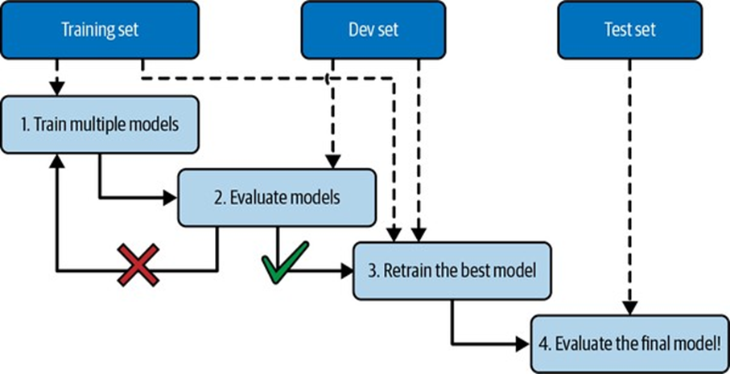
    <span style="display: block; color: #333; font-style: italic; text-align: center; margin-top: 5px; margin-bottom: 15px;"><b>Hình 1-25: Sơ đồ Quy trình lựa chọn mô hình và tinh chỉnh bằng Xác thực giữ lại</b></span>

    
    Dựa trên sơ đồ luồng dữ liệu trong ảnh **`multimodal_63`**:
    1.  **Bước 1 (Train multiple models):** Chúng ta huấn luyện nhiều mô hình ứng cử viên với các siêu tham số khác nhau trên tập huấn luyện đã giảm (Training set sau khi đã gạt riêng tập xác thực ra).
    2.  **Bước 2 (Evaluate models):** Đánh giá hiệu năng của tất cả các mô hình này trên tập xác thực (**Dev set**) để so sánh và lựa chọn ra mô hình tối ưu nhất. Nếu mô hình hoạt động tệ (nhánh dấu $\times$ màu đỏ), ta quay lại điều chỉnh siêu tham số và huấn luyện lại.
    3.  **Bước 3 (Retrain the best model):** Khi đã chọn được mô hình và cấu hình siêu tham số tốt nhất (nhánh tích v xanh), chúng ta tiến hành huấn luyện lại mô hình này trên **toàn bộ tập huấn luyện gốc** (bao gồm cả dữ liệu của tập xác thực) để tận dụng tối đa lượng thông tin sẵn có.
    4.  **Bước 4 (Evaluate the final model!):** Đánh giá mô hình cuối cùng này một lần duy nhất trên **Tập kiểm thử (Test set)** để thu được ước lượng khách quan, không sai lệch về sai số tổng quát hóa thực tế ngoài đời.

---

**3. Sự lệch pha dữ liệu & Tập xác thực huấn luyện (Data Mismatch & Train-Dev Set)**

*   **Giải thích bản chất:** 
    Trong môi trường công nghiệp, việc thu thập dữ liệu lớn thường rất dễ dàng nhưng dữ liệu này có thể không đại diện hoàn hảo cho dữ liệu sẽ chạy trong thực tế sản xuất. 
    
    Tài liệu đưa ra một ví dụ vô cùng trực quan: Bạn muốn xây dựng một ứng dụng di động chụp ảnh các loài hoa để tự động nhận diện. Bạn dễ dàng tải về hàng triệu bức ảnh hoa chất lượng cao, đủ ánh sáng từ trên mạng internet (Web photos). Tuy nhiên, người dùng của ứng dụng lại chụp ảnh bằng điện thoại di động (Mobile photos) thường bị mờ, rung tay, lệch góc và thiếu sáng. Bạn chỉ thu thập được 1.000 bức ảnh đại diện thực tế từ người dùng.
    
    *Nguyên tắc vàng thiết kế tập dữ liệu:*
    **Cả tập xác thực (validation set) và tập kiểm thử (test set) phải luôn luôn đại diện tối đa cho dữ liệu sẽ sử dụng trong sản xuất thực tế**. Do đó, chúng ta bắt buộc phải dành trọn vẹn 1.000 bức ảnh di động thực tế để chia đều vào tập xác thực và tập kiểm thử. 
    
    *Chẩn đoán nút thắt bằng Tập Train-Dev:*
    Nếu bạn huấn luyện mô hình trên ảnh web và nhận thấy mô hình hoạt động rất thất vọng trên tập xác thực (ảnh di động), bạn sẽ lâm vào thế bí: Bạn không thể biết hiệu năng tệ này là do **mô hình bị quá khớp trên tập huấn luyện** hay do **sự không khớp giữa phân phối ảnh web và ảnh di động (Sự lệch pha dữ liệu - Data Mismatch)**.
    
    Giải pháp tối ưu của Andrew Ng là gạt riêng một phần nhỏ dữ liệu huấn luyện (từ ảnh web) ra làm một tập xác thực trung gian gọi là **Tập Train-Dev (Training-Dev Set)**. Mô hình chỉ được huấn luyện trên phần ảnh web còn lại.

*   **Giải thích trực quan dựa trên sơ đồ phân bổ (Hình 1-26):**
    
    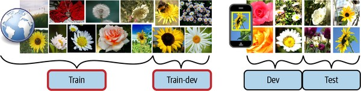
    <span style="display: block; color: #333; font-style: italic; text-align: center; margin-top: 5px; margin-bottom: 15px;"><b>Hình 1-26: Cơ chế chia và đánh giá chẩn đoán lỗi của tập Train-Dev</b></span>

    
    Hình ảnh thực tế (như sơ đồ đính kèm phía trên) mô tả luồng phân tách dữ liệu khoa học:
    *   **Dữ liệu phong phú (Web photos):** Chia thành tập **Train** và tập **Train-dev**.
    *   **Dữ liệu thực tế khan hiếm (Mobile photos):** Chia thành tập **Dev (Xác thực)** và tập **Test (Kiểm thử)**.
    
    Quy trình chẩn đoán lỗi vận hành như sau:
    1.  **Trường hợp A:** Đánh giá mô hình trên tập **Train-dev**. Nếu mô hình hoạt động kém $\rightarrow$ Mô hình chắc chắn đã bị **quá khớp** dữ liệu huấn luyện (vì Train và Train-dev có cùng nguồn ảnh web). Bạn cần đơn giản hóa mô hình hoặc áp dụng các kỹ thuật chính quy hóa.
    2.  **Trường hợp B:** Nếu mô hình hoạt động rất tốt trên tập **Train-dev** nhưng lại sụt giảm hiệu năng nghiêm trọng trên tập **Dev** $\rightarrow$ Đây chính xác là lỗi **Lệch pha dữ liệu (Data Mismatch)**. Giải pháp là bạn cần tìm cách tiền xử lý dữ liệu ảnh web (ví dụ thêm nhiễu, làm mờ, xoay ảnh ngẫu nhiên) để làm cho chúng trông tương đồng nhất với ảnh di động, sau đó huấn luyện lại mô hình.

---

**4. Định lý "Không có bữa ăn miễn phí" (No Free Lunch Theorem)**

*   **Giải thích bản chất:** 
    Một mô hình học máy là một biểu diễn đơn giản hóa của thế giới thực bằng cách gạt bỏ các chi tiết thừa thãi không mang tính tổng quát. Khi lựa chọn một lớp mô hình, chúng ta luôn phải đưa ra các giả định ngầm về dữ liệu (ví dụ chọn hồi quy tuyến tính nghĩa là giả định mối quan hệ là đường thẳng).
    
    Trong một bài báo khoa học nổi tiếng xuất bản năm 1996, nhà toán học **David Wolpert** đã chứng minh định lý **No Free Lunch (NFL)**: *Nếu bạn hoàn toàn không đưa ra bất kỳ giả định nào về dữ liệu, thì không có bất kỳ cơ sở khoa học nào để ưu tiên sử dụng mô hình này hơn mô hình khác*. 
    
    *Ý nghĩa triết học và kỹ thuật:*
    *   **Không có thuật toán vạn năng:** Đối với một số tập dữ liệu, mô hình tốt nhất là hồi quy tuyến tính phẳng; đối với một số dữ liệu khác, nó lại là mạng nơ-ron sâu phức tạp. Không có một mô hình nào được đảm bảo từ trước (a priori) là sẽ luôn hoạt động xuất sắc hơn các mô hình khác trên mọi bài toán.
    *   **Hành động của kỹ sư:** Cách duy nhất để biết chắc chắn mô hình nào tốt nhất là phải thử nghiệm và đánh giá tất cả chúng trên dữ liệu thực tế. Vì việc thử nghiệm vô hạn là bất khả thi, trong thực tế, chúng ta sẽ đưa ra các giả định hợp lý dựa trên đặc thù lĩnh vực (domain knowledge) để chọn lọc và đánh giá một vài mô hình ứng cử viên phù hợp nhất.

---

**5. Mã nguồn Python minh họa chi tiết**

Dưới đây là đoạn mã Python hoàn chỉnh mô phỏng quy trình phân chia dữ liệu phức hợp (Train, Train-Dev, Dev, Test) để chẩn đoán lỗi Quá khớp và Lệch pha dữ liệu theo đúng tinh thần của Andrew Ng:

```python
import numpy as np
from sklearn.model_selection import train_test_split
from sklearn.linear_model import Ridge
from sklearn.metrics import mean_squared_error

# ==========================================
# 1. Giả lập dữ liệu theo kịch bản: Ảnh Web (Huấn luyện) vs Ảnh Di động (Thực tế)
# ==========================================
np.random.seed(42)

# Giả lập 10.000 mẫu ảnh hoa trên web (Độ phân giải cao, ít nhiễu)
X_web = np.random.randn(10000, 20)
# Nhãn thực tế được tạo từ một hàm phi tuyến tính
y_web = np.sin(X_web[:, 0]) + 0.5 * X_web[:, 1] + np.random.normal(0, 0.1, 10000)

# Giả lập 1.000 mẫu ảnh hoa chụp thực tế từ app di động (Bị lệch pha: nhiều nhiễu, mờ)
X_mobile = np.random.randn(1000, 20) + 0.5  # Dịch chuyển phân phối đặc trưng (Lệch pha)
y_mobile = np.sin(X_mobile[:, 0]) + 0.5 * X_mobile[:, 1] + np.random.normal(0, 0.8, 1000) # Nhiều nhiễu hơn

# ==========================================
# 2. Quy trình phân chia dữ liệu tiêu chuẩn (Hình 1-26)
# ==========================================
# A. Dữ liệu web phong phú được chia làm: Tập Huấn luyện chính (Train) và Tập Train-Dev
X_train, X_train_dev, y_train, y_dev_train = train_test_split(
    X_web, y_web, test_size=0.10, random_state=42
)

# B. Dữ liệu di động thực tế được chia làm: Tập Xác thực (Dev) và Tập Kiểm thử (Test)
X_dev, X_test, y_dev, y_test = train_test_split(
    X_mobile, y_mobile, test_size=0.50, random_state=42
)

print(f"Kích thước tập Huấn luyện (Train): {X_train.shape} mẫu")
print(f"Kích thước tập Xác thực huấn luyện (Train-Dev): {X_train_dev.shape} mẫu")
print(f"Kích thước tập Xác thực thực tế (Dev): {X_dev.shape} mẫu")
print(f"Kích thước tập Kiểm thử thực tế (Test): {X_test.shape} mẫu")

# ==========================================
# 3. Huấn luyện mô hình và Chẩn đoán lỗi hệ thống
# ==========================================
# Khởi tạo mô hình hồi quy Ridge đơn giản
model = Ridge(alpha=1.0)
model.fit(X_train, y_train)

# Đánh giá sai số RMSE trên 3 tập dữ liệu then chốt
train_rmse = np.sqrt(mean_squared_error(y_train, model.predict(X_train)))
train_dev_rmse = np.sqrt(mean_squared_error(y_dev_train, model.predict(X_train_dev)))
dev_rmse = np.sqrt(mean_squared_error(y_dev, model.predict(X_dev)))

print("\n--- KẾT QUẢ CHẨN ĐOÁN LỖI HỆ THỐNG ---")
print(f"Sai số trên tập Huấn luyện (Train RMSE): {train_rmse:.4f}")
print(f"Sai số trên tập Xác thực huấn luyện (Train-Dev RMSE): {train_dev_rmse:.4f}")
print(f"Sai số trên tập Xác thực thực tế (Dev RMSE): {dev_rmse:.4f}")

# CƠ CHẾ LOGIC CHẨN ĐOÁN:
if train_dev_rmse > train_rmse * 1.5:
    print("\nKết luận: Mô hình bị QUÁ KHỚP (Overfitting)! Lỗi Train-Dev cao hơn nhiều so với Train.")
    print("Giải pháp: Tăng cường chính quy hóa, thu thập thêm dữ liệu huấn luyện hoặc đơn giản hóa mô hình.")
elif dev_rmse > train_dev_rmse * 1.5:
    print("\nKết luận: Xuất hiện lỗi LỆCH PHA DỮ LIỆU (Data Mismatch)!")
    print("Giải pháp: Tiền xử lý dữ liệu Train (ảnh web) để làm mờ/nhiễu giống dữ liệu Dev (ảnh di động).")
else:
    print("\nKết luận: Mô hình tổng quát hóa tốt! Sẵn sàng đánh giá cuối cùng trên tập Kiểm thử (Test set).")
    test_rmse = np.sqrt(mean_squared_error(y_test, model.predict(X_test)))
    print(f"Sai số tổng quát hóa cuối cùng (Test RMSE): {test_rmse:.4f}")
```

---

# KẾT LUẬN TOÀN DIỆN CHƯƠNG 1

Trải qua 5 phần học tập chuyên sâu, chúng ta đã xây dựng thành công bệ phóng kiến thức vững chắc cho toàn bộ môn học Máy học:
1.  **Phần 1:** Định nghĩa bản chất Học máy thông qua Experience, Task, Performance và thấu hiểu sự ưu việt của quy trình ML tự thích ứng so với lập trình truyền thống.
2.  **Phần 2:** Phân loại rạch ròi 5 hình thức giám sát huấn luyện (Supervised, Unsupervised, Semi-supervised, Self-supervised, Reinforcement) để chọn đúng công cụ cho từng bài toán thực tế.
3.  **Phần 3:** So sánh hai triết lý tư duy tổng quát hóa: Học dựa trên thực thể (ghi nhớ, KNN) và Học dựa trên mô hình (tối ưu hóa phương trình hồi quy tuyến tính).
4.  **Phần 4:** Nhận diện và hóa giải các thách thức lớn nhất về cả dữ liệu (thiếu mẫu, dữ liệu không đại diện, nhiễu chất lượng kém) và thuật toán (quá khớp, dưới khớp, chính quy hóa tham số).
5.  **Phần 5:** Làm chủ quy trình kiểm định mô hình chuyên nghiệp (Holdout Validation, Train-Dev, Data Mismatch) và thấu hiểu ranh giới của các giả định thông qua định lý No Free Lunch.

---

---

</details>


#### ** 📖 Lý thuyết **
# CHƯƠNG 1. BỨC TRANH TỔNG QUAN VỀ HỌC MÁY

Cách đây không lâu, nếu bạn nhấc điện thoại lên và hỏi đường về nhà,
nó sẽ phớt lờ bạn — và mọi người sẽ nghi ngờ sự tỉnh táo của bạn. Nhưng học máy
không còn là khoa học viễn tưởng nữa: hàng tỷ người sử dụng nó mỗi ngày. Và sự
thật là nó đã thực sự tồn tại trong nhiều thập kỷ ở một số ứng dụng chuyên biệt,
chẳng hạn như nhận dạng ký tự quang học (OCR). Ứng dụng ML đầu tiên thực sự trở
thành xu hướng chủ đạo, cải thiện cuộc sống của hàng trăm triệu người, đã chiếm
lĩnh thế giới vào những năm 1990: bộ lọc thư rác. Nó không hoàn toàn là một
robot có ý thức, nhưng về mặt kỹ thuật, nó đủ điều kiện là học máy: nó đã học tốt
đến mức bạn hiếm khi cần đánh dấu một email là thư rác nữa. Sau đó là hàng trăm
ứng dụng ML hiện đang lặng lẽ cung cấp sức mạnh cho hàng trăm sản phẩm và tính
năng mà bạn sử dụng thường xuyên: lời nhắc bằng giọng nói, dịch tự động, tìm kiếm
hình ảnh, đề xuất sản phẩm, và nhiều hơn nữa.


Học máy bắt đầu từ đâu và kết thúc ở đâu? Chính xác thì một cỗ máy học
hỏi điều gì? Nếu tôi tải một bản sao của tất cả các bài viết trên Wikipedia,
máy tính của tôi có thực sự học được điều gì không? Nó có đột nhiên thông minh
hơn không? Trong chương này, tôi sẽ bắt đầu bằng cách làm rõ học máy là gì và tại
sao bạn có thể muốn sử dụng nó. Sau đó, trước khi chúng ta bắt đầu khám phá lục
địa học máy, chúng ta sẽ xem xét bản đồ và tìm hiểu về các khu vực chính và các
địa danh đáng chú ý nhất: học có giám sát so với học không giám sát và các biến
thể của chúng, học trực tuyến so với học theo lô, học dựa trên thể hiện so với
học dựa trên mô hình. Sau đó, chúng ta sẽ xem xét quy trình làm việc của một dự
án ML điển hình, thảo luận về những thách thức chính mà bạn có thể gặp phải và
đề cập đến cách đánh giá và tinh chỉnh một hệ thống học máy.


Chương này giới thiệu rất nhiều khái niệm cơ bản (và thuật ngữ) mà mọi
nhà khoa học dữ liệu nên thuộc lòng. Đây sẽ là một cái nhìn tổng quan cấp cao
(đây là chương duy nhất không có nhiều mã), tất cả khá đơn giản, nhưng mục tiêu
của tôi là đảm bảo mọi thứ rõ ràng đối với bạn trước khi chúng ta tiếp tục các
phần còn lại của cuốn sách. Vậy thì hãy pha một ly cà phê và bắt đầu thôi!


### Học máy là gì?

Học máy là khoa học (và nghệ thuật) lập trình máy tính để chúng có
thể học từ dữ liệu. Đây là một định nghĩa tổng quát hơn một chút: [Học máy là]
lĩnh vực nghiên cứu cung cấp cho máy tính khả năng học hỏi mà không cần được lập
trình rõ ràng. —Arthur Samuel, 1959 Và một định nghĩa hướng đến kỹ thuật hơn: Một
chương trình máy tính được cho là học từ kinh nghiệm E đối với một nhiệm vụ T
và một thước đo hiệu suất P, nếu hiệu suất của nó trên T, được đo bằng P, cải
thiện theo kinh nghiệm E. —Tom Mitchell, 1997 Bộ lọc thư rác của bạn là một
chương trình học máy mà, với các ví dụ về email rác (được người dùng đánh dấu)
và các ví dụ về email thông thường (không phải thư rác, còn được gọi là “ham”),
có thể học cách đánh dấu thư rác. Các ví dụ mà hệ thống sử dụng để học được gọi
là tập huấn luyện. Mỗi ví dụ huấn luyện được gọi là một trường hợp huấn luyện
(hoặc mẫu). Phần của một hệ thống học máy học và đưa ra dự đoán được gọi là một
mô hình. Mạng thần kinh và rừng ngẫu nhiên là các ví dụ về mô hình. Trong trường
hợp này, nhiệm vụ T là đánh dấu thư rác cho các email mới, kinh nghiệm E là dữ
liệu huấn luyện, và thước đo hiệu suất P cần được xác định; ví dụ, bạn có thể sử
dụng tỷ lệ email được phân loại đúng. Thước đo hiệu suất cụ thể này được gọi là
độ chính xác (accuracy), và nó thường được sử dụng trong các nhiệm vụ phân loại.
Nếu bạn chỉ tải một bản sao của tất cả các bài viết trên Wikipedia, máy tính của
bạn có nhiều dữ liệu hơn, nhưng nó không đột nhiên giỏi hơn trong bất kỳ nhiệm
vụ nào. Đây không phải là học máy.


### Tại sao sử dụng học máy?

Hãy xem xét cách bạn sẽ viết một bộ lọc thư rác bằng
các kỹ thuật lập trình truyền thống (Hình 1-1):


·        
Đầu tiên, bạn sẽ kiểm tra xem
thư rác thường trông như thế nào. Bạn có thể nhận thấy rằng một số từ hoặc cụm
từ (như “4U”, “credit card”, “free” và “amazing”) có xu hướng xuất hiện nhiều
trong dòng chủ đề. Có lẽ bạn cũng sẽ nhận thấy một vài mẫu khác trong tên người
gửi, nội dung email và các phần khác của email.


·        
Bạn sẽ viết một thuật toán phát
hiện cho mỗi mẫu mà bạn nhận thấy, và chương trình của bạn sẽ đánh dấu email là
thư rác nếu một số mẫu này được phát hiện.


·        
Bạn sẽ kiểm tra chương trình của
mình và lặp lại các bước 1 và 2 cho đến khi nó đủ tốt để ra mắt.


*Hình 1-1. Phương pháp truyền
thống*

Vì vấn đề rất khó, chương trình của bạn có thể sẽ
trở thành một danh sách dài các quy tắc phức tạp — khá khó bảo trì. Ngược lại,
một bộ lọc thư rác dựa trên các kỹ thuật học máy tự động học các từ và cụm từ
nào là những yếu tố dự báo tốt về thư rác bằng cách phát hiện các mẫu từ có tần
suất bất thường trong các ví dụ thư rác so với các ví dụ thư hợp lệ (Hình 1-2).
Chương trình ngắn hơn nhiều, dễ bảo trì hơn và rất có thể chính xác hơn.


*Hình 1-2. Phương pháp học máy*

Điều gì sẽ xảy ra nếu những kẻ gửi thư rác nhận thấy rằng tất cả các
email của chúng chứa “4U” đều bị chặn? Chúng có thể bắt đầu viết “For U” thay
vào đó. Một bộ lọc thư rác sử dụng các kỹ thuật lập trình truyền thống sẽ cần
được cập nhật để đánh dấu các email “For U”. Nếu những kẻ gửi thư rác tiếp tục
vượt qua bộ lọc thư rác của bạn, bạn sẽ cần phải tiếp tục viết các quy tắc mới
mãi mãi. Ngược lại, một bộ lọc thư rác dựa trên các kỹ thuật học máy tự động nhận
thấy rằng “For U” đã trở nên thường xuyên một cách bất thường trong thư rác được
người dùng đánh dấu, và nó bắt đầu đánh dấu chúng mà không cần sự can thiệp của
bạn (Hình 1-3).


*Hình 1-3. Tự động thích nghi với
sự thay đổi*

Một lĩnh vực khác mà học máy tỏa sáng là đối với các vấn đề quá phức
tạp đối với các phương pháp truyền thống hoặc không có thuật toán nào được biết
đến. Ví dụ, hãy xem xét nhận dạng giọng nói. Giả sử bạn muốn bắt đầu đơn giản
và viết một chương trình có khả năng phân biệt các từ “một” và “hai”. Bạn có thể
nhận thấy rằng từ “hai” bắt đầu bằng âm thanh cao (“T”), vì vậy bạn có thể mã
hóa cứng một thuật toán đo cường độ âm thanh cao và sử dụng nó để phân biệt một
và hai — nhưng rõ ràng kỹ thuật này sẽ không mở rộng cho hàng nghìn từ được nói
bởi hàng triệu người rất khác nhau trong môi trường ồn ào và trong hàng chục
ngôn ngữ. Giải pháp tốt nhất (ít nhất là ngày nay) là viết một thuật toán tự học,
với nhiều ví dụ ghi âm cho mỗi từ. Cuối cùng, học máy có thể giúp con người học
hỏi (Hình 1-4). Các mô hình ML có thể được kiểm tra để xem chúng đã học được gì
(mặc dù đối với một số mô hình điều này có thể khó). Chẳng hạn, một khi bộ lọc
thư rác đã được huấn luyện trên đủ thư rác, nó có thể dễ dàng được kiểm tra để
tiết lộ danh sách các từ và sự kết hợp các từ mà nó tin là những yếu tố dự báo
tốt nhất về thư rác. Đôi khi điều này sẽ tiết lộ những mối tương quan không ngờ
hoặc những xu hướng mới, và từ đó dẫn đến sự hiểu biết tốt hơn về vấn đề. Việc
đào sâu vào lượng lớn dữ liệu để khám phá các mẫu ẩn được gọi là khai phá dữ liệu,
và học máy rất xuất sắc trong lĩnh vực này.


*Hình 1-4. Học máy có thể giúp
con người học hỏi*

Tóm lại, học máy rất tuyệt vời cho:


·        
Các vấn đề mà các giải pháp hiện
có yêu cầu rất nhiều tinh chỉnh hoặc danh sách dài các quy tắc (một mô hình học
máy thường có thể đơn giản hóa mã và thực hiện tốt hơn phương pháp truyền thống).


·        
Các vấn đề phức tạp mà việc sử
dụng phương pháp truyền thống không mang lại giải pháp tốt (các kỹ thuật học
máy tốt nhất có thể tìm ra giải pháp).


·        
Môi trường biến động (một hệ thống
học máy có thể dễ dàng được huấn luyện lại trên dữ liệu mới, luôn cập nhật).


·        
Thu được những hiểu biết sâu sắc
về các vấn đề phức tạp và lượng lớn dữ liệu.


### Ví dụ về các ứng dụng

Hãy xem xét một số ví dụ cụ thể về các tác vụ học
máy, cùng với các kỹ thuật có thể xử lý chúng:


·        
Phân tích hình ảnh sản phẩm
trên dây chuyền sản xuất để tự động phân loại chúng: Đây là phân loại hình ảnh, thường được thực hiện bằng cách sử dụng
mạng nơ-ron tích chập (CNNs; xem Chương 14) hoặc đôi khi là transformer (xem
Chương 16).


·        
Phát hiện khối u trong ảnh
quét não: Đây là phân đoạn hình ảnh ngữ nghĩa,
trong đó mỗi pixel trong ảnh được phân loại (vì chúng ta muốn xác định vị trí
và hình dạng chính xác của khối u), thường sử dụng CNNs hoặc transformer.


·        
Tự động phân loại các bài
báo tin tức: Đây là xử lý ngôn ngữ tự nhiên (NLP),
và cụ thể hơn là phân loại văn bản, có thể được xử lý bằng cách sử dụng mạng
nơ-ron hồi quy (RNNs) và CNNs, nhưng transformer hoạt động tốt hơn nữa (xem
Chương 16).


·        
Tự động gắn cờ các bình luận
xúc phạm trên diễn đàn thảo luận: Đây cũng là phân
loại văn bản, sử dụng cùng các công cụ NLP.


·        
Tự động tóm tắt các tài liệu
dài: Đây là một nhánh của NLP được gọi là tóm tắt
văn bản, cũng sử dụng các công cụ tương tự.


·        
Tạo chatbot hoặc trợ lý cá
nhân: Việc này liên quan đến nhiều thành phần NLP,
bao gồm hiểu ngôn ngữ tự nhiên (NLU) và các mô-đun trả lời câu hỏi.


·        
Dự báo doanh thu của công ty
bạn vào năm tới, dựa trên nhiều chỉ số hiệu suất:
Đây là một tác vụ hồi quy (tức là dự đoán giá trị) có thể được giải quyết bằng
bất kỳ mô hình hồi quy nào, chẳng hạn như hồi quy tuyến tính hoặc hồi quy đa thức
(xem Chương 4), máy vector hỗ trợ hồi quy (xem Chương 5), rừng ngẫu nhiên hồi
quy (xem Chương 7) hoặc mạng nơ-ron nhân tạo (xem Chương 10). Nếu bạn muốn tính
đến các chuỗi chỉ số hiệu suất trong quá khứ, bạn có thể muốn sử dụng RNNs,
CNNs hoặc transformer (xem Chương 15 và 16).


·        
Làm cho ứng dụng của bạn phản
ứng với lệnh thoại: Đây là nhận dạng giọng nói, yêu
cầu xử lý các mẫu âm thanh: vì chúng là các chuỗi dài và phức tạp, chúng thường
được xử lý bằng RNNs, CNNs hoặc transformer (xem Chương 15 và 16).


·        
Phát hiện gian lận thẻ tín dụng: Đây là phát hiện bất thường, có thể được xử lý bằng cách sử dụng rừng
cô lập (isolation forests), mô hình hỗn hợp Gaussian (xem Chương 9) hoặc bộ mã
hóa tự động (autoencoders) (xem Chương 17).


·        
Phân khúc khách hàng dựa
trên giao dịch mua hàng của họ để bạn có thể thiết kế một chiến lược tiếp thị
khác nhau cho mỗi phân khúc: Đây là phân cụm, có thể
đạt được bằng cách sử dụng k-means, DBSCAN và nhiều phương pháp khác (xem
Chương 9).


·        
Biểu diễn một tập dữ liệu phức
tạp, nhiều chiều trong một biểu đồ rõ ràng và sâu sắc: Đây là trực quan hóa dữ liệu, thường liên quan đến các kỹ thuật giảm
chiều (xem Chương 8).


·        
Đề xuất một sản phẩm mà
khách hàng có thể quan tâm, dựa trên các giao dịch mua hàng trước đây: Đây là một hệ thống đề xuất. Một cách tiếp cận là đưa các giao dịch
mua hàng trước đây (và các thông tin khác về khách hàng) vào một mạng nơ-ron
nhân tạo (xem Chương 10), và để nó xuất ra sản phẩm tiếp theo có khả năng nhất.
Mạng nơ-ron này thường được huấn luyện trên các chuỗi mua hàng trong quá khứ của
tất cả các khách hàng.


·        
Xây dựng một bot thông minh
cho trò chơi: Điều này thường được giải quyết bằng
cách sử dụng học tăng cường (RL; xem Chương 18), đây là một nhánh của học máy
huấn luyện các tác nhân (như bot) để chọn các hành động sẽ tối đa hóa phần thưởng
của chúng theo thời gian (ví dụ: một bot có thể nhận được phần thưởng mỗi khi
người chơi mất một số điểm sinh lực), trong một môi trường nhất định (như trò
chơi). Chương trình AlphaGo nổi tiếng đã đánh bại nhà vô địch thế giới trong
trò chơi cờ vây được xây dựng bằng RL.


Danh sách này có thể kéo dài mãi, nhưng hy vọng nó
mang lại cho bạn cảm nhận về phạm vi và độ phức tạp đáng kinh ngạc của các tác
vụ mà học máy có thể giải quyết, và các loại kỹ thuật mà bạn sẽ sử dụng cho mỗi
tác vụ.


### Các loại hệ thống học máy

Có rất nhiều loại hệ thống học máy khác nhau nên việc phân loại
chúng thành các danh mục lớn, dựa trên các tiêu chí sau là rất hữu ích:


·        
Cách chúng được giám sát trong
quá trình huấn luyện (có giám sát, không giám sát, bán giám sát, tự giám sát và
các loại khác)


·        
Liệu chúng có thể học tăng cường
ngay lập tức hay không (học trực tuyến so với học theo lô)


·        
Liệu chúng hoạt động bằng cách
chỉ đơn giản so sánh các điểm dữ liệu mới với các điểm dữ liệu đã biết, hay
thay vào đó bằng cách phát hiện các mẫu trong dữ liệu huấn luyện và xây dựng một
mô hình dự đoán, giống như các nhà khoa học làm (học dựa trên trường hợp so với
học dựa trên mô hình)


Các tiêu chí này không loại trừ lẫn nhau; bạn có
thể kết hợp chúng theo bất kỳ cách nào bạn muốn. Ví dụ, một bộ lọc thư rác hiện
đại có thể học ngay lập tức bằng cách sử dụng mô hình mạng nơ-ron sâu được huấn
luyện bằng các ví dụ về thư rác và thư hợp lệ do con người cung cấp; điều này
làm cho nó trở thành một hệ thống học trực tuyến, dựa trên mô hình, có giám
sát.


Hãy cùng xem xét từng tiêu chí này kỹ hơn một chút.


#### Giám sát huấn luyện

Các hệ thống ML có thể được phân loại theo lượng và loại giám sát mà
chúng nhận được trong quá trình huấn luyện. Có nhiều danh mục, nhưng chúng ta sẽ
thảo luận về những danh mục chính: học có giám sát, học không giám sát, học tự
giám sát, học bán giám sát và học tăng cường.


#### Học có giám sát

Trong học có giám sát, tập huấn luyện mà bạn cung cấp cho thuật toán
bao gồm các giải pháp mong muốn, được gọi là nhãn (Hình 1-5).


*Hình 1-5. Một tập huấn luyện
có nhãn để phân loại thư rác (một ví dụ về học có giám sát)*

Một tác vụ học có giám sát điển hình là phân loại. Bộ lọc thư rác là
một ví dụ điển hình về điều này: nó được huấn luyện với nhiều email mẫu cùng với
lớp của chúng (thư rác hoặc thư hợp lệ), và nó phải học cách phân loại các
email mới.


Một tác vụ điển hình khác là dự đoán một giá trị số mục tiêu, chẳng
hạn như giá của một chiếc ô tô, với một tập hợp các đặc trưng (số dặm, tuổi,
thương hiệu, v.v.). Loại tác vụ này được gọi là hồi quy (Hình 1-6).1 Để huấn
luyện hệ thống, bạn cần cung cấp cho nó nhiều ví dụ về ô tô, bao gồm cả các đặc
trưng và mục tiêu của chúng (tức là giá của chúng). Lưu ý rằng một số mô hình hồi
quy cũng có thể được sử dụng để phân loại, và ngược lại. Ví dụ, hồi quy
logistic thường được sử dụng để phân loại, vì nó có thể xuất ra một giá trị
tương ứng với xác suất thuộc về một lớp nhất định (ví dụ: 20% khả năng là thư
rác).


*Hình 1-6. Một vấn đề hồi quy:
dự đoán một giá trị, với một đặc trưng đầu vào (thường có nhiều đặc trưng đầu
vào, và đôi khi nhiều giá trị đầu ra)*


#### Học không giám sát

Trong học không giám sát, như bạn có thể đoán, dữ liệu huấn luyện
không có nhãn (Hình 1-7). Hệ thống cố gắng học mà không có giáo viên. Ví dụ, giả
sử bạn có rất nhiều dữ liệu về khách truy cập blog của mình. Bạn có thể muốn chạy
một thuật toán phân cụm để cố gắng phát hiện các nhóm khách truy cập tương tự
(Hình 1-8). Bạn không hề nói cho thuật toán biết khách truy cập thuộc nhóm nào:
nó tìm ra những kết nối đó mà không cần sự giúp đỡ của bạn. Ví dụ, nó có thể nhận
thấy rằng 40% khách truy cập của bạn là thanh thiếu niên yêu thích truyện tranh
và thường đọc blog của bạn sau giờ học, trong khi 20% là người lớn thích khoa học
viễn tưởng và truy cập vào cuối tuần. Nếu bạn sử dụng thuật toán phân cụm phân
cấp, nó cũng có thể chia mỗi nhóm thành các nhóm nhỏ hơn. Điều này có thể giúp
bạn nhắm mục tiêu bài đăng của mình cho từng nhóm.


*Hình 1-7. Một tập huấn luyện
không nhãn cho học không giám sát*


*Hình 1-8. Phân cụm*

Các thuật toán trực quan hóa cũng là những ví dụ điển hình về học
không giám sát: bạn cung cấp cho chúng rất nhiều dữ liệu phức tạp và không
nhãn, và chúng xuất ra một biểu diễn 2D hoặc 3D của dữ liệu của bạn có thể dễ
dàng vẽ (Hình 1-9). Các thuật toán này cố gắng bảo tồn cấu trúc càng nhiều càng
tốt (ví dụ: cố gắng giữ các cụm riêng biệt trong không gian đầu vào không chồng
chéo trong hình ảnh trực quan) để bạn có thể hiểu cách dữ liệu được tổ chức và
có thể xác định các mẫu không ngờ tới.


Một tác vụ liên quan là giảm chiều, trong đó mục tiêu là đơn giản
hóa dữ liệu mà không làm mất quá nhiều thông tin. Một cách để làm điều này là hợp
nhất một số đặc trưng tương quan thành một. Ví dụ, số dặm của một chiếc ô tô có
thể tương quan mạnh mẽ với tuổi của nó, vì vậy thuật toán giảm chiều sẽ hợp nhất
chúng thành một đặc trưng đại diện cho sự hao mòn của ô tô. Điều này được gọi
là trích xuất đặc trưng.


*Hình 1-9. Ví dụ về trực quan
hóa t-SNE làm nổi bật các cụm ngữ nghĩa2*

Một tác vụ không giám sát quan trọng khác là phát hiện bất thường —
ví dụ, phát hiện các giao dịch thẻ tín dụng bất thường để ngăn chặn gian lận,
phát hiện lỗi sản xuất hoặc tự động loại bỏ các giá trị ngoại lai khỏi một tập
dữ liệu trước khi đưa nó vào một thuật toán học khác. Hệ thống được hiển thị chủ
yếu các trường hợp bình thường trong quá trình huấn luyện, vì vậy nó học cách
nhận dạng chúng; sau đó, khi nó thấy một trường hợp mới, nó có thể biết liệu nó
trông giống như một trường hợp bình thường hay nó có khả năng là một bất thường
(xem Hình 1-10). Một tác vụ rất giống là phát hiện sự mới lạ: nó nhằm mục đích
phát hiện các trường hợp mới trông khác với tất cả các trường hợp trong tập huấn
luyện. Điều này yêu cầu có một tập huấn luyện rất “sạch”, không có bất kỳ trường
hợp nào mà bạn muốn thuật toán phát hiện. Ví dụ, nếu bạn có hàng nghìn bức ảnh
chó, và 1% trong số đó là chó Chihuahua, thì thuật toán phát hiện sự mới lạ
không nên coi những bức ảnh Chihuahua mới là mới lạ. Mặt khác, các thuật toán
phát hiện bất thường có thể coi những con chó này rất hiếm và rất khác so với
những con chó khác đến mức chúng có thể phân loại chúng là bất thường (không có
ý xúc phạm chó Chihuahua).


*Hình 1-10. Phát hiện bất thường*

Cuối cùng, một tác vụ không giám sát phổ biến khác là học luật kết hợp,
trong đó mục tiêu là đào sâu vào lượng lớn dữ liệu và khám phá các mối quan hệ
thú vị giữa các thuộc tính. Ví dụ, giả sử bạn sở hữu một siêu thị. Chạy một luật
kết hợp trên nhật ký bán hàng của bạn có thể tiết lộ rằng những người mua sốt
thịt nướng và khoai tây chiên cũng có xu hướng mua bít tết. Do đó, bạn có thể
muốn đặt những mặt hàng này gần nhau.


#### Học bán giám sát

Vì việc gắn nhãn dữ liệu thường tốn thời gian và chi phí, bạn thường
sẽ có rất nhiều trường hợp không nhãn, và ít trường hợp có nhãn. Một số thuật
toán có thể xử lý dữ liệu được gắn nhãn một phần. Điều này được gọi là học bán
giám sát (Hình 1-11).


*Hình 1-11. Học bán giám sát với
hai lớp (tam giác và hình vuông): các ví dụ không nhãn (vòng tròn) giúp phân loại
một trường hợp mới (dấu chữ thập) vào lớp tam giác thay vì lớp hình vuông, mặc
dù nó gần với các hình vuông có nhãn hơn*

Một số dịch vụ lưu trữ ảnh, chẳng hạn như Google Photos, là những ví
dụ điển hình về điều này. Khi bạn tải tất cả ảnh gia đình của mình lên dịch vụ,
nó sẽ tự động nhận ra rằng cùng một người A xuất hiện trong ảnh 1, 5 và 11,
trong khi một người B khác xuất hiện trong ảnh 2, 5 và 7. Đây là phần không
giám sát của thuật toán (phân cụm). Bây giờ tất cả những gì hệ thống cần là bạn
cho nó biết những người này là ai. Chỉ cần thêm một nhãn cho mỗi người3 và nó
có thể đặt tên cho mọi người trong mọi bức ảnh, điều này hữu ích cho việc tìm
kiếm ảnh. Hầu hết các thuật toán học bán giám sát là sự kết hợp của các thuật
toán không giám sát và có giám sát. Ví dụ, một thuật toán phân cụm có thể được
sử dụng để nhóm các trường hợp tương tự lại với nhau, và sau đó mỗi trường hợp
không nhãn có thể được gắn nhãn với nhãn phổ biến nhất trong cụm của nó. Khi
toàn bộ tập dữ liệu được gắn nhãn, có thể sử dụng bất kỳ thuật toán học có giám
sát nào.


#### Học tự giám sát

Một cách tiếp cận khác đối với học máy liên quan đến việc thực sự tạo
ra một tập dữ liệu được gắn nhãn đầy đủ từ một tập dữ liệu hoàn toàn không được
gắn nhãn. Một lần nữa, khi toàn bộ tập dữ liệu được gắn nhãn, bất kỳ thuật toán
học có giám sát nào cũng có thể được sử dụng. Cách tiếp cận này được gọi là học
tự giám sát. Ví dụ, nếu bạn có một tập dữ liệu lớn các hình ảnh không được gắn
nhãn, bạn có thể che ngẫu nhiên một phần nhỏ của mỗi hình ảnh và sau đó huấn
luyện một mô hình để khôi phục hình ảnh gốc (Hình 1-12). Trong quá trình huấn
luyện, các hình ảnh bị che được sử dụng làm đầu vào cho mô hình, và các hình ảnh
gốc được sử dụng làm nhãn.


*Hình 1-12. Ví dụ học tự giám
sát: đầu vào (trái) và mục tiêu (phải)*

Mô hình thu được có thể khá hữu ích, ví dụ, để sửa chữa các hình ảnh
bị hỏng hoặc xóa các đối tượng không mong muốn khỏi hình ảnh. Nhưng thường thì
một mô hình được huấn luyện bằng học tự giám sát không phải là mục tiêu cuối
cùng. Bạn thường muốn tinh chỉnh và điều chỉnh mô hình cho một tác vụ hơi khác
— một tác vụ mà bạn thực sự quan tâm. Ví dụ, giả sử điều bạn thực sự muốn là có
một mô hình phân loại vật nuôi: với một bức ảnh của bất kỳ vật nuôi nào, nó sẽ
cho bạn biết nó thuộc loài nào. Nếu bạn có một tập dữ liệu lớn các bức ảnh vật
nuôi không được gắn nhãn, bạn có thể bắt đầu bằng cách huấn luyện một mô hình sửa
chữa hình ảnh bằng học tự giám sát. Một khi nó hoạt động tốt, nó sẽ có thể phân
biệt các loài vật nuôi khác nhau: khi nó sửa chữa một hình ảnh mèo bị che mặt,
nó phải biết không thêm mặt chó vào. Giả sử kiến trúc mô hình của bạn cho phép
(và hầu hết các kiến trúc mạng nơ-ron đều làm vậy), thì có thể tinh chỉnh mô
hình để nó dự đoán loài vật nuôi thay vì sửa chữa hình ảnh. Bước cuối cùng bao
gồm việc tinh chỉnh mô hình trên một tập dữ liệu được gắn nhãn: mô hình đã biết
mèo, chó và các loài vật nuôi khác trông như thế nào, vì vậy bước này chỉ cần
thiết để mô hình có thể học ánh xạ giữa các loài mà nó đã biết và các nhãn mà
chúng ta mong đợi từ nó.


Một số người coi học tự giám sát là một phần của học không giám sát,
vì nó xử lý các tập dữ liệu hoàn toàn không được gắn nhãn. Nhưng học tự giám
sát sử dụng các nhãn (được tạo) trong quá trình huấn luyện, vì vậy về mặt đó nó
gần với học có giám sát hơn. Và thuật ngữ “học không giám sát” thường được sử dụng
khi xử lý các tác vụ như phân cụm, giảm chiều hoặc phát hiện bất thường, trong
khi học tự giám sát tập trung vào các tác vụ giống như học có giám sát: chủ yếu
là phân loại và hồi quy. Nói tóm lại, tốt nhất nên coi học tự giám sát là một
loại riêng.


#### Học tăng cường


*Hình 1-13. Học tăng cường*

Học tăng cường là một loại khác biệt. Hệ thống học, được gọi là tác
nhân trong ngữ cảnh này, có thể quan sát môi trường, chọn và thực hiện các hành
động, và nhận lại phần thưởng (hoặc hình phạt dưới dạng phần thưởng tiêu cực,
như được hiển thị trong Hình 1-13). Sau đó, nó phải tự học chiến lược tốt nhất,
được gọi là chính sách, để đạt được phần thưởng cao nhất theo thời gian. Một
chính sách xác định hành động mà tác nhân nên chọn khi nó ở trong một tình huống
nhất định.


Ví dụ, nhiều robot triển khai các thuật toán học tăng cường để học
cách đi bộ. Chương trình AlphaGo của DeepMind cũng là một ví dụ điển hình về học
tăng cường: nó đã gây chú ý vào tháng 5 năm 2017 khi đánh bại Ke Jie, người
chơi cờ vây số một thế giới vào thời điểm đó. Nó đã học được chính sách chiến
thắng của mình bằng cách phân tích hàng triệu ván đấu, và sau đó tự chơi nhiều
ván đấu với chính mình. Lưu ý rằng quá trình học đã bị tắt trong các ván đấu với
nhà vô địch; AlphaGo chỉ đơn thuần áp dụng chính sách mà nó đã học. Như bạn sẽ
thấy trong phần tiếp theo, đây được gọi là học ngoại tuyến.


#### Học theo lô so với học trực tuyến

Một tiêu chí khác được sử dụng để phân loại các hệ thống học máy là
liệu hệ thống có thể học tăng cường từ một luồng dữ liệu đến hay không.


#### Học theo lô

Trong học theo lô, hệ thống không thể học tăng cường: nó phải được
huấn luyện bằng cách sử dụng tất cả dữ liệu có sẵn. Điều này thường sẽ tốn rất
nhiều thời gian và tài nguyên tính toán, vì vậy nó thường được thực hiện ngoại
tuyến. Đầu tiên hệ thống được huấn luyện, và sau đó nó được đưa vào sản xuất và
chạy mà không học thêm nữa; nó chỉ áp dụng những gì nó đã học. Điều này được gọi
là học ngoại tuyến. Thật không may, hiệu suất của mô hình có xu hướng suy giảm
từ từ theo thời gian, đơn giản vì thế giới tiếp tục phát triển trong khi mô
hình vẫn không thay đổi. Hiện tượng này thường được gọi là phân rã mô hình
(model rot) hoặc trôi dữ liệu (data drift). Giải pháp là thường xuyên huấn luyện
lại mô hình trên dữ liệu cập nhật. Tần suất bạn cần làm điều đó phụ thuộc vào
trường hợp sử dụng: nếu mô hình phân loại hình ảnh mèo và chó, hiệu suất của nó
sẽ suy giảm rất chậm, nhưng nếu mô hình xử lý các hệ thống phát triển nhanh, ví
dụ như đưa ra dự đoán trên thị trường tài chính, thì nó có thể suy giảm khá
nhanh.


Nếu bạn muốn một hệ thống học theo lô biết về dữ liệu mới (chẳng hạn
như một loại thư rác mới), bạn cần huấn luyện một phiên bản mới của hệ thống từ
đầu trên toàn bộ tập dữ liệu (không chỉ dữ liệu mới mà còn cả dữ liệu cũ), sau
đó thay thế mô hình cũ bằng mô hình mới. May mắn thay, toàn bộ quá trình huấn
luyện, đánh giá và triển khai một hệ thống học máy có thể được tự động hóa khá
dễ dàng (như chúng ta đã thấy trong Hình 1-3), vì vậy ngay cả một hệ thống học
theo lô cũng có thể thích nghi với sự thay đổi. Chỉ cần cập nhật dữ liệu và huấn
luyện một phiên bản mới của hệ thống từ đầu thường xuyên khi cần. Giải pháp này
đơn giản và thường hoạt động tốt, nhưng việc huấn luyện bằng cách sử dụng toàn
bộ tập dữ liệu có thể mất nhiều giờ, vì vậy bạn thường chỉ huấn luyện một hệ thống
mới mỗi 24 giờ hoặc thậm chí chỉ hàng tuần. Nếu hệ thống của bạn cần thích nghi
với dữ liệu thay đổi nhanh chóng (ví dụ: để dự đoán giá cổ phiếu), thì bạn cần
một giải pháp phản ứng nhanh hơn. Ngoài ra, việc huấn luyện trên toàn bộ tập dữ
liệu đòi hỏi rất nhiều tài nguyên tính toán (CPU, không gian bộ nhớ, không gian
đĩa, I/O đĩa, I/O mạng, v.v.). Nếu bạn có nhiều dữ liệu và bạn tự động hóa hệ
thống của mình để huấn luyện lại từ đầu mỗi ngày, nó sẽ tốn rất nhiều tiền. Nếu
lượng dữ liệu quá lớn, thậm chí có thể không thể sử dụng thuật toán học theo
lô. Cuối cùng, nếu hệ thống của bạn cần có khả năng học tự động và nó có tài
nguyên hạn chế (ví dụ: một ứng dụng điện thoại thông minh hoặc một robot trên
sao Hỏa), thì việc mang theo lượng lớn dữ liệu huấn luyện và tốn nhiều tài
nguyên để huấn luyện hàng giờ mỗi ngày là một trở ngại. Một lựa chọn tốt hơn
trong tất cả các trường hợp này là sử dụng các thuật toán có khả năng học tăng
dần.


#### Học trực tuyến

Trong học trực tuyến, bạn huấn luyện hệ thống tăng dần bằng cách
cung cấp cho nó các phiên bản dữ liệu một cách tuần tự, riêng lẻ hoặc theo các
nhóm nhỏ gọi là mini-batches. Mỗi bước học nhanh và rẻ, vì vậy hệ thống có thể
học về dữ liệu mới ngay lập tức, khi nó đến (xem Hình 1-14).


*Hình 1-14. Trong học trực tuyến,
một mô hình được huấn luyện và triển khai vào sản xuất, và sau đó nó tiếp tục học
khi dữ liệu mới đến*

Học trực tuyến hữu ích cho các hệ thống cần thích nghi với sự thay đổi
cực kỳ nhanh chóng (ví dụ: để phát hiện các mẫu mới trên thị trường chứng
khoán). Nó cũng là một lựa chọn tốt nếu bạn có tài nguyên tính toán hạn chế; ví
dụ, nếu mô hình được huấn luyện trên thiết bị di động. Ngoài ra, các thuật toán
học trực tuyến có thể được sử dụng để huấn luyện các mô hình trên các tập dữ liệu
khổng lồ không thể chứa trong bộ nhớ chính của một máy (đây được gọi là học
ngoài bộ nhớ). Thuật toán tải một phần dữ liệu, chạy một bước huấn luyện trên dữ
liệu đó, và lặp lại quá trình cho đến khi nó đã chạy trên tất cả dữ liệu (xem
Hình 1-15).


*Hình 1-15. Sử dụng học trực
tuyến để xử lý các tập dữ liệu khổng lồ*

Một tham số quan trọng của các hệ thống học trực tuyến là tốc độ
chúng nên thích nghi với dữ liệu thay đổi: đây được gọi là tốc độ học (learning
rate). Nếu bạn đặt tốc độ học cao, thì hệ thống của bạn sẽ nhanh chóng thích
nghi với dữ liệu mới, nhưng nó cũng sẽ có xu hướng nhanh chóng quên dữ liệu cũ
(và bạn không muốn một bộ lọc thư rác chỉ gắn cờ những loại thư rác mới nhất mà
nó được hiển thị). Ngược lại, nếu bạn đặt tốc độ học thấp, hệ thống sẽ có quán
tính hơn; tức là nó sẽ học chậm hơn, nhưng nó cũng sẽ ít nhạy cảm hơn với nhiễu
trong dữ liệu mới hoặc với các chuỗi điểm dữ liệu không đại diện (các giá trị
ngoại lai).


Một thách thức lớn với học trực tuyến là nếu dữ liệu xấu được đưa
vào hệ thống, hiệu suất của hệ thống sẽ suy giảm, có thể nhanh chóng (tùy thuộc
vào chất lượng dữ liệu và tốc độ học). Nếu đó là một hệ thống đang hoạt động,
khách hàng của bạn sẽ nhận thấy. Ví dụ, dữ liệu xấu có thể đến từ một lỗi (ví dụ:
một cảm biến bị trục trặc trên một robot), hoặc nó có thể đến từ một người nào
đó đang cố gắng gian lận hệ thống (ví dụ: gửi thư rác vào công cụ tìm kiếm để cố
gắng xếp hạng cao trong kết quả tìm kiếm). Để giảm thiểu rủi ro này, bạn cần
theo dõi hệ thống của mình chặt chẽ và nhanh chóng tắt chế độ học (và có thể
quay lại trạng thái hoạt động trước đó) nếu bạn phát hiện hiệu suất giảm sút. Bạn
cũng có thể muốn theo dõi dữ liệu đầu vào và phản ứng với dữ liệu bất thường;
ví dụ, sử dụng thuật toán phát hiện bất thường (xem Chương 9).


### Học dựa trên thực thể và học
dựa trên mô hình

Một cách khác để phân loại các hệ thống học máy là dựa vào cách
chúng tổng quát hóa. Hầu hết các tác vụ học máy đều liên quan đến việc đưa ra dự
đoán. Điều này có nghĩa là, với một số ví dụ huấn luyện, hệ thống cần có khả
năng đưa ra dự đoán tốt cho các ví dụ mà nó chưa từng thấy trước đây (tổng quát
hóa). Có một thước đo hiệu suất tốt trên dữ liệu huấn luyện là tốt, nhưng không
đủ; mục tiêu thực sự là thực hiện tốt trên các trường hợp mới. Có hai cách tiếp
cận chính để tổng quát hóa: học dựa trên trường hợp và học dựa trên mô hình.


#### Học dựa trên thực thể

Có lẽ hình thức học đơn giản nhất là học thuộc lòng. Nếu bạn tạo một
bộ lọc thư rác theo cách này, nó sẽ chỉ đánh dấu tất cả các email giống hệt với
các email đã được người dùng đánh dấu — không phải là giải pháp tồi tệ nhất,
nhưng chắc chắn không phải là tốt nhất. Thay vì chỉ đánh dấu các email giống hệt
với các email thư rác đã biết, bộ lọc thư rác của bạn có thể được lập trình để
cũng đánh dấu các email rất giống với các email thư rác đã biết. Điều này yêu cầu
một thước đo sự tương đồng giữa hai email. Một thước đo sự tương đồng (rất cơ bản)
giữa hai email có thể là đếm số từ chúng có chung. Hệ thống sẽ đánh dấu một
email là thư rác nếu nó có nhiều từ chung với một email thư rác đã biết. Đây được
gọi là học dựa trên trường hợp: hệ thống học thuộc lòng các ví dụ, sau đó tổng
quát hóa sang các trường hợp mới bằng cách sử dụng một thước đo sự tương đồng để
so sánh chúng với các ví dụ đã học (hoặc một tập hợp con của chúng). Ví dụ,
trong Hình 1-16, trường hợp mới sẽ được phân loại là một tam giác vì đa số các trường
hợp tương tự nhất thuộc về lớp đó.


*Hình 1-16. Học dựa trên trường
hợp*


#### Học dựa trên mô hình và quy trình làm việc
học máy điển hình

Một cách khác để tổng quát hóa từ một tập hợp các ví dụ là xây dựng
một mô hình từ các ví dụ này và sau đó sử dụng mô hình đó để đưa ra dự đoán.
Đây được gọi là học dựa trên mô hình (Hình 1-17).


*Hình 1-17. Học dựa trên mô
hình*

Ví dụ, giả sử bạn muốn biết liệu tiền có làm cho con người hạnh phúc
hay không, vì vậy bạn tải dữ liệu Chỉ số Cuộc sống Tốt đẹp từ trang web của
OECD và số liệu thống kê của Ngân hàng Thế giới về tổng sản phẩm quốc nội (GDP)
trên đầu người. Sau đó, bạn nối các bảng và sắp xếp theo GDP trên đầu người. Bảng
1-1 hiển thị một phần trích dẫn những gì bạn nhận được.


Bảng 1-1. Tiền có làm con người hạnh phúc hơn không?


| Quốc gia | GDP trên đầu người (USD) | Hài lòng cuộc sống |
|---|---|---|
| Thổ Nhĩ Kỳ | 28.384 | 5.5 |
| Hungary | 31.008 | 5.6 |
| Pháp | 42.026 | 6.5 |
| Hoa Kỳ | 60.236 | 6.9 |
| New Zealand | 42.404 | 7.3 |
| Úc | 48.698 | 7.3 |
| Đan Mạch | 55.938 | 7.6 |


Hãy vẽ dữ liệu cho các quốc gia này (Hình 1-18).


*Hình 1-18. Bạn có thấy xu hướng
nào ở đây không?*

Có vẻ như có một xu hướng ở đây! Mặc dù dữ liệu nhiễu (tức là một phần
ngẫu nhiên), có vẻ như sự hài lòng cuộc sống tăng lên gần như tuyến tính khi
GDP trên đầu người của quốc gia tăng lên. Vì vậy, bạn quyết định mô hình hóa sự
hài lòng cuộc sống như một hàm tuyến tính của GDP trên đầu người. Bước này được
gọi là chọn mô hình: bạn đã chọn một mô hình tuyến tính về sự hài lòng cuộc sống
chỉ với một thuộc tính, GDP trên đầu người (Phương trình 1-1).


Phương trình 1-1. A simple linear model


Mô hình này có hai tham số mô hình, θ0 và θ1.
Bằng cách điều chỉnh các tham số này, bạn có thể làm cho mô hình của mình đại
diện cho bất kỳ hàm tuyến tính nào, như được hiển thị trong Hình 1-19.


*Hình 1-19. Một vài mô hình
tuyến tính có thể*

Trước khi bạn có thể sử dụng mô hình của mình, bạn cần xác định các
giá trị tham số θ0 và θ1. Làm thế nào bạn có thể biết giá
trị nào sẽ làm cho mô hình của bạn hoạt động tốt nhất? Để trả lời câu hỏi này,
bạn cần chỉ định một thước đo hiệu suất. Bạn có thể định nghĩa một hàm tiện ích
(hoặc hàm phù hợp) đo lường mức độ tốt của mô hình, hoặc bạn có thể định nghĩa
một hàm chi phí đo lường mức độ tồi tệ của nó. Đối với các vấn đề hồi quy tuyến
tính, mọi người thường sử dụng một hàm chi phí đo lường khoảng cách giữa các dự
đoán của mô hình tuyến tính và các ví dụ huấn luyện; mục tiêu là giảm thiểu khoảng
cách này. Đây là lúc thuật toán hồi quy tuyến tính xuất hiện: bạn cung cấp cho
nó các ví dụ huấn luyện của mình, và nó tìm ra các tham số làm cho mô hình tuyến
tính phù hợp nhất với dữ liệu của bạn. Đây được gọi là huấn luyện mô hình.
Trong trường hợp của chúng ta, thuật toán tìm thấy rằng các giá trị tham số tối
ưu là θ0 = 3.75 và θ1 = 6.78 × 10–5.


Bây giờ mô hình phù hợp với dữ liệu huấn luyện càng gần càng tốt (đối
với một mô hình tuyến tính), như bạn có thể thấy trong Hình 1-20.


*Hình 1-20. Mô hình tuyến tính
phù hợp nhất với dữ liệu huấn luyện*

Cuối cùng, bạn đã sẵn sàng chạy mô hình để đưa ra dự đoán. Ví dụ, giả
sử bạn muốn biết người Síp hạnh phúc đến mức nào, và dữ liệu của OECD không có
câu trả lời. May mắn thay, bạn có thể sử dụng mô hình của mình để đưa ra một dự
đoán tốt: bạn tra cứu GDP trên đầu người của Síp, tìm thấy $37.655, và sau đó
áp dụng mô hình của bạn và tìm thấy rằng sự hài lòng cuộc sống có khả năng nằm
đâu đó khoảng 3.75 + 37.655 × 6.78 × 10–5 = 6.30. Để kích thích sự
tò mò của bạn, Ví dụ 1-1 hiển thị mã Python tải dữ liệu, tách đầu vào X khỏi
nhãn y, tạo biểu đồ phân tán để trực quan hóa, sau đó huấn luyện một mô hình
tuyến tính và đưa ra dự đoán.5


Ví dụ 1-1. Huấn luyện và chạy một mô hình tuyến tính bằng
Scikit-Learn


```python
import matplotlib.pyplot as plt
import numpy as np
import pandas as pd
from sklearn.linear_model import LinearRegression

# Tải và chuẩn bị dữ liệu
data_root =
"https://github.com/ageron/data/raw/main/"
lifesat = pd.read_csv(data_root +
"lifesat/lifesat.csv")
X = lifesat[["GDP per capita
(USD)"]].values
y = lifesat[["Life satisfaction"]].values

# Trực quan hóa dữ liệu
lifesat.plot(kind='scatter', grid=True,
            
x="GDP per capita (USD)", y="Life satisfaction")
plt.axis([23_500, 62_500, 4, 9])
plt.show()

# Chọn một mô hình tuyến tính
model = LinearRegression()

# Huấn luyện mô hình
model.fit(X, y)

# Dự đoán cho Síp
X_new = [[37_655.2]] # GDP trên đầu người của Síp năm
2020
print(model.predict(X_new)) # đầu ra: [[6.30165767]]
```

LƯU Ý Nếu bạn sử dụng thuật toán học dựa trên trường
hợp thay vào đó, bạn sẽ thấy rằng Israel có GDP trên đầu người gần nhất với Síp
($38.341), và vì dữ liệu OECD cho chúng ta biết rằng sự hài lòng cuộc sống của
người Israel là 7.2, bạn sẽ dự đoán sự hài lòng cuộc sống là 7.2 cho Síp. Nếu bạn
phóng to một chút và nhìn vào hai quốc gia gần nhất tiếp theo, bạn sẽ tìm thấy
Litva và Slovenia, cả hai đều có mức độ hài lòng cuộc sống là 5.9. Trung bình cộng
ba giá trị này, bạn nhận được 6.33, khá gần với dự đoán dựa trên mô hình của bạn.
Thuật toán đơn giản này được gọi là hồi quy k-láng giềng gần nhất (trong ví dụ
này, k = 3). Thay thế mô hình hồi quy tuyến tính bằng hồi quy k-láng giềng gần
nhất trong đoạn mã trước dễ dàng như việc thay thế các dòng này:


```python
from sklearn.linear_model import
LinearRegression
model = LinearRegression()
```

bằng hai dòng này:


```python
from sklearn.neighbors import
KNeighborsRegressor
model = KNeighborsRegressor(n_neighbors=3)
```

Nếu mọi thứ diễn ra tốt đẹp, mô hình của bạn sẽ
đưa ra những dự đoán tốt. Nếu không, bạn có thể cần sử dụng thêm các thuộc tính
(tỷ lệ việc làm, sức khỏe, ô nhiễm không khí, v.v.), nhận được nhiều dữ liệu huấn
luyện hơn hoặc chất lượng tốt hơn, hoặc có thể chọn một mô hình mạnh hơn (ví dụ:
mô hình hồi quy đa thức). Tóm lại:


·        
Bạn đã nghiên cứu dữ liệu.


·        
Bạn đã chọn một mô hình.


·        
Bạn đã huấn luyện nó trên dữ liệu
huấn luyện (tức là thuật toán học đã tìm kiếm các giá trị tham số mô hình để giảm
thiểu hàm chi phí).


·        
Cuối cùng, bạn đã áp dụng mô
hình để đưa ra dự đoán về các trường hợp mới (đây được gọi là suy luận), hy vọng
rằng mô hình này sẽ tổng quát hóa tốt.


Đây là những gì một dự án học máy điển hình trông
giống như vậy. Trong Chương 2, bạn sẽ trải nghiệm điều này trực tiếp bằng cách
thực hiện một dự án từ đầu đến cuối. Chúng ta đã đi được một chặng đường dài
cho đến nay: bạn đã biết học máy thực sự là gì, tại sao nó hữu ích, một số loại
hệ thống ML phổ biến nhất là gì và quy trình làm việc của một dự án điển hình
trông như thế nào. Bây giờ hãy xem điều gì có thể xảy ra sai sót trong quá
trình học và ngăn bạn đưa ra dự đoán chính xác.


### Những thách thức chính của học
máy

Tóm lại, vì nhiệm vụ chính của bạn là chọn một mô
hình và huấn luyện nó trên một số dữ liệu, hai điều có thể sai là “mô hình kém”
và “dữ liệu kém”. Hãy bắt đầu với các ví dụ về dữ liệu kém.


#### Số lượng dữ liệu huấn luyện không đủ

Để một đứa trẻ mới biết đi học thế nào là một quả táo, tất cả những
gì bạn cần làm là chỉ vào một quả táo và nói “quả táo” (có thể lặp lại thủ tục
này vài lần). Bây giờ đứa trẻ có thể nhận ra những quả táo với đủ màu sắc và
hình dạng. Thật thiên tài. Học máy chưa đạt đến trình độ đó; nó cần rất nhiều dữ
liệu để hầu hết các thuật toán học máy hoạt động đúng cách. Ngay cả đối với các
vấn đề rất đơn giản, bạn thường cần hàng nghìn ví dụ, và đối với các vấn đề phức
tạp như nhận dạng hình ảnh hoặc giọng nói, bạn có thể cần hàng triệu ví dụ (trừ
khi bạn có thể sử dụng lại các phần của một mô hình hiện có).


HIỆU QUẢ KHÔNG HỢP LÝ CỦA DỮ LIỆU


Trong một bài báo nổi tiếng được xuất bản năm 2001, các nhà nghiên cứu
của Microsoft Michele Banko và Eric Brill đã chỉ ra rằng các thuật toán học máy
rất khác nhau, bao gồm cả những thuật toán khá đơn giản, hoạt động gần như tốt
như nhau trên một vấn đề phức tạp về giải mơ hồ ngôn ngữ tự nhiên6 khi chúng được
cung cấp đủ dữ liệu (như bạn có thể thấy trong Hình 1-21). Như các tác giả đã
nói, “những kết quả này gợi ý rằng chúng ta có thể muốn xem xét lại sự đánh đổi
giữa việc dành thời gian và tiền bạc cho phát triển thuật toán so với việc dành
nó cho phát triển kho ngữ liệu”. Ý tưởng rằng dữ liệu quan trọng hơn thuật toán
đối với các vấn đề phức tạp đã được Peter Norvig và cộng sự phổ biến hơn nữa
trong một bài báo có tựa đề “The Unreasonable Effectiveness of Data”, được xuất
bản năm 2009.7 Tuy nhiên, cần lưu ý rằng các tập dữ liệu nhỏ và vừa vẫn rất phổ
biến, và không phải lúc nào cũng dễ dàng hoặc rẻ để có được dữ liệu huấn luyện
bổ sung — vì vậy đừng từ bỏ thuật toán vội.


Hình 1.21. Tầm quan trọng của
dữ liệu so với thuật toán.


#### Dữ liệu huấn luyện không đại diện

Để tổng quát hóa tốt, điều quan trọng là dữ liệu huấn luyện của bạn
phải đại diện cho các trường hợp mới mà bạn muốn tổng quát hóa. Điều này đúng
cho dù bạn sử dụng học dựa trên trường hợp hay học dựa trên mô hình. Ví dụ, tập
hợp các quốc gia bạn đã sử dụng trước đó để huấn luyện mô hình tuyến tính không
hoàn toàn đại diện; nó không chứa bất kỳ quốc gia nào có GDP trên đầu người thấp
hơn 23.500 đô la hoặc cao hơn 62.500 đô la. Hình 1-22 cho thấy dữ liệu trông
như thế nào khi bạn thêm các quốc gia như vậy. Nếu bạn huấn luyện một mô hình
tuyến tính trên dữ liệu này, bạn sẽ nhận được đường liền nét, trong khi mô hình
cũ được biểu thị bằng đường chấm chấm. Như bạn có thể thấy, việc thêm một vài
quốc gia bị thiếu không chỉ làm thay đổi đáng kể mô hình mà còn làm rõ rằng một
mô hình tuyến tính đơn giản như vậy có lẽ sẽ không bao giờ hoạt động tốt. Có vẻ
như các quốc gia rất giàu không hạnh phúc hơn các quốc gia giàu vừa phải (thực
tế, họ dường như hơi bất hạnh hơn một chút!), và ngược lại, một số quốc gia
nghèo có vẻ hạnh phúc hơn nhiều quốc gia giàu. Bằng cách sử dụng một tập huấn
luyện không đại diện, bạn đã huấn luyện một mô hình không có khả năng đưa ra dự
đoán chính xác, đặc biệt đối với các quốc gia rất nghèo và rất giàu.


*Hình 1-22. Một mẫu huấn luyện
đại diện hơn*

Điều quan trọng là phải sử dụng một tập huấn luyện đại diện cho các
trường hợp bạn muốn tổng quát hóa. Điều này thường khó hơn nghe có vẻ: nếu mẫu
quá nhỏ, bạn sẽ có nhiễu lấy mẫu (tức là dữ liệu không đại diện do ngẫu nhiên),
nhưng ngay cả các mẫu rất lớn cũng có thể không đại diện nếu phương pháp lấy mẫu
bị lỗi. Điều này được gọi là sai lệch lấy mẫu.


VÍ DỤ VỀ SAI LỆCH LẤY MẪU


Có lẽ ví dụ nổi tiếng nhất về sai lệch lấy mẫu xảy
ra trong cuộc bầu cử tổng thống Hoa Kỳ năm 1936, đối đầu giữa Landon và
Roosevelt: The Literary Digest đã tiến hành một cuộc thăm dò rất lớn, gửi thư đến
khoảng 10 triệu người. Nó nhận được 2,4 triệu câu trả lời, và dự đoán với độ
tin cậy cao rằng Landon sẽ nhận được 57% số phiếu. Thay vào đó, Roosevelt đã
giành chiến thắng với 62% số phiếu. Sai sót nằm ở phương pháp lấy mẫu của The
Literary Digest: Đầu tiên, để có được địa chỉ gửi các cuộc thăm dò, The Literary
Digest đã sử dụng danh bạ điện thoại, danh sách người đăng ký tạp chí, danh
sách thành viên câu lạc bộ và những thứ tương tự. Tất cả các danh sách này có
xu hướng ưu tiên những người giàu có hơn, những người có nhiều khả năng bỏ phiếu
cho Đảng Cộng hòa (do đó là Landon). Thứ hai, chưa đến 25% số người được thăm
dò đã trả lời. Điều này lại gây ra sai lệch lấy mẫu, bằng cách có khả năng loại
trừ những người không quan tâm nhiều đến chính trị, những người không thích The
Literary Digest và các nhóm quan trọng khác. Đây là một loại sai lệch lấy mẫu đặc
biệt được gọi là sai lệch không phản hồi. Đây là một ví dụ khác: giả sử bạn muốn
xây dựng một hệ thống để nhận dạng video nhạc funk. Một cách để xây dựng tập huấn
luyện của bạn là tìm kiếm “nhạc funk” trên YouTube và sử dụng các video kết quả.
Nhưng điều này giả định rằng công cụ tìm kiếm của YouTube trả về một tập hợp
các video đại diện cho tất cả các video nhạc funk trên YouTube. Trong thực tế,
kết quả tìm kiếm có khả năng bị sai lệch theo hướng các nghệ sĩ nổi tiếng (và nếu
bạn sống ở Brazil, bạn sẽ nhận được rất nhiều video “funk carioca”, không giống
James Brown chút nào). Mặt khác, làm thế nào khác bạn có thể có một tập huấn
luyện lớn?


#### Dữ liệu chất lượng kém

Rõ ràng, nếu dữ liệu huấn luyện của bạn đầy lỗi, giá trị ngoại lai
và nhiễu (ví dụ: do đo lường kém chất lượng), nó sẽ khiến hệ thống khó phát hiện
các mẫu cơ bản, do đó hệ thống của bạn ít có khả năng hoạt động tốt. Thường thì
việc dành thời gian để làm sạch dữ liệu huấn luyện của bạn là rất đáng giá. Sự
thật là, hầu hết các nhà khoa học dữ liệu dành một phần đáng kể thời gian của họ
để làm điều đó. Sau đây là một vài ví dụ khi bạn muốn làm sạch dữ liệu huấn luyện:


·        
Nếu một số trường hợp rõ ràng
là giá trị ngoại lai, có thể hữu ích khi loại bỏ chúng hoặc cố gắng khắc phục lỗi
theo cách thủ công.


·        
Nếu một số trường hợp thiếu một
vài đặc trưng (ví dụ: 5% khách hàng của bạn không ghi rõ tuổi), bạn phải quyết
định xem bạn muốn bỏ qua thuộc tính này hoàn toàn, bỏ qua các trường hợp này,
điền vào các giá trị bị thiếu (ví dụ: bằng tuổi trung bình), hoặc huấn luyện một
mô hình có đặc trưng và một mô hình không có nó.


#### Đặc trưng không liên quan

Như người ta thường nói: đầu vào rác, đầu ra rác.
Hệ thống của bạn sẽ chỉ có khả năng học nếu dữ liệu huấn luyện chứa đủ các đặc
trưng liên quan và không quá nhiều đặc trưng không liên quan. Một phần quan trọng
trong thành công của một dự án học máy là đưa ra một tập hợp các đặc trưng tốt
để huấn luyện. Quá trình này, được gọi là kỹ thuật đặc trưng (feature
engineering), bao gồm các bước sau:


·        
Chọn đặc trưng (chọn các đặc
trưng hữu ích nhất để huấn luyện trong số các đặc trưng hiện có).


·        
Trích xuất đặc trưng (kết hợp
các đặc trưng hiện có để tạo ra một đặc trưng hữu ích hơn — như chúng ta đã thấy
trước đây, các thuật toán giảm chiều có thể giúp ích).


·        
Tạo các đặc trưng mới bằng cách
thu thập dữ liệu mới.


Bây giờ chúng ta đã xem xét nhiều ví dụ về dữ liệu
kém, hãy cùng xem xét một vài ví dụ về thuật toán kém.


#### Quá khớp dữ liệu huấn luyện (Overfitting
the Training Data)

Giả sử bạn đang thăm một quốc gia xa lạ và tài xế taxi lừa bạn. Bạn
có thể bị cám dỗ mà nói rằng tất cả các tài xế taxi ở quốc gia đó đều là kẻ trộm.
Tổng quát hóa quá mức là điều mà con người chúng ta quá thường xuyên làm, và thật
không may, máy móc cũng có thể rơi vào bẫy tương tự nếu chúng ta không cẩn thận.
Trong học máy, điều này được gọi là quá khớp: nó có nghĩa là mô hình hoạt động
tốt trên dữ liệu huấn luyện, nhưng nó không tổng quát hóa tốt. Hình 1-23 cho thấy
một ví dụ về mô hình hài lòng cuộc sống đa thức bậc cao mà quá khớp mạnh mẽ dữ
liệu huấn luyện. Mặc dù nó hoạt động tốt hơn nhiều trên dữ liệu huấn luyện so với
mô hình tuyến tính đơn giản, bạn có thực sự tin vào các dự đoán của nó không?


*Hình 1-23. Quá khớp dữ liệu
huấn luyện*

Các mô hình phức tạp như mạng nơ-ron sâu có thể phát hiện các mẫu
tinh vi trong dữ liệu, nhưng nếu tập huấn luyện nhiễu, hoặc nếu nó quá nhỏ, điều
này gây ra nhiễu lấy mẫu, thì mô hình có khả năng phát hiện các mẫu trong chính
nhiễu (như trong ví dụ về tài xế taxi). Rõ ràng các mẫu này sẽ không tổng quát
hóa sang các trường hợp mới. Ví dụ, giả sử bạn cung cấp cho mô hình hài lòng cuộc
sống của mình nhiều thuộc tính hơn, bao gồm cả những thuộc tính không cung cấp
thông tin như tên quốc gia. Trong trường hợp đó, một mô hình phức tạp có thể
phát hiện các mẫu như việc tất cả các quốc gia trong dữ liệu huấn luyện có chữ
“w” trong tên đều có mức độ hài lòng cuộc sống lớn hơn 7: New Zealand (7.3), Na
Uy (7.6), Thụy Điển (7.3) và Thụy Sĩ (7.5). Bạn tự tin đến mức nào rằng quy tắc
hài lòng với chữ “w” tổng quát hóa sang Rwanda hoặc Zimbabwe? Rõ ràng mẫu này
xuất hiện trong dữ liệu huấn luyện hoàn toàn do ngẫu nhiên, nhưng mô hình không
có cách nào để biết liệu một mẫu là thật hay chỉ đơn giản là kết quả của nhiễu
trong dữ liệu.


Việc hạn chế một mô hình để làm cho nó đơn giản hơn và giảm nguy cơ
quá khớp được gọi là chính quy hóa (regularization). Ví dụ, mô hình tuyến tính
mà chúng ta đã định nghĩa trước đó có hai tham số, θ0 và θ1. Điều này cung cấp
cho thuật toán học hai mức độ tự do để điều chỉnh mô hình theo dữ liệu huấn luyện:
nó có thể điều chỉnh cả chiều cao (θ0) và độ dốc (θ1) của đường thẳng.
Nếu chúng ta buộc θ1 = 0, thuật toán sẽ chỉ có một mức độ tự do và sẽ
gặp khó khăn hơn nhiều trong việc phù hợp dữ liệu đúng cách: tất cả những gì nó
có thể làm là di chuyển đường thẳng lên hoặc xuống để gần nhất có thể với các
trường hợp huấn luyện, vì vậy nó sẽ kết thúc xung quanh giá trị trung bình. Một
mô hình rất đơn giản! Nếu chúng ta cho phép thuật toán sửa đổi θ1 nhưng chúng
ta buộc nó phải giữ nó nhỏ, thì thuật toán học sẽ có hiệu quả ở đâu đó giữa một
và hai mức độ tự do. Nó sẽ tạo ra một mô hình đơn giản hơn so với mô hình có
hai mức độ tự do, nhưng phức tạp hơn mô hình chỉ có một. Bạn muốn tìm sự cân bằng
phù hợp giữa việc phù hợp hoàn hảo với dữ liệu huấn luyện và giữ cho mô hình đủ
đơn giản để đảm bảo rằng nó sẽ tổng quát hóa tốt. Hình 1-24 cho thấy ba mô
hình. Đường chấm chấm đại diện cho mô hình gốc được huấn luyện trên các quốc
gia được biểu thị bằng hình tròn (không có các quốc gia được biểu thị bằng hình
vuông), đường liền nét là mô hình thứ hai của chúng ta được huấn luyện với tất
cả các quốc gia (hình tròn và hình vuông), và đường đứt nét là một mô hình được
huấn luyện với cùng dữ liệu với mô hình đầu tiên nhưng có ràng buộc chính quy
hóa. Bạn có thể thấy rằng chính quy hóa đã buộc mô hình phải có độ dốc nhỏ hơn:
mô hình này không phù hợp với dữ liệu huấn luyện (hình tròn) tốt như mô hình đầu
tiên, nhưng nó thực sự tổng quát hóa tốt hơn cho các ví dụ mới mà nó không thấy
trong quá trình huấn luyện (hình vuông).


*Hình 1-24. Chính quy hóa giảm
nguy cơ quá khớp*

Mức độ chính quy hóa cần áp dụng trong quá trình học có thể được kiểm
soát bởi một siêu tham số. Siêu tham số là một tham số của thuật toán học
(không phải của mô hình). Do đó, nó không bị ảnh hưởng bởi chính thuật toán học;
nó phải được đặt trước khi huấn luyện và duy trì không đổi trong quá trình huấn
luyện. Nếu bạn đặt siêu tham số chính quy hóa thành một giá trị rất lớn, bạn sẽ
nhận được một mô hình gần như phẳng (độ dốc gần bằng không); thuật toán học gần
như chắc chắn sẽ không quá khớp dữ liệu huấn luyện, nhưng nó sẽ ít có khả năng
tìm ra một giải pháp tốt. Điều chỉnh siêu tham số là một phần quan trọng của việc
xây dựng một hệ thống học máy (bạn sẽ thấy một ví dụ chi tiết trong chương tiếp
theo).


#### Dưới khớp dữ liệu huấn luyện
(Underfitting the Training Data)

Như bạn có thể đoán, dưới khớp là ngược lại của
quá khớp: nó xảy ra khi mô hình của bạn quá đơn giản để học cấu trúc tiềm ẩn của
dữ liệu. Ví dụ, một mô hình tuyến tính về sự hài lòng cuộc sống dễ bị dưới khớp;
thực tế phức tạp hơn mô hình, vì vậy các dự đoán của nó chắc chắn sẽ không
chính xác, ngay cả trên các ví dụ huấn luyện. Dưới đây là các lựa chọn chính để
khắc phục vấn đề này:


·        
Chọn một mô hình mạnh hơn, với
nhiều tham số hơn.


·        
Cung cấp các đặc trưng tốt hơn
cho thuật toán học (kỹ thuật đặc trưng).


·        
Giảm các ràng buộc trên mô hình
(ví dụ bằng cách giảm siêu tham số chính quy hóa).


Nhìn lại


Đến bây giờ bạn đã biết rất nhiều về học máy. Tuy
nhiên, chúng ta đã đi qua quá nhiều khái niệm đến nỗi bạn có thể cảm thấy hơi lạc
lối, vì vậy hãy lùi lại và nhìn vào bức tranh lớn:


·        
Học máy là về việc làm cho máy
móc giỏi hơn trong một số nhiệm vụ bằng cách học từ dữ liệu, thay vì phải lập
trình các quy tắc một cách rõ ràng.


·        
Có nhiều loại hệ thống ML khác
nhau: có giám sát hay không, theo lô hay trực tuyến, dựa trên trường hợp hay dựa
trên mô hình.


·        
Trong một dự án ML, bạn thu thập
dữ liệu vào một tập huấn luyện, và bạn cung cấp tập huấn luyện đó cho một thuật
toán học. Nếu thuật toán dựa trên mô hình, nó sẽ điều chỉnh một số tham số để
phù hợp với mô hình với tập huấn luyện (tức là để đưa ra dự đoán tốt trên chính
tập huấn luyện), và sau đó hy vọng nó cũng sẽ có thể đưa ra dự đoán tốt trên
các trường hợp mới. Nếu thuật toán dựa trên trường hợp, nó chỉ học thuộc lòng
các ví dụ và tổng quát hóa sang các trường hợp mới bằng cách sử dụng một thước
đo sự tương đồng để so sánh chúng với các trường hợp đã học.


·        
Hệ thống sẽ không hoạt động tốt
nếu tập huấn luyện của bạn quá nhỏ, hoặc nếu dữ liệu không đại diện, nhiễu, hoặc
bị ô nhiễm bởi các đặc trưng không liên quan (đầu vào rác, đầu ra rác). Cuối
cùng, mô hình của bạn không được quá đơn giản (trong trường hợp đó nó sẽ dưới
khớp) cũng không được quá phức tạp (trong trường hợp đó nó sẽ quá khớp). Chỉ
còn một chủ đề quan trọng cuối cùng cần đề cập: một khi bạn đã huấn luyện một
mô hình, bạn không muốn chỉ “hy vọng” nó tổng quát hóa sang các trường hợp mới.
Bạn muốn đánh giá nó và tinh chỉnh nó nếu cần thiết. Hãy xem cách làm điều đó.


### Kiểm thử và xác thực

Cách duy nhất để biết một mô hình sẽ tổng quát
hóa tốt đến mức nào cho các trường hợp mới là thực sự thử nó trên các trường hợp
mới. Một cách để làm điều đó là đưa mô hình của bạn vào sản xuất và theo dõi hiệu
suất của nó. Điều này hoạt động tốt, nhưng nếu mô hình của bạn cực kỳ tệ, người
dùng của bạn sẽ phàn nàn — không phải là ý tưởng tốt nhất. Một lựa chọn tốt hơn
là chia dữ liệu của bạn thành hai tập hợp: tập huấn luyện và tập kiểm thử. Như
những cái tên này ngụ ý, bạn huấn luyện mô hình của mình bằng cách sử dụng tập
huấn luyện, và bạn kiểm thử nó bằng cách sử dụng tập kiểm thử. Tỷ lệ lỗi trên
các trường hợp mới được gọi là lỗi tổng quát hóa (hoặc lỗi ngoài mẫu), và bằng
cách đánh giá mô hình của bạn trên tập kiểm thử, bạn sẽ có được ước tính về lỗi
này. Giá trị này cho bạn biết mô hình của bạn sẽ hoạt động tốt như thế nào trên
các trường hợp mà nó chưa từng thấy trước đây. Nếu lỗi huấn luyện thấp (tức là
mô hình của bạn mắc ít lỗi trên tập huấn luyện) nhưng lỗi tổng quát hóa cao, điều
đó có nghĩa là mô hình của bạn đang quá khớp dữ liệu huấn luyện.


#### Điều chỉnh siêu tham số và chọn mô hình

Đánh giá một mô hình đủ đơn giản: chỉ cần sử dụng một tập kiểm thử.
Nhưng giả sử bạn đang phân vân giữa hai loại mô hình (ví dụ, một mô hình tuyến
tính và một mô hình đa thức): làm thế nào bạn có thể quyết định giữa chúng? Một
lựa chọn là huấn luyện cả hai và so sánh mức độ chúng tổng quát hóa bằng cách sử
dụng tập kiểm thử. Bây giờ giả sử rằng mô hình tuyến tính tổng quát hóa tốt
hơn, nhưng bạn muốn áp dụng một số chính quy hóa để tránh quá khớp. Câu hỏi là,
làm thế nào bạn chọn giá trị của siêu tham số chính quy hóa? Một lựa chọn là huấn
luyện 100 mô hình khác nhau bằng cách sử dụng 100 giá trị khác nhau cho siêu
tham số này. Giả sử bạn tìm thấy giá trị siêu tham số tốt nhất tạo ra một mô
hình có lỗi tổng quát hóa thấp nhất — ví dụ, chỉ 5% lỗi. Bạn triển khai mô hình
này vào sản xuất, nhưng thật không may, nó không hoạt động tốt như mong đợi và
tạo ra 15% lỗi. Chuyện gì vừa xảy ra? Vấn đề là bạn đã đo lường lỗi tổng quát
hóa nhiều lần trên tập kiểm thử, và bạn đã điều chỉnh mô hình và siêu tham số để
tạo ra mô hình tốt nhất cho tập hợp cụ thể đó. Điều này có nghĩa là mô hình
không có khả năng hoạt động tốt trên dữ liệu mới. Một giải pháp phổ biến cho vấn
đề này được gọi là xác thực giữ lại (holdout validation) (Hình 1-25): bạn chỉ cần
giữ lại một phần của tập huấn luyện để đánh giá một số mô hình ứng cử viên và
chọn mô hình tốt nhất. Tập giữ lại mới được gọi là tập xác thực (hoặc tập phát
triển, hoặc tập dev). Cụ thể hơn, bạn huấn luyện nhiều mô hình với các siêu
tham số khác nhau trên tập huấn luyện đã giảm (tức là toàn bộ tập huấn luyện trừ
tập xác thực), và bạn chọn mô hình hoạt động tốt nhất trên tập xác thực. Sau
quá trình xác thực giữ lại này, bạn huấn luyện mô hình tốt nhất trên toàn bộ tập
huấn luyện (bao gồm tập xác thực), và điều này mang lại cho bạn mô hình cuối
cùng. Cuối cùng, bạn đánh giá mô hình cuối cùng này trên tập kiểm thử để có được
ước tính về lỗi tổng quát hóa.


*Hình 1-25. Lựa chọn mô hình bằng
cách sử dụng xác thực giữ lại*

Giải pháp này thường hoạt động khá tốt. Tuy nhiên, nếu tập xác thực
quá nhỏ, thì việc đánh giá mô hình sẽ không chính xác: bạn có thể chọn nhầm một
mô hình kém tối ưu. Ngược lại, nếu tập xác thực quá lớn, thì tập huấn luyện còn
lại sẽ nhỏ hơn nhiều so với toàn bộ tập huấn luyện. Tại sao điều này lại tệ?
Vâng, vì mô hình cuối cùng sẽ được huấn luyện trên toàn bộ tập huấn luyện, nên
việc so sánh các mô hình ứng cử viên được huấn luyện trên một tập huấn luyện nhỏ
hơn nhiều là không lý tưởng. Nó giống như việc chọn người chạy nước rút nhanh
nhất để tham gia marathon. Một cách để giải quyết vấn đề này là thực hiện xác
thực chéo lặp lại, sử dụng nhiều tập xác thực nhỏ. Mỗi mô hình được đánh giá một
lần trên mỗi tập xác thực sau khi nó được huấn luyện trên phần còn lại của dữ
liệu. Bằng cách lấy trung bình tất cả các đánh giá của một mô hình, bạn sẽ có
được một thước đo hiệu suất chính xác hơn nhiều. Tuy nhiên, có một nhược điểm:
thời gian huấn luyện được nhân lên theo số lượng tập xác thực.


Suy khớp dữ liệu huấn luyện


Như bạn có thể đoán, suy khớp là ngược lại của quá khớp: nó xảy ra
khi mô hình của bạn quá đơn giản để học cấu trúc cơ bản của dữ liệu. Ví dụ, một
mô hình tuyến tính về sự hài lòng cuộc sống dễ bị suy khớp; thực tế phức tạp
hơn mô hình, vì vậy các dự đoán của nó chắc chắn sẽ không chính xác, ngay cả
trên các ví dụ huấn luyện. Dưới đây là các lựa chọn chính để khắc phục vấn đề
này:


·        
Chọn một mô hình mạnh hơn, với
nhiều tham số hơn.


·        
Cung cấp các đặc trưng tốt hơn
cho thuật toán học (kỹ thuật đặc trưng).


·        
Giảm các ràng buộc trên mô hình
(ví dụ bằng cách giảm siêu tham số chính quy hóa).


Nhìn lại Đến bây giờ bạn đã biết rất nhiều về học
máy. Tuy nhiên, chúng ta đã đi qua quá nhiều khái niệm đến nỗi bạn có thể cảm
thấy hơi lạc lối, vì vậy hãy lùi lại và nhìn vào bức tranh lớn:


·        
Học máy là về việc làm cho máy
móc giỏi hơn trong một số nhiệm vụ bằng cách học từ dữ liệu, thay vì phải lập
trình các quy tắc một cách rõ ràng.


·        
Có nhiều loại hệ thống ML khác
nhau: có giám sát hay không, theo lô hay trực tuyến, dựa trên trường hợp hay dựa
trên mô hình.


·        
Trong một dự án ML, bạn thu thập
dữ liệu vào một tập huấn luyện, và bạn cung cấp tập huấn luyện đó cho một thuật
toán học. Nếu thuật toán dựa trên mô hình, nó sẽ điều chỉnh một số tham số để
phù hợp với mô hình với tập huấn luyện (tức là để đưa ra dự đoán tốt trên chính
tập huấn luyện), và sau đó hy vọng nó cũng sẽ có thể đưa ra dự đoán tốt trên
các trường hợp mới. Nếu thuật toán dựa trên trường hợp, nó chỉ học thuộc lòng
các ví dụ và tổng quát hóa sang các trường hợp mới bằng cách sử dụng một thước
đo sự tương đồng để so sánh chúng với các trường hợp đã học.


·        
Hệ thống sẽ không hoạt động tốt
nếu tập huấn luyện của bạn quá nhỏ, hoặc nếu dữ liệu không đại diện, nhiễu, hoặc
bị ô nhiễm bởi các đặc trưng không liên quan (đầu vào rác, đầu ra rác). Cuối
cùng, mô hình của bạn không được quá đơn giản (trong trường hợp đó nó sẽ dưới
khớp) cũng không được quá phức tạp (trong trường hợp đó nó sẽ quá khớp).


Chỉ còn một chủ đề quan trọng cuối cùng cần đề cập:
một khi bạn đã huấn luyện một mô hình, bạn không muốn chỉ “hy vọng” nó tổng
quát hóa sang các trường hợp mới. Bạn muốn đánh giá nó và tinh chỉnh nó nếu cần
thiết. Hãy xem cách làm điều đó.


Kiểm thử và xác thực Cách duy nhất để biết một mô hình sẽ tổng quát
hóa tốt đến mức nào cho các trường hợp mới là thực sự thử nó trên các trường hợp
mới. Một cách để làm điều đó là đưa mô hình của bạn vào sản xuất và theo dõi hiệu
suất của nó. Điều này hoạt động tốt, nhưng nếu mô hình của bạn cực kỳ tệ, người
dùng của bạn sẽ phàn nàn — không phải là ý tưởng tốt nhất. Một lựa chọn tốt hơn
là chia dữ liệu của bạn thành hai tập hợp: tập huấn luyện và tập kiểm thử. Như
những cái tên này ngụ ý, bạn huấn luyện mô hình của mình bằng cách sử dụng tập
huấn luyện, và bạn kiểm thử nó bằng cách sử dụng tập kiểm thử. Tỷ lệ lỗi trên
các trường hợp mới được gọi là lỗi tổng quát hóa (hoặc lỗi ngoài mẫu), và bằng
cách đánh giá mô hình của bạn trên tập kiểm thử, bạn sẽ có được ước tính về lỗi
này. Giá trị này cho bạn biết mô hình của bạn sẽ hoạt động tốt như thế nào trên
các trường hợp mà nó chưa từng thấy trước đây. Nếu lỗi huấn luyện thấp (tức là
mô hình của bạn mắc ít lỗi trên tập huấn luyện) nhưng lỗi tổng quát hóa cao, điều
đó có nghĩa là mô hình của bạn đang quá khớp dữ liệu huấn luyện.


Điều chỉnh siêu tham số và chọn mô hình Đánh giá một mô hình đủ đơn
giản: chỉ cần sử dụng một tập kiểm thử. Nhưng giả sử bạn đang phân vân giữa hai
loại mô hình (ví dụ, một mô hình tuyến tính và một mô hình đa thức): làm thế
nào bạn có thể quyết định giữa chúng? Một lựa chọn là huấn luyện cả hai và so
sánh mức độ chúng tổng quát hóa bằng cách sử dụng tập kiểm thử. Bây giờ giả sử
rằng mô hình tuyến tính tổng quát hóa tốt hơn, nhưng bạn muốn áp dụng một số
chính quy hóa để tránh quá khớp. Câu hỏi là, làm thế nào bạn chọn giá trị của
siêu tham số chính quy hóa? Một lựa chọn là huấn luyện 100 mô hình khác nhau bằng
cách sử dụng 100 giá trị khác nhau cho siêu tham số này. Giả sử bạn tìm thấy
giá trị siêu tham số tốt nhất tạo ra một mô hình có lỗi tổng quát hóa thấp nhất
— ví dụ, chỉ 5% lỗi. Bạn triển khai mô hình này vào sản xuất, nhưng thật không
may, nó không hoạt động tốt như mong đợi và tạo ra 15% lỗi. Chuyện gì vừa xảy
ra? Vấn đề là bạn đã đo lường lỗi tổng quát hóa nhiều lần trên tập kiểm thử, và
bạn đã điều chỉnh mô hình và siêu tham số để tạo ra mô hình tốt nhất cho tập hợp
cụ thể đó. Điều này có nghĩa là mô hình không có khả năng hoạt động tốt trên dữ
liệu mới. Một giải pháp phổ biến cho vấn đề này được gọi là xác thực giữ lại
(holdout validation) (Hình 1-25): bạn chỉ cần giữ lại một phần của tập huấn luyện
để đánh giá một số mô hình ứng cử viên và chọn mô hình tốt nhất. Tập giữ lại mới
được gọi là tập xác thực (hoặc tập phát triển, hoặc tập dev). Cụ thể hơn, bạn
huấn luyện nhiều mô hình với các siêu tham số khác nhau trên tập huấn luyện đã
giảm (tức là toàn bộ tập huấn luyện trừ tập xác thực), và bạn chọn mô hình hoạt
động tốt nhất trên tập xác thực. Sau quá trình xác thực giữ lại này, bạn huấn
luyện mô hình tốt nhất trên toàn bộ tập huấn luyện (bao gồm tập xác thực), và
điều này mang lại cho bạn mô hình cuối cùng. Cuối cùng, bạn đánh giá mô hình cuối
cùng này trên tập kiểm thử để có được ước tính về lỗi tổng quát hóa.


*Hình 1-25. Lựa chọn mô hình bằng
cách sử dụng xác thực giữ lại*

Giải pháp này thường hoạt động khá tốt. Tuy nhiên, nếu tập xác thực
quá nhỏ, thì việc đánh giá mô hình sẽ không chính xác: bạn có thể chọn nhầm một
mô hình kém tối ưu. Ngược lại, nếu tập xác thực quá lớn, thì tập huấn luyện còn
lại sẽ nhỏ hơn nhiều so với toàn bộ tập huấn luyện. Tại sao điều này lại tệ?
Vâng, vì mô hình cuối cùng sẽ được huấn luyện trên toàn bộ tập huấn luyện, nên
việc so sánh các mô hình ứng cử viên được huấn luyện trên một tập huấn luyện nhỏ
hơn nhiều là không lý tưởng. Nó giống như việc chọn người chạy nước rút nhanh
nhất để tham gia marathon. Một cách để giải quyết vấn đề này là thực hiện xác
thực chéo lặp lại, sử dụng nhiều tập xác thực nhỏ. Mỗi mô hình được đánh giá một
lần trên mỗi tập xác thực sau khi nó được huấn luyện trên phần còn lại của dữ
liệu. Bằng cách lấy trung bình tất cả các đánh giá của một mô hình, bạn sẽ có
được một thước đo hiệu suất chính xác hơn nhiều. Tuy nhiên, có một nhược điểm:
thời gian huấn luyện được nhân lên theo số lượng tập xác thực.


Sự không khớp dữ liệu Trong một số trường
hợp, rất dễ để có được một lượng lớn dữ liệu để huấn luyện, nhưng dữ liệu này
có thể sẽ không hoàn toàn đại diện cho dữ liệu sẽ được sử dụng trong sản xuất.
Ví dụ, giả sử bạn muốn tạo một ứng dụng di động để chụp ảnh hoa và tự động xác
định loài của chúng. Bạn có thể dễ dàng tải xuống hàng triệu bức ảnh hoa trên
web, nhưng chúng sẽ không hoàn toàn đại diện cho những bức ảnh thực sự sẽ được
chụp bằng ứng dụng trên thiết bị di động. Có lẽ bạn chỉ có 1.000 bức ảnh đại diện
(tức là thực sự được chụp bằng ứng dụng). Trong trường hợp này, quy tắc quan trọng
nhất cần nhớ là cả tập xác thực và tập kiểm thử phải càng đại diện càng tốt cho
dữ liệu bạn mong muốn sử dụng trong sản xuất, vì vậy chúng nên được cấu tạo độc
quyền từ các bức ảnh đại diện: bạn có thể xáo trộn chúng và đặt một nửa vào tập
xác thực và một nửa vào tập kiểm thử (đảm bảo rằng không có bản sao hoặc gần bản
sao nào xuất hiện trong cả hai tập). Sau khi huấn luyện mô hình của bạn trên
các bức ảnh web, nếu bạn nhận thấy hiệu suất của mô hình trên tập xác thực đáng
thất vọng, bạn sẽ không biết liệu điều này là do mô hình của bạn đã quá khớp tập
huấn luyện, hay liệu điều này chỉ do sự không khớp giữa các bức ảnh web và các
bức ảnh ứng dụng di động. Một giải pháp là giữ lại một số bức ảnh huấn luyện (từ
web) trong một tập hợp khác mà Andrew Ng đặt tên là tập train-dev (Hình 1-26).
Sau khi mô hình được huấn luyện (trên tập huấn luyện, không phải trên tập
train-dev), bạn có thể đánh giá nó trên tập train-dev. Nếu mô hình hoạt động
kém, thì nó chắc chắn đã quá khớp tập huấn luyện, vì vậy bạn nên cố gắng đơn giản
hóa hoặc chính quy hóa mô hình, lấy thêm dữ liệu huấn luyện và làm sạch dữ liệu
huấn luyện. Nhưng nếu nó hoạt động tốt trên tập train-dev, thì bạn có thể đánh
giá mô hình trên tập dev. Nếu nó hoạt động kém, thì vấn đề phải đến từ sự không
khớp dữ liệu. Bạn có thể cố gắng giải quyết vấn đề này bằng cách tiền xử lý các
hình ảnh web để làm cho chúng trông giống hơn với các bức ảnh sẽ được chụp bởi ứng
dụng di động, và sau đó huấn luyện lại mô hình. Khi bạn có một mô hình hoạt động
tốt trên cả tập train-dev và tập dev, bạn có thể đánh giá nó lần cuối trên tập
kiểm thử để biết nó có khả năng hoạt động tốt như thế nào trong sản xuất.


*Hình 1-26. Khi dữ liệu thực
khan hiếm (phải), bạn có thể sử dụng dữ liệu phong phú tương tự (trái) để huấn
luyện và giữ lại một số dữ liệu đó trong tập train-dev để đánh giá quá khớp; dữ
liệu thực sau đó được sử dụng để đánh giá sự không khớp dữ liệu (tập dev) và để
đánh giá hiệu suất của mô hình cuối cùng (tập kiểm thử)*

ĐỊNH LÝ KHÔNG CÓ BỮA ĂN MIỄN
PHÍ


Một mô hình là một biểu diễn đơn giản hóa của dữ
liệu. Các đơn giản hóa có nghĩa là loại bỏ các chi tiết thừa thãi không có khả
năng tổng quát hóa sang các trường hợp mới. Khi bạn chọn một loại mô hình cụ thể,
bạn đang ngầm đưa ra các giả định về dữ liệu. Ví dụ, nếu bạn chọn một mô hình
tuyến tính, bạn đang ngầm giả định rằng dữ liệu về cơ bản là tuyến tính và khoảng
cách giữa các trường hợp và đường thẳng chỉ là nhiễu, có thể bỏ qua an toàn.
Trong một bài báo nổi tiếng năm 1996,9 David Wolpert đã chứng minh rằng nếu bạn
không đưa ra bất kỳ giả định nào về dữ liệu, thì không có lý do gì để ưu tiên
mô hình này hơn mô hình khác. Điều này được gọi là định lý No Free Lunch (NFL).
Đối với một số tập dữ liệu, mô hình tốt nhất là mô hình tuyến tính, trong khi đối
với các tập dữ liệu khác, đó là mạng nơ-ron. Không có mô hình nào được đảm bảo a
priori sẽ hoạt động tốt hơn (do đó có tên định lý). Cách duy nhất để biết
chắc chắn mô hình nào là tốt nhất là đánh giá tất cả chúng. Vì điều này không
thể, trong thực tế bạn đưa ra một số giả định hợp lý về dữ liệu và chỉ đánh giá
một vài mô hình hợp lý. Ví dụ, đối với các tác vụ đơn giản, bạn có thể đánh giá
các mô hình tuyến tính với các mức độ chính quy hóa khác nhau, và đối với một vấn
đề phức tạp, bạn có thể đánh giá các mạng nơ-ron khác nhau.


### Bài tập

Trong chương này, chúng ta đã đề cập đến một số khái niệm quan trọng
nhất trong học máy. Trong các chương tiếp theo, chúng ta sẽ đi sâu hơn và viết
nhiều mã hơn, nhưng trước khi làm điều đó, hãy đảm bảo bạn có thể trả lời các
câu hỏi sau:


·        
Bạn sẽ định nghĩa học máy như
thế nào?


·        
Bạn có thể kể tên bốn loại ứng
dụng mà nó tỏa sáng không?


·        
Tập huấn luyện có nhãn là gì?


·        
Hai tác vụ có giám sát phổ biến
nhất là gì?


·        
Bạn có thể kể tên bốn tác vụ
không giám sát phổ biến không?


·        
Bạn sẽ sử dụng loại thuật toán
nào để cho phép một robot đi trên nhiều địa hình không xác định khác nhau?


·        
Bạn sẽ sử dụng loại thuật toán
nào để phân khúc khách hàng của mình thành nhiều nhóm?


·        
Bạn sẽ coi vấn đề phát hiện thư
rác là một vấn đề học có giám sát hay một vấn đề học không giám sát?


·        
Hệ thống học trực tuyến là gì?


·        
Học ngoài lõi (out-of-core
learning) là gì?


·        
Loại thuật toán nào dựa vào một
thước đo tương tự để đưa ra dự đoán?


·        
Sự khác biệt giữa tham số mô
hình và siêu tham số mô hình là gì?


·        
Các thuật toán dựa trên mô hình
tìm kiếm điều gì? Chiến lược phổ biến nhất mà chúng sử dụng để thành công là
gì? Chúng đưa ra dự đoán như thế nào?


·        
Bạn có thể kể tên bốn trong số
những thách thức chính trong học máy không?


·        
Nếu mô hình của bạn hoạt động tốt
trên dữ liệu huấn luyện nhưng tổng quát hóa kém cho các trường hợp mới, điều gì
đang xảy ra? Bạn có thể kể tên ba giải pháp khả thi không?


·        
Tập kiểm thử là gì, và tại sao
bạn muốn sử dụng nó?


·        
Mục đích của tập xác thực là
gì?


·        
Tập train-dev là gì, khi nào bạn
cần nó, và bạn sử dụng nó như thế nào?


·        
Điều gì có thể sai nếu bạn điều
chỉnh siêu tham số bằng cách sử dụng tập kiểm thử? Lời giải cho các bài tập này
có sẵn ở cuối sổ ghi chép của chương này, tại https://homl.info/colab3 .


1 Thực tế thú vị: tên nghe có vẻ kỳ lạ này là một
thuật ngữ thống kê được Francis Galton giới thiệu khi ông nghiên cứu thực tế là
con cái của những người cao có xu hướng thấp hơn cha mẹ chúng. Vì con cái thấp
hơn, ông gọi đây là hồi quy về giá trị trung bình. Tên này sau đó được áp dụng
cho các phương pháp ông sử dụng để phân tích mối tương quan giữa các biến. 2
Lưu ý cách động vật được tách biệt khá tốt với xe cộ và ngựa gần với hươu nhưng
xa chim. Hình ảnh được tái bản với sự cho phép của Richard Socher et al.,
“Zero-Shot Learning Through Cross-Modal Transfer”, Proceedings of the 26th
International Conference on Neural Information Processing Systems 1 (2013):
935–943. 3 Đó là khi hệ thống hoạt động hoàn hảo. Trong thực tế, nó thường tạo
ra một vài cụm cho mỗi người, và đôi khi trộn lẫn hai người trông giống nhau,
vì vậy bạn có thể cần cung cấp một vài nhãn cho mỗi người và làm sạch thủ công
một số cụm. 4 Theo quy ước, chữ cái Hy Lạp θ (theta) thường được sử dụng để biểu
thị các tham số mô hình. 5 Không sao nếu bạn chưa hiểu tất cả mã; tôi sẽ trình
bày Scikit-Learn trong các chương tiếp theo. 6 Ví dụ, biết nên viết “to”,
“two”, hay “too”, tùy thuộc vào ngữ cảnh. 7 Peter Norvig et al., “The
Unreasonable Effectiveness of Data”, IEEE Intelligent Systems 24, no. 2 (2009):
8–12. 8 Hình ảnh được tái bản với sự cho phép của Michele Banko và Eric Brill,
“Scaling to Very Very Large Corpora for Natural Language Disambiguation”,
Proceedings of the 39th Annual Meeting of the Association for Computational
Linguistics (2001): 26–33. 9 David Wolpert, “The Lack of A Priori Distinctions
Between Learning Algorithms”, Neural Computation 8, no. 7 (1996): 1341–1390.

#### ** 🇻🇳 Tiếng Việt (pdf) **

<object data="TaiLieu/pdf_chapter/Chapter_01_VN.pdf#view=FitH" type="application/pdf" class="pdf-container">
    <p>Trình duyệt của bạn không hỗ trợ xem PDF nhúng. <a href="TaiLieu/pdf_chapter/Chapter_01_VN.pdf" target="_blank">Nhấn vào đây để tải tài liệu tiếng Việt</a>.</p>
</object>
<p style="text-align: right;"><a href="TaiLieu/pdf_chapter/Chapter_01_VN.pdf" target="_blank" style="font-weight: bold; color: #1a73e8;">📥 Tải về tài liệu Tiếng Việt (PDF)</a></p>

#### ** 🎦 Slide Bài Giảng **
<object data="TaiLieu/slideML/Slide_ML_Chap01.pdf#view=FitH" type="application/pdf" class="pdf-container">
    <p>Trình duyệt của bạn không hỗ trợ xem PDF nhúng. <a href="TaiLieu/slideML/Slide_ML_Chap01.pdf" target="_blank">Nhấn vào đây để tải Slide Bài Giảng</a>.</p>
</object>
<p style="text-align: right;"><a href="TaiLieu/slideML/Slide_ML_Chap01.pdf" target="_blank" style="font-weight: bold; color: #1a73e8;">📥 Tải về Slide Bài Giảng (PDF)</a></p>

#### ** 🎥 Video **

<iframe src="Video/Chapter_01/index.html" width="100%" height="600px" style="border: none; border-radius: 8px; box-shadow: 0 4px 12px rgba(0,0,0,0.1);" allowfullscreen></iframe>


#### ** 📝 Trắc nghiệm **

<iframe src="quizzes/Chapter01/index.html" style="width: 100%; min-height: 700px; border: none; border-radius: 8px; box-shadow: 0 4px 12px rgba(0,0,0,0.15);"></iframe>

#### ** 💻 Thực hành **

<div class="practice-container" style="background: #f8faff; border: 1px solid #cce0ff; border-radius: 8px; padding: 20px; margin-top: 15px;">
  <div style="display:flex; justify-content:space-between; align-items:center; flex-wrap:wrap; gap:10px;">
    <h3 style="margin-top:0; color: #1a73e8; display:flex; align-items:center; gap:8px; margin-bottom:0;">🚀 Bài tập Thực hành Jupyter Notebook</h3>
    <div class="lang-toggle" style="display:flex; gap:8px;">
      <button id="btn-vn" onclick="togglePracticeLang('VN')" style="background: #fbbc04; color: #fff; border:none; padding:6px 12px; border-radius:20px; cursor:pointer; font-weight:bold; transition:all 0.2s;">🇻🇳 VN</button>
      <button id="btn-en" onclick="togglePracticeLang('EN')" style="background: #f1f3f4; color: #5f6368; border:none; padding:6px 12px; border-radius:20px; cursor:pointer; font-weight:bold; opacity: 0.4; transition:all 0.2s;">🇬🇧 EN</button>
    </div>
  </div>
  <p style="margin-top: 10px;">Dưới đây là các sổ tay (notebook) chứa mã nguồn Python thực hành cho chương này. Bạn có thể mở trực tiếp trên Google Colab để chạy thử nghiệm, hoặc tải file về máy.</p>
  
  <ul id="notebook-list-VN" style="list-style-type: none; padding-left: 0; display: block;">
    <li style="margin-bottom: 15px; padding: 15px; background: white; border-radius: 6px; box-shadow: 0 2px 4px rgba(0,0,0,0.05);">
      <strong style="font-size:16px;">Thực hành: 1. The Machine Learning Landscape</strong><br>
      <div style="margin-top: 10px; display: flex; gap: 10px; flex-wrap: wrap;">
        <a href="https://colab.research.google.com/github/tranthanhthangbmt/M-n-M-y-h-c_2026/blob/main/machineLearningWeb/TaiLieu/NotebookJupyter/01.1_the_machine_learning_landscape_VN.ipynb" target="_blank" style="background: #fbbc04; color: #fff; padding: 6px 14px; border-radius: 6px; text-decoration: none; font-size: 14px; font-weight: 600; box-shadow: 0 2px 4px rgba(251,188,4,0.3);">🔥 Mở trên Google Colab</a>
        <a href="TaiLieu/NotebookJupyter/01.1_the_machine_learning_landscape_VN.ipynb" download style="background: #1a73e8; color: white; padding: 6px 14px; border-radius: 6px; text-decoration: none; font-size: 14px; font-weight: 600; box-shadow: 0 2px 4px rgba(26,115,232,0.3);">💾 Tải file .ipynb về máy</a>
      </div>
    </li>
    <li style="margin-bottom: 15px; padding: 15px; background: white; border-radius: 6px; box-shadow: 0 2px 4px rgba(0,0,0,0.05);">
      <strong style="font-size:16px;">Thực hành: 2. Math Linear Algebra</strong><br>
      <div style="margin-top: 10px; display: flex; gap: 10px; flex-wrap: wrap;">
        <a href="https://colab.research.google.com/github/tranthanhthangbmt/M-n-M-y-h-c_2026/blob/main/machineLearningWeb/TaiLieu/NotebookJupyter/01.2_math_linear_algebra_VN.ipynb" target="_blank" style="background: #fbbc04; color: #fff; padding: 6px 14px; border-radius: 6px; text-decoration: none; font-size: 14px; font-weight: 600; box-shadow: 0 2px 4px rgba(251,188,4,0.3);">🔥 Mở trên Google Colab</a>
        <a href="TaiLieu/NotebookJupyter/01.2_math_linear_algebra_VN.ipynb" download style="background: #1a73e8; color: white; padding: 6px 14px; border-radius: 6px; text-decoration: none; font-size: 14px; font-weight: 600; box-shadow: 0 2px 4px rgba(26,115,232,0.3);">💾 Tải file .ipynb về máy</a>
      </div>
    </li>
    <li style="margin-bottom: 15px; padding: 15px; background: white; border-radius: 6px; box-shadow: 0 2px 4px rgba(0,0,0,0.05);">
      <strong style="font-size:16px;">Thực hành: 3. Tools Numpy</strong><br>
      <div style="margin-top: 10px; display: flex; gap: 10px; flex-wrap: wrap;">
        <a href="https://colab.research.google.com/github/tranthanhthangbmt/M-n-M-y-h-c_2026/blob/main/machineLearningWeb/TaiLieu/NotebookJupyter/01.3_tools_numpy_VN.ipynb" target="_blank" style="background: #fbbc04; color: #fff; padding: 6px 14px; border-radius: 6px; text-decoration: none; font-size: 14px; font-weight: 600; box-shadow: 0 2px 4px rgba(251,188,4,0.3);">🔥 Mở trên Google Colab</a>
        <a href="TaiLieu/NotebookJupyter/01.3_tools_numpy_VN.ipynb" download style="background: #1a73e8; color: white; padding: 6px 14px; border-radius: 6px; text-decoration: none; font-size: 14px; font-weight: 600; box-shadow: 0 2px 4px rgba(26,115,232,0.3);">💾 Tải file .ipynb về máy</a>
      </div>
    </li>
  </ul>
  
  <ul id="notebook-list-EN" style="list-style-type: none; padding-left: 0; display: none;">
    <li style="margin-bottom: 15px; padding: 15px; background: white; border-radius: 6px; box-shadow: 0 2px 4px rgba(0,0,0,0.05);">
      <strong style="font-size:16px;">Thực hành: 1. The Machine Learning Landscape</strong><br>
      <div style="margin-top: 10px; display: flex; gap: 10px; flex-wrap: wrap;">
        <a href="https://colab.research.google.com/github/tranthanhthangbmt/M-n-M-y-h-c_2026/blob/main/machineLearningWeb/TaiLieu/NotebookJupyter/01.1_the_machine_learning_landscape_EN.ipynb" target="_blank" style="background: #fbbc04; color: #fff; padding: 6px 14px; border-radius: 6px; text-decoration: none; font-size: 14px; font-weight: 600; box-shadow: 0 2px 4px rgba(251,188,4,0.3);">🔥 Mở trên Google Colab</a>
        <a href="TaiLieu/NotebookJupyter/01.1_the_machine_learning_landscape_EN.ipynb" download style="background: #1a73e8; color: white; padding: 6px 14px; border-radius: 6px; text-decoration: none; font-size: 14px; font-weight: 600; box-shadow: 0 2px 4px rgba(26,115,232,0.3);">💾 Tải file .ipynb về máy</a>
      </div>
    </li>
    <li style="margin-bottom: 15px; padding: 15px; background: white; border-radius: 6px; box-shadow: 0 2px 4px rgba(0,0,0,0.05);">
      <strong style="font-size:16px;">Thực hành: 2. Math Linear Algebra</strong><br>
      <div style="margin-top: 10px; display: flex; gap: 10px; flex-wrap: wrap;">
        <a href="https://colab.research.google.com/github/tranthanhthangbmt/M-n-M-y-h-c_2026/blob/main/machineLearningWeb/TaiLieu/NotebookJupyter/01.2_math_linear_algebra_EN.ipynb" target="_blank" style="background: #fbbc04; color: #fff; padding: 6px 14px; border-radius: 6px; text-decoration: none; font-size: 14px; font-weight: 600; box-shadow: 0 2px 4px rgba(251,188,4,0.3);">🔥 Mở trên Google Colab</a>
        <a href="TaiLieu/NotebookJupyter/01.2_math_linear_algebra_EN.ipynb" download style="background: #1a73e8; color: white; padding: 6px 14px; border-radius: 6px; text-decoration: none; font-size: 14px; font-weight: 600; box-shadow: 0 2px 4px rgba(26,115,232,0.3);">💾 Tải file .ipynb về máy</a>
      </div>
    </li>
    <li style="margin-bottom: 15px; padding: 15px; background: white; border-radius: 6px; box-shadow: 0 2px 4px rgba(0,0,0,0.05);">
      <strong style="font-size:16px;">Thực hành: 3. Tools Numpy</strong><br>
      <div style="margin-top: 10px; display: flex; gap: 10px; flex-wrap: wrap;">
        <a href="https://colab.research.google.com/github/tranthanhthangbmt/M-n-M-y-h-c_2026/blob/main/machineLearningWeb/TaiLieu/NotebookJupyter/01.3_tools_numpy_EN.ipynb" target="_blank" style="background: #fbbc04; color: #fff; padding: 6px 14px; border-radius: 6px; text-decoration: none; font-size: 14px; font-weight: 600; box-shadow: 0 2px 4px rgba(251,188,4,0.3);">🔥 Mở trên Google Colab</a>
        <a href="TaiLieu/NotebookJupyter/01.3_tools_numpy_EN.ipynb" download style="background: #1a73e8; color: white; padding: 6px 14px; border-radius: 6px; text-decoration: none; font-size: 14px; font-weight: 600; box-shadow: 0 2px 4px rgba(26,115,232,0.3);">💾 Tải file .ipynb về máy</a>
      </div>
    </li>
  </ul>

  <div style="margin-top: 20px; border-top: 1px dashed #cce0ff; padding-top: 15px;">
    <strong>Hoặc truy cập toàn bộ kho tài liệu:</strong> <a href="https://drive.google.com/drive/folders/1nRV7W748VkSldg-BaKdcejBV-sBP47_M?usp=sharing" target="_blank" style="color: #1a73e8; font-weight: bold;">Thư mục Google Drive Thực hành</a>
  </div>
</div>


#### ** 📝 Bài Tập **


<script>
if (typeof checkPasswordAndShow !== 'function') {
  window.checkPasswordAndShow = function(btn) {
    let password = prompt("Vui lòng nhập mật khẩu để xem lời giải:");
    if (password === "donga2026") {
      let content = btn.nextElementSibling;
      if (content && content.classList.contains("solution-content")) {
        content.style.display = "block";
        btn.style.display = "none";
      }
    } else {
      alert("Mật khẩu không đúng!");
    }
  };
}
</script>

<div class="exercise-box" style="background: #fff; border: 1px solid #e0e0e0; border-radius: 8px; padding: 20px; margin-bottom: 20px; box-shadow: 0 2px 5px rgba(0,0,0,0.05);">
<h4 style="color: #1a73e8; margin-top: 0;">Câu 1: Bạn sẽ định nghĩa học máy như thế nào?</h4>


<details style="margin-top: 15px; margin-bottom: 15px; background: #f8faff; padding: 10px; border-radius: 6px; border-left: 4px solid #1a73e8;">
<summary style="font-weight: bold; cursor: pointer; color: #1a73e8;">💡 Gợi ý</summary>
<div style="margin-top: 10px;">
Hãy phân tích kỹ các khái niệm trong bài học và áp dụng vào yêu cầu của đề bài. Đọc lại phần lý thuyết liên quan nếu cần.
</div>
</details>

<div class="solution-section">
<button onclick="checkPasswordAndShow(this)" style="background: #34a853; color: white; border: none; padding: 8px 16px; border-radius: 20px; font-weight: bold; cursor: pointer; transition: background 0.3s;">🔑 Xem lời giải</button>
<div class="solution-content" style="display: none; margin-top: 15px; padding-top: 15px; border-top: 1px dashed #ccc;">

*   **Lời giải chi tiết**: 
**Học máy (Machine Learning)** là khoa học (và nghệ thuật) xây dựng các hệ thống máy tính có khả năng **học hỏi từ dữ liệu**. Theo định nghĩa kỹ thuật của Tom Mitchell (1997): Một chương trình máy tính được cho là học từ **kinh nghiệm E** đối với một **nhiệm vụ T** và một **thước đo hiệu suất P**, nếu hiệu suất của nó trên T, được đo bằng P, cải thiện theo kinh nghiệm E. Nói một cách ngắn gọn, "học" có nghĩa là trở nên tốt hơn ở một nhiệm vụ nào đó dựa trên một thước đo hiệu suất cụ thể.

</div>
</div>
</div>

<div class="exercise-box" style="background: #fff; border: 1px solid #e0e0e0; border-radius: 8px; padding: 20px; margin-bottom: 20px; box-shadow: 0 2px 5px rgba(0,0,0,0.05);">
<h4 style="color: #1a73e8; margin-top: 0;">Câu 2: Bạn có thể kể tên bốn loại ứng dụng mà nó tỏa sáng không?</h4>


<details style="margin-top: 15px; margin-bottom: 15px; background: #f8faff; padding: 10px; border-radius: 6px; border-left: 4px solid #1a73e8;">
<summary style="font-weight: bold; cursor: pointer; color: #1a73e8;">💡 Gợi ý</summary>
<div style="margin-top: 10px;">
Hãy phân tích kỹ các khái niệm trong bài học và áp dụng vào yêu cầu của đề bài. Đọc lại phần lý thuyết liên quan nếu cần.
</div>
</details>

<div class="solution-section">
<button onclick="checkPasswordAndShow(this)" style="background: #34a853; color: white; border: none; padding: 8px 16px; border-radius: 20px; font-weight: bold; cursor: pointer; transition: background 0.3s;">🔑 Xem lời giải</button>
<div class="solution-content" style="display: none; margin-top: 15px; padding-top: 15px; border-top: 1px dashed #ccc;">

*   **Lời giải chi tiết**: 
Học máy cực kỳ mạnh mẽ và tỏa sáng trong các trường hợp sau:
1.  Các **vấn đề phức tạp** mà phương pháp truyền thống không có giải pháp thuật toán rõ ràng (ví dụ: nhận dạng giọng nói hoặc thị giác máy tính).
2.  Để **thay thế cho danh sách dài các quy tắc phức tạp** được tinh chỉnh thủ công (ví dụ: bộ lọc thư rác kiểu cũ).
3.  Xây dựng các **hệ thống tự động thích ứng** với môi trường biến động liên tục (ví dụ: tự động cập nhật từ khóa spam mới mà không cần can thiệp thủ công).
4.  Giúp **con người học hỏi** và khám phá các mối liên hệ mới thông qua việc khai phá các mẫu ẩn trong các tập dữ liệu khổng lồ (Khai phá dữ liệu - Data Mining).

</div>
</div>
</div>

<div class="exercise-box" style="background: #fff; border: 1px solid #e0e0e0; border-radius: 8px; padding: 20px; margin-bottom: 20px; box-shadow: 0 2px 5px rgba(0,0,0,0.05);">
<h4 style="color: #1a73e8; margin-top: 0;">Câu 3: Tập huấn luyện có nhãn là gì?</h4>


<details style="margin-top: 15px; margin-bottom: 15px; background: #f8faff; padding: 10px; border-radius: 6px; border-left: 4px solid #1a73e8;">
<summary style="font-weight: bold; cursor: pointer; color: #1a73e8;">💡 Gợi ý</summary>
<div style="margin-top: 10px;">
Hãy phân tích kỹ các khái niệm trong bài học và áp dụng vào yêu cầu của đề bài. Đọc lại phần lý thuyết liên quan nếu cần.
</div>
</details>

<div class="solution-section">
<button onclick="checkPasswordAndShow(this)" style="background: #34a853; color: white; border: none; padding: 8px 16px; border-radius: 20px; font-weight: bold; cursor: pointer; transition: background 0.3s;">🔑 Xem lời giải</button>
<div class="solution-content" style="display: none; margin-top: 15px; padding-top: 15px; border-top: 1px dashed #ccc;">

*   **Lời giải chi tiết**: 
Một **tập huấn luyện có nhãn (labeled training set)** là tập dữ liệu huấn luyện mà trong đó **chứa giải pháp mong muốn** (được gọi là nhãn hay target) cho mỗi trường hợp huấn luyện. Ví dụ, trong bài toán lọc thư rác, tập huấn luyện có nhãn sẽ bao gồm nội dung các email đi kèm nhãn ghi rõ email đó là "thư rác" (spam) hay "thư thường" (ham).

</div>
</div>
</div>

<div class="exercise-box" style="background: #fff; border: 1px solid #e0e0e0; border-radius: 8px; padding: 20px; margin-bottom: 20px; box-shadow: 0 2px 5px rgba(0,0,0,0.05);">
<h4 style="color: #1a73e8; margin-top: 0;">Câu 4: Hai tác vụ có giám sát phổ biến nhất là gì?</h4>


<details style="margin-top: 15px; margin-bottom: 15px; background: #f8faff; padding: 10px; border-radius: 6px; border-left: 4px solid #1a73e8;">
<summary style="font-weight: bold; cursor: pointer; color: #1a73e8;">💡 Gợi ý</summary>
<div style="margin-top: 10px;">
Hãy phân tích kỹ các khái niệm trong bài học và áp dụng vào yêu cầu của đề bài. Đọc lại phần lý thuyết liên quan nếu cần.
</div>
</details>

<div class="solution-section">
<button onclick="checkPasswordAndShow(this)" style="background: #34a853; color: white; border: none; padding: 8px 16px; border-radius: 20px; font-weight: bold; cursor: pointer; transition: background 0.3s;">🔑 Xem lời giải</button>
<div class="solution-content" style="display: none; margin-top: 15px; padding-top: 15px; border-top: 1px dashed #ccc;">

*   **Lời giải chi tiết**: 
Hai tác vụ phổ biến nhất trong học có giám sát là:
*   **Phân loại (Classification)**: Dự đoán một lớp hoặc danh mục rời rạc cho một trường hợp mới (ví dụ: phân loại email là "spam" hay "ham", phân loại chữ số viết tay từ 0 đến 9).
*   **Hồi quy (Regression)**: Dự đoán một giá trị số liên tục cho một trường hợp mới dựa trên một tập hợp các đặc trưng đầu vào (ví dụ: dự đoán giá của một chiếc ô tô dựa trên số dặm, tuổi thọ, thương hiệu; hoặc dự đoán giá nhà).

</div>
</div>
</div>

<div class="exercise-box" style="background: #fff; border: 1px solid #e0e0e0; border-radius: 8px; padding: 20px; margin-bottom: 20px; box-shadow: 0 2px 5px rgba(0,0,0,0.05);">
<h4 style="color: #1a73e8; margin-top: 0;">Câu 5: Bạn có thể kể tên bốn tác vụ không giám sát phổ biến không?</h4>


<details style="margin-top: 15px; margin-bottom: 15px; background: #f8faff; padding: 10px; border-radius: 6px; border-left: 4px solid #1a73e8;">
<summary style="font-weight: bold; cursor: pointer; color: #1a73e8;">💡 Gợi ý</summary>
<div style="margin-top: 10px;">
Hãy phân tích kỹ các khái niệm trong bài học và áp dụng vào yêu cầu của đề bài. Đọc lại phần lý thuyết liên quan nếu cần.
</div>
</details>

<div class="solution-section">
<button onclick="checkPasswordAndShow(this)" style="background: #34a853; color: white; border: none; padding: 8px 16px; border-radius: 20px; font-weight: bold; cursor: pointer; transition: background 0.3s;">🔑 Xem lời giải</button>
<div class="solution-content" style="display: none; margin-top: 15px; padding-top: 15px; border-top: 1px dashed #ccc;">

*   **Lời giải chi tiết**: 
Bốn tác vụ học không giám sát (dữ liệu huấn luyện không có nhãn sẵn) phổ biến bao gồm:
1.  **Phân cụm (Clustering)**: Tự động nhóm các trường hợp tương tự nhau vào các nhóm (cụm) riêng biệt (ví dụ: phân khúc khách hàng mua sắm).
2.  **Trực quan hóa dữ liệu (Visualization)**: Chuyển đổi dữ liệu phức tạp nhiều chiều thành các biểu diễn 2D hoặc 3D trực quan để con người dễ hiểu và phát hiện các mẫu không ngờ tới.
3.  **Giảm chiều dữ liệu (Dimensionality reduction)**: Đơn giản hóa dữ liệu bằng cách gộp hoặc loại bỏ các đặc trưng tương quan mạnh mà không làm mất quá nhiều thông tin hữu ích.
4.  **Học luật kết hợp (Association rule learning)**: Đào sâu vào lượng dữ liệu lớn để tìm ra các mối quan hệ và quy luật hành vi thú vị giữa các thuộc tính (ví dụ: khách hàng mua bít tết thường mua kèm sốt thịt nướng).

</div>
</div>
</div>

<div class="exercise-box" style="background: #fff; border: 1px solid #e0e0e0; border-radius: 8px; padding: 20px; margin-bottom: 20px; box-shadow: 0 2px 5px rgba(0,0,0,0.05);">
<h4 style="color: #1a73e8; margin-top: 0;">Câu 6: Bạn sẽ sử dụng loại thuật toán nào để cho phép một robot đi trên nhiều địa hình không xác định khác nhau?</h4>


<details style="margin-top: 15px; margin-bottom: 15px; background: #f8faff; padding: 10px; border-radius: 6px; border-left: 4px solid #1a73e8;">
<summary style="font-weight: bold; cursor: pointer; color: #1a73e8;">💡 Gợi ý</summary>
<div style="margin-top: 10px;">
Hãy phân tích kỹ các khái niệm trong bài học và áp dụng vào yêu cầu của đề bài. Đọc lại phần lý thuyết liên quan nếu cần.
</div>
</details>

<div class="solution-section">
<button onclick="checkPasswordAndShow(this)" style="background: #34a853; color: white; border: none; padding: 8px 16px; border-radius: 20px; font-weight: bold; cursor: pointer; transition: background 0.3s;">🔑 Xem lời giải</button>
<div class="solution-content" style="display: none; margin-top: 15px; padding-top: 15px; border-top: 1px dashed #ccc;">

*   **Lời giải chi tiết**: 
Thuật toán phù hợp nhất cho tác vụ này là **Học tăng cường (Reinforcement Learning)**. Trong học tăng cường, một tác nhân phần mềm (robot) sẽ quan sát môi trường thực tế, đưa ra quyết định hành động và nhận lại các tín hiệu phản hồi từ môi trường dưới dạng **phần thưởng** (để khuyến khích hành vi tốt) hoặc **hình phạt** (cho hành vi sai sót). Thông qua quá trình thử và sai liên tục, tác nhân sẽ tự tìm ra chính sách tối ưu để đạt được hiệu suất đi bộ tốt nhất.

</div>
</div>
</div>

<div class="exercise-box" style="background: #fff; border: 1px solid #e0e0e0; border-radius: 8px; padding: 20px; margin-bottom: 20px; box-shadow: 0 2px 5px rgba(0,0,0,0.05);">
<h4 style="color: #1a73e8; margin-top: 0;">Câu 7: Bạn sẽ sử dụng loại thuật toán nào để phân khúc khách hàng của mình thành nhiều nhóm?</h4>


<details style="margin-top: 15px; margin-bottom: 15px; background: #f8faff; padding: 10px; border-radius: 6px; border-left: 4px solid #1a73e8;">
<summary style="font-weight: bold; cursor: pointer; color: #1a73e8;">💡 Gợi ý</summary>
<div style="margin-top: 10px;">
Hãy phân tích kỹ các khái niệm trong bài học và áp dụng vào yêu cầu của đề bài. Đọc lại phần lý thuyết liên quan nếu cần.
</div>
</details>

<div class="solution-section">
<button onclick="checkPasswordAndShow(this)" style="background: #34a853; color: white; border: none; padding: 8px 16px; border-radius: 20px; font-weight: bold; cursor: pointer; transition: background 0.3s;">🔑 Xem lời giải</button>
<div class="solution-content" style="display: none; margin-top: 15px; padding-top: 15px; border-top: 1px dashed #ccc;">

*   **Lời giải chi tiết**: 
Lựa chọn thuật toán phụ thuộc vào việc bạn đã có thông tin phân nhóm trước đó hay chưa:
*   Nếu bạn **chưa biết trước các nhóm** (dữ liệu khách hàng chưa có nhãn nhóm), bạn nên sử dụng thuật toán **Phân cụm (Clustering)** – một kỹ thuật thuộc học không giám sát – để hệ thống tự động phát hiện các phân khúc khách hàng dựa trên sự tương đồng về hành vi mua sắm hoặc hồ sơ cá nhân.
*   Nếu bạn **đã xác định rõ các nhóm cụ thể** và có dữ liệu lịch sử đã được gán nhãn nhóm tương ứng cho từng khách hàng, bạn có thể sử dụng thuật toán **Phân loại (Classification)** – một kỹ thuật thuộc học có giám sát – để gán các khách hàng mới vào các nhóm sẵn có.

</div>
</div>
</div>

<div class="exercise-box" style="background: #fff; border: 1px solid #e0e0e0; border-radius: 8px; padding: 20px; margin-bottom: 20px; box-shadow: 0 2px 5px rgba(0,0,0,0.05);">
<h4 style="color: #1a73e8; margin-top: 0;">Câu 8: Bạn sẽ coi vấn đề phát hiện thư rác là một vấn đề học có giám sát hay một vấn đề học không giám sát?</h4>


<details style="margin-top: 15px; margin-bottom: 15px; background: #f8faff; padding: 10px; border-radius: 6px; border-left: 4px solid #1a73e8;">
<summary style="font-weight: bold; cursor: pointer; color: #1a73e8;">💡 Gợi ý</summary>
<div style="margin-top: 10px;">
Hãy phân tích kỹ các khái niệm trong bài học và áp dụng vào yêu cầu của đề bài. Đọc lại phần lý thuyết liên quan nếu cần.
</div>
</details>

<div class="solution-section">
<button onclick="checkPasswordAndShow(this)" style="background: #34a853; color: white; border: none; padding: 8px 16px; border-radius: 20px; font-weight: bold; cursor: pointer; transition: background 0.3s;">🔑 Xem lời giải</button>
<div class="solution-content" style="display: none; margin-top: 15px; padding-top: 15px; border-top: 1px dashed #ccc;">

*   **Lời giải chi tiết**: 
Phát hiện thư rác (spam detection) là một bài toán **học có giám sát** điển hình. Lý do là thuật toán cần được huấn luyện trên một tập dữ liệu có nhãn đầy đủ, nơi mỗi email ví dụ đều đã được con người hoặc hệ thống phân loại rõ ràng là "thư rác" (spam) hoặc "thư thường" (ham). Từ đó, mô hình học cách ánh xạ các đặc trưng từ email mới để đưa ra dự đoán nhãn chính xác.

</div>
</div>
</div>

<div class="exercise-box" style="background: #fff; border: 1px solid #e0e0e0; border-radius: 8px; padding: 20px; margin-bottom: 20px; box-shadow: 0 2px 5px rgba(0,0,0,0.05);">
<h4 style="color: #1a73e8; margin-top: 0;">Câu 9: Hệ thống học trực tuyến là gì?</h4>


<details style="margin-top: 15px; margin-bottom: 15px; background: #f8faff; padding: 10px; border-radius: 6px; border-left: 4px solid #1a73e8;">
<summary style="font-weight: bold; cursor: pointer; color: #1a73e8;">💡 Gợi ý</summary>
<div style="margin-top: 10px;">
Hãy phân tích kỹ các khái niệm trong bài học và áp dụng vào yêu cầu của đề bài. Đọc lại phần lý thuyết liên quan nếu cần.
</div>
</details>

<div class="solution-section">
<button onclick="checkPasswordAndShow(this)" style="background: #34a853; color: white; border: none; padding: 8px 16px; border-radius: 20px; font-weight: bold; cursor: pointer; transition: background 0.3s;">🔑 Xem lời giải</button>
<div class="solution-content" style="display: none; margin-top: 15px; padding-top: 15px; border-top: 1px dashed #ccc;">

*   **Lời giải chi tiết**: 
Hệ thống **học trực tuyến (online learning)** là hệ thống có khả năng **học tập tăng dần (incrementally)** bằng cách liên tục tiếp nhận dữ liệu mới theo dạng tuần tự (từng mẫu một) hoặc theo các nhóm nhỏ gọi là các **mini-batches**. Mỗi bước học của hệ thống diễn ra rất nhanh và tốn ít tài nguyên, cho phép mô hình thích ứng ngay lập tức với các thay đổi dữ liệu thời gian thực (như thị trường chứng khoán). Điều này hoàn toàn trái ngược với **học theo lô (batch learning)**, nơi hệ thống phải được huấn luyện ngoại tuyến trên toàn bộ tập dữ liệu sẵn có trong một lần.

</div>
</div>
</div>

<div class="exercise-box" style="background: #fff; border: 1px solid #e0e0e0; border-radius: 8px; padding: 20px; margin-bottom: 20px; box-shadow: 0 2px 5px rgba(0,0,0,0.05);">
<h4 style="color: #1a73e8; margin-top: 0;">Câu 10: Học ngoài lõi (out-of-core learning) là gì?</h4>


<details style="margin-top: 15px; margin-bottom: 15px; background: #f8faff; padding: 10px; border-radius: 6px; border-left: 4px solid #1a73e8;">
<summary style="font-weight: bold; cursor: pointer; color: #1a73e8;">💡 Gợi ý</summary>
<div style="margin-top: 10px;">
Hãy phân tích kỹ các khái niệm trong bài học và áp dụng vào yêu cầu của đề bài. Đọc lại phần lý thuyết liên quan nếu cần.
</div>
</details>

<div class="solution-section">
<button onclick="checkPasswordAndShow(this)" style="background: #34a853; color: white; border: none; padding: 8px 16px; border-radius: 20px; font-weight: bold; cursor: pointer; transition: background 0.3s;">🔑 Xem lời giải</button>
<div class="solution-content" style="display: none; margin-top: 15px; padding-top: 15px; border-top: 1px dashed #ccc;">

*   **Lời giải chi tiết**: 
**Học ngoài bộ nhớ / ngoài lõi (out-of-core learning)** là kỹ thuật sử dụng thuật toán học trực tuyến để huấn luyện mô hình trên các **tập dữ liệu khổng lồ vượt quá dung lượng RAM** của máy tính. Thuật toán sẽ chia nhỏ tập dữ liệu trên ổ đĩa cứng, tải từng phần dữ liệu nhỏ lên bộ nhớ chính để thực hiện một bước huấn luyện, và lặp lại quy trình này cho đến khi quét hết toàn bộ dữ liệu.

</div>
</div>
</div>

<div class="exercise-box" style="background: #fff; border: 1px solid #e0e0e0; border-radius: 8px; padding: 20px; margin-bottom: 20px; box-shadow: 0 2px 5px rgba(0,0,0,0.05);">
<h4 style="color: #1a73e8; margin-top: 0;">Câu 11: Loại thuật toán nào dựa vào một thước đo tương tự để đưa ra dự đoán?</h4>


<details style="margin-top: 15px; margin-bottom: 15px; background: #f8faff; padding: 10px; border-radius: 6px; border-left: 4px solid #1a73e8;">
<summary style="font-weight: bold; cursor: pointer; color: #1a73e8;">💡 Gợi ý</summary>
<div style="margin-top: 10px;">
Hãy phân tích kỹ các khái niệm trong bài học và áp dụng vào yêu cầu của đề bài. Đọc lại phần lý thuyết liên quan nếu cần.
</div>
</details>

<div class="solution-section">
<button onclick="checkPasswordAndShow(this)" style="background: #34a853; color: white; border: none; padding: 8px 16px; border-radius: 20px; font-weight: bold; cursor: pointer; transition: background 0.3s;">🔑 Xem lời giải</button>
<div class="solution-content" style="display: none; margin-top: 15px; padding-top: 15px; border-top: 1px dashed #ccc;">

*   **Lời giải chi tiết**:
*   Đây là phương pháp **học dựa trên thực thể (instance-based learning)**.
*   **Bản chất**: Hệ thống sẽ học thuộc lòng các ví dụ huấn luyện (ghi nhớ dữ liệu). Khi xuất hiện một trường hợp mới cần dự đoán, hệ thống sẽ sử dụng một **thước đo độ tương đồng (similarity measure)** để so sánh trường hợp mới này với các ví dụ đã học và đưa ra phân loại hoặc giá trị dự đoán.
*   **Ví dụ thực tế**: Thuật toán *Hồi quy k-láng giềng gần nhất (k-Nearest Neighbors)* hoạt động theo nguyên lý này. Khi dự đoán chỉ số hài lòng cuộc sống của Síp, nó sẽ tìm các quốc gia lân cận có GDP gần nhất (như Israel, Litva, Slovenia) và lấy trung bình cộng điểm số của chúng.

</div>
</div>
</div>

<div class="exercise-box" style="background: #fff; border: 1px solid #e0e0e0; border-radius: 8px; padding: 20px; margin-bottom: 20px; box-shadow: 0 2px 5px rgba(0,0,0,0.05);">
<h4 style="color: #1a73e8; margin-top: 0;">Câu 12: Sự khác biệt giữa tham số mô hình và siêu tham số mô hình là gì?</h4>


<details style="margin-top: 15px; margin-bottom: 15px; background: #f8faff; padding: 10px; border-radius: 6px; border-left: 4px solid #1a73e8;">
<summary style="font-weight: bold; cursor: pointer; color: #1a73e8;">💡 Gợi ý</summary>
<div style="margin-top: 10px;">
Hãy phân tích kỹ các khái niệm trong bài học và áp dụng vào yêu cầu của đề bài. Đọc lại phần lý thuyết liên quan nếu cần.
</div>
</details>

<div class="solution-section">
<button onclick="checkPasswordAndShow(this)" style="background: #34a853; color: white; border: none; padding: 8px 16px; border-radius: 20px; font-weight: bold; cursor: pointer; transition: background 0.3s;">🔑 Xem lời giải</button>
<div class="solution-content" style="display: none; margin-top: 15px; padding-top: 15px; border-top: 1px dashed #ccc;">

*   **Lời giải chi tiết**:
*   **Tham số mô hình (Model Parameter)**: Là các biến số nội tại của mô hình, quyết định trực tiếp đến giá trị mà mô hình sẽ dự đoán. Các tham số này được **thuật toán học tự động điều chỉnh và tối ưu hóa** trong quá trình huấn luyện (ví dụ: các trọng số \\(\theta_0, \theta_1\\) trong hồi quy tuyến tính).
*   **Siêu tham số (Hyperparameter)**: Là tham số của chính **thuật toán học**, không phải của mô hình. Siêu tham số không bị ảnh hưởng bởi quá trình huấn luyện mà phải được **người thiết kế đặt cố định từ trước** (ví dụ: siêu tham số \\(\alpha\\) kiểm soát mức độ chính quy hóa nhằm tránh quá khớp).

</div>
</div>
</div>

<div class="exercise-box" style="background: #fff; border: 1px solid #e0e0e0; border-radius: 8px; padding: 20px; margin-bottom: 20px; box-shadow: 0 2px 5px rgba(0,0,0,0.05);">
<h4 style="color: #1a73e8; margin-top: 0;">Câu 13: Các thuật toán dựa trên mô hình tìm kiếm điều gì? Chiến lược phổ biến nhất mà chúng sử dụng để thành công là gì? Chúng đưa ra dự đoán như thế nào?</h4>


<details style="margin-top: 15px; margin-bottom: 15px; background: #f8faff; padding: 10px; border-radius: 6px; border-left: 4px solid #1a73e8;">
<summary style="font-weight: bold; cursor: pointer; color: #1a73e8;">💡 Gợi ý</summary>
<div style="margin-top: 10px;">
Hãy phân tích kỹ các khái niệm trong bài học và áp dụng vào yêu cầu của đề bài. Đọc lại phần lý thuyết liên quan nếu cần.
</div>
</details>

<div class="solution-section">
<button onclick="checkPasswordAndShow(this)" style="background: #34a853; color: white; border: none; padding: 8px 16px; border-radius: 20px; font-weight: bold; cursor: pointer; transition: background 0.3s;">🔑 Xem lời giải</button>
<div class="solution-content" style="display: none; margin-top: 15px; padding-top: 15px; border-top: 1px dashed #ccc;">

*   **Lời giải chi tiết**:
*   **Điều tìm kiếm**: Các thuật toán dựa trên mô hình (model-based learning) tìm kiếm **giá trị tối ưu cho các tham số mô hình** sao cho mô hình có khả năng khái quát hóa tốt nhất trên các trường hợp mới.
*   **Chiến lược phổ biến nhất**: Huấn luyện mô hình bằng cách **giảm thiểu một hàm chi phí (cost function)**. Hàm chi phí này đo lường mức độ tồi tệ (khoảng cách sai số) giữa dự đoán của mô hình và dữ liệu huấn luyện thực tế; thuật toán học sẽ tìm cách điều chỉnh các tham số để kéo sai số này xuống mức tối thiểu.
*   **Cách đưa ra dự đoán**: Sau khi đã tìm được các tham số tối ưu (ví dụ: \\(\theta_0\\) và \\(\theta_1\\) tốt nhất), thuật toán sẽ nạp các đặc trưng của trường hợp mới vào hàm toán học của mô hình (hàm giả thuyết) để tính toán ra kết quả dự đoán (suy luận).

</div>
</div>
</div>

<div class="exercise-box" style="background: #fff; border: 1px solid #e0e0e0; border-radius: 8px; padding: 20px; margin-bottom: 20px; box-shadow: 0 2px 5px rgba(0,0,0,0.05);">
<h4 style="color: #1a73e8; margin-top: 0;">Câu 14: Bạn có thể kể tên bốn trong số những thách thức chính trong học máy không?</h4>


<details style="margin-top: 15px; margin-bottom: 15px; background: #f8faff; padding: 10px; border-radius: 6px; border-left: 4px solid #1a73e8;">
<summary style="font-weight: bold; cursor: pointer; color: #1a73e8;">💡 Gợi ý</summary>
<div style="margin-top: 10px;">
Hãy phân tích kỹ các khái niệm trong bài học và áp dụng vào yêu cầu của đề bài. Đọc lại phần lý thuyết liên quan nếu cần.
</div>
</details>

<div class="solution-section">
<button onclick="checkPasswordAndShow(this)" style="background: #34a853; color: white; border: none; padding: 8px 16px; border-radius: 20px; font-weight: bold; cursor: pointer; transition: background 0.3s;">🔑 Xem lời giải</button>
<div class="solution-content" style="display: none; margin-top: 15px; padding-top: 15px; border-top: 1px dashed #ccc;">

*   **Lời giải chi tiết**:
Tài liệu chỉ ra các thách thức lớn mà một dự án học máy thường gặp phải bao gồm:
1.  **Số lượng dữ liệu huấn luyện không đủ**: Thuật toán học máy luôn cần một lượng dữ liệu lớn (hàng nghìn đến hàng triệu mẫu) để có thể học chính xác.
2.  **Dữ liệu chất lượng kém**: Dữ liệu chứa quá nhiều lỗi, giá trị ngoại lai (outliers) và nhiễu làm hệ thống khó phát hiện ra các mẫu cơ bản.
3.  **Dữ liệu huấn luyện không đại diện**: Dữ liệu bị sai lệch lấy mẫu (sampling bias), không bao quát hết các trường hợp thực tế sẽ gặp trong sản xuất.
4.  **Các đặc trưng không liên quan / không mang tính thông tin**: Đặc trưng đầu vào bị thừa thãi hoặc thiếu các thông tin cốt lõi (vấn đề "đầu vào rác, đầu ra rác").
5.  **Hiện tượng dưới khớp (underfitting)** do mô hình quá đơn giản.
6.  **Hiện tượng quá khớp (overfitting)** do mô hình quá phức tạp.

</div>
</div>
</div>

<div class="exercise-box" style="background: #fff; border: 1px solid #e0e0e0; border-radius: 8px; padding: 20px; margin-bottom: 20px; box-shadow: 0 2px 5px rgba(0,0,0,0.05);">
<h4 style="color: #1a73e8; margin-top: 0;">Câu 15: Nếu mô hình của bạn hoạt động tốt trên dữ liệu huấn luyện nhưng tổng quát hóa kém cho các trường hợp mới, điều gì đang xảy ra? Bạn có thể kể tên ba giải pháp khả thi không?</h4>


<details style="margin-top: 15px; margin-bottom: 15px; background: #f8faff; padding: 10px; border-radius: 6px; border-left: 4px solid #1a73e8;">
<summary style="font-weight: bold; cursor: pointer; color: #1a73e8;">💡 Gợi ý</summary>
<div style="margin-top: 10px;">
Hãy phân tích kỹ các khái niệm trong bài học và áp dụng vào yêu cầu của đề bài. Đọc lại phần lý thuyết liên quan nếu cần.
</div>
</details>

<div class="solution-section">
<button onclick="checkPasswordAndShow(this)" style="background: #34a853; color: white; border: none; padding: 8px 16px; border-radius: 20px; font-weight: bold; cursor: pointer; transition: background 0.3s;">🔑 Xem lời giải</button>
<div class="solution-content" style="display: none; margin-top: 15px; padding-top: 15px; border-top: 1px dashed #ccc;">

*   **Lời giải chi tiết**:
*   **Điều đang xảy ra**: Mô hình của bạn đang bị **quá khớp (overfitting)** dữ liệu huấn luyện. Mô hình đã học quá chi tiết cả những nhiễu hoặc các mẫu ngẫu nhiên xuất hiện trong tập huấn luyện, dẫn đến việc không thể áp dụng đúng cho dữ liệu mới.
*   **Ba giải pháp khả thi**:
1.  **Lấy thêm nhiều dữ liệu huấn luyện hơn** để giúp mô hình nhận diện các mẫu thực sự thay vì học vẹt nhiễu.
2.  **Đơn giản hóa mô hình**: Có thể chọn một thuật toán ít tham số hơn, loại bỏ bớt các đặc trưng dư thừa, hoặc áp dụng kỹ thuật chính quy hóa (regularization) để ràng buộc và giảm bớt bậc tự do của mô hình.
3.  **Giảm nhiễu trong dữ liệu huấn luyện**: Thực hiện làm sạch dữ liệu bằng cách sửa các lỗi đo lường hoặc loại bỏ các giá trị ngoại lai.

</div>
</div>
</div>

<div class="exercise-box" style="background: #fff; border: 1px solid #e0e0e0; border-radius: 8px; padding: 20px; margin-bottom: 20px; box-shadow: 0 2px 5px rgba(0,0,0,0.05);">
<h4 style="color: #1a73e8; margin-top: 0;">Câu 16: Tập kiểm thử là gì, và tại sao bạn muốn sử dụng nó?</h4>


<details style="margin-top: 15px; margin-bottom: 15px; background: #f8faff; padding: 10px; border-radius: 6px; border-left: 4px solid #1a73e8;">
<summary style="font-weight: bold; cursor: pointer; color: #1a73e8;">💡 Gợi ý</summary>
<div style="margin-top: 10px;">
Hãy phân tích kỹ các khái niệm trong bài học và áp dụng vào yêu cầu của đề bài. Đọc lại phần lý thuyết liên quan nếu cần.
</div>
</details>

<div class="solution-section">
<button onclick="checkPasswordAndShow(this)" style="background: #34a853; color: white; border: none; padding: 8px 16px; border-radius: 20px; font-weight: bold; cursor: pointer; transition: background 0.3s;">🔑 Xem lời giải</button>
<div class="solution-content" style="display: none; margin-top: 15px; padding-top: 15px; border-top: 1px dashed #ccc;">

*   **Lời giải chi tiết**:
*   **Tập kiểm thử (test set)** là một phần dữ liệu được tách và gạt riêng ra ngay từ đầu, hoàn toàn độc lập và không tham gia vào bất kỳ bước huấn luyện nào của mô hình.
*   **Lý do sử dụng**: Tập kiểm thử được dùng để **ước tính lỗi khái quát hóa (generalization error)** mà mô hình sẽ mắc phải trên các trường hợp hoàn toàn mới trong thực tế. Nó đóng vai trò là thước đo khách quan cuối cùng trước khi đưa mô hình vào vận hành sản xuất.

</div>
</div>
</div>

<div class="exercise-box" style="background: #fff; border: 1px solid #e0e0e0; border-radius: 8px; padding: 20px; margin-bottom: 20px; box-shadow: 0 2px 5px rgba(0,0,0,0.05);">
<h4 style="color: #1a73e8; margin-top: 0;">Câu 17: Mục đích của tập xác thực là gì?</h4>


<details style="margin-top: 15px; margin-bottom: 15px; background: #f8faff; padding: 10px; border-radius: 6px; border-left: 4px solid #1a73e8;">
<summary style="font-weight: bold; cursor: pointer; color: #1a73e8;">💡 Gợi ý</summary>
<div style="margin-top: 10px;">
Hãy phân tích kỹ các khái niệm trong bài học và áp dụng vào yêu cầu của đề bài. Đọc lại phần lý thuyết liên quan nếu cần.
</div>
</details>

<div class="solution-section">
<button onclick="checkPasswordAndShow(this)" style="background: #34a853; color: white; border: none; padding: 8px 16px; border-radius: 20px; font-weight: bold; cursor: pointer; transition: background 0.3s;">🔑 Xem lời giải</button>
<div class="solution-content" style="display: none; margin-top: 15px; padding-top: 15px; border-top: 1px dashed #ccc;">

*   **Lời giải chi tiết**:
*   Tập xác thực (validation set hay tập giữ lại/tập dev) là phần dữ liệu được trích ra từ tập huấn luyện ban đầu.
*   **Mục đích**: Được sử dụng để **so sánh và đánh giá các mô hình ứng cử viên khác nhau** nhằm chọn ra mô hình tốt nhất. Nó cũng giúp người thiết kế **tinh chỉnh các siêu tham số (hyperparameters)** một cách an toàn mà không làm rò rỉ thông tin của tập kiểm thử.

</div>
</div>
</div>

<div class="exercise-box" style="background: #fff; border: 1px solid #e0e0e0; border-radius: 8px; padding: 20px; margin-bottom: 20px; box-shadow: 0 2px 5px rgba(0,0,0,0.05);">
<h4 style="color: #1a73e8; margin-top: 0;">Câu 18: Tập train-dev là gì, khi nào bạn cần nó, và bạn sử dụng nó như thế nào?</h4>


<details style="margin-top: 15px; margin-bottom: 15px; background: #f8faff; padding: 10px; border-radius: 6px; border-left: 4px solid #1a73e8;">
<summary style="font-weight: bold; cursor: pointer; color: #1a73e8;">💡 Gợi ý</summary>
<div style="margin-top: 10px;">
Hãy phân tích kỹ các khái niệm trong bài học và áp dụng vào yêu cầu của đề bài. Đọc lại phần lý thuyết liên quan nếu cần.
</div>
</details>

<div class="solution-section">
<button onclick="checkPasswordAndShow(this)" style="background: #34a853; color: white; border: none; padding: 8px 16px; border-radius: 20px; font-weight: bold; cursor: pointer; transition: background 0.3s;">🔑 Xem lời giải</button>
<div class="solution-content" style="display: none; margin-top: 15px; padding-top: 15px; border-top: 1px dashed #ccc;">

*   **Lời giải chi tiết**:
*   **Tập train-dev** là một tập dữ liệu được giữ lại từ tập huấn luyện (ví dụ như dữ liệu tải từ web) sau khi mô hình đã được huấn luyện.
*   **Khi nào cần**: Bạn cần tập này khi có sự nghi ngờ về **sự không khớp dữ liệu (data mismatch)** giữa dữ liệu dùng để huấn luyện (ví dụ: ảnh tải từ internet) và dữ liệu thực tế trong sản xuất (ví dụ: ảnh chụp từ camera điện thoại cấp cho tập xác thực/kiểm thử).
*   **Cách sử dụng**:
1.  Huấn luyện mô hình trên tập huấn luyện chính (không chứa tập train-dev).
2.  Đánh giá mô hình trên tập train-dev:
*   Nếu mô hình hoạt động kém trên train-dev, chứng tỏ mô hình đã bị **quá khớp tập huấn luyện** (cần chính quy hóa hoặc đơn giản hóa mô hình).
*   Nếu mô hình hoạt động tốt trên train-dev nhưng lại hoạt động kém trên tập xác thực (dev set), chứng tỏ có sự **không khớp dữ liệu** nghiêm trọng giữa dữ liệu huấn luyện và dữ liệu thực tế (cần tiền xử lý dữ liệu huấn luyện để đồng bộ hóa cấu trúc với dữ liệu thực tế).

</div>
</div>
</div>

<div class="exercise-box" style="background: #fff; border: 1px solid #e0e0e0; border-radius: 8px; padding: 20px; margin-bottom: 20px; box-shadow: 0 2px 5px rgba(0,0,0,0.05);">
<h4 style="color: #1a73e8; margin-top: 0;">Câu 19: Điều gì có thể sai nếu bạn điều chỉnh siêu tham số bằng cách sử dụng tập kiểm thử?</h4>


<details style="margin-top: 15px; margin-bottom: 15px; background: #f8faff; padding: 10px; border-radius: 6px; border-left: 4px solid #1a73e8;">
<summary style="font-weight: bold; cursor: pointer; color: #1a73e8;">💡 Gợi ý</summary>
<div style="margin-top: 10px;">
Hãy phân tích kỹ các khái niệm trong bài học và áp dụng vào yêu cầu của đề bài. Đọc lại phần lý thuyết liên quan nếu cần.
</div>
</details>

<div class="solution-section">
<button onclick="checkPasswordAndShow(this)" style="background: #34a853; color: white; border: none; padding: 8px 16px; border-radius: 20px; font-weight: bold; cursor: pointer; transition: background 0.3s;">🔑 Xem lời giải</button>
<div class="solution-content" style="display: none; margin-top: 15px; padding-top: 15px; border-top: 1px dashed #ccc;">

*   **Lời giải chi tiết**:
*   Nếu bạn sử dụng tập kiểm thử để liên tục đo hiệu suất và tinh chỉnh các siêu tham số, mô hình và các siêu tham số đó sẽ vô tình bị **quá khớp với tập kiểm thử**.
*   **Hậu quả**: Sai số khái quát hóa đo được trên tập kiểm thử lúc này sẽ trở nên **lạc quan quá mức** (thấp hơn thực tế). Khi bạn triển khai mô hình vào môi trường sản xuất thực tế với dữ liệu mới, mô hình sẽ hoạt động tệ hơn rất nhiều so với những gì bạn mong đợi.

</div>
</div>
</div>


<!-- tabs:end -->
