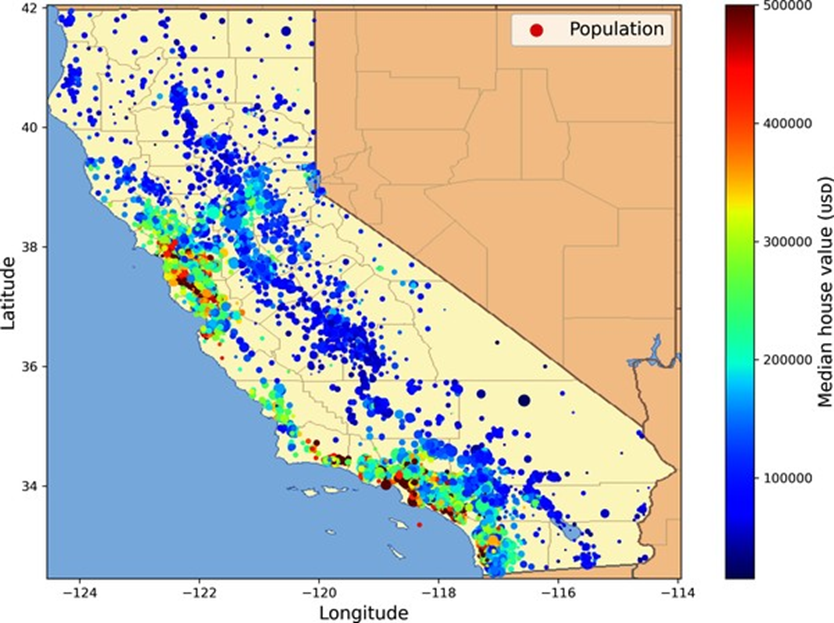
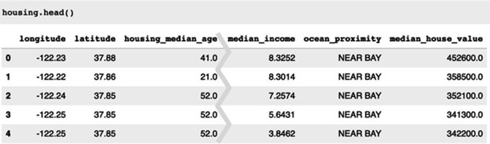
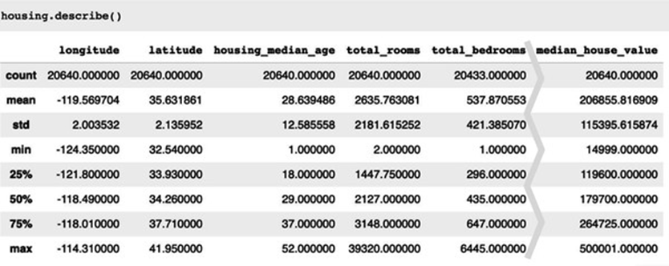
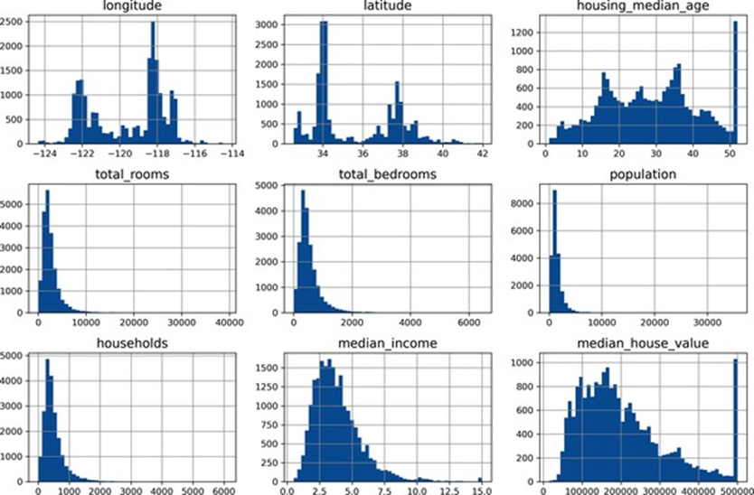

<!-- tabs:start -->

#### ** 📖 Lý thuyết **
# CHƯƠNG 2. DỰ ÁN HỌC MÁY TỪ ĐẦU ĐẾN CUỐI

Trong chương này, bạn sẽ thực hiện một dự án ví dụ từ đầu đến cuối,
đóng vai một nhà khoa học dữ liệu mới được tuyển dụng tại một công ty bất động
sản. Ví dụ này là hư cấu; mục tiêu là minh họa các bước chính của một dự án học
máy, không phải để tìm hiểu bất cứ điều gì về ngành kinh doanh bất động sản. Dưới
đây là các bước chính mà chúng ta sẽ thực hiện:


·        
Nhìn vào bức tranh lớn.


·        
Lấy dữ liệu.


·        
Khám phá và trực quan hóa dữ liệu
để có được cái nhìn sâu sắc.


·        
Chuẩn bị dữ liệu cho các thuật
toán học máy.


·        
Chọn một mô hình và huấn luyện
nó.


·        
Tinh chỉnh mô hình của bạn.


·        
Trình bày giải pháp của bạn.


·        
Triển khai, giám sát và duy trì
hệ thống của bạn.


### 2.1 Làm việc với dữ liệu thực

Khi bạn đang học về học máy, tốt nhất là nên thử
nghiệm với dữ liệu thực tế, không phải tập dữ liệu nhân tạo. May mắn thay, có
hàng nghìn tập dữ liệu mở để lựa chọn, trải rộng trên tất cả các loại lĩnh vực.
Dưới đây là một vài nơi bạn có thể tìm để lấy dữ liệu:


·        
Kho lưu trữ dữ liệu mở phổ biến:


o  
OpenML.org


o  
Kaggle.com


o  
PapersWithCode.com


o  
UC Irvine Machine Learning
Repository


o  
Bộ dữ liệu AWS của Amazon


o  
Bộ dữ liệu TensorFlow


·        
Các cổng thông tin Meta (chúng
liệt kê các kho lưu trữ dữ liệu mở):


o  
DataPortals.org


o  
OpenDataMonitor.eu


·        
Các trang khác liệt kê nhiều
kho lưu trữ dữ liệu mở phổ biến:


o  
Danh sách các tập dữ liệu học
máy của Wikipedia


o  
Quora.com


o  
Subreddit datasets


Trong chương này, chúng ta sẽ sử dụng tập dữ liệu
Giá nhà California từ kho StatLib1 (xem Hình 2-1). Tập dữ liệu này dựa trên dữ
liệu từ cuộc điều tra dân số California năm 1990. Nó không hoàn toàn mới (một
ngôi nhà đẹp ở Vùng Vịnh vẫn có giá phải chăng vào thời điểm đó), nhưng nó có
nhiều phẩm chất để học, vì vậy chúng ta sẽ giả vờ đó là dữ liệu gần đây. Với mục
đích giảng dạy, tôi đã thêm một thuộc tính phân loại và loại bỏ một vài tính
năng.





*Hình 2-1. Giá nhà California*


### .2.2 Nhìn vào bức tranh lớn

Chào mừng bạn đến với Công ty Học máy Bất động sản! Nhiệm vụ đầu
tiên của bạn là sử dụng dữ liệu điều tra dân số California để xây dựng mô hình
giá nhà ở tiểu bang. Dữ liệu này bao gồm các số liệu như dân số, thu nhập trung
bình và giá nhà trung bình cho mỗi nhóm khu vực ở California. Nhóm khu vực là
đơn vị địa lý nhỏ nhất mà Cục Thống kê Hoa Kỳ công bố dữ liệu mẫu (một nhóm khu
vực thường có dân số từ 600 đến 3.000 người). Tôi sẽ gọi chúng là “quận” cho ngắn
gọn.


Mô hình của bạn nên học từ dữ liệu này và có thể dự đoán giá nhà
trung bình ở bất kỳ quận nào, với tất cả các số liệu khác.


#### 2.2.1 Xác định vấn đề

Câu hỏi đầu tiên cần hỏi sếp của bạn là mục tiêu kinh doanh chính
xác là gì. Xây dựng một mô hình có lẽ không phải là mục tiêu cuối cùng. Công ty
mong đợi sử dụng và hưởng lợi từ mô hình này như thế nào? Biết mục tiêu là quan
trọng vì nó sẽ quyết định cách bạn xác định vấn đề, thuật toán bạn sẽ chọn, thước
đo hiệu suất bạn sẽ sử dụng để đánh giá mô hình của bạn và bạn sẽ dành bao
nhiêu nỗ lực để điều chỉnh nó. Sếp của bạn trả lời rằng đầu ra của mô hình của
bạn (dự đoán giá nhà trung bình của một quận) sẽ được đưa vào một hệ thống học
máy khác (xem Hình 2-2), cùng với nhiều tín hiệu khác.2 Hệ thống hạ nguồn này sẽ
xác định xem có đáng để đầu tư vào một khu vực nhất định hay không. Làm đúng điều
này là rất quan trọng, vì nó ảnh hưởng trực tiếp đến doanh thu. Câu hỏi tiếp
theo cần hỏi sếp của bạn là giải pháp hiện tại trông như thế nào (nếu có). Tình
hình hiện tại thường sẽ cung cấp cho bạn một tham chiếu về hiệu suất, cũng như
những hiểu biết sâu sắc về cách giải quyết vấn đề. Sếp của bạn trả lời rằng giá
nhà quận hiện đang được ước tính thủ công bởi các chuyên gia: một nhóm thu thập
thông tin cập nhật về một quận, và khi họ không thể có được giá nhà trung bình,
họ ước tính nó bằng các quy tắc phức tạp.


*Hình 2-2. Một quy trình học
máy cho đầu tư bất động sản*

Điều này tốn kém và mất thời gian, và các ước tính của họ không tốt;
trong những trường hợp họ tìm ra được giá nhà trung bình thực tế, họ thường nhận
ra rằng ước tính của họ sai lệch hơn 30%. Đây là lý do tại sao công ty cho rằng
việc huấn luyện một mô hình để dự đoán giá nhà trung bình của một quận, với dữ
liệu khác về quận đó, sẽ hữu ích. Dữ liệu điều tra dân số có vẻ là một tập dữ
liệu tuyệt vời để khai thác cho mục đích này, vì nó bao gồm giá nhà trung bình
của hàng nghìn quận, cũng như các dữ liệu khác.


Đường ống (Pipelines)


Một chuỗi các thành phần xử lý dữ liệu được gọi
là đường ống dữ liệu. Đường ống rất phổ biến trong các hệ thống học máy, vì có
rất nhiều dữ liệu để thao tác và nhiều phép biến đổi dữ liệu cần áp dụng. Các
thành phần thường chạy không đồng bộ. Mỗi thành phần kéo một lượng lớn dữ liệu
vào, xử lý nó và xuất kết quả vào một kho dữ liệu khác. Sau đó, một thời gian
sau, thành phần tiếp theo trong đường ống kéo dữ liệu này vào và xuất ra đầu ra
của riêng nó. Mỗi thành phần khá khép kín: giao diện giữa các thành phần chỉ
đơn giản là kho dữ liệu. Điều này làm cho hệ thống dễ nắm bắt (với sự trợ giúp
của biểu đồ luồng dữ liệu), và các nhóm khác nhau có thể tập trung vào các
thành phần khác nhau. Hơn nữa, nếu một thành phần bị hỏng, các thành phần hạ
nguồn thường có thể tiếp tục chạy bình thường (ít nhất là trong một thời gian)
bằng cách chỉ sử dụng đầu ra cuối cùng từ thành phần bị hỏng. Điều này làm cho
kiến trúc khá mạnh mẽ.


Mặt khác, một thành phần bị hỏng có thể không được
chú ý trong một thời gian nếu không có giám sát phù hợp. Dữ liệu trở nên cũ và
hiệu suất tổng thể của hệ thống giảm.


Với tất cả thông tin này, bây giờ bạn đã sẵn sàng bắt đầu thiết kế hệ
thống của mình. Đầu tiên, xác định loại giám sát huấn luyện mà mô hình sẽ cần:
đó là tác vụ học có giám sát, không giám sát, bán giám sát, tự giám sát hay học
tăng cường? Và đó là tác vụ phân loại, tác vụ hồi quy, hay một thứ khác? Bạn
nên sử dụng kỹ thuật học theo lô hay học trực tuyến? Trước khi bạn đọc tiếp,
hãy tạm dừng và tự mình trả lời những câu hỏi này.


Bạn đã tìm ra câu trả lời chưa? Hãy xem. Đây rõ ràng là một tác vụ học
có giám sát điển hình, vì mô hình có thể được huấn luyện bằng các ví dụ có nhãn
(mỗi trường hợp đi kèm với đầu ra mong muốn, tức là giá nhà trung bình của quận).
Đây là một tác vụ hồi quy điển hình, vì mô hình sẽ được yêu cầu dự đoán một giá
trị. Cụ thể hơn, đây là một vấn đề hồi quy đa biến, vì hệ thống sẽ sử dụng nhiều
đặc trưng để đưa ra dự đoán (dân số của quận, thu nhập trung bình, v.v.). Nó
cũng là một vấn đề hồi quy đơn biến, vì chúng ta chỉ cố gắng dự đoán một giá trị
duy nhất cho mỗi quận. Nếu chúng ta cố gắng dự đoán nhiều giá trị cho mỗi quận,
đó sẽ là một vấn đề hồi quy đa biến. Cuối cùng, không có luồng dữ liệu liên tục
đổ vào hệ thống, không có nhu cầu đặc biệt nào để điều chỉnh dữ liệu thay đổi
nhanh chóng, và dữ liệu đủ nhỏ để vừa trong bộ nhớ, vì vậy học theo lô đơn giản
sẽ ổn.


#### 2.2.2 Chọn một Thước đo Hiệu suất

Bước tiếp
theo của bạn là chọn một thước đo hiệu suất. Một thước đo hiệu suất điển hình
cho các bài toán hồi quy là sai số toàn phương trung bình (RMSE). Nó cho
biết mức độ lỗi mà hệ thống thường mắc phải trong các dự đoán của mình, với trọng
số cao hơn được đặt cho các sai số lớn. Công thức 2-1 trình bày công thức toán
học để tính RMSE.


Công thức
2-1. Sai số toàn phương trung bình (RMSE)


### CÁC KÝ HIỆU

Phần này giới thiệu một số ký hiệu rất phổ biến
trong học máy mà tôi sẽ sử dụng xuyên suốt cuốn sách này:


·        
m là số lượng mẫu trong tập dữ liệu mà bạn đang đo lường.


o  
Ví dụ, nếu bạn đang đánh giá
trên một tập kiểm định gồm 2.000 quận, thì m = 2.000.


·        
x⁽ⁱ⁾ là một vector chứa tất cả các giá trị đặc trưng (không bao gồm
nhãn) của mẫu thứ i trong tập dữ liệu, và y⁽ⁱ⁾ là nhãn của
nó (giá trị đầu ra mong muốn cho mẫu đó).


o  
Ví dụ, nếu quận đầu tiên trong
tập dữ liệu có kinh độ –118.29°, vĩ độ 33.91°, có 1.416 cư dân với thu nhập
trung vị là $38.372, và giá nhà trung vị là $156.400 (tạm bỏ qua các đặc trưng
khác), thì:


·        
X là một ma trận chứa tất cả các giá trị đặc trưng (không bao
gồm nhãn) của tất cả các mẫu trong tập dữ liệu. Mỗi hàng tương ứng với một mẫu,
và hàng thứ i bằng với ma trận chuyển vị của x⁽ⁱ⁾, ký hiệu là (x⁽ⁱ⁾)ᵀ.


o  
Ví dụ, nếu quận đầu tiên như mô
tả ở trên, thì ma trận X sẽ trông như sau:


·        
h là hàm dự đoán của hệ thống, còn được gọi là một giả thuyết
(hypothesis). Khi hệ thống của bạn nhận một vector đặc trưng của một mẫu là x⁽ⁱ⁾,
nó sẽ đưa ra một giá trị dự đoán ŷ⁽ⁱ⁾ cho mẫu đó (ŷ được phát âm là
“y-mũ”).


o  
Ví dụ, nếu hệ thống của bạn dự
đoán rằng giá nhà trung vị ở quận đầu tiên là $158.400, thì ŷ⁽¹⁾ = h(x⁽¹⁾) =
158.400. Sai số dự đoán cho quận này là ŷ⁽¹⁾ - y⁽¹⁾ = 2.000.


·        
RMSE(X, h) là hàm chi phí được đo lường trên tập hợp các ví dụ bằng
cách sử dụng giả thuyết h của bạn.


Chúng tôi sử dụng chữ in nghiêng viết thường cho
các giá trị vô hướng (chẳng hạn như 

 hoặc 

 ) và tên
hàm (chẳng hạn như 

 ), chữ in
đậm viết thường cho các vector (chẳng hạn như 

 ), và chữ
in đậm viết hoa cho các ma trận (chẳng hạn như 

 ).


Mặc dù RMSE thường là thước đo hiệu suất được ưa
chuộng cho các tác vụ hồi quy, trong một số bối cảnh, bạn có thể muốn sử dụng một
hàm khác. Ví dụ, nếu có nhiều quận là giá trị ngoại lai (outlier). Trong
trường hợp đó, bạn có thể cân nhắc sử dụng sai số tuyệt đối trung bình (MAE),
còn được gọi là độ lệch tuyệt đối trung bình, được trình bày trong Công
thức 2-2:


Công thức 2-2. Sai số tuyệt đối trung bình
(MAE)


Cả RMSE và MAE đều là các cách để đo khoảng
cách giữa hai vector: vector các giá trị dự đoán và vector các giá trị mục
tiêu. Có nhiều cách đo khoảng cách, hay còn gọi là chuẩn (norm), khác
nhau:


·        
Việc tính căn bậc hai của tổng
các bình phương (RMSE) tương ứng với chuẩn Euclid: đây là khái niệm khoảng
cách quen thuộc với tất cả chúng ta. Nó còn được gọi là chuẩn 

 , ký hiệu là 

 (hoặc chỉ
là 

 ).


·        
Việc tính tổng các giá trị tuyệt
đối (MAE) tương ứng với chuẩn 

 , ký hiệu là 

 . Đôi khi
nó được gọi là chuẩn Manhattan vì nó đo khoảng cách giữa hai điểm trong
một thành phố nếu bạn chỉ có thể đi dọc theo các dãy nhà vuông góc với nhau.


·        
Tổng quát hơn, chuẩn 

  của một vector 

 chứa 

 phần tử được
định nghĩa là 


 . 

 cho biết số
lượng phần tử khác không trong vector, và 

 cho biết
giá trị tuyệt đối lớn nhất trong vector.


Chỉ số chuẩn càng cao, nó
càng tập trung vào các giá trị lớn và bỏ qua các giá trị nhỏ. Đây là lý do tại sao RMSE nhạy cảm với các giá trị ngoại lai hơn
MAE. Nhưng khi các giá trị ngoại lai hiếm theo cấp số nhân (như trong đường
cong hình chuông), RMSE hoạt động rất tốt và thường được ưu tiên sử dụng.


#### 2.2.3 Kiểm tra các Giả định

Cuối cùng, một
thông lệ tốt là liệt kê và xác minh các giả định đã được đưa ra (bởi bạn hoặc
những người khác); điều này có thể giúp bạn phát hiện sớm các vấn đề nghiêm trọng.


Ví dụ, giá của các
quận mà hệ thống của bạn đưa ra sẽ được cung cấp cho một hệ thống máy học ở
khâu sau, và bạn giả định rằng những mức giá này sẽ được sử dụng nguyên trạng.
Nhưng điều gì sẽ xảy ra nếu hệ thống ở khâu sau chuyển đổi các mức giá này
thành các hạng mục (ví dụ: “rẻ”, “trung bình” hoặc “đắt”) và sau đó sử dụng các
hạng mục đó thay vì chính các mức giá? Trong trường hợp này, việc dự đoán giá một
cách chính xác hoàn toàn không còn quan trọng; hệ thống của bạn chỉ cần xác định
đúng hạng mục. Nếu vậy, thì bài toán lẽ ra nên được xác định là một bài toán
phân loại, chứ không phải là một bài toán hồi quy. Bạn sẽ không muốn
phát hiện ra điều này sau nhiều tháng làm việc trên một hệ thống hồi quy.


May mắn thay, sau
khi nói chuyện với đội ngũ phụ trách hệ thống ở khâu sau, bạn tin chắc rằng họ
thực sự cần các mức giá thực tế chứ không chỉ là các hạng mục. Tuyệt vời! Mọi
thứ đã sẵn sàng, đèn xanh đã bật, và bạn có thể bắt đầu lập trình ngay bây giờ!


### 2.3 Lấy Dữ liệu

Đã đến lúc
bắt tay vào việc.


Đừng ngần ngại lấy máy tính
xách tay của bạn và thực hành theo các ví dụ về mã nguồn. Như tôi đã đề cập
trong lời nói đầu, tất cả các ví dụ về mã trong cuốn sách này đều là mã nguồn
mở và có sẵn trực tuyến dưới dạng Jupyter notebook, là các tài liệu
tương tác chứa văn bản, hình ảnh và các đoạn mã có thể thực thi (trong trường hợp
của chúng ta là Python). Trong cuốn sách này, tôi sẽ giả định rằng bạn đang chạy
các notebook này trên Google Colab, một dịch vụ miễn phí cho phép bạn chạy
bất kỳ Jupyter notebook nào trực tiếp trên trình duyệt mà không cần phải cài đặt
bất cứ thứ gì trên máy của mình. Nếu bạn muốn sử dụng một nền tảng trực tuyến
khác (ví dụ: Kaggle) hoặc nếu bạn muốn cài đặt mọi thứ cục bộ trên máy của
riêng mình, vui lòng xem hướng dẫn trên trang GitHub của cuốn sách.


#### Chạy
các Ví dụ về Mã nguồn bằng Google Colab

Đầu tiên, hãy mở một
trình duyệt web và truy cập https://homl.info/colab3
: đường link này sẽ dẫn bạn đến Google Colab và hiển thị danh sách các Jupyter
notebook cho cuốn sách này (xem Hình 2-3).


Bạn sẽ tìm thấy một notebook cho mỗi chương, cộng với một vài
notebook và bài hướng dẫn bổ sung về NumPy, Matplotlib, Pandas, đại số tuyến
tính và vi tích phân. Ví dụ, nếu bạn nhấp vào 02_end_to_end_machine_learning_project.ipynb, notebook của Chương 2 sẽ được mở ra trong Google Colab (xem Hình
2-4).


Một Jupyter notebook bao gồm một danh sách các ô (cell). Mỗi
ô chứa mã có thể thực thi hoặc văn bản. Hãy thử nhấp đúp vào ô văn bản đầu tiên
(chứa câu “Welcome to Machine Learning Housing Corp.!”). Thao tác này sẽ mở ô
đó ra để chỉnh sửa. Lưu ý rằng Jupyter notebook sử dụng cú pháp Markdown
để định dạng (ví dụ: chữ đậm, chữ nghiêng, # Tiêu đề, [url](văn bản liên kết), v.v.). Hãy thử
sửa đổi văn bản này, sau đó nhấn Shift-Enter để xem kết quả.


*Hình 2-3. Danh sách các notebook trong
Google Colab*


*Hình 2-4. Notebook của bạn trong Google
Colab*

Tiếp theo, hãy tạo một ô mã mới bằng cách chọn Insert → “Code
cell” từ menu. Ngoài ra, bạn có thể nhấp vào nút + Code trên thanh
công cụ, hoặc di chuột qua cuối một ô cho đến khi bạn thấy + Code và +
Text xuất hiện, sau đó nhấp vào + Code. Trong ô mã mới, hãy gõ một
đoạn mã Python, chẳng hạn như print("Hello World"), sau đó
nhấn Shift-Enter để chạy mã này (hoặc nhấp vào nút ▶️ ở bên trái của ô).


Nếu bạn chưa đăng nhập vào tài khoản Google của mình, bạn sẽ được
yêu cầu đăng nhập ngay bây giờ (nếu bạn chưa có tài khoản Google, bạn sẽ cần tạo
một tài khoản). Sau khi đăng nhập, khi bạn cố gắng chạy mã, bạn sẽ thấy một cảnh
báo bảo mật cho biết rằng notebook này không phải do Google tạo ra. Một người
có ý đồ xấu có thể tạo ra một notebook để lừa bạn nhập thông tin đăng nhập
Google của mình để họ có thể truy cập dữ liệu cá nhân của bạn, vì vậy trước khi
chạy một notebook, hãy luôn đảm bảo rằng bạn tin tưởng tác giả của nó
(hoặc kiểm tra kỹ xem mỗi ô mã sẽ làm gì trước khi chạy). Giả sử bạn tin tưởng
tôi (hoặc bạn dự định kiểm tra mọi ô mã), bây giờ bạn có thể nhấp vào “Run
anyway”.


Colab sau đó sẽ cấp phát một môi trường thực thi (runtime) mới
cho bạn: đây là một máy ảo miễn phí đặt trên máy chủ của Google, chứa một
loạt các công cụ và thư viện Python, bao gồm mọi thứ bạn cần cho hầu hết các
chương (trong một số chương, bạn sẽ cần chạy một lệnh để cài đặt các thư viện bổ
sung). Quá trình này sẽ mất vài giây. Tiếp theo, Colab sẽ tự động kết nối với
môi trường thực thi này và sử dụng nó để thực thi ô mã mới của bạn. Điều quan
trọng là, mã chạy trên môi trường thực thi chứ không phải trên máy của bạn. Đầu
ra của mã sẽ được hiển thị bên dưới ô. Chúc mừng, bạn đã chạy thành công một đoạn
mã Python trên Colab! 🥳


Lưu các Thay đổi
Mã nguồn và Dữ liệu của bạn


Bạn có thể thay đổi
một notebook Colab, và các thay đổi đó sẽ được duy trì miễn là bạn giữ tab
trình duyệt mở. Nhưng một khi bạn đóng nó, các thay đổi sẽ bị mất. Để tránh điều
này, hãy đảm bảo bạn lưu một bản sao của notebook vào Google Drive của mình bằng
cách chọn File → “Save a copy in Drive”. Ngoài ra, bạn có thể tải
notebook về máy tính của mình bằng cách chọn File → Download → “Download
.ipynb”. Sau đó, bạn có thể truy cập lại https://colab.research.google.com
và mở notebook đó lên (từ Google Drive hoặc bằng cách tải lên từ máy tính của bạn).


Nếu notebook tạo ra dữ liệu mà bạn quan tâm, hãy chắc chắn rằng bạn
đã tải dữ liệu này về trước khi môi trường thực thi tắt. Để làm điều này, hãy
nhấp vào biểu tượng Files (xem bước 1 trong Hình 2-5), tìm tệp bạn muốn
tải xuống, nhấp vào dấu ba chấm dọc bên cạnh nó (bước 2), và nhấp vào Download
(bước 3). Ngoài ra, bạn có thể gắn (mount) Google Drive của mình vào môi
trường thực thi, cho phép notebook đọc và ghi tệp trực tiếp vào Google Drive
như thể đó là một thư mục cục bộ. Để làm điều này, hãy nhấp vào biểu tượng Files
(bước 1), sau đó nhấp vào biểu tượng Google Drive (được khoanh tròn
trong Hình 2-5) và làm theo hướng dẫn trên màn hình.


*Hình 2-5. Tải xuống một tệp từ môi trường
thực thi Google Colab (các bước từ 1 đến 3), hoặc gắn Google Drive của bạn (biểu
tượng được khoanh tròn)*

Theo mặc định, Google Drive của bạn sẽ được gắn tại /content/drive/MyDrive. Nếu bạn muốn sao
lưu một tệp dữ liệu, chỉ cần sao chép nó vào thư mục này bằng cách chạy !cp /content/my_great_model /content/drive/MyDrive. Bất kỳ lệnh nào bắt đầu bằng dấu chấm than (!) đều được coi là một lệnh shell,
không phải là mã Python: cp là lệnh shell của Linux để sao chép một tệp từ đường dẫn này sang
đường dẫn khác. Lưu ý rằng các môi trường thực thi của Colab chạy trên Linux (cụ
thể là Ubuntu).


Sức mạnh và Mối
nguy của Tính tương tác


Jupyter notebook có
tính tương tác, và đó là một điều tuyệt vời: bạn có thể chạy từng ô một, dừng lại
ở bất kỳ điểm nào, chèn một ô, thử nghiệm với mã, quay lại và chạy lại cùng một
ô, v.v., và tôi rất khuyến khích bạn làm như vậy. Nếu bạn chỉ chạy từng ô một
mà không bao giờ thử nghiệm với chúng, bạn sẽ không học nhanh được. Tuy nhiên,
sự linh hoạt này đi kèm với một cái giá: rất dễ chạy các ô sai thứ tự,
hoặc quên chạy một ô nào đó. Nếu điều này xảy ra, các ô mã tiếp theo có
khả năng sẽ bị lỗi. Ví dụ, ô mã đầu tiên trong mỗi notebook chứa mã thiết lập
(chẳng hạn như các lệnh import), vì vậy hãy đảm bảo bạn chạy nó trước tiên, nếu
không sẽ không có gì hoạt động.


Mã trong Sách và Mã trong Notebook


Đôi khi bạn có thể nhận thấy
một số khác biệt nhỏ giữa mã trong cuốn sách này và mã trong các notebook. Điều
này có thể xảy ra vì nhiều lý do:


·        
Một thư viện có thể đã thay
đổi một chút vào thời điểm bạn đọc những dòng này, hoặc có lẽ dù đã cố gắng
hết sức tôi vẫn mắc lỗi trong sách. Đáng buồn là, tôi không thể sửa mã trong bản
sách của bạn một cách thần kỳ (trừ khi bạn đang đọc bản điện tử và có thể tải về
phiên bản mới nhất), nhưng tôi có thể sửa các notebook. Vì vậy, nếu bạn gặp lỗi
sau khi sao chép mã từ cuốn sách này, vui lòng tìm mã đã được sửa trong các
notebook: tôi sẽ cố gắng giữ chúng không có lỗi và cập nhật với các phiên bản
thư viện mới nhất.


·        
Các notebook chứa một số mã
bổ sung để làm đẹp các biểu đồ (thêm nhãn, đặt kích thước phông chữ, v.v.)
và để lưu chúng ở độ phân giải cao cho cuốn sách này. Bạn có thể yên tâm bỏ qua
phần mã bổ sung này nếu muốn.


·        
Tôi đã tối ưu hóa mã cho
tính dễ đọc và đơn giản: Tôi đã làm cho nó tuyến tính và phẳng nhất có thể,
định nghĩa rất ít hàm hoặc lớp. Mục tiêu là đảm bảo rằng mã bạn đang chạy thường
ở ngay trước mắt bạn, và không bị lồng trong nhiều lớp trừu tượng mà bạn phải
tìm kiếm. Điều này cũng giúp bạn dễ dàng thử nghiệm với mã hơn. Để đơn giản, có
ít xử lý lỗi, và tôi đã đặt một số lệnh import ít phổ biến ngay tại nơi
chúng cần thiết (thay vì đặt chúng ở đầu tệp, như được khuyến nghị bởi hướng dẫn
về phong cách Python PEP 8). Nói như vậy, mã nguồn cho sản phẩm thực tế của bạn
sẽ không khác nhiều: chỉ cần module hóa hơn một chút, và có thêm các bài kiểm
thử và xử lý lỗi.


OK! Một khi bạn đã thoải
mái với Colab, bạn đã sẵn sàng để tải xuống dữ liệu.


#### 2.3.1 Tải Dữ liệu

Trong các môi trường điển hình, dữ liệu của bạn sẽ
có sẵn trong một cơ sở dữ liệu quan hệ hoặc một kho dữ liệu phổ biến nào đó, và
được phân tán trên nhiều bảng/tài liệu/tệp. Để truy cập nó, trước tiên bạn sẽ cần
lấy thông tin xác thực và quyền truy cập và làm quen với lược đồ dữ liệu. Tuy
nhiên, trong dự án này, mọi thứ đơn giản hơn nhiều: bạn sẽ chỉ cần tải xuống một
tệp nén duy nhất, housing.tgz, chứa một tệp giá trị được
phân tách bằng dấu phẩy (CSV) có tên là housing.csv với tất cả dữ liệu.


Thay vì tải xuống và giải nén dữ liệu theo cách thủ công, thường thì
tốt hơn là viết một hàm để làm việc đó cho bạn. Điều này đặc biệt hữu
ích nếu dữ liệu thay đổi thường xuyên: bạn có thể viết một kịch bản nhỏ sử dụng
hàm để lấy dữ liệu mới nhất (hoặc bạn có thể thiết lập một công việc theo lịch
trình để tự động làm điều đó vào các khoảng thời gian đều đặn). Tự động hóa quá
trình lấy dữ liệu cũng hữu ích nếu bạn cần cài đặt tập dữ liệu trên nhiều máy.


Đây là hàm để lấy và tải dữ liệu:


```python
from pathlib import Path
import pandas as pd
import tarfile
import urllib.request

def load_housing_data():
   
tarball_path = Path("datasets/housing.tgz")
   
if not tarball_path.is_file():
       
Path("datasets").mkdir(parents=True, exist_ok=True)
        url =
"https://github.com/ageron/data/raw/main/housing.tgz"
        urllib.request.urlretrieve(url,
tarball_path)
        with tarfile.open(tarball_path) as
housing_tarball:
           
housing_tarball.extractall(path="datasets")
   
return pd.read_csv(Path("datasets/housing/housing.csv"))

housing = load_housing_data()
```

Khi load_housing_data() được gọi, nó sẽ tìm tệp datasets/housing.tgz. Nếu không tìm thấy, nó sẽ tạo thư mục datasets bên trong thư mục hiện tại (mặc định là /content trong Colab), tải tệp housing.tgz từ kho lưu trữ GitHub ageron/data, và giải nén nội dung của nó vào thư mục datasets; thao tác này sẽ tạo ra thư mục datasets/housing chứa tệp housing.csv bên
trong. Cuối cùng, hàm này tải tệp CSV đó vào một đối tượng DataFrame của
Pandas chứa tất cả dữ liệu, và trả về nó.


#### 2.3.2 Xem
nhanh Cấu trúc Dữ liệu

Bạn bắt đầu bằng cách xem năm hàng
dữ liệu đầu tiên bằng phương thức head() của DataFrame (xem Hình 2-6).





*Hình 2-6. Năm hàng đầu tiên trong tập dữ liệu*

Mỗi hàng đại diện cho một quận. Có 10 thuộc tính (không phải tất cả
đều được hiển thị trong ảnh chụp màn hình): longitude, latitude, housing_median_age, total_rooms, total_bedrooms, population, households, median_income, median_house_value, và ocean_proximity.


Phương thức info() rất hữu ích để có được một mô tả nhanh về dữ liệu, đặc biệt là tổng
số hàng, kiểu của mỗi thuộc tính và số lượng giá trị không rỗng (non-null):


```python
>>> housing.info()
<class
'pandas.core.frame.DataFrame'>
RangeIndex: 20640 entries, 0 to
20639
Data columns (total 10 columns):
 #  
Column              Non-Null
Count  Dtype
---  ------              --------------  -----
 0  
longitude           20640
non-null  float64
 1  
latitude            20640
non-null  float64
 2  
housing_median_age  20640
non-null  float64
 3  
total_rooms         20640
non-null  float64
 4  
total_bedrooms      20433
non-null  float64
 5  
population          20640
non-null  float64
 6  
households          20640
non-null  float64
 7  
median_income       20640
non-null  float64
 8  
median_house_value  20640
non-null  float64
 9  
ocean_proximity     20640
non-null  object
dtypes: float64(9), object(1)
memory usage: 1.6+ MB
```

Có 20.640 mẫu trong tập dữ liệu,
có nghĩa là nó khá nhỏ theo tiêu chuẩn học máy, nhưng nó hoàn hảo để bắt đầu. Bạn
nhận thấy rằng thuộc tính total_bedrooms chỉ có 20.433 giá trị không rỗng, nghĩa là có 207 quận bị thiếu đặc
trưng này. Bạn sẽ cần phải xử lý vấn đề này sau.


Tất cả các thuộc tính đều là số, ngoại trừ ocean_proximity. Kiểu của nó là object, vì vậy nó có thể chứa bất kỳ loại đối tượng Python nào. Nhưng vì bạn
đã tải dữ liệu này từ một tệp CSV, bạn biết rằng nó phải là một thuộc tính văn
bản. Khi bạn xem năm hàng đầu tiên, bạn có thể đã nhận thấy rằng các giá trị
trong cột ocean_proximity lặp đi lặp lại, điều đó
có nghĩa là nó có thể là một thuộc tính phân loại (categorical attribute).
Bạn có thể tìm ra các loại (category) tồn tại và có bao nhiêu quận thuộc về mỗi
loại bằng cách sử dụng phương thức value_counts():


```python
>>>
housing["ocean_proximity"].value_counts()
<1H OCEAN     9136
INLAND        6551
NEAR OCEAN    2658
NEAR BAY      2290
ISLAND           5
Name: ocean_proximity, dtype:
int64
```

Hãy xem các trường khác. Phương thức
describe() hiển thị một bản tóm tắt các
thuộc tính số (Hình 2-7).





*Hình 2-7. Tóm tắt của từng thuộc tính số*

Các hàng count, mean, min, và max khá dễ hiểu. Lưu ý rằng các giá trị rỗng bị bỏ qua (vì vậy, ví dụ, count của total_bedrooms là 20.433 chứ không phải
20.640). Hàng std hiển thị độ lệch chuẩn, đo lường
mức độ phân tán của các giá trị. Các hàng 25%, 50%, và 75% hiển thị các phân vị (percentile) tương ứng: một phân vị cho
biết giá trị mà dưới nó có một tỷ lệ phần trăm nhất định các quan sát trong một
nhóm quan sát. Ví dụ, 25% các quận có housing_median_age thấp hơn 18, trong khi 50% thấp hơn 29 và 75% thấp hơn 37. Chúng
thường được gọi là phân vị thứ 25 (hoặc tứ phân vị thứ nhất), trung
vị, và phân vị thứ 75 (hoặc tứ phân vị thứ ba).


Một cách nhanh chóng khác để có cảm nhận về loại dữ liệu bạn đang xử
lý là vẽ một biểu đồ tần suất (histogram) cho mỗi thuộc tính số. Biểu đồ
tần suất hiển thị số lượng mẫu (trên trục tung) có một phạm vi giá trị nhất định
(trên trục hoành). Bạn có thể vẽ biểu đồ này cho từng thuộc tính một, hoặc bạn
có thể gọi phương thức hist() trên toàn bộ tập dữ liệu (như được hiển thị trong ví dụ mã sau), và
nó sẽ vẽ một biểu đồ tần suất cho mỗi thuộc tính số (xem Hình 2-8):


```python
import matplotlib.pyplot as plt

housing.hist(bins=50, figsize=(12,
8))
plt.show()
```





*Hình 2-8. Một biểu đồ tần suất cho mỗi thuộc tính số*

Nhìn vào các biểu đồ tần suất này, bạn nhận thấy một vài điều:


·        
Trước hết, thuộc tính thu nhập
trung vị (median_income) có vẻ không được biểu thị bằng đô la Mỹ (USD). Sau khi kiểm tra với
đội ngũ đã thu thập dữ liệu, bạn được cho biết rằng dữ liệu đã được co giãn
(scaled) và giới hạn trên (capped) ở mức 15 (thực ra là 15.0001) cho
các mức thu nhập trung vị cao hơn, và giới hạn dưới ở mức 0.5 (thực ra là
0.4999) cho các mức thu nhập trung vị thấp hơn. Các con số đại diện cho khoảng
hàng chục nghìn đô la (ví dụ: 3 thực sự có nghĩa là khoảng $30.000). Làm việc với
các thuộc tính đã được tiền xử lý là phổ biến trong học máy, và không nhất thiết
là một vấn đề, nhưng bạn nên cố gắng hiểu dữ liệu đã được tính toán như thế
nào.


·        
Tuổi trung vị của nhà (housing_median_age) và giá trị nhà trung vị (median_house_value) cũng bị giới hạn trên. Điều sau có thể
là một vấn đề nghiêm trọng vì nó là thuộc tính mục tiêu của bạn (nhãn của bạn).
Các thuật toán học máy của bạn có thể học rằng giá không bao giờ vượt quá giới
hạn đó. Bạn cần kiểm tra với nhóm khách hàng của mình (nhóm sẽ sử dụng đầu ra của
hệ thống của bạn) để xem đây có phải là vấn đề hay không. Nếu họ nói rằng họ cần
những dự đoán chính xác ngay cả khi vượt quá $500.000, thì bạn có hai lựa chọn:


o  
Thu thập các nhãn phù hợp cho
các quận có nhãn bị giới hạn trên.


o  
Loại bỏ các quận đó khỏi tập huấn
luyện (và cả tập kiểm tra, vì hệ thống của bạn không nên bị đánh giá kém nếu nó
dự đoán các giá trị vượt quá $500.000).


·        
Các thuộc tính này có thang
đo rất khác nhau. Chúng ta sẽ thảo luận về điều này sau trong chương này,
khi chúng ta khám phá về co giãn đặc trưng (feature scaling).


·        
Cuối cùng, nhiều biểu đồ tần suất
bị lệch phải (skewed right): chúng kéo dài về phía bên phải của trung vị
xa hơn nhiều so với bên trái. Điều này có thể làm cho một số thuật toán học máy
khó phát hiện các mẫu hơn một chút. Sau này, bạn sẽ thử biến đổi các thuộc tính
này để có các phân phối đối xứng hơn và có dạng hình chuông.


Bây giờ bạn đã có một sự hiểu biết
tốt hơn về loại dữ liệu mà bạn đang làm việc.


#### 2.3.3 Tạo tập kiểm thử

Có vẻ lạ khi tự nguyện gạt một phần dữ liệu sang một bên ở giai đoạn
này. Rốt cuộc, bạn mới chỉ xem lướt qua dữ liệu, và chắc chắn bạn nên tìm hiểu
nhiều hơn về nó trước khi quyết định sử dụng thuật toán nào, phải không? Điều
này đúng, nhưng bộ não của bạn là một hệ thống phát hiện mẫu tuyệt vời, điều đó
cũng có nghĩa là nó rất dễ bị quá khớp: nếu bạn nhìn vào tập kiểm thử, bạn có
thể tình cờ tìm thấy một số mẫu dường như thú vị trong dữ liệu kiểm thử, dẫn bạn
đến việc chọn một loại mô hình học máy cụ thể. Khi bạn ước tính lỗi tổng quát
hóa bằng cách sử dụng tập kiểm thử, ước tính của bạn sẽ quá lạc quan, và bạn sẽ
triển khai một hệ thống không hoạt động tốt như mong đợi. Điều này được gọi là
sai lệch do rò rỉ dữ liệu (data snooping bias). Tạo một tập kiểm thử về mặt lý
thuyết rất đơn giản; chọn ngẫu nhiên một số trường hợp, thường là 20% tập dữ liệu
(hoặc ít hơn nếu tập dữ liệu của bạn rất lớn), và đặt chúng sang một bên:


```python
import numpy as np

def shuffle_and_split_data(data, test_ratio):
   
shuffled_indices = np.random.permutation(len(data))
   
test_set_size = int(len(data) * test_ratio)
   
test_indices = shuffled_indices[:test_set_size]
   
train_indices = shuffled_indices[test_set_size:]
    return
data.iloc[train_indices], data.iloc[test_indices]
```

Bạn có thể sử dụng hàm này như sau:


```python
>>> train_set, test_set =
shuffle_and_split_data(housing, 0.2)
>>> len(train_set)
16512
>>> len(test_set)
4128
```

Vâng, cách này hoạt động, nhưng nó không hoàn hảo:
nếu bạn chạy lại chương trình, nó sẽ tạo ra một tập kiểm thử khác! Theo thời
gian, bạn (hoặc các thuật toán học máy của bạn) sẽ được thấy toàn bộ tập dữ liệu,
đây là điều bạn muốn tránh.


Một giải pháp là lưu tập kiểm thử trong lần chạy đầu tiên và sau đó
tải nó trong các lần chạy tiếp theo. Một lựa chọn khác là đặt hạt giống của bộ
tạo số ngẫu nhiên (ví dụ: với np.random.seed(42))6 trước khi gọi np.random.permutation() để nó luôn tạo ra cùng một chỉ số được xáo trộn. Tuy nhiên, cả hai
giải pháp này sẽ bị hỏng vào lần tới khi bạn lấy một tập dữ liệu đã cập nhật. Để
có một phân tách huấn luyện/kiểm thử ổn định ngay cả sau khi cập nhật tập dữ liệu,
một giải pháp phổ biến là sử dụng định danh của mỗi trường hợp để quyết định
xem nó có nên nằm trong tập kiểm thử hay không (giả sử các trường hợp có định
danh duy nhất và bất biến). Ví dụ, bạn có thể tính hàm băm (hash) của định danh
mỗi trường hợp và đưa trường hợp đó vào tập kiểm thử nếu hàm băm nhỏ hơn hoặc bằng
20% giá trị hàm băm tối đa. Điều này đảm bảo rằng tập kiểm thử sẽ vẫn nhất quán
qua nhiều lần chạy, ngay cả khi bạn làm mới tập dữ liệu. Tập kiểm thử mới sẽ chứa
20% các trường hợp mới, nhưng nó sẽ không chứa bất kỳ trường hợp nào đã có
trong tập huấn luyện trước đó. Dưới đây là một triển khai khả thi:


```python
from zlib import crc32

def is_id_in_test_set(identifier, test_ratio):
    return
crc32(np.int64(identifier)) < test_ratio * 2**32

def split_data_with_id_hash(data, test_ratio,
id_column):
    ids =
data[id_column]
    in_test_set
= ids.apply(lambda id_: is_id_in_test_set(id_, test_ratio))
    return
data.loc[~in_test_set], data.loc[in_test_set]
```

Thật không may, tập dữ liệu nhà ở không có cột định
danh. Giải pháp đơn giản nhất là sử dụng chỉ mục hàng làm ID:


```python
housing_with_id =
housing.reset_index() #adds an `index` column
train_set, test_set =
split_data_with_id_hash(housing_with_id, 0.2, "index")
```

Nếu bạn sử dụng chỉ mục hàng làm định danh duy nhất,
bạn cần đảm bảo rằng dữ liệu mới được thêm vào cuối tập dữ liệu và không có
hàng nào bị xóa. Nếu điều này không thể, thì bạn có thể cố gắng sử dụng các đặc
trưng ổn định nhất để xây dựng một định danh duy nhất. Ví dụ, vĩ độ và kinh độ
của một quận được đảm bảo ổn định trong vài triệu năm, vì vậy bạn có thể kết hợp
chúng thành một ID như sau:7


```python
housing_with_id["id"] =
housing["longitude"] * 1000 + housing["latitude"]
train_set, test_set =
split_data_with_id_hash(housing_with_id, 0.2, "id")
```

Scikit-Learn cung cấp một vài hàm để chia tập dữ
liệu thành nhiều tập con theo nhiều cách khác nhau. Hàm đơn giản nhất là train_test_split(), thực hiện khá giống với hàm shuffle_and_split_data() mà chúng ta đã định nghĩa trước đó, với một vài tính năng bổ sung.
Thứ nhất, có tham số random_state cho phép bạn đặt hạt giống
bộ tạo ngẫu nhiên. Thứ hai, bạn có thể truyền cho nó nhiều tập dữ liệu với số
hàng giống hệt nhau, và nó sẽ chia chúng theo cùng các chỉ mục (điều này rất hữu
ích, ví dụ, nếu bạn có một DataFrame riêng cho các nhãn):


```python
from sklearn.model_selection
import train_test_split

train_set, test_set = train_test_split(housing,
test_size=0.2, random_state=42)
```

Cho đến nay, chúng ta đã xem xét các phương pháp
lấy mẫu hoàn toàn ngẫu nhiên. Điều này nói chung là ổn nếu tập dữ liệu của bạn
đủ lớn (đặc biệt là so với số lượng thuộc tính), nhưng nếu không, bạn có nguy
cơ gây ra một sai lệch lấy mẫu đáng kể. Khi nhân viên tại một công ty khảo sát
quyết định gọi 1.000 người để hỏi họ một vài câu hỏi, họ không chỉ chọn ngẫu
nhiên 1.000 người trong danh bạ điện thoại. Họ cố gắng đảm bảo rằng 1.000 người
này đại diện cho toàn bộ dân số, liên quan đến các câu hỏi họ muốn hỏi. Ví dụ,
dân số Hoa Kỳ có 51.1% nữ và 48.9% nam, vì vậy một cuộc khảo sát được thực hiện
tốt ở Hoa Kỳ sẽ cố gắng duy trì tỷ lệ này trong mẫu: 511 nữ và 489 nam (ít nhất
là nếu có vẻ khả thi rằng câu trả lời có thể thay đổi theo giới tính). Đây được
gọi là lấy mẫu phân tầng: dân số được chia thành các nhóm con đồng nhất gọi là
tầng (strata), và số lượng trường hợp đúng được lấy mẫu từ mỗi tầng để đảm bảo
rằng tập kiểm thử đại diện cho toàn bộ dân số. Nếu những người thực hiện khảo
sát sử dụng lấy mẫu hoàn toàn ngẫu nhiên, sẽ có khoảng 10.7% khả năng lấy mẫu một
tập kiểm thử bị lệch với ít hơn 48.5% nữ hoặc hơn 53.5% nữ tham gia. Dù bằng
cách nào, kết quả khảo sát có thể sẽ khá sai lệch.


Giả sử bạn đã trò chuyện với một số chuyên gia đã nói với bạn rằng
thu nhập trung bình là một thuộc tính rất quan trọng để dự đoán giá nhà trung
bình. Bạn có thể muốn đảm bảo rằng tập kiểm thử đại diện cho các loại thu nhập
khác nhau trong toàn bộ tập dữ liệu. Vì thu nhập trung bình là một thuộc tính số
liên tục, trước tiên bạn cần tạo một thuộc tính danh mục thu nhập. Hãy xem xét
kỹ hơn biểu đồ thu nhập trung bình (quay lại Hình 2-8): hầu hết các giá trị thu
nhập trung bình được nhóm quanh 1.5 đến 6 (tức là $15.000–$60.000), nhưng một số
thu nhập trung bình vượt xa 6. Điều quan trọng là phải có đủ số lượng trường hợp
trong tập dữ liệu của bạn cho mỗi tầng, nếu không ước tính tầm quan trọng của một
tầng có thể bị sai lệch. Điều này có nghĩa là bạn không nên có quá nhiều tầng,
và mỗi tầng phải đủ lớn. Đoạn mã sau sử dụng hàm pd.cut() để tạo một thuộc tính danh mục thu nhập với năm loại (được gắn nhãn
từ 1 đến 5); loại 1 nằm trong khoảng từ 0 đến 1.5 (tức là dưới $15.000), loại 2
từ 1.5 đến 3, v.v.:


```python
housing["income_cat"] =
pd.cut(housing["median_income"],
                              bins=[0., 1.5,
3.0, 4.5, 6., np.inf],
                              labels=[1, 2, 3,
4, 5])
```

Các danh mục thu nhập này được biểu diễn trong
Hình 2-9:


```python
housing["income_cat"].value_counts().sort_index().plot.bar(rot=0,
grid=True)
plt.xlabel("Income category")
plt.ylabel("Number of districts")
plt.show()
```

Bây giờ bạn đã sẵn sàng thực hiện lấy mẫu phân tầng
dựa trên danh mục thu nhập. Scikit-Learn cung cấp một số lớp chia tách trong
gói sklearn.model_selection triển khai các
chiến lược khác nhau để chia tập dữ liệu của bạn thành một tập huấn luyện và một
tập kiểm thử. Mỗi bộ chia tách có một phương thức split() trả về một trình lặp trên các phân tách huấn luyện/kiểm thử khác
nhau của cùng một dữ liệu.


*Hình 2-9. Biểu đồ danh mục
thu nhập*

Chính xác hơn, phương thức split() trả về các chỉ
mục huấn luyện và kiểm thử, chứ không phải bản thân dữ liệu. Việc có nhiều phân
tách có thể hữu ích nếu bạn muốn ước tính tốt hơn hiệu suất của mô hình, như bạn
sẽ thấy khi chúng ta thảo luận về xác thực chéo sau trong chương này. Ví dụ, đoạn
mã sau tạo 10 phân tách phân tầng khác nhau của cùng một tập dữ liệu:


```python
from sklearn.model_selection
import StratifiedShuffleSplit

splitter = StratifiedShuffleSplit(n_splits=10,
test_size=0.2, random_state=42)
strat_splits = []

for train_index, test_index in
splitter.split(housing, housing["income_cat"]):
   
strat_train_set_n = housing.iloc[train_index]
   
strat_test_set_n = housing.iloc[test_index]
   
strat_splits.append([strat_train_set_n, strat_test_set_n])
```

Hiện tại, bạn có thể chỉ sử dụng phân tách đầu
tiên:


```python
strat_train_set, strat_test_set =
strat_splits[0]
```

Hoặc, vì lấy mẫu phân tầng khá phổ biến, có một
cách ngắn gọn hơn để có được một phân tách duy nhất bằng cách sử dụng hàm train_test_split() với đối số stratify:


```python
strat_train_set, strat_test_set =
train_test_split(
    housing,
test_size=0.2, stratify=housing["income_cat"], random_state=42)
```

Hãy xem liệu điều này có hoạt động như mong đợi
không. Bạn có thể bắt đầu bằng cách xem xét tỷ lệ danh mục thu nhập trong tập
kiểm thử:


```python
>>>
strat_test_set["income_cat"].value_counts() / len(strat_test_set)
3    0.350533
2    0.318798
4    0.176357
5    0.114341
1    0.039971
Name: income_cat, dtype: float64
```

Với mã tương tự, bạn có thể đo lường tỷ lệ danh mục
thu nhập trong toàn bộ tập dữ liệu. Hình 2-10 so sánh tỷ lệ danh mục thu nhập
trong toàn bộ tập dữ liệu, trong tập kiểm thử được tạo bằng lấy mẫu phân tầng
và trong tập kiểm thử được tạo bằng lấy mẫu hoàn toàn ngẫu nhiên. Như bạn có thể
thấy, tập kiểm thử được tạo bằng lấy mẫu phân tầng có tỷ lệ danh mục thu nhập gần
như giống hệt với tập dữ liệu đầy đủ, trong khi tập kiểm thử được tạo bằng lấy
mẫu hoàn toàn ngẫu nhiên bị lệch.


*Hình 2-10. So sánh sai lệch lấy
mẫu giữa lấy mẫu phân tầng và lấy mẫu hoàn toàn ngẫu nhiên*

Bạn sẽ không sử dụng cột income_cat nữa, vì vậy
bạn có thể loại bỏ nó, đưa dữ liệu về trạng thái ban đầu:


```python
for set_ in (strat_train_set,
strat_test_set):
   
set_.drop("income_cat", axis=1, inplace=True)
```

Chúng ta đã dành khá nhiều thời gian cho việc tạo
tập kiểm thử vì một lý do chính đáng: đây là một phần thường bị bỏ qua nhưng lại
rất quan trọng của một dự án học máy. Hơn nữa, nhiều ý tưởng này sẽ hữu ích sau
này khi chúng ta thảo luận về kiểm định chéo. Bây giờ là lúc chuyển sang giai
đoạn tiếp theo: khám phá dữ liệu.


### 2.4 Tự do khám phá và trực
quan hóa dữ liệu để thu được thông tin chi tiết

Cho đến nay bạn mới chỉ lướt qua dữ liệu để có được cái nhìn tổng
quan về loại dữ liệu bạn đang thao tác. Bây giờ mục tiêu là đi sâu hơn một
chút. Đầu tiên, hãy đảm bảo bạn đã để riêng tập kiểm thử và bạn chỉ đang khám
phá tập huấn luyện. Ngoài ra, nếu tập huấn luyện rất lớn, bạn có thể muốn lấy mẫu
một tập khám phá, để thao tác dễ dàng và nhanh chóng trong giai đoạn khám phá.
Trong trường hợp này, tập huấn luyện khá nhỏ, vì vậy bạn có thể làm việc trực
tiếp trên toàn bộ tập. Vì bạn sẽ thử nghiệm với các biến đổi khác nhau của toàn
bộ tập huấn luyện, bạn nên tạo một bản sao của bản gốc để bạn có thể hoàn
nguyên về nó sau này:


```python
housing = strat_train_set.copy()
```


#### 2.4.1 Trực quan hóa dữ liệu địa lý

Vì tập dữ liệu bao gồm thông tin địa lý (vĩ độ và
kinh độ), nên việc tạo biểu đồ phân tán của tất cả các quận để trực quan hóa dữ
liệu là một ý tưởng hay (Hình 2-11):


```python
housing.plot(kind="scatter",
x="longitude", y="latitude", grid=True)
plt.show()
```


*Hình 2-11. Biểu đồ phân tán địa
lý của dữ liệu*

Điều này trông giống California rồi, nhưng ngoài
ra rất khó để thấy bất kỳ mẫu cụ thể nào. Đặt tùy chọn alpha thành 0.2 giúp dễ dàng trực quan hóa các nơi có mật độ điểm dữ liệu
cao hơn (Hình 2-12):


```python
housing.plot(kind="scatter",
x="longitude", y="latitude", grid=True, alpha=0.2)
plt.show()
```

Bây giờ thì tốt hơn nhiều: bạn có thể thấy rõ các
khu vực mật độ cao, cụ thể là Vùng Vịnh và xung quanh Los Angeles và San Diego,
cộng thêm một dải dài các khu vực mật độ khá cao ở Thung lũng Trung tâm (đặc biệt
là xung quanh Sacramento và Fresno). Bộ não của chúng ta rất giỏi trong việc
phát hiện các mẫu trong hình ảnh, nhưng bạn có thể cần thử nghiệm với các tham
số trực quan hóa để làm cho các mẫu nổi bật hơn.


*Hình 2-12. Một hình ảnh trực
quan tốt hơn làm nổi bật các khu vực mật độ cao*

Tiếp theo, bạn xem xét giá nhà (Hình 2-13). Bán kính của mỗi vòng
tròn đại diện cho dân số của quận (tùy chọn s), và màu sắc đại diện cho giá (tùy chọn c). Ở đây bạn sử dụng một bản đồ màu được xác định trước (tùy chọn cmap) có tên là jet, từ màu xanh lam (giá trị thấp) đến
màu đỏ (giá cao):8


```python
housing.plot(kind="scatter",
x="longitude", y="latitude", grid=True,
            
s=housing["population"] / 100, label="population",
            
c="median_house_value", cmap="jet", colorbar=True,
            
legend=True, sharex=False, figsize=(10, 7))
plt.show()
```

Hình ảnh này cho bạn biết rằng giá nhà rất liên
quan đến vị trí (ví dụ: gần biển) và mật độ dân số, như bạn có lẽ đã biết. Một
thuật toán phân cụm sẽ hữu ích để phát hiện cụm chính và để thêm các đặc trưng
mới đo lường sự gần gũi với các trung tâm cụm. Thuộc tính gần biển cũng có thể
hữu ích, mặc dù ở Bắc California, giá nhà ở các quận ven biển không quá cao, vì
vậy nó không phải là một quy tắc đơn giản.


*Hình 2-13. Giá nhà
California: màu đỏ là đắt, màu xanh lam là rẻ, vòng tròn lớn hơn cho biết các
khu vực có dân số lớn hơn*


#### 2.4.2 Tìm kiếm các tương quan

Vì tập dữ liệu không quá lớn,
bạn có thể dễ dàng tính toán hệ số tương quan chuẩn (còn gọi là r của Pearson)
giữa mỗi cặp thuộc tính bằng cách sử dụng phương thức corr():


```python
corr_matrix = housing.corr()
```

Bây giờ bạn có thể xem xét mức độ mỗi thuộc tính
tương quan với giá trị nhà trung bình:


```python
>>>
corr_matrix["median_house_value"].sort_values(ascending=False)
median_house_value   
1.000000
median_income        
0.688380
total_rooms          
0.137455
housing_median_age   
0.102175
households           
0.071426
total_bedrooms       
0.054635
population          
-0.020153
longitude           
-0.050859
latitude            
-0.139584
Name: median_house_value, dtype: float64
```

Hệ số tương quan nằm trong khoảng từ -1 đến 1.
Khi nó gần 1, có nghĩa là có mối tương quan dương mạnh; ví dụ, giá trị nhà
trung bình có xu hướng tăng khi thu nhập trung bình tăng. Khi hệ số gần -1, có
nghĩa là có mối tương quan âm mạnh; bạn có thể thấy mối tương quan âm nhỏ giữa
vĩ độ và giá trị nhà trung bình (tức là giá có xu hướng giảm nhẹ khi bạn đi về
phía bắc). Cuối cùng, các hệ số gần 0 có nghĩa là không có mối tương quan tuyến
tính. Một cách khác để kiểm tra mối tương quan giữa các thuộc tính là sử dụng
hàm scatter_matrix() của Pandas, hàm này vẽ
biểu đồ mỗi thuộc tính số với mọi thuộc tính số khác. Vì hiện có 11 thuộc tính
số, bạn sẽ nhận được 112 = 121 biểu đồ, sẽ không vừa trên một trang
— vì vậy bạn quyết định tập trung vào một vài thuộc tính đầy hứa hẹn dường như
tương quan nhất với giá trị nhà trung bình (Hình 2-14):


```python
from pandas.plotting import
scatter_matrix

attributes = ["median_house_value",
"median_income", "total_rooms",
"housing_median_age"]
scatter_matrix(housing[attributes], figsize=(12, 8))
plt.show()
```


*Hình 2-14. Ma trận phân tán
này vẽ biểu đồ mọi thuộc tính số với mọi thuộc tính số khác, cộng với biểu đồ tần
suất giá trị của mỗi thuộc tính số trên đường chéo chính (từ trên cùng bên trái
xuống dưới cùng bên phải)*

Đường chéo chính sẽ đầy các đường thẳng nếu
Pandas vẽ mỗi biến với chính nó, điều đó sẽ không hữu ích lắm. Thay vào đó,
Pandas hiển thị biểu đồ tần suất của mỗi thuộc tính (các tùy chọn khác có sẵn;
xem tài liệu Pandas để biết thêm chi tiết). Nhìn vào các biểu đồ phân tán tương
quan, có vẻ như thuộc tính hứa hẹn nhất để dự đoán giá trị nhà trung bình là
thu nhập trung bình, vì vậy bạn phóng to biểu đồ phân tán của chúng (Hình
2-15):


```python
housing.plot(kind="scatter",
x="median_income", y="median_house_value",
            
alpha=0.1, grid=True)
plt.show()
```


*Hình 2-15. Thu nhập trung
bình so với giá trị nhà trung bình*

Biểu đồ này tiết lộ một vài điều. Đầu tiên, mối
tương quan thực sự khá mạnh; bạn có thể thấy rõ xu hướng tăng, và các điểm
không quá phân tán. Thứ hai, giới hạn giá mà bạn nhận thấy trước đó rõ ràng hiển
thị dưới dạng một đường ngang ở mức $500.000. Nhưng biểu đồ cũng tiết lộ các đường
thẳng ít rõ ràng hơn khác: một đường ngang quanh $450.000, một đường khác quanh
$350.000, có lẽ một đường quanh $280.000, và một vài đường nữa bên dưới đó. Bạn
có thể muốn thử loại bỏ các quận tương ứng để ngăn thuật toán của bạn học cách
tái tạo những điểm đặc biệt của dữ liệu này.


*Hình 2-16. Hệ số tương quan
chuẩn của các tập dữ liệu khác nhau (nguồn: Wikipedia; hình ảnh phạm vi công cộng)*


#### 2.4.3 Thử nghiệm với các kết
hợp thuộc tính

Hy vọng các phần trước đã cho bạn ý tưởng về một
vài cách bạn có thể khám phá dữ liệu và thu được thông tin chi tiết. Bạn đã xác
định được một vài điểm đặc biệt của dữ liệu mà bạn có thể muốn làm sạch trước
khi cung cấp dữ liệu cho thuật toán học máy, và bạn đã tìm thấy những tương
quan thú vị giữa các thuộc tính, đặc biệt là với thuộc tính mục tiêu. Bạn cũng
nhận thấy rằng một số thuộc tính có phân phối lệch phải, vì vậy bạn có thể muốn
biến đổi chúng (ví dụ: bằng cách tính logarit hoặc căn bậc hai của chúng). Dĩ
nhiên, hiệu quả của bạn sẽ khác nhau đáng kể với mỗi dự án, nhưng những ý tưởng
chung là tương tự.


Một điều cuối cùng bạn có thể muốn làm trước khi chuẩn bị dữ liệu
cho các thuật toán học máy là thử các kết hợp thuộc tính khác nhau. Ví dụ, tổng
số phòng trong một quận không hữu ích lắm nếu bạn không biết có bao nhiêu hộ
gia đình. Điều bạn thực sự muốn là số phòng trên mỗi hộ gia đình. Tương tự, tổng
số phòng ngủ tự nó không hữu ích lắm: bạn có thể muốn so sánh nó với tổng số
phòng. Và dân số trên mỗi hộ gia đình cũng có vẻ là một sự kết hợp thuộc tính
thú vị để xem xét. Bạn tạo các thuộc tính mới này như sau:


```python
housing["rooms_per_house"]
= housing["total_rooms"] / housing["households"]
housing["bedrooms_ratio"] =
housing["total_bedrooms"] / housing["total_rooms"]
housing["people_per_house"] =
housing["population"] / housing["households"]
```

Và sau đó bạn xem lại ma trận tương quan:


```python
>>> corr_matrix =
housing.corr()
>>>
corr_matrix["median_house_value"].sort_values(ascending=False)
median_house_value   
1.000000
median_income        
0.688380
rooms_per_house      
0.143663
total_rooms          
0.137455
housing_median_age   
0.102175
households           
0.071426
total_bedrooms       
0.054635
population          
-0.020153
people_per_house    
-0.038224
longitude           
-0.050859
latitude            
-0.139584
bedrooms_ratio      
-0.256397
Name: median_house_value, dtype: float64
```

Chà, không tệ! Thuộc tính bedrooms_ratio mới tương quan với giá trị nhà trung bình nhiều hơn đáng kể so với
tổng số phòng hoặc phòng ngủ. Rõ ràng, những ngôi nhà có tỷ lệ phòng ngủ/phòng
thấp hơn có xu hướng đắt hơn. Số phòng trên mỗi hộ gia đình cũng cung cấp nhiều
thông tin hơn tổng số phòng trong một quận — rõ ràng nhà càng lớn thì càng đắt.


Vòng khám phá này không nhất thiết phải hoàn toàn kỹ lưỡng; mục đích
là để bắt đầu đúng hướng và nhanh chóng thu được những hiểu biết sâu sắc sẽ
giúp bạn có được một nguyên mẫu đầu tiên khá tốt. Nhưng đây là một quy trình lặp
đi lặp lại: một khi bạn có một nguyên mẫu hoạt động, bạn có thể phân tích đầu
ra của nó để có thêm thông tin chi tiết và quay lại bước khám phá này.


### 2.5 Chuẩn bị dữ liệu cho các thuật toán học
máy

Đã đến lúc chuẩn bị dữ liệu cho các thuật toán học máy của bạn. Thay
vì thực hiện thủ công, bạn nên viết các hàm cho mục đích này, vì một số lý do
chính đáng:


·        
Điều này sẽ cho phép bạn tái tạo
các phép biến đổi này một cách dễ dàng trên bất kỳ tập dữ liệu nào (ví dụ: lần
tới khi bạn có một tập dữ liệu mới).


·        
Bạn sẽ dần dần xây dựng một thư
viện các hàm biến đổi mà bạn có thể tái sử dụng trong các dự án tương lai.


·        
Bạn có thể sử dụng các hàm này
trong hệ thống trực tiếp của mình để biến đổi dữ liệu mới trước khi cung cấp
cho các thuật toán của bạn.


·        
Điều này sẽ giúp bạn dễ dàng thử
các phép biến đổi khác nhau và xem sự kết hợp các phép biến đổi nào hoạt động tốt
nhất.


Nhưng trước tiên, hãy quay lại tập huấn luyện sạch
(bằng cách sao chép strat_train_set một lần nữa). Bạn cũng
nên tách các biến dự đoán và nhãn, vì bạn không nhất thiết muốn áp dụng cùng
các phép biến đổi cho các biến dự đoán và giá trị mục tiêu (lưu ý rằng drop() tạo một bản sao của dữ liệu và không ảnh hưởng đến strat_train_set):


```python
housing =
strat_train_set.drop("median_house_value", axis=1)
housing_labels =
strat_train_set["median_house_value"].copy()
```


#### 2.5.1 Làm sạch dữ liệu

Hầu hết các thuật toán học máy không thể hoạt động
với các đặc trưng bị thiếu, vì vậy bạn sẽ cần phải xử lý chúng. Ví dụ, bạn đã
nhận thấy trước đó rằng thuộc tính total_bedrooms có một
số giá trị bị thiếu. Bạn có ba lựa chọn để khắc phục điều này:


·        
Loại bỏ các quận tương ứng.


·        
Loại bỏ toàn bộ thuộc tính.


·        
Đặt các giá trị bị thiếu thành
một giá trị nào đó (không, giá trị trung bình, giá trị trung vị, v.v.). Điều
này được gọi là điền khuyết (imputation).


Bạn có thể dễ dàng thực hiện những điều này bằng
các phương thức dropna(), drop() và fillna() của Pandas DataFrame:


```python
housing.dropna(subset=["total_bedrooms"],
inplace=True) # option 1
housing.drop("total_bedrooms", axis=1) #
option 2
median = housing["total_bedrooms"].median()
# option 3
housing["total_bedrooms"].fillna(median,
inplace=True)
```

Bạn quyết định chọn tùy chọn 3 vì nó ít phá hủy
nhất, nhưng thay vì đoạn mã trên, bạn sẽ sử dụng một lớp tiện dụng của
Scikit-Learn: SimpleImputer. Lợi ích là nó sẽ lưu trữ
giá trị trung vị của mỗi đặc trưng: điều này sẽ giúp điền khuyết các giá trị bị
thiếu không chỉ trên tập huấn luyện mà còn trên tập xác thực, tập kiểm thử và bất
kỳ dữ liệu mới nào được đưa vào mô hình. Để sử dụng nó, trước tiên bạn cần tạo
một thể hiện SimpleImputer, chỉ định rằng bạn muốn
thay thế các giá trị bị thiếu của mỗi thuộc tính bằng giá trị trung vị của thuộc
tính đó:


```python
from sklearn.impute import
SimpleImputer
imputer = SimpleImputer(strategy="median")
```

Vì giá trị trung vị chỉ có thể được tính trên các
thuộc tính số, bạn cần tạo một bản sao của dữ liệu chỉ với các thuộc tính số
(điều này sẽ loại trừ thuộc tính văn bản ocean_proximity):


```python
housing_num =
housing.select_dtypes(include=[np.number])
```

Bây giờ bạn có thể điều chỉnh thể hiện imputer cho dữ liệu huấn luyện bằng phương thức fit():


```python
imputer.fit(housing_num)
```

imputer đơn giản đã
tính toán giá trị trung vị của mỗi thuộc tính và lưu trữ kết quả trong biến thể
hiện statistics_ của nó. Chỉ thuộc tính


total_bedrooms có giá trị bị thiếu,
nhưng bạn không thể chắc chắn rằng sẽ không có bất kỳ giá trị bị thiếu nào
trong dữ liệu mới sau khi hệ thống hoạt động, vì vậy an toàn hơn là áp dụng imputer cho tất cả các thuộc tính số:


```python
>>> imputer.statistics_
array([-118.51, 34.26 , 29. , 2125. , 434. , 1167. ,
408. , 3.5385])
>>> housing_num.median().values
array([-118.51, 34.26 , 29. , 2125. , 434. , 1167. ,
408. , 3.5385])
```

Bây giờ bạn có thể sử dụng imputer “đã huấn luyện” này để biến đổi tập huấn luyện bằng cách thay thế
các giá trị bị thiếu bằng các giá trị trung vị đã học:


```python
X = imputer.transform(housing_num)
```

Các giá trị bị thiếu cũng có thể được thay thế bằng
giá trị trung bình (strategy="mean"), hoặc với giá
trị thường xuyên nhất (strategy="most_frequent"), hoặc
với một giá trị không đổi (strategy="constant", fill_value=…). Hai chiến lược cuối cùng hỗ trợ dữ liệu không phải số.


THIẾT KẾ SCIKIT-LEARN


API của Scikit-Learn được thiết kế đặc biệt tốt. Đây là các nguyên tắc
thiết kế chính:


Tính nhất quán


Tất cả các đối tượng đều chia sẻ một giao diện nhất quán và đơn giản:


·        
Estimators Bất kỳ đối tượng nào có thể ước tính một số tham số dựa trên tập dữ
liệu được gọi là estimator (ví dụ: SimpleImputer là một
estimator). Bản thân quá trình ước tính được thực hiện bằng phương thức fit(), và nó nhận một tập dữ liệu làm tham số, hoặc hai cho các thuật
toán học có giám sát — tập dữ liệu thứ hai chứa các nhãn. Bất kỳ tham số nào
khác cần thiết để hướng dẫn quá trình ước tính được coi là một siêu tham số (chẳng
hạn như chiến lược của SimpleImputer), và nó phải được đặt dưới
dạng biến thể hiện (thường thông qua tham số của hàm tạo).


·        
Transformers Một số estimators (chẳng hạn như SimpleImputer) cũng có thể biến đổi một tập dữ liệu; chúng được gọi là
transformer. Một lần nữa, API rất đơn giản: phép biến đổi được thực hiện bằng
phương thức transform() với tập dữ liệu cần biến đổi
làm tham số. Nó trả về tập dữ liệu đã biến đổi. Phép biến đổi này thường dựa
trên các tham số đã học, như trường hợp của SimpleImputer. Tất cả các transformer cũng có một phương thức tiện lợi được gọi
là fit_transform(), tương đương với việc gọi
fit() và sau đó transform() (nhưng đôi khi fit_transform() được tối ưu hóa và chạy nhanh hơn nhiều).


·        
Predictors Cuối cùng, một số estimators, khi được cung cấp một tập dữ liệu, có
khả năng đưa ra dự đoán; chúng được gọi là predictor. Ví dụ, mô hình LinearRegression trong chương trước là một predictor: khi được cung cấp GDP trên đầu
người của một quốc gia, nó đã dự đoán sự hài lòng cuộc sống. Một predictor có
phương thức predict() nhận một tập dữ liệu các trường
hợp mới và trả về một tập dữ liệu các dự đoán tương ứng. Nó cũng có phương thức
score() đo lường chất lượng của các dự đoán, với một tập kiểm thử (và các
nhãn tương ứng, trong trường hợp các thuật toán học có giám sát). Kiểm tra
Tất cả các siêu tham số của estimator có thể truy cập trực tiếp thông qua các
biến thể hiện công khai (ví dụ: imputer.strategy), và tất cả các tham số
đã học của estimator có thể truy cập thông qua các biến thể hiện công khai với
hậu tố gạch dưới (ví dụ: imputer.statistics_). Không mở rộng lớp
Các tập dữ liệu được biểu diễn dưới dạng mảng NumPy hoặc ma trận thưa SciPy,
thay vì các lớp tự tạo. Siêu tham số chỉ là các chuỗi hoặc số Python thông thường.
Thành phần Các khối xây dựng hiện có được tái sử dụng càng nhiều càng tốt.
Ví dụ, rất dễ dàng tạo một Pipeline estimator từ một chuỗi bất kỳ
các transformer được theo sau bởi một estimator cuối cùng, như bạn sẽ thấy. Giá
trị mặc định hợp lý Scikit-Learn cung cấp các giá trị mặc định hợp lý cho hầu
hết các tham số, giúp dễ dàng nhanh chóng tạo một hệ thống hoạt động cơ bản.


Transformer của Scikit-Learn xuất ra mảng NumPy
(hoặc đôi khi là ma trận thưa SciPy) ngay cả khi chúng được cung cấp Pandas
DataFrames làm đầu vào. Vì vậy, đầu ra của imputer.transform(housing_num) là một mảng NumPy: X không có tên cột cũng như chỉ mục. May
mắn thay, không quá khó để bao bọc X trong một DataFrame
và khôi phục tên cột và chỉ mục từ housing_num:


```python
housing_tr = pd.DataFrame(X,
columns=housing_num.columns,
                         
index=housing_num.index)
```


#### 2.5.2 Xử lý các thuộc tính văn bản và
phân loại

Cho đến nay chúng ta mới chỉ xử lý các thuộc tính
số, nhưng dữ liệu của bạn cũng có thể chứa các thuộc tính văn bản. Trong tập dữ
liệu này, chỉ có một: thuộc tính ocean_proximity. Hãy xem giá trị của nó
cho một vài trường hợp đầu tiên:


```python
>>> housing_cat =
housing[["ocean_proximity"]]
>>> housing_cat.head(8)
     
ocean_proximity
13096       
NEAR BAY
14973      
<1H OCEAN
3785          
INLAND
14689         
INLAND
20507      
NEAR OCEAN
1286          
INLAND
18078      
<1H OCEAN
4396        
NEAR BAY
```

Nó không phải là văn bản tùy ý: có một số lượng
giới hạn các giá trị có thể, mỗi giá trị đại diện cho một danh mục. Vì vậy, thuộc
tính này là một thuộc tính phân loại. Hầu hết các thuật toán học máy thích làm
việc với số, vì vậy hãy chuyển đổi các danh mục này từ văn bản sang số. Để làm
điều này, chúng ta có thể sử dụng lớp


OrdinalEncoder của Scikit-Learn:


```python
from sklearn.preprocessing import
OrdinalEncoder
ordinal_encoder = OrdinalEncoder()
housing_cat_encoded =
ordinal_encoder.fit_transform(housing_cat)
```

Dưới đây là một vài giá trị được mã hóa đầu tiên
trong housing_cat_encoded trông như thế nào:


```python
>>>
housing_cat_encoded[:8]
array([[3.],
       [0.],
       [1.],
       [1.],
       [4.],
       [1.],
       [0.],
       [3.]])
```

Bạn có thể lấy danh sách các danh mục bằng cách sử
dụng biến thể hiện categories_. Nó là một danh sách chứa một
mảng 1D các danh mục cho mỗi thuộc tính phân loại (trong trường hợp này, một
danh sách chứa một mảng duy nhất vì chỉ có một thuộc tính phân loại):


```python
>>>
ordinal_encoder.categories_
[array(['<1H OCEAN', 'INLAND', 'ISLAND', 'NEAR
BAY', 'NEAR OCEAN'],
      
dtype=object)]
```

Một vấn đề với biểu diễn này là các thuật toán ML
sẽ giả định rằng hai giá trị gần nhau thì tương tự nhau hơn hai giá trị xa
nhau. Điều này có thể ổn trong một số trường hợp (ví dụ: đối với các danh mục
có thứ tự như “xấu”, “trung bình”, “tốt” và “xuất sắc”), nhưng rõ ràng không phải
là trường hợp đối với cột ocean_proximity (ví dụ: các danh mục 0
và 4 rõ ràng tương tự nhau hơn các danh mục 0 và 1). Để khắc phục vấn đề này, một
giải pháp phổ biến là tạo một thuộc tính nhị phân cho mỗi danh mục: một thuộc
tính bằng 1 khi danh mục là “<1H OCEAN” (và 0 nếu không), một thuộc tính
khác bằng 1 khi danh mục là “INLAND” (và 0 nếu không), v.v. Điều này được gọi
là mã hóa một-nóng (one-hot encoding), vì chỉ một thuộc tính sẽ bằng 1 (hot),
trong khi các thuộc tính khác sẽ bằng 0 (cold). Các thuộc tính mới đôi khi được
gọi là thuộc tính giả (dummy attributes). Scikit-Learn cung cấp lớp OneHotEncoder để chuyển đổi các giá trị phân loại thành các vector một-nóng:


```python
from sklearn.preprocessing import
OneHotEncoder
cat_encoder = OneHotEncoder()
housing_cat_1hot =
cat_encoder.fit_transform(housing_cat)
```

Theo mặc định, đầu ra của


OneHotEncoder là một ma trận thưa SciPy,
thay vì một mảng NumPy:


```python
>>> housing_cat_1hot
<16512x5 sparse matrix of type '<class
'numpy.float64'>'
    with 16512
stored elements in Compressed Sparse Row format>
```

Ma trận thưa là một biểu diễn rất hiệu quả cho
các ma trận chủ yếu chứa các số 0. Thực tế, bên trong nó chỉ lưu trữ các giá trị
khác 0 và vị trí của chúng. Khi một thuộc tính phân loại có hàng trăm hoặc hàng
nghìn danh mục, việc mã hóa một-nóng nó sẽ tạo ra một ma trận rất lớn chứa đầy
các số 0 ngoại trừ một số 1 duy nhất trên mỗi hàng. Trong trường hợp này, ma trận
thưa chính xác là thứ bạn cần: nó sẽ tiết kiệm nhiều bộ nhớ và tăng tốc tính
toán. Bạn có thể sử dụng ma trận thưa gần giống như một mảng 2D thông thường,
nhưng nếu bạn muốn chuyển đổi nó thành một mảng NumPy (đậm đặc), chỉ cần gọi
phương thức toarray():


```python
>>>
housing_cat_1hot.toarray()
array([[0., 0., 0., 1., 0.],
       [1., 0.,
0., 0., 0.],
       [0., 1.,
0., 0., 0.],
       ...,
       [0., 0.,
0., 0., 1.],
       [1., 0.,
0., 0., 0.],
       [0., 0.,
0., 0., 1.]])
```

Thay vào đó, bạn có thể đặt sparse=False khi tạo OneHotEncoder, trong trường hợp đó
phương thức transform() sẽ trả về trực tiếp một mảng
NumPy thông thường (đậm đặc).


Cũng giống như OrdinalEncoder, bạn có thể lấy danh sách
các danh mục bằng cách sử dụng biến thể hiện categories_ của bộ mã hóa:


```python
>>>
cat_encoder.categories_
[array(['<1H OCEAN', 'INLAND', 'ISLAND', 'NEAR
BAY', 'NEAR OCEAN'],
      
dtype=object)]
```

Pandas có một hàm gọi là get_dummies(), cũng chuyển đổi mỗi đặc trưng phân loại thành một biểu diễn một-nóng,
với một đặc trưng nhị phân cho mỗi danh mục:


```python
>>> df_test =
pd.DataFrame({"ocean_proximity": ["INLAND", "NEAR
BAY"]})
>>> pd.get_dummies(df_test)
  
ocean_proximity_INLAND 
ocean_proximity_NEAR BAY
0                       1                         0
1                       0                         1
```

Nó trông đẹp và đơn giản, vậy tại sao không sử dụng
nó thay vì OneHotEncoder? Chà, lợi thế của OneHotEncoder là nó ghi nhớ các danh mục mà nó đã được huấn luyện. Điều này rất
quan trọng vì một khi mô hình của bạn đã được đưa vào sản xuất, nó phải được
cung cấp chính xác các đặc trưng giống như trong quá trình huấn luyện: không
hơn, không kém. Hãy xem đầu ra của cat_encoder đã được
huấn luyện khi chúng ta yêu cầu nó biến đổi cùng df_test (sử dụng transform(), không phải fit_transform()):


```python
>>>
cat_encoder.transform(df_test)
array([[0., 1., 0., 0., 0.],
       [0., 0.,
0., 1., 0.]])
```

Bạn có thấy sự khác biệt không?


get_dummies() chỉ thấy hai danh mục, vì
vậy nó xuất ra hai cột, trong khi OneHotEncoder xuất ra một cột cho mỗi
danh mục đã học, theo đúng thứ tự. Hơn nữa, nếu bạn cung cấp cho get_dummies() một DataFrame chứa một danh mục không xác định (ví dụ: “<2H
OCEAN”), nó sẽ vui vẻ tạo một cột cho nó:


```python
>>> df_test_unknown =
pd.DataFrame({"ocean_proximity": ["<2H OCEAN",
"ISLAND"]})
>>> pd.get_dummies(df_test_unknown)
  
ocean_proximity_<2H OCEAN 
ocean_proximity_ISLAND
0                          1                       0
1                          0                       1
```

Nhưng OneHotEncoder thông
minh hơn: nó sẽ phát hiện danh mục không xác định và đưa ra một ngoại lệ. Nếu bạn
thích, bạn có thể đặt siêu tham số handle_unknown thành
“ignore”, trong trường hợp đó nó sẽ chỉ biểu diễn danh mục không xác định bằng
các số 0:


```python
>>>
cat_encoder.handle_unknown = "ignore"
>>> cat_encoder.transform(df_test_unknown)
array([[0., 0., 0., 0., 0.],
       [0., 0.,
1., 0., 0.]])
```

Khi bạn điều chỉnh bất kỳ ước lượng viên
Scikit-Learn nào bằng DataFrame, ước lượng viên sẽ lưu trữ tên cột trong thuộc
tính feature_names_in_. Sau đó, Scikit-Learn
đảm bảo rằng bất kỳ DataFrame nào được cung cấp cho ước lượng viên này sau đó
(ví dụ: để transform() hoặc predict()) đều có cùng tên cột. Transformer cũng cung cấp phương thức get_feature_names_out() mà bạn có thể sử dụng để xây dựng DataFrame xung quanh đầu ra của
transformer:


```python
>>>
cat_encoder.feature_names_in_
array(['ocean_proximity'], dtype=object)

>>> cat_encoder.get_feature_names_out()
array(['ocean_proximity_<1H OCEAN',
'ocean_proximity_INLAND',
      
'ocean_proximity_ISLAND', 'ocean_proximity_NEAR BAY',
      
'ocean_proximity_NEAR OCEAN'], dtype=object)

>>> df_output =
pd.DataFrame(cat_encoder.transform(df_test_unknown),
...                          
columns=cat_encoder.get_feature_names_out(),
...                          
index=df_test_unknown.index)
...
```


#### 2.5.3 Co giãn và Biến đổi Đặc
trưng

Một trong những phép biến đổi quan trọng nhất bạn
cần áp dụng cho dữ liệu của mình là phân loại đặc trưng. Trừ một số trường hợp
ngoại lệ, các thuật toán học máy không hoạt động tốt khi các thuộc tính số đầu
vào có các thang đo rất khác nhau. Đây là trường hợp của dữ liệu nhà ở: tổng số
phòng dao động từ khoảng 6 đến 39.320, trong khi thu nhập trung bình chỉ dao động
từ 0 đến 15. Nếu không có bất kỳ sự điều chỉnh nào, hầu hết các mô hình sẽ có
xu hướng bỏ qua thu nhập trung bình và tập trung hơn vào số lượng phòng.


Có hai cách phổ biến để làm cho tất cả các thuộc tính có cùng thang
đo: điều chỉnh min-max (min-max scaling) và chuẩn hóa (standardization).


Điều chỉnh min-max (nhiều người gọi đây là chuẩn hóa) là cách đơn giản
nhất: đối với mỗi thuộc tính, các giá trị được dịch chuyển và thay đổi tỷ lệ
sao cho chúng nằm trong khoảng từ 0 đến 1. Điều này được thực hiện bằng cách trừ
đi giá trị nhỏ nhất và chia cho sự khác biệt giữa giá trị nhỏ nhất và giá trị lớn
nhất. Scikit-Learn cung cấp một bộ biến đổi gọi là MinMaxScaler cho việc này. Nó có một siêu tham số feature_range cho phép bạn thay đổi phạm vi nếu, vì một lý do nào đó, bạn không
muốn phạm vi từ 0–1 (ví dụ: mạng nơ-ron hoạt động tốt nhất với đầu vào có giá
trị trung bình bằng 0, vì vậy phạm vi từ –1 đến 1 được ưu tiên hơn). Nó khá dễ
sử dụng:


```python
from sklearn.preprocessing import
MinMaxScaler

min_max_scaler = MinMaxScaler(feature_range=(-1, 1))
housing_num_min_max_scaled =
min_max_scaler.fit_transform(housing_num)
```

Chuẩn hóa khác: đầu tiên nó trừ đi giá trị trung
bình (do đó các giá trị đã được chuẩn hóa có giá trị trung bình bằng 0), sau đó
nó chia kết quả cho độ lệch chuẩn (do đó các giá trị đã được chuẩn hóa có độ lệch
chuẩn bằng 1). Không giống như điều chỉnh min-max, chuẩn hóa không giới hạn các
giá trị trong một phạm vi cụ thể. Tuy nhiên, chuẩn hóa ít bị ảnh hưởng bởi các
giá trị ngoại lai hơn nhiều. Ví dụ, giả sử một quận có thu nhập trung bình bằng
100 (do nhầm lẫn), thay vì từ 0–15 thông thường. Điều chỉnh min-max thành phạm
vi 0–1 sẽ ánh xạ giá trị ngoại lai này xuống 1 và nén tất cả các giá trị khác
xuống 0–0.15, trong khi chuẩn hóa sẽ không bị ảnh hưởng nhiều. Scikit-Learn
cung cấp một bộ biến đổi gọi là StandardScaler để chuẩn hóa:


```python
from sklearn.preprocessing import
StandardScaler

std_scaler = StandardScaler()
housing_num_std_scaled =
std_scaler.fit_transform(housing_num)
```

Khi phân phối của một đặc trưng có “đuôi nặng”
(heavy tail) (tức là khi các giá trị cách xa giá trị trung bình không hiếm một
cách theo cấp số mũ), cả điều chỉnh min-max và chuẩn hóa sẽ nén hầu hết các giá
trị vào một phạm vi nhỏ. Các mô hình học máy nói chung không thích điều này
chút nào. Vì vậy, trước khi bạn điều chỉnh đặc trưng, bạn nên biến đổi nó để
làm co hẹp “đuôi nặng” và nếu có thể, làm cho phân phối gần đối xứng. Ví dụ, một
cách phổ biến để làm điều này đối với các đặc trưng dương có “đuôi nặng” về
phía bên phải là thay thế đặc trưng bằng căn bậc hai của nó (hoặc nâng đặc
trưng lên một lũy thừa giữa 0 và 1). Nếu đặc trưng có một “đuôi nặng” và dài thực
sự, chẳng hạn như phân phối luật lũy thừa, thì việc thay thế đặc trưng bằng
logarit của nó có thể hữu ích. Ví dụ, đặc trưng dân số gần như tuân theo luật
lũy thừa: các quận có 10.000 dân chỉ ít thường xuyên hơn 10 lần so với các quận
có 1.000 dân, chứ không phải ít thường xuyên hơn theo cấp số mũ. Hình 2-17 cho
thấy đặc trưng này trông tốt hơn nhiều khi bạn tính logarit của nó: nó rất gần
với phân phối Gaussian (tức là hình chuông).


*Hình 2-17. Biến đổi một đặc
trưng để làm cho nó gần hơn với phân phối Gaussian.*

Một cách tiếp cận khác để xử lý các đặc trưng có “đuôi nặng” là phân
nhóm (bucketizing) đặc trưng. Điều này có nghĩa là chia phân phối của nó thành
các nhóm có kích thước gần bằng nhau, và thay thế mỗi giá trị đặc trưng bằng chỉ
số của nhóm mà nó thuộc về, giống như cách chúng ta đã làm để tạo đặc trưng income_cat (mặc dù chúng ta chỉ sử dụng nó để lấy mẫu phân tầng). Ví dụ, bạn
có thể thay thế mỗi giá trị bằng phân vị của nó. Phân nhóm bằng các nhóm có
kích thước bằng nhau tạo ra một đặc trưng với phân phối gần như đồng đều, vì vậy
không cần điều chỉnh thêm, hoặc bạn có thể chỉ cần chia cho số lượng nhóm để buộc
các giá trị nằm trong khoảng 0–1.


Khi một đặc trưng có phân phối đa phương thức (tức là có hai hoặc
nhiều đỉnh rõ ràng, được gọi là các mode), chẳng hạn như đặc trưng housing_median_age, việc phân nhóm nó cũng có thể hữu ích, nhưng lần này xử lý các ID
nhóm như các danh mục, thay vì các giá trị số. Điều này có nghĩa là các chỉ số
nhóm phải được mã hóa, ví dụ bằng cách sử dụng OneHotEncoder (vì vậy bạn thường không muốn sử dụng quá nhiều nhóm). Cách tiếp cận
này sẽ cho phép mô hình hồi quy dễ dàng học các quy tắc khác nhau cho các phạm
vi khác nhau của giá trị đặc trưng này. Ví dụ, có thể những ngôi nhà được xây dựng
cách đây khoảng 35 năm có một phong cách đặc biệt đã lỗi thời, và do đó chúng rẻ
hơn so với tuổi của chúng.


Một cách tiếp cận khác để biến đổi phân phối đa phương thức là thêm
một đặc trưng cho mỗi mode (ít nhất là những mode chính), đại diện cho sự tương
đồng giữa tuổi trung bình của nhà và mode cụ thể đó. Thước đo sự tương đồng thường
được tính bằng hàm cơ sở xuyên tâm (RBF) — bất kỳ hàm nào chỉ phụ thuộc vào khoảng
cách giữa giá trị đầu vào và một điểm cố định. RBF Gaussian được sử dụng phổ biến
nhất, với giá trị đầu ra giảm theo cấp số mũ khi giá trị đầu vào di chuyển ra
xa điểm cố định. Ví dụ, sự tương đồng RBF Gaussian giữa tuổi nhà x và 35 được cho bởi phương trình exp(–γ(x – 35)²). Siêu tham số γ
(gamma) xác định tốc độ suy giảm của thước đo sự tương đồng khi x di chuyển ra xa 35. Sử dụng hàm rbf_kernel() của Scikit-Learn, bạn có thể tạo một đặc trưng RBF Gaussian mới đo
lường sự tương đồng giữa tuổi trung bình của nhà và 35:


```python
from sklearn.metrics.pairwise
import rbf_kernel

age_simil_35 =
rbf_kernel(housing[["housing_median_age"]], [[35]], gamma=0.1)
```


*Hình 2-18 cho thấy đặc trưng mới này dưới dạng
hàm của tuổi trung bình của nhà (đường liền nét). Nó cũng cho thấy đặc trưng sẽ
trông như thế nào nếu bạn sử dụng giá trị gamma nhỏ hơn. Như biểu đồ cho thấy,
đặc trưng tương đồng tuổi mới đạt đỉnh tại 35, ngay quanh đỉnh phân phối tuổi
trung bình của nhà: nếu nhóm tuổi cụ thể này tương quan tốt với giá thấp hơn,
có nhiều khả năng đặc trưng mới này sẽ giúp ích.*


*Hình 2-18. Đặc trưng RBF
Gaussian đo lường sự tương đồng giữa tuổi trung bình của nhà và 35.*

Cho đến nay chúng ta mới chỉ xem xét các đặc trưng đầu vào, nhưng
các giá trị mục tiêu cũng có thể cần được biến đổi. Ví dụ, nếu phân phối mục
tiêu có “đuôi nặng”, bạn có thể chọn thay thế mục tiêu bằng logarit của nó.
Nhưng nếu bạn làm vậy, mô hình hồi quy bây giờ sẽ dự đoán logarit của giá trị
nhà trung bình, chứ không phải bản thân giá trị nhà trung bình. Bạn sẽ cần tính
toán lũy thừa của dự đoán của mô hình nếu bạn muốn giá trị nhà trung bình dự
đoán.


May mắn thay, hầu hết các bộ biến đổi của Scikit-Learn đều có phương
thức inverse_transform(), giúp dễ dàng tính
toán nghịch đảo của các phép biến đổi của chúng. Ví dụ, đoạn mã sau đây cho thấy
cách điều chỉnh các nhãn bằng StandardScaler (giống như chúng ta đã
làm cho đầu vào), sau đó huấn luyện một mô hình hồi quy tuyến tính đơn giản
trên các nhãn đã điều chỉnh và sử dụng nó để đưa ra dự đoán trên một số dữ liệu
mới, mà chúng ta biến đổi trở lại thang đo gốc bằng phương thức inverse_transform() của bộ điều chỉnh đã huấn luyện. Lưu ý rằng chúng ta chuyển đổi các
nhãn từ Pandas Series sang DataFrame, vì StandardScaler yêu cầu
đầu vào 2D. Ngoài ra, trong ví dụ này chúng ta chỉ huấn luyện mô hình trên một
đặc trưng đầu vào thô duy nhất (thu nhập trung bình), cho đơn giản:


```python
from sklearn.linear_model import
LinearRegression
from sklearn.preprocessing import StandardScaler

target_scaler = StandardScaler()
scaled_labels =
target_scaler.fit_transform(housing_labels.to_frame())

model = LinearRegression()
model.fit(housing[["median_income"]],
scaled_labels)
some_new_data =
housing[["median_income"]].iloc[:5] # pretend this is new data

scaled_predictions = model.predict(some_new_data)
predictions =
target_scaler.inverse_transform(scaled_predictions)
```

Cách này hoạt động tốt, nhưng một lựa chọn đơn giản
hơn là sử dụng TransformedTargetRegressor. Chúng ta chỉ
cần xây dựng nó, cung cấp cho nó mô hình hồi quy và bộ biến đổi nhãn, sau đó điều
chỉnh nó trên tập huấn luyện, sử dụng các nhãn gốc chưa điều chỉnh. Nó sẽ tự động
sử dụng bộ biến đổi để điều chỉnh các nhãn và huấn luyện mô hình hồi quy trên
các nhãn đã điều chỉnh, giống như chúng ta đã làm trước đây. Sau đó, khi chúng
ta muốn đưa ra dự đoán, nó sẽ gọi phương thức predict() của mô hình hồi quy và sử dụng phương thức inverse_transform() của bộ điều chỉnh để tạo ra dự đoán:


```python
from sklearn.compose import
TransformedTargetRegressor

model =
TransformedTargetRegressor(LinearRegression(),
                                 
transformer=StandardScaler())

model.fit(housing[["median_income"]],
housing_labels)
predictions = model.predict(some_new_data)
```


#### 2.5.4 Bộ biến đổi tùy chỉnh

Mặc dù Scikit-Learn cung cấp nhiều bộ biến đổi hữu
ích, bạn sẽ cần phải viết bộ biến đổi của riêng mình cho các tác vụ như biến đổi
tùy chỉnh, hoạt động làm sạch hoặc kết hợp các thuộc tính cụ thể.


Đối với các phép biến đổi không yêu cầu bất kỳ quá trình huấn luyện
nào, bạn chỉ cần viết một hàm nhận một mảng NumPy làm đầu vào và xuất ra mảng
đã biến đổi. Ví dụ, như đã thảo luận trong phần trước, việc biến đổi các đặc
trưng có phân phối “đuôi nặng” bằng cách thay thế chúng bằng logarit của chúng
thường là một ý tưởng hay (giả sử đặc trưng là dương và “đuôi” nằm ở bên phải).
Hãy tạo một bộ biến đổi logarit và áp dụng nó cho đặc trưng population:


```python
from sklearn.preprocessing import
FunctionTransformer

log_transformer = FunctionTransformer(np.log,
inverse_func=np.exp)
log_pop =
log_transformer.transform(housing[["population"]])
```

Đối số inverse_func là tùy
chọn. Nó cho phép bạn chỉ định một hàm biến đổi ngược, ví dụ, nếu bạn định sử dụng
bộ biến đổi của mình trong một TransformedTargetRegressor.


Hàm biến đổi của bạn có thể nhận các siêu tham số làm đối số bổ
sung. Ví dụ, đây là cách tạo một bộ biến đổi tính toán cùng thước đo sự tương đồng
RBF Gaussian như trước:


```python
rbf_transformer =
FunctionTransformer(rbf_kernel,
                                   
kw_args=dict(Y=[[35.]], gamma=0.1))
age_simil_35 =
rbf_transformer.transform(housing[["housing_median_age"]])
```

Lưu ý rằng không có hàm nghịch đảo cho hạt nhân
RBF, vì luôn có hai giá trị ở một khoảng cách nhất định từ một điểm cố định
(ngoại trừ ở khoảng cách 0). Cũng lưu ý rằng rbf_kernel() không xử lý riêng các đặc trưng. Nếu bạn truyền cho nó một mảng có
hai đặc trưng, nó sẽ đo khoảng cách 2D (Euclidean) để đo sự tương đồng. Ví dụ,
đây là cách thêm một đặc trưng sẽ đo sự tương đồng địa lý giữa mỗi quận và San
Francisco:


```python
sf_coords = 37.7749, -122.41
sf_transformer = FunctionTransformer(rbf_kernel,
                                   
kw_args=dict(Y=[sf_coords], gamma=0.1))
sf_simil =
sf_transformer.transform(housing[["latitude",
"longitude"]])
```

Các bộ biến đổi tùy chỉnh cũng hữu ích để kết hợp
các đặc trưng. Ví dụ, đây là một FunctionTransformer tính toán tỷ lệ giữa
các đặc trưng đầu vào 0 và 1:


```python
>>> ratio_transformer =
FunctionTransformer(lambda X: X[:, [0]] / X[:, [1]])
>>>
ratio_transformer.transform(np.array([[1., 2.], [3., 4.]]))
array([[0.5 ],
       [0.75]])
```

FunctionTransformer rất
tiện lợi, nhưng điều gì sẽ xảy ra nếu bạn muốn bộ biến đổi của mình có thể huấn
luyện được, học một số tham số trong phương thức fit() và sử dụng chúng sau này trong phương thức transform()? Để làm được điều này, bạn cần viết một lớp tùy chỉnh. Scikit-Learn
dựa trên duck typing (kiểu vịt), vì vậy lớp này không cần kế thừa từ bất kỳ lớp
cơ sở cụ thể nào. Tất cả những gì nó cần là ba phương thức:


fit() (phải trả về self), transform(), và fit_transform().


Bạn có thể có fit_transform() miễn phí bằng cách đơn
giản thêm TransformerMixin làm lớp cơ sở: triển
khai mặc định sẽ chỉ gọi fit() và sau đó transform(). Nếu bạn thêm BaseEstimator làm lớp cơ sở (và tránh sử
dụng *args và **kwargs trong hàm tạo của bạn), bạn cũng sẽ nhận được hai phương thức bổ
sung: get_params() và set_params(). Những điều này sẽ hữu ích cho việc điều chỉnh siêu tham số tự động.


Ví dụ, đây là một bộ biến đổi tùy chỉnh hoạt động rất giống StandardScaler:


```python
from sklearn.base import
BaseEstimator, TransformerMixin
from sklearn.utils.validation import check_array,
check_is_fitted

class StandardScalerClone(BaseEstimator,
TransformerMixin):
    def
__init__(self, with_mean=True): # no *args or **kwargs!
       
self.with_mean = with_mean

    def
fit(self, X, y=None): # y is required even though we don't use it
        X =
check_array(X) # checks that X is an array with finite float
        #
values
       
self.mean_ = X.mean(axis=0)
       
self.scale_ = X.std(axis=0)
       
self.n_features_in_ = X.shape[1] # every estimator stores this in
                                         #
fit()
        return
self # always return self!

    def
transform(self, X):
       
check_is_fitted(self) # looks for learned attributes (with trailing
                              # _)
        X =
check_array(X)
        assert
self.n_features_in_ == X.shape[1]
        if
self.with_mean:
            X =
X - self.mean_
        return
X / self.scale_
```

Dưới đây là một vài điều cần lưu ý:


·        
Gói sklearn.utils.validation chứa một số hàm mà chúng ta có thể sử dụng để xác thực đầu vào. Để
đơn giản, chúng ta sẽ bỏ qua các kiểm thử này trong phần còn lại của cuốn sách
này, nhưng mã sản xuất nên có chúng.


·        
Các pipeline của Scikit-Learn
yêu cầu phương thức fit() phải có hai đối số X và y, đó là lý do tại sao chúng ta cần đối
số y=None mặc dù chúng ta không sử dụng y.


·        
Tất cả các ước lượng của
Scikit-Learn đều đặt n_features_in_ trong phương thức fit(), và chúng đảm bảo rằng dữ liệu được truyền đến transform() hoặc predict() có số lượng đặc trưng này.


·        
Phương thức fit() phải trả về self.


·        
Triển khai này chưa hoàn chỉnh
100%: tất cả các ước lượng nên đặt feature_names_in_
trong phương thức fit() khi chúng được truyền một
DataFrame. Hơn nữa, tất cả các bộ biến đổi nên cung cấp phương thức get_feature_names_out(), cũng như phương thức inverse_transform() khi phép biến đổi của
chúng có thể được đảo ngược.


Một bộ biến đổi tùy chỉnh có thể (và thường
xuyên) sử dụng các ước lượng viên khác trong triển khai của nó. Ví dụ, đoạn mã
sau đây minh họa bộ biến đổi tùy chỉnh sử dụng bộ phân cụm KMeans trong phương thức fit() để xác định các cụm chính trong dữ
liệu huấn luyện, và sau đó sử dụng rbf_kernel() trong
phương thức transform() để đo lường mức độ tương đồng
của mỗi mẫu với mỗi trung tâm cụm:


```python
from sklearn.cluster import KMeans

class ClusterSimilarity(BaseEstimator,
TransformerMixin):
    def
__init__(self, n_clusters=10, gamma=1.0, random_state=None):
       
self.n_clusters = n_clusters
       
self.gamma = gamma
       
self.random_state = random_state

    def
fit(self, X, y=None, sample_weight=None):
       
self.kmeans_ = KMeans(self.n_clusters,
                             
random_state=self.random_state)
       
self.kmeans_.fit(X, sample_weight=sample_weight)
        return
self # always return self!

    def
transform(self, X):
        return
rbf_kernel(X, self.kmeans_.cluster_centers_, gamma=self.gamma)

    def
get_feature_names_out(self, names=None):
        return
[f"Cluster {i} similarity" for i in range(self.n_clusters)]
```

Như bạn sẽ thấy trong Chương 9, k-means là một thuật toán phân cụm
tìm các cụm trong dữ liệu. Số lượng cụm mà nó tìm kiếm được kiểm soát bởi siêu
tham số n_clusters. Sau khi huấn luyện, các tâm
cụm có sẵn thông qua thuộc tính cluster_centers_. Phương thức fit() của KMeans hỗ trợ một đối số tùy chọn sample_weight, cho phép người dùng chỉ định trọng số tương đối của các mẫu .
k-means là một thuật toán ngẫu nhiên, nghĩa là nó dựa vào sự ngẫu nhiên để định
vị các cụm, vì vậy nếu bạn muốn kết quả có thể tái tạo, bạn phải đặt tham số random_state. Như bạn có thể thấy, bất chấp sự phức tạp của tác vụ, mã khá đơn
giản. Bây giờ hãy sử dụng bộ biến đổi tùy chỉnh này:


```python
cluster_simil =
ClusterSimilarity(n_clusters=10, gamma=1., random_state=42)
similarities =
cluster_simil.fit_transform(housing[["latitude",
"longitude"]],
                                       
sample_weight=housing_labels)
```

Đoạn mã này tạo ra một bộ biến đổi ClusterSimilarity, đặt số cụm là 10. Sau đó, nó gọi fit_transform() với vĩ độ và kinh độ của mỗi quận trong tập huấn luyện, trọng số mỗi
quận theo giá trị nhà trung bình của nó. Bộ biến đổi sử dụng k-means để định vị
các cụm, sau đó đo lường độ tương đồng RBF Gaussian giữa mỗi quận và tất cả 10
tâm cụm. Kết quả là một ma trận với một hàng cho mỗi quận và một cột cho mỗi cụm.
Hãy xem ba hàng đầu tiên, làm tròn đến hai chữ số thập phân:


```python
>>>
similarities[:3].round(2)

array([[0.  ,
0.14, 0.  , 0.  , 0.  ,
0.08, 0.  , 0.99, 0.  , 0.6 ],
       [0.63,
0.  , 0.99, 0.  , 0.  ,
0.  , 0.04, 0.  , 0.11, 0. 
],
       [0.  , 0.29, 0. 
, 0.  , 0.01, 0.44, 0.  , 0.7 , 0. 
, 0.3 ]])
```


*Hình 2-19 cho thấy 10 tâm cụm được tìm thấy bởi
k-means. Các quận được tô màu theo sự tương đồng địa lý của chúng với tâm cụm gần
nhất. Như bạn có thể thấy, hầu hết các cụm nằm ở các khu vực đông dân cư và đắt
đỏ.*


*Hình 2-19. Độ tương đồng RBF
Gaussian với tâm cụm gần nhất.*


#### 2.5.5 Các pipeline biến đổi

Như bạn có thể thấy, có nhiều bước biến đổi dữ liệu cần được thực hiện
theo đúng thứ tự. May mắn thay, Scikit-Learn cung cấp lớp Pipeline để giúp với các chuỗi biến đổi như vậy. Dưới đây là một pipeline nhỏ
cho các thuộc tính số, sẽ đầu tiên điền khuyết sau đó chuẩn hóa các đặc trưng đầu
vào:


```python
from sklearn.pipeline import
Pipeline

num_pipeline = Pipeline([
   
("impute", SimpleImputer(strategy="median")),
   
("standardize", StandardScaler()),
])
```

Hàm tạo


Pipeline nhận một danh sách các cặp
tên/ước lượng viên (bộ 2 phần tử) định nghĩa một chuỗi các bước. Tên có thể là
bất cứ thứ gì bạn muốn, miễn là chúng là duy nhất và không chứa dấu gạch dưới
kép (__). Chúng sẽ hữu ích sau này, khi chúng ta thảo luận về điều chỉnh siêu
tham số. Tất cả các ước lượng viên phải là bộ biến đổi (tức là chúng phải có
phương thức fit_transform()), ngoại trừ ước lượng
viên cuối cùng, có thể là bất cứ thứ gì: bộ biến đổi, bộ dự đoán hoặc bất kỳ loại
ước lượng viên nào khác.


Nếu bạn không muốn đặt tên cho các bộ biến đổi, bạn có thể sử dụng
hàm make_pipeline() thay vào đó ; nó nhận
các bộ biến đổi làm đối số vị trí và tạo một Pipeline sử dụng tên các lớp của bộ biến đổi, viết thường và không có dấu gạch
dưới (ví dụ: “simpleimputer”).


```python
from sklearn.pipeline import
make_pipeline

num_pipeline =
make_pipeline(SimpleImputer(strategy="median"), StandardScaler())
```

Nếu nhiều bộ biến đổi có cùng tên, một chỉ mục sẽ
được thêm vào tên của chúng (ví dụ: “foo-1”, “foo-2”, v.v.).


Khi bạn gọi phương thức fit() của pipeline,
nó sẽ gọi fit_transform() tuần tự trên tất cả các
bộ biến đổi, chuyển đầu ra của mỗi lần gọi làm tham số cho lần gọi tiếp theo
cho đến khi nó đạt đến ước lượng cuối cùng, mà nó chỉ gọi phương thức fit().


Pipeline hiển thị các phương thức tương tự như ước lượng cuối cùng.
Trong ví dụ này, ước lượng cuối cùng là một StandardScaler, đây là một bộ biến đổi, vì vậy pipeline cũng hoạt động như một bộ
biến đổi. Nếu bạn gọi phương thức transform() của pipeline, nó sẽ áp dụng
tuần tự tất cả các phép biến đổi cho dữ liệu. Nếu ước lượng cuối cùng là một bộ
dự đoán thay vì một bộ biến đổi, thì pipeline sẽ có phương thức predict() thay vì phương thức transform(). Gọi nó sẽ áp dụng tuần tự tất
cả các phép biến đổi cho dữ liệu và chuyển kết quả cho phương thức predict() của bộ dự đoán.


Hãy gọi phương thức fit_transform() của pipeline và xem hai
hàng đầu tiên của đầu ra, làm tròn đến hai chữ số thập phân:


```python
>>> housing_num_prepared
= num_pipeline.fit_transform(housing_num)
>>> housing_num_prepared[:2].round(2)
array([[-1.42, 1.01, 1.86, 0.31, 1.37, 0.14, 1.39,
-0.94],
       [ 0.6 ,
-0.7 , 0.91, -0.31, -0.44, -0.69, -0.37, 1.17]])
```

Như bạn đã thấy trước đó, nếu bạn muốn khôi phục
một DataFrame đẹp, bạn có thể sử dụng phương thức get_feature_names_out() của pipeline:


```python
df_housing_num_prepared =
pd.DataFrame(
   
housing_num_prepared, columns=num_pipeline.get_feature_names_out(),
   
index=housing_num.index)
```

Pipelines hỗ trợ lập chỉ mục; ví dụ, pipeline[1] trả về ước lượng thứ hai trong pipeline, và pipeline[:-1] trả về một đối tượng Pipeline chứa tất cả các ước lượng ngoại
trừ ước lượng cuối cùng. Bạn cũng có thể truy cập các ước lượng thông qua thuộc
tính steps, đây là danh sách các cặp tên/ước
lượng viên, hoặc thông qua thuộc tính từ điển named_steps, ánh xạ các tên đến các ước lượng viên. Ví dụ, num_pipeline["simpleimputer"] trả về ước lượng viên có tên “simpleimputer”.


Cho đến nay, chúng ta đã xử lý riêng các cột phân loại và các cột số.
Sẽ thuận tiện hơn nếu có một bộ biến đổi duy nhất có khả năng xử lý tất cả các
cột, áp dụng các phép biến đổi thích hợp cho từng cột. Để làm được điều này, bạn
có thể sử dụng


ColumnTransformer. Ví dụ, ColumnTransformer sau đây sẽ áp dụng num_pipeline (cái chúng ta vừa định
nghĩa) cho các thuộc tính số và cat_pipeline cho thuộc tính phân loại:


```python
from sklearn.compose import
ColumnTransformer

num_attribs = ["longitude",
"latitude", "housing_median_age", "total_rooms",
              
"total_bedrooms", "population",
"households",
              
"median_income"]
cat_attribs = ["ocean_proximity"]

cat_pipeline =
make_pipeline(SimpleImputer(strategy="most_frequent"),
                            
OneHotEncoder(handle_unknown="ignore"))

preprocessing = ColumnTransformer([
   
("num", num_pipeline, num_attribs),
   
("cat", cat_pipeline, cat_attribs),
])
```

Đầu tiên, chúng ta import lớp ColumnTransformer , sau đó chúng ta định nghĩa danh sách tên cột số và phân loại và
xây dựng một pipeline đơn giản cho các thuộc tính phân loại. Cuối cùng, chúng
ta xây dựng một ColumnTransformer. Hàm tạo của nó yêu cầu
một danh sách các bộ ba (bộ 3 phần tử), mỗi bộ ba chứa một tên (phải là duy nhất
và không chứa dấu gạch dưới kép), một bộ biến đổi và một danh sách tên (hoặc chỉ
mục) của các cột mà bộ biến đổi nên được áp dụng.


Vì việc liệt kê tất cả các tên cột không thuận tiện lắm,
Scikit-Learn cung cấp hàm make_column_selector() trả về một hàm chọn
mà bạn có thể sử dụng để tự động chọn tất cả các đặc trưng của một loại nhất định,
chẳng hạn như số hoặc phân loại. Bạn có thể truyền hàm chọn này cho ColumnTransformer thay vì tên hoặc chỉ mục cột. Hơn nữa, nếu bạn không quan tâm đến
việc đặt tên cho các bộ biến đổi, bạn có thể sử dụng make_column_transformer(), hàm này sẽ chọn tên cho bạn, giống như make_pipeline(). Ví dụ, đoạn mã sau tạo cùng một ColumnTransformer như trước, ngoại trừ các bộ biến đổi được tự động đặt tên
“pipeline-1” và “pipeline-2” thay vì “num” và “cat”:


```python
from sklearn.compose import
make_column_selector, make_column_transformer

preprocessing = make_column_transformer(
   
(num_pipeline, make_column_selector(dtype_include=np.number)),
   
(cat_pipeline, make_column_selector(dtype_include=object)),
)
```

Bây giờ chúng ta đã sẵn sàng áp dụng ColumnTransformer này cho dữ liệu nhà ở:


```python
housing_prepared =
preprocessing.fit_transform(housing)
```

Tuyệt vời! Chúng ta có một pipeline tiền xử lý nhận
toàn bộ tập dữ liệu huấn luyện và áp dụng từng bộ biến đổi cho các cột thích hợp,
sau đó nối các cột đã biến đổi theo chiều ngang (các bộ biến đổi không được
thay đổi số lượng hàng). Một lần nữa, điều này trả về một mảng NumPy, nhưng bạn
có thể lấy tên cột bằng preprocessing.get_feature_names_out() và
gói dữ liệu trong một DataFrame đẹp như chúng ta đã làm trước đó.


Dự án của bạn đang tiến triển rất tốt và bạn gần như đã sẵn sàng để
huấn luyện một số mô hình! Bây giờ bạn muốn tạo một pipeline duy nhất sẽ thực
hiện tất cả các phép biến đổi mà bạn đã thử nghiệm cho đến nay. Hãy tóm tắt những
gì pipeline sẽ làm và tại sao:


·        
Các giá trị bị thiếu trong các
đặc trưng số sẽ được điền khuyết bằng cách thay thế chúng bằng giá trị trung vị,
vì hầu hết các thuật toán ML không mong đợi các giá trị bị thiếu. Trong các đặc
trưng phân loại, các giá trị bị thiếu sẽ được thay thế bằng danh mục thường
xuyên nhất.


·        
Đặc trưng phân loại sẽ được mã
hóa một-nóng (one-hot encoded), vì hầu hết các thuật toán ML chỉ chấp nhận đầu
vào số.


·        
Một vài đặc trưng tỷ lệ sẽ được
tính toán và thêm vào: bedrooms_ratio, rooms_per_house và people_per_house. Hy vọng những đặc
trưng này sẽ tương quan tốt hơn với giá trị nhà trung bình, và do đó giúp các
mô hình ML.


·        
Một vài đặc trưng tương đồng cụm
cũng sẽ được thêm vào. Những đặc trưng này có khả năng hữu ích cho mô hình hơn
là vĩ độ và kinh độ.


·        
Các đặc trưng có “đuôi dài” sẽ
được thay thế bằng logarit của chúng, vì hầu hết các mô hình thích các đặc
trưng có phân phối gần như đồng đều hoặc Gaussian.


·        
Tất cả các đặc trưng số sẽ được
chuẩn hóa, vì hầu hết các thuật toán ML thích khi tất cả các đặc trưng có cùng
thang đo.


Đoạn mã xây dựng pipeline để thực hiện tất cả những
điều này bây giờ trông quen thuộc với bạn:


```python
def column_ratio(X):
    return X[:,
[0]] / X[:, [1]]

def ratio_name(function_transformer,
feature_names_in):
    return
["ratio"] # feature names out

def ratio_pipeline():
    return
make_pipeline(
       
SimpleImputer(strategy="median"),
       
FunctionTransformer(column_ratio, feature_names_out=ratio_name),
       
StandardScaler())

log_pipeline = make_pipeline(
   
SimpleImputer(strategy="median"),
   
FunctionTransformer(np.log, feature_names_out="one-to-one"),
   
StandardScaler())

cluster_simil = ClusterSimilarity(n_clusters=10,
gamma=1., random_state=42)
default_num_pipeline =
make_pipeline(SimpleImputer(strategy="median"),
                                    
StandardScaler())

preprocessing = ColumnTransformer([
   
("bedrooms", ratio_pipeline(), ["total_bedrooms",
"total_rooms"]),
   
("rooms_per_house", ratio_pipeline(),
["total_rooms", "households"]),
   
("people_per_house", ratio_pipeline(),
["population", "households"]),
   
("log", log_pipeline,
    
["total_bedrooms", "total_rooms",
"population",
     
"households", "median_income"]),
   
("geo", cluster_simil, ["latitude",
"longitude"]),
   
("cat", cat_pipeline,
make_column_selector(dtype_include=object)),
],
   
remainder=default_num_pipeline) # one column remaining:
housing_median_age
```

Nếu bạn chạy ColumnTransformer này, nó sẽ thực hiện tất
cả các phép biến đổi và xuất ra một mảng NumPy với 24 đặc trưng:


```python
>>> housing_prepared =
preprocessing.fit_transform(housing)
>>> housing_prepared.shape
(16512, 24)
>>> preprocessing.get_feature_names_out()
array(['bedrooms__ratio', 'rooms_per_house__ratio',
      
'people_per_house__ratio', 'log__total_bedrooms',
      
'log__total_rooms', 'log__population', 'log__households',
      
'log__median_income', 'geo__Cluster 0 similarity',
      
'geo__Cluster 1 similarity', 'geo__Cluster 2 similarity',
      
'geo__Cluster 3 similarity', 'geo__Cluster 4 similarity',
      
'geo__Cluster 5 similarity', 'geo__Cluster 6 similarity',
      
'geo__Cluster 7 similarity', 'geo__Cluster 8 similarity',
      
'geo__Cluster 9 similarity', 'cat__ocean_proximity_<1H OCEAN',
      
'cat__ocean_proximity_INLAND', 'cat__ocean_proximity_ISLAND',
      
'cat__ocean_proximity_NEAR BAY', 'cat__ocean_proximity_NEAR OCEAN',
      
'remainder__housing_median_age'], dtype=object)
```


### 2.6 Chọn và Huấn luyện Mô
hình

Cuối cùng! Bạn đã xác định vấn đề, có được dữ liệu
và khám phá nó, lấy mẫu tập huấn luyện và tập kiểm thử, và viết một pipeline tiền
xử lý để tự động làm sạch và chuẩn bị dữ liệu cho các thuật toán học máy. Bây
giờ bạn đã sẵn sàng chọn và huấn luyện một mô hình học máy.


#### 2.6.1 Huấn luyện và Đánh giá trên Tập huấn
luyện

Tin tốt là nhờ tất cả các bước trước đó, mọi thứ bây giờ sẽ dễ dàng!
Bạn quyết định huấn luyện một mô hình hồi quy tuyến tính rất cơ bản để bắt đầu.


```python
from sklearn.linear_model import
LinearRegression

lin_reg = make_pipeline(preprocessing,
LinearRegression())
lin_reg.fit(housing, housing_labels)
```

Hoàn tất! Bây giờ bạn đã có một mô hình hồi quy
tuyến tính hoạt động. Bạn thử nó trên tập huấn luyện, xem năm dự đoán đầu tiên
và so sánh chúng với các nhãn:


```python
>>> housing_predictions =
lin_reg.predict(housing)
>>> housing_predictions[:5].round(-2) # -2 =
rounded to the nearest hundred
array([243700., 372400., 128800.,  94400., 328300.])

>>> housing_labels.iloc[:5].values
array([458300., 483800., 101700.,  96100., 361800.])
```

Vâng, nó hoạt động, nhưng không phải lúc nào cũng
vậy: dự đoán đầu tiên sai lệch rất nhiều (hơn 200.000 đô la!), trong khi các dự
đoán khác tốt hơn: hai dự đoán sai lệch khoảng 25%, và hai dự đoán sai lệch dưới
10%. Hãy nhớ rằng bạn đã chọn sử dụng RMSE làm thước đo hiệu suất của mình, vì
vậy bạn muốn đo RMSE của mô hình hồi quy này trên toàn bộ tập huấn luyện bằng
hàm


mean_squared_error() của Scikit-Learn, với
đối số squared được đặt thành False:


```python
>>> from sklearn.metrics
import mean_squared_error

>>> lin_rmse =
mean_squared_error(housing_labels, housing_predictions,
...                               squared=False)
...
>>> lin_rmse
68687.89176589991
```

Điều này tốt hơn không có gì, nhưng rõ ràng không
phải là một điểm số tuyệt vời:


median_housing_values của hầu hết các quận
nằm trong khoảng từ 120.000 đô la đến 265.000 đô la, vì vậy lỗi dự đoán điển
hình là 68.628 đô la thực sự không thỏa mãn lắm. Đây là một ví dụ về mô hình dưới
khớp dữ liệu huấn luyện. Khi điều này xảy ra, nó có thể có nghĩa là các đặc
trưng không cung cấp đủ thông tin để đưa ra dự đoán tốt, hoặc mô hình không đủ
mạnh. Như chúng ta đã thấy trong chương trước, các cách chính để khắc phục dưới
khớp là chọn một mô hình mạnh hơn, cung cấp cho thuật toán huấn luyện các đặc
trưng tốt hơn, hoặc giảm các ràng buộc trên mô hình. Mô hình này không được
chính quy hóa, điều này loại trừ lựa chọn cuối cùng. Bạn có thể thử thêm các đặc
trưng, nhưng trước tiên bạn muốn thử một mô hình phức tạp hơn để xem nó hoạt động
như thế nào.


Bạn quyết định thử


DecisionTreeRegressor, vì đây là một mô
hình khá mạnh mẽ có khả năng tìm ra các mối quan hệ phi tuyến phức tạp trong dữ
liệu (cây quyết định được trình bày chi tiết hơn trong Chương 6).


```python
from sklearn.tree import
DecisionTreeRegressor

tree_reg = make_pipeline(preprocessing,
DecisionTreeRegressor(random_state=42))
tree_reg.fit(housing, housing_labels)
```

Bây giờ mô hình đã được huấn luyện, bạn đánh giá
nó trên tập huấn luyện:


```python
>>> housing_predictions =
tree_reg.predict(housing)
>>> tree_rmse =
mean_squared_error(housing_labels, housing_predictions,
...                                squared=False)
...
>>> tree_rmse
0.0
```

Khoan đã!? Không có lỗi nào cả? Liệu mô hình này
có thực sự hoàn hảo tuyệt đối không? Tất nhiên, nhiều khả năng mô hình đã quá
khớp dữ liệu một cách nghiêm trọng. Làm thế nào bạn có thể chắc chắn? Như bạn
đã thấy trước đây, bạn không muốn chạm vào tập kiểm thử cho đến khi bạn sẵn
sàng triển khai một mô hình mà bạn tự tin, vì vậy bạn cần sử dụng một phần tập
huấn luyện để huấn luyện và một phần để xác thực mô hình.


#### 2.6.2 Đánh giá tốt hơn bằng kiểm định
chéo

Một cách để đánh giá mô hình cây quyết định là sử dụng hàm train_test_split() để chia tập huấn luyện thành một tập huấn luyện nhỏ hơn và một tập
xác thực, sau đó huấn luyện các mô hình của bạn trên tập huấn luyện nhỏ hơn và
đánh giá chúng trên tập xác thực. Điều này hơi tốn công sức, nhưng không quá
khó, và nó sẽ hoạt động khá tốt.


Một lựa chọn thay thế tuyệt vời là sử dụng tính năng kiểm định chéo
k-fold của Scikit-Learn. Đoạn mã sau đây ngẫu nhiên chia tập huấn luyện thành
10 tập con không chồng lấn được gọi là “folds”, sau đó nó huấn luyện và đánh
giá mô hình cây quyết định 10 lần, chọn một fold khác để đánh giá mỗi lần và sử
dụng 9 folds còn lại để huấn luyện. Kết quả là một mảng chứa 10 điểm đánh giá:


```python
from sklearn.model_selection
import cross_val_score

tree_rmses = -cross_val_score(tree_reg, housing,
housing_labels,
                             
scoring="neg_root_mean_squared_error", cv=10)
```

Hãy xem kết quả:


```python
>>>
pd.Series(tree_rmses).describe()
count      
10.000000
mean    
66868.027288
std      
2060.966425
min     
63649.536493
25%     
65338.078316
50%     
66801.953094
75%     
68229.934454
max     
70094.778246
dtype: float64
```

Bây giờ cây quyết định không còn tốt như trước nữa.
Trên thực tế, nó dường như hoạt động kém gần như mô hình hồi quy tuyến tính!
Lưu ý rằng kiểm định chéo cho phép bạn không chỉ có được ước tính hiệu suất của
mô hình, mà còn cả thước đo độ chính xác của ước tính này (tức là độ lệch chuẩn
của nó). Cây quyết định có RMSE khoảng 66.868, với độ lệch chuẩn khoảng 2.061.
Bạn sẽ không có thông tin này nếu bạn chỉ sử dụng một tập xác thực. Nhưng kiểm
định chéo phải trả giá bằng việc huấn luyện mô hình nhiều lần, vì vậy không phải
lúc nào cũng khả thi.


Nếu bạn tính toán cùng một số liệu cho mô hình hồi quy tuyến tính, bạn
sẽ thấy rằng RMSE trung bình là 69.858 và độ lệch chuẩn là 4.182. Vì vậy, mô
hình cây quyết định dường như hoạt động tốt hơn một chút so với mô hình tuyến
tính, nhưng sự khác biệt là rất nhỏ do hiện tượng quá khớp nghiêm trọng. Chúng
ta biết có vấn đề quá khớp vì lỗi huấn luyện thấp (thực tế là bằng 0) trong khi
lỗi xác thực cao.


Hãy thử một mô hình cuối cùng: RandomForestRegressor.
Như bạn sẽ thấy trong Chương 7, rừng ngẫu nhiên hoạt động bằng cách huấn luyện
nhiều cây quyết định trên các tập con ngẫu nhiên của các đặc trưng, sau đó lấy
trung bình các dự đoán của chúng. Các mô hình như vậy được tạo thành từ nhiều
mô hình khác được gọi là tập hợp (ensembles): chúng có khả năng tăng cường hiệu
suất của mô hình cơ bản (trong trường hợp này là cây quyết định). Đoạn mã cũng
tương tự như trước:


```python
from sklearn.ensemble import
RandomForestRegressor

forest_reg = make_pipeline(preprocessing,
                          
RandomForestRegressor(random_state=42))
forest_rmses = -cross_val_score(forest_reg, housing,
housing_labels,
                               
scoring="neg_root_mean_squared_error",
                                cv=10)
```

Hãy xem điểm số:


```python
>>>
pd.Series(forest_rmses).describe()
count      
10.000000
mean    
47019.561281
std      
1033.957120
min     
45458.112527
25%     
46464.031184
50%     
46967.596354
75%     
47325.694987
max     
49243.765795
dtype: float64
```

Chà, điều này tốt hơn nhiều: rừng ngẫu nhiên thực
sự trông rất hứa hẹn cho nhiệm vụ này! Tuy nhiên, nếu bạn huấn luyện một RandomForest và đo RMSE trên tập huấn luyện, bạn sẽ thấy khoảng 17.474: con số
đó thấp hơn nhiều, có nghĩa là vẫn còn khá nhiều hiện tượng quá khớp đang diễn
ra. Các giải pháp khả thi là đơn giản hóa mô hình, ràng buộc nó (tức là chính
quy hóa nó), hoặc thu thập thêm nhiều dữ liệu huấn luyện. Tuy nhiên, trước khi
đi sâu hơn vào rừng ngẫu nhiên, bạn nên thử nhiều mô hình khác từ các loại thuật
toán học máy khác nhau (ví dụ: một số máy vector hỗ trợ với các hạt nhân khác
nhau, và có thể là một mạng nơ-ron), mà không tốn quá nhiều thời gian điều chỉnh
các siêu tham số. Mục tiêu là chọn lọc một vài mô hình (hai đến năm) hứa hẹn.


### 2.7 Tinh chỉnh mô hình của bạn

Giả sử bạn hiện có một danh sách ngắn các mô hình đầy hứa hẹn. Bây
giờ bạn cần tinh chỉnh chúng. Hãy xem một vài cách bạn có thể làm điều đó.


#### 2.7.1 Tìm kiếm theo lưới (Grid Search)

Một lựa chọn là tự điều chỉnh các siêu tham số thủ công, cho đến khi
bạn tìm thấy một sự kết hợp tuyệt vời của các giá trị siêu tham số. Đây sẽ là một
công việc rất tẻ nhạt, và bạn có thể không có thời gian để khám phá nhiều sự kết
hợp. Thay vào đó, bạn có thể sử dụng lớp GridSearchCV của
Scikit-Learn để tìm kiếm giúp bạn. Tất cả những gì bạn cần làm là cho nó biết bạn
muốn nó thử nghiệm với siêu tham số nào và giá trị nào để thử, và nó sẽ sử dụng
kiểm định chéo để đánh giá tất cả các sự kết hợp có thể của các giá trị siêu
tham số. Ví dụ, đoạn mã sau tìm kiếm sự kết hợp tốt nhất của các giá trị siêu
tham số cho


RandomForestRegressor:


```python
from sklearn.model_selection
import GridSearchCV

full_pipeline = Pipeline([
   
("preprocessing", preprocessing),
   
("random_forest", RandomForestRegressor(random_state=42)),
])

param_grid = [
   
{'preprocessing__geo__n_clusters': [5, 8, 10],
    
'random_forest__max_features': [4, 6, 8]},
   
{'preprocessing__geo__n_clusters': [10, 15],
    
'random_forest__max_features': [6, 8, 10]},
]

grid_search = GridSearchCV(full_pipeline, param_grid,
cv=3,
                          
scoring='neg_root_mean_squared_error')
grid_search.fit(housing, housing_labels)
```

Lưu ý rằng bạn có thể tham chiếu đến bất kỳ siêu
tham số nào của bất kỳ ước lượng viên nào trong một pipeline, ngay cả khi ước
lượng viên này nằm sâu bên trong nhiều pipeline và bộ biến đổi cột. Ví dụ, khi
Scikit-Learn thấy “preprocessing__geo__n_clusters”, nó sẽ chia chuỗi này tại dấu
gạch dưới kép, sau đó nó tìm kiếm một ước lượng viên có tên “preprocessing”
trong pipeline và tìm thấy ColumnTransformer tiền xử lý. Tiếp theo,
nó tìm kiếm một bộ biến đổi có tên “geo” bên trong ColumnTransformer này và tìm thấy bộ biến đổi ClusterSimilarity mà
chúng ta đã sử dụng trên các thuộc tính vĩ độ và kinh độ. Sau đó, nó tìm thấy
siêu tham số n_clusters của bộ biến đổi này. Tương tự,
random_forest__max_features đề cập đến siêu tham số max_features của ước
lượng viên có tên “random_forest”, đây tất nhiên là mô hình RandomForest (siêu tham số max_features sẽ được giải thích trong
Chương 7).


Có hai từ điển trong param_grid này, vì vậy GridSearchCV sẽ đầu tiên đánh giá tất cả 3 × 3 = 9 sự kết hợp của các giá trị
siêu tham số n_clusters và max_features được chỉ định trong từ điển đầu tiên, sau đó nó sẽ thử tất cả 2 × 3
= 6 sự kết hợp của các giá trị siêu tham số trong từ điển thứ hai. Vì vậy, tổng
cộng tìm kiếm lưới sẽ khám phá 9 + 6 = 15 sự kết hợp của các giá trị siêu tham
số, và nó sẽ huấn luyện pipeline 3 lần cho mỗi sự kết hợp, vì chúng ta đang sử
dụng kiểm định chéo 3-fold. Điều này có nghĩa là sẽ có tổng cộng 15 × 3 = 45
vòng huấn luyện! Nó có thể mất một lúc, nhưng khi hoàn tất, bạn có thể nhận được
sự kết hợp tham số tốt nhất như sau:


```python
>>>
grid_search.best_params_
{'preprocessing__geo__n_clusters': 15,
'random_forest__max_features': 6}
```

Trong ví dụ này, mô hình tốt nhất được lấy bằng
cách đặt n_clusters thành 15 và đặt max_features thành 8.


Bạn có thể truy cập ước lượng viên tốt nhất bằng cách sử dụng grid_search.best_estimator_. Nếu GridSearchCV được khởi tạo với refit=True (là giá trị mặc định), thì một khi nó tìm thấy ước lượng viên tốt
nhất bằng cách sử dụng kiểm định chéo, nó sẽ huấn luyện lại trên toàn bộ tập huấn
luyện. Điều này thường là một ý tưởng hay, vì việc cung cấp thêm dữ liệu có khả
năng cải thiện hiệu suất của nó.


Các điểm đánh giá có sẵn bằng grid_search.cv_results_. Đây là một từ điển, nhưng nếu bạn gói nó trong một DataFrame, bạn
sẽ nhận được một danh sách đẹp của tất cả các điểm kiểm thử cho mỗi sự kết hợp
siêu tham số và cho mỗi phân tách kiểm định chéo, cũng như điểm kiểm thử trung
bình trên tất cả các phân tách:


```python
>>> cv_res =
pd.DataFrame(grid_search.cv_results_)
>>>
cv_res.sort_values(by="mean_test_score", ascending=False,
inplace=True)
>>> [...] # change column names to fit on
this page, and show rmse = -score
>>> cv_res.head() # note: the 1st column is
the row ID
   
n_clusters  max_features  split0 
split1  split2  mean_test_rmse
12         
15             6   43460  
43919   44748           44042
13         
15             8   44132  
44075   45010           44406
14         
15            10   44374  
44286   45316           44659
7          
10             6   44683  
44655   45657           44999
9          
10             6   44683  
44655   45657           44999
```

Điểm RMSE kiểm thử trung bình cho mô hình tốt nhất
là 44.042, tốt hơn điểm bạn nhận được trước đó bằng cách sử dụng các giá trị
siêu tham số mặc định (là 47.019). Chúc mừng, bạn đã tinh chỉnh thành công mô
hình tốt nhất của mình!


#### 2.7.2 Tìm kiếm ngẫu nhiên

Cách tiếp cận tìm kiếm theo lưới (grid search) phù hợp khi bạn khám
phá tương đối ít các sự kết hợp, như trong ví dụ trước, nhưng RandomizedSearchCV thường được ưu tiên hơn, đặc biệt khi không gian tìm kiếm siêu tham
số lớn. Lớp này có thể được sử dụng theo cách tương tự như lớp GridSearchCV, nhưng thay vì thử tất cả các sự kết hợp có thể, nó đánh giá một số
lượng cố định các sự kết hợp, chọn một giá trị ngẫu nhiên cho mỗi siêu tham số ở
mỗi lần lặp. Điều này nghe có vẻ đáng ngạc nhiên, nhưng cách tiếp cận này có một
số lợi ích:


·        
Nếu một số siêu tham số của bạn
là liên tục (hoặc rời rạc nhưng có nhiều giá trị có thể), và bạn cho tìm kiếm
ngẫu nhiên chạy trong, giả sử, 1.000 lần lặp, thì nó sẽ khám phá 1.000 giá trị
khác nhau cho mỗi siêu tham số này, trong khi tìm kiếm theo lưới sẽ chỉ khám
phá một vài giá trị bạn đã liệt kê cho mỗi siêu tham số.


·        
Giả sử một siêu tham số thực sự
không tạo ra nhiều khác biệt, nhưng bạn chưa biết điều đó. Nếu nó có 10 giá trị
có thể và bạn thêm nó vào tìm kiếm theo lưới của mình, thì quá trình huấn luyện
sẽ mất thời gian gấp 10 lần. Nhưng nếu bạn thêm nó vào tìm kiếm ngẫu nhiên, nó
sẽ không tạo ra bất kỳ khác biệt nào.


·        
Nếu có 6 siêu tham số cần khám
phá, mỗi siêu tham số có 10 giá trị có thể, thì tìm kiếm theo lưới không có lựa
chọn nào khác ngoài việc huấn luyện mô hình một triệu lần, trong khi tìm kiếm
ngẫu nhiên luôn có thể chạy với bất kỳ số lần lặp nào bạn chọn.


Đối với mỗi siêu tham số, bạn phải cung cấp một
danh sách các giá trị có thể, hoặc một phân phối xác suất:


```python
from sklearn.model_selection
import RandomizedSearchCV
from scipy.stats import randint

param_distribs = {'preprocessing__geo__n_clusters':
randint(low=3, high=50),
                 
'random_forest__max_features': randint(low=2, high=20)}

rnd_search = RandomizedSearchCV(
   
full_pipeline, param_distributions=param_distribs, n_iter=10, cv=3,
   
scoring='neg_root_mean_squared_error', random_state=42)

rnd_search.fit(housing, housing_labels)
```

Scikit-Learn cũng có các lớp tìm kiếm siêu tham số
HalvingRandomSearchCV và HalvingGridSearchCV. Mục tiêu của chúng
là sử dụng tài nguyên tính toán hiệu quả hơn, để huấn luyện nhanh hơn hoặc để
khám phá không gian siêu tham số lớn hơn. Đây là cách chúng hoạt động: trong
vòng đầu tiên, nhiều sự kết hợp siêu tham số (được gọi là “ứng cử viên”) được tạo
ra bằng cách sử dụng cách tiếp cận lưới hoặc cách tiếp cận ngẫu nhiên. Các ứng
cử viên này sau đó được sử dụng để huấn luyện các mô hình được đánh giá bằng kiểm
định chéo, như thường lệ. Tuy nhiên, việc huấn luyện sử dụng tài nguyên hạn chế,
điều này làm tăng tốc vòng đầu tiên đáng kể. Theo mặc định, “tài nguyên hạn chế”
có nghĩa là các mô hình được huấn luyện trên một phần nhỏ của tập huấn luyện.
Tuy nhiên, các giới hạn khác cũng có thể, chẳng hạn như giảm số lần lặp huấn
luyện nếu mô hình có một siêu tham số để đặt nó. Sau khi mỗi ứng cử viên đã được
đánh giá, chỉ những ứng cử viên tốt nhất mới tiếp tục sang vòng thứ hai, nơi
chúng được phép sử dụng nhiều tài nguyên hơn để cạnh tranh. Sau vài vòng, các ứng
cử viên cuối cùng được đánh giá bằng cách sử dụng tài nguyên đầy đủ. Điều này
có thể giúp bạn tiết kiệm thời gian điều chỉnh siêu tham số.


#### 2.7.3 Các phương pháp tập hợp (Ensemble
Methods)

Một cách khác để tinh chỉnh hệ thống của bạn là cố gắng kết hợp các
mô hình hoạt động tốt nhất. Nhóm (hoặc “tập hợp”) thường sẽ hoạt động tốt hơn
mô hình riêng lẻ tốt nhất — giống như rừng ngẫu nhiên hoạt động tốt hơn các cây
quyết định riêng lẻ mà chúng dựa vào — đặc biệt nếu các mô hình riêng lẻ mắc
các loại lỗi rất khác nhau. Ví dụ, bạn có thể huấn luyện và tinh chỉnh mô hình
k-nearest neighbors, sau đó tạo một mô hình tập hợp chỉ dự đoán trung bình của
dự đoán rừng ngẫu nhiên và dự đoán của mô hình đó. Chúng ta sẽ đề cập chi tiết
hơn về chủ đề này trong Chương 7.


#### 2.7.4 Phân tích các mô hình tốt nhất và lỗi
của chúng

Bạn sẽ thường có được cái nhìn sâu sắc về vấn đề bằng cách kiểm tra
các mô hình tốt nhất. Ví dụ, RandomForestRegressor có thể chỉ ra tầm
quan trọng tương đối của mỗi thuộc tính để đưa ra dự đoán chính xác:


```python
>>> final_model =
rnd_search.best_estimator_ # includes preprocessing

>>> feature_importances =
final_model["random_forest"].feature_importances_

>>> feature_importances.round(2)
array([0.07, 0.05, 0.05, 0.01, 0.01, 0.01, 0.01,
0.19, [...], 0.01])
```

Hãy sắp xếp các điểm tầm quan trọng này theo thứ
tự giảm dần và hiển thị chúng bên cạnh tên thuộc tính tương ứng của chúng:


```python
>>>
sorted(zip(feature_importances,
...             
final_model["preprocessing"].get_feature_names_out()),
...             
reverse=True)
...
[(0.18694559869103852, 'log__median_income'),
(0.0748194905715524, 'cat__ocean_proximity_INLAND'),
(0.06926417748515576, 'bedrooms__ratio'),
(0.05446998753775219, 'rooms_per_house__ratio'),
(0.05262301809680712, 'people_per_house__ratio'),
(0.03819415873915732, 'geo__Cluster 0 similarity'),
[...]
(0.00015061247730531558, 'cat__ocean_proximity_NEAR
BAY'),
(7.301686597099842e-05,
'cat__ocean_proximity_ISLAND')]
```

Với thông tin này, bạn có thể muốn thử loại bỏ một
số đặc trưng ít hữu ích hơn (ví dụ: rõ ràng chỉ có một danh mục ocean_proximity thực sự hữu ích, vì vậy bạn có thể thử loại bỏ những cái khác).


Bạn cũng nên xem xét các lỗi cụ thể mà hệ thống của bạn mắc phải,
sau đó cố gắng hiểu tại sao nó mắc lỗi và cách khắc phục vấn đề: thêm các đặc
trưng bổ sung hoặc loại bỏ những đặc trưng không cung cấp thông tin, làm sạch
các giá trị ngoại lai, v.v.


Bây giờ cũng là thời điểm tốt để đảm bảo rằng mô hình của bạn không
chỉ hoạt động tốt ở mức trung bình, mà còn trên tất cả các danh mục quận, dù là
nông thôn hay thành thị, giàu hay nghèo, miền bắc hay miền nam, thiểu số hay
không, v.v. Việc tạo các tập con của tập xác thực của bạn cho mỗi danh mục tốn
một chút công sức, nhưng điều đó quan trọng: nếu mô hình của bạn hoạt động kém
trên toàn bộ một danh mục quận, thì có lẽ nó không nên được triển khai cho đến
khi vấn đề được giải quyết, hoặc ít nhất nó không nên được sử dụng để đưa ra dự
đoán cho danh mục đó, vì nó có thể gây hại nhiều hơn lợi.


#### 2.7.5 Đánh giá hệ thống của bạn trên tập
kiểm thử

Sau khi điều chỉnh mô hình của bạn một thời gian, cuối cùng bạn có một
hệ thống hoạt động đủ tốt. Bạn đã sẵn sàng đánh giá mô hình cuối cùng trên tập
kiểm thử. Không có gì đặc biệt về quy trình này; chỉ cần lấy các biến dự đoán
và nhãn từ tập kiểm thử của bạn và chạy final_model của bạn để
biến đổi dữ liệu và đưa ra dự đoán, sau đó đánh giá các dự đoán này:


```python
X_test =
strat_test_set.drop("median_house_value", axis=1)
y_test =
strat_test_set["median_house_value"].copy()

final_predictions = final_model.predict(X_test)

final_rmse = mean_squared_error(y_test,
final_predictions, squared=False)
print(final_rmse) # prints 41424.40026462184
```

Trong một số trường hợp, ước tính điểm lỗi tổng
quát hóa như vậy sẽ không đủ để thuyết phục bạn triển khai: điều gì sẽ xảy ra nếu
nó chỉ tốt hơn 0.1% so với mô hình hiện đang được sản xuất? Bạn có thể muốn có
một ý tưởng về độ chính xác của ước tính này. Để làm được điều này, bạn có thể
tính toán khoảng tin cậy 95% cho lỗi tổng quát hóa bằng cách sử dụng scipy.stats.t.interval(). Bạn nhận được một khoảng khá rộng từ 39.275 đến 43.467, và ước
tính điểm trước đó của bạn là 41.424 nằm gần giữa khoảng đó:


```python
>>> from scipy import
stats

>>> confidence = 0.95

>>> squared_errors = (final_predictions -
y_test) ** 2

>>> np.sqrt(stats.t.interval(confidence,
len(squared_errors) - 1,
...                          
loc=squared_errors.mean(),
...                          
scale=stats.sem(squared_errors)))
...
array([39275.40861216, 43467.27680583])
```

Nếu bạn đã điều chỉnh siêu tham số rất nhiều, hiệu
suất thường sẽ hơi tệ hơn so với những gì bạn đã đo bằng kiểm định chéo. Điều
đó là do hệ thống của bạn đã được tinh chỉnh để hoạt động tốt trên dữ liệu xác
thực và có khả năng sẽ không hoạt động tốt trên các tập dữ liệu không xác định.
Điều đó không đúng trong ví dụ này vì RMSE kiểm thử thấp hơn RMSE xác thực,
nhưng khi điều đó xảy ra, bạn phải chống lại sự cám dỗ để điều chỉnh siêu tham
số để làm cho các con số trông đẹp trên tập kiểm thử; những cải tiến đó sẽ
không có khả năng tổng quát hóa sang dữ liệu mới.


Bây giờ là giai đoạn trước khi triển khai dự án: bạn cần trình bày
giải pháp của mình (làm nổi bật những gì bạn đã học được, những gì hoạt động và
những gì không, những giả định đã đưa ra và những hạn chế của hệ thống của bạn),
ghi lại mọi thứ và tạo các bài thuyết trình đẹp mắt với các hình ảnh trực quan
rõ ràng và các tuyên bố dễ nhớ (ví dụ: “thu nhập trung bình là yếu tố dự đoán số
một về giá nhà ở”). Trong ví dụ về giá nhà ở California này, hiệu suất cuối
cùng của hệ thống không tốt hơn nhiều so với ước tính giá của các chuyên gia, vốn
thường sai lệch 30%, nhưng vẫn có thể là một ý tưởng hay để triển khai, đặc biệt
nếu điều này giúp các chuyên gia có thêm thời gian để làm những nhiệm vụ thú vị
và hiệu quả hơn.


### 2.8 Triển khai, Giám sát và Bảo trì hệ thống
của bạn

Hoàn hảo, bạn đã được chấp thuận triển khai! Bây giờ bạn cần chuẩn bị
giải pháp của mình cho môi trường sản xuất (ví dụ: làm sạch mã, viết tài liệu
và kiểm thử, v.v.). Sau đó, bạn có thể triển khai mô hình của mình vào môi trường
sản xuất. Cách cơ bản nhất để làm điều này là chỉ cần lưu mô hình tốt nhất mà bạn
đã huấn luyện, chuyển tệp sang môi trường sản xuất của bạn và tải nó. Để lưu mô
hình, bạn có thể sử dụng thư viện joblib như sau:


```python
import joblib
joblib.dump(final_model,
"my_california_housing_model.pkl")
```

Khi mô hình của bạn được chuyển sang môi trường sản
xuất, bạn có thể tải nó và sử dụng nó. Để làm điều này, trước tiên bạn phải
import bất kỳ lớp và hàm tùy chỉnh nào mà mô hình phụ thuộc vào (nghĩa là chuyển
mã sang môi trường sản xuất), sau đó tải mô hình bằng joblib và sử dụng nó để đưa ra dự đoán:


```python
[...] # import KMeans,
BaseEstimator, TransformerMixin, rbf_kernel, etc.
def column_ratio(X): [...]
def ratio_name(function_transformer,
feature_names_in): [...]
class ClusterSimilarity(BaseEstimator,
TransformerMixin): [...]

final_model_reloaded =
joblib.load("my_california_housing_model.pkl")
new_data = [...] # some new districts to make
predictions for
predictions = final_model_reloaded.predict(new_data)
```

Ví dụ, mô hình có thể được sử dụng trong một
trang web: người dùng sẽ nhập một số dữ liệu về một quận mới và nhấp vào nút
“Estimate Price”. Thao tác này sẽ gửi một truy vấn chứa dữ liệu đến máy chủ
web, máy chủ này sẽ chuyển tiếp đến ứng dụng web của bạn và cuối cùng mã của bạn
sẽ chỉ đơn giản gọi phương thức predict() của mô hình (bạn muốn tải mô
hình khi máy chủ khởi động, thay vì mỗi khi mô hình được sử dụng). Ngoài ra, bạn
có thể gói mô hình trong một dịch vụ web chuyên dụng mà ứng dụng web của bạn có
thể truy vấn thông qua API REST (xem Hình 2-20). Điều này giúp dễ dàng nâng cấp
mô hình của bạn lên các phiên bản mới mà không làm gián đoạn ứng dụng chính. Nó
cũng đơn giản hóa việc mở rộng quy mô, vì bạn có thể khởi động nhiều dịch vụ
web khi cần và cân bằng tải các yêu cầu đến từ ứng dụng web của bạn trên các dịch
vụ web này. Hơn nữa, nó cho phép ứng dụng web của bạn sử dụng bất kỳ ngôn ngữ lập
trình nào, không chỉ Python.


*Hình 2-20. Một mô hình được
triển khai dưới dạng dịch vụ web và được sử dụng bởi ứng dụng web.*

Một chiến lược phổ biến khác là triển khai mô hình của bạn lên đám
mây, ví dụ trên Google Vertex AI (trước đây được gọi là Google Cloud AI
Platform và Google Cloud ML Engine): chỉ cần lưu mô hình của bạn bằng joblib và tải nó lên Google Cloud Storage (GCS), sau đó truy cập Vertex AI
và tạo một phiên bản mô hình mới, trỏ nó đến tệp GCS. Vậy là xong! Điều này
mang lại cho bạn một dịch vụ web đơn giản tự động cân bằng tải và mở rộng quy
mô cho bạn. Nó nhận các yêu cầu JSON chứa dữ liệu đầu vào (ví dụ: của một quận)
và trả về các phản hồi JSON chứa các dự đoán. Sau đó, bạn có thể sử dụng dịch vụ
web này trong trang web của mình (hoặc bất kỳ môi trường sản xuất nào bạn đang
sử dụng). Như bạn sẽ thấy trong Chương 19, việc triển khai các mô hình
TensorFlow trên Vertex AI không khác nhiều so với việc triển khai các mô hình
Scikit-Learn.


Nhưng việc triển khai không phải là kết thúc của câu chuyện. Bạn
cũng cần viết mã giám sát để kiểm tra hiệu suất trực tiếp của hệ thống theo định
kỳ và kích hoạt cảnh báo khi hiệu suất giảm. Nó có thể giảm rất nhanh, ví dụ nếu
một thành phần bị hỏng trong cơ sở hạ tầng của bạn, nhưng hãy lưu ý rằng nó
cũng có thể suy giảm rất chậm, điều này có thể dễ dàng không được chú ý trong một
thời gian dài. Điều này khá phổ biến do “sự phân rã mô hình” (model rot): nếu
mô hình được huấn luyện bằng dữ liệu năm ngoái, nó có thể không phù hợp với dữ
liệu ngày nay.


Vì vậy, bạn cần giám sát hiệu suất trực tiếp của mô hình của bạn.
Nhưng làm thế nào để bạn làm điều đó? Chà, điều đó phụ thuộc. Trong một số trường
hợp, hiệu suất của mô hình có thể được suy ra từ các chỉ số hạ nguồn. Ví dụ, nếu
mô hình của bạn là một phần của hệ thống đề xuất và nó đề xuất các sản phẩm mà
người dùng có thể quan tâm, thì việc giám sát số lượng sản phẩm được đề xuất
bán ra mỗi ngày là dễ dàng. Nếu con số này giảm (so với các sản phẩm không được
đề xuất), thì nghi phạm chính là mô hình. Điều này có thể là do pipeline dữ liệu
bị hỏng, hoặc có lẽ mô hình cần được huấn luyện lại trên dữ liệu mới (như chúng
ta sẽ thảo luận ngắn gọn). Tuy nhiên, bạn cũng có thể cần phân tích thủ công để
đánh giá hiệu suất của mô hình. Ví dụ, giả sử bạn đã huấn luyện một mô hình
phân loại hình ảnh (chúng ta sẽ xem xét các mô hình này trong Chương 3) để phát
hiện các lỗi sản phẩm khác nhau trên dây chuyền sản xuất. Làm thế nào bạn có thể
nhận được cảnh báo nếu hiệu suất của mô hình giảm, trước khi hàng nghìn sản phẩm
bị lỗi được vận chuyển đến khách hàng của bạn? Một giải pháp là gửi một mẫu tất
cả các hình ảnh mà mô hình đã phân loại (đặc biệt là những hình ảnh mà mô hình
không chắc chắn lắm) cho những người đánh giá thủ công. Tùy thuộc vào tác vụ,
những người đánh giá có thể cần phải là chuyên gia, hoặc họ có thể là những người
không chuyên, chẳng hạn như những người làm việc trên nền tảng crowdsourcing
(ví dụ: Amazon Mechanical Turk). Trong một số ứng dụng, họ thậm chí có thể là
chính người dùng, phản hồi, ví dụ, thông qua các cuộc khảo sát hoặc các captcha
được sửa đổi.


Bằng cách này hay cách khác, bạn cần thiết lập một hệ thống giám sát
(có hoặc không có người đánh giá thủ công để đánh giá mô hình trực tiếp), cũng
như tất cả các quy trình liên quan để xác định phải làm gì trong trường hợp lỗi
và cách chuẩn bị cho chúng. Thật không may, điều này có thể tốn rất nhiều công
sức. Trên thực tế, nó thường tốn nhiều công sức hơn cả việc xây dựng và huấn
luyện một mô hình.


Nếu dữ liệu tiếp tục thay đổi, bạn sẽ cần cập nhật tập dữ liệu của
mình và huấn luyện lại mô hình của bạn thường xuyên. Bạn có thể nên tự động hóa
toàn bộ quá trình càng nhiều càng tốt. Dưới đây là một vài điều bạn có thể tự động
hóa:


·        
Thu thập dữ liệu mới thường
xuyên và gắn nhãn cho nó (ví dụ: sử dụng người đánh giá thủ công).


·        
Viết một script để huấn luyện
mô hình và tinh chỉnh các siêu tham số tự động. Script này có thể chạy tự động,
ví dụ mỗi ngày hoặc mỗi tuần, tùy thuộc vào nhu cầu của bạn.


·        
Viết một script khác sẽ đánh
giá cả mô hình mới và mô hình trước đó trên tập kiểm thử đã cập nhật, và triển
khai mô hình vào sản xuất nếu hiệu suất không giảm (nếu có, hãy đảm bảo bạn điều
tra lý do). Script có lẽ nên kiểm thử hiệu suất của mô hình của bạn trên các tập
con khác nhau của tập kiểm thử, chẳng hạn như các quận nghèo hoặc giàu, các quận
nông thôn hoặc thành thị, v.v.


Bạn cũng nên đảm bảo rằng bạn đánh giá chất lượng
dữ liệu đầu vào của mô hình. Đôi khi hiệu suất sẽ suy giảm nhẹ do tín hiệu kém
chất lượng (ví dụ: một cảm biến bị trục trặc gửi các giá trị ngẫu nhiên, hoặc đầu
ra của một nhóm khác trở nên cũ), nhưng có thể mất một thời gian trước khi hiệu
suất của hệ thống của bạn suy giảm đủ để kích hoạt cảnh báo. Nếu bạn giám sát đầu
vào của mô hình, bạn có thể phát hiện điều này sớm hơn. Ví dụ, bạn có thể kích
hoạt cảnh báo nếu ngày càng nhiều đầu vào thiếu một đặc trưng, hoặc giá trị
trung bình hoặc độ lệch chuẩn trôi quá xa so với tập huấn luyện, hoặc một đặc
trưng phân loại bắt đầu chứa các danh mục mới. Cuối cùng, hãy đảm bảo bạn giữ bản
sao lưu của mọi mô hình bạn tạo và có quy trình và công cụ để khôi phục nhanh
chóng về mô hình trước đó, trong trường hợp mô hình mới bắt đầu hoạt động kém
vì lý do nào đó. Việc có bản sao lưu cũng giúp dễ dàng so sánh các mô hình mới
với các mô hình trước đó. Tương tự, bạn nên giữ bản sao lưu của mọi phiên bản tập
dữ liệu của mình để bạn có thể khôi phục về tập dữ liệu trước đó nếu tập dữ liệu
mới bị hỏng (ví dụ: nếu dữ liệu mới được thêm vào hóa ra đầy các giá trị ngoại
lai). Việc có bản sao lưu tập dữ liệu cũng cho phép bạn đánh giá bất kỳ mô hình
nào với bất kỳ tập dữ liệu trước đó nào.


Như bạn có thể thấy, học máy liên quan khá nhiều đến cơ sở hạ tầng.
Chương 19 thảo luận một số khía cạnh của điều này, nhưng đây là một chủ đề rất
rộng được gọi là Hoạt động ML (MLOps), xứng đáng có một cuốn sách riêng. Vì vậy,
đừng ngạc nhiên nếu dự án ML đầu tiên của bạn tốn nhiều công sức và thời gian để
xây dựng và triển khai vào sản xuất. May mắn thay, một khi tất cả cơ sở hạ tầng
đã được thiết lập, việc chuyển đổi từ ý tưởng sang sản xuất sẽ nhanh hơn nhiều.


Hãy thử ngay!


Hy vọng chương này đã cho bạn một cái nhìn tổng quan về một dự án học
máy trông như thế nào, cũng như giới thiệu một số công cụ bạn có thể sử dụng để
xây dựng một hệ thống tuyệt vời. Như bạn có thể thấy, phần lớn công việc nằm ở
bước chuẩn bị dữ liệu: xây dựng công cụ giám sát, thiết lập các pipeline đánh
giá thủ công và tự động hóa quá trình huấn luyện mô hình thường xuyên. Các thuật
toán học máy tất nhiên là quan trọng, nhưng có lẽ tốt hơn hết là bạn nên nắm vững
quy trình tổng thể và hiểu rõ ba hoặc bốn thuật toán thay vì dành tất cả thời
gian của mình để khám phá các thuật toán nâng cao.


Vì vậy, nếu bạn chưa làm, bây giờ là thời điểm tốt để cầm máy tính
xách tay lên, chọn một tập dữ liệu mà bạn quan tâm và cố gắng thực hiện toàn bộ
quá trình từ A đến Z. Một nơi tốt để bắt đầu là trên một trang web thi đấu như
Kaggle: bạn sẽ có một tập dữ liệu để thử nghiệm, một mục tiêu rõ ràng và những
người để chia sẻ kinh nghiệm. Chúc bạn vui vẻ!


### 2.9 Bài tập

Các bài tập sau đây dựa trên tập dữ liệu nhà ở của chương này:


·        
Hãy thử bộ hồi quy máy vector hỗ
trợ (sklearn.svm.SVR) với các siêu tham số
khác nhau, chẳng hạn như kernel="linear" (với các giá
trị khác nhau cho siêu tham số C) hoặc kernel="rbf" (với các giá trị khác nhau cho siêu tham số C và gamma). Lưu ý rằng máy vector hỗ trợ
không mở rộng tốt với các tập dữ liệu lớn, vì vậy bạn có thể chỉ nên huấn luyện
mô hình của mình trên 5.000 trường hợp đầu tiên của tập huấn luyện và chỉ sử dụng
kiểm định chéo 3-fold, nếu không sẽ mất hàng giờ. Đừng lo lắng về ý nghĩa của
các siêu tham số bây giờ; chúng ta sẽ thảo luận chúng trong Chương 5. Bộ dự
đoán SVR tốt nhất hoạt động như thế nào?


·        
Hãy thử thay thế GridSearchCV bằng RandomizedSearchCV.


·        
Hãy thử thêm bộ biến đổi SelectFromModel vào pipeline chuẩn bị để chỉ chọn các thuộc tính quan trọng nhất.


·        
Hãy thử tạo một bộ biến đổi tùy
chỉnh mà huấn luyện một bộ hồi quy k-nearest neighbors (sklearn.neighbors.KNeighborsRegressor) trong phương thức fit() của nó, và xuất ra các dự đoán của
mô hình trong phương thức transform() của nó. Sau đó thêm đặc
trưng này vào pipeline tiền xử lý, sử dụng vĩ độ và kinh độ làm đầu vào cho bộ
biến đổi này. Điều này sẽ thêm một đặc trưng vào mô hình tương ứng với giá nhà
trung bình của các quận gần nhất.


·        
Tự động khám phá một số tùy chọn
chuẩn bị bằng cách sử dụng GridSearchCV.


·        
Hãy thử triển khai lại lớp StandardScalerClone từ đầu, sau đó thêm hỗ trợ cho phương thức inverse_transform(): việc thực thi scaler.inverse_transform(scaler.fit_transform(X)) sẽ trả về một mảng rất gần với X. Sau đó thêm hỗ trợ cho tên đặc
trưng: đặt feature_names_in_ trong phương thức fit() nếu đầu vào là DataFrame. Thuộc tính này phải là một mảng NumPy các
tên cột. Cuối cùng, triển khai phương thức get_feature_names_out(): nó phải có một đối số tùy chọn input_features=None. Nếu được truyền, phương thức phải kiểm tra xem độ dài của nó có khớp
với n_features_in_ không, và nó phải khớp với
feature_names_in_ nếu nó được định nghĩa; sau đó input_features sẽ được trả về. Nếu input_features là None, thì phương thức phải trả về feature_names_in_ nếu
nó được định nghĩa hoặc np.array(["x0", "x1", ...]) với độ dài n_features_in_ nếu không.


Các giải pháp cho các bài tập này có sẵn ở cuối sổ
ghi chép của chương này, tại https://homl.info/colab3 .


·        
Bộ dữ liệu gốc xuất hiện trong
R. Kelley Pace và Ronald Barry, “Sparse Spatial Autoregressions”, Statistics
& Probability Letters 33, số 3 (1997): 291–297.


·        
Một mảnh thông tin được đưa vào
hệ thống học máy thường được gọi là tín hiệu, theo lý thuyết thông tin của
Claude Shannon, mà ông đã phát triển tại Bell Labs để cải thiện viễn thông. Lý
thuyết của ông: bạn muốn tỷ lệ tín hiệu trên nhiễu cao.


·        
Nhắc lại rằng toán tử chuyển vị
lật một vector cột thành một vector hàng (và ngược lại).


·        
Bạn cũng có thể cần kiểm tra
các ràng buộc pháp lý, chẳng hạn như các trường riêng tư không bao giờ được sao
chép vào các kho dữ liệu không an toàn.


·        
Độ lệch chuẩn thường được ký hiệu
là σ (chữ cái Hy Lạp sigma), và nó là căn bậc hai của phương sai, là trung bình
của độ lệch bình phương so với giá trị trung bình. Khi một đặc trưng có phân phối
chuẩn hình chuông (còn gọi là phân phối Gaussian), rất phổ biến, quy tắc
“68-95-99.7” được áp dụng: khoảng 68% các giá trị nằm trong 1σ của giá trị
trung bình, 95% trong 2σ, và 99.7% trong 3σ.


·        
Bạn sẽ thường thấy mọi người đặt
hạt giống ngẫu nhiên thành 42. Con số này không có thuộc tính đặc biệt nào,
ngoài việc là Câu trả lời cho Câu hỏi Cuối cùng về Sự sống, Vũ trụ và Mọi thứ.


·        
Thông tin vị trí thực tế khá
thô, và kết quả là nhiều quận sẽ có cùng ID chính xác, vì vậy chúng sẽ nằm
trong cùng một tập hợp (kiểm thử hoặc huấn luyện). Điều này gây ra một số sai lệch
lấy mẫu không mong muốn.


·        
Nếu bạn đang đọc bằng thang độ
xám, hãy lấy một cây bút đỏ và gạch lên phần lớn bờ biển từ Vùng Vịnh xuống San
Diego (như bạn có thể mong đợi). Bạn cũng có thể thêm một mảng màu vàng quanh
Sacramento.


·        
Để biết thêm chi tiết về các
nguyên tắc thiết kế, xem Lars Buitinck et al., “API Design for Machine Learning
Software: Experiences from the Scikit-Learn Project”, arXiv preprint
arXiv:1309.0238 (2013).


·        
Một số bộ dự đoán cũng cung cấp
các phương thức để đo độ tin cậy của dự đoán của chúng.


·        
Khi bạn đọc những dòng này, có
thể tất cả các bộ biến đổi sẽ xuất ra Pandas DataFrames khi chúng nhận một
DataFrame làm đầu vào: Pandas vào, Pandas ra. Có khả năng sẽ có một tùy chọn cấu
hình chung cho việc này: sklearn.set_config(pandas_in_out=True).


·        
Xem tài liệu của SciPy để biết
thêm chi tiết.


·        
Tóm lại, API REST (hoặc
RESTful) là một API dựa trên HTTP tuân theo một số quy ước, chẳng hạn như sử dụng
các động từ HTTP chuẩn để đọc, cập nhật, tạo hoặc xóa tài nguyên (GET, POST,
PUT và DELETE) và sử dụng JSON cho đầu vào và đầu ra.


·        
Captcha là một bài kiểm tra để
đảm bảo người dùng không phải là robot. Các bài kiểm tra này thường được sử dụng
như một cách rẻ tiền để gắn nhãn dữ liệu huấn luyện.


### Bài tập

Trong chương này, chúng ta đã đề cập đến một số khái niệm quan trọng
nhất trong học máy. Trong các chương tiếp theo, chúng ta sẽ đi sâu hơn và viết
nhiều mã hơn, nhưng trước khi làm điều đó, hãy đảm bảo bạn có thể trả lời các
câu hỏi sau:


·        
Bạn sẽ định nghĩa học máy như
thế nào?


·        
Bạn có thể kể tên bốn loại ứng
dụng mà nó tỏa sáng không?


·        
Tập huấn luyện có nhãn là gì?


·        
Hai tác vụ có giám sát phổ biến
nhất là gì?


·        
Bạn có thể kể tên bốn tác vụ
không giám sát phổ biến không?


·        
Bạn sẽ sử dụng loại thuật toán
nào để cho phép một robot đi trên nhiều địa hình không xác định khác nhau?


·        
Bạn sẽ sử dụng loại thuật toán
nào để phân khúc khách hàng của mình thành nhiều nhóm?


·        
Bạn sẽ coi vấn đề phát hiện thư
rác là một vấn đề học có giám sát hay một vấn đề học không giám sát?


·        
Hệ thống học trực tuyến là gì?


·        
Học ngoài lõi (out-of-core
learning) là gì?


·        
Loại thuật toán nào dựa vào một
thước đo tương tự để đưa ra dự đoán?


·        
Sự khác biệt giữa tham số mô
hình và siêu tham số mô hình là gì?


·        
Các thuật toán dựa trên mô hình
tìm kiếm điều gì? Chiến lược phổ biến nhất mà chúng sử dụng để thành công là
gì? Chúng đưa ra dự đoán như thế nào?


·        
Bạn có thể kể tên bốn trong số
những thách thức chính trong học máy không?


·        
Nếu mô hình của bạn hoạt động tốt
trên dữ liệu huấn luyện nhưng tổng quát hóa kém cho các trường hợp mới, điều gì
đang xảy ra? Bạn có thể kể tên ba giải pháp khả thi không?


·        
Tập kiểm thử là gì, và tại sao
bạn muốn sử dụng nó?


·        
Mục đích của tập xác thực là
gì?


·        
Tập train-dev là gì, khi nào bạn
cần nó, và bạn sử dụng nó như thế nào?


·        
Điều gì có thể sai nếu bạn điều
chỉnh siêu tham số bằng cách sử dụng tập kiểm thử? Lời giải cho các bài tập này
có sẵn ở cuối sổ ghi chép của chương này, tại https://homl.info/colab3 .


1 Thực tế thú vị: tên nghe có vẻ kỳ lạ này là một
thuật ngữ thống kê được Francis Galton giới thiệu khi ông nghiên cứu thực tế là
con cái của những người cao có xu hướng thấp hơn cha mẹ chúng. Vì con cái thấp
hơn, ông gọi đây là hồi quy về giá trị trung bình. Tên này sau đó được áp dụng
cho các phương pháp ông sử dụng để phân tích mối tương quan giữa các biến. 2
Lưu ý cách động vật được tách biệt khá tốt với xe cộ và ngựa gần với hươu nhưng
xa chim. Hình ảnh được tái bản với sự cho phép của Richard Socher et al.,
“Zero-Shot Learning Through Cross-Modal Transfer”, Proceedings of the 26th
International Conference on Neural Information Processing Systems 1 (2013):
935–943. 3 Đó là khi hệ thống hoạt động hoàn hảo. Trong thực tế, nó thường tạo
ra một vài cụm cho mỗi người, và đôi khi trộn lẫn hai người trông giống nhau,
vì vậy bạn có thể cần cung cấp một vài nhãn cho mỗi người và làm sạch thủ công
một số cụm. 4 Theo quy ước, chữ cái Hy Lạp θ (theta) thường được sử dụng để biểu
thị các tham số mô hình. 5 Không sao nếu bạn chưa hiểu tất cả mã; tôi sẽ trình
bày Scikit-Learn trong các chương tiếp theo. 6 Ví dụ, biết nên viết “to”,
“two”, hay “too”, tùy thuộc vào ngữ cảnh. 7 Peter Norvig et al., “The
Unreasonable Effectiveness of Data”, IEEE Intelligent Systems 24, no. 2 (2009):
8–12. 8 Hình ảnh được tái bản với sự cho phép của Michele Banko và Eric Brill,
“Scaling to Very Very Large Corpora for Natural Language Disambiguation”,
Proceedings of the 39th Annual Meeting of the Association for Computational
Linguistics (2001): 26–33. 9 David Wolpert, “The Lack of A Priori Distinctions
Between Learning Algorithms”, Neural Computation 8, no. 7 (1996): 1341–1390.

#### ** 🇻🇳 Tiếng Việt (pdf) **

<object data="TaiLieu/pdf_chapter/Chapter_02_VN.pdf#view=FitH" type="application/pdf" class="pdf-container">
    <p>Trình duyệt của bạn không hỗ trợ xem PDF nhúng. <a href="TaiLieu/pdf_chapter/Chapter_02_VN.pdf" target="_blank">Nhấn vào đây để tải tài liệu tiếng Việt</a>.</p>
</object>
<p style="text-align: right;"><a href="TaiLieu/pdf_chapter/Chapter_02_VN.pdf" target="_blank" style="font-weight: bold; color: #1a73e8;">📥 Tải về tài liệu Tiếng Việt (PDF)</a></p>

#### ** 🎦 Slide Bài Giảng **
<object data="TaiLieu/slideML/Slide_ML_Chap02.pdf#view=FitH" type="application/pdf" class="pdf-container">
    <p>Trình duyệt của bạn không hỗ trợ xem PDF nhúng. <a href="TaiLieu/slideML/Slide_ML_Chap02.pdf" target="_blank">Nhấn vào đây để tải Slide Bài Giảng</a>.</p>
</object>
<p style="text-align: right;"><a href="TaiLieu/slideML/Slide_ML_Chap02.pdf" target="_blank" style="font-weight: bold; color: #1a73e8;">📥 Tải về Slide Bài Giảng (PDF)</a></p>

#### ** 🎥 Video **

<iframe src="Video/Chapter_02/index.html" width="100%" height="600px" style="border: none; border-radius: 8px; box-shadow: 0 4px 12px rgba(0,0,0,0.1);" allowfullscreen></iframe>


#### ** 📝 Trắc nghiệm **

<iframe src="quizzes/Chapter02/index.html" style="width: 100%; min-height: 700px; border: none; border-radius: 8px; box-shadow: 0 4px 12px rgba(0,0,0,0.15);"></iframe>

#### ** 💻 Thực hành **

<div class="practice-container" style="background: #f8faff; border: 1px solid #cce0ff; border-radius: 8px; padding: 20px; margin-top: 15px;">
  <div style="display:flex; justify-content:space-between; align-items:center; flex-wrap:wrap; gap:10px;">
    <h3 style="margin-top:0; color: #1a73e8; display:flex; align-items:center; gap:8px; margin-bottom:0;">🚀 Bài tập Thực hành Jupyter Notebook</h3>
    <div class="lang-toggle" style="display:flex; gap:8px;">
      <button id="btn-vn" onclick="togglePracticeLang('VN')" style="background: #fbbc04; color: #fff; border:none; padding:6px 12px; border-radius:20px; cursor:pointer; font-weight:bold; transition:all 0.2s;">🇻🇳 VN</button>
      <button id="btn-en" onclick="togglePracticeLang('EN')" style="background: #f1f3f4; color: #5f6368; border:none; padding:6px 12px; border-radius:20px; cursor:pointer; font-weight:bold; opacity: 0.4; transition:all 0.2s;">🇬🇧 EN</button>
    </div>
  </div>
  <p style="margin-top: 10px;">Dưới đây là các sổ tay (notebook) chứa mã nguồn Python thực hành cho chương này. Bạn có thể mở trực tiếp trên Google Colab để chạy thử nghiệm, hoặc tải file về máy.</p>
  
  <ul id="notebook-list-VN" style="list-style-type: none; padding-left: 0; display: block;">
    <li style="margin-bottom: 15px; padding: 15px; background: white; border-radius: 6px; box-shadow: 0 2px 4px rgba(0,0,0,0.05);">
      <strong style="font-size:16px;">Thực hành: 1. End To End Machine Learning Project</strong><br>
      <div style="margin-top: 10px; display: flex; gap: 10px; flex-wrap: wrap;">
        <a href="https://colab.research.google.com/github/tranthanhthangbmt/M-n-M-y-h-c_2026/blob/main/machineLearningWeb/TaiLieu/NotebookJupyter/02.1_end_to_end_machine_learning_project_VN.ipynb" target="_blank" style="background: #fbbc04; color: #fff; padding: 6px 14px; border-radius: 6px; text-decoration: none; font-size: 14px; font-weight: 600; box-shadow: 0 2px 4px rgba(251,188,4,0.3);">🔥 Mở trên Google Colab</a>
        <a href="TaiLieu/NotebookJupyter/02.1_end_to_end_machine_learning_project_VN.ipynb" download style="background: #1a73e8; color: white; padding: 6px 14px; border-radius: 6px; text-decoration: none; font-size: 14px; font-weight: 600; box-shadow: 0 2px 4px rgba(26,115,232,0.3);">💾 Tải file .ipynb về máy</a>
      </div>
    </li>
    <li style="margin-bottom: 15px; padding: 15px; background: white; border-radius: 6px; box-shadow: 0 2px 4px rgba(0,0,0,0.05);">
      <strong style="font-size:16px;">Thực hành: 2. Tools Pandas</strong><br>
      <div style="margin-top: 10px; display: flex; gap: 10px; flex-wrap: wrap;">
        <a href="https://colab.research.google.com/github/tranthanhthangbmt/M-n-M-y-h-c_2026/blob/main/machineLearningWeb/TaiLieu/NotebookJupyter/02.2_tools_pandas_VN.ipynb" target="_blank" style="background: #fbbc04; color: #fff; padding: 6px 14px; border-radius: 6px; text-decoration: none; font-size: 14px; font-weight: 600; box-shadow: 0 2px 4px rgba(251,188,4,0.3);">🔥 Mở trên Google Colab</a>
        <a href="TaiLieu/NotebookJupyter/02.2_tools_pandas_VN.ipynb" download style="background: #1a73e8; color: white; padding: 6px 14px; border-radius: 6px; text-decoration: none; font-size: 14px; font-weight: 600; box-shadow: 0 2px 4px rgba(26,115,232,0.3);">💾 Tải file .ipynb về máy</a>
      </div>
    </li>
    <li style="margin-bottom: 15px; padding: 15px; background: white; border-radius: 6px; box-shadow: 0 2px 4px rgba(0,0,0,0.05);">
      <strong style="font-size:16px;">Thực hành: 3. Tools Matplotlib</strong><br>
      <div style="margin-top: 10px; display: flex; gap: 10px; flex-wrap: wrap;">
        <a href="https://colab.research.google.com/github/tranthanhthangbmt/M-n-M-y-h-c_2026/blob/main/machineLearningWeb/TaiLieu/NotebookJupyter/02.3_tools_matplotlib_VN.ipynb" target="_blank" style="background: #fbbc04; color: #fff; padding: 6px 14px; border-radius: 6px; text-decoration: none; font-size: 14px; font-weight: 600; box-shadow: 0 2px 4px rgba(251,188,4,0.3);">🔥 Mở trên Google Colab</a>
        <a href="TaiLieu/NotebookJupyter/02.3_tools_matplotlib_VN.ipynb" download style="background: #1a73e8; color: white; padding: 6px 14px; border-radius: 6px; text-decoration: none; font-size: 14px; font-weight: 600; box-shadow: 0 2px 4px rgba(26,115,232,0.3);">💾 Tải file .ipynb về máy</a>
      </div>
    </li>
  </ul>
  
  <ul id="notebook-list-EN" style="list-style-type: none; padding-left: 0; display: none;">
    <li style="margin-bottom: 15px; padding: 15px; background: white; border-radius: 6px; box-shadow: 0 2px 4px rgba(0,0,0,0.05);">
      <strong style="font-size:16px;">Thực hành: 1. End To End Machine Learning Project</strong><br>
      <div style="margin-top: 10px; display: flex; gap: 10px; flex-wrap: wrap;">
        <a href="https://colab.research.google.com/github/tranthanhthangbmt/M-n-M-y-h-c_2026/blob/main/machineLearningWeb/TaiLieu/NotebookJupyter/02.1_end_to_end_machine_learning_project_EN.ipynb" target="_blank" style="background: #fbbc04; color: #fff; padding: 6px 14px; border-radius: 6px; text-decoration: none; font-size: 14px; font-weight: 600; box-shadow: 0 2px 4px rgba(251,188,4,0.3);">🔥 Mở trên Google Colab</a>
        <a href="TaiLieu/NotebookJupyter/02.1_end_to_end_machine_learning_project_EN.ipynb" download style="background: #1a73e8; color: white; padding: 6px 14px; border-radius: 6px; text-decoration: none; font-size: 14px; font-weight: 600; box-shadow: 0 2px 4px rgba(26,115,232,0.3);">💾 Tải file .ipynb về máy</a>
      </div>
    </li>
    <li style="margin-bottom: 15px; padding: 15px; background: white; border-radius: 6px; box-shadow: 0 2px 4px rgba(0,0,0,0.05);">
      <strong style="font-size:16px;">Thực hành: 2. Tools Pandas</strong><br>
      <div style="margin-top: 10px; display: flex; gap: 10px; flex-wrap: wrap;">
        <a href="https://colab.research.google.com/github/tranthanhthangbmt/M-n-M-y-h-c_2026/blob/main/machineLearningWeb/TaiLieu/NotebookJupyter/02.2_tools_pandas_EN.ipynb" target="_blank" style="background: #fbbc04; color: #fff; padding: 6px 14px; border-radius: 6px; text-decoration: none; font-size: 14px; font-weight: 600; box-shadow: 0 2px 4px rgba(251,188,4,0.3);">🔥 Mở trên Google Colab</a>
        <a href="TaiLieu/NotebookJupyter/02.2_tools_pandas_EN.ipynb" download style="background: #1a73e8; color: white; padding: 6px 14px; border-radius: 6px; text-decoration: none; font-size: 14px; font-weight: 600; box-shadow: 0 2px 4px rgba(26,115,232,0.3);">💾 Tải file .ipynb về máy</a>
      </div>
    </li>
    <li style="margin-bottom: 15px; padding: 15px; background: white; border-radius: 6px; box-shadow: 0 2px 4px rgba(0,0,0,0.05);">
      <strong style="font-size:16px;">Thực hành: 3. Tools Matplotlib</strong><br>
      <div style="margin-top: 10px; display: flex; gap: 10px; flex-wrap: wrap;">
        <a href="https://colab.research.google.com/github/tranthanhthangbmt/M-n-M-y-h-c_2026/blob/main/machineLearningWeb/TaiLieu/NotebookJupyter/02.3_tools_matplotlib_EN.ipynb" target="_blank" style="background: #fbbc04; color: #fff; padding: 6px 14px; border-radius: 6px; text-decoration: none; font-size: 14px; font-weight: 600; box-shadow: 0 2px 4px rgba(251,188,4,0.3);">🔥 Mở trên Google Colab</a>
        <a href="TaiLieu/NotebookJupyter/02.3_tools_matplotlib_EN.ipynb" download style="background: #1a73e8; color: white; padding: 6px 14px; border-radius: 6px; text-decoration: none; font-size: 14px; font-weight: 600; box-shadow: 0 2px 4px rgba(26,115,232,0.3);">💾 Tải file .ipynb về máy</a>
      </div>
    </li>
  </ul>

  <div style="margin-top: 20px; border-top: 1px dashed #cce0ff; padding-top: 15px;">
    <strong>Hoặc truy cập toàn bộ kho tài liệu:</strong> <a href="https://drive.google.com/drive/folders/1nRV7W748VkSldg-BaKdcejBV-sBP47_M?usp=sharing" target="_blank" style="color: #1a73e8; font-weight: bold;">Thư mục Google Drive Thực hành</a>
  </div>
</div>


#### ** 📝 Bài Tập **


<script>
if (typeof checkPasswordAndShow !== 'function') {
  window.checkPasswordAndShow = function(btn) {
    let password = prompt("Vui lòng nhập mật khẩu để xem lời giải:");
    if (password === "donga2026") {
      let content = btn.nextElementSibling;
      if (content && content.classList.contains("solution-content")) {
        content.style.display = "block";
        btn.style.display = "none";
      }
    } else {
      alert("Mật khẩu không đúng!");
    }
  };
}
</script>

<div class="exercise-box" style="background: #fff; border: 1px solid #e0e0e0; border-radius: 8px; padding: 20px; margin-bottom: 20px; box-shadow: 0 2px 5px rgba(0,0,0,0.05);">
<h4 style="color: #1a73e8; margin-top: 0;">Bài 1: Thử nghiệm bộ hồi quy Support Vector Machine (SVR)</h4>

Huấn luyện một mô hình `SVR` với các siêu tham số khác nhau: 
*   Thử hạt nhân tuyến tính (`kernel="linear"`) với các giá trị khác nhau của siêu tham số `C`.
*   Thử hạt nhân RBF (`kernel="rbf"`) với các giá trị khác nhau cho `C` và `gamma`.
*   *Lưu ý*: SVM không mở rộng tốt với các tập dữ liệu lớn, vì vậy chỉ nên huấn luyện mô hình trên **5.000 thực thể đầu tiên** của tập huấn luyện và sử dụng **kiểm định chéo 3 lần (3-fold cross-validation)** để tránh tốn hàng giờ chạy máy. Đánh giá hiệu suất của bộ dự đoán `SVR` tốt nhất thu được.

<details style="margin-top: 15px; margin-bottom: 15px; background: #f8faff; padding: 10px; border-radius: 6px; border-left: 4px solid #1a73e8;">
<summary style="font-weight: bold; cursor: pointer; color: #1a73e8;">💡 Gợi ý</summary>
<div style="margin-top: 10px;">
Hãy phân tích kỹ các khái niệm trong bài học và áp dụng vào yêu cầu của đề bài. Đọc lại phần lý thuyết liên quan nếu cần.
</div>
</details>

<div class="solution-section">
<button onclick="checkPasswordAndShow(this)" style="background: #34a853; color: white; border: none; padding: 8px 16px; border-radius: 20px; font-weight: bold; cursor: pointer; transition: background 0.3s;">🔑 Xem lời giải</button>
<div class="solution-content" style="display: none; margin-top: 15px; padding-top: 15px; border-top: 1px dashed #ccc;">

*   **Phân tích & Lập luận giải thuật**:
1.  **Ràng buộc tài nguyên**: Do SVM có độ phức tạp tính toán tăng phi tuyến theo số lượng mẫu dữ liệu (quy mô dữ liệu gốc >20.000 thực thể), việc giới hạn 5.000 mẫu và dùng k-fold nhỏ (k=3) là bắt buộc để tối ưu thời gian phản hồi.
2.  **Thiết lập không gian tham số**: Chúng ta sử dụng `GridSearchCV` để quét qua một lưới các giá trị của `C` và `gamma`.

*   **Đoạn mã giải pháp mẫu (Python)**:
```python
from sklearn.model_selection import GridSearchCV
from sklearn.svm import SVR

# Thiết lập không gian tìm kiếm lưới (Grid Search)
param_grid = [
{'svr__kernel': ['linear'], 'svr__C': [10.0, 30.0, 100.0, 300.0, 1000.0, 3000.0, 10000.0, 30000.0]},
{'svr__kernel': ['rbf'], 'svr__C': [1.0, 3.0, 10.0, 30.0, 100.0, 300.0, 1000.0],
'svr__gamma': [0.01, 0.03, 0.1, 0.3, 1.0, 3.0]},
]

# Khởi tạo mô hình SVR trong pipeline (giả định pipeline tiền xử lý đã được định nghĩa là 'preprocessing')
# Ở đây chúng ta bọc mô hình SVR vào một pipeline hoàn chỉnh
from sklearn.pipeline import Pipeline
svr_pipeline = Pipeline([
('preprocessing', preprocessing),
('svr', SVR())
])

# Chỉ sử dụng 5.000 mẫu đầu tiên của tập huấn luyện để tăng tốc
X_train_mini = housing.iloc[:5000]
y_train_mini = housing_labels.iloc[:5000]

grid_search = GridSearchCV(svr_pipeline, param_grid, cv=3, scoring='neg_mean_squared_error', verbose=2)
grid_search.fit(X_train_mini, y_train_mini)
```

*   **Kết quả & Nhận xét thực nghiệm**:
*   Hạt nhân tuyến tính (`kernel="linear"`) cho hiệu suất tốt hơn hạt nhân RBF (`kernel="rbf"`) trên tập dữ liệu này.
*   Giá trị tối ưu của `C` tìm thấy thường rơi vào **giá trị lớn nhất được thử nghiệm** (ví dụ: 30.000). 
*   **Khuyến nghị cải tiến**: Khi siêu tham số tối ưu đạt giá trị cực đại của lưới, bạn cần phải thiết lập và chạy lại tìm kiếm lưới với các giá trị `C` cao hơn nữa (loại bỏ các giá trị nhỏ) để tìm được điểm tối ưu thực sự.

</div>
</div>
</div>

<div class="exercise-box" style="background: #fff; border: 1px solid #e0e0e0; border-radius: 8px; padding: 20px; margin-bottom: 20px; box-shadow: 0 2px 5px rgba(0,0,0,0.05);">
<h4 style="color: #1a73e8; margin-top: 0;">Bài 2: Thay thế GridSearchCV bằng RandomizedSearchCV</h4>

Hãy thử thay thế việc tìm kiếm theo lưới (`GridSearchCV`) bằng tìm kiếm ngẫu nhiên (`RandomizedSearchCV`) trên cùng một không gian siêu tham số của mô hình `SVR`.

<details style="margin-top: 15px; margin-bottom: 15px; background: #f8faff; padding: 10px; border-radius: 6px; border-left: 4px solid #1a73e8;">
<summary style="font-weight: bold; cursor: pointer; color: #1a73e8;">💡 Gợi ý</summary>
<div style="margin-top: 10px;">
Hãy phân tích kỹ các khái niệm trong bài học và áp dụng vào yêu cầu của đề bài. Đọc lại phần lý thuyết liên quan nếu cần.
</div>
</details>

<div class="solution-section">
<button onclick="checkPasswordAndShow(this)" style="background: #34a853; color: white; border: none; padding: 8px 16px; border-radius: 20px; font-weight: bold; cursor: pointer; transition: background 0.3s;">🔑 Xem lời giải</button>
<div class="solution-content" style="display: none; margin-top: 15px; padding-top: 15px; border-top: 1px dashed #ccc;">

*   **Phân tích & Lập luận giải thuật**:
1.  **Tại sao chọn RandomizedSearchCV**: Đối với các siêu tham số dạng liên tục (như `C` và `gamma` trong SVR), tìm kiếm theo lưới buộc chúng ta phải chỉ định các mốc rời rạc một cách khiên cưỡng. `RandomizedSearchCV` cho phép chúng ta định nghĩa các phân phối xác suất liên tục (như phân phối mũ - `exponential` hay phân phối đều logarit - `loguniform`).
2.  **Hiệu quả**: Nếu chúng ta cho phép tìm kiếm ngẫu nhiên chạy qua một số lượng vòng lặp nhất định (ví dụ: 100 lần), nó sẽ thử nghiệm 100 giá trị hoàn toàn khác nhau cho mỗi siêu tham số. Cách này giúp tiết kiệm thời gian huấn luyện và tăng khả năng tìm thấy cấu hình vượt trội hơn hẳn.

*   **Đoạn mã giải pháp mẫu (Python)**:
```python
from sklearn.model_selection import RandomizedSearchCV
from scipy.stats import expon, loguniform

# Định nghĩa phân phối cho các siêu tham số liên tục
# expon(scale=1.0) có nghĩa là trung bình của phân phối mũ là 1.0
# loguniform(20, 200000) giúp lấy mẫu đồng đều trên thang đo logarit (rất hữu ích cho siêu tham số C)
param_distribs = {
'svr__kernel': ['linear', 'rbf'],
'svr__C': loguniform(20, 200000),
'svr__gamma': expon(scale=1.0),
}

# Thiết lập tìm kiếm ngẫu nhiên
rnd_search = RandomizedSearchCV(
svr_pipeline, 
param_distributions=param_distribs,
n_iter=50, # số lần lấy mẫu ngẫu nhiên
cv=3, 
scoring='neg_mean_squared_error', 
verbose=2, 
random_state=42
)

rnd_search.fit(X_train_mini, y_train_mini)
```

*   **Kết quả & Nhận xét thực nghiệm**:
*   Sử dụng `RandomizedSearchCV` giúp tìm ra bộ siêu tham số tốt hơn nhiều so với `GridSearchCV` trong cùng một khoảng thời gian chạy máy. 
*   Phân phối `loguniform` cực kỳ phù hợp cho siêu tham số `C` vì chúng ta không biết tầm ảnh hưởng của `C` tối ưu nằm ở bậc độ lớn nào (hàng chục, hàng trăm hay hàng chục nghìn).

</div>
</div>
</div>

<div class="exercise-box" style="background: #fff; border: 1px solid #e0e0e0; border-radius: 8px; padding: 20px; margin-bottom: 20px; box-shadow: 0 2px 5px rgba(0,0,0,0.05);">
<h4 style="color: #1a73e8; margin-top: 0;">Bài 3: Tích hợp bộ lựa chọn đặc trưng `SelectFromModel` vào Pipeline</h4>

Hãy thêm bộ biến đổi `SelectFromModel` vào pipeline chuẩn bị dữ liệu để chỉ giữ lại những đặc trưng (features) quan trọng nhất. Xây dựng một pipeline hoàn chỉnh kết hợp:
1.  Pipeline tiền xử lý dữ liệu gốc (`preprocessing`).
2.  Bộ lựa chọn đặc trưng `SelectFromModel` sử dụng mô hình `RandomForestRegressor` làm nền tảng với ngưỡng độ quan trọng tối thiểu là `0.005`.
3.  Bộ hồi quy cuối cùng là `SVR` với các siêu tham số tối ưu đã tìm được ở Bài 2.

<details style="margin-top: 15px; margin-bottom: 15px; background: #f8faff; padding: 10px; border-radius: 6px; border-left: 4px solid #1a73e8;">
<summary style="font-weight: bold; cursor: pointer; color: #1a73e8;">💡 Gợi ý</summary>
<div style="margin-top: 10px;">
Hãy phân tích kỹ các khái niệm trong bài học và áp dụng vào yêu cầu của đề bài. Đọc lại phần lý thuyết liên quan nếu cần.
</div>
</details>

<div class="solution-section">
<button onclick="checkPasswordAndShow(this)" style="background: #34a853; color: white; border: none; padding: 8px 16px; border-radius: 20px; font-weight: bold; cursor: pointer; transition: background 0.3s;">🔑 Xem lời giải</button>
<div class="solution-content" style="display: none; margin-top: 15px; padding-top: 15px; border-top: 1px dashed #ccc;">

*   **Phân tích & Lập luận giải thuật**:
1.  **Mục tiêu**: Giảm chiều dữ liệu bằng cách loại bỏ các đặc trưng ít đóng góp (nhiễu hoặc dư thừa) nhằm tăng tốc độ huấn luyện của mô hình `SVR` vốn cực kỳ nhạy cảm với số lượng đặc trưng lớn.
2.  **Cơ chế hoạt động**: `SelectFromModel` sẽ chạy một mô hình `RandomForestRegressor` trên dữ liệu đã tiền xử lý để tính toán `feature_importances_`. Chỉ những đặc trưng có điểm quan trọng lớn hơn hoặc bằng `threshold=0.005` mới được giữ lại để đưa vào bước huấn luyện `SVR` tiếp theo.

*   **Đoạn mã giải pháp mẫu (Python)**:
```python
from sklearn.feature_selection import SelectFromModel
from sklearn.pipeline import Pipeline
from sklearn.ensemble import RandomForestRegressor
from sklearn.svm import SVR

# Thiết lập pipeline tích hợp bộ chọn đặc trưng
selector_pipeline = Pipeline([
('preprocessing', preprocessing), # Bước tiền xử lý dữ liệu gốc
('selector', SelectFromModel(
RandomForestRegressor(random_state=42), 
threshold=0.005) # Chỉ giữ đặc trưng có độ quan trọng >= 0.5%
),
('svr', SVR(
C=rnd_search.best_params_["svr__C"], # Siêu tham số tối ưu từ Bài 2
gamma=rnd_search.best_params_["svr__gamma"],
kernel=rnd_search.best_params_["svr__kernel"])
),
])

# Huấn luyện thử nghiệm trên tập dữ liệu nhỏ
selector_pipeline.fit(X_train_mini, y_train_mini)
```

*   **Nhận xét thực nghiệm**:
*   Việc loại bỏ các đặc trưng ít quan trọng giúp mô hình **SVR chạy nhanh hơn đáng kể**. Tuy nhiên, cần lưu ý chọn ngưỡng `threshold` cẩn thận để tránh loại bỏ nhầm các đặc trưng tuy có độ quan trọng thấp khi đứng riêng lẻ nhưng lại mang tính tương tác mạnh mẽ khi kết hợp với các đặc trưng khác.

</div>
</div>
</div>

<div class="exercise-box" style="background: #fff; border: 1px solid #e0e0e0; border-radius: 8px; padding: 20px; margin-bottom: 20px; box-shadow: 0 2px 5px rgba(0,0,0,0.05);">
<h4 style="color: #1a73e8; margin-top: 0;">Bài 4: Xây dựng bộ biến đổi tùy chỉnh tích hợp thuật toán láng giềng gần nhất (KNN)</h4>

Tạo một bộ biến đổi tùy chỉnh (custom transformer) có khả năng:
*   Huấn luyện một bộ hồi quy láng giềng gần nhất (`KNeighborsRegressor`) trong phương thức `fit()`.
*   Trả về kết quả dự đoán của mô hình KNN trong phương thức `transform()`.
*   Tích hợp bộ biến đổi này vào pipeline tiền xử lý dữ liệu, sử dụng tọa độ địa lý (Vĩ độ - `latitude` và Kinh độ - `longitude`) làm đầu vào. Đặc trưng mới tạo ra này sẽ là **giá nhà trung bình của các khu vực lân cận nhất**.

<details style="margin-top: 15px; margin-bottom: 15px; background: #f8faff; padding: 10px; border-radius: 6px; border-left: 4px solid #1a73e8;">
<summary style="font-weight: bold; cursor: pointer; color: #1a73e8;">💡 Gợi ý</summary>
<div style="margin-top: 10px;">
Hãy phân tích kỹ các khái niệm trong bài học và áp dụng vào yêu cầu của đề bài. Đọc lại phần lý thuyết liên quan nếu cần.
</div>
</details>

<div class="solution-section">
<button onclick="checkPasswordAndShow(this)" style="background: #34a853; color: white; border: none; padding: 8px 16px; border-radius: 20px; font-weight: bold; cursor: pointer; transition: background 0.3s;">🔑 Xem lời giải</button>
<div class="solution-content" style="display: none; margin-top: 15px; padding-top: 15px; border-top: 1px dashed #ccc;">

*   **Phân tích & Lập luận giải thuật**:
1.  **Thiết kế Class nâng cao**: Thay vì chỉ giới hạn trong `KNeighborsRegressor`, chúng ta sẽ thiết kế một bộ biến đổi tổng quát kế thừa từ `MetaEstimatorMixin`, `BaseEstimator` và `TransformerMixin`. Bộ biến đổi này nhận một đối số `estimator` tùy ý trong hàm khởi tạo `__init__`.
2.  **Cơ chế hoạt động**:
*   Trong `fit()`, bộ biến đổi sao chép bộ ước lượng (estimator) được cung cấp, huấn luyện nó để học cách ánh xạ từ tọa độ địa lý \\((X)\\) sang nhãn giá nhà \\((y)\\).
*   Trong `transform()`, bộ ước lượng đã huấn luyện sẽ đưa ra dự đoán giá nhà cho các tọa độ tương ứng.

*   **Đoạn mã giải pháp mẫu (Python)**:
```python
from sklearn.base import BaseEstimator, TransformerMixin, MetaEstimatorMixin, clone
from sklearn.neighbors import KNeighborsRegressor
from sklearn.utils.validation import check_is_fitted

class LocationToValueTransformer(BaseEstimator, TransformerMixin, MetaEstimatorMixin):
def __init__(self, estimator):
self.estimator = estimator

def fit(self, X, y):
# Sao chép bộ ước lượng gốc để đảm bảo tính độc lập
self.estimator_ = clone(self.estimator)
self.estimator_.fit(X, y)

# Lưu trữ tên đặc trưng đầu vào nếu X là DataFrame
if hasattr(X, "columns"):
self.feature_names_in_ = np.array(X.columns, dtype=object)
else:
self.feature_names_in_ = np.array([f"x{i}" for i in range(X.shape)], dtype=object)
self.n_features_in_ = X.shape
return self

def transform(self, X):
check_is_fitted(self)
# Trả về dự đoán dưới dạng mảng 2D (cần thiết cho các pipeline tiếp theo)
predictions = self.estimator_.predict(X)
return predictions.reshape(-1, 1)

def get_feature_names_out(self, input_features=None):
# Định nghĩa tên đặc trưng đầu ra duy nhất cho đặc trưng dự đoán mới
return np.array(["location_knn_prediction"], dtype=object)
```

*   **Nhận xét thực nghiệm**:
*   Khi huấn luyện thử nghiệm, đặc trưng giá nhà lân cận từ KNN mang lại cải tiến tốt, tuy nhiên thực tế cho thấy **các đặc trưng tương đồng cụm (Cluster Similarity) dựa trên hàm RBF Gaussian** (được giới thiệu trong sách) hoạt động tốt hơn và có độ trơn tru cao hơn so với ranh giới quyết định phân mảnh của KNN.

</div>
</div>
</div>

<div class="exercise-box" style="background: #fff; border: 1px solid #e0e0e0; border-radius: 8px; padding: 20px; margin-bottom: 20px; box-shadow: 0 2px 5px rgba(0,0,0,0.05);">
<h4 style="color: #1a73e8; margin-top: 0;">Bài 5: Tự động khám phá các lựa chọn tiền xử lý bằng `RandomizedSearchCV`</h4>

Sử dụng `RandomizedSearchCV` để đồng thời tinh chỉnh các siêu tham số của **cả bước chuẩn bị dữ liệu (tiền xử lý)** và **bộ hồi quy cuối cùng**. Hãy cấu hình không gian tìm kiếm để tinh chỉnh:
*   Số lượng láng giềng `n_neighbors` của bộ hồi quy địa lý KNN nằm trong khoảng ``.
*   Trọng số khoảng cách `weights` của KNN (`"distance"` hoặc `"uniform"`).
*   Các siêu tham số `C` và `gamma` của mô hình hồi quy `SVR` cuối cùng.

<details style="margin-top: 15px; margin-bottom: 15px; background: #f8faff; padding: 10px; border-radius: 6px; border-left: 4px solid #1a73e8;">
<summary style="font-weight: bold; cursor: pointer; color: #1a73e8;">💡 Gợi ý</summary>
<div style="margin-top: 10px;">
Hãy phân tích kỹ các khái niệm trong bài học và áp dụng vào yêu cầu của đề bài. Đọc lại phần lý thuyết liên quan nếu cần.
</div>
</details>

<div class="solution-section">
<button onclick="checkPasswordAndShow(this)" style="background: #34a853; color: white; border: none; padding: 8px 16px; border-radius: 20px; font-weight: bold; cursor: pointer; transition: background 0.3s;">🔑 Xem lời giải</button>
<div class="solution-content" style="display: none; margin-top: 15px; padding-top: 15px; border-top: 1px dashed #ccc;">

*   **Phân tích & Lập luận giải thuật**:
1.  **Truy cập siêu tham số lồng nhau**: Scikit-Learn cho phép chúng ta thay đổi các siêu tham số của các bước nằm sâu trong pipeline bằng cách sử dụng cú pháp dấu gạch dưới kép `__` liên tiếp.
2.  Ví dụ: `"preprocessing__geo__estimator__n_neighbors"` biểu thị siêu tham số `n_neighbors` của bộ ước lượng nằm trong bước `"geo"` thuộc phân đoạn `"preprocessing"` của pipeline.

*   **Đoạn mã giải pháp mẫu (Python)**:
```python
from sklearn.model_selection import RandomizedSearchCV
from scipy.stats import expon, loguniform

# Định nghĩa không gian phân phối siêu tham số cần tìm kiếm
param_distribs = {
"preprocessing__geo__estimator__n_neighbors": range(1, 30), # Tinh chỉnh bước tiền xử lý
"preprocessing__geo__estimator__weights": ["distance", "uniform"], # Tinh chỉnh bước tiền xử lý
"svr__C": loguniform(20, 200_000), # Tinh chỉnh siêu tham số mô hình SVR
"svr__gamma": expon(scale=1.0), # Tinh chỉnh siêu tham số mô hình SVR
}

# Khởi tạo và thực hiện tìm kiếm ngẫu nhiên trên tập dữ liệu nhỏ
geo_rnd_search = RandomizedSearchCV(
svr_pipeline_with_knn, # Pipeline có tích hợp bộ biến đổi KNN địa lý ở Bài 4
param_distributions=param_distribs,
n_iter=20,
cv=3,
scoring='neg_mean_squared_error',
random_state=42,
verbose=2
)

geo_rnd_search.fit(X_train_mini, y_train_mini)
```

</div>
</div>
</div>

<div class="exercise-box" style="background: #fff; border: 1px solid #e0e0e0; border-radius: 8px; padding: 20px; margin-bottom: 20px; box-shadow: 0 2px 5px rgba(0,0,0,0.05);">
<h4 style="color: #1a73e8; margin-top: 0;">Bài 6: Triển khai lớp sao chép chuẩn hóa tùy chỉnh `StandardScalerClone`</h4>

Hãy viết lại thuật toán chuẩn hóa `StandardScaler` từ đầu, bổ sung đầy đủ các đặc tính chuẩn của Scikit-Learn:
1.  Hỗ trợ phương thức `inverse_transform()` để khôi phục dữ liệu về thang đo ban đầu.
2.  Hỗ trợ lưu trữ tên đặc trưng đầu vào `feature_names_in_` trong phương thức `fit()` nếu đầu vào là một `DataFrame`.
3.  Triển khai phương thức `get_feature_names_out()` để quản lý đầu ra tên đặc trưng một cách chuyên nghiệp.

<details style="margin-top: 15px; margin-bottom: 15px; background: #f8faff; padding: 10px; border-radius: 6px; border-left: 4px solid #1a73e8;">
<summary style="font-weight: bold; cursor: pointer; color: #1a73e8;">💡 Gợi ý</summary>
<div style="margin-top: 10px;">
Hãy phân tích kỹ các khái niệm trong bài học và áp dụng vào yêu cầu của đề bài. Đọc lại phần lý thuyết liên quan nếu cần.
</div>
</details>

<div class="solution-section">
<button onclick="checkPasswordAndShow(this)" style="background: #34a853; color: white; border: none; padding: 8px 16px; border-radius: 20px; font-weight: bold; cursor: pointer; transition: background 0.3s;">🔑 Xem lời giải</button>
<div class="solution-content" style="display: none; margin-top: 15px; padding-top: 15px; border-top: 1px dashed #ccc;">

*   **Phân tích & Lập luận giải thuật**:
1.  **Công thức chuẩn hóa**: 
\\[X_{scaled} = \frac{X - \mu}{\sigma}\\]
2.  **Công thức khôi phục (Inverse)**:
\\[X = (X_{scaled} \times \sigma) + \mu\\]
3.  **Xử lý lỗi chia cho 0**: Cần thêm một hệ số làm mịn cực nhỏ \\(\epsilon\\) (ví dụ: `1e-7`) vào mẫu số để tránh lỗi tính toán khi độ lệch chuẩn bằng 0.

*   **Đoạn mã giải pháp mẫu (Python)**:
```python
import numpy as np
from sklearn.base import BaseEstimator, TransformerMixin
from sklearn.utils.validation import check_is_fitted, check_array

class StandardScalerClone(BaseEstimator, TransformerMixin):
def fit(self, X, y=None):
# Kiểm tra định dạng dữ liệu đầu vào
X = check_array(X, accept_sparse=False)

# Tính toán trung bình và độ lệch chuẩn theo từng cột
self.mean_ = X.mean(axis=0)
self.scale_ = X.std(axis=0)
self.n_features_in_ = X.shape

# Nếu đầu vào là một DataFrame, ghi nhận tên cột
if hasattr(X, "columns"):
self.feature_names_in_ = np.array(X.columns, dtype=object)

return self

def transform(self, X):
check_is_fitted(self)
X = check_array(X, accept_sparse=False)

# Tránh chia cho 0 bằng cách thêm epsilon rất nhỏ vào scale
return (X - self.mean_) / (self.scale_ + 1e-7)

def inverse_transform(self, X):
check_is_fitted(self)
X = check_array(X, accept_sparse=False)

# Thực hiện phép toán ngược để khôi phục giá trị gốc
return (X * (self.scale_ + 1e-7)) + self.mean_

def get_feature_names_out(self, input_features=None):
# Quản lý tên đặc trưng đầu ra đúng chuẩn Scikit-Learn
if input_features is None:
if hasattr(self, "feature_names_in_"):
return self.feature_names_in_
else:
return np.array([f"x{i}" for i in range(self.n_features_in_)], dtype=object)

# Đảm bảo độ dài đầu vào khớp với số đặc trưng học được
assert len(input_features) == self.n_features_in_
return np.array(input_features, dtype=object)
```

</div>
</div>
</div>


<!-- tabs:end -->
