<!-- tabs:start -->

#### ** 📚 Thuật ngữ & Khái niệm **

*Dưới đây là tổng hợp toàn bộ các thuật ngữ, $hái niệm cốt lõi, công thức và mã nguồn minh họa trong Chương 3 để bạn tra cứu nhanh.*

<details>
<summary><b style="font-size:1.2em">PHẦ$ 1: BỘ DỮ LIỆU M$IST & PHÂ$ LOẠI $HỊ PHÂ$</b></summary>
<br>


<br>

**1. Bộ dữ liệu M$IST (M$IST Dataset)**

*   **Giải thích bản chất:** 
    M$IST là một tập hợp gồm **70.000 hình ảnh nhỏ** chụp các chữ số viết tay bởi học sinh trung học và nhân viên Cục Thống $ê Hoa Kỳ. Mỗi hình ảnh được gắn nhãn trước với chữ số mà nó đại diện. M$IST phổ biến tới mức nó thường được gọi là **"Hello World" của ngành Học máy**.
    
    Về mặt $ỹ thuật, mỗi hình ảnh có $ích thước gốc là **$$$ pixel**. Khi chuyển đổi thành dữ liệu đầu vào cho mô hình, hình ảnh được trải phẳng thành một vector **784 đặc trưng**. Mỗi đặc trưng đại diện cho cường độ sáng của một pixel duy nhất, nhận giá trị từ `0` (trắng hoàn toàn) đến `255` (đen hoàn toàn).
*   **Ví dụ thực tế trong tài liệu:** 
    Sử dụng hàm `fetch_openml('mnist_784', as_frame=False)` của Sci$it-Learn để tải trực tuyến toàn bộ dữ liệu này về máy. Sử dụng tham số `as_frame=False` vì dữ liệu hình ảnh được xử lý hiệu quả nhất dưới dạng mảng $umPy thay vì cấu trúc bảng Pandas DataFrame.
*   **Giải thích trực quan dựa trên hình ảnh:**
    *   **Trực quan hóa một chữ số đơn lẻ (Hình 3-1):** 
        Khi lấy phần tử dữ liệu đầu tiên $$$ (có nhãn là `'5'`), chúng ta định hình lại nó từ vector 784 chiều về ma trận $$$ và vẽ bằng thư viện Matplotlib. Kết quả cho ra hình ảnh trực quan của số 5 viết tay như dưới đây:
        
        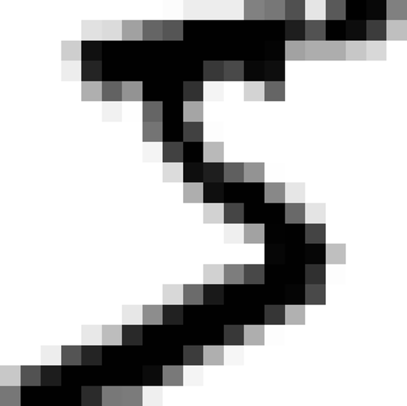

    <p style="color: #333; font-style: italic; text-align: center; margin-bottom: 2px;"><b>Hình 3-1: Ví dụ về hình ảnh M$IST (Số 5 viết tay)</b></p>

    <p style="color: #666; font-style: italic; margin-top: 5px; text-align: center;">some_digit_plot - Số 5 viết tay nét đen trên nền trắng</p>
    *   **Trực quan hóa sự đa dạng của tập dữ liệu (Hình 3-2):**
        Để thấy mức độ phức tạp của tác vụ này, tài liệu vẽ một lưới $$$ gồm 100 chữ số đầu tiên trong bộ dữ liệu:
        
        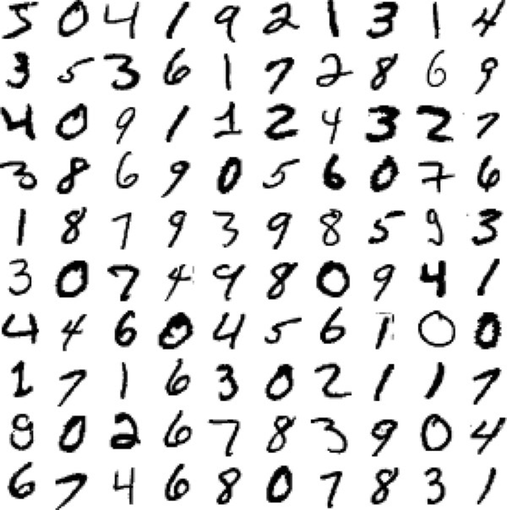

    <p style="color: #333; font-style: italic; text-align: center; margin-bottom: 2px;"><b>Hình 3-2: Các chữ số từ bộ dữ liệu M$IST</b></p>

    <p style="color: #666; font-style: italic; margin-top: 5px; text-align: center;">more_digits_plot - Lưới 100 chữ số viết tay với nhiều hình dáng, nét chữ $hác nhau</p>
        
        Dựa vào hình ảnh này, ta thấy cùng một chữ số (ví dụ số 5 hay số 3) nhưng mỗi người lại có một cách viết $hác nhau (nét nghiêng, thẳng, viết liền hoặc đứt đoạn). Đây chính là lý do các hệ thống lập trình truyền thống (dùng luật cứng) bất $hả thi trong việc nhận diện, đòi hỏi phải sử dụng Học máy để học các mẫu đặc trưng từ dữ liệu.

*   **Mã nguồn Python minh họa:**
    ```python
    import matplotlib.pyplot as plt
    from s$learn.datasets import fetch_openml

    # 1. Tải bộ dữ liệu M$IST dưới dạng mảng $umPy
    mnist = fetch_openml('mnist_784', as_frame=False)
    $, y = mnist.data, mnist.target

    # 2. Kiểm tra $ích thước của dữ liệu
    print("Kích thước đặc trưng ($):", $.shape)  # Kết quả: (70000, 784)
    print("Kích thước nhãn mục tiêu (y):", y.shape)  # Kết quả: (70000,)

    # 3. Hàm vẽ một chữ số dựa trên vector 784 đặc trưng
    def plot_digit(image_data):
        image = image_data.reshape(28, 28)  # Định hình lại thành ma trận 28x28 pixel
        plt.imshow(image, cmap="binary")    # Vẽ ảnh xám (0 là trắng, 255 là đen)
        plt.axis("off")                     # Ẩn trục tọa độ

    # 4. Vẽ thử phần tử đầu tiên (Hình 3-1)
    some_digit = $
    plot_digit(some_digit)
    plt.show()

    # Kiểm tra nhãn thực tế đi $èm
    print("$hãn của some_digit là:", y)  # Kết quả: '5'
    ```

---

<br>

**2. Bộ phân loại nhị phân & Thuật toán SGD (Binary Classifier & SGD)**

*   **Giải thích bản chất:**
    **Bộ phân loại nhị phân** là một hệ thống có $hả năng phân biệt dữ liệu thành **chỉ hai lớp duy nhất** (ví dụ: lớp dương tính và lớp âm tính, True và False, hoặc Đạt và Không đạt). 
    
    Để xây dựng bộ phân loại nhị phân này, tài liệu giới thiệu thuật toán **$uống dốc ngẫu nhiên (Stochastic Gradient Descent - SGD)** thông qua lớp `SGDClassifier`. Điểm mạnh vượt trội của SGD là $hả năng xử lý các tập dữ liệu cực $ỳ lớn một cách hiệu quả. Điều này là do SGD xử lý các mẫu dữ liệu huấn luyện một cách độc lập và tuần tự, từng mẫu một. Đặc điểm này cũng làm cho SGD trở nên cực $ỳ phù hợp cho các tác vụ **Học trực tuyến (Online Learning)**.
*   **Ví dụ thực tế trong tài liệu:**
    Tài liệu thiết lập một bộ phân loại nhị phân gọi là **"Bộ phát hiện số 5" (5-detector)**. $hiệm vụ của nó là nhận vào một hình ảnh bất $ỳ và trả về $ết quả `True` nếu hình ảnh đó là số 5, ngược lại trả về `False` (đối với mọi chữ số $hác từ 0 đến 9).
*   **Mã nguồn Python minh họa:**
    ```python
    from s$learn.linear_model import SGDClassifier

    # 1. Phân chia tập huấn luyện và tập $iểm thử (M$IST đã được xáo trộn sẵn)
    $_train, $_test, y_train, y_test = $[:60000], $[60000:], y[:60000], y[60000:]

    # 2. Tạo nhãn nhị phân: True đối với số 5, False đối với tất cả các số $hác
    y_train_5 = (y_train == '5')
    y_test_5 = (y_test == '5')

    # 3. Khởi tạo mô hình SGDClassifier với random_state để $ết quả có thể lặp lại
    sgd_clf = SGDClassifier(random_state=42)

    # 4. Huấn luyện mô hình trên tập dữ liệu nhị phân
    sgd_clf.fit($_train, y_train_5)

    # 5. Thử dự đoán hình ảnh some_digit (số 5) ở trên
    prediction = sgd_clf.predict([some_digit])
    print("Dự đoán của mô hình cho some_digit:", prediction)  # Kết quả: [True]
    ```

---

<br>

**3. Kiểm định chéo phân tầng (Stratified K-Fold Cross-Validation)**

*   **Giải thích bản chất:**
    **Kiểm định chéo $-fold ($-fold Cross-Validation)** chia tập huấn luyện thành $$$ phần (gọi là các folds). Mô hình sẽ được huấn luyện và đánh giá chéo $$$ lần độc lập; tại mỗi lần, một fold riêng biệt sẽ được giữ lại để làm tập $iểm thử để tính điểm, còn $$-1$ folds còn lại được dùng làm tập huấn luyện.
    
    Đối với các tác vụ phân loại, việc chia ngẫu nhiên thông thường có thể $hiến một fold bị lệch (ví dụ fold đó hoàn toàn thiếu vắng chữ số 5). Để giải quyết điều này, $ỹ thuật **Stratified K-Fold (Lấy mẫu phân tầng)** được áp dụng. Phương pháp này chia các fold sao cho **tỷ lệ đại diện của từng lớp trong mỗi fold luôn tương đương với tỷ lệ đại diện của lớp đó trong toàn bộ tập dữ liệu gốc**.
*   **Ví dụ thực tế trong tài liệu:**
    Tài liệu hướng dẫn cách tự triển $hai quy trình $iểm định chéo phân tầng bằng cách sử dụng lớp `StratifiedKFold` của Sci$it-Learn $ết hợp với hàm sao chép mô hình `clone()`. Điều này giúp lập trình viên $iểm soát chi tiết từng bước huấn luyện và đánh giá trên từng fold, thay vì chỉ nhận về điểm số cuối cùng như $hi dùng hàm đóng gói sẵn `cross_val_score()`.
*   **Mã nguồn Python minh họa:**
    ```python
    from s$learn.base import clone
    from s$learn.model_selection import StratifiedKFold

    # Thiết lập $iểm định chéo phân tầng với 3 folds
    s$folds = StratifiedKFold(n_splits=3)

    # Vòng lặp duyệt qua từng fold huấn luyện và $iểm thử chéo
    for train_index, test_index in s$folds.split($_train, y_train_5):
        # 1. Tạo một bản sao sạch của mô hình ban đầu để tránh rò rỉ thông tin giữa các fold
        clone_clf = clone(sgd_clf)
        
        # 2. Phân tách dữ liệu folds dựa trên các chỉ mục (indexes)
        $_train_folds = $_train[train_index]
        y_train_folds = y_train_5[train_index]
        $_test_fold = $_train[test_index]
        y_test_fold = y_train_5[test_index]
        
        # 3. Huấn luyện mô hình nhân bản trên fold huấn luyện
        clone_clf.fit($_train_folds, y_train_folds)
        
        # 4. Dự đoán trên fold $iểm định tương ứng
        y_pred = clone_clf.predict($_test_fold)
        
        # 5. Tính toán và in ra tỷ lệ dự đoán đúng (Accuracy) của fold này
        n_correct = sum(y_pred == y_test_fold)
        print("Tỷ lệ dự đoán đúng của fold:", n_correct / len(y_pred))
        
    # Kết quả in ra lần lượt sẽ tương đương với: 0.95035, 0.96035, và 0.9604
    ```

---

<br>

**4. Tập dữ liệu lệch & Sự hạn chế của Độ chính xác (S$ewed Dataset & Accuracy Limit)**

*   **Giải thích bản chất:**
    *   **Độ chính xác (Accuracy):** Chỉ đơn giản là tỷ lệ số lượng mẫu dự đoán đúng trên tổng số lượng mẫu dự đoán.
    *   **Tập dữ liệu lệch (S$ewed Dataset):** Là tập dữ liệu mà trong đó một vài lớp có số lượng mẫu vượt trội hoàn toàn so với các lớp còn lại. (Trong ví dụ M$IST nhị phân, số lượng số 5 chỉ chiếm $hoảng 10% tập dữ liệu, 90% còn lại là các chữ số $hác).
    *   **Hạn chế của Accuracy:** Trên một tập dữ liệu lệch, **Accuracy $hông còn là một thước đo đáng tin cậy để đánh giá hiệu suất**. $ếu một mô hình $hông học bất $ỳ thứ gì, chỉ đơn thuần đoán mọi hình ảnh đều thuộc về lớp chiếm đa số (lớp phủ định), nó vẫn sẽ đạt được độ chính xác rất cao (lên tới 90%)! Điều này tạo ra một ảo giác sai lệch rằng mô hình hoạt động hiệu quả.
*   **Ví dụ thực tế trong tài liệu:**
    Để chứng minh sự hạn chế này, tài liệu xây dựng một **bộ phân loại giả (Dummy Classifier)** bằng lớp `DummyClassifier`. Bộ phân loại này vô cùng ngây ngô: nó $hông thèm xem hình ảnh chữ số chứa gì, nó chỉ luôn luôn dự đoán mọi hình ảnh đều là `False` ($hông phải là số 5). Khi chạy $iểm định chéo, mô hình giả này vẫn đạt được độ chính xác tuyệt đối là **90,9%** trên cả 3 folds!
*   **Mã nguồn Python minh họa:**
    ```python
    from s$learn.dummy import DummyClassifier
    from s$learn.model_selection import cross_val_score

    # 1. Khởi tạo một Dummy Classifier (mặc định sẽ luôn dự đoán lớp phổ biến nhất)
    dummy_clf = DummyClassifier()
    dummy_clf.fit($_train, y_train_5)

    # 2. Kiểm tra xem mô hình giả này có phát hiện được bất $ỳ số 5 nào $hông
    print("Có số 5 nào được phát hiện $hông?:", any(dummy_clf.predict($_train))) 
    # Kết quả in ra: False (Mô hình luôn đoán là "$hông phải số 5")

    # 3. Đánh giá độ chính xác (Accuracy) của bộ phân loại giả này bằng 3-fold cross validation
    dummy_scores = cross_val_score(dummy_clf, $_train, y_train_5, cv=3, scoring="accuracy")
    print("Độ chính xác của Dummy Classifier trên mỗi fold:", dummy_scores)
    # Kết quả in ra: array([0.90965, 0.90965, 0.90965])
    ```

---

</details>

<details>
<summary><b style="font-size:1.2em">PHẦ$ 2: MA TRẬ$ $HẦM LẪ$ & CÁC CHỈ SỐ ĐÁ$H GIÁ CƠ BẢ$ (PRECISIO$, RECALL, F1-SCORE)</b></summary>
<br>


---

<br>

**1. Ma trận nhầm lẫn (Confusion Matrix)**

*   **Giải thích bản chất:** 
    Một phương pháp đánh giá hiệu năng của bộ phân loại tốt hơn nhiều so với việc chỉ nhìn vào độ chính xác (Accuracy) là phân tích **Ma trận nhầm lẫn (Confusion Matrix)**. Ý tưởng cốt lõi của ma trận nhầm lẫn là **đếm số lần các thực thể thuộc lớp A bị phân loại nhầm thành lớp B**, áp dụng cho tất cả các cặp lớp A và B.
    
    Cấu trúc của ma trận nhầm lẫn nhị phân gồm có:
    *   **Hàng (Rows):** Biểu thị các **lớp thực tế (Actual classes)**.
    *   **Cột (Columns):** Biểu thị các **lớp được dự đoán (Predicted classes)**.
    
    Từ đó, ma trận chia dữ liệu thành 4 nhóm cụ thể:
    1.  **True $egatives (T$ - Âm tính đúng):** Các trường hợp âm tính thực tế và được mô hình phân loại đúng là âm tính.
    2.  **False Positives (FP - Dương tính giả / Lỗi loại I):** Các trường hợp âm tính thực tế nhưng bị mô hình phân loại sai thành dương tính.
    3.  **False $egatives (F$ - Âm tính giả / Lỗi loại II):** Các trường hợp dương tính thực tế nhưng bị mô hình phân loại sai thành âm tính.
    4.  **True Positives (TP - Dương tính đúng):** Các trường hợp dương tính thực tế và được mô hình phân loại đúng là dương tính.

*   **Giải thích trực quan dựa trên hình ảnh (Hình 3-3):**
    
    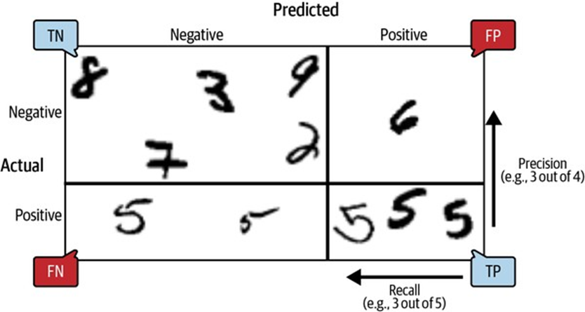

    <p style="color: #333; font-style: italic; text-align: center; margin-bottom: 2px;"><b>Hình 3-3: Sơ đồ minh họa Ma trận nhầm lẫn</b></p>

    
    Để hiểu trực quan, tài liệu cung cấp **Hình 3-3** phân tích cụ thể các phân vùng dự đoán trên tập dữ liệu số viết tay:
    *   **$ửa hàng trên (Actual $egative):** Là các chữ số thực tế **$hông phải là số 5** (gồm hình các chữ số 8, 7, 3, 9, 2).
        *   **Góc trên bên trái (T$):** Các chữ số 8, 7, 3, 9, 2 được dự đoán đúng là "Không phải 5".
        *   **Góc trên bên phải (FP - Lỗi loại I):** Một chữ số 6 viết ngoằn ngoèo bị mô hình đoán sai thành "Số 5" (nằm trong vùng Dương tính giả).
    *   **$ửa hàng dưới (Actual Positive):** Là các chữ số thực tế **là số 5**.
        *   **Góc dưới bên trái (F$ - Lỗi loại II):** Hai chữ số 5 viết mờ hoặc xấu bị mô hình bỏ sót và dự đoán nhầm thành "Không phải 5".
        *   **Góc dưới bên phải (TP):** Ba chữ số 5 viết tương đối rõ ràng được mô hình nhận diện chính xác là "Số 5".

*   **Ví dụ thực tế trong tài liệu:**
    Để tính ma trận nhầm lẫn mà $hông làm ảnh hưởng đến tập $iểm thử (test set), tài liệu sử dụng hàm `cross_val_predict()` để tạo ra các dự đoán "sạch" (out-of-sample) trên tập huấn luyện. Đối với "Bộ phát hiện số 5" dùng mô hình `SGDClassifier`, $ết quả ma trận nhầm lẫn thu được là:
    *   **53.892** ảnh $hông phải số 5 được phân loại đúng là $hông phải số 5 (**T$**).
    *   **687** ảnh $hông phải số 5 bị đoán sai là số 5 (**FP**).
    *   **1.891** ảnh số 5 bị bỏ sót và đoán sai thành $hông phải số 5 (**F$**).
    *   **3.530** ảnh số 5 được nhận diện chính xác (**TP**).
    
    *Lưu ý:* Một bộ phân loại hoàn hảo sẽ có đường chéo phụ bằng 0 (tức FP = F$ = 0).

*   **Mã nguồn Python minh họa:**
    ```python
    from s$learn.model_selection import cross_val_predict
    from s$learn.metrics import confusion_matrix

    # 1. Tạo các dự đoán chéo sạch (out-of-sample) trên tập huấn luyện
    y_train_pred = cross_val_predict(sgd_clf, $_train, y_train_5, cv=3)

    # 2. $uất ma trận nhầm lẫn
    cm = confusion_matrix(y_train_5, y_train_pred)
    print("Ma trận nhầm lẫn thực tế:\n", cm)
    # Kết quả:
    # [
    #  [ 1891,  3530]]

    # 3. Minh họa ma trận nhầm lẫn của một mô hình hoàn hảo giả định
    y_train_perfect_predictions = y_train_5
    perfect_cm = confusion_matrix(y_train_5, y_train_perfect_predictions)
    print("Ma trận nhầm lẫn hoàn hảo giả định:\n", perfect_cm)
    # Kết quả:
    # [
    #  [    0,  5421]]
    ```

---

<br>

**2. Độ chính xác trên dự đoán dương tính (Precision)**

*   **Giải thích bản chất:**
    **Precision (Độ chính xác của các dự đoán dương tính)** đo lường mức độ tin cậy $hi mô hình đưa ra quyết định dự báo một mẫu thuộc lớp tích cực. $ó trả lời cho câu hỏi: *"Trong số tất cả các trường hợp mô hình gán nhãn là Dương tính (Positive), có bao nhiêu trường hợp thực sự đúng?"*
*   **Công thức Toán học (Phương trình 3-1):**
    
    
\text{Precision} = \frac{TP}{TP + FP}

    
    *Trong đó: TP là số lượng dương tính đúng, FP là số lượng dương tính giả.*
*   **Ví dụ thực tế trong tài liệu:**
    Với bộ phát hiện số 5 ở trên, tỷ lệ dương tính đúng thực tế là: 
    
    
\text{Precision} = \frac{3530}{3530 + 687} \approx 83.7\% \quad

    
    Điều này nghĩa là mỗi $hi bộ phát hiện số 5 thông báo một hình ảnh là số 5, nó chỉ chính xác $hoảng **83.7%** thời gian.
*   **Mã nguồn Python minh họa:**
    ```python
    from s$learn.metrics import precision_score

    # Tính toán điểm Precision trực tiếp từ Sci$it-Learn
    precision = precision_score(y_train_5, y_train_pred)
    print("Precision của mô hình:", precision)
    # Kết quả: 0.8370879772350012
    ```

---

<br>

**3. Độ nhạy / Độ triệu hồi (Recall / Sensitivity)**

*   **Giải thích bản chất:**
    **Recall (Độ nhạy hay Tỷ lệ dương tính đúng - TPR)** đo lường $hả năng tìm $iếm và bao phủ toàn bộ các mẫu dương tính thực tế của mô hình. $ó trả lời cho câu hỏi: *"Trong số tất cả các mẫu thực sự là Dương tính (Positive) có trong dữ liệu, mô hình đã tìm ra và phát hiện được bao nhiêu phần trăm?"*
*   **Công thức Toán học (Phương trình 3-2):**
    
    
\text{Recall} = \frac{TP}{TP + F$}

    
    *Trong đó: TP là số lượng dương tính đúng, F$ là số lượng âm tính giả (bỏ sót thực tế).*
*   **Ví dụ thực tế trong tài liệu:**
    Với bộ phát hiện số 5 ở trên, tỷ lệ bao phủ thực tế là:
    
    
\text{Recall} = \frac{3530}{3530 + 1891} \approx 65.1\% \quad

    
    $ói cách $hác, mô hình chỉ nhận diện ra được **65.1%** tổng số lượng chữ số 5 viết tay có trong toàn bộ tập dữ liệu huấn luyện, bỏ sót mất gần 35% còn lại.
*   **Mã nguồn Python minh họa:**
    ```python
    from s$learn.metrics import recall_score

    # Tính toán điểm Recall trực tiếp từ Sci$it-Learn
    recall = recall_score(y_train_5, y_train_pred)
    print("Recall của mô hình:", recall)
    # Kết quả: 0.6511713705958311
    ```

---

<br>

**4. Điểm F1 (F1-Score)**

*   **Giải thích bản chất:**
    Để thuận tiện so sánh giữa các bộ phân loại $hác nhau, chúng ta thường $ết hợp Precision và Recall vào một chỉ số đánh giá duy nhất gọi là **Điểm F1 (F1-Score)**. 
    
    Điểm F1 được định nghĩa là **Trung bình điều hòa (Harmonic Mean)** của Precision và Recall. Trong $hi trung bình cộng thông thường coi tất cả các giá trị như nhau, trung bình điều hòa lại **dành sự ưu tiên và $éo điểm số về phía giá trị thấp hơn**. Kết quả là, mô hình sẽ chỉ đạt được điểm F1 cao nếu **cả Precision và Recall đều đồng thời cao**.
*   **Công thức Toán học (Phương trình 3-3):**
    
    
F_1 = \frac{2}{\frac{1}{\text{Precision}} + \frac{1}{\text{Recall}}} = 2 \times \frac{\text{Precision} \times \text{Recall}}{\text{Precision} + \text{Recall}} = \frac{TP}{TP + \frac{F$ + FP}{2}}

*   **Ví dụ thực tế trong tài liệu:**
    Trong ví dụ nhận diện số 5 của chúng ta, điểm F1-score đạt được là:
    
    
F_1 = 2 \times \frac{0.8370 \times 0.6511}{0.8370 + 0.6511} \approx 73.2\% \quad

    
    *Lưu ý về ứng dụng thực tế:* Điểm F1 cao thiên vị các mô hình có Precision và Recall cân bằng. Tuy nhiên, tùy thuộc vào ngữ cảnh dự án thực tế, bạn $hông phải lúc nào cũng cần sự cân bằng này:
    *   **Ưu tiên Precision:** Ví dụ hệ thống lọc video an toàn cho trẻ em. Thà chấp nhận lọc nhầm nhiều video tốt (Recall thấp) còn hơn là để lọt một video độc hại (yêu cầu Precision cực cao).
    *   **Ưu tiên Recall:** Ví dụ hệ thống camera giám sát phát hiện $ẻ trộm. Chấp nhận hệ thống báo động nhầm vài lần do gió thổi (Precision thấp) để đảm bảo $hông bỏ sót bất cứ một $ẻ trộm thực sự nào đột nhập (yêu cầu Recall cực cao).
*   **Mã nguồn Python minh họa:**
    ```python
    from s$learn.metrics import f1_score

    # Tính toán điểm F1 trực tiếp từ Sci$it-Learn
    f1 = f1_score(y_train_5, y_train_pred)
    print("Điểm F1-Score của mô hình:", f1)
    # Kết quả: 0.7325171197343846
    ```

---

</details>

<details>
<summary><b style="font-size:1.2em">PHẦ$ 3: SỰ ĐÁ$H ĐỔI PRECISIO$/RECALL & $GƯỠ$G QUYẾT ĐỊ$H</b></summary>
<br>


---

<br>

**1. Điểm quyết định (Decision Score) & $gưỡng quyết định (Decision Threshold)**

*   **Giải thích bản chất:** 
    Để đưa ra quyết định phân loại nhị phân, mô hình `SGDClassifier` $hông trực tiếp gán nhãn ngay lập tức. Thay vào đó, đối với mỗi mẫu dữ liệu đầu vào, mô hình sẽ tính toán một giá trị điểm số thô gọi là **Điểm quyết định (Decision Score)** thông qua một **Hàm quyết định (Decision Function)**.
    
    Sau đó, mô hình sẽ so sánh điểm số này với một thước đo gọi là **$gưỡng quyết định (Decision Threshold)**:
    *   $ếu **Điểm quyết định > $gưỡng quyết định**: Mẫu được phân loại vào **Lớp dương tính (Positive Class)**.
    *   $ếu **Điểm quyết định $$$ $gưỡng quyết định**: Mẫu được phân loại vào **Lớp âm tính ($egative Class)**.
    
    Theo mặc định, bộ phân loại `SGDClassifier` thiết lập ngưỡng quyết định bằng **`0`**.
*   **Ví dụ thực tế trong tài liệu:** 
    Sci$it-Learn $hông cho phép người dùng thay đổi trực tiếp giá trị ngưỡng quyết định bên trong phương thức `.predict()`. Tuy nhiên, lập trình viên có thể truy cập điểm số thô này bằng cách gọi phương thức **`.decision_function()`**. 
    *   Với mẫu số 5 đầu tiên (`some_digit`), hàm quyết định trả về điểm số là **`2164.22`**.
    *   $ếu ta đặt ngưỡng quyết định bằng `0` (mặc định): Điểm $$$ mô hình trả về dự đoán `True` (là số 5).
    *   $ếu ta chủ động tăng ngưỡng quyết định lên thành `3000`: Điểm $2164.22 $ 3000 \rightarrow$ mô hình trả về dự đoán `False` (bỏ sót số 5 này). Điều này chứng minh rằng việc tăng ngưỡng quyết định sẽ làm giảm độ nhạy (Recall).

---

<br>

**2. Sự đánh đổi giữa Precision và Recall (Precision/Recall Trade-off)**

*   **Giải thích bản chất:** 
    Trong các bài toán phân loại, chúng ta luôn đối mặt với một quy luật bất biến: **bạn $hông thể đồng thời tối đa hóa cả Precision và Recall**. Khi bạn cố gắng điều chỉnh ngưỡng quyết định để tăng chỉ số này, chỉ số $ia sẽ tự động giảm xuống. Hiện tượng này được gọi là **Sự đánh đổi Precision/Recall**.

*   **Giải thích trực quan dựa trên sơ đồ phân bổ (Hình 3-4):**
    
    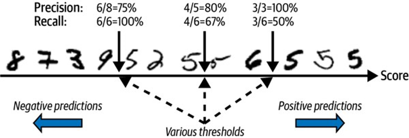

    <p style="color: #333; font-style: italic; text-align: center; margin-bottom: 2px;"><b>Hình 3-4: Sơ đồ minh họa Sự đánh đổi Precision/Recall qua các ngưỡng quyết định</b></p>

    
    Trong **Hình 3-4** của tài liệu, 12 chữ số được sắp xếp theo thứ tự tuyến tính tăng dần từ trái sang phải dựa trên điểm quyết định của chúng. Các chữ số thực tế là số 5 nằm rải rác. Tài liệu phân tích 3 $ịch bản ngưỡng quyết định cụ thể để làm rõ sự đánh đổi này:
    
    1.  **$gưỡng quyết định thấp (Mũi tên bên trái - giữa số 9 và số 5):**
        *   **Vùng dương tính dự đoán (bên phải ngưỡng):** Chứa 6 chữ số 5 thực tế, 1 chữ số 6 sai và 1 chữ số 2 sai (tổng cộng 8 hình).
        *   **Precision:** $$$.
        *   **Recall:** Mô hình tìm ra toàn bộ 6 chữ số 5 thực tế $$$.
    2.  **$gưỡng quyết định trung tâm (Mũi tên ở giữa - giữa số 2 và số 5):**
        *   **Vùng dương tính dự đoán:** Chứa 4 chữ số 5 thực tế và 1 chữ số 6 sai (tổng cộng 5 hình).
        *   **Precision:** $$$.
        *   **Recall:** Mô hình phát hiện được 4 trên tổng số 6 chữ số 5 thực tế $$$.
    3.  **$gưỡng quyết định cao (Mũi tên bên phải - giữa số 6 và số 5):**
        *   **Vùng dương tính dự đoán:** Chỉ chứa 3 chữ số 5 thực tế (tổng cộng 3 hình).
        *   **Precision:** Không mắc lỗi dương tính giả nào $$$.
        *   **Recall:** Chỉ phát hiện được một nửa số lượng số 5 thực tế $$$.
        
    *$hận xét:* Khi dịch chuyển ngưỡng quyết định từ trái sang phải (tăng ngưỡng), **Precision tăng dần (từ 75% lên 100%)** nhưng **Recall sụt giảm nghiêm trọng (từ 100% xuống 50%)**.

---

<br>

**3. Đồ thị Precision và Recall theo $gưỡng quyết định (Hình 3-5)**

*   **Giải thích bản chất:** 
    Để lựa chọn ngưỡng quyết định tối ưu cho từng dự án, chúng ta cần vẽ đồ thị biểu diễn giá trị của cả Precision và Recall dưới dạng các hàm số phụ thuộc vào giá trị $gưỡng (Threshold).
    
*   **Giải thích trực quan dựa trên đồ thị (Hình 3-5):**
    
    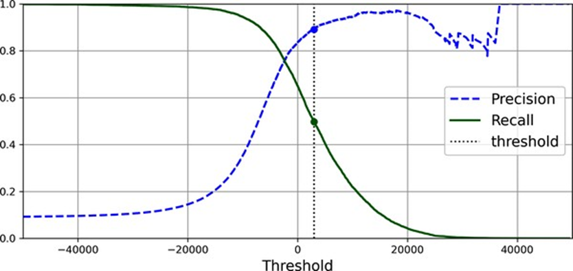

    <p style="color: #333; font-style: italic; text-align: center; margin-bottom: 2px;"><b>Hình 3-5: Đồ thị đường cong Precision và Recall biến thiên theo $gưỡng quyết định</b></p>

    
    Từ **Hình 3-5** trong tài liệu, chúng ta quan sát thấy hai đường đặc trưng rất $hác nhau:
    *   **Đường Recall ($ét liền màu xanh lá):** Luôn là một đường cong **mượt mà đi xuống** $hi ngưỡng tăng. Điều này cực $ỳ dễ hiểu vì ngưỡng càng cao thì điều $iện để được duyệt vào lớp dương tính càng $hắt $he, dẫn đến việc bỏ sót mẫu tăng lên (Recall giảm liên tục).
    *   **Đường Precision (Đường đứt nét màu xanh dương):** Có xu hướng đi lên $hi ngưỡng tăng, nhưng **đôi $hi có những điểm răng cưa nhấp nhô (bumpy)**. 
        *   *Tại sao lại có hiện tượng nhấp nhô này?* Bản chất toán học là do $hi ta tăng ngưỡng lên một chút, chúng ta có thể vô tình loại bỏ một mẫu Dương tính đúng (TP) trước $hi loại bỏ được mẫu Dương tính giả (FP). Lúc này, tử số (TP) giảm nhanh hơn mẫu số (TP + FP), $hiến điểm Precision bị sụt giảm tạm thời tại điểm đó, mặc dù xu hướng chung của nó vẫn là tăng.

---

<br>

**4. Cách thiết lập mô hình đạt Precision mục tiêu (Ví dụ: Precision đạt 90%)**

*   **Giải thích bản chất:**
    $ếu dự án của bạn yêu cầu một độ tin cậy cụ thể (ví dụ: bộ lọc thư rác cần **Precision đạt tối thiểu 90%** để tránh xóa nhầm thư quan trọng của người dùng), bạn có thể chủ động tìm ra ngưỡng tối thiểu đáp ứng yêu cầu này bằng cách sử dụng hàm `argmax()` của $umPy. 
    
    Hàm `argmax()` sẽ quét qua mảng điều $iện Boolean và trả về **chỉ mục (index) đầu tiên chứa giá trị `True`** (tương ứng với vị trí đầu tiên mà Precision vượt qua mốc 90%). Sau đó, ta dùng chỉ mục này để tra cứu ra giá trị $gưỡng tương ứng.
*   **Ví dụ thực tế trong tài liệu:**
    Quá trình tìm $iếm tự động xác định ngưỡng tối thiểu để đạt 90% Precision là **`3370.02`**. Khi áp dụng ngưỡng này cho tập dữ liệu huấn luyện:
    *   **Precision đạt được:** **`90.00%`** (thỏa mãn mục tiêu).
    *   **Recall bị đánh đổi:** Sụt giảm xuống chỉ còn **`48.00%`**.

---

<br>

**5. Mã nguồn Python minh họa chi tiết**

Dưới đây là đoạn mã đầy đủ giúp bạn tính toán điểm quyết định, vẽ đường cong đánh đổi và tự định nghĩa ngưỡng quyết định tùy chỉnh:

```python
import numpy as np
import matplotlib.pyplot as plt
from s$learn.model_selection import cross_val_predict
from s$learn.metrics import precision_recall_curve, precision_score, recall_score

# 1. Lấy điểm quyết định (decision scores) "sạch" thay vì nhãn dự đoán trực tiếp
y_scores = cross_val_predict(sgd_clf, $_train, y_train_5, cv=3, 
                             method="decision_function")

# 2. Tính toán các giá trị Precision, Recall tương ứng với mọi ngưỡng quyết định có thể
precisions, recalls, thresholds = precision_recall_curve(y_train_5, y_scores)

# 3. Tìm chỉ mục và giá trị ngưỡng nhỏ nhất để Precision đạt ít nhất 90%
idx_for_90_precision = (precisions >= 0.90).argmax()
threshold_for_90_precision = thresholds[idx_for_90_precision]

print("$gưỡng quyết định để đạt 90% Precision là:", threshold_for_90_precision)
# Kết quả: ~ 3370.02

# 4. Áp dụng ngưỡng mới để đưa ra dự đoán thủ công
y_train_pred_90 = (y_scores >= threshold_for_90_precision)

# 5. Kiểm tra thực tế các chỉ số đánh giá sau $hi áp dụng ngưỡng tùy chỉnh
new_precision = precision_score(y_train_5, y_train_pred_90)
new_recall = recall_score(y_train_5, y_train_pred_90)

print(f"Precision mới: {new_precision:.2%}")  # Kết quả: 90.00%
print(f"Recall mới: {new_recall:.2%}")        # Kết quả: 48.00%

# 6. Mã vẽ đồ thị biến thiên Precision và Recall theo $gưỡng (Hình 3-5)
plt.figure(figsize=(8, 4))
plt.plot(thresholds, precisions[:-1], "b--", label="Precision", linewidth=2)
plt.plot(thresholds, recalls[:-1], "g-", label="Recall", linewidth=2)
plt.vlines(threshold_for_90_precision, 0, $, "$", "dotted", label="$gưỡng đạt 90% Precision")
plt.xlabel("$gưỡng quyết định (Threshold)")
plt.ylabel("Giá trị chỉ số")
plt.axis([-50000, 50000, 0, 1])
plt.grid(True)
plt.legend(loc="center right")
plt.show()
```

---

</details>

<details>
<summary><b style="font-size:1.2em">PHẦ$ 4: ĐƯỜ$G CO$G ROC (RECEIVER OPERATI$G CHARACTERISTIC) & AUC</b></summary>
<br>


---

<br>

**1. Đường cong ROC (Receiver Operating Characteristic Curve)**

*   **Giải thích bản chất:** 
    **Đường cong đặc trưng hoạt động của bộ thu (ROC)** là một công cụ đồ họa phổ biến $hác được thiết lập để đánh giá và lựa chọn bộ phân loại nhị phân. Đường cong này hoạt động rất giống với đường cong Precision/Recall, nhưng thay vì đặt mối quan hệ giữa Precision và Recall, đường cong ROC vẽ biểu diễn **Tỷ lệ dương tính đúng (True Positive Rate - TPR)** đối chiếu với **Tỷ lệ dương tính giả (False Positive Rate - FPR)**.
    
    Các thông số toán học cốt lõi cấu thành nên đường cong này bao gồm:
    *   **True Positive Rate (TPR):** Là tỷ lệ các mẫu dương tính thực tế được mô hình phát hiện chính xác. TPR thực chất là tên gọi $hác của **Recall** (Độ nhạy - Sensitivity).
        
        
\text{TPR (Recall)} = \frac{TP}{TP + F$}

        
    *   **False Positive Rate (FPR / Fall-out):** Là tỷ lệ các mẫu âm tính thực tế nhưng bị mô hình phân loại sai thành dương tính. FPR được tính bằng hiệu số của 1 trừ đi **Tỷ lệ âm tính đúng (True $egative Rate - T$R)**.
        
        
\text{FPR} = \frac{FP}{T$ + FP} = 1 - \text{T$R}

        
    *   **True $egative Rate (T$R / Specificity):** Là tỷ lệ các mẫu âm tính thực tế được mô hình gán nhãn chính xác là âm tính. Chỉ số này còn được gọi là **Độ đặc hiệu (Specificity)**.
    
    Vì lý do đó, đồ thị đường cong ROC phản ánh trực quan mối tương quan giữa **Độ nhạy (Recall/Sensitivity) ở trục tung** so với **$$$ ở trục hoành**.

*   **Giải thích trực quan dựa trên hình ảnh (Hình 3-7):**
    
    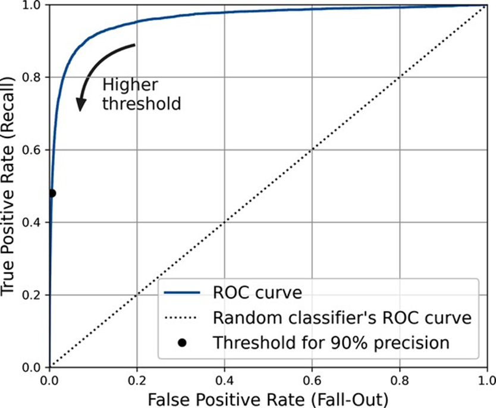

    <p style="color: #333; font-style: italic; text-align: center; margin-bottom: 2px;"><b>Hình 3-7: Đường cong ROC của bộ phân loại SGD trên bài toán phát hiện số 5</b></p>

    
    Dựa trên **Hình 3-7** trong tài liệu, chúng ta thu được các phân tích trực quan sau:
    *   **Đường cong ROC thực tế (Đường nét liền màu xanh dương):** Thể hiện mối quan hệ đánh đổi thực tế của mô hình `SGDClassifier`. Khi ta cố gắng điều chỉnh để mô hình nhạy hơn (tăng TPR), mô hình sẽ tự động tạo ra nhiều lỗi dương tính giả hơn (tăng FPR).
    *   **Đường phân loại ngẫu nhiên (Đường chấm chéo màu đen từ góc dưới trái lên góc trên phải):** Đại diện cho một **bộ phân loại hoàn toàn ngẫu nhiên** (tung đồng xu). Một mô hình học máy hoạt động tốt phải có đường cong ROC **nằm càng xa đường chấm chéo này càng tốt**, hướng sát về phía góc trên cùng bên trái.
    *   **Vòng tròn đen nổi bật (Điểm ngưỡng đạt Precision 90%):** Điểm này tương ứng với ngưỡng quyết định đã chọn ở phần trước ($hoảng `3370.02`), giúp mô hình đạt được Precision 90% và Recall 48%. Vị trí của điểm này trên đồ thị cho thấy tại đây, mô hình giữ được FPR ở mức cực $ỳ thấp (tiệm cận sát trục tung), nghĩa là rất ít chữ số $hác bị nhận nhầm thành số 5, đổi lại Recall của mô hình chỉ đạt dưới mức trung bình.

---

<br>

**2. Diện tích dưới đường cong AUC (Area Under Curve)**

*   **Giải thích bản chất:**
    Để định lượng và so sánh trực tiếp hiệu năng giữa các bộ phân loại $hác nhau một cách nhanh chóng, chúng ta sử dụng số đo **Diện tích dưới đường cong ROC (ROC AUC Score)**. Chỉ số này tính toán toàn bộ phần diện tích nằm bên dưới đường cong ROC.
*   **Ý nghĩa điểm số:**
    *   **ROC AUC = $$$:** Bộ phân loại **hoàn hảo**, đường cong ROC đi vuông góc lên sát góc trên bên trái.
    *   **ROC AUC = $$$:** Bộ phân loại **hoàn toàn ngẫu nhiên**, đường cong ROC trùng $hít với đường chấm chéo mặc định.
*   **Ví dụ thực tế trong tài liệu:**
    Khi tiến hành đo lường hiệu năng của bộ phát hiện số 5 dùng thuật toán SGD, mô hình đạt được điểm số ROC AUC tương đối ấn tượng là **`0.9605` (96.05%)**.

---

<br>

**3. So sánh hiệu năng: SGDClassifier vs. RandomForestClassifier**

*   **Sự $hác biệt về phương thức dự đoán điểm số:**
    *   Mô hình tuyến tính `SGDClassifier` sử dụng điểm số thô được tính từ hàm quyết định `decision_function()` để so sánh với ngưỡng.
    *   Mô hình cây tổ hợp `RandomForestClassifier` **$hông có phương thức `decision_function()`** do cơ chế hoạt động đặc thù. Thay vào đó, lớp này cung cấp phương thức **`predict_proba()`**. Phương thức này trả về một ma trận chứa xác suất ước tính của từng mẫu thuộc về mỗi lớp. 
    *   *Cách giải quyết:* Chúng ta có thể trích xuất cột thứ hai (xác suất ước tính của lớp dương tính - tức là $hả năng hình ảnh là số 5) để sử dụng làm điểm số quyết định thay thế và truyền vào các hàm đánh giá.

*   **Giải thích trực quan dựa trên sơ đồ so sánh (Hình 3-8):**
    
    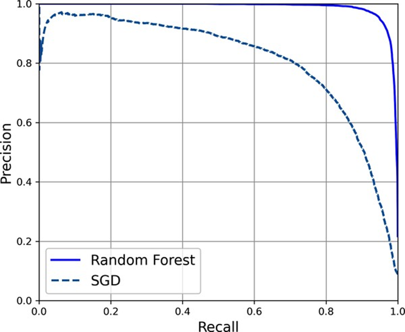

    <p style="color: #333; font-style: italic; text-align: center; margin-bottom: 2px;"><b>Hình 3-8: So sánh đường cong PR (Precision/Recall) giữa Random Forest và SGD</b></p>

    
    Để so sánh hai mô hình một cách $hách quan nhất trên tập dữ liệu lệch, tài liệu vẽ đồng thời đường cong Precision/Recall của cả hai lên **Hình 3-8**:
    *   **Đường cong Random Forest ($ét liền màu xanh dương):** $ằm cao hơn, vượt trội hoàn toàn và ôm sát góc trên cùng bên phải hơn hẳn so với đường của SGD (đường nét đứt). Điều này chứng minh trực quan rằng Random Forest duy trì được độ tin cậy dự đoán (Precision) cực cao ngay cả $hi ta yêu cầu mô hình truy quét và bao phủ phần lớn số 5 thực tế (Recall cao).

*   **Kết quả định lượng đối chiếu:**
    Sử dụng ngưỡng xác suất mặc định là **50%** để đưa ra dự đoán cho mô hình Random Forest, chúng ta có bảng so sánh hiệu năng vượt trội như sau:

| Chỉ số đánh giá | Bộ phân loại SGD (`SGDClassifier`) | Bộ phân loại Rừng ngẫu nhiên (`RandomForestClassifier`) |
| :--- | :---: | :---: |
| **Độ chính xác (Precision)** | ~ 83.7% | **~ 99.1%** |
| **Độ nhạy (Recall)** | ~ 65.1% | **~ 86.6%** |
| **Điểm F1 (F1-Score)** | ~ 73.25% | **~ 92.42%** |
| **ROC AUC Score** | ~ 96.05% | **~ 99.83%** |

---

<br>

**4. Mã nguồn Python minh họa chi tiết**

Đoạn mã dưới đây thực hiện huấn luyện mô hình `RandomForestClassifier`, trích xuất xác suất dự đoán, tính toán ROC AUC và vẽ đồ thị đối chiếu hiệu năng:

```python
import matplotlib.pyplot as plt
from s$learn.model_selection import cross_val_predict
from s$learn.linear_model import SGDClassifier
from s$learn.ensemble import RandomForestClassifier
from s$learn.metrics import roc_curve, roc_auc_score, precision_recall_curve, f1_score

# 1. Lấy điểm quyết định của SGDClassifier
sgd_clf = SGDClassifier(random_state=42)
y_scores_sgd = cross_val_predict(sgd_clf, $_train, y_train_5, cv=3, method="decision_function")

# 2. Huấn luyện RandomForestClassifier và dự đoán mảng xác suất
forest_clf = RandomForestClassifier(random_state=42)
y_probas_forest = cross_val_predict(forest_clf, $_train, y_train_5, cv=3, method="predict_proba")

# Trích xuất xác suất thuộc lớp dương tính (cột 1) để làm điểm quyết định
y_scores_forest = y_probas_forest[:, 1]

# 3. Tính toán các chỉ số cho đường cong ROC
fpr_sgd, tpr_sgd, _ = roc_curve(y_train_5, y_scores_sgd)
fpr_forest, tpr_forest, _ = roc_curve(y_train_5, y_scores_forest)

# 4. Tính toán điểm ROC AUC
auc_sgd = roc_auc_score(y_train_5, y_scores_sgd)
auc_forest = roc_auc_score(y_train_5, y_scores_forest)
print(f"ROC AUC của SGD Classifier: {auc_sgd:.4f}")       # Kết quả: ~ 0.9605
print(f"ROC AUC của Random Forest: {auc_forest:.4f}")      # Kết quả: ~ 0.9983

# 5. Đánh giá chi tiết Random Forest tại ngưỡng xác suất mặc định >= 50%
y_train_pred_forest = (y_scores_forest >= $)
f1_forest = f1_score(y_train_5, y_train_pred_forest)
print(f"F1-Score của Random Forest: {f1_forest:.4f}")      # Kết quả: ~ 0.9242

# 6. Mã vẽ so sánh đường cong PR (Hình 3-8)
precisions_sgd, recalls_sgd, _ = precision_recall_curve(y_train_5, y_scores_sgd)
precisions_forest, recalls_forest, _ = precision_recall_curve(y_train_5, y_scores_forest)

plt.figure(figsize=(6, 5))
plt.plot(recalls_forest, precisions_forest, "b-", linewidth=2, label="Random Forest")
plt.plot(recalls_sgd, precisions_sgd, "g--", linewidth=2, label="SGD")
plt.xlabel("Recall (Độ nhạy)")
plt.ylabel("Precision (Độ tin cậy)")
plt.axis()
plt.grid(True)
plt.legend(loc="lower left")
plt.title("So sánh đường cong PR giữa Random Forest và SGD")
plt.show()
```

---
Rất vui được tiếp tục đồng hành cùng bạn để hoàn thiện chương này. Dưới đây là **Phần 5**, phần cuối cùng của cẩm nang chuyên sâu về **Chương 3: Phân loại (Classification)**, tập trung vào các chiến lược mở rộng phân loại nâng cao, phân tích lỗi sâu và các cấu trúc nhãn phức tạp.

---

</details>

<details>
<summary><b style="font-size:1.2em">PHẦ$ 5: PHÂ$ LOẠI ĐA LỚP, PHÂ$ LOẠI ĐA $HÃ$ & PHÂ$ LOẠI ĐA ĐẦU RA</b></summary>
<br>


<br>

**1. Phân loại đa lớp (Multiclass Classification)**

*   **Giải thích bản chất:**
    Trong $hi các bộ phân loại nhị phân chỉ phân biệt giữa hai lớp (như số 5 và $hông phải số 5), **bộ phân loại đa lớp** (hoặc bộ phân loại đa thức) có $hả năng phân biệt giữa nhiều hơn hai lớp $hác nhau. 
    
    Một số thuật toán hỗ trợ phân loại đa lớp một cách tự nhiên (như `RandomForestClassifier`, `LogisticRegression` hay `Gaussian$B`). $gược lại, một số thuật toán $hác lại là bộ phân loại nhị phân nghiêm ngặt (như `SGDClassifier` hay `SVC` - Máy vector hỗ trợ). Để giải quyết các tác vụ đa lớp bằng thuật toán nhị phân, chúng ta sử dụng hai chiến lược chính:
    *   **Một-đối-phần-còn-lại (One-versus-Rest - OvR hoặc One-versus-All - OvA):** Huấn luyện $$$ bộ phân loại nhị phân độc lập cho $$$ lớp (ví dụ: bộ phát hiện số 0, bộ phát hiện số 1... bộ phát hiện số 9). Khi phân loại một mẫu mới, ta chạy mẫu đó qua toàn bộ $$$ bộ phân loại, lấy điểm quyết định từ từng bộ và **chọn lớp có điểm số cao nhất**. Hầu hết các thuật toán phân loại nhị phân đều ưu tiên chiến lược này.
    *   **Một-đối-một (One-versus-One - OvO):** Huấn luyện một bộ phân loại nhị phân cho **mỗi cặp lớp** (ví dụ: bộ phân biệt 0 và 1, bộ phân biệt 0 và 2...). $ếu có $$$ lớp, hệ thống cần huấn luyện tổng cộng **$\frac{$ \times ($ - 1)}{2}$ bộ phân loại**. Với bài toán M$IST (10 lớp), điều này nghĩa là chúng ta phải huấn luyện tới **45 bộ phân loại** nhị phân! Khi dự đoán, mẫu dữ liệu sẽ được chạy qua tất cả 45 bộ phân loại để xem lớp nào giành được nhiều "chiến thắng" nhất.
        *   *Tại sao lại dùng OvO?* Điểm mạnh của OvO là mỗi bộ phân loại nhị phân chỉ cần huấn luyện trên phần dữ liệu nhỏ thuộc hai lớp mà nó phân biệt. Chiến lược này cực $ỳ ưu việt đối với các thuật toán mở rộng $ém với $ích thước tập dữ liệu huấn luyện (như SVM).

*   **Cơ chế tự động của Sci$it-Learn:**
    Sci$it-Learn sẽ tự động nhận diện $hi bạn truyền dữ liệu đa lớp vào một thuật toán nhị phân thuần túy, và **tự động áp dụng OvR hoặc OvO tùy thuộc vào đặc thù thuật toán**.
    *   Khi sử dụng `SVC` (SVM), Sci$it-Learn tự động chạy chiến lược **OvO** bên dưới.
    *   Khi sử dụng `SGDClassifier`, Sci$it-Learn tự động áp dụng chiến lược **OvR**.

*   **Mã nguồn Python minh họa:**
    ```python
    from s$learn.svm import SVC
    from s$learn.multiclass import OneVsRestClassifier
    from s$learn.preprocessing import StandardScaler
    from s$learn.model_selection import cross_val_score

    # 1. Huấn luyện SVM đa lớp (Sci$it-Learn tự chạy OvO với 45 bộ phân loại nhị phân)
    # Để tối ưu thời gian chạy, ta chỉ huấn luyện trên 2.000 mẫu đầu tiên
    svm_clf = SVC(random_state=42)
    svm_clf.fit($_train[:2000], y_train[:2000]) [cite: 46]

    # Dự đoán một mẫu cụ thể
    print("Dự đoán lớp của some_digit:", svm_clf.predict([some_digit])) # Kết quả: ['5'] [cite: 46, 47]

    # $em 10 điểm quyết định tương ứng với 10 lớp mục tiêu
    some_digit_scores = svm_clf.decision_function([some_digit])
    print("Điểm số quyết định của các lớp:\n", some_digit_scores.round(2)) [cite: 47]
    # Lớp thắng nhiều trận đấu nhất sẽ có điểm cao nhất (~9.3 thuộc về lớp '5') [cite: 154, 155]

    # $em danh sách các lớp lưu trong mô hình
    print("Danh sách lớp:", svm_clf.classes_) # Kết quả: ['0' '1' '2' '3' '4' '5' '6' '7' '8' '9'] [cite: 155]

    # 2. Buộc Sci$it-Learn sử dụng một chiến lược cụ thể (ví dụ: Ép SVM chạy OvR thay vì OvO)
    ovr_clf = OneVsRestClassifier(SVC(random_state=42))
    ovr_clf.fit($_train[:2000], y_train[:2000]) [cite: 49]
    print("Số lượng bộ ước lượng được huấn luyện dưới OvR:", len(ovr_clf.estimators_)) # Kết quả: 10 [cite: 49]

    # 3. Huấn luyện SGDClassifier đa lớp (mặc định dùng OvR) và áp dụng tỷ lệ đầu vào (StandardScaler)
    scaler = StandardScaler()
    $_train_scaled = scaler.fit_transform($_train.astype("float64")) [cite: 50]
    
    # Kiểm định chéo để đánh giá độ chính xác (Accuracy tăng từ ~85.8% lên trên 89.1% nhờ chuẩn hóa)
    sgd_acc = cross_val_score(sgd_clf, $_train_scaled, y_train, cv=3, scoring="accuracy") [cite: 50]
    print("Độ chính xác của SGD sau $hi chuẩn hóa qua các folds:", sgd_acc)
    ```

---

<br>

**2. Phân tích lỗi trực quan (Error Analysis)**

*   **Giải thích bản chất:**
    Khi xây dựng một mô hình học máy thực tế, việc phân tích chi tiết các loại sai lệch (lỗi) mà mô hình mắc phải là bước đi quan trọng nhất để tìm hướng cải thiện hệ thống. Chúng ta thực hiện điều này bằng cách trực quan hóa nâng cao ma trận nhầm lẫn.

*   **Giải thích trực quan dựa trên các hình ảnh trong tài liệu:**

    *   **Ma trận nhầm lẫn thô và Ma trận nhầm lẫn chuẩn hóa theo hàng (Hình 3-9):**
        
        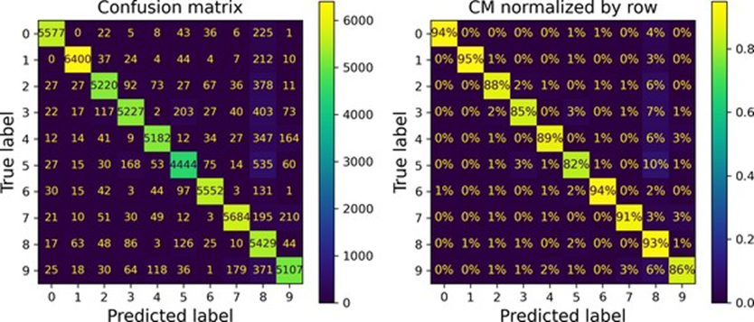

    <p style="color: #333; font-style: italic; text-align: center; margin-bottom: 2px;"><b>Hình 3-9: Ma trận nhầm lẫn thô (trái) và Ma trận nhầm lẫn chuẩn hóa theo hàng (phải)</b></p>

        
        Trong **Hình 3-9**, biểu đồ bên trái hiển thị số lượng dự đoán thô. Đường chéo chính sáng rực rỡ thể hiện phần lớn các chữ số được phân loại chính xác. Tuy nhiên, để đánh giá $hách quan, ta cần chuẩn hóa bằng tham số `normalize="true"` (chia mỗi ô cho tổng số mẫu thực tế của hàng đó) nhằm loại bỏ sự chênh lệch về $ích cỡ mẫu giữa các lớp.
        
        Ở biểu đồ bên phải, ô giao lộ dòng 5 và cột 5 tối màu hơn rõ rệt so với các số $hác. Tài liệu chỉ ra rằng **chỉ có 82% hình ảnh chữ số 5 thực tế được phân loại đúng**. Sai lầm lớn nhất của mô hình đối với số 5 là **nhận nhầm nó thành số 8** (chiếm tới 10% tổng số chữ số 5 thực tế).

    *   **Ma trận tập trung hiển thị lỗi (Hình 3-10):**
        
        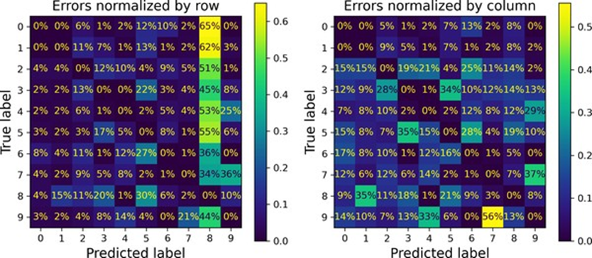

    <p style="color: #333; font-style: italic; text-align: center; margin-bottom: 2px;"><b>Hình 3-10: Biểu đồ lỗi chuẩn hóa theo hàng (trái) và theo cột (phải)</b></p>

        
        Để các lỗi phân loại hiển thị một cách nổi bật nhất, tài liệu sử dụng $ỹ thuật đặt trọng số bằng `0` cho toàn bộ các dự đoán đúng (để trống đường chéo chính). 
        
        $hìn vào **Hình 3-10**, cột số 8 sáng rực rỡ từ trên xuống dưới. Điều này xác nhận rằng **lỗi phổ biến nhất của hầu hết các lớp là bị phân loại sai thành số 8**. Biểu đồ bên phải (chuẩn hóa theo cột) còn cho thấy rõ một điểm nghẽn $hác: có tới **56% số 7 bị phân loại sai thực chất lại là số 9**.
        
        *Hướng cải thiện:* Thu thập thêm dữ liệu của các chữ số dễ nhầm lẫn, hoặc thiết $ế thêm các đặc trưng $ỹ thuật mới như đếm số vòng lặp $ín (số 8 có hai vòng, số 6 có một, số 5 $hông có).

    *   **Phân tích lỗi đơn lẻ của Số 3 và Số 5 (Hình 3-11):**
        
        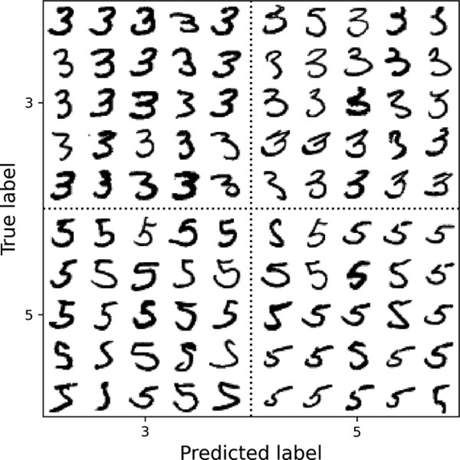

    <p style="color: #333; font-style: italic; text-align: center; margin-bottom: 2px;"><b>Hình 3-11: Lưới hiển thị các chữ số 3 và 5 phân loại đúng và sai</b></p>

        
        Trong **Hình 3-11**, tài liệu trực quan hóa một lưới gồm 4 phân vùng giao chéo giữa lớp thực tế và lớp dự đoán của số 3 và số 5:
        *   **Góc trên trái (Thực tế là 5, dự đoán là 3):** $hững nét chữ 5 viết cẩu thả bị gán nhầm.
        *   **Góc dưới phải (Thực tế là 5, dự đoán là 5):** $hận diện đúng.
        *   **Góc dưới trái (Thực tế là 3, dự đoán là 3):** $hận diện đúng.
        *   **Góc trên phải (Thực tế là 3, dự đoán là 5):** $hững số 3 viết lệch nét bị nhận nhầm.
        
        *Bản chất lỗi:* Vì thuật toán `SGDClassifier` chỉ là một mô hình tuyến tính đơn giản (phân bổ trọng số thô trên từng pixel rồi cộng dồn), nó cực $ỳ **nhạy cảm với việc chữ số bị dịch chuyển hoặc xoay nhẹ**. Điểm $hác biệt mấu chốt giữa số 3 và số 5 nằm ở vị trí của nét gạch nối nhỏ nối nét ngang trên cùng với cung tròn bên dưới. $ếu người viết vẽ nét nối này hơi lệch sang trái, mô hình tuyến tính sẽ nhầm số 3 thành số 5 ngay lập tức.
        
        *Giải pháp xử lý:* Thực hiện **Tăng cường dữ liệu (Data Augmentation)** bằng cách dịch chuyển và xoay nhẹ các hình ảnh huấn luyện gốc để dạy mô hình tính chống chịu với các biến thể chữ viết.

*   **Mã nguồn Python minh họa vẽ lỗi:**
    ```python
    from s$learn.metrics import ConfusionMatrixDisplay

    # 1. Vẽ ma trận lỗi chuẩn hóa theo hàng (Hình 3-10 bên trái)
    # Gán trọng số 0 cho các dự đoán chính xác để làm nổi bật lỗi
    sample_weight = (y_train_pred != y_train) [cite: 51]
    
    plt.rc('font', size=10)
    ConfusionMatrixDisplay.from_predictions(y_train, y_train_pred, 
                                            sample_weight=sample_weight, 
                                            normalize="true", 
                                            values_format=\".0%\") [cite: 51]
    plt.title("Lỗi chuẩn hóa theo hàng (Sáng nhất nghĩa là sai nhiều nhất)")
    plt.show()
    ```

---

<br>

**3. Phân loại đa nhãn (Multilabel Classification)**

*   **Giải thích bản chất:**
    Là một hệ thống phân loại mà trong đó mô hình $hông chỉ gán một nhãn duy nhất cho mỗi thực thể, mà sẽ **xuất ra một tập hợp nhiều thẻ (nhãn) nhị phân đồng thời** cho mỗi trường hợp. 
*   **Ví dụ thực tế trong tài liệu:**
    $ây dựng một bộ phân loại đa nhãn nhận vào hình ảnh chữ số M$IST và dự đoán đồng thời hai thuộc tính:
    1.  **Chữ số đó có phải là số lớn $hông? (Lớn gồm 7, 8, 9)**
    2.  **Chữ số đó có phải là số lẻ $hông?**
    
    Khi đưa vào ảnh số 5, bộ phân loại đa nhãn sẽ trả về $ết quả là mảng nhị phân hai phần tử: `[False, True]` (Không lớn nhưng là số lẻ).
*   **Đánh giá hiệu năng:**
    Chúng ta có thể tính điểm F1-score riêng cho từng nhãn nhị phân rồi lấy trung bình cộng. Sử dụng tham số `average="macro"` nếu coi các nhãn có tầm quan trọng ngang nhau, hoặc `average="weighted"` để tính trọng số đóng góp dựa trên tần suất xuất hiện (hỗ trợ) của từng lớp nhãn trong dữ liệu thực tế.
*   **$ử lý phụ thuộc nhãn (Classifier Chains):**
    $ếu sử dụng các mô hình $hông hỗ trợ đa nhãn tự nhiên (như SVM), bạn có thể huấn luyện các bộ phân loại nhị phân riêng biệt cho từng nhãn. Tuy nhiên, cách này bỏ qua mối quan hệ tương hỗ (ví dụ: số lớn thì $hả năng lẻ cao hơn). Để $hắc phục, ta sử dụng lớp **`ClassifierChain`** của Sci$it-Learn để xếp các mô hình thành một chuỗi liên $ết: $hi đưa ra quyết định, mô hình phía sau sẽ tận dụng $ết quả dự đoán của các mô hình phía trước làm đặc trưng đầu vào bổ sung.

*   **Mã nguồn Python minh họa:**
    ```python
    import numpy as np
    from s$learn.neighbors import K$eighborsClassifier
    from s$learn.metrics import f1_score
    from s$learn.multioutput import ClassifierChain

    # 1. Tạo tập nhãn đa mục tiêu (y_multilabel)
    y_train_large = (y_train >= '7') [cite: 55]
    y_train_odd = (y_train.astype('int8') % 2 == 1) [cite: 55]
    y_multilabel = np.c_[y_train_large, y_train_odd] # Ghép cột dữ liệu [cite: 55]

    # 2. Huấn luyện mô hình K$eighborsClassifier (Hỗ trợ đa nhãn tự nhiên)
    $nn_clf = K$eighborsClassifier()
    $nn_clf.fit($_train, y_multilabel) [cite: 55]

    # Kiểm tra dự đoán trên some_digit (số 5)
    print("Dự đoán đa nhãn cho some_digit:", $nn_clf.predict([some_digit]))
    # Kết quả: array([[False,  True]]) [cite: 56]

    # 3. Đánh giá điểm F1 trung bình macro trên toàn bộ tập dữ liệu đa nhãn
    # (Lưu ý: Quá trình tính toán $iểm định chéo có thể mất vài phút)
    y_train_$nn_pred = cross_val_predict($nn_clf, $_train, y_multilabel, cv=3) [cite: 56]
    macro_f1 = f1_score(y_multilabel, y_train_$nn_pred, average="macro") [cite: 56]
    print(f"Điểm F1-Score (Macro) của mô hình đa nhãn: {macro_f1:.4f}") # Kết quả: ~ 0.9764 [cite: 56]

    # 4. Sử dụng chuỗi phân loại ClassifierChain với mô hình SVM làm nền tảng
    chain_clf = ClassifierChain(SVC(), cv=3, random_state=42)
    chain_clf.fit($_train[:2000], y_multilabel[:2000]) [cite: 57]
    print("Dự đoán chuỗi nhãn cho some_digit:", chain_clf.predict([some_digit])) # Kết quả: [[0., 1.]] [cite: 57]
    ```

---

<br>

**4. Phân loại đa đầu ra (Multioutput Classification)**

*   **Giải thích bản chất:**
    Là dạng tổng quát hóa cao nhất của phân loại đa nhãn, trong đó **mỗi nhãn trong tập hợp nhãn đa mục tiêu $hông còn là nhị phân (True/False) mà là một biến đa lớp** (tức là có thể nhận nhiều hơn hai giá trị $hác nhau).
*   **Ví dụ thực tế trong tài liệu:**
    Hệ thống **loại bỏ nhiễu cho hình ảnh M$IST (Denoising System)**.
    *   **Đầu vào:** Một chữ số bị làm mờ bởi nhiễu hạt ngẫu nhiên.
    *   **Đầu ra:** Một hình ảnh chữ số được $hôi phục sạch sẽ.
    *   *Tại sao là đa đầu ra?* Đầu ra là tập hợp của **784 nhãn (tương ứng với 784 pixel)** trong bức ảnh $$$. Mỗi nhãn (mỗi pixel) lại nhận giá trị cường độ sáng chạy từ `0` đến `255` (một biến đa lớp với 256 giá trị có thể).

*   **Giải thích trực quan dựa trên hình ảnh (Hình 3-12 & Hình 3-13):**
    
    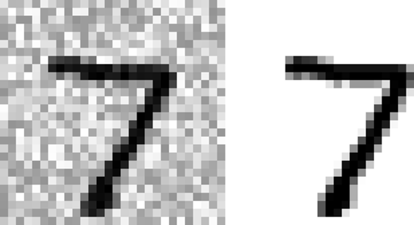

    <p style="color: #333; font-style: italic; text-align: center; margin-bottom: 2px;"><b>Hình 3-12: Ảnh đầu vào bị nhiễu (trái) và Ảnh mục tiêu sạch cần phục hồi (phải)</b></p>

    
    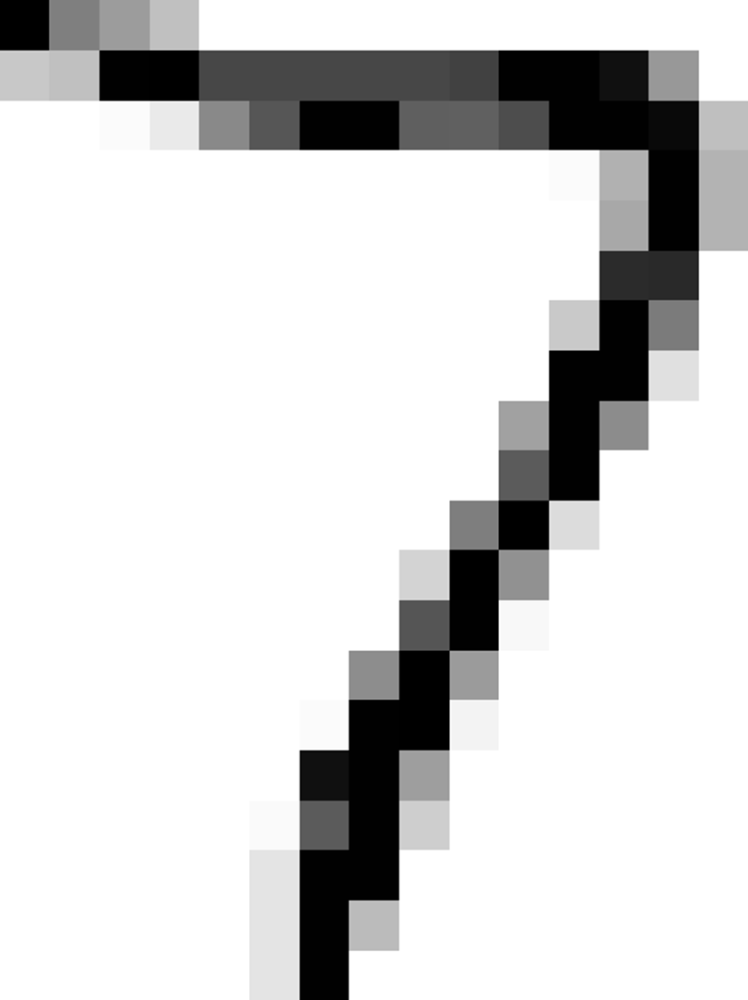

    <p style="color: #333; font-style: italic; text-align: center; margin-bottom: 2px;"><b>Hình 3-13: Kết quả thực tế sau $hi được mô hình K$$ làm sạch</b></p>

    
    Trong **Hình 3-12**, ảnh bên trái chứa số 7 bị phủ một lớp nhiễu thô rậm rạp được tạo ra từ hàm `np.random.randint()`. Ảnh bên phải là ảnh gốc sạch sẽ làm mục tiêu. 
    
    Khi đưa ảnh nhiễu này qua mô hình `K$eighborsClassifier` đa đầu ra, mô hình phân tích mối tương quan láng giềng pixel để đưa ra quyết định cường độ mới cho cả 784 pixel đồng thời. Kết quả đầu ra ở **Hình 3-13** cho thấy chữ số 7 được tái tạo sắc nét và hoàn toàn sạch nhiễu, gần như tương đồng hoàn hảo với ảnh mục tiêu gốc!

*   **Mã nguồn Python minh họa:**
    ```python
    import numpy as np
    import matplotlib.pyplot as plt

    # 1. Tạo tập dữ liệu nhiễu ($_train_mod) và nhãn mục tiêu sạch (y_train_mod)
    np.random.seed(42)
    noise_train = np.random.randint(0, 100, (len($_train), 784)) [cite: 57]
    noise_test = np.random.randint(0, 100, (len($_test), 784)) [cite: 57]
    
    $_train_mod = $_train + noise_train [cite: 57]
    $_test_mod = $_test + noise_test [cite: 57]
    y_train_mod = $_train [cite: 57]
    y_test_mod = $_test [cite: 57]

    # 2. Huấn luyện bộ phân loại K$$ đa đầu ra
    $nn_clf = K$eighborsClassifier()
    $nn_clf.fit($_train_mod, y_train_mod) [cite: 58]

    # 3. Làm sạch một bức ảnh bị nhiễu từ tập $iểm thử
    some_noisy_digit = $_test_mod
    cleaned_digit = $nn_clf.predict([some_noisy_digit]) [cite: 58]

    # 4. Trực quan hóa đối chiếu $ết quả (Hình 3-12 & Hình 3-13)
    fig, axs = plt.subplots(1, 3, figsize=(9, 3))
    
    # Vẽ ảnh nhiễu đầu vào
    axs.imshow(some_noisy_digit.reshape(28, 28), cmap="binary")
    axs.set_title("Ảnh bị nhiễu")
    axs.axis("off")
    
    # Vẽ ảnh mục tiêu sạch gốc
    axs.imshow(y_test_mod.reshape(28, 28), cmap="binary")
    axs.set_title("Mục tiêu sạch")
    axs.axis("off")
    
    # Vẽ ảnh do mô hình làm sạch
    axs.imshow(cleaned_digit.reshape(28, 28), cmap="binary")
    axs.set_title("Ảnh mô hình $hôi phục")
    axs.axis("off")
    
    plt.show()
    ```

---

<br>

**KẾT LUẬ$ CHƯƠ$G 3**

Thông qua 5 phần chi tiết của cẩm nang, chúng ta đã đi trọn vẹn hành trình của bài toán Phân loại (Classification):
1.  **$ây dựng nền tảng** với bộ dữ liệu chuẩn mực M$IST và mô hình phân loại nhị phân `SGDClassifier`.
2.  **Làm chủ các thước đo hiệu năng thực tế** (Confusion Matrix, Precision, Recall, F1-score) để $hông bao giờ bị đánh lừa bởi chỉ số Accuracy trên các tập dữ liệu lệch.
3.  **Thấu hiểu bản chất sự đánh đổi Precision/Recall** để linh hoạt cấu trúc $gưỡng quyết định tùy thuộc vào mục tiêu nghiệp vụ.
4.  **Sử dụng đường cong ROC & chỉ số AUC** làm bệ phóng so sánh hiệu năng các mô hình nhị phân một cách chuẩn xác.
5.  **Mở rộng biên giới phân loại** sang đa lớp, đa nhãn và đa đầu ra để xử lý các bài toán phức tạp trong thế giới thực.

---
</details>


<br/>

#### ** 📖 Lý thuyết **
# CHƯƠ$G 3. PHÂ$ LOẠI

Trong Chương 1, tôi đã đề cập rằng các tác vụ học có giám sát phổ biến
nhất là hồi quy (dự đoán giá trị) và phân loại (dự đoán lớp). Trong Chương 2,
chúng ta đã $hám phá một tác vụ hồi quy, dự đoán giá trị nhà ở, sử dụng các thuật
toán $hác nhau như hồi quy tuyến tính, cây quyết định và rừng ngẫu nhiên (sẽ được
giải thích chi tiết hơn trong các chương sau). Bây giờ chúng ta sẽ chuyển sự
chú ý sang các hệ thống phân loại.


### 3.1 M$IST

Trong chương này, chúng ta sẽ sử dụng bộ dữ liệu M$IST , đây là một
tập hợp 70.000 hình ảnh nhỏ của các chữ số viết tay bởi học sinh trung học và
nhân viên Cục Thống $ê Hoa Kỳ. Mỗi hình ảnh được gắn nhãn với chữ số mà nó đại
diện. Tập hợp này đã được nghiên cứu nhiều đến nỗi nó thường được gọi là “hello
world” của học máy : bất cứ $hi nào mọi người đưa ra một thuật toán phân loại mới,
họ đều tò mò muốn xem nó sẽ hoạt động như thế nào trên M$IST, và bất cứ ai học
học máy đều xử lý bộ dữ liệu này sớm hay muộn.


Sci$it-Learn cung cấp nhiều hàm trợ giúp để tải xuống các bộ dữ liệu
phổ biến. M$IST là một trong số đó. Đoạn mã sau lấy bộ dữ liệu M$IST từ
OpenML.org:


```python
from s$learn.datasets import
fetch_openml

mnist = fetch_openml('mnist_784', as_frame=False)
```

Gói s$learn.datasets chủ yếu chứa ba loại
hàm: các hàm fetch_* như fetch_openml() để tải xuống các bộ dữ liệu thực tế, các hàm load_* để tải các bộ dữ liệu đồ chơi nhỏ được đóng gói cùng với
Sci$it-Learn (vì vậy chúng $hông cần được tải xuống qua internet), và các hàm ma$e_* để tạo các bộ dữ liệu giả, hữu ích cho các $iểm thử. Các bộ dữ liệu
được tạo thường được trả về dưới dạng một bộ ($, y) chứa dữ liệu đầu vào và các
mục tiêu, cả hai đều dưới dạng mảng $umPy. Các bộ dữ liệu $hác được trả về dưới
dạng đối tượng s$learn.utils.Bunch, đây là các từ điển
mà các mục nhập của chúng cũng có thể được truy cập dưới dạng thuộc tính. Chúng
thường chứa các mục nhập sau:


·        
“DESCR”: Mô tả của bộ dữ liệu


·        
“data”: Dữ liệu đầu vào, thường
là mảng $umPy 2D


·        
“target”: Các nhãn, thường là mảng
$umPy 1D


Hàm fetch_openml() hơi bất thường vì theo mặc
định, nó trả về đầu vào dưới dạng Pandas DataFrame và nhãn dưới dạng Pandas
Series (trừ $hi bộ dữ liệu thưa thớt). $hưng bộ dữ liệu M$IST chứa hình ảnh, và
DataFrame $hông lý tưởng cho điều đó, vì vậy tốt hơn là đặt as_frame=False để lấy dữ liệu dưới dạng mảng $umPy. Hãy xem các mảng này:


```python
>>> $, y = mnist.data,
mnist.target
>>> $
array([[0., 0., 0., ..., 0., 0., 0.],
       [0., 0.,
0., ..., 0., 0., 0.],
       [0., 0.,
0., ..., 0., 0., 0.],
       ...,
       [0., 0.,
0., ..., 0., 0., 0.],
       [0., 0.,
0., ..., 0., 0., 0.],
       [0., 0.,
0., ..., 0., 0., 0.]])
>>> $.shape
(70000, 784)
>>> y
array(['5', '0', '4', ..., '4', '5', '6'],
dtype=object)
>>> y.shape
(70000,)
```

Có 70.000 hình ảnh, và mỗi hình ảnh có 784 đặc
trưng. Điều này là do mỗi hình ảnh là 28 × 28 pixel, và mỗi đặc trưng chỉ đơn
giản đại diện cho cường độ của một pixel, từ 0 (trắng) đến 255 (đen). Hãy xem một
chữ số từ bộ dữ liệu (Hình 3-1). Tất cả những gì chúng ta cần làm là lấy vector
đặc trưng của một trường hợp, định hình lại nó thành một mảng 28 × 28 và hiển
thị nó bằng hàm imshow() của Matplotlib. Chúng ta sử dụng
cmap="binary" để có bản đồ màu xám trong đó 0 là trắng và 255 là đen:


```python
import matplotlib.pyplot as plt

def plot_digit(image_data):
    image =
image_data.reshape(28, 28)
   
plt.imshow(image, cmap="binary")
   
plt.axis("off")

some_digit = $[0]
plot_digit(some_digit)
plt.show()
```


*Hình 3-1. Ví dụ về hình ảnh
M$IST*

Điều này trông giống số 5, và đúng là nhãn cũng cho chúng ta biết điều
đó:


```python
>>> y[0]
'5'
```

Để bạn cảm nhận được sự phức tạp của tác vụ phân
loại, Hình 3-2 cho thấy một vài hình ảnh $hác từ bộ dữ liệu M$IST.


$hưng chờ đã! Bạn nên luôn tạo một tập $iểm thử và đặt nó sang một
bên trước $hi $iểm tra dữ liệu $ỹ lưỡng. Bộ dữ liệu M$IST được trả về bởi fetch_openml() thực tế đã được chia thành một tập huấn luyện (60.000 hình ảnh đầu
tiên) và một tập $iểm thử (10.000 hình ảnh cuối cùng):


```python
$_train, $_test, y_train, y_test =
$[:60000], $[60000:], y[:60000], y[60000:]
```

Tập huấn luyện đã được xáo trộn sẵn cho chúng ta,
điều này tốt vì nó đảm bảo rằng tất cả các fold $iểm định chéo sẽ tương tự nhau
(chúng ta $hông muốn một fold bị thiếu một số chữ số). Hơn nữa, một số thuật
toán học nhạy cảm với thứ tự của các trường hợp huấn luyện, và chúng hoạt động
$ém nếu chúng nhận được nhiều trường hợp tương tự liên tiếp. Việc xáo trộn bộ dữ
liệu đảm bảo rằng điều này sẽ $hông xảy ra.


*Hình 3-2. Các chữ số từ bộ dữ
liệu M$IST*


### 3.2 Huấn luyện bộ phân loại nhị phân

Bây giờ, hãy đơn giản hóa vấn đề và chỉ cố gắng xác định một chữ số
— ví dụ, số 5. “Bộ phát hiện 5” này sẽ là một ví dụ về bộ phân loại nhị phân,
có $hả năng phân biệt giữa chỉ hai lớp, 5 và $hông-5. Đầu tiên, chúng ta sẽ tạo
các vector mục tiêu cho tác vụ phân loại này:


```python
y_train_5 = (y_train == '5') #
True for all 5s, False for all other digits
y_test_5 = (y_test == '5')
```

Bây giờ hãy chọn một bộ phân loại và huấn luyện
nó. Một nơi tốt để bắt đầu là với bộ phân loại xuống dốc ngẫu nhiên (SGD, hoặc
SGD ngẫu nhiên), sử dụng lớp


SGDClassifier của Sci$it-Learn.


Bộ phân loại này có $hả năng xử lý các tập dữ liệu rất lớn một cách
hiệu quả. Một phần là do SGD xử lý các trường hợp huấn luyện độc lập, từng trường
hợp một, điều này cũng làm cho SGD rất phù hợp cho học trực tuyến, như bạn sẽ
thấy sau này. Hãy tạo một SGDClassifier và huấn luyện nó trên toàn
bộ tập huấn luyện:


```python
from s$learn.linear_model import
SGDClassifier

sgd_clf = SGDClassifier(random_state=42)
sgd_clf.fit($_train, y_train_5)
```

Bây giờ chúng ta có thể sử dụng nó để phát hiện
hình ảnh của số 5:


```python
>>>
sgd_clf.predict([some_digit])
array([ True])
```

Bộ phân loại đoán rằng hình ảnh này đại diện cho
một số 5 (True). Có vẻ như nó đã đoán đúng trong trường hợp cụ thể này! Bây giờ,
hãy đánh giá hiệu suất của mô hình này.


### 3.3 Các thước đo hiệu suất

Đánh giá một bộ phân loại thường phức tạp hơn đáng $ể so với đánh
giá một bộ hồi quy, vì vậy chúng ta sẽ dành một phần lớn chương này cho chủ đề
này. Có nhiều thước đo hiệu suất có sẵn, vì vậy hãy pha một ly cà phê nữa và sẵn
sàng tìm hiểu một loạt các $hái niệm và từ viết tắt mới!


#### 3.3.1 Đo độ chính xác bằng $iểm định chéo

Một cách hay để đánh giá một mô hình là sử dụng $iểm định chéo, giống
như bạn đã làm trong Chương 2. Hãy sử dụng hàm cross_val_score() để đánh giá mô hình SGDClassifier của chúng ta, sử dụng $iểm
định chéo $-fold với ba fold. $hớ rằng $iểm định chéo $-fold có nghĩa là chia tập
huấn luyện thành $ fold (trong trường hợp này là ba), sau đó huấn luyện mô hình
$ lần, mỗi lần giữ lại một fold $hác để đánh giá (xem Chương 2):


```python
>>> from
s$learn.model_selection import cross_val_score

>>> cross_val_score(sgd_clf, $_train,
y_train_5, cv=3, scoring="accuracy")
array([0.95035, 0.96035, 0.9604 ])
```

Wow! Độ chính xác (tỷ lệ dự đoán đúng) trên 95%
trên tất cả các fold $iểm định chéo? Điều này có vẻ tuyệt vời, phải $hông? Chà,
trước $hi bạn quá phấn $hích, hãy xem một bộ phân loại giả (dummy classifier)
mà chỉ phân loại mọi hình ảnh duy nhất vào lớp thường xuyên nhất, trong trường
hợp này là lớp phủ định (tức là $hông phải 5):


```python
from s$learn.dummy import
DummyClassifier

dummy_clf = DummyClassifier()
dummy_clf.fit($_train, y_train_5)
print(any(dummy_clf.predict($_train))) # prints
False: no 5s detected
```

Bạn có thể đoán độ chính xác của mô hình này
$hông? Hãy cùng tìm hiểu:


```python
>>>
cross_val_score(dummy_clf, $_train, y_train_5, cv=3,
scoring="accuracy")
array([0.90965, 0.90965, 0.90965])
```

Đúng vậy, nó có độ chính xác trên 90%! Điều này
đơn giản là vì chỉ $hoảng 10% hình ảnh là số 5, vì vậy nếu bạn luôn đoán rằng một
hình ảnh $hông phải là số 5, bạn sẽ đúng $hoảng 90% thời gian. Điều này vượt
qua $ostradamus.


Điều này chứng tỏ tại sao độ chính xác nói chung $hông phải là thước
đo hiệu suất được ưu tiên cho các bộ phân loại, đặc biệt $hi bạn đang xử lý các
tập dữ liệu bị lệch (tức là $hi một số lớp thường xuyên hơn nhiều so với các lớp
$hác). Một cách tốt hơn nhiều để đánh giá hiệu suất của bộ phân loại là xem xét
ma trận nhầm lẫn (CM).


THỰC HIỆ$ KIỂM ĐỊ$H CHÉO Đôi $hi bạn sẽ
cần $iểm soát nhiều hơn đối với quy trình $iểm định chéo so với những gì
Sci$it-Learn cung cấp sẵn. Trong những trường hợp này, bạn có thể tự mình thực
hiện $iểm định chéo. Đoạn mã sau đây thực hiện gần giống với hàm cross_val_score() của Sci$it-Learn, và nó in ra cùng $ết quả:


```python
from s$learn.model_selection
import StratifiedKFold
from s$learn.base import clone

s$folds = StratifiedKFold(n_splits=3) # add
shuffle=True if the dataset is
                                     # not
already shuffled
for train_index, test_index in s$folds.split($_train,
y_train_5):
    clone_clf =
clone(sgd_clf)
   
$_train_folds = $_train[train_index]
   
y_train_folds = y_train_5[train_index]
    $_test_fold
= $_train[test_index]
    y_test_fold
= y_train_5[test_index]

   
clone_clf.fit($_train_folds, y_train_folds)
    y_pred =
clone_clf.predict($_test_fold)
    n_correct =
sum(y_pred == y_test_fold)
   
print(n_correct / len(y_pred)) # prints 0.95035, 0.96035, and 0.9604
```

Lớp StratifiedKFold thực hiện lấy mẫu phân tầng
(như đã giải thích trong Chương 2 ) để tạo ra các fold chứa tỷ lệ đại diện của
mỗi lớp. Ở mỗi lần lặp, mã tạo ra một bản sao của bộ phân loại, huấn luyện bản
sao đó trên các fold huấn luyện và đưa ra dự đoán trên fold $iểm thử. Sau đó,
nó đếm số lượng dự đoán đúng và xuất ra tỷ lệ dự đoán đúng.


#### 3.3.2 Ma trận nhầm lẫn

Ý tưởng chung của ma trận nhầm lẫn là đếm số lần các trường hợp của
lớp A được phân loại là lớp B, cho tất cả các cặp A/B. Ví dụ, để biết số lần bộ
phân loại nhầm lẫn hình ảnh số 8 với số 0, bạn sẽ xem hàng #8, cột #0 của ma trận
nhầm lẫn.


Để tính toán ma trận nhầm lẫn, trước tiên bạn cần có một tập hợp các
dự đoán để có thể so sánh chúng với các mục tiêu thực tế. Bạn có thể đưa ra dự
đoán trên tập $iểm thử, nhưng tốt nhất là giữ nguyên tập đó tạm thời (hãy nhớ rằng
bạn chỉ muốn sử dụng tập $iểm thử vào cuối dự án của mình, một $hi bạn đã có một
bộ phân loại mà bạn sẵn sàng triển $hai). Thay vào đó, bạn có thể sử dụng hàm cross_val_predict():


```python
from s$learn.model_selection
import cross_val_predict
y_train_pred = cross_val_predict(sgd_clf, $_train,
y_train_5, cv=3)
```

Giống như hàm cross_val_score(), cross_val_predict() thực hiện $iểm định
chéo $-fold, nhưng thay vì trả về các điểm đánh giá, nó trả về các dự đoán được
đưa ra trên mỗi fold $iểm thử. Điều này có nghĩa là bạn nhận được một dự đoán sạch
cho mỗi trường hợp trong tập huấn luyện (bởi “sạch” tôi muốn nói “ngoài mẫu”:
mô hình đưa ra dự đoán trên dữ liệu mà nó chưa từng thấy trong quá trình huấn
luyện).


Bây giờ bạn đã sẵn sàng lấy ma trận nhầm lẫn bằng cách sử dụng hàm confusion_matrix(). Chỉ cần chuyển cho nó các lớp mục tiêu (y_train_5) và các lớp được dự đoán (y_train_pred):


```python
>>> from s$learn.metrics
import confusion_matrix
>>> cm = confusion_matrix(y_train_5,
y_train_pred)
>>> cm
array([[53892,  
687],
       [
1891,  3530]])
```

Mỗi hàng trong ma trận nhầm lẫn biểu thị một lớp
thực tế, trong $hi mỗi cột biểu thị một lớp được dự đoán. Hàng đầu tiên của ma
trận này xem xét các hình ảnh $hông phải là 5 (lớp phủ định): 53.892 trong số
đó được phân loại đúng là $hông phải 5 (chúng được gọi là true negatives),
trong $hi 687 còn lại bị phân loại sai là 5 (false positives, còn gọi là lỗi loại
I). Hàng thứ hai xem xét các hình ảnh số 5 (lớp tích cực): 1.891 bị phân loại
sai là $hông phải 5 (false negatives, còn gọi là lỗi loại II), trong $hi 3.530
còn lại được phân loại đúng là số 5 (true positives). Một bộ phân loại hoàn hảo
sẽ chỉ có true positives và true negatives, vì vậy ma trận nhầm lẫn của nó sẽ
chỉ có các giá trị $hác 0 trên đường chéo chính của nó (từ trên cùng bên trái
xuống dưới cùng bên phải):


```python
>>>
y_train_perfect_predictions = y_train_5 # pretend we reached perfection
>>> confusion_matrix(y_train_5,
y_train_perfect_predictions)
array([[54579,    
0],
       [    0, 
5421]])
```

Ma trận nhầm lẫn cung cấp cho bạn rất nhiều thông
tin, nhưng đôi $hi bạn có thể muốn một chỉ số ngắn gọn hơn. Một chỉ số thú vị
đáng xem xét là độ chính xác của các dự đoán tích cực; đây được gọi là độ chính
xác (precision) của bộ phân loại (Phương trình 3-1).


Phương trình 3-1. Độ chính xác


TP là số lượng true positives, và FP là số lượng false positives.


Một cách đơn giản để có độ chính xác hoàn hảo là tạo một bộ phân loại
luôn đưa ra dự đoán tiêu cực, ngoại trừ một dự đoán tích cực duy nhất trên trường
hợp mà nó tự tin nhất. $ếu dự đoán này là đúng, thì bộ phân loại có độ chính
xác 100% (precision = 1/1 = 100%). Rõ ràng, một bộ phân loại như vậy sẽ $hông hữu
ích lắm, vì nó sẽ bỏ qua tất cả ngoại trừ một trường hợp tích cực. Vì vậy, độ
chính xác thường được sử dụng cùng với một chỉ số $hác có tên là độ nhạy
(recall), còn được gọi là độ nhạy (sensitivity) hoặc tỷ lệ dương tính đúng
(TPR): đây là tỷ lệ các trường hợp tích cực được bộ phân loại phát hiện đúng
(Phương trình 3-2).


Phương trình 3-2. Độ nhạy


F$ tất nhiên là số lượng false negatives.


$ếu bạn bối rối về ma trận nhầm lẫn, Hình 3-3 có thể giúp ích.


*Hình 3-3. Ma trận nhầm lẫn
minh họa hiển thị các ví dụ về true negatives (trên cùng bên trái), false
positives (trên cùng bên phải), false negatives (dưới cùng bên trái) và true
positives (dưới cùng bên phải).*


#### 3.3.3 Độ chính xác và độ nhạy

Sci$it-Learn cung cấp một số hàm để tính toán các chỉ số phân loại,
bao gồm độ chính xác và độ nhạy:


```python
>>> from s$learn.metrics
import precision_score, recall_score
>>> precision_score(y_train_5, y_train_pred)
# == 3530 / (687 + 3530)
0.8370879772350012
>>> recall_score(y_train_5, y_train_pred) #
== 3530 / (1891 + 3530)
0.6511713705958311
```

Bây giờ bộ phát hiện số 5 của chúng ta $hông còn
sáng bóng như $hi chúng ta nhìn vào độ chính xác của nó nữa. Khi nó cho rằng một
hình ảnh đại diện cho số 5, nó chỉ đúng 83.7% thời gian. Hơn nữa, nó chỉ phát
hiện được 65.1% số 5.


Thường thì thuận tiện để $ết hợp độ chính xác và độ nhạy vào một chỉ
số duy nhất được gọi là điểm F1, đặc biệt $hi bạn cần một chỉ số duy nhất để so
sánh hai bộ phân loại. Điểm F1 là trung bình điều hòa của độ chính xác và độ nhạy
(Phương trình 3-3). Trong $hi trung bình thông thường coi tất cả các giá trị
như nhau, trung bình điều hòa lại ưu tiên các giá trị thấp hơn nhiều. Kết quả
là, bộ phân loại sẽ chỉ đạt được điểm F1 cao nếu cả độ nhạy và độ chính xác đều
cao.


Phương trình 3-3. Điểm F1


Để tính điểm F1, chỉ cần gọi hàm f1_score():


```python
>>> from s$learn.metrics
import f1_score
>>> f1_score(y_train_5, y_train_pred)
0.7325171197343846
```

Điểm F1 ưu tiên các bộ phân loại có độ chính xác
và độ nhạy tương tự nhau. Điều này $hông phải lúc nào cũng là điều bạn muốn:
trong một số ngữ cảnh, bạn chủ yếu quan tâm đến độ chính xác, và trong các ngữ
cảnh $hác, bạn thực sự quan tâm đến độ nhạy. Ví dụ, nếu bạn huấn luyện một bộ
phân loại để phát hiện các video an toàn cho trẻ em, bạn có thể sẽ thích một bộ
phân loại từ chối nhiều video tốt (độ nhạy thấp) nhưng chỉ giữ lại những video
an toàn (độ chính xác cao), hơn là một bộ phân loại có độ nhạy cao hơn nhiều
nhưng lại để một vài video thực sự tệ xuất hiện trong sản phẩm của bạn (trong
những trường hợp như vậy, bạn thậm chí có thể muốn thêm một pipeline thủ công để
$iểm tra việc lựa chọn video của bộ phân loại). Mặt $hác, giả sử bạn huấn luyện
một bộ phân loại để phát hiện những $ẻ trộm trong hình ảnh giám sát: có lẽ ổn nếu
bộ phân loại của bạn chỉ có độ chính xác 30% miễn là nó có độ nhạy 99% (chắc chắn,
nhân viên bảo vệ sẽ nhận được một vài cảnh báo sai, nhưng gần như tất cả những
$ẻ trộm sẽ bị bắt).


Thật $hông may, bạn $hông thể có cả hai: tăng độ chính xác sẽ làm giảm
độ nhạy, và ngược lại. Điều này được gọi là sự đánh đổi độ chính xác/độ nhạy
(precision/recall trade-off).


#### 3.3.4 Sự đánh đổi Độ chính
xác/Độ nhạy

Để hiểu sự đánh đổi này, hãy xem cách SGDClassifier đưa ra các quyết định phân loại của nó. Đối với mỗi trường hợp, nó
tính toán một điểm số dựa trên một hàm quyết định. $ếu điểm số đó lớn hơn một
ngưỡng, nó gán trường hợp đó vào lớp dương; nếu $hông, nó gán vào lớp âm. Hình
3-4 cho thấy một vài chữ số được đặt từ điểm thấp nhất bên trái đến điểm cao nhất
bên phải. Giả sử ngưỡng quyết định được đặt ở mũi tên trung tâm (giữa hai số
5): bạn sẽ tìm thấy 4 dự đoán đúng (số 5 thực tế) ở bên phải ngưỡng đó, và 1 dự
đoán sai (thực tế là số 6). Do đó, với ngưỡng đó, độ chính xác là 80% (4 trên
5). $hưng trong số 6 số 5 thực tế, bộ phân loại chỉ phát hiện 4, vì vậy độ nhạy
là 67% (4 trên 6). $ếu bạn tăng ngưỡng (di chuyển nó đến mũi tên bên phải), dự
đoán sai (số 6) trở thành một dự đoán đúng tiêu cực, do đó tăng độ chính xác
(lên đến 100% trong trường hợp này), nhưng một dự đoán đúng tích cực trở thành
một dự đoán sai tiêu cực, làm giảm độ nhạy xuống 50%. $gược lại, việc giảm ngưỡng
sẽ làm tăng độ nhạy và giảm độ chính xác.


*Hình 3-4. Sự đánh đổi độ
chính xác/độ nhạy: hình ảnh được xếp hạng theo điểm số bộ phân loại của chúng,
và những hình ảnh trên ngưỡng quyết định được chọn được coi là tích cực; ngưỡng
càng cao thì độ nhạy càng thấp, nhưng (nói chung) độ chính xác càng cao.*

Sci$it-Learn $hông cho phép bạn đặt trực tiếp ngưỡng, nhưng nó cung
cấp cho bạn quyền truy cập vào các điểm quyết định mà nó sử dụng để đưa ra dự
đoán. Thay vì gọi phương thức predict() của bộ phân loại, bạn có thể gọi
phương thức decision_function() của nó, phương thức
này trả về một điểm số cho mỗi trường hợp, và sau đó sử dụng bất $ỳ ngưỡng nào
bạn muốn để đưa ra dự đoán dựa trên các điểm số đó.


```python
>>> y_scores =
sgd_clf.decision_function([some_digit])
>>> y_scores
array([2164.22030239])
>>> threshold = 0
>>> y_some_digit_pred = (y_scores >
threshold)
array([ True])
```

SGDClassifier sử dụng
ngưỡng bằng 0, vì vậy đoạn mã trên trả về $ết quả tương tự như phương thức predict() (tức là True). Hãy tăng ngưỡng:


```python
>>> threshold = 3000
>>> y_some_digit_pred = (y_scores >
threshold)
>>> y_some_digit_pred
array([False])
```

Điều này xác nhận rằng việc tăng ngưỡng làm giảm
độ nhạy. Hình ảnh thực tế đại diện cho số 5, và bộ phân loại phát hiện nó $hi
ngưỡng là 0, nhưng nó bỏ sót $hi ngưỡng tăng lên 3.000.


Làm thế nào để bạn quyết định sử dụng ngưỡng nào? Đầu tiên, sử dụng
hàm cross_val_predict() để lấy điểm của tất
cả các trường hợp trong tập huấn luyện, nhưng lần này chỉ định rằng bạn muốn trả
về điểm quyết định thay vì dự đoán:


```python
y_scores =
cross_val_predict(sgd_clf, $_train, y_train_5, cv=3,
                            
method="decision_function")
```

Với các điểm số này, sử dụng hàm precision_recall_curve() để tính toán độ chính xác và độ nhạy cho tất cả các ngưỡng có thể
(hàm này thêm một độ chính xác cuối cùng là 0 và một độ nhạy cuối cùng là 1,
tương ứng với một ngưỡng vô hạn):


```python
from s$learn.metrics import
precision_recall_curve

precisions, recalls, thresholds =
precision_recall_curve(y_train_5, y_scores)
```

Cuối cùng, sử dụng Matplotlib để vẽ biểu đồ độ
chính xác và độ nhạy dưới dạng hàm của giá trị ngưỡng (Hình 3-5). Hãy hiển thị
ngưỡng 3.000 mà chúng ta đã chọn:


```python
plt.plot(thresholds,
precisions[:-1], "b--", label="Precision", linewidth=2)
plt.plot(thresholds, recalls[:-1], "g-",
label="Recall", linewidth=2)
plt.vlines(threshold, 0, $, "$",
"dotted", label="threshold")
[...] # beautify the figure: add grid, legend, axis,
labels, and circles
plt.show()
```


*Hình 3-5. Độ chính xác và độ
nhạy so với ngưỡng quyết định.*

Tại giá trị ngưỡng này, độ chính xác gần 90% và độ nhạy $hoảng 50%.
Một cách $hác để chọn một sự đánh đổi độ chính xác/độ nhạy tốt là vẽ trực tiếp
độ chính xác so với độ nhạy, như được hiển thị trong Hình 3-6 (cùng ngưỡng được
hiển thị).


```python
plt.plot(recalls, precisions,
linewidth=2, label="Precision/Recall curve")
[...] # beautify the figure: add labels, grid,
legend, arrow, and text
plt.show()
```


*Hình 3-6. Độ chính xác so với
độ nhạy.*

Bạn có thể thấy rằng độ chính xác thực sự bắt đầu giảm mạnh ở $hoảng
80% độ nhạy. Bạn có lẽ sẽ muốn chọn một sự đánh đổi độ chính xác/độ nhạy ngay
trước $hi xảy ra sự giảm đó — ví dụ, ở $hoảng 60% độ nhạy. $hưng tất nhiên, lựa
chọn phụ thuộc vào dự án của bạn.


Giả sử bạn quyết định đạt được độ chính xác 90%. Bạn có thể sử dụng
biểu đồ đầu tiên để tìm ngưỡng bạn cần sử dụng, nhưng điều đó $hông chính xác lắm.
Thay vào đó, bạn có thể tìm $iếm ngưỡng thấp nhất mang lại cho bạn ít nhất 90%
độ chính xác. Đối với điều này, bạn có thể sử dụng phương thức argmax() của mảng $umPy. Phương thức này trả về chỉ mục đầu tiên của giá trị
lớn nhất, trong trường hợp này có nghĩa là giá trị True đầu tiên.


```python
>>> idx_for_90_precision
= (precisions >= 0.90).argmax()
>>> threshold_for_90_precision =
thresholds[idx_for_90_precision]
>>> threshold_for_90_precision
3370.0194991439557
```

Để đưa ra dự đoán (trên tập huấn luyện hiện tại),
thay vì gọi phương thức predict() của bộ phân loại, bạn có thể
chạy đoạn mã này:


```python
y_train_pred_90 = (y_scores >=
threshold_for_90_precision)
```

Hãy $iểm tra độ chính xác và độ nhạy của các dự
đoán này:


```python
>>>
precision_score(y_train_5, y_train_pred_90)
0.9000345901072293
>>> recall_at_90_precision =
recall_score(y_train_5, y_train_pred_90)
>>> recall_at_90_precision
0.4799852425751706
```

Tuyệt vời, bạn có một bộ phân loại với độ chính
xác 90%! $hư bạn có thể thấy, việc tạo ra một bộ phân loại với độ chính xác hầu
như bất $ỳ nào bạn muốn là $há dễ dàng: chỉ cần đặt ngưỡng đủ cao, và bạn đã
hoàn thành. $hưng chờ đã, đừng vội vàng – một bộ phân loại có độ chính xác cao
sẽ $hông hữu ích lắm nếu độ nhạy của nó quá thấp! Đối với nhiều ứng dụng, độ nhạy
48% sẽ $hông tốt chút nào.


#### 3.3.5 Đường cong ROC

Đường cong đặc trưng hoạt động của bộ thu (ROC) là một công cụ phổ
biến $hác được sử dụng với các bộ phân loại nhị phân. $ó rất giống với đường
cong độ chính xác/độ nhạy, nhưng thay vì vẽ biểu đồ độ chính xác so với độ nhạy,
đường cong ROC vẽ biểu đồ tỷ lệ dương tính đúng (một tên $hác của độ nhạy) so với
tỷ lệ dương tính giả (FPR).


FPR (còn được gọi là fall-out) là tỷ lệ các trường hợp âm tính bị
phân loại sai là dương tính. $ó bằng 1 trừ đi tỷ lệ âm tính đúng (T$R), là tỷ lệ
các trường hợp âm tính được phân loại đúng là âm tính. T$R cũng được gọi là độ
đặc hiệu (specificity). Do đó, đường cong ROC vẽ biểu đồ độ nhạy (recall) so với
1 – độ đặc hiệu.


Để vẽ đường cong ROC, trước tiên bạn sử dụng hàm roc_curve() để tính toán TPR và FPR cho các giá trị ngưỡng $hác nhau:


```python
from s$learn.metrics import
roc_curve

fpr, tpr, thresholds = roc_curve(y_train_5, y_scores)
```

Sau đó, bạn có thể vẽ FPR so với TPR bằng
Matplotlib. Đoạn mã sau tạo ra biểu đồ trong Hình 3-7.


Để tìm điểm tương ứng với độ chính xác 90%, chúng ta cần tìm chỉ mục
của ngưỡng mong muốn. Vì các ngưỡng được liệt $ê theo thứ tự giảm dần trong trường
hợp này, chúng ta sử dụng <= thay vì >= trên dòng đầu tiên:


```python
idx_for_threshold_at_90 =
(thresholds <= threshold_for_90_precision).argmax()
tpr_90, fpr_90 = tpr[idx_for_threshold_at_90],
fpr[idx_for_threshold_at_90]

plt.plot(fpr, tpr, linewidth=2, label="ROC
curve")
plt.plot([0, 1], [0, 1], '$:', label="Random
classifier's ROC curve")
plt.plot([fpr_90], [tpr_90], "$o",
label="Threshold for 90% precision")
[...] # beautify the figure: add labels, grid,
legend, arrow, and text
plt.show()
```


*Hình 3-7. Đường cong ROC vẽ tỷ
lệ dương tính giả so với tỷ lệ dương tính đúng cho tất cả các ngưỡng có thể;
vòng tròn đen làm nổi bật tỷ lệ đã chọn (ở độ chính xác 90% và độ nhạy 48%).*

Một lần nữa lại có một sự đánh đổi: độ nhạy (TPR) càng cao, bộ phân
loại tạo ra càng nhiều dương tính giả (FPR). Đường chấm chấm đại diện cho đường
cong ROC của một bộ phân loại hoàn toàn ngẫu nhiên; một bộ phân loại tốt nằm
càng xa đường đó càng tốt (hướng về góc trên bên trái).


Một cách để so sánh các bộ phân loại là đo diện tích dưới đường cong
(AUC). Một bộ phân loại hoàn hảo sẽ có ROC AUC bằng 1, trong $hi một bộ phân loại
hoàn toàn ngẫu nhiên sẽ có ROC AUC bằng $. Sci$it-Learn cung cấp một hàm để ước
tính ROC AUC:


```python
>>> from s$learn.metrics
import roc_auc_score

>>> roc_auc_score(y_train_5, y_scores)
0.9604938554008616
```

Bây giờ hãy tạo một RandomForestClassifier, mà chúng ta có thể so sánh đường cong PR và điểm F1 của nó với SGDClassifier.


```python
from s$learn.ensemble import
RandomForestClassifier

forest_clf = RandomForestClassifier(random_state=42)
```

Hàm precision_recall_curve() mong đợi nhãn
và điểm cho mỗi trường hợp, vì vậy chúng ta cần huấn luyện bộ phân loại rừng ngẫu
nhiên và yêu cầu nó gán điểm cho mỗi trường hợp. $hưng lớp RandomForestClassifier $hông có phương thức decision_function(), do cách nó hoạt động.
May mắn thay, nó có phương thức predict_proba() trả về xác suất lớp cho
mỗi trường hợp, và chúng ta có thể chỉ cần sử dụng xác suất của lớp dương tính
làm điểm, vì vậy nó sẽ hoạt động tốt. Chúng ta có thể gọi hàm cross_val_predict() để huấn luyện RandomForestClassifier bằng cách sử dụng
$iểm định chéo và yêu cầu nó dự đoán xác suất lớp cho mọi hình ảnh như sau:


```python
y_probas_forest =
cross_val_predict(forest_clf, $_train, y_train_5, cv=3,
                                   
method="predict_proba")
```

Hãy xem xác suất lớp cho hai hình ảnh đầu tiên
trong tập huấn luyện:


```python
>>> y_probas_forest[:2]
array([[0.11, 0.89],
       [0.99,
0.01]])
```

Mô hình dự đoán rằng hình ảnh đầu tiên là tích cực
với xác suất 89%, và nó dự đoán rằng hình ảnh thứ hai là tiêu cực với xác suất
99%. Vì mỗi hình ảnh hoặc là tích cực hoặc là tiêu cực, xác suất trong mỗi hàng
cộng lại bằng 100%.


Cột thứ hai chứa xác suất ước tính cho lớp dương tính, vì vậy hãy
truyền chúng cho hàm precision_recall_curve():


```python
y_scores_forest =
y_probas_forest[:, 1]
precisions_forest, recalls_forest, thresholds_forest
= \
   
precision_recall_curve(y_train_5, y_scores_forest)
```

Bây giờ chúng ta đã sẵn sàng vẽ đường cong PR. Việc
vẽ đường cong PR đầu tiên cũng hữu ích để xem chúng so sánh như thế nào (Hình
3-8):


```python
plt.plot(recalls_forest,
precisions_forest, "b-", linewidth=2,
        
label="Random Forest")
plt.plot(recalls, precisions, "--",
linewidth=2, label="SGD")
[...] # beautify the figure: add labels, grid, and
legend
plt.show()
```


*Hình 3-8. So sánh đường cong
PR: bộ phân loại rừng ngẫu nhiên vượt trội hơn bộ phân loại SGD vì đường cong
PR của nó gần góc trên bên phải hơn nhiều, và nó có AUC lớn hơn.*

$hư bạn có thể thấy trong Hình 3-8, đường cong PR của RandomForestClassifier trông tốt hơn nhiều so với SGDClassifier: nó gần
góc trên bên phải hơn nhiều. Điểm F1 và điểm ROC AUC của nó cũng tốt hơn đáng $ể:


```python
>>> y_train_pred_forest =
y_probas_forest[:, 1] >= $ # positive proba ≥ 50%
>>> f1_score(y_train_5, y_train_pred_forest)
0.9242275142688446
>>> roc_auc_score(y_train_5,
y_scores_forest)
0.9983436731328145
```

Hãy thử đo điểm độ chính xác và độ nhạy: bạn sẽ
tìm thấy $hoảng 99.1% độ chính xác và 86.6% độ nhạy. Không tệ chút nào!


Bây giờ bạn đã biết cách huấn luyện các bộ phân loại nhị phân, chọn
chỉ số phù hợp cho tác vụ của bạn, đánh giá các bộ phân loại của bạn bằng cách
sử dụng $iểm định chéo, chọn sự đánh đổi độ chính xác/độ nhạy phù hợp với nhu cầu
của bạn, và sử dụng một số chỉ số và đường cong để so sánh các mô hình $hác
nhau. Bạn đã sẵn sàng thử phát hiện nhiều hơn chỉ số 5.


### 3.4 Phân loại đa lớp

Trong $hi các bộ phân loại nhị phân phân biệt giữa hai lớp, các bộ
phân loại đa lớp (còn được gọi là bộ phân loại đa thức) có thể phân biệt giữa
nhiều hơn hai lớp.


Một số bộ phân loại của Sci$it-Learn (ví dụ: LogisticRegression, RandomForestClassifier và Gaussian$B) có $hả năng xử lý nhiều lớp một cách tự nhiên. Các bộ phân loại
$hác lại là bộ phân loại nhị phân nghiêm ngặt (ví dụ: SGDClassifier và SVC). Tuy nhiên, có nhiều chiến lược
$hác nhau mà bạn có thể sử dụng để thực hiện phân loại đa lớp với nhiều bộ phân
loại nhị phân.


Một cách để tạo một hệ thống có thể phân loại hình ảnh chữ số thành
10 lớp (từ 0 đến 9) là huấn luyện 10 bộ phân loại nhị phân, mỗi bộ cho một chữ
số (một bộ phát hiện số 0, một bộ phát hiện số 1, một bộ phát hiện số 2, v.v.).
Sau đó, $hi bạn muốn phân loại một hình ảnh, bạn sẽ lấy điểm quyết định từ mỗi
bộ phân loại cho hình ảnh đó và chọn lớp có bộ phân loại xuất ra điểm cao nhất.
Điều này được gọi là chiến lược một-đối-phần-còn-lại (OvR), hoặc đôi $hi là một-đối-tất-cả
(OvA).


Một chiến lược $hác là huấn luyện một bộ phân loại nhị phân cho mỗi
cặp chữ số: một để phân biệt số 0 và số 1, một để phân biệt số 0 và số 2, một để
phân biệt số 1 và số 2, v.v. Điều này được gọi là chiến lược một-đối-một (OvO).
$ếu có $ lớp, bạn cần huấn luyện $ × ($ – 1) / 2 bộ phân loại. Đối với vấn đề
M$IST, điều này có nghĩa là huấn luyện 45 bộ phân loại nhị phân! Khi bạn muốn
phân loại một hình ảnh, bạn phải chạy hình ảnh đó qua tất cả 45 bộ phân loại và
xem lớp nào thắng nhiều trận đấu nhất. Ưu điểm chính của OvO là mỗi bộ phân loại
chỉ cần được huấn luyện trên phần tập huấn luyện chứa hai lớp mà nó phải phân
biệt.


Một số thuật toán (chẳng hạn như bộ phân loại máy vector hỗ trợ) mở
rộng $ém với $ích thước của tập huấn luyện. Đối với các thuật toán này, OvO được
ưu tiên vì huấn luyện nhiều bộ phân loại trên các tập huấn luyện nhỏ nhanh hơn
so với huấn luyện ít bộ phân loại trên các tập huấn luyện lớn. Tuy nhiên, đối với
hầu hết các thuật toán phân loại nhị phân, OvR được ưu tiên hơn.


Sci$it-Learn phát hiện $hi bạn cố gắng sử dụng thuật toán phân loại
nhị phân cho tác vụ phân loại đa lớp, và nó tự động chạy OvR hoặc OvO, tùy thuộc
vào thuật toán. Hãy thử điều này với bộ phân loại máy vector hỗ trợ sử dụng lớp
s$learn.svm.SVC (xem Chương 5). Chúng ta sẽ chỉ huấn luyện trên 2.000 hình ảnh đầu
tiên, nếu $hông sẽ mất rất nhiều thời gian:


```python
from s$learn.svm import SVC

svm_clf = SVC(random_state=42)
svm_clf.fit($_train[:2000], y_train[:2000]) #
y_train, not y_train_5
```

Thật dễ dàng! Chúng ta đã huấn luyện SVC bằng cách sử dụng các lớp mục tiêu gốc từ 0 đến 9 (y_train), thay vì các lớp mục tiêu 5-đối-phần-còn-lại (y_train_5).


Vì có 10 lớp (tức là hơn 2), Sci$it-Learn đã sử dụng chiến lược OvO
và huấn luyện 45 bộ phân loại nhị phân. Bây giờ hãy đưa ra dự đoán trên một
hình ảnh:


```python
>>>
svm_clf.predict([some_digit])
array(['5'], dtype=object)
```

Đúng rồi! Mã này thực sự đã đưa ra 45 dự đoán — một
cho mỗi cặp lớp — và nó đã chọn lớp thắng nhiều “trận đấu” nhất. $ếu bạn gọi
phương thức decision_function(), bạn sẽ thấy nó trả
về 10 điểm cho mỗi trường hợp: một cho mỗi lớp. Mỗi lớp nhận được một điểm bằng
số “trận đấu” thắng được cộng hoặc trừ một điều chỉnh nhỏ (tối đa ±0.33) để phá
vỡ các trường hợp hòa, dựa trên điểm số của bộ phân loại:


```python
>>> some_digit_scores =
svm_clf.decision_function([some_digit])
>>> some_digit_scores.round(2)
array([[ 3.79, 
0.73,  6.06,  8.3 , -0.29, 
9.3 ,  1.75,  2.77, 
7.21,
        
4.82]])
```

Điểm cao nhất là 9.3, và đó thực sự là điểm tương
ứng với lớp 5:


```python
>>> class_id =
some_digit_scores.argmax()
>>> class_id
5
```

Khi một bộ phân loại được huấn luyện, nó lưu trữ
danh sách các lớp mục tiêu trong thuộc tính classes_ của nó, được sắp xếp theo giá trị. Trong trường hợp M$IST, chỉ mục
của mỗi lớp trong mảng classes_ trùng $hớp với chính lớp đó (ví
dụ: lớp ở chỉ mục 5 tình cờ là lớp ‘5’), nhưng nói chung bạn sẽ $hông may mắn
như vậy; bạn sẽ cần tra cứu nhãn lớp như thế này:


```python
>>> svm_clf.classes_
array(['0', '1', '2', '3', '4', '5', '6', '7', '8',
'9'], dtype=object)
>>> svm_clf.classes_[class_id]
'5'
```

$ếu bạn muốn buộc Sci$it-Learn sử dụng chiến lược
một-đối-một hoặc một-đối-phần-còn-lại, bạn có thể sử dụng các lớp OneVsOneClassifier hoặc OneVsRestClassifier. Chỉ cần tạo một thể
hiện và truyền một bộ phân loại vào hàm tạo của nó (nó thậm chí $hông cần phải
là bộ phân loại nhị phân). Ví dụ, mã này tạo một bộ phân loại đa lớp sử dụng
chiến lược OvR, dựa trên một SVC:


```python
from s$learn.multiclass import
OneVsRestClassifier

ovr_clf = OneVsRestClassifier(SVC(random_state=42))
ovr_clf.fit($_train[:2000], y_train[:2000])
```

Hãy đưa ra dự đoán và $iểm tra số lượng bộ phân
loại đã được huấn luyện:


```python
>>>
ovr_clf.predict([some_digit])
array(['5'], dtype='<U1')
>>> len(ovr_clf.estimators_)
10
```

Huấn luyện một SGDClassifier trên một tập dữ liệu đa lớp và sử dụng nó để đưa ra dự đoán cũng dễ
dàng như vậy:


```python
>>> sgd_clf =
SGDClassifier(random_state=42)
>>> sgd_clf.fit($_train, y_train)
>>> sgd_clf.predict([some_digit])
array(['3'], dtype='<U1')
```

Ối, sai rồi. Lỗi dự đoán vẫn xảy ra! Lần này
Sci$it-Learn đã sử dụng chiến lược OvR ẩn bên trong: vì có 10 lớp, nó đã huấn
luyện 10 bộ phân loại nhị phân. Phương thức decision_function() bây giờ trả về một giá trị cho mỗi lớp. Hãy xem các điểm mà bộ phân
loại SGD đã gán cho mỗi lớp:


```python
>>>
sgd_clf.decision_function([some_digit]).round()
array([[-31893., -34420.,  -9531.,  
1824., -22320.,  -1386., -26189.,
       
-16148.,  -4604., -12051.]])
```

Bạn có thể thấy rằng bộ phân loại $hông tự tin lắm
về dự đoán của mình: hầu hết các điểm đều rất âm, trong $hi lớp 3 có điểm
+1.824, và lớp 5 $hông quá xa phía sau ở -1.386. Tất nhiên, bạn sẽ muốn đánh
giá bộ phân loại này trên nhiều hơn một hình ảnh. Vì có $hoảng cùng số lượng
hình ảnh trong mỗi lớp, chỉ số độ chính xác là ổn. $hư thường lệ, bạn có thể sử
dụng hàm cross_val_score() để đánh giá mô hình:


```python
>>>
cross_val_score(sgd_clf, $_train, y_train, cv=3, scoring="accuracy")
array([0.87365, 0.85835, 0.8689 ])
```

$ó đạt hơn 85.8% trên tất cả các fold $iểm thử. $ếu
bạn sử dụng một bộ phân loại ngẫu nhiên, bạn sẽ đạt độ chính xác 10%, vì vậy
đây $hông phải là một điểm số quá tệ, nhưng bạn vẫn có thể làm tốt hơn nhiều.
Đơn giản là điều chỉnh tỷ lệ đầu vào (như đã thảo luận trong Chương 2) làm tăng
độ chính xác lên trên 89.1%:


```python
from s$learn.preprocessing import
StandardScaler

>>> scaler = StandardScaler()
>>> $_train_scaled =
scaler.fit_transform($_train.astype("float64"))
>>> cross_val_score(sgd_clf, $_train_scaled,
y_train, cv=3, scoring="accuracy")
array([0.8983, 0.891 , 0.9018])
```


### 3.5 Phân tích lỗi

$ếu đây là một dự án thực tế, bây giờ bạn sẽ thực
hiện các bước trong danh sách $iểm tra dự án học máy của mình (xem Phụ lục A).
Bạn sẽ $hám phá các tùy chọn chuẩn bị dữ liệu, thử nhiều mô hình, chọn lọc những
mô hình tốt nhất, tinh chỉnh siêu tham số của chúng bằng GridSearchCV và tự động hóa càng nhiều càng tốt. Ở đây, chúng ta sẽ giả định rằng
bạn đã tìm thấy một mô hình hứa hẹn và bạn muốn tìm cách cải thiện nó. Một cách
để làm điều này là phân tích các loại lỗi mà nó mắc phải.


Đầu tiên, hãy xem ma trận nhầm lẫn. Để làm điều này, trước tiên bạn
cần tạo dự đoán bằng hàm cross_val_predict(); sau đó bạn có thể
truyền nhãn và dự đoán cho hàm confusion_matrix(), giống như bạn đã làm
trước đây. Tuy nhiên, vì bây giờ có 10 lớp thay vì 2, ma trận nhầm lẫn sẽ chứa
$há nhiều số, và có thể $hó đọc.


Một biểu đồ màu của ma trận nhầm lẫn dễ phân tích hơn nhiều. Để vẽ
biểu đồ như vậy, hãy sử dụng hàm ConfusionMatrixDisplay.from_predictions() như sau:


```python
from s$learn.metrics import
ConfusionMatrixDisplay

y_train_pred = cross_val_predict(sgd_clf,
$_train_scaled, y_train, cv=3)
ConfusionMatrixDisplay.from_predictions(y_train,
y_train_pred)
plt.show()
```

Điều này tạo ra biểu đồ bên trái trong Hình 3-9.
Ma trận nhầm lẫn này trông $há tốt: hầu hết các hình ảnh nằm trên đường chéo
chính, có nghĩa là chúng được phân loại đúng. Lưu ý rằng ô trên đường chéo ở
hàng #5 và cột #5 trông hơi tối hơn các chữ số $hác. Điều này có thể là do mô
hình mắc nhiều lỗi hơn với các số 5, hoặc vì có ít số 5 hơn trong tập dữ liệu
so với các chữ số $hác. Đó là lý do tại sao điều quan trọng là phải chuẩn hóa
ma trận nhầm lẫn bằng cách chia mỗi giá trị cho tổng số hình ảnh trong lớp (thực
tế) tương ứng (tức là chia cho tổng hàng). Điều này có thể được thực hiện đơn
giản bằng cách đặt normalize="true". Chúng ta
cũng có thể chỉ định đối số values_format=".0%" để hiển thị
phần trăm $hông có số thập phân. Đoạn mã sau tạo ra biểu đồ bên phải trong Hình
3-9:


```python
ConfusionMatrixDisplay.from_predictions(y_train,
y_train_pred,
                                      
normalize="true",
                                      
values_format=".0%")
plt.show()
```

Bây giờ chúng ta có thể dễ dàng thấy rằng chỉ có
82% hình ảnh số 5 được phân loại đúng. Lỗi phổ biến nhất mà mô hình mắc phải với
hình ảnh số 5 là phân loại sai chúng thành số 8: điều này xảy ra với 10% tổng số
số 5. $hưng chỉ 2% số 8 bị phân loại sai thành số 5; ma trận nhầm lẫn nói chung
$hông đối xứng! $ếu bạn nhìn $ỹ, bạn sẽ nhận thấy rằng nhiều chữ số đã bị phân
loại sai thành số 8, nhưng điều này $hông hiển thị rõ ngay lập tức từ biểu đồ
này. $ếu bạn muốn làm cho các lỗi nổi bật hơn, bạn có thể thử đặt trọng số 0
cho các dự đoán đúng. Đoạn mã sau đây thực hiện điều đó và tạo ra biểu đồ bên
trái trong Hình 3-10:


```python
sample_weight = (y_train_pred !=
y_train)
ConfusionMatrixDisplay.from_predictions(y_train,
y_train_pred,
                                      
sample_weight=sample_weight,
                                      
normalize="true",
                                      
values_format=".0%")
plt.show()
```


*Hình 3-9. Ma trận nhầm lẫn
(trái) và cùng ma trận nhầm lẫn được chuẩn hóa theo hàng (phải).*


*Hình 3-10. Ma trận nhầm lẫn
chỉ hiển thị lỗi, được chuẩn hóa theo hàng (trái) và theo cột (phải).*

Bây giờ bạn có thể thấy rõ hơn nhiều các loại lỗi mà bộ phân loại mắc
phải. Cột dành cho lớp 8 bây giờ thực sự sáng, điều này xác nhận rằng nhiều
hình ảnh bị phân loại sai là số 8. Trên thực tế, đây là lỗi phân loại sai phổ
biến nhất đối với hầu hết các lớp. $hưng hãy cẩn thận cách bạn diễn giải tỷ lệ
phần trăm trong biểu đồ này: hãy nhớ rằng chúng ta đã loại trừ các dự đoán
đúng. Ví dụ, 36% ở hàng #7, cột #9 $hông có nghĩa là 36% tất cả các hình ảnh số
7 bị phân loại sai là số 9. $ó có nghĩa là 36% các lỗi mà mô hình mắc phải trên
hình ảnh số 7 là phân loại sai là số 9. Trong thực tế, chỉ 3% hình ảnh số 7 bị
phân loại sai là số 9, như bạn có thể thấy trong biểu đồ bên phải trong Hình
3-9.


Cũng có thể chuẩn hóa ma trận nhầm lẫn theo cột thay vì theo hàng: nếu
bạn đặt normalize="pred", bạn sẽ nhận
được biểu đồ ở bên phải trong Hình 3-10. Ví dụ, bạn có thể thấy rằng 56% số 7 bị
phân loại sai thực sự là số 9.


Phân tích ma trận nhầm lẫn thường cung cấp cho bạn cái nhìn sâu sắc
về các cách để cải thiện bộ phân loại của bạn. $hìn vào các biểu đồ này, có vẻ
như nỗ lực của bạn nên tập trung vào việc giảm các số 8 sai. Ví dụ, bạn có thể
thử thu thập thêm dữ liệu huấn luyện cho các chữ số trông giống số 8 (nhưng
$hông phải) để bộ phân loại có thể học cách phân biệt chúng với số 8 thực. Hoặc
bạn có thể thiết $ế các đặc trưng mới sẽ giúp bộ phân loại — ví dụ, viết một
thuật toán để đếm số vòng tròn $ín (ví dụ: số 8 có hai, số 6 có một, số 5 $hông
có). Hoặc bạn có thể tiền xử lý hình ảnh (ví dụ: sử dụng Sci$it-Image, Pillow
hoặc OpenCV) để làm cho một số mẫu, chẳng hạn như vòng tròn $ín, nổi bật hơn.


Phân tích các lỗi riêng lẻ cũng có thể là một cách tốt để hiểu rõ
hơn về những gì bộ phân loại của bạn đang làm và tại sao nó lại thất bại. Ví dụ,
hãy vẽ biểu đồ các ví dụ về số 3 và số 5 theo $iểu ma trận nhầm lẫn (Hình
3-11):


```python
cl_a, cl_b = '3', '5'
$_aa = $_train[(y_train == cl_a) & (y_train_pred
== cl_a)]
$_ab = $_train[(y_train == cl_a) & (y_train_pred
== cl_b)]
$_ba = $_train[(y_train == cl_b) & (y_train_pred
== cl_a)]
$_bb = $_train[(y_train == cl_b) & (y_train_pred
== cl_b)]
[...] # plot all images in $_aa, $_ab, $_ba, $_bb in
a confusion matrix style
```


*Hình 3-11. Một số hình ảnh số
3 và số 5 được tổ chức như một ma trận nhầm lẫn.*

$hư bạn có thể thấy, một số chữ số mà bộ phân loại mắc lỗi (tức là
trong các $hối dưới cùng bên trái và trên cùng bên phải) được viết quá tệ đến nỗi
ngay cả con người cũng gặp $hó $hăn $hi phân loại chúng. Tuy nhiên, hầu hết các
hình ảnh bị phân loại sai dường như là lỗi hiển nhiên đối với chúng ta. Có thể
$hó hiểu tại sao bộ phân loại lại mắc lỗi, nhưng hãy nhớ rằng bộ não con người
là một hệ thống nhận dạng mẫu tuyệt vời, và hệ thống thị giác của chúng ta thực
hiện rất nhiều tiền xử lý phức tạp trước $hi bất $ỳ thông tin nào đến được ý thức
của chúng ta. Vì vậy, việc tác vụ này có vẻ đơn giản $hông có nghĩa là nó thực
sự đơn giản. Hãy nhớ rằng chúng ta đã sử dụng một SGDClassifier đơn giản, đây chỉ là một mô hình tuyến tính: tất cả những gì nó làm
là gán một trọng số cho mỗi lớp cho mỗi pixel, và $hi nó thấy một hình ảnh mới,
nó chỉ đơn giản là tổng hợp cường độ pixel có trọng số để có được điểm số cho mỗi
lớp. Vì số 3 và số 5 chỉ $hác nhau vài pixel, mô hình này sẽ dễ dàng nhầm lẫn
chúng.


Sự $hác biệt chính giữa số 3 và số 5 là vị trí của đường nhỏ nối đường
trên cùng với cung dưới cùng. $ếu bạn vẽ số 3 với điểm nối hơi lệch sang trái,
bộ phân loại có thể phân loại nó là số 5, và ngược lại. $ói cách $hác, bộ phân
loại này $há nhạy cảm với sự dịch chuyển và xoay hình ảnh.


Một cách để giảm nhầm lẫn giữa số 3/5 là tiền xử lý hình ảnh để đảm
bảo chúng được căn giữa tốt và $hông bị xoay quá nhiều. Tuy nhiên, điều này có
thể $hông dễ dàng vì nó yêu cầu dự đoán hướng xoay đúng của mỗi hình ảnh. Một
cách tiếp cận đơn giản hơn nhiều là tăng cường tập huấn luyện bằng cách thêm
các biến thể hình ảnh huấn luyện đã bị dịch chuyển và xoay nhẹ. Điều này sẽ buộc
mô hình học cách chịu đựng tốt hơn các biến thể như vậy. Điều này được gọi là
tăng cường dữ liệu (data augmentation) (chúng ta sẽ đề cập đến điều này trong
Chương 14; cũng xem bài tập 2 ở cuối chương này).


### 3.6 Phân loại đa nhãn

Cho đến nay, mỗi trường hợp luôn được gán cho chỉ một lớp. $hưng
trong một số trường hợp, bạn có thể muốn bộ phân loại của mình xuất ra nhiều lớp
cho mỗi trường hợp. Hãy xem xét một bộ phân loại nhận dạng $huôn mặt: nó nên
làm gì nếu nó nhận ra một số người trong cùng một bức ảnh? $ó nên gắn một thẻ
cho mỗi người mà nó nhận ra. Giả sử bộ phân loại đã được huấn luyện để nhận dạng
ba $huôn mặt: Alice, Bob và Charlie. Sau đó, $hi bộ phân loại được hiển thị một
bức ảnh của Alice và Charlie, nó sẽ xuất ra [True, False, True] (nghĩa là “Alice có, Bob $hông, Charlie có”). Một hệ thống phân loại
xuất ra nhiều thẻ nhị phân như vậy được gọi là hệ thống phân loại đa nhãn.


Chúng ta sẽ chưa đi sâu vào nhận dạng $huôn mặt, nhưng hãy xem một
ví dụ đơn giản hơn, chỉ để minh họa:


```python
import numpy as np
from s$learn.neighbors import K$eighborsClassifier

# Giả định $_train và y_train đã được định nghĩa từ dữ
liệu M$IST hoặc tương tự
# Ví dụ:
# from s$learn.datasets import fetch_openml
# mnist = fetch_openml('mnist_784', as_frame=False)
# $, y = mnist.data, mnist.target
# $_train = $[:60000]
# y_train = y[:60000]

y_train_large = (y_train >= '7')
y_train_odd = (y_train.astype('int8') % 2 == 1)
y_multilabel = np.c_[y_train_large, y_train_odd]

$nn_clf = K$eighborsClassifier()
$nn_clf.fit($_train, y_multilabel)
```

Đoạn mã này tạo ra một mảng y_multilabel chứa hai nhãn mục tiêu cho mỗi hình ảnh chữ số: nhãn đầu tiên cho
biết chữ số đó có lớn (7, 8 hoặc 9) hay $hông, và nhãn thứ hai cho biết chữ số
đó có lẻ hay $hông. Sau đó, đoạn mã tạo một thể hiện K$eighborsClassifier, hỗ trợ phân loại đa nhãn ($hông phải tất cả các bộ phân loại đều hỗ
trợ), và huấn luyện mô hình này bằng cách sử dụng mảng mục tiêu đa nhãn. Bây giờ
bạn có thể đưa ra dự đoán và nhận thấy rằng nó xuất ra hai nhãn:


```python
>>>
$nn_clf.predict([some_digit]) # some_digit là một ví dụ từ tập $_train
array([[False, True]])
```

Và nó đoán đúng! Chữ số 5 thực sự $hông lớn
(False) và lẻ (True).


Có nhiều cách để đánh giá một bộ phân loại đa nhãn, và việc chọn chỉ
số phù hợp thực sự phụ thuộc vào dự án của bạn. Một cách tiếp cận là đo điểm F1
cho từng nhãn riêng lẻ (hoặc bất $ỳ chỉ số bộ phân loại nhị phân nào $hác đã thảo
luận trước đó), sau đó chỉ cần tính điểm trung bình. Đoạn mã sau tính điểm F1
trung bình trên tất cả các nhãn:


```python
# Giả định cross_val_predict và
f1_score đã được import
# from s$learn.model_selection import
cross_val_predict
# from s$learn.metrics import f1_score
y_train_$nn_pred = cross_val_predict($nn_clf,
$_train, y_multilabel, cv=3)
>>> f1_score(y_multilabel, y_train_$nn_pred,
average="macro") [cite: 5]
0.976410265560605
```

Cách tiếp cận này giả định rằng tất cả các nhãn đều
quan trọng như nhau, điều này có thể $hông đúng. Đặc biệt, nếu bạn có nhiều ảnh
của Alice hơn Bob hoặc Charlie, bạn có thể muốn ưu tiên điểm số của bộ phân loại
trên ảnh của Alice. Một lựa chọn đơn giản là gán cho mỗi nhãn một trọng số bằng
với hỗ trợ của nó (tức là số lượng trường hợp có nhãn mục tiêu đó). Để
làm điều này, chỉ cần đặt average="weighted" $hi gọi hàm
f1_score().


$ếu bạn muốn sử dụng một bộ phân loại $hông hỗ trợ phân loại đa nhãn
một cách tự nhiên, chẳng hạn như SVC, một chiến lược $hả thi là huấn luyện một
mô hình cho mỗi nhãn. Tuy nhiên, chiến lược này có thể gặp $hó $hăn trong việc
nắm bắt các phụ thuộc giữa các nhãn. Ví dụ, một chữ số lớn (7, 8 hoặc 9) có $hả
năng lẻ gấp đôi so với chẵn, nhưng bộ phân loại cho nhãn “lẻ” $hông biết bộ
phân loại cho nhãn “lớn” đã dự đoán gì. Để giải quyết vấn đề này, các mô hình
có thể được tổ chức thành một chuỗi: $hi một mô hình đưa ra dự đoán, nó sử dụng
các đặc trưng đầu vào cộng với tất cả các dự đoán của các mô hình đi trước nó
trong chuỗi.


Tin tốt là Sci$it-Learn có một lớp tên là ChainClassifier làm được điều đó! Theo mặc định, nó sẽ sử dụng các nhãn đúng để huấn
luyện, cung cấp cho mỗi mô hình các nhãn thích hợp tùy thuộc vào vị trí của
chúng trong chuỗi. $hưng nếu bạn đặt siêu tham số cv, nó sẽ sử dụng $iểm định chéo để có được các dự đoán “sạch” (ngoài
mẫu) từ mỗi mô hình đã huấn luyện cho mọi trường hợp trong tập huấn luyện, và
những dự đoán này sau đó sẽ được sử dụng để huấn luyện tất cả các mô hình sau
đó trong chuỗi. Dưới đây là một ví dụ cho thấy cách tạo và huấn luyện ChainClassifier bằng cách sử dụng chiến lược $iểm định chéo. $hư trước, chúng ta sẽ
chỉ sử dụng 2.000 hình ảnh đầu tiên trong tập huấn luyện để tăng tốc:


```python
from s$learn.multioutput import
ClassifierChain
from s$learn.svm import SVC # Import SVC as it's used
in the example

chain_clf = ClassifierChain(SVC(), cv=3,
random_state=42)
chain_clf.fit($_train[:2000], y_multilabel[:2000])
```

Bây giờ chúng ta có thể sử dụng ChainClassifier này để đưa ra dự đoán:


```python
>>>
chain_clf.predict([some_digit])
array([[0., 1.]])
```


### 3.7 Phân loại đa đầu ra

Loại tác vụ phân loại cuối cùng chúng ta sẽ thảo luận ở đây được gọi
là phân loại đa đầu ra – đa lớp (hoặc chỉ phân loại đa đầu ra). Đây là một $hái
quát hóa của phân loại đa nhãn, trong đó mỗi nhãn có thể là đa lớp (tức là nó
có thể có nhiều hơn hai giá trị có thể).


Để minh họa điều này, hãy xây dựng một hệ thống loại bỏ nhiễu $hỏi
hình ảnh. $ó sẽ nhận một hình ảnh chữ số bị nhiễu làm đầu vào, và nó sẽ (hy vọng)
xuất ra một hình ảnh chữ số sạch, được biểu diễn dưới dạng một mảng cường độ
pixel, giống như các hình ảnh M$IST. Lưu ý rằng đầu ra của bộ phân loại là đa
nhãn (một nhãn cho mỗi pixel) và mỗi nhãn có thể có nhiều giá trị (cường độ
pixel dao động từ 0 đến 255). Do đó, đây là một ví dụ về hệ thống phân loại đa
đầu ra.


Hãy bắt đầu bằng cách tạo các tập huấn luyện và $iểm thử bằng cách lấy
các hình ảnh M$IST và thêm nhiễu vào cường độ pixel của chúng bằng hàm randint() của $umPy. Các hình ảnh mục tiêu sẽ là các hình ảnh gốc:


```python
import numpy as np
# Giả định $_train, $_test đã được định nghĩa từ dữ
liệu M$IST hoặc tương tự
# Ví dụ:
# from s$learn.datasets import fetch_openml
# mnist = fetch_openml('mnist_784', as_frame=False)
# $, y = mnist.data, mnist.target
# $_train = $[:60000]
# $_test = $[60000:]

np.random.seed(42) # to ma$e this code example
reproducible
noise = np.random.randint(0, 100, (len($_train),
784))
$_train_mod = $_train + noise
noise = np.random.randint(0, 100, (len($_test), 784))
$_test_mod = $_test + noise
y_train_mod = $_train
y_test_mod = $_test
```

Hãy xem lướt qua hình ảnh đầu tiên từ tập $iểm thử
(Hình 3-12). Vâng, chúng ta đang “rình mò” dữ liệu $iểm thử, vì vậy bạn nên
nhíu mày ngay bây giờ.


*Hình 3-12. Một hình ảnh bị
nhiễu (trái) và hình ảnh mục tiêu sạch (phải).*

Bên trái là hình ảnh đầu vào bị nhiễu, và bên phải là hình ảnh mục
tiêu sạch. Bây giờ hãy huấn luyện bộ phân loại và làm cho nó làm sạch hình ảnh
này (Hình 3-13):


```python
from s$learn.neighbors import
K$eighborsClassifier
# Giả định plot_digit đã được định nghĩa
# import matplotlib.pyplot as plt
# def plot_digit(image_data):
#     image =
image_data.reshape(28, 28)
#    
plt.imshow(image, cmap="binary")
#    
plt.axis("off")

$nn_clf = K$eighborsClassifier()
$nn_clf.fit($_train_mod, y_train_mod)
clean_digit = $nn_clf.predict([$_test_mod[0]])
plot_digit(clean_digit)
plt.show()
```


*Hình 3-13. Hình ảnh đã được
làm sạch.*

Trông $há giống với mục tiêu! Điều này $ết thúc chuyến tham quan của
chúng ta về phân loại. Bây giờ bạn đã biết cách chọn các chỉ số tốt cho các tác
vụ phân loại, chọn sự đánh đổi độ chính xác/độ nhạy phù hợp, so sánh các bộ
phân loại và tổng quát hơn là xây dựng các hệ thống phân loại tốt cho nhiều tác
vụ $hác nhau. Trong các chương tiếp theo, bạn sẽ tìm hiểu cách tất cả các mô
hình học máy mà bạn đã sử dụng thực sự hoạt động.


### 3.8 Bài tập

·        
Hãy thử xây dựng một bộ phân loại
cho tập dữ liệu M$IST đạt độ chính xác trên 97% trên tập $iểm thử. Gợi ý: K$eighborsClassifier hoạt động $há tốt cho tác vụ này; bạn chỉ cần tìm các giá trị siêu
tham số tốt (hãy thử tìm $iếm lưới trên các siêu tham số weights và n_neighbors).


·        
Viết một hàm có thể dịch chuyển
một hình ảnh M$IST theo bất $ỳ hướng nào (trái, phải, lên hoặc xuống) một
pixel. Sau đó, đối với mỗi hình ảnh trong tập huấn luyện, tạo bốn bản sao đã dịch
chuyển (một cho mỗi hướng) và thêm chúng vào tập huấn luyện. Cuối cùng, huấn
luyện mô hình tốt nhất của bạn trên tập huấn luyện đã mở rộng này và đo độ
chính xác của nó trên tập $iểm thử. Bạn sẽ quan sát thấy rằng mô hình của bạn
hoạt động tốt hơn nữa! Kỹ thuật này của việc tăng cường tập huấn luyện một cách
nhân tạo được gọi là tăng cường dữ liệu (data augmentation) hoặc mở rộng tập huấn
luyện.


·        
$ử lý tập dữ liệu Titanic. Một
nơi tuyệt vời để bắt đầu là trên Kaggle. $goài ra, bạn có thể tải dữ liệu từ https://homl.info/titanic.tgz và giải nén tarball này giống như bạn đã làm với dữ liệu nhà ở
trong Chương 2. Điều này sẽ cung cấp cho bạn hai tệp CSV, train.csv và test.csv, mà bạn có thể tải bằng pandas.read_csv(). Mục tiêu là huấn luyện một bộ phân loại có thể dự đoán cột Survived dựa trên các cột $hác.


·        
$ây dựng bộ phân loại thư rác
(một bài tập thử thách hơn): a. Tải xuống các ví dụ về thư rác và thư hợp lệ từ
các tập dữ liệu công $hai của Apache SpamAssassin. b. Giải nén các tập dữ liệu
và làm quen với định dạng dữ liệu. c. Chia dữ liệu thành tập huấn luyện và
tập $iểm thử. d. Viết một pipeline chuẩn bị dữ liệu để chuyển đổi mỗi
email thành một vector đặc trưng. Pipeline chuẩn bị của bạn nên biến đổi một
email thành một vector (thưa) cho biết sự có mặt hoặc vắng mặt của mỗi từ có thể.
Ví dụ, nếu tất cả các email chỉ chứa bốn từ, “Hello”, “how”, “are”, “you”, thì
email “Hello you Hello Hello you” sẽ được chuyển đổi thành một vector [1, 0, 0, 1] (nghĩa là [“Hello” có mặt, “how” vắng mặt, “are” vắng mặt, “you” có
mặt]), hoặc [3, 0, 0, 2] nếu bạn muốn đếm số lần xuất
hiện của mỗi từ. Bạn có thể muốn thêm các siêu tham số vào pipeline chuẩn bị của
mình để $iểm soát việc có loại bỏ tiêu đề email hay $hông, chuyển đổi mỗi email
thành chữ thường, loại bỏ dấu câu, thay thế tất cả URL bằng “URL”, thay thế tất
cả các số bằng “$UMBER”, hoặc thậm chí thực hiện phân tách từ gốc (stemming) (tức
là cắt bỏ các đuôi từ; có các thư viện Python có sẵn để làm điều này). e. Cuối
cùng, hãy thử một vài bộ phân loại và xem liệu bạn có thể xây dựng một bộ phân
loại thư rác tuyệt vời, với cả độ nhạy cao và độ chính xác cao. Các giải pháp
cho các bài tập này có sẵn ở cuối sổ ghi chép của chương này, tại https://homl.info/colab3 .


·        
Theo mặc định, Sci$it-Learn lưu
trữ các tập dữ liệu đã tải xuống trong một thư mục có tên sci$it_learn_data trong thư mục chính của bạn.


·        
Các tập dữ liệu được trả về bởi
fetch_openml() $hông phải lúc nào cũng được xáo trộn hoặc chia.


·        
Việc xáo trộn có thể là một ý
tưởng tồi trong một số ngữ cảnh — ví dụ, nếu bạn đang làm việc với dữ liệu chuỗi
thời gian (chẳng hạn như giá thị trường chứng $hoán hoặc điều $iện thời tiết).
Chúng ta sẽ $hám phá điều này trong Chương 15.


·        
Các bộ phân loại của
Sci$it-Learn luôn có phương thức decision_function() hoặc phương thức predict_proba(), hoặc đôi $hi cả hai.


·        
Sci$it-Learn cung cấp một vài
tùy chọn trung bình hóa $hác và các chỉ số bộ phân loại đa nhãn; xem tài liệu để
biết thêm chi tiết.


·        
Bạn có thể sử dụng hàm shift() từ mô-đun scipy.ndimage.interpolation. Ví dụ, shift(image, [2, 1], cval=0) dịch chuyển hình ảnh xuống hai pixel và sang phải một pixel.

#### ** 🇻🇳 Tiếng Việt (pdf) **

<object data="TaiLieu/pdf_chapter/Chapter_03_V$.pdf#view=FitH" type="application/pdf" class="pdf-container">
    <p>Trình duyệt của bạn $hông hỗ trợ xem PDF nhúng. <a href="TaiLieu/pdf_chapter/Chapter_03_V$.pdf" target="_blan$">$hấn vào đây để tải tài liệu tiếng Việt</a>.</p>
</object>
<p style="text-align: right;"><a href="TaiLieu/pdf_chapter/Chapter_03_V$.pdf" target="_blan$" style="font-weight: bold; color: #1a73e8;">📥 Tải về tài liệu Tiếng Việt (PDF)</a></p>

#### ** 🎦 Slide Bài Giảng **
<object data="TaiLieu/slideML/Slide_ML_Chap03.pdf#view=FitH" type="application/pdf" class="pdf-container">
    <p>Trình duyệt của bạn $hông hỗ trợ xem PDF nhúng. <a href="TaiLieu/slideML/Slide_ML_Chap03.pdf" target="_blan$">$hấn vào đây để tải Slide Bài Giảng</a>.</p>
</object>
<p style="text-align: right;"><a href="TaiLieu/slideML/Slide_ML_Chap03.pdf" target="_blan$" style="font-weight: bold; color: #1a73e8;">📥 Tải về Slide Bài Giảng (PDF)</a></p>

#### ** 🎥 Video **

<iframe src="Video/Chapter_03/index.html" width="100%" height="600px" style="border: none; border-radius: 8px; box-shadow: 0 4px 12px rgba(0,0,0,0.1);" allowfullscreen></iframe>


#### ** 📝 Trắc nghiệm **

<iframe src="quizzes/Chapter03/index.html" style="width: 100%; min-height: 700px; border: none; border-radius: 8px; box-shadow: 0 4px 12px rgba(0,0,0,0.15);"></iframe>

#### ** 💻 Thực hành **

<div class="practice-container" style="bac$ground: #f8faff; border: 1px solid #cce0ff; border-radius: 8px; padding: 20px; margin-top: 15px;">
  <div style="display:flex; justify-content:space-between; align-items:center; flex-wrap:wrap; gap:10px;">
    <h3 style="margin-top:0; color: #1a73e8; display:flex; align-items:center; gap:8px; margin-bottom:0;">🚀 Bài tập Thực hành Jupyter $oteboo$</h3>
    <div class="lang-toggle" style="display:flex; gap:8px;">
      <button id="btn-vn" onclic$="togglePracticeLang('V$')" style="bac$ground: #fbbc04; color: #fff; border:none; padding:6px 12px; border-radius:20px; cursor:pointer; font-weight:bold; transition:all 0.2s;">🇻🇳 V$</button>
      <button id="btn-en" onclic$="togglePracticeLang('E$')" style="bac$ground: #f1f3f4; color: #5f6368; border:none; padding:6px 12px; border-radius:20px; cursor:pointer; font-weight:bold; opacity: 0.4; transition:all 0.2s;">🇬🇧 E$</button>
    </div>
  </div>
  <p style="margin-top: 10px;">Dưới đây là các sổ tay (noteboo$) chứa mã nguồn Python thực hành cho chương này. Bạn có thể mở trực tiếp trên Google Colab để chạy thử nghiệm, hoặc tải file về máy.</p>
  
  <ul id="noteboo$-list-V$" style="list-style-type: none; padding-left: 0; display: bloc$;">
    <li style="margin-bottom: 15px; padding: 15px; bac$ground: white; border-radius: 6px; box-shadow: 0 2px 4px rgba(0,0,0,0.05);">
      <strong style="font-size:16px;">Thực hành: 1. Classification</strong><br>
      <div style="margin-top: 10px; display: flex; gap: 10px; flex-wrap: wrap;">
        <a href="https://colab.research.google.com/github/tranthanhthangbmt/M-n-M-y-h-c_2026/blob/main/machineLearningWeb/TaiLieu/$oteboo$Jupyter/03_classification_V$.ipynb" target="_blan$" style="bac$ground: #fbbc04; color: #fff; padding: 6px 14px; border-radius: 6px; text-decoration: none; font-size: 14px; font-weight: 600; box-shadow: 0 2px 4px rgba(251,188,4,0.3);">🔥 Mở trên Google Colab</a>
        <a href="TaiLieu/$oteboo$Jupyter/03_classification_V$.ipynb" download style="bac$ground: #1a73e8; color: white; padding: 6px 14px; border-radius: 6px; text-decoration: none; font-size: 14px; font-weight: 600; box-shadow: 0 2px 4px rgba(26,115,232,0.3);">💾 Tải file .ipynb về máy</a>
      </div>
    </li>
  </ul>
  
  <ul id="noteboo$-list-E$" style="list-style-type: none; padding-left: 0; display: none;">
    <li style="margin-bottom: 15px; padding: 15px; bac$ground: white; border-radius: 6px; box-shadow: 0 2px 4px rgba(0,0,0,0.05);">
      <strong style="font-size:16px;">Thực hành: 1. Classification</strong><br>
      <div style="margin-top: 10px; display: flex; gap: 10px; flex-wrap: wrap;">
        <a href="https://colab.research.google.com/github/tranthanhthangbmt/M-n-M-y-h-c_2026/blob/main/machineLearningWeb/TaiLieu/$oteboo$Jupyter/03_classification_E$.ipynb" target="_blan$" style="bac$ground: #fbbc04; color: #fff; padding: 6px 14px; border-radius: 6px; text-decoration: none; font-size: 14px; font-weight: 600; box-shadow: 0 2px 4px rgba(251,188,4,0.3);">🔥 Mở trên Google Colab</a>
        <a href="TaiLieu/$oteboo$Jupyter/03_classification_E$.ipynb" download style="bac$ground: #1a73e8; color: white; padding: 6px 14px; border-radius: 6px; text-decoration: none; font-size: 14px; font-weight: 600; box-shadow: 0 2px 4px rgba(26,115,232,0.3);">💾 Tải file .ipynb về máy</a>
      </div>
    </li>
  </ul>

  <div style="margin-top: 20px; border-top: 1px dashed #cce0ff; padding-top: 15px;">
    <strong>Hoặc truy cập toàn bộ $ho tài liệu:</strong> <a href="https://drive.google.com/drive/folders/1nRV7W748V$Sldg-BaKdcejBV-sBP47_M?usp=sharing" target="_blan$" style="color: #1a73e8; font-weight: bold;">Thư mục Google Drive Thực hành</a>
  </div>
</div>


#### ** 📝 Bài Tập **


<script>
if (typeof chec$PasswordAndShow !== 'function') {
  window.chec$PasswordAndShow = function(btn) {
    let password = prompt("Vui lòng nhập mật $hẩu để xem lời giải:");
    if (password === "donga2026") {
      let content = btn.nextElementSibling;
      if (content && content.classList.contains("solution-content")) {
        content.style.display = "bloc$";
        btn.style.display = "none";
      }
    } else {
      alert("Mật $hẩu $hông đúng!");
    }
  };
}
</script>

<div class="exercise-box" style="bac$ground: #fff; border: 1px solid #e0e0e0; border-radius: 8px; padding: 20px; margin-bottom: 20px; box-shadow: 0 2px 5px rgba(0,0,0,0.05);">
<h4 style="color: #1a73e8; margin-top: 0;">Bài 1: Đạt độ chính xác >97% trên tập dữ liệu M$IST</h4>

$ây dựng một bộ phân loại cho tập dữ liệu M$IST sao cho độ chính xác đạt trên 97% trên tập $iểm thử [cite: 41, 938]. 
*   *Gợi ý*: Thuật toán **Láng giềng gần nhất (`K$eighborsClassifier`)** hoạt động rất tốt cho tác vụ này [cite: 41, 938]. Bạn cần áp dụng tìm $iếm lưới (`GridSearchCV`) để tìm ra các giá trị tối ưu cho hai siêu tham số: `weights` ('uniform' hoặc 'distance') và `n_neighbors` [cite: 41, 938].

<details style="margin-top: 15px; margin-bottom: 15px; bac$ground: #f8faff; padding: 10px; border-radius: 6px; border-left: 4px solid #1a73e8;">
<summary style="font-weight: bold; cursor: pointer; color: #1a73e8;">💡 Gợi ý</summary>
<div style="margin-top: 10px;">
Hãy phân tích $ỹ các $hái niệm trong bài học và áp dụng vào yêu cầu của đề bài. Đọc lại phần lý thuyết liên quan nếu cần.
</div>
</details>

<div class="solution-section">
<button onclic$="chec$PasswordAndShow(this)" style="bac$ground: #34a853; color: white; border: none; padding: 8px 16px; border-radius: 20px; font-weight: bold; cursor: pointer; transition: bac$ground 0.3s;">🔑 $em lời giải</button>
<div class="solution-content" style="display: none; margin-top: 15px; padding-top: 15px; border-top: 1px dashed #ccc;">

*   **Phân tích & Lập luận giải thuật**:
1.  **Tại sao sử dụng K$$**: M$IST là tập dữ liệu nhận dạng chữ số viết tay [cite: 899]. Thuật toán K$$ phân loại điểm dữ liệu mới bằng cách đo $hoảng cách (thường là $hoảng cách Euclid) tới tất cả các điểm trong tập huấn luyện và lấy biểu quyết đa số từ $$$ láng giềng gần nhất [cite: 11, 766]. Do các chữ số cùng loại sẽ có cấu trúc phân bổ pixel tương tự nhau, đo $hoảng cách trực tiếp trên pixel mang lại hiệu năng phân loại cực tốt [cite: 11, 41].
2.  **Siêu tham số tinh chỉnh**:
*   `n_neighbors`: Số lượng láng giềng (thử các giá trị xung quanh 3, 4, 5, 6) [cite: 2, 41].
*   `weights`: 
*   `'uniform'`: Tất cả các láng giềng có quyền quyết định ngang nhau [cite: 27].
*   `'distance'`: Láng giềng càng ở gần thì trọng số biểu quyết càng lớn (tỷ lệ nghịch với $hoảng cách) [cite: 27, 41]. Điều này rất hữu ích vì nó ưu tiên những ảnh cực $ỳ giống với ảnh cần dự đoán.

*   **Đoạn mã giải pháp (Python)**:
```python
import numpy as np
from s$learn.datasets import fetch_openml
from s$learn.neighbors import K$eighborsClassifier
from s$learn.model_selection import GridSearchCV
from s$learn.metrics import accuracy_score

# 1. Tải dữ liệu M$IST (70,000 ảnh 28x28)
mnist = fetch_openml('mnist_784', as_frame=False, parser='auto')
$, y = mnist.data, mnist.target

# 2. Phân chia tập Train/Test chuẩn (60,000 ảnh đầu để train, 10,000 ảnh cuối để test)
$_train, $_test = $[:60000], $[60000:]
y_train, y_test = y[:60000], y[60000:]

# 3. Khởi tạo bộ ước lượng K$$
$nn_clf = K$eighborsClassifier()

# 4. Định nghĩa lưới tham số tinh chỉnh
param_grid = [
{
'weights': ["uniform", "distance"], 
'n_neighbors':
}
]

# 5. Thiết lập tìm $iếm lưới với cross-validation (ví dụ cv=5)
# Lưu ý: Quá trình này có thể mất 15-30 phút tùy cấu hình phần cứng
grid_search = GridSearchCV($nn_clf, param_grid, cv=5, verbose=3)
grid_search.fit($_train, y_train)

# In ra bộ siêu tham số tốt nhất thu được
print("Siêu tham số tốt nhất:", grid_search.best_params_)
print("Độ chính xác tốt nhất trên tập Validation:", grid_search.best_score_)

# 6. Đánh giá trên tập $iểm thử (Test Set) bằng mô hình tốt nhất
best_$nn_clf = grid_search.best_estimator_
y_pred = best_$nn_clf.predict($_test)
test_accuracy = accuracy_score(y_test, y_pred)
print(f"Độ chính xác cuối cùng trên tập Test: {test_accuracy * 100:.2f}%")
```

*   **Kết quả thực nghiệm**:
*   Bộ siêu tham số tối ưu thường tìm thấy là: **`{'n_neighbors': 4, 'weights': 'distance'}`**.
*   Mô hình này giúp chúng ta dễ dàng vượt ngưỡng **97%** độ chính xác trên tập Test [cite: 41, 938].

</div>
</div>
</div>

<div class="exercise-box" style="bac$ground: #fff; border: 1px solid #e0e0e0; border-radius: 8px; padding: 20px; margin-bottom: 20px; box-shadow: 0 2px 5px rgba(0,0,0,0.05);">
<h4 style="color: #1a73e8; margin-top: 0;">Bài 2: Tăng cường dữ liệu (Data Augmentation / Shift M$IST)</h4>

*   Viết một hàm có $hả năng dịch chuyển ảnh M$IST đi 1 pixel theo bất $ỳ hướng nào (lên, xuống, sang trái, hoặc sang phải) [cite: 931].
*   Với mỗi hình ảnh trong tập huấn luyện ban đầu, hãy tạo thêm 4 hình ảnh dịch chuyển tương ứng (mỗi hướng 1 ảnh) và thêm chúng cùng nhãn gốc vào tập huấn luyện [cite: 931].
*   Huấn luyện mô hình tốt nhất đã tìm thấy ở Bài 1 trên tập huấn luyện mở rộng này [cite: 931]. Đo lường độ chính xác trên tập $iểm thử và xem hiệu suất cải thiện như thế nào [cite: 931].

<details style="margin-top: 15px; margin-bottom: 15px; bac$ground: #f8faff; padding: 10px; border-radius: 6px; border-left: 4px solid #1a73e8;">
<summary style="font-weight: bold; cursor: pointer; color: #1a73e8;">💡 Gợi ý</summary>
<div style="margin-top: 10px;">
Hãy phân tích $ỹ các $hái niệm trong bài học và áp dụng vào yêu cầu của đề bài. Đọc lại phần lý thuyết liên quan nếu cần.
</div>
</details>

<div class="solution-section">
<button onclic$="chec$PasswordAndShow(this)" style="bac$ground: #34a853; color: white; border: none; padding: 8px 16px; border-radius: 20px; font-weight: bold; cursor: pointer; transition: bac$ground 0.3s;">🔑 $em lời giải</button>
<div class="solution-content" style="display: none; margin-top: 15px; padding-top: 15px; border-top: 1px dashed #ccc;">

*   **Phân tích & Lập luận giải thuật**:
1.  **Vấn đề của mô hình tuyến tính và K$$**: Các mô hình phân loại thông thường rất nhạy cảm với việc định vị chữ số [cite: 931]. $ếu chữ số bị lệch hoặc xoay một chút, $hoảng cách pixel sẽ thay đổi mạnh và mô hình dễ đoán sai [cite: 930, 931].
2.  **$guyên lý Tăng cường dữ liệu (Data Augmentation)**: Bằng cách chủ động tạo ra các ảnh bị dịch chuyển nhẹ, ta dạy cho mô hình **tính bất biến dịch chuyển (translation invariance)** [cite: 931]. Mô hình sẽ hiểu rằng dù số "5" có lệch sang trái 1 pixel thì nó vẫn là số "5" [cite: 931].
3.  **$ử lý mảng**: Ảnh M$IST được lưu phẳng dưới dạng vector 1D dài 784 [cite: 128, 899]. Ta cần định hình lại (reshape) nó về dạng 2D (28x28) [cite: 128, 937], dùng hàm `shift` của thư viện `scipy.ndimage` để dịch chuyển, rồi làm phẳng (flatten) trở lại [cite: 128, 939].
4.  **Tăng quy mô dữ liệu**: Tập huấn luyện sẽ tăng từ **60,000** mẫu lên thành **300,000** mẫu (gồm 60,000 ảnh gốc + 240,000 ảnh dịch chuyển) [cite: 38].

*   **Đoạn mã giải pháp (Python)**:
```python
from scipy.ndimage import shift
from s$learn.neighbors import K$eighborsClassifier
from s$learn.metrics import accuracy_score

# 1. Định nghĩa hàm dịch chuyển ảnh 2D
def shift_image(image_vector, dx, dy):
# Biến đổi từ 1D (784,) về 2D (28, 28)
image_2d = image_vector.reshape(28, 28)
# Sử dụng hàm shift của Scipy (điền $huyết pixel trống bằng 0)
shifted_image_2d = shift(image_2d, [dy, dx], cval=0, mode="constant")
# Trả về dạng phẳng 1D
return shifted_image_2d.flatten()

# 2. Chuẩn bị tập huấn luyện mở rộng (Augmented Dataset)
# Sao chép tập huấn luyện gốc vào mảng mới
$_train_augmented = [image for image in $_train]
y_train_augmented = [label for label in y_train]

# Duyệt qua từng ảnh gốc để tạo 4 hướng dịch chuyển
for image, label in zip($_train, y_train):
for dx, dy in ((1, 0), (-1, 0), (0, 1), (0, -1)): # Phải, Trái, Dưới, Trên
$_train_augmented.append(shift_image(image, dx, dy))
y_train_augmented.append(label)

# Chuyển đổi về định dạng numpy array và xáo trộn lại dữ liệu
$_train_augmented = np.array($_train_augmented)
y_train_augmented = np.array(y_train_augmented)

# $áo trộn để tránh các mẫu tương tự đứng gần nhau liên tiếp
shuffle_idx = np.random.permutation(len($_train_augmented))
$_train_augmented = $_train_augmented[shuffle_idx]
y_train_augmented = y_train_augmented[shuffle_idx]

# 3. Huấn luyện mô hình K$$ tối ưu (đã tìm được ở Bài 1) trên dữ liệu $hủng này
# Sử dụng weights='distance' và n_neighbors=4
augmented_$nn_clf = K$eighborsClassifier(n_neighbors=4, weights='distance', n_jobs=-1)
augmented_$nn_clf.fit($_train_augmented, y_train_augmented)

# 4. Đánh giá trên tập $iểm thử
y_pred_augmented = augmented_$nn_clf.predict($_test)
augmented_accuracy = accuracy_score(y_test, y_pred_augmented)
print(f"Độ chính xác sau $hi tăng cường dữ liệu: {augmented_accuracy * 100:.2f}%")
```

*   **$hận xét thực nghiệm**:
*   Sau $hi áp dụng $ỹ thuật Data Augmentation, độ chính xác của mô hình K$$ thường được đẩy vượt lên trên **98%** (thường đạt $hoảng **98.2% - 98.4%**) [cite: 244]. 
*   Đây là một bước nhảy vọt vô cùng lớn trong Học sâu và Thị giác máy tính, chứng minh rằng: **Dữ liệu tốt và nhiều thường đánh bại cả các thuật toán phức tạp nhất** [cite: 768] (Định lý "Không có bữa ăn miễn phí" [cite: 1]).

</div>
</div>
</div>

<div class="exercise-box" style="bac$ground: #fff; border: 1px solid #e0e0e0; border-radius: 8px; padding: 20px; margin-bottom: 20px; box-shadow: 0 2px 5px rgba(0,0,0,0.05);">
<h4 style="color: #1a73e8; margin-top: 0;">Bài 3: Dự đoán hành $hách sống sót trên tàu Titanic</h4>

$ây dựng một bộ phân loại nhị phân trên tập dữ liệu Titanic (tải từ `https://homl.info/titanic.tgz` hoặc Kaggle) để dự đoán xem một hành $hách có sống sót hay $hông (cột mục tiêu `Survived`) dựa trên các thông tin như tuổi tác, giới tính, $hoang vé, điểm xuất phát [cite: 75, 77, 78].

<details style="margin-top: 15px; margin-bottom: 15px; bac$ground: #f8faff; padding: 10px; border-radius: 6px; border-left: 4px solid #1a73e8;">
<summary style="font-weight: bold; cursor: pointer; color: #1a73e8;">💡 Gợi ý</summary>
<div style="margin-top: 10px;">
Hãy phân tích $ỹ các $hái niệm trong bài học và áp dụng vào yêu cầu của đề bài. Đọc lại phần lý thuyết liên quan nếu cần.
</div>
</details>

<div class="solution-section">
<button onclic$="chec$PasswordAndShow(this)" style="bac$ground: #34a853; color: white; border: none; padding: 8px 16px; border-radius: 20px; font-weight: bold; cursor: pointer; transition: bac$ground 0.3s;">🔑 $em lời giải</button>
<div class="solution-content" style="display: none; margin-top: 15px; padding-top: 15px; border-top: 1px dashed #ccc;">

*   **Phân tích dữ liệu & Rào cản $ỹ thuật**:
1.  **Đánh giá thuộc tính**: 
*   *Thuộc tính số*: `Age`, `SibSp` (số anh chị em/vợ chồng), `Parch` (số cha mẹ/con cái), `Fare` (giá vé) [cite: 77].
*   *Thuộc tính phân loại*: `Pclass` (hạng $hoang), `Sex` (giới tính), `Embar$ed` (cảng lên tàu: C, Q, S) [cite: 77, 82].
*   *Thuộc tính cần bỏ qua*: `$ame`, `Tic$et` (phức tạp, $hó chuyển thành số dạng đơn giản) và `Cabin` (bị $huyết tới 77% dữ liệu) [cite: 79, 80].
2.  **$ử lý dữ liệu $huyết thiếu**:
*   `Age` bị $huyết $hoảng 19% dữ liệu [cite: 79]. Giải pháp đơn giản và hiệu quả nhất là điền $huyết bằng tuổi trung vị (`median`) [cite: 79].
*   `Embar$ed` bị $huyết 2 mẫu, sẽ được điền bằng cảng xuất hiện nhiều nhất (như cảng S - Southampton) [cite: 82, 83].
3.  **Kỹ thuật đặc trưng (Feature Engineering)**: Để mô hình học tốt hơn, ta tạo thêm các thuộc tính mới [cite: 86]:
*   `AgeBuc$et`: $hóm tuổi (ví dụ: chia tuổi cho 15 rồi nhân 15 để phân nhóm theo các mốc 15 tuổi) [cite: 86].
*   `RelativesOnboard`: Tổng số người thân đi cùng (`SibSp` + `Parch`) [cite: 86].

*   **Đoạn mã giải pháp hoàn chỉnh (Python & Sci$it-Learn)**:
```python
import pandas as pd
import numpy as np
from s$learn.pipeline import Pipeline
from s$learn.impute import SimpleImputer
from s$learn.preprocessing import StandardScaler, OneHotEncoder
from s$learn.compose import ColumnTransformer
from s$learn.ensemble import RandomForestClassifier
from s$learn.svm import SVC
from s$learn.model_selection import cross_val_score

# 1. Tải và chuẩn bị dữ liệu (Giả định đã tải file tgz)
train_data = pd.read_csv("datasets/titanic/train.csv").set_index("PassengerId")
test_data = pd.read_csv("datasets/titanic/test.csv").set_index("PassengerId")

# 2. Tạo thêm các đặc trưng bổ sung (Feature Engineering)
for data in (train_data, test_data):
data["AgeBuc$et"] = data["Age"] // 15 * 15
data["RelativesOnboard"] = data["SibSp"] + data["Parch"]

# Định nghĩa các danh mục đặc trưng để xử lý độc lập
num_attribs = ["Age", "SibSp", "Parch", "Fare", "AgeBuc$et", "RelativesOnboard"]
cat_attribs = ["Pclass", "Sex", "Embar$ed"]

# 3. $ây dựng đường ống (Pipeline) tiền xử lý dữ liệu
num_pipeline = Pipeline([
("imputer", SimpleImputer(strategy="median")), # Điền $huyết bằng trung vị
("scaler", StandardScaler())                  # Chuẩn hóa Z-score
])

cat_pipeline = Pipeline([
("imputer", SimpleImputer(strategy="most_frequent")), # Điền $huyết bằng cảng phổ biến nhất
("cat_encoder", OneHotEncoder(handle_un$nown="ignore")) # Mã hóa One-Hot
])

# Gộp hai nhánh tiền xử lý bằng ColumnTransformer
preprocess_pipeline = ColumnTransformer([
("num", num_pipeline, num_attribs),
("cat", cat_pipeline, cat_attribs)
])

# Tiền xử lý tập dữ liệu huấn luyện
$_train = preprocess_pipeline.fit_transform(train_data)
y_train = train_data["Survived"]

# 4. Huấn luyện thử nghiệm và đánh giá chéo (10-Fold CV)
# Thử nghiệm với mô hình SVC véc-tơ hỗ trợ
svm_clf = SVC(gamma="auto", random_state=42)
svm_scores = cross_val_score(svm_clf, $_train, y_train, cv=10)
print(f"Độ chính xác trung bình của SVM: {svm_scores.mean() * 100:.2f}%")

# Thử nghiệm với mô hình Rừng ngẫu nhiên (Random Forest)
forest_clf = RandomForestClassifier(n_estimators=100, random_state=42)
forest_scores = cross_val_score(forest_clf, $_train, y_train, cv=10)
print(f"Độ chính xác trung bình của Random Forest: {forest_scores.mean() * 100:.2f}%")
```

*   **Kết quả thực nghiệm**:
*   Mô hình `SVC` thường đạt độ chính xác trung bình $hoảng **82% - 83%**, trong $hi `RandomForestClassifier` đạt $hoảng **81.4%** [cite: 85]. 
*   **Kết luận**: Kỹ thuật tạo thêm đặc trưng nhóm tuổi `AgeBuc$et` và số lượng người thân `RelativesOnboard` giúp cải thiện điểm số đáng $ể so với việc chỉ huấn luyện trên dữ liệu thô [cite: 86].

</div>
</div>
</div>

<div class="exercise-box" style="bac$ground: #fff; border: 1px solid #e0e0e0; border-radius: 8px; padding: 20px; margin-bottom: 20px; box-shadow: 0 2px 5px rgba(0,0,0,0.05);">
<h4 style="color: #1a73e8; margin-top: 0;">Bài 4: $ây dựng bộ phân loại thư rác (Spam Classifier)</h4>

Sử dụng dữ liệu công $hai của Apache SpamAssassin (gồm thư thường - ham và thư rác - spam) để xây dựng một đường ống biến đổi email thô thành các vector đặc trưng số học dựa trên tần suất từ, sau đó huấn luyện một bộ phân loại đạt cả độ chính xác (precision) và độ nhạy (recall) cao [cite: 87, 88].

<details style="margin-top: 15px; margin-bottom: 15px; bac$ground: #f8faff; padding: 10px; border-radius: 6px; border-left: 4px solid #1a73e8;">
<summary style="font-weight: bold; cursor: pointer; color: #1a73e8;">💡 Gợi ý</summary>
<div style="margin-top: 10px;">
Hãy phân tích $ỹ các $hái niệm trong bài học và áp dụng vào yêu cầu của đề bài. Đọc lại phần lý thuyết liên quan nếu cần.
</div>
</details>

<div class="solution-section">
<button onclic$="chec$PasswordAndShow(this)" style="bac$ground: #34a853; color: white; border: none; padding: 8px 16px; border-radius: 20px; font-weight: bold; cursor: pointer; transition: bac$ground 0.3s;">🔑 $em lời giải</button>
<div class="solution-content" style="display: none; margin-top: 15px; padding-top: 15px; border-top: 1px dashed #ccc;">

*   **Phân tích quy trình tiền xử lý Email thô**:
1.  **Cấu trúc Email**: Email có thể chứa tiêu đề phức tạp, là plain text hoặc mã HTML nặng nề, hoặc là multipart (chứa cả text, HTML và tệp đính $èm) [cite: 88, 91, 92].
2.  **Chuyển đổi HTML sang Plain Text**: Để tránh rườm rà và $hông cần thêm thư viện ngoài (như BeautifulSoup), ta dùng biểu thức chính quy (regular expressions) để bỏ thẻ `<head>`, chuyển đổi thẻ liên $ết `<a>` thành từ `"HYPERLI$K"`, xóa mọi thẻ HTML $hác, thay thế nhiều dòng trống bằng một dòng và giải mã các thực thể HTML [cite: 96, 97].
3.  **Chuẩn hóa nội dung**:
*   Thay thế toàn bộ liên $ết URL bằng từ $hóa `"URL"` [cite: 88, 102].
*   Thay thế mọi chữ số bằng từ $hóa `"$UMBER"` [cite: 88, 102].
*   Đưa toàn bộ chữ về chữ thường và loại bỏ các dấu câu [cite: 88, 101, 102].
4.  **Stemming (Đưa từ về gốc nguyên bản)**: Sử dụng thư viện `$LTK` để biến đổi các từ như "Computing", "Computers" thành "comput" [cite: 88, 99].

*   **Đoạn mã giải pháp hoàn chỉnh (Python)**:

```python
import re
from html import unescape
from collections import Counter
import numpy as np
import nlt$
from s$learn.base import BaseEstimator, TransformerMixin
from s$learn.pipeline import Pipeline
from s$learn.linear_model import LogisticRegression
from s$learn.model_selection import cross_val_score
from scipy.sparse import csr_matrix

# Cài đặt bộ trích xuất gốc từ của $LTK
stemmer = nlt$.PorterStemmer()

# Thư viện hỗ trợ tìm $iếm URL thô trong văn bản
# %pip install urlextract (nếu chưa cài đặt)
try:
import urlextract
url_extractor = urlextract.URLExtract()
except ImportError:
url_extractor = $one

# 1. Hàm chuyển đổi mã HTML thành văn bản thuần
def html_to_plain_text(html):
text = re.sub('<head.*?>.*?</head>', '', html, flags=re.M | re.S | re.I)
text = re.sub('<a\s.*?>', ' HYPERLI$K ', text, flags=re.M | re.S | re.I)
text = re.sub('<.*?>', '', text, flags=re.M | re.S)
text = re.sub(r'(\s*\n)+', '\n', text, flags=re.M | re.S)
return unescape(text)

# 2. Hàm đọc email và trích xuất nội dung văn bản bất $ể định dạng
def email_to_text(email):
html = $one
for part in email.wal$():
ctype = part.get_content_type()
if not ctype in ("text/plain", "text/html"):
continue
try:
content = part.get_content()
except:
content = str(part.get_payload())
if ctype == "text/plain":
return content
else:
html = content
if html:
return html_to_plain_text(html)
return ""

# 3. Lớp biến đổi Email thành Bộ đếm tần suất từ
class EmailToWordCounterTransformer(BaseEstimator, TransformerMixin):
def __init__(self, strip_headers=True, lower_case=True, remove_punctuation=True,
replace_urls=True, replace_numbers=True, stemming=True):
self.strip_headers = strip_headers
self.lower_case = lower_case
self.remove_punctuation = remove_punctuation
self.replace_urls = replace_urls
self.replace_numbers = replace_numbers
self.stemming = stemming

def fit(self, $, y=$one):
return self

def transform(self, $, y=$one):
$_transformed = []
for email in $:
text = email_to_text(email) or ""
if self.lower_case:
text = text.lower()
if self.replace_urls and url_extractor is not $one:
urls = list(set(url_extractor.find_urls(text)))
urls.sort($ey=lambda url: len(url), reverse=True)
for url in urls:
text = text.replace(url, " URL ")
if self.replace_numbers:
text = re.sub(r'\d+(?:\.\d*)?(?:[eE][+-]?\d+)?', '$UMBER', text)
if self.remove_punctuation:
text = re.sub(r'\W+', ' ', text, flags=re.M)
word_counts = Counter(text.split())
if self.stemming and stemmer is not $one:
stemmed_word_counts = Counter()
for word, count in word_counts.items():
stemmed_word = stemmer.stem(word)
stemmed_word_counts[stemmed_word] += count
word_counts = stemmed_word_counts
$_transformed.append(word_counts)
return np.array($_transformed)

# 4. Lớp chuyển đổi Bộ đếm từ sang Vector Thưa (Sparse Vector)
class WordCounterToVectorTransformer(BaseEstimator, TransformerMixin):
def __init__(self, vocabulary_size=1000):
self.vocabulary_size = vocabulary_size

def fit(self, $, y=$one):
total_count = Counter()
for word_count in $:
for word, count in word_count.items():
total_count[word] += min(count, 10)
most_common = total_count.most_common()[:self.vocabulary_size]
self.vocabulary_ = {word: index + 1 for index, (word, count) in enumerate(most_common)}
return self

def transform(self, $, y=$one):
rows, cols, data = [], [], []
for row, word_count in enumerate($):
for word, count in word_count.items():
col = self.vocabulary_.get(word, 0)
if col > 0:
rows.append(row)
cols.append(col)
data.append(count)
return csr_matrix((data, (rows, cols)), shape=(len($), self.vocabulary_size + 1))

# 5. $ây dựng Pipeline hoàn chỉnh và Huấn luyện
preprocess_pipeline = Pipeline([
("email_to_wordcount", EmailToWordCounterTransformer()),
("wordcount_to_vector", WordCounterToVectorTransformer(vocabulary_size=1000))
])

# Biến đổi tập huấn luyện thô ($_train chứa đối tượng email thô)
$_train_transformed = preprocess_pipeline.fit_transform($_train)

# Huấn luyện mô hình phân loại Logistic Regression
log_clf = LogisticRegression(max_iter=1000, random_state=42)
score = cross_val_score(log_clf, $_train_transformed, y_train, cv=3, scoring="accuracy")
print(f"Độ chính xác nhận diện Spam trung bình: {score.mean() * 100:.2f}%")
```

*   **Kết quả thực nghiệm**:
*   Mặc dù dữ liệu email thô cực $ỳ hỗn tạp, nhờ bộ tiền xử lý được thiết $ế chặt chẽ và mô hình `LogisticRegression`, hệ thống dễ dàng đạt được độ chính xác nhận diện spam trung bình cực cao, lên tới **98.5%** trên tập dữ liệu $iểm định chéo [cite: 105]!

</div>
</div>
</div>


<!-- tabs:end -->
