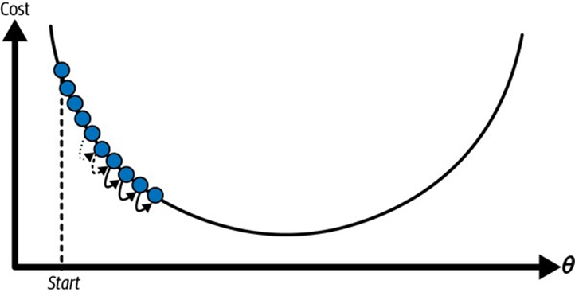
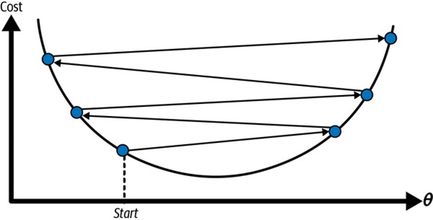
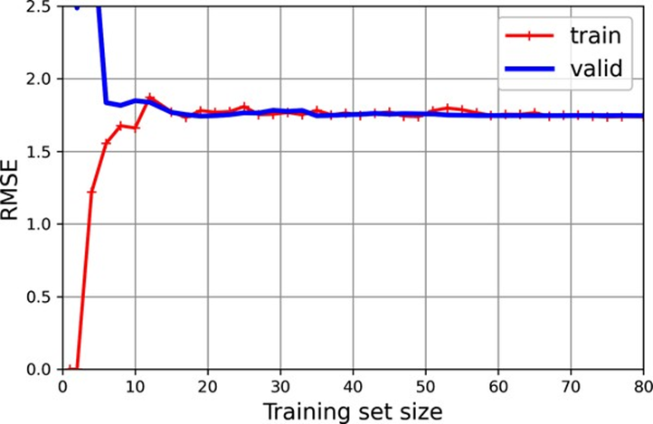
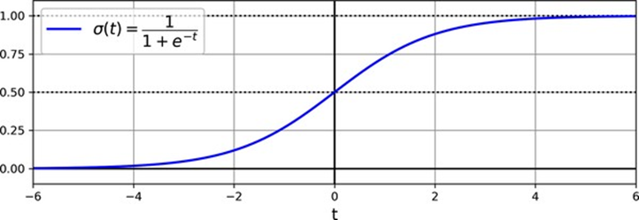

<!-- tabs:start -->

#### ** 📖 Lý thuyết **
# CHƯƠNG 4. HUẤN LUYỆN MÔ HÌNH

Cho đến nay, chúng ta đã coi các mô hình học máy và thuật toán huấn
luyện của chúng chủ yếu như “hộp đen”. Nếu bạn đã thực hiện một số bài tập
trong các chương trước, bạn có thể đã ngạc nhiên về mức độ bạn có thể làm được
mà không cần biết bất cứ điều gì về “những gì bên dưới”: bạn đã tối ưu hóa một
hệ thống hồi quy, cải thiện bộ phân loại hình ảnh chữ số, và thậm chí xây dựng
một bộ phân loại thư rác từ đầu, tất cả mà không biết chúng thực sự hoạt động
như thế nào. Thật vậy, trong nhiều tình huống, bạn thực sự không cần biết chi
tiết triển khai.


Tuy nhiên, việc hiểu rõ cách mọi thứ hoạt động có thể giúp bạn nhanh
chóng chọn được mô hình phù hợp, thuật toán huấn luyện đúng để sử dụng và một tập
hợp siêu tham số tốt cho tác vụ của bạn. Hiểu biết về “những gì bên dưới” cũng
sẽ giúp bạn gỡ lỗi các vấn đề và thực hiện phân tích lỗi hiệu q


uả hơn. Cuối cùng, hầu hết các chủ đề được thảo luận trong chương
này sẽ rất cần thiết để hiểu, xây dựng và huấn luyện mạng nơ-ron (được thảo luận
trong Phần II của cuốn sách này).


Trong chương này, chúng ta sẽ bắt đầu bằng cách xem xét mô hình hồi
quy tuyến tính, một trong những mô hình đơn giản nhất hiện có. Chúng ta sẽ thảo
luận hai cách rất khác nhau để huấn luyện nó:


·        
Sử dụng một phương trình “dạng
đóng” trực tiếp tính toán các tham số mô hình phù hợp nhất với tập huấn luyện
(tức là các tham số mô hình giảm thiểu hàm chi phí trên tập huấn luyện).


·        
Sử dụng một phương pháp tối ưu
hóa lặp lại được gọi là gradient descent (GD), dần dần điều chỉnh các
tham số mô hình để giảm thiểu hàm chi phí trên tập huấn luyện, cuối cùng hội tụ
đến cùng một tập hợp các tham số như phương pháp đầu tiên. Chúng ta sẽ xem xét
một vài biến thể của gradient descent mà chúng ta sẽ sử dụng lặp đi lặp lại khi
nghiên cứu mạng nơ-ron trong Phần II: GD theo lô (batch GD), GD theo mini-batch
và GD ngẫu nhiên (stochastic GD).


Tiếp theo, chúng ta sẽ xem xét hồi quy đa thức, một
mô hình phức tạp hơn có thể phù hợp với các tập dữ liệu phi tuyến tính. Vì mô
hình này có nhiều tham số hơn hồi quy tuyến tính, nó dễ bị quá khớp dữ liệu huấn
luyện hơn. Chúng ta sẽ khám phá cách phát hiện liệu điều này có phải là trường
hợp hay không bằng cách sử dụng các đường cong học tập, và sau đó chúng ta sẽ
xem xét một số kỹ thuật chính quy hóa có thể giảm nguy cơ quá khớp tập huấn luyện.


Cuối cùng, chúng ta sẽ xem xét hai mô hình nữa thường được sử dụng
cho các tác vụ phân loại: hồi quy logistic và hồi quy softmax.


### 4.1 Hồi quy tuyến tính

Trong Chương 1, chúng ta đã xem xét một mô hình hồi quy đơn giản về
sự hài lòng cuộc sống: life_satisfaction = θ0 + θ1 × GDP_per_capita Mô hình này chỉ là một hàm tuyến tính của đặc trưng đầu vào GDP_per_capita. θ0 và θ1 là các tham số của mô hình.


Tổng quát hơn, một mô hình tuyến tính đưa ra dự đoán bằng cách đơn
giản tính toán tổng có trọng số của các đặc trưng đầu vào, cộng với một hằng số
được gọi là hệ số chệch (bias term) (còn gọi là hệ số chặn (intercept
term)), như được hiển thị trong Phương trình 4-1.


Phương trình 4-1. Dự đoán mô hình hồi quy tuyến tính


Trong phương trình này:


·    


 là giá trị được dự đoán.


·     

 là số lượng đặc trưng.


·        


 là giá trị đặc trưng thứ 

 .


·        


 là tham số mô hình thứ 

, bao gồm hệ số chệch 

   và trọng số đặc trưng θ1, θ2, ⋯, θn.


·        
Điều này có thể được viết gọn
hơn nhiều bằng cách sử dụng dạng vector hóa, như được hiển thị trong Phương
trình 4-2.


Phương
trình 4-2. Dự đoán mô hình hồi quy tuyến tính (dạng vector hóa)


Trong
phương trình này:


·        


 là hàm giả thuyết, sử dụng các tham số mô hình


 .


·     

 là vector tham số của mô hình, bao gồm số hạng
độ lệch 

 và các trọng số đặc trưng từ 

 đến 

 .


·     

 là vector đặc trưng của một trường hợp
(instance), bao gồm các giá trị từ 

 đến 

 , với 

 luôn bằng 1.


·     

 là tích vô hướng (dot product) của hai vector 

 và 

 , bằng 

 .


OK, đó là mô hình hồi quy tuyến tính—nhưng làm thế
nào để chúng ta huấn luyện nó? Chà, hãy nhớ rằng huấn luyện một mô hình có
nghĩa là thiết lập các tham số của nó sao cho mô hình phù hợp nhất với tập huấn
luyện. Với mục đích này, trước tiên chúng ta cần một thước đo mức độ phù hợp
(hoặc không phù hợp) của mô hình với dữ liệu huấn luyện. Trong Chương 2, chúng
ta đã thấy rằng thước đo hiệu suất phổ biến nhất của một mô hình hồi quy là lỗi
trung bình bình phương gốc (RMSE) (Phương trình 2-1). Do đó, để huấn luyện một
mô hình hồi quy tuyến tính, chúng ta cần tìm giá trị của 

 làm giảm thiểu RMSE. Trong thực
tế, việc giảm thiểu lỗi trung bình bình phương (MSE) đơn giản hơn RMSE và nó dẫn
đến cùng một kết quả (vì giá trị giảm thiểu một hàm dương cũng giảm thiểu căn bậc
hai của nó).


MSE của một giả thuyết hồi quy tuyến tính 

 trên một tập huấn luyện 

 được tính bằng Phương trình
4-3.


Phương trình 4-3. Hàm chi phí MSE cho mô hình hồi quy tuyến tính


Hầu hết các ký hiệu này đã được trình bày trong Chương 2 (xem “Ký hiệu”).
Sự khác biệt duy nhất là chúng ta viết 

 thay vì chỉ 

 để làm rõ rằng mô hình được
tham số hóa bằng vector 

 . Để đơn giản hóa ký hiệu,
chúng ta sẽ chỉ viết 

 thay vì 

 .


#### 4.1.1 Phương trình chuẩn tắc

Để tìm giá trị của 

 làm giảm thiểu MSE, tồn tại một
nghiệm dạng đóng — nói cách khác, một phương trình toán học đưa ra kết quả trực
tiếp. Điều này được gọi là phương trình chuẩn tắc (Normal equation)
(Phương trình 4-4).


Phương trình 4-4. Phương trình chuẩn tắc


Hầu hết các ký hiệu này đã được trình bày trong Chương 2 (xem “Các
ký hiệu”). Điểm khác biệt duy nhất là chúng ta viết 

 thay vì chỉ 

 để làm rõ rằng mô hình được
tham số hóa bởi vector 

 . Để đơn giản hóa ký hiệu,
chúng ta sẽ chỉ viết 

 thay vì 

 .


Để tìm giá trị của 

 làm giảm thiểu MSE, có một
nghiệm dạng đóng (closed-form solution)—nói cách khác, một phương trình toán học
cho ra kết quả trực tiếp. Phương trình này được gọi là Phương trình chuẩn tắc
(Công thức 4-4).


Công thức 4-4: Phương trình chuẩn tắc


Trong phương trình này:


·    


 là giá trị của 

 làm giảm thiểu hàm chi phí.


·    
 

 là vector các giá trị mục
tiêu, chứa các giá trị từ 

 đến 

 .


Hãy tạo một số dữ liệu có dạng tuyến tính để kiểm
tra phương trình này (Hình 4-1):


```python
import numpy as np

np.random.seed(42) # to make this code example
reproducible
m = 100 # number of instances
X = 2 * np.random.rand(m, 1) # column vector
y = 4 + 3 * X + np.random.randn(m, 1) # column vector
```


*Hình 4-1. Một tập dữ liệu tuyến
tính được tạo ngẫu nhiên.*

Bây giờ chúng ta hãy tính 

 bằng Phương trình chuẩn tắc.
Chúng ta sẽ sử dụng hàm inv() từ mô-đun đại số tuyến tính của
NumPy (np.linalg) để tính nghịch đảo của một ma
trận, và phương thức dot() để nhân ma trận:


```python
from sklearn.preprocessing import
add_dummy_feature

X_b = add_dummy_feature(X) # add x0 = 1 to each
instance
theta_best = np.linalg.inv(X_b.T @ X_b) @ X_b.T @ y
```

Hàm mà chúng ta đã sử dụng để tạo dữ liệu là 

 . Hãy cùng xem phương trình
đã tìm được gì:


>>> theta_best array([[4.21509616], [2.77011339]])


Chúng ta đã kỳ vọng 

 và 

 , thay vì 

 và 

 . Kết quả khá gần, nhưng nhiễu
(noise) đã khiến chúng ta không thể khôi phục chính xác các tham số ban đầu của
hàm gốc. Tập dữ liệu càng nhỏ và nhiều nhiễu thì việc này càng khó.


Bây
giờ chúng ta có thể đưa ra các dự đoán bằng cách sử dụng 

:


```python
>>> X_new =
np.array([[0], [2]])
>>> X_new_b = add_dummy_feature(X_new) # add
x0 = 1 to each instance
>>> y_predict = X_new_b @ theta_best
>>> y_predict
array([[4.21509616],
      
[9.75532293]])
```

Hãy vẽ biểu đồ các dự đoán của mô hình này (Hình
4-2):


```python
import matplotlib.pyplot as plt

plt.plot(X_new, y_predict, "r-",
label="Predictions")
plt.plot(X, y, "b.")
# [...]  #
beautify the figure: add labels, axis, grid, and legend
plt.show()
```


*Hình 4-2. Dự đoán mô hình hồi
quy tuyến tính.*

Thực hiện hồi quy tuyến tính bằng Scikit-Learn
tương đối đơn giản:


```python
>>> from
sklearn.linear_model import LinearRegression
>>> lin_reg = LinearRegression()
>>> lin_reg.fit(X, y)
>>> lin_reg.intercept_, lin_reg.coef_
(array([4.21509616]), array([[2.77011339]]))
>>> lin_reg.predict(X_new)
array([[4.21509616],
      
[9.75532293]])
```

Lưu ý rằng Scikit-Learn tách biệt hệ số chệch (intercept_) khỏi trọng số đặc trưng (coef_). Lớp LinearRegression dựa trên hàm scipy.linalg.lstsq() (tên viết tắt của
“least squares”), mà bạn có thể gọi trực tiếp:


```python
>>> theta_best_svd,
residuals, rank, s = np.linalg.lstsq(X_b, y, rcond=1e-6)
>>> theta_best_svd
array([[4.21509616],
      
[2.77011339]])
```

Hàm này tính toán 

 , trong đó 

 là nghịch đảo giả
(pseudoinverse) của 

 (cụ thể là nghịch đảo
Moore-Penrose). Bạn có thể sử dụng np.linalg.pinv() để
tính toán nghịch đảo giả một cách trực tiếp.


```python
>>> np.linalg.pinv(X_b) @
y
array([[4.21509616],
      
[2.77011339]])
```

Nghịch đảo giả được tính bằng một kỹ thuật phân tách ma trận tiêu
chuẩn gọi là Phân tách giá trị suy biến (Singular Value Decomposition - SVD).
SVD có thể phân tách ma trận tập huấn luyện 

 thành tích của ba ma trận: 

 (xem numpy.linalg.svd()).


Nghịch đảo giả được tính bằng công thức 

 . Để tính ma trận 

 , thuật toán sẽ lấy ma trận 

 , đặt tất cả các giá trị nhỏ
hơn một ngưỡng nhỏ bằng 0, sau đó thay thế tất cả các giá trị khác 0 bằng nghịch
đảo của chúng, và cuối cùng chuyển vị ma trận kết quả. Phương pháp này hiệu quả
hơn việc tính Phương trình chuẩn tắc, đồng thời xử lý tốt các trường hợp đặc biệt.
Thật vậy, Phương trình chuẩn tắc có thể không hoạt động nếu ma trận 

 không khả nghịch (chẳng hạn
như khi 

 hoặc một số đặc trưng bị thừa),
nhưng nghịch đảo giả luôn được xác định.


#### 4.1.2 Độ phức tạp tính toán

Phương trình chuẩn tắc tính nghịch đảo của 

 , một ma trận 

 (trong đó 

 là số đặc trưng). Độ phức
tạp tính toán của việc nghịch đảo một ma trận như vậy thường là khoảng 

 đến 

 , tùy thuộc vào cách triển
khai. Nói cách khác, nếu bạn tăng gấp đôi số đặc trưng, thời gian tính toán sẽ
tăng lên khoảng 

 đến 

 lần.


Cách tiếp cận SVD được sử dụng bởi Scikit-Learn's
LinearRegression có độ phức tạp khoảng 

 . Nếu bạn tăng gấp đôi số đặc
trưng, thời gian tính toán sẽ tăng lên khoảng 4 lần


Ngoài ra, một khi bạn đã huấn luyện mô hình hồi quy tuyến tính của
mình (bằng cách sử dụng Phương trình chuẩn tắc hoặc bất kỳ thuật toán nào
khác), các dự đoán rất nhanh: độ phức tạp tính toán là tuyến tính đối với cả số
lượng trường hợp bạn muốn đưa ra dự đoán và số lượng đặc trưng. Nói cách khác,
việc đưa ra dự đoán trên số lượng trường hợp gấp đôi (hoặc số lượng đặc trưng gấp
đôi) sẽ mất khoảng thời gian gấp đôi.


Bây giờ chúng ta sẽ xem xét một cách rất khác để huấn luyện mô hình
hồi quy tuyến tính, phù hợp hơn cho các trường hợp có số lượng đặc trưng lớn hoặc
quá nhiều trường hợp huấn luyện không thể nằm vừa trong bộ nhớ.


### 4.2 Gradient Descent

Gradient descent là một thuật toán tối ưu hóa chung có khả năng tìm
ra các giải pháp tối ưu cho nhiều vấn đề khác nhau. Ý tưởng chung của gradient
descent là điều chỉnh các tham số lặp đi lặp lại để giảm thiểu một hàm chi phí.


Giả sử bạn bị lạc trong núi trong một lớp sương mù dày đặc, và bạn
chỉ có thể cảm nhận độ dốc của mặt đất dưới chân mình. Một chiến lược tốt để xuống
đáy thung lũng nhanh chóng là đi xuống dốc theo hướng dốc nhất. Đây chính xác
là những gì gradient descent làm: nó đo gradient cục bộ của hàm lỗi đối với
vector tham số 

, và nó đi theo hướng gradient giảm dần. Khi gradient bằng 0, bạn đã
đạt đến một cực tiểu!


Trong thực tế, bạn bắt đầu bằng cách điền các giá trị ngẫu nhiên vào


(điều này được gọi là khởi tạo ngẫu nhiên). Sau đó, bạn cải thiện nó
dần dần, từng bước nhỏ, mỗi bước cố gắng giảm hàm chi phí (ví dụ: MSE), cho đến
khi thuật toán hội tụ đến một cực tiểu (xem Hình 4-3).


*Hình 4-3. Trong mô tả
gradient descent này, các tham số mô hình được khởi tạo ngẫu nhiên và được điều
chỉnh lặp đi lặp lại để giảm thiểu hàm chi phí; kích thước bước học tỷ lệ thuận
với độ dốc của hàm chi phí, vì vậy các bước dần dần nhỏ hơn khi chi phí tiến gần
đến cực tiểu.*

Một tham số quan trọng trong gradient descent là kích thước của các
bước, được xác định bởi siêu tham số tốc độ học (learning rate). Nếu tốc độ học
quá nhỏ, thì thuật toán sẽ phải trải qua nhiều lần lặp để hội tụ, điều này sẽ mất
nhiều thời gian (xem Hình 4-4).





*Hình 4-4. Tốc độ học quá nhỏ.*

Mặt khác, nếu tốc độ học quá cao, bạn có thể nhảy qua thung lũng và
kết thúc ở phía bên kia, thậm chí có thể cao hơn bạn trước đó. Điều này có thể
khiến thuật toán phân kỳ, với các giá trị ngày càng lớn hơn, không tìm được giải
pháp tốt (xem Hình 4-5).





*Hình 4-5. Tốc độ học quá cao.*

Ngoài ra, không phải tất cả các hàm chi phí đều trông giống như những
cái bát đẹp, đều đặn. Có thể có các lỗ, rãnh, cao nguyên và đủ loại địa hình
không đều, khiến việc hội tụ đến cực tiểu trở nên khó khăn. Hình 4-6 cho thấy
hai thách thức chính với gradient descent. Nếu khởi tạo ngẫu nhiên bắt đầu thuật
toán ở bên trái, thì nó sẽ hội tụ đến một cực tiểu cục bộ, không tốt bằng cực
tiểu toàn cục. Nếu nó bắt đầu ở bên phải, thì nó sẽ mất rất nhiều thời gian để
vượt qua cao nguyên. Và nếu bạn dừng quá sớm, bạn sẽ không bao giờ đạt đến cực
tiểu toàn cục.


*Hình 4-6. Những cạm bẫy của
gradient descent.*

May mắn thay, hàm chi phí MSE cho mô hình hồi quy tuyến tính tình cờ
là một hàm lồi (convex function), điều đó có nghĩa là nếu bạn chọn bất kỳ hai
điểm nào trên đường cong, đoạn thẳng nối chúng sẽ không bao giờ nằm dưới đường
cong. Điều này ngụ ý rằng không có cực tiểu cục bộ nào, chỉ có một cực tiểu
toàn cục. Nó cũng là một hàm liên tục với độ dốc không bao giờ thay đổi đột ngột.
Hai sự thật này có một hệ quả lớn: gradient descent được đảm bảo sẽ tiến gần một
cách tùy ý đến cực tiểu toàn cục (nếu bạn đợi đủ lâu và nếu tốc độ học không
quá cao).


Trong khi hàm chi phí có hình dạng một cái bát, nó có thể là một cái
bát kéo dài nếu các đặc trưng có các thang đo rất khác nhau. Hình 4-7 cho thấy
gradient descent trên một tập huấn luyện nơi đặc trưng 1 và 2 có cùng thang đo
(bên trái), và trên một tập huấn luyện nơi đặc trưng 1 có giá trị nhỏ hơn nhiều
so với đặc trưng 2 (bên phải).


*Hình 4-7. Gradient descent có
(trái) và không có (phải) điều chỉnh đặc trưng.*

Như bạn có thể thấy, ở bên trái thuật toán gradient descent đi thẳng
về phía cực tiểu, do đó đạt được nó nhanh chóng, trong khi ở bên phải, nó ban đầu
đi theo hướng gần như trực giao với hướng của cực tiểu toàn cục, và kết thúc bằng
một hành trình dài xuống một thung lũng gần như phẳng. Cuối cùng nó sẽ đạt đến
cực tiểu, nhưng sẽ mất nhiều thời gian.


Biểu đồ này cũng minh họa thực tế là việc huấn luyện một mô hình có
nghĩa là tìm kiếm một sự kết hợp các tham số mô hình làm giảm thiểu một hàm chi
phí (trên tập huấn luyện). Đây là một tìm kiếm trong không gian tham số của mô
hình. Mô hình càng có nhiều tham số, không gian này càng có nhiều chiều, và việc
tìm kiếm càng khó khăn hơn: tìm kim trong đống rơm 300 chiều khó hơn nhiều so với
trong 3 chiều. May mắn thay, vì hàm chi phí là lồi trong trường hợp hồi quy tuyến
tính, kim chỉ đơn giản nằm ở đáy cái bát.


#### 4.2.1 Gradient Descent theo lô

Để triển khai gradient descent, bạn cần tính toán gradient của hàm
chi phí đối với từng tham số mô hình 

  . Nói cách khác, bạn cần tính toán hàm chi phí
sẽ thay đổi bao nhiêu nếu bạn thay đổi 

 một chút. Đây được gọi là đạo
hàm riêng (partial derivative). Nó giống như hỏi, “Độ dốc của ngọn núi dưới
chân tôi là bao nhiêu nếu tôi đối mặt về phía đông”? và sau đó hỏi cùng câu hỏi
khi đối mặt về phía bắc (và cứ thế cho tất cả các chiều khác, nếu bạn có thể tưởng
tượng một vũ trụ có nhiều hơn ba chiều). Phương trình 4-5 tính toán đạo hàm
riêng của MSE đối với tham số 

  , được ký hiệu là 

.


Phương trình 4-5. Đạo hàm riêng của hàm chi phí


Thay vì tính toán các đạo hàm riêng này một cách riêng lẻ, bạn có thể
sử dụng Phương trình 4-6 để tính toán tất cả chúng cùng một lúc. Vector
gradient, được ký hiệu là 

 , chứa tất cả các đạo hàm
riêng của hàm chi phí (một cho mỗi tham số mô hình).


Phương trình 4-6. Vector gradient của hàm chi phí


Công thức 4-5: Đạo hàm riêng của hàm chi phí


Thay vì tính các đạo hàm riêng này một cách riêng
lẻ, bạn có thể sử dụng Công thức 4-6 để tính tất cả cùng một lúc. Vector
gradient, được ký hiệu là 

 , chứa tất cả các đạo hàm
riêng của hàm chi phí (mỗi đạo hàm tương ứng với một tham số mô hình).


Phương trình 4-7. Bước gradient descent


Một khi bạn có vector gradient, nó sẽ chỉ theo hướng dốc lên. Để đi
xuống, bạn chỉ cần đi theo hướng ngược lại. Điều này có nghĩa là bạn sẽ trừ 

 khỏi 

 . Đây là lúc tốc độ học 

 (eta) phát huy tác dụng: nhân
vector gradient với 

 để xác định kích thước của bước
đi xuống (Công thức 4-7).


Công thức 4-7: Bước hạ Gradient


Hãy xem một cách triển khai nhanh chóng của thuật toán này:


```python
eta = 0.1 # learning rate
n_epochs = 1000
m = len(X_b) # number of instances

np.random.seed(42)
theta = np.random.randn(2, 1) # randomly initialized
model parameters

for epoch in range(n_epochs):
    gradients =
2 / m * X_b.T @ (X_b @ theta - y)
    theta =
theta - eta * gradients
```

Không quá khó! Mỗi lần lặp trên tập huấn luyện được
gọi là một epoch. Hãy xem kết quả theta:


```python
>>> theta
array([[4.21509616],
      
[2.77011339]])
```

Này, đó chính xác là những gì Phương trình chuẩn
tắc tìm thấy! Gradient descent hoạt động hoàn hảo. Nhưng điều gì sẽ xảy ra nếu
bạn sử dụng một tốc độ học khác (


eta)? Hình 4-8 cho thấy 20 bước đầu tiên
của gradient descent sử dụng ba tốc độ học khác nhau. Đường ở dưới cùng của mỗi
biểu đồ đại diện cho điểm bắt đầu ngẫu nhiên, sau đó mỗi epoch được biểu diễn bằng
một đường ngày càng tối hơn.


*Hình 4-8. Gradient descent với
các tốc độ học khác nhau.*

Ở bên trái, tốc độ học quá thấp: thuật toán cuối cùng sẽ đạt được giải
pháp, nhưng sẽ mất nhiều thời gian. Ở giữa, tốc độ học trông khá tốt: chỉ trong
vài epoch, nó đã hội tụ đến giải pháp. Ở bên phải, tốc độ học quá cao: thuật
toán phân kỳ, nhảy loạn xạ và thực sự ngày càng rời xa giải pháp ở mỗi bước.


Để tìm một tốc độ học tốt, bạn có thể sử dụng tìm kiếm lưới (xem
Chương 2). Tuy nhiên, bạn có thể muốn giới hạn số epoch để tìm kiếm lưới có thể
loại bỏ các mô hình mất quá nhiều thời gian để hội tụ.


Bạn có thể tự hỏi làm thế nào để đặt số epoch. Nếu nó quá thấp, bạn
sẽ vẫn còn cách xa giải pháp tối ưu khi thuật toán dừng lại; nhưng nếu nó quá
cao, bạn sẽ lãng phí thời gian trong khi các tham số mô hình không còn thay đổi
nữa. Một giải pháp đơn giản là đặt một số lượng epoch rất lớn nhưng ngắt thuật
toán khi vector gradient trở nên rất nhỏ — tức là khi chuẩn của nó trở nên nhỏ
hơn một số rất nhỏ 

 (được gọi là độ dung sai) — bởi
vì điều này xảy ra khi gradient descent đã (gần như) đạt đến cực tiểu.


#### 4.2.2 Gradient Descent ngẫu nhiên

Vấn đề chính với gradient descent theo lô là nó sử dụng toàn bộ tập
huấn luyện để tính toán gradient ở mỗi bước, điều này khiến nó rất chậm khi tập
huấn luyện lớn. Ở thái cực đối lập, gradient descent ngẫu nhiên (stochastic
gradient descent) chọn một trường hợp ngẫu nhiên trong tập huấn luyện ở mỗi bước
và tính toán gradient chỉ dựa trên trường hợp đó. Rõ ràng, việc làm việc trên một
trường hợp tại một thời điểm làm cho thuật toán nhanh hơn nhiều vì nó có rất ít
dữ liệu để thao tác ở mỗi lần lặp. Nó cũng giúp có thể huấn luyện trên các tập
huấn luyện khổng lồ, vì chỉ cần một trường hợp nằm trong bộ nhớ ở mỗi lần lặp
(GD ngẫu nhiên có thể được triển khai như một thuật toán out-of-core; xem
Chương 1).


Mặt khác, do tính chất ngẫu nhiên của nó, thuật toán này ít đều đặn
hơn nhiều so với gradient descent theo lô: thay vì giảm dần nhẹ nhàng cho đến
khi đạt đến cực tiểu, hàm chi phí sẽ dao động lên xuống, chỉ giảm trung bình.
Theo thời gian, nó sẽ tiến rất gần đến cực tiểu, nhưng một khi đã đến đó, nó sẽ
tiếp tục dao động xung quanh, không bao giờ ổn định (xem Hình 4-9). Khi thuật
toán dừng lại, các giá trị tham số cuối cùng sẽ tốt, nhưng không tối ưu.


*Hình 4-9. Với stochastic
gradient descent, mỗi bước huấn luyện nhanh hơn nhiều nhưng cũng ngẫu nhiên hơn
nhiều so với khi sử dụng batch gradient descent.*

Khi hàm chi phí rất không đều (như trong Hình 4-6), điều này thực sự
có thể giúp thuật toán thoát khỏi các cực tiểu cục bộ, vì vậy gradient descent
ngẫu nhiên có cơ hội tìm thấy cực tiểu toàn cục tốt hơn so với gradient descent
theo lô.


Do đó, tính ngẫu nhiên là tốt để thoát khỏi các cực tiểu cục bộ,
nhưng xấu vì nó có nghĩa là thuật toán không bao giờ có thể ổn định ở cực tiểu.
Một giải pháp cho tình huống khó xử này là giảm dần tốc độ học. Các bước bắt đầu
lớn (giúp tiến bộ nhanh chóng và thoát khỏi các cực tiểu cục bộ), sau đó ngày
càng nhỏ hơn, cho phép thuật toán ổn định ở cực tiểu toàn cục. Quá trình này giống
như mô phỏng ủ kim loại, một thuật toán lấy cảm hứng từ quá trình ủ kim loại,
nơi kim loại nóng chảy được làm nguội từ từ. Hàm xác định tốc độ học ở mỗi lần
lặp được gọi là lịch học. Nếu tốc độ học giảm quá nhanh, bạn có thể bị kẹt
trong một cực tiểu cục bộ, hoặc thậm chí bị đóng băng giữa chừng đến cực tiểu.
Nếu tốc độ học giảm quá chậm, bạn có thể nhảy xung quanh cực tiểu trong một thời
gian dài và kết thúc với một giải pháp không tối ưu nếu bạn dừng huấn luyện quá
sớm.


Đoạn mã này triển khai gradient descent ngẫu nhiên bằng cách sử dụng
một lịch học đơn giản:


```python
n_epochs = 50
t0, t1 = 5, 50 # learning schedule hyperparameters

def learning_schedule(t):
    return t0 /
(t + t1)

np.random.seed(42)
theta = np.random.randn(2, 1) # random initialization

for epoch in range(n_epochs):
    for
iteration in range(m):
       
random_index = np.random.randint(m)
        xi =
X_b[random_index : random_index + 1]
        yi =
y[random_index : random_index + 1]
       
gradients = 2 * xi.T @ (xi @ theta - yi) # for SGD, do not divide by m
        eta =
learning_schedule(epoch * m + iteration)
        theta =
theta - eta * gradients
```

Theo quy ước, chúng ta lặp theo các vòng lặp 

 lần lặp; mỗi vòng lặp được gọi
là một epoch, như trước. Trong khi mã gradient descent theo lô lặp 1.000 lần
qua toàn bộ tập huấn luyện, mã này chỉ đi qua tập huấn luyện 50 lần và đạt được
một giải pháp khá tốt:


```python
>>> theta
array([[4.21076011],
      
[2.74856079]])
```


![Hình 4-10 cho thấy 20 bước huấn luyện đầu tiên
(lưu ý các bước không đều đặn như thế nào). Lưu ý rằng vì các trường hợp được
chọn ngẫu nhiên, một số trường hợp có thể được chọn nhiều lần trong một epoch,
trong khi những trường hợp khác có thể không được chọn. Nếu bạn muốn đảm bảo rằng
thuật toán đi qua mọi trường hợp trong mỗi epoch, một cách tiếp cận khác là xáo
trộn tập huấn luyện (đảm bảo xáo trộn đồng thời các đặc trưng đầu vào và nhãn),
sau đó đi qua từng trường hợp, sau đó xáo trộn lại, v.v. Tuy nhiên, cách tiếp cận
này phức tạp hơn và nói chung không cải thiện kết quả.](../Figures/CH04/Hinh_4-10.png)


*Hình 4-10 cho thấy 20 bước huấn luyện đầu tiên
(lưu ý các bước không đều đặn như thế nào). Lưu ý rằng vì các trường hợp được
chọn ngẫu nhiên, một số trường hợp có thể được chọn nhiều lần trong một epoch,
trong khi những trường hợp khác có thể không được chọn. Nếu bạn muốn đảm bảo rằng
thuật toán đi qua mọi trường hợp trong mỗi epoch, một cách tiếp cận khác là xáo
trộn tập huấn luyện (đảm bảo xáo trộn đồng thời các đặc trưng đầu vào và nhãn),
sau đó đi qua từng trường hợp, sau đó xáo trộn lại, v.v. Tuy nhiên, cách tiếp cận
này phức tạp hơn và nói chung không cải thiện kết quả.*


*Hình 4-10. 20 bước đầu tiên của
stochastic gradient descent.*

Để thực hiện hồi quy tuyến tính bằng SGD với Scikit-Learn, bạn có thể
sử dụng lớp SGDRegressor, mặc định sẽ tối ưu hóa hàm
chi phí MSE. Đoạn mã sau chạy tối đa 1.000 epoch (max_iter) hoặc cho đến khi lỗi giảm xuống dưới 10^-5 (tol) trong 100 epoch (n_iter_no_change). Nó bắt đầu với tốc độ
học là 0.01 (eta0), sử dụng lịch học mặc định (khác với
lịch chúng ta đã sử dụng). Cuối cùng, nó không sử dụng bất kỳ chính quy hóa nào
(penalty=None; chi tiết hơn về điều này sẽ sớm được đề cập):


```python
from sklearn.linear_model import
SGDRegressor

sgd_reg = SGDRegressor(max_iter=1000, tol=1e-5,
penalty=None, eta0=0.01,
                      
n_iter_no_change=100, random_state=42)
sgd_reg.fit(X, y.ravel()) # y.ravel() because fit()
expects 1D targets
```

Một lần nữa, bạn tìm thấy một giải pháp khá gần với
giải pháp được trả về bởi phương trình chuẩn tắc:


```python
>>> sgd_reg.intercept_,
sgd_reg.coef_
(array([4.21278812]), array([2.77270267]))
```


#### 4.2.3 Gradient Descent theo Mini-Batch

Thuật toán gradient descent cuối cùng mà chúng ta
sẽ xem xét được gọi là gradient descent theo mini-batch. Nó khá đơn giản một
khi bạn đã hiểu gradient descent theo lô và ngẫu nhiên: ở mỗi bước, thay vì
tính toán gradient dựa trên toàn bộ tập huấn luyện (như trong GD theo lô) hoặc
chỉ dựa trên một trường hợp (như trong GD ngẫu nhiên), GD theo mini-batch tính
toán gradient trên các tập hợp nhỏ ngẫu nhiên các trường hợp được gọi là
mini-batch. Ưu điểm chính của GD theo mini-batch so với GD ngẫu nhiên là bạn có
thể tăng hiệu suất từ việc tối ưu hóa phần cứng của các phép toán ma trận, đặc
biệt khi sử dụng GPU.


Sự tiến bộ của thuật toán trong không gian tham số ít thất thường
hơn so với GD ngẫu nhiên, đặc biệt với các mini-batch khá lớn. Kết quả là, GD
theo mini-batch sẽ đi lại gần cực tiểu hơn một chút so với GD ngẫu nhiên—nhưng
nó có thể khó thoát khỏi các cực tiểu cục bộ hơn (trong trường hợp các vấn đề gặp
phải cực tiểu cục bộ, không giống như hồi quy tuyến tính với hàm chi phí MSE).
Hình 4-11 cho thấy các đường đi của ba thuật toán gradient descent trong không
gian tham số trong quá trình huấn luyện. Chúng đều kết thúc gần cực tiểu, nhưng
đường đi của GD theo lô thực sự dừng ở cực tiểu, trong khi cả GD ngẫu nhiên và
GD theo mini-batch tiếp tục đi lại xung quanh. Tuy nhiên, đừng quên rằng GD
theo lô mất rất nhiều thời gian để thực hiện mỗi bước, và GD ngẫu nhiên và GD
theo mini-batch cũng sẽ đạt đến cực tiểu nếu bạn sử dụng một lịch học tốt.


*Hình 4-11. Đường đi của
Gradient Descent trong không gian tham số.*

Bảng 4-1 so sánh các thuật toán chúng ta đã thảo luận cho đến nay
cho hồi quy tuyến tính (hãy nhớ rằng 

 là số lượng trường hợp huấn
luyện và 

 là số lượng đặc trưng).


Bảng 4-1. So sánh các thuật toán cho hồi quy tuyến tính


| Thuật toán | Lớn | Hỗ trợ ngoài lõi | Lớn | Siêu tham số | Yêu cầu điều chỉnh tỉ lệ | SciPy |
|---|---|---|---|---|---|---|
| Phương trình chuẩn tắc | Nhanh | Không | Chậm | 0 | Không | N/A |
| SVD | Nhanh | Không | Chậm | 0 | Không | Lin |
| GD theo lô | Chậm | Không | Nhanh | 2 | Có | N/A |
| GD ngẫu nhiên | Nhanh | Có | Nhanh |  | Có | SGD |
| GD theo mini-batch | Nhanh | Có | Nhanh |  | Có | N/A |


Sau khi huấn luyện, hầu như không có sự khác biệt: tất cả các thuật
toán này đều tạo ra các mô hình rất giống nhau và đưa ra dự đoán theo cùng một
cách.


### 4.3 Hồi quy đa thức

Điều gì sẽ xảy ra nếu dữ liệu của bạn phức tạp hơn một đường thẳng?
Thật đáng ngạc nhiên, bạn có thể sử dụng một mô hình tuyến tính để phù hợp với
dữ liệu phi tuyến tính. Một cách đơn giản để làm điều này là thêm các lũy thừa
của mỗi đặc trưng làm đặc trưng mới, sau đó huấn luyện một mô hình tuyến tính
trên tập đặc trưng mở rộng này. Kỹ thuật này được gọi là hồi quy đa thức.


Hãy xem một ví dụ. Đầu tiên, chúng ta sẽ tạo một số dữ liệu phi tuyến
tính (xem Hình 4-12), dựa trên một phương trình bậc hai đơn giản—đó là một
phương trình có dạng 

 —cộng thêm một số nhiễu:


```python
np.random.seed(42)
m = 100
X = 6 * np.random.rand(m, 1) - 3
y = 0.5 * X ** 2 + X + 2 + np.random.randn(m, 1)
```


*Hình 4-12. Tập dữ liệu phi
tuyến tính và nhiễu được tạo.*

Rõ ràng, một đường thẳng sẽ không bao giờ phù hợp với dữ liệu này một
cách chính xác. Vì vậy, hãy sử dụng lớp PolynomialFeatures của
Scikit-Learn để biến đổi dữ liệu huấn luyện của chúng ta, thêm bình phương (đa
thức bậc hai) của mỗi đặc trưng trong tập huấn luyện làm đặc trưng mới (trong
trường hợp này chỉ có một đặc trưng):


```python
from sklearn.preprocessing import
PolynomialFeatures

poly_features = PolynomialFeatures(degree=2,
include_bias=False)
X_poly = poly_features.fit_transform(X)
>>> X[0]
array([-0.75275929])

>>> X_poly[0]
array([-0.75275929, 
0.56664654])
```

X_poly bây giờ chứa đặc
trưng gốc của X cộng với bình phương của đặc trưng
này. Bây giờ chúng ta có thể điều chỉnh mô hình LinearRegression cho dữ liệu huấn luyện mở rộng này (Hình 4-13):


```python
from sklearn.linear_model import
LinearRegression

lin_reg = LinearRegression()
lin_reg.fit(X_poly, y)
>>> lin_reg.intercept_, lin_reg.coef_
(array([1.78134581]), array([[0.93366893,
0.56456263]]))
```


*Hình 4-13. Dự đoán mô hình hồi
quy đa thức.*

Không tệ: mô hình ước tính 

 trong khi hàm gốc thực tế là 

 . Lưu ý rằng khi có nhiều đặc
trưng, hồi quy đa thức có khả năng tìm ra mối quan hệ giữa các đặc trưng, điều
mà mô hình hồi quy tuyến tính thông thường không thể làm được. Điều này có thể
thực hiện được nhờ việc PolynomialFeatures cũng thêm tất cả các
sự kết hợp của các đặc trưng lên đến bậc đã cho. Ví dụ, nếu có hai đặc trưng 

 và 

 , PolynomialFeatures với degree=3 sẽ không chỉ thêm các đặc trưng


 , mà còn cả các sự kết hợp 

 .


### 4.4 Đường cong học tập

Nếu bạn thực hiện hồi quy đa thức bậc cao, bạn có thể sẽ khớp dữ liệu
huấn luyện tốt hơn nhiều so với hồi quy tuyến tính thông thường. Ví dụ, Hình
4-14 áp dụng mô hình đa thức bậc 300 cho dữ liệu huấn luyện trước đó, và so
sánh kết quả với một mô hình tuyến tính thuần túy và một mô hình bậc hai (đa thức
bậc hai). Lưu ý cách mô hình đa thức bậc 300 uốn lượn để gần nhất có thể với
các trường hợp huấn luyện.


*Hình 4-14. Hồi quy đa thức bậc
cao.*

Mô hình hồi quy đa thức bậc cao này đang quá khớp dữ liệu huấn luyện
một cách nghiêm trọng, trong khi mô hình tuyến tính đang dưới khớp. Mô hình sẽ
tổng quát hóa tốt nhất trong trường hợp này là mô hình bậc hai, điều này có lý
vì dữ liệu được tạo ra bằng một mô hình bậc hai. Nhưng nói chung bạn sẽ không
biết hàm nào đã tạo ra dữ liệu, vậy làm thế nào bạn có thể quyết định mô hình của
mình nên phức tạp đến mức nào? Làm thế nào bạn có thể biết mô hình của mình
đang quá khớp hay dưới khớp dữ liệu?


Trong Chương 2, bạn đã sử dụng kiểm định chéo để có được ước tính hiệu
suất tổng quát hóa của một mô hình. Nếu một mô hình hoạt động tốt trên dữ liệu
huấn luyện nhưng tổng quát hóa kém theo các chỉ số kiểm định chéo, thì mô hình
của bạn đang quá khớp. Nếu nó hoạt động kém trên cả hai, thì nó đang dưới khớp.
Đây là một cách để biết khi nào một mô hình quá đơn giản hoặc quá phức tạp.


Một cách khác để nhận biết là nhìn vào các đường cong học tập, là
các biểu đồ thể hiện lỗi huấn luyện và lỗi xác thực của mô hình dưới dạng hàm của
lần lặp huấn luyện: chỉ cần đánh giá mô hình theo các khoảng đều đặn trong quá
trình huấn luyện trên cả tập huấn luyện và tập xác thực, và vẽ biểu đồ kết quả.
Nếu mô hình không thể được huấn luyện tăng dần (tức là nếu nó không hỗ trợ partial_fit() hoặc warm_start), thì bạn phải huấn luyện nó
nhiều lần trên các tập con tăng dần của tập huấn luyện.


Scikit-Learn có một hàm learning_curve() hữu
ích để giúp với điều này: nó huấn luyện và đánh giá mô hình bằng cách sử dụng
kiểm định chéo. Theo mặc định, nó huấn luyện lại mô hình trên các tập con đang
tăng dần của tập huấn luyện, nhưng nếu mô hình hỗ trợ học tăng dần, bạn có thể
đặt exploit_incremental_learning=True khi gọi
learning_curve() và nó sẽ huấn luyện mô hình tăng dần thay vào đó. Hàm này trả về
kích thước tập huấn luyện mà nó đã đánh giá mô hình, và các điểm huấn luyện và
xác thực mà nó đã đo cho mỗi kích thước và cho mỗi fold kiểm định chéo. Hãy sử
dụng hàm này để xem các đường cong học tập của mô hình hồi quy tuyến tính thông
thường (xem Hình 4-15):


```python
from sklearn.model_selection
import learning_curve
from sklearn.linear_model import LinearRegression #
Import LinearRegression
import matplotlib.pyplot as plt # Import
matplotlib.pyplot
import numpy as np # Import numpy

train_sizes, train_scores, valid_scores =
learning_curve(
   
LinearRegression(), X, y, train_sizes=np.linspace(0.01, 1.0, 40), cv=5,
   
scoring="neg_root_mean_squared_error")
train_errors = -train_scores.mean(axis=1)
valid_errors = -valid_scores.mean(axis=1)

plt.plot(train_sizes, train_errors, "r-+",
linewidth=2, label="train")
plt.plot(train_sizes, valid_errors, "b-",
linewidth=3, label="valid")
# [...] # beautify the figure: add labels, axis,
grid, and legend
plt.show()
```





*Hình 4-15. Đường cong học tập.*

Mô hình này đang bị dưới khớp. Để hiểu tại sao, trước tiên hãy nhìn
vào lỗi huấn luyện. Khi chỉ có một hoặc hai trường hợp trong tập huấn luyện, mô
hình có thể khớp chúng hoàn hảo, đó là lý do tại sao đường cong bắt đầu từ 0.
Nhưng khi các trường hợp mới được thêm vào tập huấn luyện, mô hình không thể khớp
dữ liệu huấn luyện một cách hoàn hảo, cả vì dữ liệu nhiễu và vì nó không hề tuyến
tính. Vì vậy, lỗi trên dữ liệu huấn luyện tăng lên cho đến khi đạt đến một cao
nguyên, tại thời điểm đó việc thêm các trường hợp mới vào tập huấn luyện không
làm cho lỗi trung bình tốt hơn hoặc tệ hơn nhiều. Bây giờ hãy nhìn vào lỗi xác thực.
Khi mô hình được huấn luyện trên rất ít trường hợp huấn luyện, nó không có khả
năng tổng quát hóa đúng cách, đó là lý do tại thái lỗi xác thực ban đầu khá lớn.
Sau đó, khi mô hình được hiển thị nhiều ví dụ huấn luyện hơn, nó học, và do đó
lỗi xác thực dần dần giảm xuống. Tuy nhiên, một lần nữa một đường thẳng không
thể làm tốt việc mô hình hóa dữ liệu, vì vậy lỗi kết thúc ở một cao nguyên, rất
gần với đường cong kia.


Các đường cong học tập này điển hình cho một mô hình đang dưới khớp.
Cả hai đường cong đều đã đạt đến một cao nguyên; chúng gần nhau và khá cao.


Bây giờ chúng ta hãy nhìn vào các đường cong học tập của mô hình đa
thức bậc 10 trên cùng dữ liệu (Hình 4-16):


```python
from sklearn.pipeline import
make_pipeline
from sklearn.preprocessing import PolynomialFeatures
# Import PolynomialFeatures
from sklearn.linear_model import LinearRegression #
Import LinearRegression

polynomial_regression = make_pipeline(
   
PolynomialFeatures(degree=10, include_bias=False),
   
LinearRegression())

train_sizes, train_scores, valid_scores =
learning_curve(
   
polynomial_regression, X, y, train_sizes=np.linspace(0.01, 1.0, 40),
cv=5,
   
scoring="neg_root_mean_squared_error")
# [...] # same as earlier
```


*Hình 4-16. Đường cong học tập
cho mô hình đa thức bậc 10.*

Những đường cong học tập này trông hơi giống những đường cong trước,
nhưng có hai điểm khác biệt rất quan trọng:


·        
Lỗi trên dữ liệu huấn luyện thấp
hơn nhiều so với trước đây.


·        
Có một khoảng cách giữa các đường
cong. Điều này có nghĩa là mô hình hoạt động tốt hơn đáng kể trên dữ liệu huấn
luyện so với dữ liệu xác thực, đây là đặc điểm của một mô hình quá khớp. Tuy
nhiên, nếu bạn sử dụng một tập huấn luyện lớn hơn nhiều, hai đường cong sẽ tiếp
tục gần nhau hơn.


Sự đánh đổi giữa độ chệch/phương sai Một kết quả lý thuyết quan trọng của thống kê và học máy là thực tế
lỗi tổng quát hóa của một mô hình có thể được biểu diễn dưới dạng tổng của ba
loại lỗi rất khác nhau:


·        
Độ chệch (Bias) Phần lỗi tổng quát hóa này là do các giả định sai, chẳng hạn như giả
định rằng dữ liệu là tuyến tính khi thực tế nó là bậc hai. Một mô hình có độ chệch
cao rất có khả năng dưới khớp dữ liệu huấn luyện.


·        
Phương sai (Variance) Phần này là do mô hình quá nhạy cảm với những biến đổi nhỏ trong dữ
liệu huấn luyện. Một mô hình có nhiều bậc tự do (chẳng hạn như mô hình đa thức
bậc cao) có khả năng có phương sai cao và do đó quá khớp dữ liệu huấn luyện.


·        
Lỗi không thể giảm
(Irreducible error) Phần này là do tính nhiễu của
chính dữ liệu. Cách duy nhất để giảm phần lỗi này là làm sạch dữ liệu (ví dụ: sửa
các nguồn dữ liệu, chẳng hạn như cảm biến bị hỏng, hoặc phát hiện và loại bỏ
các giá trị ngoại lai).


Tăng độ phức tạp của mô hình thường sẽ làm tăng
phương sai và giảm độ chệch của nó. Ngược lại, giảm độ phức tạp của mô hình sẽ
làm tăng độ chệch và giảm phương sai của nó. Đây là lý do tại sao nó được gọi
là một sự đánh đổi.


### 4.5 Mô hình tuyến tính được chính quy hóa

Như bạn đã thấy trong Chương 1 và 2, một cách tốt để giảm quá khớp
là chính quy hóa mô hình (tức là ràng buộc nó): nó càng có ít bậc tự do, càng
khó để nó quá khớp dữ liệu. Một cách đơn giản để chính quy hóa một mô hình đa
thức là giảm số bậc đa thức. Đối với một mô hình tuyến tính, chính quy hóa thường
đạt được bằng cách ràng buộc trọng số của mô hình. Chúng ta sẽ xem xét hồi quy
Ridge, hồi quy Lasso và hồi quy Elastic Net, đây là ba cách khác nhau để ràng
buộc trọng số.


#### 4.5.1 Hồi quy Ridge

Hồi quy Ridge (còn
được gọi là chuẩn hóa Tikhonov) là một phiên bản được chuẩn hóa của hồi
quy tuyến tính: một số hạng chuẩn hóa bằng 

 được thêm vào MSE. Điều này
buộc thuật toán học không chỉ phải khớp với dữ liệu mà còn phải giữ cho các trọng
số của mô hình càng nhỏ càng tốt. Lưu ý rằng số hạng chuẩn hóa chỉ nên được
thêm vào hàm chi phí trong quá trình huấn luyện. Sau khi mô hình được huấn luyện,
bạn chỉ nên sử dụng MSE (hoặc RMSE) không được chuẩn hóa để đánh giá hiệu suất
của mô hình.


Siêu tham số (hyperparameter) 

 kiểm soát mức độ bạn muốn chuẩn
hóa mô hình. Nếu 

 , hồi quy Ridge chỉ là hồi
quy tuyến tính. Nếu 

 rất lớn, tất cả các trọng số
cuối cùng sẽ gần bằng 0 và kết quả là một đường thẳng đi qua giá trị trung bình
của dữ liệu.


Công thức 4-8 trình bày hàm chi phí hồi
quy Ridge.


Công thức 4-8: Hàm chi phí hồi quy Ridge


Lưu ý rằng số hạng độ lệch 

 không được chuẩn hóa (tổng bắt
đầu từ 

 , không phải 0). Nếu chúng ta
định nghĩa 

 là vector trọng số đặc trưng
( 

 đến 

 ), thì số hạng chuẩn hóa bằng


 , trong đó 

 là chuẩn 

 của vector trọng số. Đối với
hạ gradient theo lô (batch gradient descent), chỉ cần thêm 

 vào phần của vector gradient
MSE tương ứng với các trọng số đặc trưng, mà không thêm gì vào phần của số hạng
độ lệch (xem Công thức 4-6).


![Hình 4-17 cho thấy một số mô hình Ridge được huấn luyện trên một số
dữ liệu tuyến tính rất nhiễu bằng cách sử dụng các giá trị 

 khác nhau. Ở bên trái, các mô
hình Ridge thông thường được sử dụng, dẫn đến các dự đoán tuyến tính. Ở bên phải,
dữ liệu đầu tiên được mở rộng bằng PolynomialFeatures(degree=10), sau đó được chuẩn hóa bằng StandardScaler, và cuối
cùng các mô hình Ridge được áp dụng cho các đặc trưng kết quả: đây là hồi quy
đa thức với chính quy hóa Ridge. Lưu ý cách tăng 

 dẫn đến các dự đoán phẳng hơn
(tức là ít cực đoan hơn, hợp lý hơn), do đó giảm phương sai của mô hình nhưng
tăng độ chệch của nó.](../Figures/CH04/Hinh_4-17.png)


*Hình 4-17 cho thấy một số mô hình Ridge được huấn luyện trên một số
dữ liệu tuyến tính rất nhiễu bằng cách sử dụng các giá trị 

 khác nhau. Ở bên trái, các mô
hình Ridge thông thường được sử dụng, dẫn đến các dự đoán tuyến tính. Ở bên phải,
dữ liệu đầu tiên được mở rộng bằng PolynomialFeatures(degree=10), sau đó được chuẩn hóa bằng StandardScaler, và cuối
cùng các mô hình Ridge được áp dụng cho các đặc trưng kết quả: đây là hồi quy
đa thức với chính quy hóa Ridge. Lưu ý cách tăng 

 dẫn đến các dự đoán phẳng hơn
(tức là ít cực đoan hơn, hợp lý hơn), do đó giảm phương sai của mô hình nhưng
tăng độ chệch của nó.*


*Hình 4-17. Mô hình tuyến
tính (trái) và đa thức (phải), cả hai đều có các mức chính quy hóa Ridge khác
nhau.*

Tương tự như hồi quy tuyến tính, chúng ta có thể
thực hiện hồi quy Ridge bằng cách tính một phương trình dạng đóng hoặc bằng
cách thực hiện hạ gradient. Ưu và nhược điểm của hai cách này là tương tự nhau.


Công thức 4-9 trình bày nghiệm dạng đóng
cho hồi quy Ridge, trong đó 

 là ma trận đơn vị 

 , nhưng ô trên cùng bên trái
bằng 0, tương ứng với số hạng độ lệch (bias term).


Công thức 4-9: Nghiệm dạng đóng của hồi quy Ridge


Dưới đây là cách thực hiện hồi quy Ridge với Scikit-Learn bằng cách
sử dụng giải pháp dạng đóng (một biến thể của Phương trình 4-9 sử dụng kỹ thuật
phân tách ma trận của André-Louis Cholesky):


```python
from sklearn.linear_model import
Ridge

ridge_reg = Ridge(alpha=0.1,
solver="cholesky")
ridge_reg.fit(X, y)
ridge_reg.predict([[1.5]])
# Output: array([[1.55325833]])
```

Và sử dụng stochastic gradient descent:


```python
from sklearn.linear_model import
SGDRegressor

sgd_reg = SGDRegressor(penalty="l2",
alpha=0.1 / m, tol=None,
                      
max_iter=1000, eta0=0.01, random_state=42)
sgd_reg.fit(X, y.ravel()) # y.ravel() because fit()
expects 1D targets
sgd_reg.predict([[1.5]])
# Output: array([1.55302613])
```

Siêu tham số penalty đặt loại thuật ngữ chính quy hóa sẽ sử dụng. Việc chỉ định “l2” cho
biết bạn muốn SGD thêm một thuật ngữ chính quy hóa vào hàm chi phí MSE bằng alpha nhân với bình phương chuẩn 

 của vector trọng số. Điều này
giống như hồi quy Ridge, ngoại trừ trong trường hợp này không có phép chia cho m; đó là lý do tại sao chúng ta truyền alpha=0.1 / m, để có cùng kết quả như Ridge(alpha=0.1).


#### 4.5.2 Hồi quy Lasso

Hồi quy Lasso (tên đầy đủ là Least
absolute shrinkage and selection operator regression) là một phiên bản hồi
quy tuyến tính có chuẩn hóa khác: giống như hồi quy Ridge, nó thêm một số hạng
chuẩn hóa vào hàm chi phí, nhưng sử dụng chuẩn 

 của vector trọng số thay vì
bình phương của chuẩn 

 (xem Công thức 4-10).


Lưu
ý rằng chuẩn 

 được nhân với 

 , trong khi chuẩn 

 được nhân với 

 trong hồi quy Ridge. Các hệ số
này được chọn để đảm bảo rằng giá trị 

 tối ưu là độc lập với kích
thước của tập huấn luyện. Các chuẩn khác nhau dẫn đến các hệ số khác nhau.


Công thức 4-10: Hàm chi phí hồi quy Lasso


*Hình 4-18 cho thấy điều tương tự như Hình 4-17 nhưng thay thế các mô
hình Ridge bằng các mô hình Lasso và sử dụng các giá trị 

 khác nhau.*


*Hình 4-18. Mô hình tuyến
tính (trái) và đa thức (phải), cả hai đều sử dụng các mức chính quy hóa Lasso
khác nhau.*

Một đặc điểm quan trọng của hồi quy Lasso là nó
có xu hướng loại bỏ trọng số của các đặc trưng ít quan trọng nhất (nghĩa là, đặt
chúng bằng không). Do đó, hồi quy Lasso tự động thực hiện lựa chọn đặc trưng
và cho ra một mô hình thưa (sparse) với ít trọng số đặc trưng khác
không.


Bạn có thể hiểu lý do tại sao lại như vậy khi nhìn vào Hình 4-19:
các trục đại diện cho hai tham số mô hình và các đường viền nền biểu thị các
hàm mất mát khác nhau. Trong biểu đồ phía trên bên trái, các đường viền đại diện
cho hàm mất mát 

 (nghĩa là 

 ), giảm tuyến tính khi bạn tiến
gần đến bất kỳ trục nào. Ví dụ, nếu bạn khởi tạo các tham số mô hình tại 

 và 

 , việc chạy hạ gradient sẽ
làm giảm cả hai tham số như nhau (được biểu thị bằng đường đứt nét màu vàng);
do đó 

 sẽ về 0 trước (vì nó gần 0
hơn ngay từ đầu). Sau đó, việc hạ gradient sẽ lăn xuống “máng xối” cho đến khi
nó đạt đến 

 .


Trong biểu đồ phía trên bên phải, các đường viền đại diện cho hàm mất
mát MSE cộng với một hàm mất mát 

 . Các vòng tròn nhỏ màu trắng
cho thấy đường đi mà hạ gradient thực hiện để tối ưu hóa một số tham số mô hình
được khởi tạo xung quanh 

 và 

 . Lưu ý một lần nữa cách đường
đi nhanh chóng đạt đến 

 , sau đó lăn xuống “máng xối”
và kết thúc ở xung quanh điểm tối ưu toàn cục (được biểu thị bằng hình vuông
màu đỏ). Nếu chúng ta tăng 

 , điểm tối ưu toàn cục sẽ di
chuyển sang trái dọc theo đường đứt nét màu vàng, trong khi nếu chúng ta giảm 

 , điểm tối ưu toàn cục sẽ di
chuyển sang phải (trong ví dụ này, các tham số tối ưu cho MSE không được chuẩn
hóa là 

 và 

 ).


*Hình 4-19. Chính quy hóa
Lasso so với Ridge.*

Hai biểu đồ phía dưới cho thấy điều tương tự nhưng với hình phạt 

 thay thế. Trong biểu đồ dưới
cùng bên trái, bạn có thể thấy rằng lỗi 

 giảm khi chúng ta đến gần gốc
tọa độ hơn, vì vậy gradient descent chỉ đi một đường thẳng về phía điểm đó.
Trong biểu đồ dưới cùng bên phải, các đường đồng mức đại diện cho hàm chi phí của
hồi quy Ridge (tức là hàm chi phí MSE cộng với lỗi 

 ). Như bạn có thể thấy, các
gradient trở nên nhỏ hơn khi các tham số tiếp cận cực tối ưu toàn cục, vì vậy
gradient descent tự nhiên chậm lại. Điều này hạn chế sự dao động, giúp Ridge hội
tụ nhanh hơn hồi quy Lasso. Cũng lưu ý rằng các tham số tối ưu (được biểu thị bằng
hình vuông màu đỏ) ngày càng gần gốc tọa độ hơn khi bạn tăng 

 , nhưng chúng không bao giờ bị
loại bỏ hoàn toàn.


Hàm chi phí của Lasso không khả vi tại 

 (với 

 ), nhưng hạ gradient vẫn hoạt
động tốt nếu bạn sử dụng một vector hạ gradient 

 thay vì gradient thông thường
khi một trong các 

 bằng 0.


Công thức 4-11 trình bày một vector hạ
gradient của Lasso mà bạn có thể sử dụng cho hạ gradient với hàm chi phí Lasso.


Công thức 4-11: Vector hạ gradient của Lasso


Sau đây là một ví dụ đơn giản với Scikit-Learn sử dụng lớp Lasso:


```python
>>> from
sklearn.linear_model import Lasso
>>> lasso_reg = Lasso(alpha=0.1)
>>> lasso_reg.fit(X, y)
>>> lasso_reg.predict([[1.5]])
array([1.53788174])
```

Lưu ý rằng bạn cũng có thể sử dụng SGDRegressor(penalty="l1",
alpha=0.1) thay thế.


### Hồi quy Elastic Net

Hồi quy Elastic Net là một điểm trung gian giữa hồi quy Ridge và hồi quy Lasso. Số hạng
chuẩn hóa của nó là tổng hợp của cả hai số hạng chuẩn hóa của Ridge và Lasso,
và bạn có thể kiểm soát tỷ lệ pha trộn bằng tham số r. Khi 

 , Elastic Net tương đương với hồi quy Ridge,
và khi 

 , nó tương đương với hồi quy Lasso (xem Công
thức 4-12).


Công thức 4-12: Hàm chi
phí Elastic Net


Vậy khi
nào bạn nên sử dụng hồi quy Elastic Net, Ridge, Lasso, hay hồi quy tuyến tính
thông thường? Tốt nhất là bạn nên luôn ưu tiên sử dụng một chút chuẩn hóa, vì vậy
bạn nên tránh sử dụng hồi quy tuyến tính thông thường. Ridge là một lựa chọn mặc
định tốt. Nếu bạn nghi ngờ rằng chỉ một vài đặc trưng là hữu ích, bạn nên ưu
tiên Lasso hoặc Elastic Net vì chúng có xu hướng đẩy trọng số của các đặc trưng
vô ích về 0, như đã thảo luận trước đó. Nhìn chung, Elastic Net được ưa chuộng
hơn Lasso vì Lasso có thể hoạt động thất thường khi số lượng đặc trưng lớn hơn
số lượng trường hợp huấn luyện, hoặc khi một số đặc trưng có tương quan mạnh với
nhau.


Dưới đây là một ví dụ đơn
giản sử dụng ElasticNet của Scikit-Learn (l1_ratio tương ứng với tỷ lệ pha trộn 

 ):


```python
from sklearn.linear_model import ElasticNet

elastic_net = ElasticNet(alpha=0.1, l1_ratio=0.5)
elastic_net.fit(X, y)
elastic_net.predict([[1.5]]) # Output:
array([1.54333232])
```


#### 4.5.4 Dừng sớm (Early Stopping)

Một cách rất khác để chính quy hóa các thuật toán học lặp như
gradient descent là dừng huấn luyện ngay khi lỗi xác thực đạt đến cực tiểu. Điều
này được gọi là dừng sớm. Hình 4-20 cho thấy một mô hình phức tạp (trong
trường hợp này, một mô hình hồi quy đa thức bậc cao) đang được huấn luyện bằng
gradient descent theo lô trên tập dữ liệu bậc hai chúng ta đã sử dụng trước đó.
Khi các epoch trôi qua, thuật toán học, và lỗi dự đoán (RMSE) trên tập huấn luyện
giảm xuống, cùng với lỗi dự đoán trên tập xác thực. Tuy nhiên, sau một thời gian,
lỗi xác thực ngừng giảm và bắt đầu tăng trở lại. Điều này cho thấy mô hình đã bắt
đầu quá khớp dữ liệu huấn luyện. Với dừng sớm, bạn chỉ cần dừng huấn luyện ngay
khi lỗi xác thực đạt đến cực tiểu. Đây là một kỹ thuật chính quy hóa đơn giản
và hiệu quả đến mức Geoffrey Hinton gọi nó là “bữa trưa miễn phí tuyệt vời”.


*Hình 4-20. Chính quy hóa dừng
sớm.*

Dưới đây là một triển khai cơ bản của dừng sớm:


```python
from copy import deepcopy
from sklearn.metrics import mean_squared_error
from sklearn.preprocessing import StandardScaler
from sklearn.pipeline import make_pipeline # Import
make_pipeline
from sklearn.preprocessing import PolynomialFeatures
# Import PolynomialFeatures
from sklearn.linear_model import SGDRegressor #
Import SGDRegressor

# Assuming X_train, y_train, X_valid, y_valid are
already defined as quadratic dataset
# For example:
# np.random.seed(42)
# m = 100
# X = 6 * np.random.rand(m, 1) - 3
# y = 0.5 * X ** 2 + X + 2 + np.random.randn(m, 1)
# X_train, X_valid, y_train, y_valid =
train_test_split(X, y, random_state=42)

# X_train, y_train, X_valid, y_valid = [...] #split
the quadratic dataset # Placeholder for actual data split

preprocessing =
make_pipeline(PolynomialFeatures(degree=90, include_bias=False),
                              StandardScaler())
X_train_prep = preprocessing.fit_transform(X_train)
X_valid_prep = preprocessing.transform(X_valid)

sgd_reg = SGDRegressor(penalty=None, eta0=0.002,
random_state=42)
n_epochs = 500
best_valid_rmse = float('inf')

for epoch in range(n_epochs):
   
sgd_reg.partial_fit(X_train_prep, y_train)
   
y_valid_predict = sgd_reg.predict(X_valid_prep)
    val_error =
mean_squared_error(y_valid, y_valid_predict, squared=False)
    if
val_error < best_valid_rmse:
       
best_valid_rmse = val_error
       
best_model = deepcopy(sgd_reg)
```

Đoạn mã này đầu tiên thêm các đặc trưng đa thức
và điều chỉnh tất cả các đặc trưng đầu vào, cả cho tập huấn luyện và cho tập
xác thực (mã giả định rằng bạn đã chia tập huấn luyện gốc thành một tập huấn
luyện nhỏ hơn và một tập xác thực). Sau đó, nó tạo một mô hình SGDRegressor không có chính quy hóa và tốc độ học nhỏ. Trong vòng lặp huấn luyện,
nó gọi partial_fit() thay vì fit(), để thực hiện học tăng dần. Ở mỗi epoch, nó đo RMSE trên tập xác thực.
Nếu nó thấp hơn RMSE thấp nhất được thấy cho đến nay, nó sẽ lưu một bản sao của
mô hình vào biến best_model. Triển khai này thực tế không
dừng huấn luyện, nhưng nó cho phép bạn quay lại mô hình tốt nhất sau khi huấn
luyện. Lưu ý rằng mô hình được sao chép bằng copy.deepcopy(), bởi vì nó sao chép cả siêu tham số và tham số đã học của mô hình.
Ngược lại, sklearn.base.clone() chỉ sao chép siêu
tham số của mô hình.


### 4.6 Hồi quy Logistic

Như đã thảo luận trong Chương 1, một số thuật toán hồi quy có thể được
sử dụng để phân loại (và ngược lại). Hồi quy Logistic (còn được gọi là hồi quy
logit) thường được sử dụng để ước tính xác suất một trường hợp thuộc về một lớp
cụ thể (ví dụ: xác suất email này là thư rác là bao nhiêu?). Nếu xác suất ước
tính lớn hơn một ngưỡng nhất định (thường là 50%), thì mô hình dự đoán rằng trường
hợp đó thuộc về lớp đó (được gọi là lớp dương, được gắn nhãn “1”), và ngược lại
nó dự đoán rằng nó không thuộc về lớp đó (tức là nó thuộc về lớp âm, được gắn
nhãn “0”). Điều này làm cho nó trở thành một bộ phân loại nhị phân.


#### 4.6.1 Ước tính xác suất

Mô hình hồi quy
Logistic hoạt động tương tự như mô hình hồi quy tuyến tính, cũng tính tổng trọng
số của các đặc trưng đầu vào (cộng với một số hạng độ lệch). Tuy nhiên, thay vì
xuất ra kết quả trực tiếp, nó xuất ra hàm logistic của kết quả đó.


Công thức 4-13: Xác
suất ước lượng của hồi quy Logistic (dạng vector)


Hàm
logistic ( 

 ) là một hàm sigmoid (có hình chữ S) cho ra một
số giữa 0 và 1. Nó được định nghĩa như sau:


Công thức 4-14: Hàm
Logistic


Khi
mô hình hồi quy Logistic đã ước lượng xác suất 

 rằng một trường hợp 

 thuộc về lớp dương, nó có thể dễ dàng đưa ra dự
đoán 

 (xem Công thức 4-15).





*Hình 4-21. Hàm logistic.*

Công thức 4-15: Dự
đoán mô hình hồi quy Logistic sử dụng ngưỡng xác suất 50%


Bạn
có thể thấy rằng 

 khi 

 , và 

 khi 

 . Do đó, một mô hình hồi quy logistic sử dụng
ngưỡng mặc định 50% sẽ dự đoán 1 nếu 

 dương và 0 nếu nó âm.


### Hàm huấn luyện và Hàm chi phí

Mục
tiêu của việc huấn luyện là thiết lập vector tham số 

 sao cho mô hình ước lượng xác suất cao cho các
trường hợp dương ( 

 ) và xác suất thấp cho các trường hợp âm ( 

 ). Ý tưởng này được thể hiện trong hàm chi phí
sau:


Công thức 4-16: Hàm
chi phí cho một trường hợp huấn luyện đơn lẻ


Hàm
chi phí này có ý nghĩa vì 

 sẽ trở nên rất lớn khi 

 tiến gần đến 0. Do đó, chi phí sẽ rất lớn nếu
mô hình ước lượng xác suất gần 0 cho một trường hợp dương, hoặc ước lượng xác
suất gần 1 cho một trường hợp âm. Điều này chính xác là những gì chúng ta muốn.


Hàm chi phí trên toàn
bộ tập huấn luyện là giá trị trung bình của chi phí trên tất cả các trường hợp
huấn luyện. Nó có thể được viết trong một biểu thức duy nhất gọi là log loss,
được thể hiện trong Công thức 4-17.


Công thức 4-17: Hàm
chi phí hồi quy Logistic (log loss)


### Đạo hàm
riêng của hàm chi phí

Tin xấu là không có phương trình dạng đóng nào để tính giá trị của 

 làm giảm thiểu hàm chi phí này (tức là không
có phương trình tương đương với Phương trình chuẩn tắc). Nhưng tin tốt là hàm
chi phí này là hàm lồi, vì vậy hạ gradient (hoặc bất kỳ thuật toán tối ưu hóa
nào khác) được đảm bảo sẽ tìm thấy cực tiểu toàn cục (nếu tốc độ học không quá
lớn và bạn chờ đủ lâu).


Đạo hàm
riêng của hàm chi phí đối với tham số mô hình thứ 

 , 

 , được cho bởi Công thức 4-18.


Công thức
4-18: Đạo hàm riêng của hàm chi phí Logistic


Phương trình này rất giống với Công thức 4-5: đối với mỗi trường hợp,
nó tính sai số dự đoán và nhân với giá trị đặc trưng thứ 

 , sau đó tính trung bình trên tất cả các trường
hợp huấn luyện. Khi bạn đã có vector gradient chứa tất cả các đạo hàm riêng, bạn
có thể sử dụng nó trong thuật toán hạ gradient theo lô.


#### 4.6.3 Các đường ranh giới quyết
định

Chúng ta có thể sử dụng tập dữ liệu iris để minh họa hồi quy
logistic. Đây là một tập dữ liệu nổi tiếng chứa chiều dài và chiều rộng đài hoa
(sepal) và cánh hoa (petal) của 150 bông hoa diên vĩ thuộc ba loài khác nhau: Iris
setosa, Iris versicolor và Iris virginica (xem Hình 4-22).


*Hình 4-22. Hoa của ba loài thực
vật diên vĩ.*

Hãy thử xây dựng một bộ phân loại để phát hiện loài Iris
virginica chỉ dựa trên đặc trưng chiều rộng cánh hoa. Bước đầu tiên là tải
dữ liệu và xem nhanh:


```python
>>> from sklearn.datasets
import load_iris
>>> iris = load_iris(as_frame=True)
>>> list(iris)
['data', 'target', 'frame', 'target_names', 'DESCR',
'feature_names', 'filename', 'data_module']
>>> iris.data.head(3)
   sepal length
(cm)  sepal width (cm)  petal length (cm)  petal width (cm)
0               
5.1               3.5                1.4               0.2
1               
4.9               3.0                1.4               0.2
2               
4.7               3.2                1.3               0.2
>>> iris.target.head(3)  # note that the instances are not shuffled
0    0
1    0
2    0
Name: target, dtype: int64
>>> iris.target_names
array(['setosa', 'versicolor', 'virginica'],
dtype='<U10')
```

Tiếp theo, chúng ta sẽ chia dữ liệu và huấn luyện
một mô hình hồi quy logistic trên tập huấn luyện:


```python
from sklearn.linear_model import
LogisticRegression
from sklearn.model_selection import train_test_split

X = iris.data[["petal width (cm)"]].values
y = iris.target_names[iris.target] == 'virginica'
X_train, X_test, y_train, y_test =
train_test_split(X, y, random_state=42)

log_reg = LogisticRegression(random_state=42)
log_reg.fit(X_train, y_train)
```

Hãy xem các xác suất ước tính của mô hình cho các
bông hoa có chiều rộng cánh hoa dao động từ 0 cm đến 3 cm (Hình 4-23).


```python
import numpy as np
import matplotlib.pyplot as plt

X_new = np.linspace(0, 3, 1000).reshape(-1, 1) #
reshape to get a column vector
y_proba = log_reg.predict_proba(X_new)
decision_boundary = X_new[y_proba[:, 1] >= 0.5][0,
0]

plt.plot(X_new, y_proba[:, 0], "b--",
linewidth=2, label="Not Iris virginica proba")
plt.plot(X_new, y_proba[:, 1], "g-",
linewidth=2, label="Iris virginica proba")
plt.plot([decision_boundary, decision_boundary], [0,
1], "k:", linewidth=2, label="Decision boundary")
# [...] # beautify the figure: add grid, labels,
axis, legend, arrows, and samples
plt.show()
```


*Hình 4-23. Xác suất ước tính
và đường ranh giới quyết định.*

Chiều rộng cánh hoa của các bông Iris virginica (được biểu thị
bằng hình tam giác) dao động từ 1.4 cm đến 2.5 cm, trong khi các bông diên vĩ
khác (được biểu thị bằng hình vuông) thường có chiều rộng cánh hoa nhỏ hơn, dao
động từ 0.1 cm đến 1.8 cm. Lưu ý rằng có một chút chồng chéo. Trên khoảng 2 cm,
bộ phân loại rất tự tin rằng bông hoa là một Iris virginica (nó xuất ra
xác suất cao cho lớp đó), trong khi dưới 1 cm, nó rất tự tin rằng đó không phải
là một Iris virginica (xác suất cao cho lớp “Không phải Iris
virginica”). Giữa hai thái cực này, bộ phân loại không chắc chắn. Tuy
nhiên, nếu bạn yêu cầu nó dự đoán lớp (bằng cách sử dụng phương thức predict() thay vì phương thức predict_proba()), nó sẽ trả về lớp có khả
năng nhất. Do đó, có một đường ranh giới quyết định ở khoảng 1.6 cm nơi cả hai
xác suất đều bằng 50%: nếu chiều rộng cánh hoa lớn hơn 1.6 cm, bộ phân loại sẽ
dự đoán rằng bông hoa là một Iris virginica, và nếu không, nó sẽ dự đoán
rằng nó không phải (ngay cả khi nó không quá tự tin):


```python
>>> decision_boundary
1.6516516516516517
>>> log_reg.predict([[1.7], [1.5]])
array([ True, False])
```


*Hình 4-24 cho thấy cùng một tập dữ liệu, nhưng lần
này hiển thị hai đặc trưng: chiều rộng và chiều dài cánh hoa. Sau khi được huấn
luyện, bộ phân loại hồi quy logistic có thể, dựa trên hai đặc trưng này, ước
tính xác suất một bông hoa mới là Iris virginica. Đường chấm chấm biểu
thị các điểm mà mô hình ước tính xác suất 50%: đây là đường ranh giới quyết định
của mô hình. Lưu ý rằng nó là một đường ranh giới tuyến tính. Mỗi đường thẳng
song song biểu thị các điểm mà mô hình xuất ra một xác suất cụ thể, từ 15% (dưới
cùng bên trái) đến 90% (trên cùng bên phải). Tất cả các bông hoa nằm ngoài đường
trên cùng bên phải có hơn 90% khả năng là Iris virginica, theo mô hình.*


*Hình 4-24. Đường ranh giới
quyết định tuyến tính.*

Cũng như các mô hình tuyến tính khác, mô hình hồi quy logistic có thể
được chính quy hóa bằng cách sử dụng hình phạt 

 hoặc 

 . Scikit-Learn thực tế thêm
hình phạt 

 theo mặc định.


### Hồi quy Softmax

Hồi
quy logistic có thể được tổng quát hóa để hỗ trợ trực tiếp nhiều lớp mà không cần
phải huấn luyện và kết hợp nhiều bộ phân loại nhị phân. Phương pháp này được gọi
là hồi quy softmax hoặc hồi quy logistic đa thức.


Ý tưởng rất đơn giản: với
một trường hợp 

 , mô hình hồi quy softmax tính một điểm số 

 cho mỗi lớp 

 , sau đó ước lượng xác suất của mỗi lớp bằng
cách áp dụng hàm softmax (còn gọi là hàm lũy thừa chuẩn hóa) cho các điểm
số. Phương trình tính 

 sẽ quen thuộc vì nó giống hệt phương trình dự
đoán hồi quy tuyến tính.


Công thức 4-19: Điểm số
Softmax cho lớp k


Lưu ý
rằng mỗi lớp có vector tham số riêng biệt 

 . Tất cả các vector này thường được lưu trữ dưới
dạng các hàng trong một ma trận tham số 

 .


Khi bạn đã tính điểm số của mỗi
lớp cho trường hợp 

 , bạn có thể ước lượng xác suất 

 rằng trường hợp đó thuộc về lớp 

 bằng cách chạy các điểm số qua hàm softmax.


Công thức 4-20: Hàm
Softmax


Trong
phương trình này:


·    
 

 là số lượng lớp.


·    
 

 là vector chứa điểm số của mỗi lớp cho trường
hợp 

 .


·        
 

 là xác suất ước lượng rằng trường hợp 

 thuộc về lớp 

 , cho trước điểm số của mỗi lớp cho trường hợp
đó.


Giống
như bộ phân loại hồi quy logistic, bộ phân loại hồi quy softmax mặc định dự
đoán lớp có xác suất ước lượng cao nhất (đơn giản là lớp có điểm số cao nhất).


Công thức 4-21: Dự đoán của
bộ phân loại Softmax


Toán tử
argmax trả về giá trị của một biến làm tối đa hóa một hàm. Trong phương
trình này, nó trả về giá trị của 

 làm tối đa hóa xác suất ước lượng 

 .


Bây giờ bạn đã biết cách mô
hình ước lượng xác suất và đưa ra dự đoán, hãy xem xét việc huấn luyện. Mục
tiêu là để mô hình ước lượng xác suất cao cho lớp mục tiêu (và do đó, xác suất
thấp cho các lớp khác). Việc tối thiểu hóa hàm chi phí trong Công thức 4-22 sẽ
đạt được mục tiêu này vì nó phạt mô hình khi ước lượng xác suất thấp cho một lớp
mục tiêu. Cross entropy (Hàm mất mát chéo) thường được sử dụng để đo lường
mức độ phù hợp của một tập hợp các xác suất lớp ước lượng với các giá trị mục
tiêu.


Công thức 4-22: Hàm chi
phí Cross entropy


Trong
phương trình này, 

 là mục tiêu của trường hợp thứ 

 thuộc về lớp 

 . Nói chung, nó bằng 1 hoặc 0, tùy thuộc vào
việc trường hợp đó có thuộc về lớp đó hay không.


Lưu ý rằng khi chỉ có hai lớp
(tức là 

 ), hàm chi phí này tương đương với hàm chi phí
hồi quy logistic (log loss; xem Công thức 4-17).


Vector gradient của hàm chi
phí đối với 

 được cho bởi Công thức 4-23.


Công thức 4-23: Vector
gradient Cross entropy cho lớp k


Bây giờ
bạn có thể tính vector gradient cho mỗi lớp, sau đó sử dụng hạ gradient (hoặc bất
kỳ thuật toán tối ưu hóa nào khác) để tìm ma trận tham số 

 làm tối thiểu hóa hàm chi phí.


Bây giờ bạn có thể tính toán vector gradient cho mỗi lớp, sau đó sử
dụng gradient descent (hoặc bất kỳ thuật toán tối ưu hóa nào khác) để tìm ma trận
tham số 

làm giảm thiểu hàm chi phí. Hãy sử dụng hồi quy softmax để phân loại
các loài diên vĩ thành cả ba lớp. Bộ phân loại LogisticRegression của Scikit-Learn tự động sử dụng hồi quy softmax khi bạn huấn luyện
nó trên nhiều hơn hai lớp (giả sử bạn sử dụng solver="lbfgs", đây là mặc định). Nó cũng áp dụng chính quy hóa 

 theo mặc định, mà bạn có thể
kiểm soát bằng siêu tham số C, như đã đề cập trước đó:


```python
from sklearn.linear_model import
LogisticRegression
from sklearn.model_selection import train_test_split
# Import train_test_split

# Assuming iris.data and iris.target are loaded
# from sklearn.datasets import load_iris
# iris = load_iris(as_frame=True)

X = iris.data[["petal length (cm)",
"petal width (cm)"]].values
y = iris["target"]

X_train, X_test, y_train, y_test =
train_test_split(X, y, random_state=42)

softmax_reg = LogisticRegression(C=30,
random_state=42)
softmax_reg.fit(X_train, y_train)
```

Vậy lần tới khi bạn tìm thấy một bông diên vĩ có
cánh hoa dài 5 cm và rộng 2 cm, bạn có thể yêu cầu mô hình của mình cho bạn biết
đó là loại diên vĩ nào, và nó sẽ trả lời Iris virginica (lớp 2) với xác
suất 96% (hoặc Iris versicolor với xác suất 4%):


```python
>>>
softmax_reg.predict([[5, 2]])
array([2])
>>> softmax_reg.predict_proba([[5,
2]]).round(2)
array([[0.  ,
0.04, 0.96]])
```


![Hình 4-25 cho thấy các đường ranh giới quyết định
thu được, được biểu thị bằng màu nền. Lưu ý rằng các đường ranh giới quyết định
giữa bất kỳ hai lớp nào đều là tuyến tính. Hình cũng cho thấy các xác suất cho
lớp Iris versicolor, được biểu thị bằng các đường cong (ví dụ: đường được
gắn nhãn 0.30 biểu thị ranh giới xác suất 30%). Lưu ý rằng mô hình có thể dự
đoán một lớp có xác suất ước tính dưới 50%. Ví dụ, tại điểm mà tất cả các đường
ranh giới quyết định gặp nhau, tất cả các lớp đều có xác suất ước tính bằng
nhau là 33%.](../Figures/CH04/Hinh_4-25.png)


*Hình 4-25 cho thấy các đường ranh giới quyết định
thu được, được biểu thị bằng màu nền. Lưu ý rằng các đường ranh giới quyết định
giữa bất kỳ hai lớp nào đều là tuyến tính. Hình cũng cho thấy các xác suất cho
lớp Iris versicolor, được biểu thị bằng các đường cong (ví dụ: đường được
gắn nhãn 0.30 biểu thị ranh giới xác suất 30%). Lưu ý rằng mô hình có thể dự
đoán một lớp có xác suất ước tính dưới 50%. Ví dụ, tại điểm mà tất cả các đường
ranh giới quyết định gặp nhau, tất cả các lớp đều có xác suất ước tính bằng
nhau là 33%.*


*Hình 4-25. Đường ranh giới
quyết định của hồi quy Softmax.*

Trong chương này, bạn đã tìm hiểu các cách khác nhau để huấn luyện
các mô hình tuyến tính, cả cho hồi quy và phân loại. Bạn đã sử dụng một phương
trình dạng đóng để giải hồi quy tuyến tính, cũng như gradient descent, và bạn
đã học cách thêm các hình phạt khác nhau vào hàm chi phí trong quá trình huấn
luyện để chính quy hóa mô hình. Trên đường đi, bạn cũng đã học cách vẽ và phân
tích các đường cong học tập, và cách triển khai dừng sớm. Cuối cùng, bạn đã học
cách hồi quy logistic và hồi quy softmax hoạt động. Chúng ta đã mở ra những “hộp
đen” học máy đầu tiên! Trong các chương tiếp theo, chúng ta sẽ mở ra nhiều hơn
nữa, bắt đầu với máy vector hỗ trợ.


### 4.8 Bài tập

·        
Bạn có thể sử dụng thuật toán
huấn luyện hồi quy tuyến tính nào nếu bạn có một tập huấn luyện với hàng triệu
đặc trưng?


·        
Giả sử các đặc trưng trong tập
huấn luyện của bạn có các thang đo rất khác nhau. Thuật toán nào có thể bị ảnh
hưởng bởi điều này, và như thế nào? Bạn có thể làm gì để khắc phục nó?


·        
Gradient descent có thể bị kẹt ở
cực tiểu cục bộ khi huấn luyện mô hình hồi quy logistic không?


·        
Tất cả các thuật toán gradient
descent có dẫn đến cùng một mô hình không, miễn là bạn để chúng chạy đủ lâu?


·        
Giả sử bạn sử dụng gradient
descent theo lô và bạn vẽ biểu đồ lỗi xác thực ở mỗi epoch. Nếu bạn nhận thấy rằng
lỗi xác thực liên tục tăng lên, điều gì có thể đang xảy ra? Làm thế nào bạn có
thể khắc phục điều này?


·        
Có phải là một ý tưởng hay để dừng
gradient descent theo mini-batch ngay lập tức khi lỗi xác thực tăng lên?


·        
Thuật toán gradient descent nào
(trong số những thuật toán chúng ta đã thảo luận) sẽ đạt đến vùng lân cận của
giải pháp tối ưu nhanh nhất? Thuật toán nào sẽ thực sự hội tụ? Làm thế nào bạn
có thể làm cho các thuật toán khác cũng hội tụ?


·        
Giả sử bạn đang sử dụng hồi quy
đa thức. Bạn vẽ biểu đồ các đường cong học tập và bạn nhận thấy có một khoảng
cách lớn giữa lỗi huấn luyện và lỗi xác thực. Điều gì đang xảy ra? Ba cách để
giải quyết vấn đề này là gì?


·        
Giả sử bạn đang sử dụng hồi quy
Ridge và bạn nhận thấy rằng lỗi huấn luyện và lỗi xác thực gần như bằng nhau và
khá cao. Bạn có nói rằng mô hình bị độ chệch cao hay phương sai cao không? Bạn
nên tăng siêu tham số chính quy hóa 

 hay giảm nó?


·        
Tại sao bạn muốn sử dụng: a. Hồi
quy Ridge thay vì hồi quy tuyến tính thông thường (tức là không có bất kỳ chính
quy hóa nào)? b. Lasso thay vì hồi quy Ridge? c. Mạng đàn hồi thay vì hồi
quy Lasso?


·        
Giả sử bạn muốn phân loại hình ảnh
là ngoài trời/trong nhà và ban ngày/ban đêm. Bạn nên triển khai hai bộ phân loại
hồi quy logistic hay một bộ phân loại hồi quy softmax?


·        
Triển khai gradient descent
theo lô với dừng sớm cho hồi quy softmax mà không sử dụng Scikit-Learn, chỉ sử
dụng NumPy. Sử dụng nó trên một tác vụ phân loại như tập dữ liệu iris.


Các giải pháp cho các bài tập này có sẵn ở cuối sổ
ghi chép của chương này, tại https://homl.info/colab3 .


·        
Một phương trình dạng đóng chỉ
bao gồm một số hữu hạn các hằng số, biến và các phép toán tiêu chuẩn: ví dụ, 

 . Không có tổng vô hạn, không
có giới hạn, không có tích phân, v.v.


·        
Nói về mặt kỹ thuật, đạo hàm của
nó là liên tục Lipschitz.


·        
Vì đặc trưng 1 nhỏ hơn, cần một
sự thay đổi lớn hơn trong 

 để ảnh hưởng đến hàm chi phí,
đó là lý do tại sao hình bát bị kéo dài dọc theo trục 

 .


·    
Eta ( 

 ) là chữ cái thứ bảy của bảng
chữ cái Hy Lạp.


·        
Trong khi phương trình chuẩn tắc
chỉ có thể thực hiện hồi quy tuyến tính, các thuật toán gradient descent có thể
được sử dụng để huấn luyện nhiều mô hình khác, như bạn sẽ thấy.


·        
Khái niệm độ chệch này không
nên bị nhầm lẫn với hệ số chệch của các mô hình tuyến tính.


·    
Người ta thường sử dụng ký hiệu


 cho các hàm chi phí không có
tên ngắn; tôi sẽ thường xuyên sử dụng ký hiệu này trong phần còn lại của cuốn
sách này. Ngữ cảnh sẽ làm rõ hàm chi phí nào đang được thảo luận.


·        
Các chuẩn đã được thảo luận
trong Chương 2.


·        
Một ma trận vuông đầy số 0 ngoại
trừ các số 1 trên đường chéo chính (từ trên cùng bên trái xuống dưới cùng bên
phải).


·        
Ngoài ra, bạn có thể sử dụng lớp
Ridge với solver="sag". SGD trung bình
ngẫu nhiên là một biến thể của SGD ngẫu nhiên. Để biết thêm chi tiết, xem bài
thuyết trình “Minimizing Finite Sums with the Stochastic Average Gradient
Algorithm” của Mark Schmidt và cộng sự từ Đại học British Columbia.


·        
Bạn có thể coi vector cận
gradient tại một điểm không khả vi là một vector trung gian giữa các vector
gradient xung quanh điểm đó.


·        
Ảnh được tái bản từ các trang
Wikipedia tương ứng. Ảnh Iris virginica của Frank Mayfield (Creative
Commons BY-SA 2.0), ảnh Iris versicolor của D. Gordon E. Robertson
(Creative Commons BY-SA 3.0), ảnh Iris setosa thuộc phạm vi công cộng.


·        
Hàm reshape() của NumPy cho phép một chiều là –1, nghĩa là “tự động”: giá trị được
suy ra từ độ dài của mảng và các chiều còn lại.


·    
Đây là tập hợp các điểm x
sao cho 

 , định nghĩa một đường thẳng.

#### ** 🇻🇳 Tiếng Việt (pdf) **

<object data="TaiLieu/pdf_chapter/Chapter_04_VN.pdf#view=FitH" type="application/pdf" class="pdf-container">
    <p>Trình duyệt của bạn không hỗ trợ xem PDF nhúng. <a href="TaiLieu/pdf_chapter/Chapter_04_VN.pdf" target="_blank">Nhấn vào đây để tải tài liệu tiếng Việt</a>.</p>
</object>
<p style="text-align: right;"><a href="TaiLieu/pdf_chapter/Chapter_04_VN.pdf" target="_blank" style="font-weight: bold; color: #1a73e8;">📥 Tải về tài liệu Tiếng Việt (PDF)</a></p>

#### ** 🎦 Slide Bài Giảng **
<object data="TaiLieu/slideML/Slide_ML_Chap04.pdf#view=FitH" type="application/pdf" class="pdf-container">
    <p>Trình duyệt của bạn không hỗ trợ xem PDF nhúng. <a href="TaiLieu/slideML/Slide_ML_Chap04.pdf" target="_blank">Nhấn vào đây để tải Slide Bài Giảng</a>.</p>
</object>
<p style="text-align: right;"><a href="TaiLieu/slideML/Slide_ML_Chap04.pdf" target="_blank" style="font-weight: bold; color: #1a73e8;">📥 Tải về Slide Bài Giảng (PDF)</a></p>

#### ** 🎥 Video **

<iframe src="Video/Chapter_04/index.html" width="100%" height="600px" style="border: none; border-radius: 8px; box-shadow: 0 4px 12px rgba(0,0,0,0.1);" allowfullscreen></iframe>


#### ** 📝 Trắc nghiệm **

<iframe src="quizzes/Chapter04/index.html" style="width: 100%; min-height: 700px; border: none; border-radius: 8px; box-shadow: 0 4px 12px rgba(0,0,0,0.15);"></iframe>

#### ** 💻 Thực hành **

<div class="practice-container" style="background: #f8faff; border: 1px solid #cce0ff; border-radius: 8px; padding: 20px; margin-top: 15px;">
  <div style="display:flex; justify-content:space-between; align-items:center; flex-wrap:wrap; gap:10px;">
    <h3 style="margin-top:0; color: #1a73e8; display:flex; align-items:center; gap:8px; margin-bottom:0;">🚀 Bài tập Thực hành Jupyter Notebook</h3>
    <div class="lang-toggle" style="display:flex; gap:8px;">
      <button id="btn-vn" onclick="togglePracticeLang('VN')" style="background: #fbbc04; color: #fff; border:none; padding:6px 12px; border-radius:20px; cursor:pointer; font-weight:bold; transition:all 0.2s;">🇻🇳 VN</button>
      <button id="btn-en" onclick="togglePracticeLang('EN')" style="background: #f1f3f4; color: #5f6368; border:none; padding:6px 12px; border-radius:20px; cursor:pointer; font-weight:bold; opacity: 0.4; transition:all 0.2s;">🇬🇧 EN</button>
    </div>
  </div>
  <p style="margin-top: 10px;">Dưới đây là các sổ tay (notebook) chứa mã nguồn Python thực hành cho chương này. Bạn có thể mở trực tiếp trên Google Colab để chạy thử nghiệm, hoặc tải file về máy.</p>
  
  <ul id="notebook-list-VN" style="list-style-type: none; padding-left: 0; display: block;">
    <li style="margin-bottom: 15px; padding: 15px; background: white; border-radius: 6px; box-shadow: 0 2px 4px rgba(0,0,0,0.05);">
      <strong style="font-size:16px;">Thực hành: 1. Training Linear Models</strong><br>
      <div style="margin-top: 10px; display: flex; gap: 10px; flex-wrap: wrap;">
        <a href="https://colab.research.google.com/github/tranthanhthangbmt/M-n-M-y-h-c_2026/blob/main/machineLearningWeb/TaiLieu/NotebookJupyter/04.1_training_linear_models_VN.ipynb" target="_blank" style="background: #fbbc04; color: #fff; padding: 6px 14px; border-radius: 6px; text-decoration: none; font-size: 14px; font-weight: 600; box-shadow: 0 2px 4px rgba(251,188,4,0.3);">🔥 Mở trên Google Colab</a>
        <a href="TaiLieu/NotebookJupyter/04.1_training_linear_models_VN.ipynb" download style="background: #1a73e8; color: white; padding: 6px 14px; border-radius: 6px; text-decoration: none; font-size: 14px; font-weight: 600; box-shadow: 0 2px 4px rgba(26,115,232,0.3);">💾 Tải file .ipynb về máy</a>
      </div>
    </li>
    <li style="margin-bottom: 15px; padding: 15px; background: white; border-radius: 6px; box-shadow: 0 2px 4px rgba(0,0,0,0.05);">
      <strong style="font-size:16px;">Thực hành: 2. Math Differential Calculus</strong><br>
      <div style="margin-top: 10px; display: flex; gap: 10px; flex-wrap: wrap;">
        <a href="https://colab.research.google.com/github/tranthanhthangbmt/M-n-M-y-h-c_2026/blob/main/machineLearningWeb/TaiLieu/NotebookJupyter/04.2_math_differential_calculus_VN.ipynb" target="_blank" style="background: #fbbc04; color: #fff; padding: 6px 14px; border-radius: 6px; text-decoration: none; font-size: 14px; font-weight: 600; box-shadow: 0 2px 4px rgba(251,188,4,0.3);">🔥 Mở trên Google Colab</a>
        <a href="TaiLieu/NotebookJupyter/04.2_math_differential_calculus_VN.ipynb" download style="background: #1a73e8; color: white; padding: 6px 14px; border-radius: 6px; text-decoration: none; font-size: 14px; font-weight: 600; box-shadow: 0 2px 4px rgba(26,115,232,0.3);">💾 Tải file .ipynb về máy</a>
      </div>
    </li>
    <li style="margin-bottom: 15px; padding: 15px; background: white; border-radius: 6px; box-shadow: 0 2px 4px rgba(0,0,0,0.05);">
      <strong style="font-size:16px;">Thực hành: 3. Extra Gradient Descent Comparison</strong><br>
      <div style="margin-top: 10px; display: flex; gap: 10px; flex-wrap: wrap;">
        <a href="https://colab.research.google.com/github/tranthanhthangbmt/M-n-M-y-h-c_2026/blob/main/machineLearningWeb/TaiLieu/NotebookJupyter/04.3_extra_gradient_descent_comparison_VN.ipynb" target="_blank" style="background: #fbbc04; color: #fff; padding: 6px 14px; border-radius: 6px; text-decoration: none; font-size: 14px; font-weight: 600; box-shadow: 0 2px 4px rgba(251,188,4,0.3);">🔥 Mở trên Google Colab</a>
        <a href="TaiLieu/NotebookJupyter/04.3_extra_gradient_descent_comparison_VN.ipynb" download style="background: #1a73e8; color: white; padding: 6px 14px; border-radius: 6px; text-decoration: none; font-size: 14px; font-weight: 600; box-shadow: 0 2px 4px rgba(26,115,232,0.3);">💾 Tải file .ipynb về máy</a>
      </div>
    </li>
  </ul>
  
  <ul id="notebook-list-EN" style="list-style-type: none; padding-left: 0; display: none;">
    <li style="margin-bottom: 15px; padding: 15px; background: white; border-radius: 6px; box-shadow: 0 2px 4px rgba(0,0,0,0.05);">
      <strong style="font-size:16px;">Thực hành: 1. Training Linear Models</strong><br>
      <div style="margin-top: 10px; display: flex; gap: 10px; flex-wrap: wrap;">
        <a href="https://colab.research.google.com/github/tranthanhthangbmt/M-n-M-y-h-c_2026/blob/main/machineLearningWeb/TaiLieu/NotebookJupyter/04.1_training_linear_models_VN.ipynb" target="_blank" style="background: #fbbc04; color: #fff; padding: 6px 14px; border-radius: 6px; text-decoration: none; font-size: 14px; font-weight: 600; box-shadow: 0 2px 4px rgba(251,188,4,0.3);">🔥 Mở trên Google Colab</a>
        <a href="TaiLieu/NotebookJupyter/04.1_training_linear_models_VN.ipynb" download style="background: #1a73e8; color: white; padding: 6px 14px; border-radius: 6px; text-decoration: none; font-size: 14px; font-weight: 600; box-shadow: 0 2px 4px rgba(26,115,232,0.3);">💾 Tải file .ipynb về máy</a>
      </div>
    </li>
    <li style="margin-bottom: 15px; padding: 15px; background: white; border-radius: 6px; box-shadow: 0 2px 4px rgba(0,0,0,0.05);">
      <strong style="font-size:16px;">Thực hành: 2. Math Differential Calculus</strong><br>
      <div style="margin-top: 10px; display: flex; gap: 10px; flex-wrap: wrap;">
        <a href="https://colab.research.google.com/github/tranthanhthangbmt/M-n-M-y-h-c_2026/blob/main/machineLearningWeb/TaiLieu/NotebookJupyter/04.2_math_differential_calculus_EN.ipynb" target="_blank" style="background: #fbbc04; color: #fff; padding: 6px 14px; border-radius: 6px; text-decoration: none; font-size: 14px; font-weight: 600; box-shadow: 0 2px 4px rgba(251,188,4,0.3);">🔥 Mở trên Google Colab</a>
        <a href="TaiLieu/NotebookJupyter/04.2_math_differential_calculus_EN.ipynb" download style="background: #1a73e8; color: white; padding: 6px 14px; border-radius: 6px; text-decoration: none; font-size: 14px; font-weight: 600; box-shadow: 0 2px 4px rgba(26,115,232,0.3);">💾 Tải file .ipynb về máy</a>
      </div>
    </li>
    <li style="margin-bottom: 15px; padding: 15px; background: white; border-radius: 6px; box-shadow: 0 2px 4px rgba(0,0,0,0.05);">
      <strong style="font-size:16px;">Thực hành: 3. Extra Gradient Descent Comparison</strong><br>
      <div style="margin-top: 10px; display: flex; gap: 10px; flex-wrap: wrap;">
        <a href="https://colab.research.google.com/github/tranthanhthangbmt/M-n-M-y-h-c_2026/blob/main/machineLearningWeb/TaiLieu/NotebookJupyter/04.3_extra_gradient_descent_comparison_EN.ipynb" target="_blank" style="background: #fbbc04; color: #fff; padding: 6px 14px; border-radius: 6px; text-decoration: none; font-size: 14px; font-weight: 600; box-shadow: 0 2px 4px rgba(251,188,4,0.3);">🔥 Mở trên Google Colab</a>
        <a href="TaiLieu/NotebookJupyter/04.3_extra_gradient_descent_comparison_EN.ipynb" download style="background: #1a73e8; color: white; padding: 6px 14px; border-radius: 6px; text-decoration: none; font-size: 14px; font-weight: 600; box-shadow: 0 2px 4px rgba(26,115,232,0.3);">💾 Tải file .ipynb về máy</a>
      </div>
    </li>
  </ul>

  <div style="margin-top: 20px; border-top: 1px dashed #cce0ff; padding-top: 15px;">
    <strong>Hoặc truy cập toàn bộ kho tài liệu:</strong> <a href="https://drive.google.com/drive/folders/1nRV7W748VkSldg-BaKdcejBV-sBP47_M?usp=sharing" target="_blank" style="color: #1a73e8; font-weight: bold;">Thư mục Google Drive Thực hành</a>
  </div>
</div>


#### ** 📝 Bài Tập **


<script>
if (typeof checkPasswordAndShow !== 'function') {
  window.checkPasswordAndShow = function(btn) {
    let password = prompt("Vui lòng nhập mật khẩu để xem lời giải:");
    if (password === "donga2026") {
      let content = btn.nextElementSibling;
      if (content && content.classList.contains("solution-content")) {
        content.style.display = "block";
        btn.style.display = "none";
      }
    } else {
      alert("Mật khẩu không đúng!");
    }
  };
}
</script>

<div class="exercise-box" style="background: #fff; border: 1px solid #e0e0e0; border-radius: 8px; padding: 20px; margin-bottom: 20px; box-shadow: 0 2px 5px rgba(0,0,0,0.05);">
<h4 style="color: #1a73e8; margin-top: 0;">Câu 1: Bạn có thể sử dụng thuật toán huấn luyện hồi quy tuyến tính nào nếu bạn có một tập huấn luyện với hàng triệu đặc trưng?</h4>


<details style="margin-top: 15px; margin-bottom: 15px; background: #f8faff; padding: 10px; border-radius: 6px; border-left: 4px solid #1a73e8;">
<summary style="font-weight: bold; cursor: pointer; color: #1a73e8;">💡 Gợi ý</summary>
<div style="margin-top: 10px;">
Hãy phân tích kỹ các khái niệm trong bài học và áp dụng vào yêu cầu của đề bài. Đọc lại phần lý thuyết liên quan nếu cần.
</div>
</details>

<div class="solution-section">
<button onclick="checkPasswordAndShow(this)" style="background: #34a853; color: white; border: none; padding: 8px 16px; border-radius: 20px; font-weight: bold; cursor: pointer; transition: background 0.3s;">🔑 Xem lời giải</button>
<div class="solution-content" style="display: none; margin-top: 15px; padding-top: 15px; border-top: 1px dashed #ccc;">

*   **Lời giải chi tiết**:
*   Nếu tập huấn luyện có **hàng triệu đặc trưng**, bạn **không thể** sử dụng **Phương trình chuẩn tắc (Normal Equation)** hoặc phương pháp **phân tách SVD** [cite: 45]. Lý do là độ phức tạp tính toán của việc nghịch đảo ma trận hoặc phân tách ma trận tăng rất nhanh theo số lượng đặc trưng \\(n\\) (khoảng \\(O(n^{2.4})\\) đến \\(O(n^3)\\)) [cite: 45, 940].
*   Thuật toán phù hợp nhất là **Stochastic Gradient Descent (SGD - Hạ độ dốc ngẫu nhiên)** hoặc **Mini-batch Gradient Descent** [cite: 45]. Bạn cũng có thể sử dụng **Batch Gradient Descent** nếu toàn bộ tập huấn luyện khổng lồ này vừa với bộ nhớ RAM của máy tính [cite: 45]. Độ phức tạp tính toán của các thuật toán Gradient Descent chỉ tăng tuyến tính \\(O(n)\\) theo số lượng đặc trưng, giúp chúng mở rộng cực tốt với dữ liệu nhiều chiều [cite: 956].

</div>
</div>
</div>

<div class="exercise-box" style="background: #fff; border: 1px solid #e0e0e0; border-radius: 8px; padding: 20px; margin-bottom: 20px; box-shadow: 0 2px 5px rgba(0,0,0,0.05);">
<h4 style="color: #1a73e8; margin-top: 0;">Câu 2: Giả sử các đặc trưng trong tập huấn luyện của bạn có các thang đo rất khác nhau. Thuật toán nào có thể bị ảnh hưởng bởi điều này, và như thế nào? Bạn có thể làm gì để khắc phục nó?</h4>


<details style="margin-top: 15px; margin-bottom: 15px; background: #f8faff; padding: 10px; border-radius: 6px; border-left: 4px solid #1a73e8;">
<summary style="font-weight: bold; cursor: pointer; color: #1a73e8;">💡 Gợi ý</summary>
<div style="margin-top: 10px;">
Hãy phân tích kỹ các khái niệm trong bài học và áp dụng vào yêu cầu của đề bài. Đọc lại phần lý thuyết liên quan nếu cần.
</div>
</details>

<div class="solution-section">
<button onclick="checkPasswordAndShow(this)" style="background: #34a853; color: white; border: none; padding: 8px 16px; border-radius: 20px; font-weight: bold; cursor: pointer; transition: background 0.3s;">🔑 Xem lời giải</button>
<div class="solution-content" style="display: none; margin-top: 15px; padding-top: 15px; border-top: 1px dashed #ccc;">

*   **Lời giải chi tiết**:
*   **Thuật toán bị ảnh hưởng**: Các biến thể của **Gradient Descent (Batch GD, Stochastic GD, Mini-batch GD)** đều bị ảnh hưởng nghiêm trọng bởi sự không đồng đều về thang đo đặc trưng [cite: 946, 956].
*   **Ảnh hưởng như thế nào**: Khi các đặc trưng có thang đo khác nhau, hàm chi phí (MSE) sẽ có hình dạng giống như một **chiếc bát thuôn dài (elongated bowl)** [cite: 946]. Khi đó, Gradient Descent sẽ dao động qua lại rất mạnh trong thung lũng phẳng và mất một thời gian cực kỳ lâu để có thể mò xuống đáy (cực tiểu toàn cục) [cite: 946].
*   **Cách khắc phục**: Thực hiện **co giãn đặc trưng (feature scaling/normalization)** trước khi huấn luyện (ví dụ: dùng `StandardScaler` của Scikit-Learn để đưa dữ liệu về phân phối chuẩn có trung bình bằng 0 và độ lệch chuẩn bằng 1) [cite: 946, 968].
*   *Lưu ý*: Phương trình chuẩn tắc và phân tách SVD không yêu cầu co giãn đặc trưng vì chúng tính toán trực tiếp nghiệm giải tích chính xác [cite: 956].

</div>
</div>
</div>

<div class="exercise-box" style="background: #fff; border: 1px solid #e0e0e0; border-radius: 8px; padding: 20px; margin-bottom: 20px; box-shadow: 0 2px 5px rgba(0,0,0,0.05);">
<h4 style="color: #1a73e8; margin-top: 0;">Câu 3: Gradient descent có thể bị kẹt ở cực tiểu cục bộ khi huấn luyện mô hình hồi quy logistic không?</h4>


<details style="margin-top: 15px; margin-bottom: 15px; background: #f8faff; padding: 10px; border-radius: 6px; border-left: 4px solid #1a73e8;">
<summary style="font-weight: bold; cursor: pointer; color: #1a73e8;">💡 Gợi ý</summary>
<div style="margin-top: 10px;">
Hãy phân tích kỹ các khái niệm trong bài học và áp dụng vào yêu cầu của đề bài. Đọc lại phần lý thuyết liên quan nếu cần.
</div>
</details>

<div class="solution-section">
<button onclick="checkPasswordAndShow(this)" style="background: #34a853; color: white; border: none; padding: 8px 16px; border-radius: 20px; font-weight: bold; cursor: pointer; transition: background 0.3s;">🔑 Xem lời giải</button>
<div class="solution-content" style="display: none; margin-top: 15px; padding-top: 15px; border-top: 1px dashed #ccc;">

*   **Lời giải chi tiết**:
*   **Không**. Hàm chi phí của mô hình Hồi quy Logistic (hàm mất mát log loss) là một **hàm lồi (convex function)** [cite: 986]. 
*   Theo thuộc tính toán học của hàm lồi, nó không hề có bất kỳ cực tiểu cục bộ (local minima) nào, mà chỉ có một **cực tiểu toàn cục duy nhất** (global minimum) [cite: 945]. Do đó, Gradient Descent được đảm bảo sẽ luôn tiến gần một cách tùy ý đến cực tiểu toàn cục tốt nhất này (với điều kiện là tốc độ học không quá cao và bạn cho phép thuật toán chạy đủ lâu) [cite: 945, 986].

</div>
</div>
</div>

<div class="exercise-box" style="background: #fff; border: 1px solid #e0e0e0; border-radius: 8px; padding: 20px; margin-bottom: 20px; box-shadow: 0 2px 5px rgba(0,0,0,0.05);">
<h4 style="color: #1a73e8; margin-top: 0;">Câu 4: Tất cả các thuật toán gradient descent có dẫn đến cùng một mô hình không, miễn là bạn để chúng chạy đủ lâu?</h4>


<details style="margin-top: 15px; margin-bottom: 15px; background: #f8faff; padding: 10px; border-radius: 6px; border-left: 4px solid #1a73e8;">
<summary style="font-weight: bold; cursor: pointer; color: #1a73e8;">💡 Gợi ý</summary>
<div style="margin-top: 10px;">
Hãy phân tích kỹ các khái niệm trong bài học và áp dụng vào yêu cầu của đề bài. Đọc lại phần lý thuyết liên quan nếu cần.
</div>
</details>

<div class="solution-section">
<button onclick="checkPasswordAndShow(this)" style="background: #34a853; color: white; border: none; padding: 8px 16px; border-radius: 20px; font-weight: bold; cursor: pointer; transition: background 0.3s;">🔑 Xem lời giải</button>
<div class="solution-content" style="display: none; margin-top: 15px; padding-top: 15px; border-top: 1px dashed #ccc;">

*   **Lời giải chi tiết**:
*   **Về mặt lý thuyết**: Nếu hàm chi phí là **lồi** (như hồi quy tuyến tính hoặc hồi quy logistic) [cite: 945, 986] và tốc độ học được đặt ở mức hợp lý [cite: 945], tất cả các thuật toán Gradient Descent cuối cùng sẽ tìm thấy cực tiểu toàn cục và tạo ra các mô hình rất giống nhau [cite: 945, 956].
*   **Tuy nhiên, thực tế có sự khác biệt quan trọng**:
1.  **Batch GD** thực sự hội tụ chính xác đến cực tiểu toàn cục và dừng lại ở đó [cite: 953].
2.  **Stochastic GD** và **Mini-batch GD** do tính ngẫu nhiên của việc lấy mẫu dữ liệu nên đường đi của chúng sẽ liên tục dao động (nhảy loạn xạ) xung quanh điểm tối ưu chứ không bao giờ đứng yên [cite: 953].
3.  Để chúng thực sự hội tụ về cùng một mô hình như Batch GD, bạn bắt buộc phải áp dụng một **lịch trình học tập (learning schedule)** để giảm dần tốc độ học theo thời gian huấn luyện, giúp các bước nhảy nhỏ lại và mô hình đứng yên tại điểm tối ưu [cite: 953].
4.  Đối với các hàm chi phí phức tạp phi tuyến (như mạng nơ-ron sâu), các thuật toán khác nhau có thể bị kẹt ở các cực tiểu cục bộ khác nhau [cite: 334, 944].

</div>
</div>
</div>

<div class="exercise-box" style="background: #fff; border: 1px solid #e0e0e0; border-radius: 8px; padding: 20px; margin-bottom: 20px; box-shadow: 0 2px 5px rgba(0,0,0,0.05);">
<h4 style="color: #1a73e8; margin-top: 0;">Câu 5: Giả sử bạn sử dụng gradient descent theo lô và bạn vẽ biểu đồ lỗi xác thực ở mỗi epoch. Nếu bạn nhận thấy rằng lỗi xác thực liên tục tăng lên, điều gì có thể đang xảy ra? Làm thế nào bạn có thể khắc phục này?</h4>


<details style="margin-top: 15px; margin-bottom: 15px; background: #f8faff; padding: 10px; border-radius: 6px; border-left: 4px solid #1a73e8;">
<summary style="font-weight: bold; cursor: pointer; color: #1a73e8;">💡 Gợi ý</summary>
<div style="margin-top: 10px;">
Hãy phân tích kỹ các khái niệm trong bài học và áp dụng vào yêu cầu của đề bài. Đọc lại phần lý thuyết liên quan nếu cần.
</div>
</details>

<div class="solution-section">
<button onclick="checkPasswordAndShow(this)" style="background: #34a853; color: white; border: none; padding: 8px 16px; border-radius: 20px; font-weight: bold; cursor: pointer; transition: background 0.3s;">🔑 Xem lời giải</button>
<div class="solution-content" style="display: none; margin-top: 15px; padding-top: 15px; border-top: 1px dashed #ccc;">

*   **Lời giải chi tiết**:
Có hai nguyên nhân chính có thể dẫn đến hiện tượng này:
1.  **Tốc độ học (learning rate) bị đặt quá cao**: Đây là nguyên nhân phổ biến nhất nếu lỗi xác thực (và thường là cả lỗi huấn luyện) tăng vọt ngay từ đầu [cite: 952]. Thuật toán bị phân kỳ, nhảy qua nhảy lại qua thung lũng và ngày càng rời xa điểm tối ưu [cite: 943, 952]. **Cách khắc phục**: Giảm tốc độ học xuống và huấn luyện lại [cite: 952].
2.  **Mô hình đang bị quá khớp (overfitting)**: Nếu lỗi huấn luyện vẫn giảm đều đặn nhưng lỗi xác thực sau khi giảm một thời gian lại bắt đầu quay đầu tăng lên, mô hình của bạn đang quá khớp dữ liệu huấn luyện [cite: 979]. **Cách khắc phục**:
*   Áp dụng kỹ thuật **dừng sớm (early stopping)** để dừng huấn luyện ngay tại điểm lỗi xác thực thấp nhất [cite: 979].
*   Thêm các hình phạt **chính quy hóa** (Ridge, Lasso hoặc Elastic Net) để ràng buộc trọng số mô hình [cite: 968, 978].
*   **Đơn giản hóa mô hình** (ví dụ: giảm bậc của hồi quy đa thức) [cite: 968].
*   **Thu thập thêm dữ liệu huấn luyện** để giúp mô hình tổng quát hóa tốt hơn [cite: 5].

</div>
</div>
</div>

<div class="exercise-box" style="background: #fff; border: 1px solid #e0e0e0; border-radius: 8px; padding: 20px; margin-bottom: 20px; box-shadow: 0 2px 5px rgba(0,0,0,0.05);">
<h4 style="color: #1a73e8; margin-top: 0;">Câu 6: Có phải là một ý tưởng hay để dừng gradient descent theo mini-batch ngay lập tức khi lỗi xác thực tăng lên?</h4>


<details style="margin-top: 15px; margin-bottom: 15px; background: #f8faff; padding: 10px; border-radius: 6px; border-left: 4px solid #1a73e8;">
<summary style="font-weight: bold; cursor: pointer; color: #1a73e8;">💡 Gợi ý</summary>
<div style="margin-top: 10px;">
Hãy phân tích kỹ các khái niệm trong bài học và áp dụng vào yêu cầu của đề bài. Đọc lại phần lý thuyết liên quan nếu cần.
</div>
</details>

<div class="solution-section">
<button onclick="checkPasswordAndShow(this)" style="background: #34a853; color: white; border: none; padding: 8px 16px; border-radius: 20px; font-weight: bold; cursor: pointer; transition: background 0.3s;">🔑 Xem lời giải</button>
<div class="solution-content" style="display: none; margin-top: 15px; padding-top: 15px; border-top: 1px dashed #ccc;">

*   **Lời giải chi tiết**:
*   **Không**. Đây là một ý tưởng không tốt đối với các thuật toán tối ưu hóa ngẫu nhiên như Stochastic GD và Mini-batch GD [cite: 953, 954]. 
*   Do tính chất ngẫu nhiên của việc lấy mẫu các lô nhỏ dữ liệu ở mỗi bước, đường cong lỗi của chúng không đi xuống mượt mà như Batch GD mà rất **nhiễu và dao động** [cite: 953, 954]. Lỗi xác thực hoàn toàn có thể tăng lên tạm thời trong một vài epoch trước khi tiếp tục đi xuống sâu hơn nữa [cite: 953].
*   **Giải pháp đúng đắn**: Thay vì dừng ngay lập tức, bạn nên thiết lập một khoảng "kiên nhẫn" (patience) [cite: 981]. Bạn sẽ tiếp tục chạy thêm một số epoch (ví dụ: 20-50 epoch) và chỉ thực sự dừng lại nếu lỗi xác thực không thể cải thiện thêm trong suốt khoảng thời gian này [cite: 981]. Đồng thời, bạn nên liên tục **sao chép và lưu trữ mô hình tốt nhất đạt được** (best model) để khôi phục lại khi kết thúc quá trình huấn luyện [cite: 981].

</div>
</div>
</div>

<div class="exercise-box" style="background: #fff; border: 1px solid #e0e0e0; border-radius: 8px; padding: 20px; margin-bottom: 20px; box-shadow: 0 2px 5px rgba(0,0,0,0.05);">
<h4 style="color: #1a73e8; margin-top: 0;">Câu 7: Thuật toán gradient descent nào sẽ đạt đến vùng lân cận của giải pháp tối ưu nhanh nhất? Thuật toán nào sẽ thực sự hội tụ? Làm thế nào bạn có thể làm cho các thuật toán khác cũng hội tụ?</h4>


<details style="margin-top: 15px; margin-bottom: 15px; background: #f8faff; padding: 10px; border-radius: 6px; border-left: 4px solid #1a73e8;">
<summary style="font-weight: bold; cursor: pointer; color: #1a73e8;">💡 Gợi ý</summary>
<div style="margin-top: 10px;">
Hãy phân tích kỹ các khái niệm trong bài học và áp dụng vào yêu cầu của đề bài. Đọc lại phần lý thuyết liên quan nếu cần.
</div>
</details>

<div class="solution-section">
<button onclick="checkPasswordAndShow(this)" style="background: #34a853; color: white; border: none; padding: 8px 16px; border-radius: 20px; font-weight: bold; cursor: pointer; transition: background 0.3s;">🔑 Xem lời giải</button>
<div class="solution-content" style="display: none; margin-top: 15px; padding-top: 15px; border-top: 1px dashed #ccc;">

*   **Lời giải chi tiết**:
*   **Thuật toán đạt đến vùng tối ưu nhanh nhất**: **Stochastic Gradient Descent (SGD)** là thuật toán tiếp cận vùng lân cận của điểm tối ưu nhanh nhất [cite: 43]. Lý do là ở mỗi bước lặp, SGD chỉ xem xét duy nhất một mẫu huấn luyện ngẫu nhiên, giúp vòng lặp huấn luyện cực kỳ nhẹ và nhanh [cite: 43]. (Mini-batch GD với kích thước lô rất nhỏ cũng có tốc độ ban đầu tương tự) [cite: 43].
*   **Thuật toán thực sự hội tụ**: Chỉ có **Batch Gradient Descent** thực sự hội tụ (tức là dừng hẳn tại điểm cực tiểu toàn cục) nếu cho phép thời gian huấn luyện đủ lâu và tốc độ học \\(\eta\\) không quá cao [cite: 42]. 
*   **Làm thế nào để các thuật toán khác hội tụ?**: Cả SGD và Mini-batch GD sẽ liên tục dao động (nhảy loạn xạ) xung quanh điểm tối ưu do tính ngẫu nhiên của việc lấy mẫu dữ liệu [cite: 42, 43]. Để ép chúng thực sự hội tụ, bạn bắt buộc phải áp dụng một **lịch trình học tập (learning schedule)** để giảm dần tốc độ học \\(\eta\\) theo thời gian [cite: 42, 43]. Khi tiến gần đến đích, các bước nhảy sẽ nhỏ dần và mô hình sẽ dừng lại ổn định tại điểm tối ưu [cite: 42].

</div>
</div>
</div>

<div class="exercise-box" style="background: #fff; border: 1px solid #e0e0e0; border-radius: 8px; padding: 20px; margin-bottom: 20px; box-shadow: 0 2px 5px rgba(0,0,0,0.05);">
<h4 style="color: #1a73e8; margin-top: 0;">Câu 8: Giả sử bạn sử dụng Hồi quy đa thức. Bạn vẽ biểu đồ các đường cong học tập và bạn thấy rằng có một khoảng cách lớn giữa lỗi huấn luyện và lỗi xác thực. Điều gì đang xảy ra? Ba cách để giải quyết vấn đề này là gì?</h4>


<details style="margin-top: 15px; margin-bottom: 15px; background: #f8faff; padding: 10px; border-radius: 6px; border-left: 4px solid #1a73e8;">
<summary style="font-weight: bold; cursor: pointer; color: #1a73e8;">💡 Gợi ý</summary>
<div style="margin-top: 10px;">
Hãy phân tích kỹ các khái niệm trong bài học và áp dụng vào yêu cầu của đề bài. Đọc lại phần lý thuyết liên quan nếu cần.
</div>
</details>

<div class="solution-section">
<button onclick="checkPasswordAndShow(this)" style="background: #34a853; color: white; border: none; padding: 8px 16px; border-radius: 20px; font-weight: bold; cursor: pointer; transition: background 0.3s;">🔑 Xem lời giải</button>
<div class="solution-content" style="display: none; margin-top: 15px; padding-top: 15px; border-top: 1px dashed #ccc;">

*   **Lời giải chi tiết**:
*   **Điều đang xảy ra**: Khi lỗi xác thực cao hơn nhiều so với lỗi huấn luyện, mô hình đang bị **quá khớp (overfitting)** dữ liệu huấn luyện [cite: 43]. Nó đã học quá chi tiết (học vẹt) các đặc trưng nhiễu ngẫu nhiên của tập train dẫn đến khả năng tổng quát hóa kém trên dữ liệu mới [cite: 43, 827].
*   **Ba giải pháp khắc phục**:
1.  **Giảm độ phức tạp của mô hình**: Giảm bậc đa thức (bậc tự do thấp hơn sẽ hạn chế khả năng bám theo nhiễu của mô hình) [cite: 43].
2.  **Chính quy hóa mô hình**: Thêm hình phạt điều chuẩn như \\(l_2\\) (Ridge) hoặc \\(l_1\\) (Lasso) vào hàm chi phí để áp đặt ràng buộc giảm bớt các trọng số của mô hình [cite: 43].
3.  **Tăng kích thước tập huấn luyện**: Thu thập thêm dữ liệu thực tế giúp mô hình nhận diện được các mẫu tổng quát tốt hơn [cite: 43].

</div>
</div>
</div>

<div class="exercise-box" style="background: #fff; border: 1px solid #e0e0e0; border-radius: 8px; padding: 20px; margin-bottom: 20px; box-shadow: 0 2px 5px rgba(0,0,0,0.05);">
<h4 style="color: #1a73e8; margin-top: 0;">Câu 9: Giả sử bạn đang sử dụng hồi quy Ridge và bạn nhận thấy rằng lỗi huấn luyện và lỗi xác thực gần như bằng nhau và khá cao. Bạn có nói rằng mô hình bị độ chệch cao hay phương sai cao không? Bạn nên tăng siêu tham số chính quy hóa alpha hay giảm nó?</h4>


<details style="margin-top: 15px; margin-bottom: 15px; background: #f8faff; padding: 10px; border-radius: 6px; border-left: 4px solid #1a73e8;">
<summary style="font-weight: bold; cursor: pointer; color: #1a73e8;">💡 Gợi ý</summary>
<div style="margin-top: 10px;">
Hãy phân tích kỹ các khái niệm trong bài học và áp dụng vào yêu cầu của đề bài. Đọc lại phần lý thuyết liên quan nếu cần.
</div>
</details>

<div class="solution-section">
<button onclick="checkPasswordAndShow(this)" style="background: #34a853; color: white; border: none; padding: 8px 16px; border-radius: 20px; font-weight: bold; cursor: pointer; transition: background 0.3s;">🔑 Xem lời giải</button>
<div class="solution-content" style="display: none; margin-top: 15px; padding-top: 15px; border-top: 1px dashed #ccc;">

*   **Lời giải chi tiết**:
*   **Hiện tượng**: Khi cả lỗi huấn luyện và lỗi xác thực gần như bằng nhau và đều cao, mô hình đang bị **dưới khớp (underfitting)** dữ liệu huấn luyện. Điều này chứng tỏ mô hình có **độ chệch cao (high bias)**.
*   **Điều chỉnh siêu tham số \\(\alpha\\)**: Siêu tham số \\(\alpha\\) kiểm soát mức độ kiểm soát/ràng buộc mô hình. Vì mô hình đang bị quá đơn giản (dưới khớp), bạn nên **giảm siêu tham số chính quy hóa \\(\alpha\\)** để giải phóng bớt các bậc tự do, cho phép mô hình linh hoạt hơn nhằm khớp dữ liệu huấn luyện tốt hơn.

</div>
</div>
</div>

<div class="exercise-box" style="background: #fff; border: 1px solid #e0e0e0; border-radius: 8px; padding: 20px; margin-bottom: 20px; box-shadow: 0 2px 5px rgba(0,0,0,0.05);">
<h4 style="color: #1a73e8; margin-top: 0;">Câu 10: Tại sao bạn lại muốn sử dụng:</h4>


<details style="margin-top: 15px; margin-bottom: 15px; background: #f8faff; padding: 10px; border-radius: 6px; border-left: 4px solid #1a73e8;">
<summary style="font-weight: bold; cursor: pointer; color: #1a73e8;">💡 Gợi ý</summary>
<div style="margin-top: 10px;">
Hãy phân tích kỹ các khái niệm trong bài học và áp dụng vào yêu cầu của đề bài. Đọc lại phần lý thuyết liên quan nếu cần.
</div>
</details>

<div class="solution-section">
<button onclick="checkPasswordAndShow(this)" style="background: #34a853; color: white; border: none; padding: 8px 16px; border-radius: 20px; font-weight: bold; cursor: pointer; transition: background 0.3s;">🔑 Xem lời giải</button>
<div class="solution-content" style="display: none; margin-top: 15px; padding-top: 15px; border-top: 1px dashed #ccc;">

*   **a. Hồi quy Ridge thay vì hồi quy tuyến tính thông thường (không có bất kỳ chính quy hóa nào)?**
*   *Trả lời*: Một mô hình có một chút chính quy hóa hầu như luôn hoạt động tốt hơn một mô hình không có chính quy hóa [cite: 833]. Ridge giúp ngăn ngừa hiện tượng quá khớp (overfitting) hiệu quả bằng cách hạn chế độ lớn của các trọng số đặc trưng [cite: 833].
*   **b. Lasso thay vì hồi quy Ridge?**
*   *Trả lời*: Lasso sử dụng hình phạt chuẩn \\(l_1\\) [cite: 43, 838], có đặc tính tự động ép các trọng số của các đặc trưng ít quan trọng về đúng bằng \\(0\\) [cite: 838]. Điều này tạo ra một mô hình thưa (sparse model) và đóng vai trò như một bộ lựa chọn đặc trưng tự động [cite: 838]. Bạn nên dùng Lasso khi nghi ngờ chỉ có một vài đặc trưng thực sự đóng góp vào kết quả dự đoán [cite: 838].
*   **c. Mạng đàn hồi (Elastic Net) thay vì hồi quy Lasso?**
*   *Trả lời*: Elastic Net là sự kết hợp trung hòa giữa Ridge và Lasso [cite: 841]. Lasso có thể hoạt động thất thường (nhảy dao động mạnh) khi số lượng đặc trưng lớn hơn số mẫu huấn luyện hoặc khi có các đặc trưng tương quan mạnh với nhau [cite: 841]. Elastic Net giải quyết triệt để vấn đề này bằng cách bổ sung thêm thành phần điều chuẩn \\(l_2\\) kiểm soát tính ổn định [cite: 841].

</div>
</div>
</div>

<div class="exercise-box" style="background: #fff; border: 1px solid #e0e0e0; border-radius: 8px; padding: 20px; margin-bottom: 20px; box-shadow: 0 2px 5px rgba(0,0,0,0.05);">
<h4 style="color: #1a73e8; margin-top: 0;">Câu 11: Giả sử bạn muốn phân loại hình ảnh là ngoài trời/trong nhà và ban ngày/ban đêm. Bạn nên triển khai hai bộ phân loại hồi quy logistic hay một bộ phân loại hồi quy softmax?</h4>


<details style="margin-top: 15px; margin-bottom: 15px; background: #f8faff; padding: 10px; border-radius: 6px; border-left: 4px solid #1a73e8;">
<summary style="font-weight: bold; cursor: pointer; color: #1a73e8;">💡 Gợi ý</summary>
<div style="margin-top: 10px;">
Hãy phân tích kỹ các khái niệm trong bài học và áp dụng vào yêu cầu của đề bài. Đọc lại phần lý thuyết liên quan nếu cần.
</div>
</details>

<div class="solution-section">
<button onclick="checkPasswordAndShow(this)" style="background: #34a853; color: white; border: none; padding: 8px 16px; border-radius: 20px; font-weight: bold; cursor: pointer; transition: background 0.3s;">🔑 Xem lời giải</button>
<div class="solution-content" style="display: none; margin-top: 15px; padding-top: 15px; border-top: 1px dashed #ccc;">

*   **Lời giải chi tiết**:
*   Bạn bắt buộc phải triển khai **hai bộ phân loại hồi quy logistic độc lập** [cite: 44].
*   **Lý do**: Các nhãn lớp ở đây **không phải là các lớp loại trừ nhau (not mutually exclusive)** [cite: 44]. Một bức ảnh có thể đồng thời mang hai thuộc tính là "ngoài trời" và "ban ngày" [cite: 44]. Bộ phân loại hồi quy Softmax chỉ hoạt động chính xác khi các lớp là loại trừ lẫn nhau (tức là mỗi mẫu chỉ được phép thuộc về duy nhất một lớp tại một thời điểm) [cite: 338]. Đây là bài toán phân loại đa nhãn (multilabel classification) điển hình [cite: 44].

</div>
</div>
</div>

<div class="exercise-box" style="background: #fff; border: 1px solid #e0e0e0; border-radius: 8px; padding: 20px; margin-bottom: 20px; box-shadow: 0 2px 5px rgba(0,0,0,0.05);">
<h4 style="color: #1a73e8; margin-top: 0;">Câu 12: Triển khai Batch Gradient Descent với dừng sớm cho Hồi quy Softmax mà không sử dụng Scikit-Learn, chỉ sử dụng NumPy.</h4>


<details style="margin-top: 15px; margin-bottom: 15px; background: #f8faff; padding: 10px; border-radius: 6px; border-left: 4px solid #1a73e8;">
<summary style="font-weight: bold; cursor: pointer; color: #1a73e8;">💡 Gợi ý</summary>
<div style="margin-top: 10px;">
Hãy phân tích kỹ các khái niệm trong bài học và áp dụng vào yêu cầu của đề bài. Đọc lại phần lý thuyết liên quan nếu cần.
</div>
</details>

<div class="solution-section">
<button onclick="checkPasswordAndShow(this)" style="background: #34a853; color: white; border: none; padding: 8px 16px; border-radius: 20px; font-weight: bold; cursor: pointer; transition: background 0.3s;">🔑 Xem lời giải</button>
<div class="solution-content" style="display: none; margin-top: 15px; padding-top: 15px; border-top: 1px dashed #ccc;">

*   **Phân tích toán học cốt lõi**:
1.  **Hàm Softmax**: Tính xác suất cho lớp \\(k\\) của thực thể \\(\mathbf{x}\\) [cite: 49]:
\\[\hat{p}_k^{(i)} = \sigma(\mathbf{s}(\mathbf{x}^{(i)}))_k = \frac{\exp(s_k(\mathbf{x}^{(i)}))}{\sum_{j=1}^K \exp(s_j(\mathbf{x}^{(i)}))}\\]
2.  **Hàm mất mát Cross-Entropy kèm điều chuẩn \\(L_2\\)**:
\\[J(\boldsymbol{\Theta}) = -\frac{1}{m} \sum_{i=1}^m \sum_{k=1}^K y_k^{(i)} \log\left(\hat{p}_k^{(i)} + \epsilon\right) + \frac{1}{2C} \sum_{j=1}^n \|\boldsymbol{\theta}_j\|^2\\]
*(Trong đó \\(\epsilon = 10^{-5}\\) là hệ số làm mịn để tránh lỗi tính toán \\(\log(0)\\) gây ra giá trị NaN) [cite: 50, 52].*
3.  **Công thức tính Gradient**:
\\[\nabla_{\boldsymbol{\theta}^{(k)}} J(\boldsymbol{\Theta}) = \frac{1}{m} \sum_{i=1}^m \left(\hat{p}_k^{(i)} - y_k^{(i)}\right) \mathbf{x}^{(i)} + \frac{1}{C}\boldsymbol{\theta}^{(k)}\\]
*(Lưu ý không điều chuẩn trọng số bias ứng với cột đầu tiên của \\(\boldsymbol{\Theta}\\)) [cite: 52].*

*   **Mã nguồn Python sử dụng NumPy hoàn chỉnh**:

```python
import numpy as np
from sklearn.datasets import load_iris

# ==========================================
# 1. TẢI VÀ CHUẨN BỊ DỮ LIỆU
# ==========================================
iris = load_iris()
# Sử dụng hai đặc trưng: petal length và petal width [cite: 45]
X = iris.data[:, (2, 3)]  
y = iris.target

# Thêm đặc trưng thiên vị (bias term) x0 = 1 vào mọi thực thể [cite: 45]
X_with_bias = np.c_[np.ones(len(X)), X]

# Thiết lập tỷ lệ chia dữ liệu thủ công [cite: 45]
test_ratio = 0.2
validation_ratio = 0.2
total_size = len(X_with_bias)

test_size = int(total_size * test_ratio)
validation_size = int(total_size * validation_ratio)
train_size = total_size - test_size - validation_size

# Xáo trộn dữ liệu ổn định qua các lần chạy [cite: 2, 45]
np.random.seed(42)
rnd_indices = np.random.permutation(total_size)

X_train = X_with_bias[rnd_indices[:train_size]]
y_train = y[rnd_indices[:train_size]]
X_valid = X_with_bias[rnd_indices[train_size:-test_size]]
y_valid = y[rnd_indices[train_size:-test_size]]
X_test = X_with_bias[rnd_indices[-test_size:]]
y_test = y[rnd_indices[-test_size:]]

# ==========================================
# 2. CHUYỂN ĐỔI NHÃN SANG VECTOR MỘT NÓNG (ONE-HOT)
# ==========================================
# Softmax yêu cầu xác suất lớp mục tiêu dạng một nóng [cite: 46]
def to_one_hot(y):
return np.diag(np.ones(y.max() + 1))[y] [cite: 47]

Y_train_one_hot = to_one_hot(y_train) [cite: 48]
Y_valid_one_hot = to_one_hot(y_valid) [cite: 48]
Y_test_one_hot = to_one_hot(y_test) [cite: 48]

# ==========================================
# 3. CHUẨN HÓA ĐẶC TRƯNG (FEATURE SCALING)
# ==========================================
# Tránh chuẩn hóa cột thiên vị (bias x0) [cite: 48]
mean = X_train[:, 1:].mean(axis=0) [cite: 48]
std = X_train[:, 1:].std(axis=0) [cite: 48]
X_train[:, 1:] = (X_train[:, 1:] - mean) / std [cite: 48]
X_valid[:, 1:] = (X_valid[:, 1:] - mean) / std [cite: 48]
X_test[:, 1:] = (X_test[:, 1:] - mean) / std [cite: 48]

# ==========================================
# 4. ĐỊNH NGHĨA HÀM SOFTMAX
# ==========================================
def softmax(logits):
exps = np.exp(logits) [cite: 49]
exp_sums = exps.sum(axis=1, keepdims=True) [cite: 49]
return exps / exp_sums [cite: 49]

# Xác định số lượng đầu vào và đầu ra
n_inputs = X_train.shape           # == 3 (2 đặc trưng + cột bias x0) [cite: 49]
n_outputs = len(np.unique(y_train))   # == 3 (3 lớp hoa Iris) [cite: 49]

# ==========================================
# 5. HUẤN LUYỆN BẰNG BATCH GD + CHÍNH QUY HÓA L2 + DỪNG SỚM
# ==========================================
eta = 0.5                             # Tốc độ học [cite: 52]
n_epochs = 50001                      # Số lượng kỷ nguyên tối đa [cite: 53]
m = len(X_train)                      # Số lượng thực thể huấn luyện [cite: 52]
epsilon = 1e-5                        # Tránh lỗi chia cho 0 hoặc log(0) [cite: 50, 52]
C = 100                               # Siêu tham số điều chuẩn L2 (C càng lớn, chính quy hóa càng yếu) [cite: 53]
best_loss = np.infty                  # Khởi tạo loss tốt nhất vô hạn [cite: 53]

# Khởi tạo trọng số ngẫu nhiên ban đầu
Theta = np.random.randn(n_inputs, n_outputs) [cite: 50, 53]

print("Bắt đầu huấn luyện...")
for epoch in range(n_epochs):
# Lượt truyền tiến (Forward pass)
logits = X_train @ Theta [cite: 50, 53]
Y_proba = softmax(logits) [cite: 50, 53]

# Tính toán lỗi mất mát trên tập Xác thực để kiểm soát dừng sớm
Y_proba_valid = softmax(X_valid @ Theta) [cite: 53]
xentropy_losses = -(Y_valid_one_hot * np.log(Y_proba_valid + epsilon)) [cite: 53]
l2_loss = 1 / 2 * (Theta[1:] ** 2).sum() # Bỏ qua hàng 0 tương ứng với bias [cite: 52, 53]
total_loss = xentropy_losses.sum(axis=1).mean() + 1 / C * l2_loss [cite: 53]

if epoch % 1000 == 0:
print(f"Epoch {epoch:5d} - Validation Loss: {total_loss:.4f}") [cite: 53]

# Cơ chế dừng sớm (Early Stopping)
if total_loss < best_loss:
best_loss = total_loss
else:
# Nếu loss bắt đầu tăng lên, dừng huấn luyện ngay [cite: 53]
print(f"Epoch {epoch:5d} - Validation Loss: {total_loss:.4f} -> Kích hoạt Dừng sớm (Early Stopping)!") [cite: 54]
break

# Tính toán sai số và độ dốc (Gradients)
error = Y_proba - Y_train_one_hot [cite: 50, 53]
gradients = 1 / m * X_train.T @ error [cite: 50, 53]

# Cộng dồn đạo dốc chính quy hóa L2 (Không điều chuẩn hệ số bias ở hàng 0) [cite: 52, 53]
gradients += np.r_[np.zeros([1, n_outputs]), 1 / C * Theta[1:]] [cite: 53]

# Cập nhật trọng số
Theta = Theta - eta * gradients [cite: 50, 53]

# ==========================================
# 6. ĐÁNH GIÁ TRÊN TẬP KIỂM THỬ (TEST SET)
# ==========================================
logits_test = X_test @ Theta
Y_proba_test = softmax(logits_test)
y_predict = Y_proba_test.argmax(axis=1)

accuracy_score = (y_predict == y_test).mean()
print(f"\nĐộ chính xác cuối cùng trên tập Test: {accuracy_score * 100:.2f}%")
```

</div>
</div>
</div>


<!-- tabs:end -->
