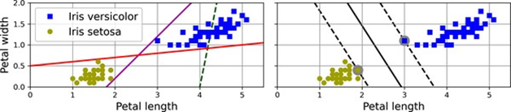
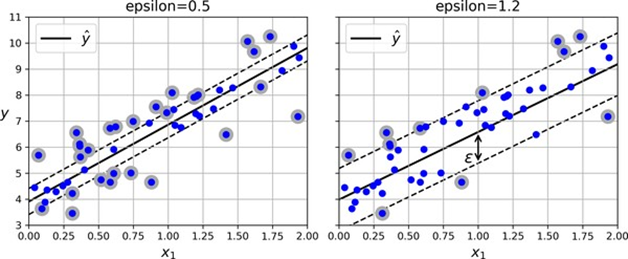

<!-- tabs:start -->

#### ** 📖 Lý thuyết **
# CHƯƠNG 5. MÁY HỌC VÉC-TƠ HỖ TRỢ

Một máy học véc-tơ hỗ trợ (SVM) là một mô hình học máy mạnh mẽ và
linh hoạt, có khả năng thực hiện phân loại tuyến tính hoặc phi tuyến, hồi quy,
và thậm chí cả phát hiện điểm mới. SVM đặc biệt hiệu quả với các tập dữ liệu
phi tuyến có kích thước nhỏ đến trung bình (tức là hàng trăm đến hàng nghìn trường
hợp), đặc biệt cho các tác vụ phân loại. Tuy nhiên, chúng không mở rộng tốt với
các tập dữ liệu rất lớn, như bạn sẽ thấy. Chương này sẽ giải thích các khái niệm
cốt lõi của SVM, cách sử dụng chúng và cách chúng hoạt động. Hãy cùng tìm hiểu
ngay!


### 5.1. Phân loại SVM tuyến tính

Ý tưởng cơ bản đằng sau SVM được giải thích tốt nhất bằng một số
hình ảnh. Hình 5-1 cho thấy một phần của tập dữ liệu iris đã được giới thiệu ở
cuối Chương 4. Hai lớp có thể được phân tách rõ ràng một cách dễ dàng bằng một
đường thẳng (chúng có thể phân tách tuyến tính). Biểu đồ bên trái cho thấy các
đường biên quyết định của ba bộ phân loại tuyến tính có thể có. Mô hình có đường
biên quyết định được biểu thị bằng đường nét đứt tệ đến mức nó thậm chí không
phân tách các lớp một cách đúng đắn. Hai mô hình còn lại hoạt động hoàn hảo
trên tập huấn luyện này, nhưng các đường biên quyết định của chúng quá gần với
các trường hợp khiến các mô hình này có thể không hoạt động tốt trên các trường
hợp mới. Ngược lại, đường nét liền trong biểu đồ bên phải đại diện cho đường
biên quyết định của một bộ phân loại SVM; đường này không chỉ phân tách hai lớp
mà còn giữ khoảng cách xa nhất có thể so với các trường hợp huấn luyện gần nhất.
Bạn có thể coi một bộ phân loại SVM như việc khớp một “con đường” rộng nhất có
thể (được biểu thị bằng các đường nét đứt song song) giữa các lớp. Đây được gọi
là phân loại biên lớn (large margin classification).





*Hình 5-1. Phân loại biên lớn*

Lưu ý rằng việc thêm nhiều trường hợp huấn luyện “ngoài lề” sẽ không
ảnh hưởng đến đường biên quyết định: nó hoàn toàn được xác định (hoặc “hỗ trợ”)
bởi các trường hợp nằm trên rìa của “con đường”. Các trường hợp này được gọi là
các véc-tơ hỗ trợ (chúng được khoanh tròn trong Hình 5-1).


*Hình 5-2. Độ nhạy với thang
đo đặc trưng*


#### 5.1.1 Phân loại biên mềm

Nếu chúng ta áp đặt nghiêm ngặt rằng tất cả các trường hợp phải nằm
ngoài “con đường” và ở đúng phía, đây được gọi là phân loại biên cứng (hard
margin classification). Có hai vấn đề chính với phân loại biên cứng. Thứ nhất,
nó chỉ hoạt động nếu dữ liệu có thể phân tách tuyến tính. Thứ hai, nó nhạy cảm
với các ngoại lệ. Hình 5-3 cho thấy tập dữ liệu iris chỉ với một ngoại lệ bổ
sung: ở bên trái, không thể tìm thấy biên cứng; ở bên phải, đường biên quyết định
rất khác so với đường chúng ta thấy trong Hình 5-1 mà không có ngoại lệ, và mô
hình có thể sẽ không tổng quát hóa tốt.


*Hình 5-3. Độ nhạy của biên cứng
với các ngoại lệ*

Để tránh những vấn đề này, chúng ta cần sử dụng một mô hình linh hoạt
hơn. Mục tiêu là tìm sự cân bằng tốt giữa việc giữ “con đường” càng lớn càng tốt
và hạn chế các vi phạm biên (tức là các trường hợp nằm ở giữa “con đường” hoặc
thậm chí ở sai phía). Đây được gọi là phân loại biên mềm (soft margin
classification). Khi tạo một mô hình SVM bằng Scikit-Learn, bạn có thể chỉ định
một số siêu tham số, bao gồm siêu tham số chính quy hóa C. Nếu bạn đặt nó thành
giá trị thấp, bạn sẽ nhận được mô hình ở bên trái Hình 5-4. Với giá trị cao, bạn
sẽ nhận được mô hình ở bên phải. Như bạn có thể thấy, giảm C làm cho “con đường”
lớn hơn, nhưng nó cũng dẫn đến nhiều vi phạm biên hơn. Nói cách khác, giảm C dẫn
đến nhiều trường hợp hỗ trợ “con đường” hơn, do đó ít rủi ro về việc quá khớp
(overfitting). Nhưng nếu bạn giảm nó quá nhiều, mô hình sẽ bị dưới khớp
(underfitting), như trường hợp này: mô hình với C=100 dường như sẽ tổng quát
hóa tốt hơn mô hình với C=1.


*Hình 5-4. Biên lớn (trái) so
với ít vi phạm biên hơn (phải)*

Đoạn mã Scikit-Learn sau đây tải tập dữ liệu iris và huấn luyện một
bộ phân loại SVM tuyến tính để phát hiện hoa Iris virginica. Pipeline đầu tiên
chuẩn hóa các đặc trưng, sau đó sử dụng LinearSVC với C=1:


from sklearn.datasets import
load_iris


from sklearn.pipeline import
make_pipeline


from sklearn.preprocessing
import StandardScaler


from sklearn.svm import
LinearSVC


# Tải dữ liệu Iris


iris =
load_iris(as_frame=True)


# Chọn đặc trưng và nhãn


X = iris.data[["petal
length (cm)", "petal width (cm)"]].values


y = (iris.target == 2)  # Nhãn cho Iris virginica


# Tạo pipeline với
StandardScaler và LinearSVC


svm_clf = make_pipeline(


StandardScaler(),


LinearSVC(C=1, random_state=42)


)


# Huấn luyện mô hình


svm_clf.fit(X, y)


Mô hình thu được được biểu thị ở bên trái trong Hình 5-4. Sau đó,
như thường lệ, bạn có thể sử dụng mô hình để đưa ra dự đoán:


X_new = [[5.5, 1.7], [5.0, 1.5]]
svm_clf.predict(X_new) array([ True, False])


Cây đầu tiên được phân loại là Iris virginica,
trong khi cây thứ hai thì không. Hãy xem xét các điểm mà SVM đã sử dụng để đưa
ra các dự đoán này. Chúng đo khoảng cách có dấu giữa mỗi trường hợp và đường
biên quyết định:


svm_clf.decision_function(X_new) array([
0.66163411, -0.22036063])


Không giống như LogisticRegression, LinearSVC
không có phương thức predict_proba() để ước tính xác suất lớp. Điều đó nói lên
rằng, nếu bạn sử dụng lớp SVC (sẽ được thảo luận sau) thay vì LinearSVC, và nếu
bạn đặt siêu tham số probability của nó thành True, thì mô hình sẽ khớp một mô
hình bổ sung ở cuối quá trình huấn luyện để ánh xạ các điểm chức năng quyết định
của SVM sang xác suất ước tính. Về cơ bản, điều này yêu cầu sử dụng xác thực
chéo 5 lần để tạo ra các dự đoán ngoài mẫu cho mọi trường hợp trong tập huấn
luyện, sau đó huấn luyện một mô hình LogisticRegression, do đó sẽ làm chậm quá
trình huấn luyện đáng kể. Sau đó, các phương thức predict_proba() và
predict_log_proba() sẽ có sẵn.


### Phân loại SVM phi tuyến

Mặc dù các bộ phân loại SVM tuyến tính hiệu quả và thường hoạt động
đáng ngạc nhiên, nhiều tập dữ liệu thậm chí còn không gần với việc có thể phân
tách tuyến tính. Một cách tiếp cận để xử lý các tập dữ liệu phi tuyến là thêm
nhiều đặc trưng hơn, chẳng hạn như các đặc trưng đa thức (như chúng ta đã làm
trong Chương 4); trong một số trường hợp, điều này có thể dẫn đến một tập dữ liệu
có thể phân tách tuyến tính. Hãy xem xét biểu đồ bên trái trong Hình 5-5: nó biểu
thị một tập dữ liệu đơn giản chỉ với một đặc trưng, x1. Tập dữ liệu này không
thể phân tách tuyến tính, như bạn có thể thấy. Nhưng nếu bạn thêm một đặc trưng
thứ hai x2 = (x1)2, tập dữ liệu 2D thu được hoàn toàn có thể phân tách tuyến
tính.


*Hình 5-5. Thêm đặc trưng để
làm cho một tập dữ liệu có thể phân tách tuyến tính*

Để triển khai ý tưởng này bằng Scikit-Learn, bạn có thể tạo một
pipeline chứa bộ biến đổi PolynomialFeatures (được thảo luận trong “Hồi quy đa
thức”), theo sau là StandardScaler và một bộ phân loại LinearSVC. Hãy thử nghiệm
điều này trên tập dữ liệu moons, một tập dữ liệu đồ chơi để phân loại nhị phân
trong đó các điểm dữ liệu có hình dạng hai lưỡi liềm xen kẽ (xem Hình 5-6). Bạn
có thể tạo tập dữ liệu này bằng cách sử dụng hàm make_moons():


from sklearn.datasets import
make_moons


from sklearn.preprocessing
import PolynomialFeatures


from sklearn.preprocessing
import StandardScaler


from sklearn.svm import
LinearSVC


from sklearn.pipeline import
make_pipeline


# Tạo dữ liệu dạng hình mặt
trăng


X, y =
make_moons(n_samples=100, noise=0.15, random_state=42)


# Tạo pipeline: thêm đặc
trưng đa thức bậc 3, chuẩn hóa, sau đó huấn luyện SVM tuyến tính


polynomial_svm_clf =
make_pipeline(


PolynomialFeatures(degree=3),


StandardScaler(),


LinearSVC(C=10, max_iter=10_000,
random_state=42)


)


# Huấn luyện mô hình


polynomial_svm_clf.fit(X, y)


*Hình 5-6. Bộ phân loại SVM
tuyến tính sử dụng các đặc trưng đa thức*


#### Kernel đa thức

Việc thêm các đặc trưng đa thức rất đơn giản để triển khai và có thể
hoạt động tuyệt vời với tất cả các loại thuật toán học máy (không chỉ SVM). Điều
đó nói lên rằng, ở bậc đa thức thấp, phương pháp này không thể xử lý các tập dữ
liệu rất phức tạp, và ở bậc đa thức cao, nó tạo ra một số lượng lớn các đặc
trưng, làm cho mô hình quá chậm. May mắn thay, khi sử dụng SVM, bạn có thể áp dụng
một kỹ thuật toán học gần như kỳ diệu được gọi là kernel trick (sẽ được giải
thích sau trong chương này). Kernel trick giúp có thể đạt được kết quả tương tự
như khi bạn đã thêm nhiều đặc trưng đa thức, ngay cả với bậc rất cao, mà không
thực sự phải thêm chúng. Điều này có nghĩa là không có sự bùng nổ tổ hợp về số
lượng đặc trưng. Thủ thuật này được triển khai bởi lớp SVC. Hãy thử nghiệm nó
trên tập dữ liệu moons:


SVC


poly_kernel_svm_clf = make_pipeline(StandardScaler(),
SVC(kernel=“poly”,degree=3, coef0=1, C=5)) poly_kernel_svm_clf.fit(X, y)


Đoạn mã này huấn luyện một bộ phân loại SVM sử dụng kernel đa thức bậc
ba, được biểu thị ở bên trái trong Hình 5-7. Ở bên phải là một bộ phân loại SVM
khác sử dụng kernel đa thức bậc 10. Rõ ràng, nếu mô hình của bạn đang bị quá khớp,
bạn có thể muốn giảm bậc đa thức. Ngược lại, nếu nó bị dưới khớp, bạn có thể thử
tăng nó. Siêu tham số coef0 kiểm soát mức độ ảnh hưởng của các số hạng bậc cao
so với các số hạng bậc thấp đến mô hình.


*Hình 5-7. Các bộ phân loại
SVM với kernel đa thức*


#### Các đặc trưng tương tự

Một kỹ thuật khác để giải quyết các vấn đề phi tuyến là thêm các đặc
trưng được tính toán bằng hàm tương tự (similarity function), đo lường mức độ mỗi
trường hợp giống một điểm mốc cụ thể, như chúng ta đã làm trong Chương 2 khi
thêm các đặc trưng tương tự địa lý. Ví dụ, hãy lấy tập dữ liệu 1D từ trước và
thêm hai điểm mốc vào đó tại x1 = –2 và x1 = 1 (xem biểu đồ bên trái trong Hình
5-8). Tiếp theo, chúng ta sẽ định nghĩa hàm tương tự là Gaussian RBF với γ =
0.3. Đây là một hàm hình chuông thay đổi từ 0 (rất xa điểm mốc) đến 1 (tại điểm
mốc). Bây giờ chúng ta đã sẵn sàng để tính toán các đặc trưng mới. Ví dụ, hãy
xem xét trường hợp x1 = –1: nó nằm ở khoảng cách 1 từ điểm mốc đầu tiên và 2 từ
điểm mốc thứ hai. Do đó, các đặc trưng mới của nó là x2 = exp(–0.3 × 12) ≈ 0.74
và x3 = exp(–0.3 × 22) ≈ 0.30. Biểu đồ bên phải trong Hình 5-8 cho thấy tập dữ
liệu đã được biến đổi (bỏ qua các đặc trưng gốc). Như bạn có thể thấy, nó hiện
có thể phân tách tuyến tính.


*Hình 5-8. Các đặc trưng tương
tự sử dụng Gaussian RBF*

Bạn có thể tự hỏi làm thế nào để chọn các điểm mốc. Cách tiếp cận
đơn giản nhất là tạo một điểm mốc tại vị trí của mỗi và mọi trường hợp trong tập
dữ liệu. Làm như vậy tạo ra nhiều chiều và do đó tăng khả năng tập huấn luyện
đã được biến đổi sẽ có thể phân tách tuyến tính. Nhược điểm là một tập huấn luyện
với m trường hợp và n đặc trưng sẽ được biến đổi thành một tập huấn luyện với m
trường hợp và m đặc trưng (giả sử bạn bỏ qua các đặc trưng gốc). Nếu tập huấn
luyện của bạn rất lớn, bạn sẽ có một số lượng đặc trưng tương đương.


#### Kernel Gaussian RBF

Cũng giống như phương pháp đặc trưng đa thức, phương pháp đặc trưng
tương tự có thể hữu ích với bất kỳ thuật toán học máy nào, nhưng việc tính toán
tất cả các đặc trưng bổ sung có thể tốn kém về mặt tính toán (đặc biệt trên các
tập huấn luyện lớn). Một lần nữa, kernel trick lại thực hiện phép thuật SVM của
nó, giúp có thể đạt được kết quả tương tự như khi bạn đã thêm nhiều đặc trưng
tương tự, nhưng không thực sự làm như vậy. Hãy thử lớp SVC với kernel Gaussian
RBF:


rbf_kernel_svm_clf =
make_pipeline(StandardScaler(), SVC(kernel=“rbf”,gamma=5, C=0.001))
rbf_kernel_svm_clf.fit(X, y)


Mô hình này được biểu thị ở phía dưới bên trái trong Hình 5-9. Các
biểu đồ khác cho thấy các mô hình được huấn luyện với các giá trị khác nhau của
các siêu tham số gamma (γ) và C. Tăng gamma làm cho đường cong hình chuông hẹp
hơn (xem các biểu đồ bên trái trong Hình 5-8). Kết quả là, phạm vi ảnh hưởng của
mỗi trường hợp nhỏ hơn: đường biên quyết định trở nên bất thường hơn, uốn lượn
quanh từng trường hợp riêng lẻ. Ngược lại, giá trị gamma nhỏ làm cho đường cong
hình chuông rộng hơn: các trường hợp có phạm vi ảnh hưởng lớn hơn, và đường
biên quyết định trở nên mượt mà hơn. Vì vậy, γ hoạt động giống như một siêu
tham số chính quy hóa: nếu mô hình của bạn bị quá khớp, bạn nên giảm γ; nếu nó
bị dưới khớp, bạn nên tăng γ (tương tự như siêu tham số C).


*Hình 5-9. Các bộ phân loại
SVM sử dụng kernel RBF*

Các kernel khác tồn tại nhưng được sử dụng ít thường xuyên hơn nhiều.
Một số kernel được chuyên biệt cho các cấu trúc dữ liệu cụ thể. Các kernel chuỗi
đôi khi được sử dụng khi phân loại tài liệu văn bản hoặc chuỗi DNA (ví dụ: sử dụng
kernel chuỗi con hoặc các kernel dựa trên khoảng cách Levenshtein).


### Các lớp SVM và độ phức tạp tính toán

Lớp LinearSVC dựa trên thư viện liblinear, triển khai một thuật toán
tối ưu hóa cho SVM tuyến tính. Nó không hỗ trợ kernel trick, nhưng nó mở rộng gần
như tuyến tính với số lượng trường hợp huấn luyện và số lượng đặc trưng. Độ phức
tạp thời gian huấn luyện của nó xấp xỉ O(m × n). Thuật toán mất nhiều thời gian
hơn nếu bạn yêu cầu độ chính xác rất cao. Điều này được kiểm soát bởi siêu tham
số dung sai ϵ (được gọi là tol trong Scikit-Learn). Trong hầu hết các tác vụ
phân loại, dung sai mặc định là tốt. Lớp SVC dựa trên thư viện libsvm, triển
khai một thuật toán hỗ trợ kernel trick. Độ phức tạp thời gian huấn luyện thường
nằm trong khoảng từ O(m2 × n) đến O(m3 × n). Thật không may, điều này có nghĩa
là nó trở nên cực kỳ chậm khi số lượng trường hợp huấn luyện trở nên lớn (ví dụ:
hàng trăm nghìn trường hợp), vì vậy thuật toán này tốt nhất cho các tập huấn
luyện phi tuyến có kích thước nhỏ hoặc trung bình. Nó mở rộng tốt với số lượng
đặc trưng, đặc biệt với các đặc trưng thưa thớt (tức là khi mỗi trường hợp có
ít đặc trưng khác không). Trong trường hợp này, thuật toán mở rộng xấp xỉ với số
lượng trung bình các đặc trưng khác không trên mỗi trường hợp. Lớp
SGDClassifier cũng thực hiện phân loại biên lớn theo mặc định, và các siêu tham
số của nó – đặc biệt là các siêu tham số chính quy hóa (alpha và penalty) và
learning_rate – có thể được điều chỉnh để tạo ra kết quả tương tự như SVM tuyến
tính. Để huấn luyện, nó sử dụng giảm độ dốc ngẫu nhiên (xem Chương 4), cho phép
học tăng dần và sử dụng ít bộ nhớ, vì vậy bạn có thể sử dụng nó để huấn luyện một
mô hình trên một tập dữ liệu lớn không phù hợp với RAM (tức là cho học ngoài
lõi). Hơn nữa, nó mở rộng rất tốt, vì độ phức tạp tính toán của nó là O(m × n).
Bảng 5-1 so sánh các lớp phân loại SVM của Scikit-Learn.


Bảng 5-1. So sánh các lớp Scikit-Learn cho phân loại SVM


Bây giờ chúng ta hãy xem các thuật toán SVM cũng có thể được sử dụng
cho hồi quy tuyến tính và phi tuyến như thế nào.


### Hồi quy SVM

Để sử dụng SVM cho hồi quy thay vì phân loại, mẹo là điều chỉnh mục
tiêu: thay vì cố gắng khớp “con đường” lớn nhất có thể giữa hai lớp trong khi hạn
chế vi phạm biên, hồi quy SVM cố gắng khớp càng nhiều trường hợp càng tốt trên
“con đường” trong khi hạn chế vi phạm biên (tức là các trường hợp nằm ngoài
“con đường”). Chiều rộng của “con đường” được kiểm soát bởi một siêu tham số, ϵ.
Hình 5-10 cho thấy hai mô hình hồi quy SVM tuyến tính được huấn luyện trên một
số dữ liệu tuyến tính, một với biên nhỏ (ϵ= 0.5) và một với biên lớn hơn (ϵ =
1.2).





*Hình 5-10. Hồi quy SVM*

Giảm ϵ làm tăng số lượng véc-tơ hỗ trợ, điều này chuẩn hóa mô hình.
Hơn nữa, nếu bạn thêm nhiều trường hợp huấn luyện hơn trong biên, nó sẽ không ảnh
hưởng đến dự đoán của mô hình; do đó, mô hình được gọi là không nhạy cảm với ϵ.


Bạn có thể sử dụng lớp LinearSVR của Scikit-Learn để thực hiện hồi
quy SVM tuyến tính. Đoạn mã sau đây tạo ra mô hình được biểu thị ở bên trái
trong Hình 5-10:


LinearSVR


X, y = […] # một tập dữ liệu tuyến tính svm_reg =
make_pipeline(StandardScaler(), LinearSVR(epsilon=0.5, random_state=42))
svm_reg.fit(X, y)


Để giải quyết các tác vụ hồi quy phi tuyến, bạn có thể sử dụng mô
hình SVM với kernel. Hình 5-11 cho thấy hồi quy SVM trên một tập huấn luyện bậc
hai ngẫu nhiên, sử dụng kernel đa thức bậc hai. Có một số chính quy hóa trong
biểu đồ bên trái (tức là giá trị C nhỏ), và ít hơn nhiều ở biểu đồ bên phải (tức
là giá trị C lớn).


*Hình 5-11. Hồi quy SVM sử dụng
kernel đa thức bậc hai*

Đoạn mã sau đây sử dụng lớp SVR của Scikit-Learn (hỗ trợ kernel
trick) để tạo ra mô hình được biểu thị ở bên trái trong Hình 5-11:


SVR


X, y = […] # một tập dữ liệu bậc hai svm_poly_reg =
make_pipeline(StandardScaler(), SVR(kernel=“poly”,degree=2, C=0.01,
epsilon=0.1)) svm_poly_reg.fit(X, y)


Lớp SVR là tương đương hồi quy của lớp SVC, và lớp LinearSVR là
tương đương hồi quy của lớp LinearSVC. Lớp LinearSVR mở rộng tuyến tính với
kích thước của tập huấn luyện (giống như lớp LinearSVC), trong khi lớp SVR trở
nên quá chậm khi tập huấn luyện trở nên rất lớn (giống như lớp SVC).


Phần còn lại của chương này giải thích cách SVM đưa ra dự đoán và
cách các thuật toán huấn luyện của chúng hoạt động, bắt đầu với các bộ phân loại
SVM tuyến tính. Nếu bạn mới bắt đầu với học máy, bạn có thể bỏ qua phần này và
đi thẳng đến các bài tập ở cuối chương này, và quay lại sau khi bạn muốn hiểu
sâu hơn về SVM.


### Bên trong các bộ phân loại SVM tuyến tính

Bộ phân loại SVM tuyến tính dự đoán lớp của một trường hợp mới x bằng
cách đầu tiên tính toán hàm quyết định θᵀ x = θ₀x₀ + ⋯ + θnxn, trong đó x₀ là đặc
trưng bias (luôn bằng 1). Nếu kết quả là dương, thì lớp dự đoán ŷ là lớp dương
(1); nếu không thì là lớp âm (0). Điều này giống hệt như Hồi quy Logistic (được
thảo luận trong Chương 4).


Dự đoán bằng bộ phân loại SVM tuyến tính khá đơn
giản. Vậy còn việc huấn luyện thì sao? Điều này đòi hỏi phải tìm vector trọng số


 và số hạng bias 

 sao cho “con đường”, hay
biên, rộng nhất có thể trong khi hạn chế số lượng vi phạm biên. Hãy bắt đầu với
chiều rộng của “con đường”: để làm cho nó lớn hơn, chúng ta cần làm cho 

 nhỏ hơn. Điều này có thể dễ
hình dung hơn trong không gian 2D, như trong Hình 5-12. Hãy định nghĩa các đường
biên của “con đường” là các điểm mà hàm quyết định bằng -1 hoặc +1. Trong biểu
đồ bên trái, trọng số 

 là 1, vì vậy các điểm mà 

 hoặc +1 là 

 và +1: do đó kích thước của
biên là 2. Trong biểu đồ bên phải, trọng số là 0.5, vì vậy các điểm mà 

 hoặc +1 là 

 và +2: kích thước của biên là
4. Vì vậy, chúng ta cần giữ 

 càng nhỏ càng tốt. Lưu ý rằng
số hạng bias 

 không ảnh hưởng đến kích thước
của biên: việc điều chỉnh nó chỉ làm dịch chuyển biên mà không ảnh hưởng đến
kích thước của nó.


*Hình 5-12. Một vector trọng số
nhỏ hơn dẫn đến một biên lớn hơn*

Chúng ta cũng muốn tránh các vi phạm biên, vì vậy chúng ta cần hàm
quyết định lớn hơn 1 cho tất cả các trường hợp huấn luyện dương và nhỏ hơn -1
cho các trường hợp huấn luyện âm. Nếu chúng ta định nghĩa 

 cho các trường hợp âm (khi 

 ) và 

 cho các trường hợp dương (khi


 ), thì chúng ta có thể viết
ràng buộc này là 

 cho tất cả các trường hợp. Do
đó, chúng ta có thể biểu diễn mục tiêu của bộ phân loại SVM tuyến tính biên cứng
dưới dạng bài toán tối ưu hóa có ràng buộc trong Phương trình 5-1. Phương trình
5-1. Mục tiêu của bộ phân loại SVM tuyến tính biên cứng tối thiểu hóa


Để có được mục tiêu biên mềm, chúng ta cần đưa vào một biến trượt 

 cho mỗi trường hợp: 

 đo lường mức độ trường hợp thứ


 được phép vi phạm biên. Bây
giờ chúng ta có hai mục tiêu xung đột: làm cho các biến trượt càng nhỏ càng tốt
để giảm vi phạm biên, và làm cho 

 càng nhỏ càng tốt để tăng
biên. Đây là lúc siêu tham số C xuất hiện: nó cho phép chúng ta định nghĩa sự
cân bằng giữa hai mục tiêu này. Điều này cho chúng ta bài toán tối ưu hóa có
ràng buộc trong Phương trình 5-2. Phương trình 5-2. Mục tiêu của bộ phân loại
SVM tuyến tính biên mềm tối thiểu hóa


thỏa mãn 

 và 

 cho


Cả bài toán biên cứng và biên mềm đều là các bài toán tối ưu hóa bậc
hai lồi với các ràng buộc tuyến tính. Các bài toán như vậy được gọi là bài toán
quy hoạch bậc hai (QP). Nhiều bộ giải có sẵn để giải các bài toán QP bằng cách
sử dụng nhiều kỹ thuật khác nhau nằm ngoài phạm vi của cuốn sách này. Sử dụng bộ
giải QP là một cách để huấn luyện SVM. Một cách khác là sử dụng giảm độ dốc để
tối thiểu hóa hàm mất mát bản lề (hinge loss) hoặc hàm mất mát bản lề bình
phương (squared hinge loss) (xem Hình 5-13). Với một trường hợp 

 của lớp dương (tức là với 

 ), hàm mất mát là 0 nếu đầu
ra 

 của hàm quyết định ( 

 ) lớn hơn hoặc bằng 1. Điều
này xảy ra khi trường hợp nằm ngoài “con đường” và ở phía dương. Với một trường
hợp của lớp âm (tức là với 

 ), hàm mất mát là 0 nếu 

 . Điều này xảy ra khi trường
hợp nằm ngoài “con đường” và ở phía âm. Trường hợp càng xa phía đúng của biên
thì hàm mất mát càng cao: nó tăng tuyến tính đối với hàm mất mát bản lề, và bậc
hai đối với hàm mất mát bản lề bình phương. Điều này làm cho hàm mất mát bản lề
bình phương nhạy cảm hơn với các ngoại lệ. Tuy nhiên, nếu tập dữ liệu sạch, nó
có xu hướng hội tụ nhanh hơn. Theo mặc định, LinearSVC sử dụng hàm mất mát bản
lề bình phương, trong khi SGDClassifier sử dụng hàm mất mát bản lề. Cả hai lớp
đều cho phép bạn chọn hàm mất mát bằng cách đặt siêu tham số loss thành “hinge”
hoặc “squared_hinge”. Thuật toán tối ưu hóa của lớp SVC tìm kiếm một giải pháp
tương tự như việc tối thiểu hóa hàm mất mát bản lề.


*Hình 5-13. Hàm mất mát bản lề
(trái) và hàm mất mát bản lề bình phương (phải)*

Tiếp theo, chúng ta sẽ xem xét một cách khác để huấn luyện bộ phân
loại SVM tuyến tính: giải quyết bài toán đối ngẫu.


#### Bài toán đối ngẫu

Cho một bài toán tối ưu hóa có ràng buộc, được gọi là bài toán gốc
(primal problem), có thể biểu diễn một bài toán khác nhưng có liên quan chặt chẽ,
được gọi là bài toán đối ngẫu của nó. Giải pháp cho bài toán đối ngẫu thường
đưa ra một cận dưới cho giải pháp của bài toán gốc, nhưng trong một số điều kiện,
nó có thể có cùng giải pháp với bài toán gốc. May mắn thay, bài toán SVM đáp ứng
các điều kiện này, vì vậy bạn có thể chọn giải bài toán gốc hoặc bài toán đối
ngẫu; cả hai sẽ có cùng giải pháp.


Phương trình 5-3 cho thấy dạng đối ngẫu của mục tiêu SVM tuyến tính.
Nếu bạn muốn biết cách dẫn xuất bài toán đối ngẫu từ bài toán gốc, hãy xem phần
tài liệu bổ sung trong sổ tay của chương này. Phương trình 5-3. Dạng đối ngẫu của
mục tiêu SVM tuyến tính tối thiểu hóa


cho tất cả


Một khi bạn tìm thấy vector 

 tối thiểu hóa phương trình
này (sử dụng bộ giải QP), hãy sử dụng Phương trình 5-4 để tính toán 

 và 

 tối thiểu hóa bài toán gốc.
Trong phương trình này, 

 biểu thị số lượng véc-tơ hỗ
trợ. Phương trình 5-4. Từ giải pháp đối ngẫu đến giải pháp gốc


Bài toán đối ngẫu nhanh hơn để giải hơn bài toán gốc khi số lượng
trường hợp huấn luyện nhỏ hơn số lượng đặc trưng. Quan trọng hơn, bài toán đối
ngẫu giúp kernel trick trở nên khả thi, trong khi bài toán gốc thì không. Vậy
kernel trick là gì?


### SVM sử
dụng Kernel (Kernelized SVMs)

Giả sử bạn muốn áp dụng phép biến đổi đa thức bậc hai lên một tập huấn
luyện hai chiều, sau đó huấn luyện một bộ phân loại SVM tuyến tính trên tập dữ
liệu đã được biến đổi. Công thức 5-5 trình bày hàm ánh xạ đa thức bậc
hai 

 mà bạn muốn áp dụng.


Công
thức 5-5: Ánh xạ đa thức bậc hai


Lưu ý rằng vector đã biến đổi có 3 chiều thay vì 2. Bây giờ, hãy xem
điều gì sẽ xảy ra với một cặp vector 2D, 

 và 

 , nếu chúng ta áp dụng ánh xạ đa thức bậc hai
này rồi tính tích vô hướng của các vector đã biến đổi.


Công
thức 5-6: Kỹ thuật Kernel cho ánh xạ đa thức bậc hai


Tích
vô hướng của các vector đã biến đổi bằng với bình phương của tích vô hướng của
các vector ban đầu. Đây là mấu chốt quan trọng: nếu bạn áp dụng phép biến đổi 

 cho tất cả các trường hợp huấn luyện, thì bài
toán đối ngẫu sẽ chứa tích vô hướng 

 . Nhưng nếu 

 là phép biến đổi đa thức bậc hai được định
nghĩa trong Công thức 5-5, thì bạn có thể thay thế tích vô hướng của các vector
đã biến đổi bằng 

 . Vì vậy, bạn không cần phải biến đổi tập huấn
luyện; chỉ cần thay thế tích vô hướng bằng bình phương của nó. Kết quả sẽ giống
hệt như khi bạn đã thực hiện toàn bộ quá trình biến đổi tập dữ liệu và sau đó
huấn luyện thuật toán SVM tuyến tính, nhưng cách này hiệu quả hơn về mặt tính
toán.


Trong
học máy, một hàm có khả năng tính toán tích vô hướng 

 , chỉ dựa trên các vector gốc 

 và 

 mà không cần phải tính toán phép biến đổi 

 , được gọi là kernel. Công thức 5-7
liệt kê một số kernel thường được sử dụng nhất.


Công
thức 5-7: Các Kernel thông dụng


·    
Tuyến tính:


·        
Đa thức:


·        
RBF Gauss:


·    
Sigmoid:


Vẫn còn một vấn đề cần giải quyết. Công thức 5-4 cho thấy
cách chuyển từ nghiệm đối ngẫu sang nghiệm sơ cấp trong trường hợp bộ phân loại
SVM tuyến tính. Nhưng nếu bạn áp dụng kỹ thuật kernel, bạn sẽ có các phương
trình bao gồm 

 . Trên thực tế, $w^$ phải có cùng số chiều với


 , có thể rất lớn hoặc thậm chí vô hạn, nên bạn
không thể tính toán nó. Nhưng làm thế nào bạn có thể đưa ra dự đoán mà không biết
$w^$ ? Tin tốt là bạn có thể thay công thức của $w^$ từ Công thức 5-4 vào hàm
quyết định cho một trường hợp mới 

 , và bạn sẽ có một phương trình chỉ chứa các
tích vô hướng giữa các vector đầu vào. Điều này giúp bạn có thể sử dụng kỹ thuật
kernel.


Công
thức 5-8: Đưa ra dự đoán bằng Kernelized SVM


Lưu ý rằng vì 

 chỉ đối với các vector hỗ trợ, việc đưa ra dự
đoán chỉ liên quan đến việc tính tích vô hướng của vector đầu vào mới 

 với các vector hỗ trợ, chứ không phải với tất
cả các trường hợp huấn luyện. Tất nhiên, bạn cũng phải sử dụng cùng một kỹ thuật
để tính số hạng độ lệch $b^$ .


Công
thức 5-9: Sử dụng kỹ thuật Kernel để tính số hạng độ lệch


Nếu bạn cảm thấy đau đầu, điều đó hoàn toàn bình thường: đây là một
tác dụng phụ không may của kỹ thuật kernel.


### Bài tập

1.     
Ý tưởng cơ bản đằng sau máy học
véc-tơ hỗ trợ là gì?


2.     
Véc-tơ hỗ trợ là gì?


3.     
Tại sao việc chuẩn hóa đầu vào
lại quan trọng khi sử dụng SVM?


4.     
Một bộ phân loại SVM có thể đưa
ra điểm tin cậy khi phân loại một trường hợp không? Còn xác suất thì sao?


5.     
Làm thế nào để bạn chọn giữa
LinearSVC, SVC và SGDClassifier?


6.     
Giả sử bạn đã huấn luyện một bộ
phân loại SVM với kernel RBF, nhưng nó dường như bị dưới khớp trên tập huấn luyện.
Bạn nên tăng hay giảm 

 (gamma)? Còn C thì sao?


7.  
Một mô hình được gọi là không
nhạy cảm với 

 có nghĩa là gì?


8.     
Mục đích của việc sử dụng
kernel trick là gì?


9.     
Huấn luyện một LinearSVC trên một
tập dữ liệu có thể phân tách tuyến tính. Sau đó huấn luyện một SVC và một
SGDClassifier trên cùng tập dữ liệu đó. Xem liệu bạn có thể làm cho chúng tạo
ra cùng một mô hình hay không.


10. Huấn luyện một bộ phân loại SVM trên tập dữ liệu wine, bạn có thể tải
bằng cách sử dụng sklearn.datasets.load_wine(). Tập dữ liệu này chứa các phân
tích hóa học của 178 mẫu rượu được sản xuất bởi 3 nhà sản xuất khác nhau: mục
tiêu là huấn luyện một mô hình phân loại có khả năng dự đoán nhà sản xuất dựa
trên phân tích hóa học của rượu. Vì bộ phân loại SVM là bộ phân loại nhị phân,
bạn sẽ cần sử dụng chiến lược “một đối tất cả” (one-versus-all) để phân loại cả
ba lớp. Bạn có thể đạt được độ chính xác bao nhiêu?


11. Huấn luyện và tinh chỉnh một hồi quy SVM trên tập dữ liệu California
housing. Bạn có thể sử dụng tập dữ liệu gốc thay vì phiên bản đã được điều chỉnh
mà chúng ta đã sử dụng trong Chương 2, bạn có thể tải bằng cách sử dụng
sklearn.datasets.fetch_california_housing(). Các mục tiêu đại diện cho hàng
trăm nghìn đô la. Vì có hơn 20.000 trường hợp, SVM có thể chậm, vì vậy để tinh
chỉnh siêu tham số, bạn nên sử dụng ít trường hợp hơn (ví dụ: 2.000) để kiểm
tra nhiều kết hợp siêu tham số hơn. RMSE của mô hình tốt nhất của bạn là bao
nhiêu? Các giải pháp cho các bài tập này có sẵn ở cuối sổ tay của chương này, tại
https://homl.info/colab3 .

#### ** 🇻🇳 Tiếng Việt (pdf) **

<object data="TaiLieu/pdf_chapter/Chapter_05_VN.pdf#view=FitH" type="application/pdf" class="pdf-container">
    <p>Trình duyệt của bạn không hỗ trợ xem PDF nhúng. <a href="TaiLieu/pdf_chapter/Chapter_05_VN.pdf" target="_blank">Nhấn vào đây để tải tài liệu tiếng Việt</a>.</p>
</object>
<p style="text-align: right;"><a href="TaiLieu/pdf_chapter/Chapter_05_VN.pdf" target="_blank" style="font-weight: bold; color: #1a73e8;">📥 Tải về tài liệu Tiếng Việt (PDF)</a></p>

#### ** 🎦 Slide Bài Giảng **
<object data="TaiLieu/slideML/Slide_ML_Chap05.pdf#view=FitH" type="application/pdf" class="pdf-container">
    <p>Trình duyệt của bạn không hỗ trợ xem PDF nhúng. <a href="TaiLieu/slideML/Slide_ML_Chap05.pdf" target="_blank">Nhấn vào đây để tải Slide Bài Giảng</a>.</p>
</object>
<p style="text-align: right;"><a href="TaiLieu/slideML/Slide_ML_Chap05.pdf" target="_blank" style="font-weight: bold; color: #1a73e8;">📥 Tải về Slide Bài Giảng (PDF)</a></p>

#### ** 🎥 Video **

<iframe src="Video/Chapter_05/index.html" width="100%" height="600px" style="border: none; border-radius: 8px; box-shadow: 0 4px 12px rgba(0,0,0,0.1);" allowfullscreen></iframe>


#### ** 📝 Trắc nghiệm **

<iframe src="quizzes/Chapter05/index.html" style="width: 100%; min-height: 700px; border: none; border-radius: 8px; box-shadow: 0 4px 12px rgba(0,0,0,0.15);"></iframe>

#### ** 💻 Thực hành **

<div class="practice-container" style="background: #f8faff; border: 1px solid #cce0ff; border-radius: 8px; padding: 20px; margin-top: 15px;">
  <div style="display:flex; justify-content:space-between; align-items:center; flex-wrap:wrap; gap:10px;">
    <h3 style="margin-top:0; color: #1a73e8; display:flex; align-items:center; gap:8px; margin-bottom:0;">🚀 Bài tập Thực hành Jupyter Notebook</h3>
    <div class="lang-toggle" style="display:flex; gap:8px;">
      <button id="btn-vn" onclick="togglePracticeLang('VN')" style="background: #fbbc04; color: #fff; border:none; padding:6px 12px; border-radius:20px; cursor:pointer; font-weight:bold; transition:all 0.2s;">🇻🇳 VN</button>
      <button id="btn-en" onclick="togglePracticeLang('EN')" style="background: #f1f3f4; color: #5f6368; border:none; padding:6px 12px; border-radius:20px; cursor:pointer; font-weight:bold; opacity: 0.4; transition:all 0.2s;">🇬🇧 EN</button>
    </div>
  </div>
  <p style="margin-top: 10px;">Dưới đây là các sổ tay (notebook) chứa mã nguồn Python thực hành cho chương này. Bạn có thể mở trực tiếp trên Google Colab để chạy thử nghiệm, hoặc tải file về máy.</p>
  
  <ul id="notebook-list-VN" style="list-style-type: none; padding-left: 0; display: block;">
    <li style="margin-bottom: 15px; padding: 15px; background: white; border-radius: 6px; box-shadow: 0 2px 4px rgba(0,0,0,0.05);">
      <strong style="font-size:16px;">Thực hành: 1. Support Vector Machines</strong><br>
      <div style="margin-top: 10px; display: flex; gap: 10px; flex-wrap: wrap;">
        <a href="https://colab.research.google.com/github/tranthanhthangbmt/M-n-M-y-h-c_2026/blob/main/machineLearningWeb/TaiLieu/NotebookJupyter/05_support_vector_machines_VN.ipynb" target="_blank" style="background: #fbbc04; color: #fff; padding: 6px 14px; border-radius: 6px; text-decoration: none; font-size: 14px; font-weight: 600; box-shadow: 0 2px 4px rgba(251,188,4,0.3);">🔥 Mở trên Google Colab</a>
        <a href="TaiLieu/NotebookJupyter/05_support_vector_machines_VN.ipynb" download style="background: #1a73e8; color: white; padding: 6px 14px; border-radius: 6px; text-decoration: none; font-size: 14px; font-weight: 600; box-shadow: 0 2px 4px rgba(26,115,232,0.3);">💾 Tải file .ipynb về máy</a>
      </div>
    </li>
  </ul>
  
  <ul id="notebook-list-EN" style="list-style-type: none; padding-left: 0; display: none;">
    <li style="margin-bottom: 15px; padding: 15px; background: white; border-radius: 6px; box-shadow: 0 2px 4px rgba(0,0,0,0.05);">
      <strong style="font-size:16px;">Thực hành: 1. Support Vector Machines</strong><br>
      <div style="margin-top: 10px; display: flex; gap: 10px; flex-wrap: wrap;">
        <a href="https://colab.research.google.com/github/tranthanhthangbmt/M-n-M-y-h-c_2026/blob/main/machineLearningWeb/TaiLieu/NotebookJupyter/05_support_vector_machines_VN.ipynb" target="_blank" style="background: #fbbc04; color: #fff; padding: 6px 14px; border-radius: 6px; text-decoration: none; font-size: 14px; font-weight: 600; box-shadow: 0 2px 4px rgba(251,188,4,0.3);">🔥 Mở trên Google Colab</a>
        <a href="TaiLieu/NotebookJupyter/05_support_vector_machines_VN.ipynb" download style="background: #1a73e8; color: white; padding: 6px 14px; border-radius: 6px; text-decoration: none; font-size: 14px; font-weight: 600; box-shadow: 0 2px 4px rgba(26,115,232,0.3);">💾 Tải file .ipynb về máy</a>
      </div>
    </li>
  </ul>

  <div style="margin-top: 20px; border-top: 1px dashed #cce0ff; padding-top: 15px;">
    <strong>Hoặc truy cập toàn bộ kho tài liệu:</strong> <a href="https://drive.google.com/drive/folders/1nRV7W748VkSldg-BaKdcejBV-sBP47_M?usp=sharing" target="_blank" style="color: #1a73e8; font-weight: bold;">Thư mục Google Drive Thực hành</a>
  </div>
</div>


#### ** 📝 Bài Tập **


<script>
if (typeof checkPasswordAndShow !== 'function') {
  window.checkPasswordAndShow = function(btn) {
    let password = prompt("Vui lòng nhập mật khẩu để xem lời giải:");
    if (password === "donga2026") {
      let content = btn.nextElementSibling;
      if (content && content.classList.contains("solution-content")) {
        content.style.display = "block";
        btn.style.display = "none";
      }
    } else {
      alert("Mật khẩu không đúng!");
    }
  };
}
</script>

<div class="exercise-box" style="background: #fff; border: 1px solid #e0e0e0; border-radius: 8px; padding: 20px; margin-bottom: 20px; box-shadow: 0 2px 5px rgba(0,0,0,0.05);">
<h4 style="color: #1a73e8; margin-top: 0;">Câu 1: Ý tưởng cơ bản đằng sau máy học véc-tơ hỗ trợ là gì?</h4>


<details style="margin-top: 15px; margin-bottom: 15px; background: #f8faff; padding: 10px; border-radius: 6px; border-left: 4px solid #1a73e8;">
<summary style="font-weight: bold; cursor: pointer; color: #1a73e8;">💡 Gợi ý</summary>
<div style="margin-top: 10px;">
Hãy phân tích kỹ các khái niệm trong bài học và áp dụng vào yêu cầu của đề bài. Đọc lại phần lý thuyết liên quan nếu cần.
</div>
</details>

<div class="solution-section">
<button onclick="checkPasswordAndShow(this)" style="background: #34a853; color: white; border: none; padding: 8px 16px; border-radius: 20px; font-weight: bold; cursor: pointer; transition: background 0.3s;">🔑 Xem lời giải</button>
<div class="solution-content" style="display: none; margin-top: 15px; padding-top: 15px; border-top: 1px dashed #ccc;">

*   **Lời giải chi tiết**: 
*   Ý tưởng cốt lõi của SVM là khớp với một **"con đường" rộng nhất có thể** ngăn cách giữa các lớp dữ liệu [cite: 97, 841]. Mục tiêu là tìm được **biên quyết định (decision boundary)** có khoảng cách (margin) lớn nhất tới các thực thể huấn luyện gần nhất của mỗi lớp [cite: 97, 841]. Đây được gọi là **phân loại biên lớn (large margin classification)** [cite: 841].
*   Trong bài toán phân loại biên mềm (Soft Margin Classification), SVM cố gắng tìm kiếm **sự cân bằng tối ưu** giữa hai mục tiêu xung đột: phân loại đúng hoàn hảo các mẫu huấn luyện và giữ cho biên quyết định càng rộng càng tốt để hạn chế vi phạm biên (tức là các mẫu lọt vào giữa con đường hoặc nằm sai phía) [cite: 97, 843, 862].
*   Một ý tưởng quan trọng khác là sử dụng các **hạt nhân (kernel)** để ánh xạ dữ liệu phi tuyến vào không gian nhiều chiều hơn nhằm tìm ra ranh giới phân tách tuyến tính một cách hiệu quả [cite: 97, 99].

</div>
</div>
</div>

<div class="exercise-box" style="background: #fff; border: 1px solid #e0e0e0; border-radius: 8px; padding: 20px; margin-bottom: 20px; box-shadow: 0 2px 5px rgba(0,0,0,0.05);">
<h4 style="color: #1a73e8; margin-top: 0;">Câu 2: Véc-tơ hỗ trợ là gì?</h4>


<details style="margin-top: 15px; margin-bottom: 15px; background: #f8faff; padding: 10px; border-radius: 6px; border-left: 4px solid #1a73e8;">
<summary style="font-weight: bold; cursor: pointer; color: #1a73e8;">💡 Gợi ý</summary>
<div style="margin-top: 10px;">
Hãy phân tích kỹ các khái niệm trong bài học và áp dụng vào yêu cầu của đề bài. Đọc lại phần lý thuyết liên quan nếu cần.
</div>
</details>

<div class="solution-section">
<button onclick="checkPasswordAndShow(this)" style="background: #34a853; color: white; border: none; padding: 8px 16px; border-radius: 20px; font-weight: bold; cursor: pointer; transition: background 0.3s;">🔑 Xem lời giải</button>
<div class="solution-content" style="display: none; margin-top: 15px; padding-top: 15px; border-top: 1px dashed #ccc;">

*   **Lời giải chi tiết**: 
*   **Véc-tơ hỗ trợ (support vectors)** là các thực thể huấn luyện **nằm ngay trên đường biên đường chạy (margin boundary)** (bao gồm cả các điểm nằm sâu bên trong con đường phân tách hoặc bị phân loại sai trong biên mềm) [cite: 98, 842].
*   Đường ranh giới quyết định cuối cùng của SVM được **xác định hoàn toàn bởi các véc-tơ này** [cite: 98]. Mọi thực thể huấn luyện khác không phải là véc-tơ hỗ trợ (nằm an toàn ngoài biên) hoàn toàn không có bất kỳ ảnh hưởng nào đến mô hình [cite: 98]. Nếu bạn thêm, bớt hay dịch chuyển các điểm ngoài biên này, đường quyết định của SVM vẫn sẽ giữ nguyên không đổi [cite: 842].

</div>
</div>
</div>

<div class="exercise-box" style="background: #fff; border: 1px solid #e0e0e0; border-radius: 8px; padding: 20px; margin-bottom: 20px; box-shadow: 0 2px 5px rgba(0,0,0,0.05);">
<h4 style="color: #1a73e8; margin-top: 0;">Câu 3: Tại sao việc chuẩn hóa đầu vào lại quan trọng khi sử dụng SVM?</h4>


<details style="margin-top: 15px; margin-bottom: 15px; background: #f8faff; padding: 10px; border-radius: 6px; border-left: 4px solid #1a73e8;">
<summary style="font-weight: bold; cursor: pointer; color: #1a73e8;">💡 Gợi ý</summary>
<div style="margin-top: 10px;">
Hãy phân tích kỹ các khái niệm trong bài học và áp dụng vào yêu cầu của đề bài. Đọc lại phần lý thuyết liên quan nếu cần.
</div>
</details>

<div class="solution-section">
<button onclick="checkPasswordAndShow(this)" style="background: #34a853; color: white; border: none; padding: 8px 16px; border-radius: 20px; font-weight: bold; cursor: pointer; transition: background 0.3s;">🔑 Xem lời giải</button>
<div class="solution-content" style="display: none; margin-top: 15px; padding-top: 15px; border-top: 1px dashed #ccc;">

*   **Lời giải chi tiết**: 
*   SVM tìm cách tối đa hóa khoảng cách hình học (biên) giữa ranh giới quyết định và các điểm dữ liệu lân cận [cite: 97, 98, 841].
*   Nếu dữ liệu không được chuẩn hóa tỷ lệ (unscaled), thuật toán sẽ bị ảnh hưởng mạnh bởi các thuộc tính có phạm vi giá trị lớn [cite: 98, 842]. Hệ quả là SVM có xu hướng **bỏ qua hoặc xem nhẹ các đặc trưng có thang đo nhỏ**, dẫn đến việc con đường quyết định bị uốn lệch và méo mó (ép sát các đặc trưng thang đo nhỏ), làm suy giảm đáng kể hiệu suất tổng quát hóa của mô hình [cite: 98, 842].

</div>
</div>
</div>

<div class="exercise-box" style="background: #fff; border: 1px solid #e0e0e0; border-radius: 8px; padding: 20px; margin-bottom: 20px; box-shadow: 0 2px 5px rgba(0,0,0,0.05);">
<h4 style="color: #1a73e8; margin-top: 0;">Câu 4: Một bộ phân loại SVM có thể đưa ra điểm tin cậy khi phân loại một trường hợp không? Còn xác suất thì sao?</h4>


<details style="margin-top: 15px; margin-bottom: 15px; background: #f8faff; padding: 10px; border-radius: 6px; border-left: 4px solid #1a73e8;">
<summary style="font-weight: bold; cursor: pointer; color: #1a73e8;">💡 Gợi ý</summary>
<div style="margin-top: 10px;">
Hãy phân tích kỹ các khái niệm trong bài học và áp dụng vào yêu cầu của đề bài. Đọc lại phần lý thuyết liên quan nếu cần.
</div>
</details>

<div class="solution-section">
<button onclick="checkPasswordAndShow(this)" style="background: #34a853; color: white; border: none; padding: 8px 16px; border-radius: 20px; font-weight: bold; cursor: pointer; transition: background 0.3s;">🔑 Xem lời giải</button>
<div class="solution-content" style="display: none; margin-top: 15px; padding-top: 15px; border-top: 1px dashed #ccc;">

*   **Lời giải chi tiết**: 
*   **Điểm tin cậy**: Có. Một bộ phân loại SVM có thể đưa ra điểm tin cậy thông qua phương thức `decision_function()` [cite: 846]. Điểm số này đại diện cho khoảng cách có dấu từ thực thể cần dự đoán đến ranh giới quyết định (khoảng cách càng xa ranh giới về phía đúng thì độ tin cậy càng cao) [cite: 845, 846].
*   **Xác suất**: Không trực tiếp hỗ trợ [cite: 846]. Tuy nhiên, bạn có thể thiết lập siêu tham số `probability=True` khi khởi tạo lớp `SVC` của Scikit-Learn [cite: 98, 846]. Khi đó, hệ thống sẽ sử dụng kỹ thuật xác thực chéo 5 lần để thu thập các dự đoán ngoài mẫu (out-of-sample) và huấn luyện thêm một mô hình hồi quy Logistic phụ trợ (Platt scaling) để ánh xạ điểm quyết định thành xác suất [cite: 846]. Việc này sẽ **làm chậm tốc độ huấn luyện mô hình một cách đáng kể** [cite: 846].

</div>
</div>
</div>

<div class="exercise-box" style="background: #fff; border: 1px solid #e0e0e0; border-radius: 8px; padding: 20px; margin-bottom: 20px; box-shadow: 0 2px 5px rgba(0,0,0,0.05);">
<h4 style="color: #1a73e8; margin-top: 0;">Câu 5: Làm thế nào để bạn chọn giữa LinearSVC, SVC và SGDClassifier?</h4>


<details style="margin-top: 15px; margin-bottom: 15px; background: #f8faff; padding: 10px; border-radius: 6px; border-left: 4px solid #1a73e8;">
<summary style="font-weight: bold; cursor: pointer; color: #1a73e8;">💡 Gợi ý</summary>
<div style="margin-top: 10px;">
Hãy phân tích kỹ các khái niệm trong bài học và áp dụng vào yêu cầu của đề bài. Đọc lại phần lý thuyết liên quan nếu cần.
</div>
</details>

<div class="solution-section">
<button onclick="checkPasswordAndShow(this)" style="background: #34a853; color: white; border: none; padding: 8px 16px; border-radius: 20px; font-weight: bold; cursor: pointer; transition: background 0.3s;">🔑 Xem lời giải</button>
<div class="solution-content" style="display: none; margin-top: 15px; padding-top: 15px; border-top: 1px dashed #ccc;">

*   **Lời giải chi tiết**: 
*   **`LinearSVC`**: Được tối ưu hóa chuyên biệt cho phân loại tuyến tính [cite: 98]. Thuật toán của nó mở rộng quy mô tuyến tính \\(O(m \times n)\\) với số lượng mẫu \\(m\\) và đặc trưng \\(n\\) [cite: 855]. Nó chạy rất nhanh trên tập dữ liệu lớn tuyến tính nhưng **không hỗ trợ** các hạt nhân phi tuyến (kernel trick) [cite: 855].
*   **`SVC`**: Hỗ trợ đầy đủ các **hạt nhân phi tuyến** (như RBF, Polynomial) nhờ thuật toán dựa trên thư viện `libsvm` [cite: 98, 855]. Tuy nhiên, độ phức tạp tính toán của nó rất cao, dao động từ \\(O(m^2 \times n)\\) đến \\(O(m^3 \times n)\\), nên nó **không mở rộng tốt trên các tập dữ liệu lớn** (> hàng chục nghìn mẫu) [cite: 45, 98, 855]. Nó hoạt động tốt nhất cho tập dữ liệu phi tuyến tính quy mô nhỏ hoặc trung bình [cite: 840, 855].
*   **`SGDClassifier`**: Sử dụng thuật toán hạ dốc ngẫu nhiên (SGD) để huấn luyện [cite: 855]. Nó cực kỳ linh hoạt, hỗ trợ **học trực tuyến (online learning)** và **học ngoài bộ nhớ (out-of-core learning)** cho các tập dữ liệu khổng lồ không vừa RAM với độ phức tạp tính toán tối ưu \\(O(m \times n)\\) [cite: 855]. Bạn có thể tinh chỉnh các tham số chính quy hóa của nó để đạt kết quả tương đương với SVM tuyến tính [cite: 855].

</div>
</div>
</div>

<div class="exercise-box" style="background: #fff; border: 1px solid #e0e0e0; border-radius: 8px; padding: 20px; margin-bottom: 20px; box-shadow: 0 2px 5px rgba(0,0,0,0.05);">
<h4 style="color: #1a73e8; margin-top: 0;">Câu 6: Giả sử bạn đã huấn luyện một bộ phân loại SVM với kernel RBF, nhưng nó dường như bị dưới khớp trên tập huấn luyện. Bạn nên tăng hay giảm \\(\gamma\\) (gamma)? Còn C thì sao?</h4>


<details style="margin-top: 15px; margin-bottom: 15px; background: #f8faff; padding: 10px; border-radius: 6px; border-left: 4px solid #1a73e8;">
<summary style="font-weight: bold; cursor: pointer; color: #1a73e8;">💡 Gợi ý</summary>
<div style="margin-top: 10px;">
Hãy phân tích kỹ các khái niệm trong bài học và áp dụng vào yêu cầu của đề bài. Đọc lại phần lý thuyết liên quan nếu cần.
</div>
</details>

<div class="solution-section">
<button onclick="checkPasswordAndShow(this)" style="background: #34a853; color: white; border: none; padding: 8px 16px; border-radius: 20px; font-weight: bold; cursor: pointer; transition: background 0.3s;">🔑 Xem lời giải</button>
<div class="solution-content" style="display: none; margin-top: 15px; padding-top: 15px; border-top: 1px dashed #ccc;">

*   **Lời giải chi tiết**: 
*   Khi mô hình bị dưới khớp (underfitting), nguyên nhân là do mô hình đang bị ràng buộc quá mạnh (quá nhiều chính quy hóa) hoặc quá đơn giản [cite: 99]. Để khắc phục và làm cho mô hình linh hoạt hơn, bạn cần **giảm chính quy hóa** [cite: 99].
*   **Đối với \\(\gamma\\) (gamma)**: Bạn nên **tăng \\(\gamma\\)** [cite: 99]. Việc tăng gamma sẽ làm cho đường cong hình chuông hẹp hơn, khiến tầm ảnh hưởng của mỗi mẫu huấn luyện thu hẹp lại, giúp ranh giới quyết định uốn lượn chi tiết hơn quanh các điểm dữ liệu.
*   **Đối với C**: Bạn nên **tăng C** [cite: 99]. Tăng C sẽ làm giảm lượng chính quy hóa, buộc mô hình phải ưu tiên phân loại đúng các điểm dữ liệu huấn luyện hơn, chấp nhận biên hẹp hơn để tránh vi phạm biên [cite: 843, 862].

</div>
</div>
</div>

<div class="exercise-box" style="background: #fff; border: 1px solid #e0e0e0; border-radius: 8px; padding: 20px; margin-bottom: 20px; box-shadow: 0 2px 5px rgba(0,0,0,0.05);">
<h4 style="color: #1a73e8; margin-top: 0;">Câu 7: Một mô hình được gọi là không nhạy cảm với \\(\epsilon\\) (epsilon-insensitive) có nghĩa là gì?</h4>


<details style="margin-top: 15px; margin-bottom: 15px; background: #f8faff; padding: 10px; border-radius: 6px; border-left: 4px solid #1a73e8;">
<summary style="font-weight: bold; cursor: pointer; color: #1a73e8;">💡 Gợi ý</summary>
<div style="margin-top: 10px;">
Hãy phân tích kỹ các khái niệm trong bài học và áp dụng vào yêu cầu của đề bài. Đọc lại phần lý thuyết liên quan nếu cần.
</div>
</details>

<div class="solution-section">
<button onclick="checkPasswordAndShow(this)" style="background: #34a853; color: white; border: none; padding: 8px 16px; border-radius: 20px; font-weight: bold; cursor: pointer; transition: background 0.3s;">🔑 Xem lời giải</button>
<div class="solution-content" style="display: none; margin-top: 15px; padding-top: 15px; border-top: 1px dashed #ccc;">

*   **Lời giải chi tiết**: 
*   Khái niệm này xuất hiện trong bài toán **Hồi quy SVM (SVM Regression)** [cite: 99, 856]. Mục tiêu của hồi quy SVM là khớp nhiều thực thể nhất có thể nằm bên trong một con đường (biên) bao quanh đường dự đoán [cite: 99, 856].
*   Chiều rộng của con đường này được kiểm soát bởi siêu tham số \\(\epsilon\\) [cite: 856]. Mô hình được gọi là **không nhạy cảm với \\(\epsilon\\)** vì bất kỳ điểm dữ liệu huấn luyện nào nằm hoàn toàn bên trong biên này (tức là có sai số dự đoán nhỏ hơn \\(\epsilon\\)) sẽ **hoàn toàn không ảnh hưởng gì** đến việc xác định các tham số hay đường dự đoán cuối cùng của mô hình [cite: 99, 856, 857].

</div>
</div>
</div>

<div class="exercise-box" style="background: #fff; border: 1px solid #e0e0e0; border-radius: 8px; padding: 20px; margin-bottom: 20px; box-shadow: 0 2px 5px rgba(0,0,0,0.05);">
<h4 style="color: #1a73e8; margin-top: 0;">Câu 8: Mục đích của việc sử dụng kernel trick là gì?</h4>


<details style="margin-top: 15px; margin-bottom: 15px; background: #f8faff; padding: 10px; border-radius: 6px; border-left: 4px solid #1a73e8;">
<summary style="font-weight: bold; cursor: pointer; color: #1a73e8;">💡 Gợi ý</summary>
<div style="margin-top: 10px;">
Hãy phân tích kỹ các khái niệm trong bài học và áp dụng vào yêu cầu của đề bài. Đọc lại phần lý thuyết liên quan nếu cần.
</div>
</details>

<div class="solution-section">
<button onclick="checkPasswordAndShow(this)" style="background: #34a853; color: white; border: none; padding: 8px 16px; border-radius: 20px; font-weight: bold; cursor: pointer; transition: background 0.3s;">🔑 Xem lời giải</button>
<div class="solution-content" style="display: none; margin-top: 15px; padding-top: 15px; border-top: 1px dashed #ccc;">

*   **Lời giải chi tiết**: 
*   Mục đích cốt lõi của **thủ thuật hạt nhân (kernel trick)** là cho phép các mô hình SVM huấn luyện các ranh giới phân tách phi tuyến phức tạp tương đương với việc **chiếu dữ liệu lên không gian có số chiều cao hơn rất nhiều** (nơi dữ liệu trở nên có thể phân tách tuyến tính) [cite: 99, 850, 867].
*   Phép toán kỳ diệu này được thực hiện bằng cách thay thế tích vô hướng của các vectơ đã biến đổi bằng một hàm hạt nhân trực tiếp trên các vectơ gốc, giúp chúng ta **không cần phải tính toán các phép chiếu tọa độ cụ thể một cách tường minh** [cite: 99, 850, 867]. Điều này ngăn chặn hoàn toàn hiện tượng bùng nổ tổ hợp số lượng đặc trưng đầu vào, giúp tiết kiệm tối đa RAM và tài nguyên tính toán [cite: 850].

</div>
</div>
</div>

<div class="exercise-box" style="background: #fff; border: 1px solid #e0e0e0; border-radius: 8px; padding: 20px; margin-bottom: 20px; box-shadow: 0 2px 5px rgba(0,0,0,0.05);">
<h4 style="color: #1a73e8; margin-top: 0;">Bài 9: So sánh và đồng bộ hóa các bộ phân loại SVM tuyến tính</h4>

Huấn luyện một `LinearSVC`, một `SVC(kernel="linear")` và một `SGDClassifier(loss="hinge")` trên cùng một tập dữ liệu phân tách tuyến tính (như hai lớp Iris Setosa và Iris Versicolor) [cite: 44]. Hãy điều chỉnh các tham số của chúng để tạo ra các mô hình có ranh giới quyết định gần như trùng khớp hoàn toàn [cite: 44].

<details style="margin-top: 15px; margin-bottom: 15px; background: #f8faff; padding: 10px; border-radius: 6px; border-left: 4px solid #1a73e8;">
<summary style="font-weight: bold; cursor: pointer; color: #1a73e8;">💡 Gợi ý</summary>
<div style="margin-top: 10px;">
Hãy phân tích kỹ các khái niệm trong bài học và áp dụng vào yêu cầu của đề bài. Đọc lại phần lý thuyết liên quan nếu cần.
</div>
</details>

<div class="solution-section">
<button onclick="checkPasswordAndShow(this)" style="background: #34a853; color: white; border: none; padding: 8px 16px; border-radius: 20px; font-weight: bold; cursor: pointer; transition: background 0.3s;">🔑 Xem lời giải</button>
<div class="solution-content" style="display: none; margin-top: 15px; padding-top: 15px; border-top: 1px dashed #ccc;">

*   **Phân tích cốt lõi & Lập luận toán học**:
1.  **Hàm mất mát (Loss Function)**: `SVC(kernel="linear")` sử dụng hàm mất mát bản lề (hinge loss) [cite: 1075]. Tuy nhiên, theo mặc định, `LinearSVC` lại sử dụng hàm mất mát bản lề bình phương (`loss="squared_hinge"`) [cite: 1075]. Do đó, ta bắt buộc phải đặt `loss="hinge"` cho `LinearSVC` để đồng bộ [cite: 1075].
2.  **Mức độ chính quy hóa (Regularization)**: 
*   `LinearSVC` và `SVC` sử dụng siêu tham số phạt \\(C\\) [cite: 706].
*   `SGDClassifier` sử dụng hệ số phạt \\(\alpha\\) với số hạng phạt \\(L_2\\) (`penalty="l2"`) [cite: 855].
*   Mối liên hệ toán học giữa hai thế giới này để đồng bộ hóa lực ràng buộc là [cite: 855]:
\\[\alpha = \frac{1}{m \cdot C}\\]
*(Trong đó \\(m\\) là số lượng mẫu của tập huấn luyện)* [cite: 855].
3.  **Chuẩn hóa**: SVM tuyến tính rất nhạy cảm với thang đo, do đó dữ liệu cần được chuẩn hóa bằng `StandardScaler` trước khi huấn luyện [cite: 98, 1074].

*   **Đoạn mã giải pháp (Python)**:
```python
import numpy as np
from sklearn import datasets
from sklearn.preprocessing import StandardScaler
from sklearn.svm import LinearSVC, SVC
from sklearn.linear_model import SGDClassifier

# 1. Tải tập dữ liệu Iris và lọc 2 lớp Setosa & Versicolor (phân tách tuyến tính)
iris = datasets.load_iris()
X = iris.data[:, (2, 3)]  # Chiều dài và chiều rộng cánh hoa
y = iris.target
setosa_or_versicolor = (y == 0) | (y == 1)
X = X[setosa_or_versicolor]
y = y[setosa_or_versicolor]

# 2. Chuẩn hóa dữ liệu (Z-score)
scaler = StandardScaler()
X_scaled = scaler.fit_transform(X)

# 3. Đồng bộ hóa siêu tham số
C = 2.0
m = len(X_scaled)
alpha = 1 / (m * C)

# 4. Huấn luyện 3 mô hình tuyến tính
lin_clf = LinearSVC(loss="hinge", C=C, dual=True, random_state=42)
svm_clf = SVC(kernel="linear", C=C, random_state=42)
sgd_clf = SGDClassifier(loss="hinge", penalty="l2", alpha=alpha,
max_iter=10000, tol=1e-4, random_state=42)

lin_clf.fit(X_scaled, y)
svm_clf.fit(X_scaled, y)
sgd_clf.fit(X_scaled, y)

# 5. So sánh các tham số mô hình tìm được (Trọng số w và Hệ số thiên vị b)
print("LinearSVC Bias/Weights: ", lin_clf.intercept_, lin_clf.coef_)
print("SVC Bias/Weights:       ", svm_clf.intercept_, svm_clf.coef_)
print("SGDClassifier Bias/w:   ", sgd_clf.intercept_, sgd_clf.coef_)
```

*   **Kết quả thực nghiệm**:
Độ lệch ranh giới quyết định giữa ba mô hình là không đáng kể. Đường biên phân loại gần như trùng khớp hoàn toàn trên biểu đồ trực quan hóa [cite: 45].

</div>
</div>
</div>

<div class="exercise-box" style="background: #fff; border: 1px solid #e0e0e0; border-radius: 8px; padding: 20px; margin-bottom: 20px; box-shadow: 0 2px 5px rgba(0,0,0,0.05);">
<h4 style="color: #1a73e8; margin-top: 0;">Bài 10: Phân loại đa lớp trên tập dữ liệu Wine (Rượu vang)</h4>

Huấn luyện một bộ phân loại SVM trên tập dữ liệu `Wine` để dự đoán nhà sản xuất rượu dựa trên các thuộc tính phân tích hóa học [cite: 45]. Vì SVM là thuật toán phân loại nhị phân gốc, bạn cần áp dụng chiến lược một đối tất cả (One-vs-Rest - OvR) để xử lý tác vụ đa lớp này [cite: 45, 1028].

<details style="margin-top: 15px; margin-bottom: 15px; background: #f8faff; padding: 10px; border-radius: 6px; border-left: 4px solid #1a73e8;">
<summary style="font-weight: bold; cursor: pointer; color: #1a73e8;">💡 Gợi ý</summary>
<div style="margin-top: 10px;">
Hãy phân tích kỹ các khái niệm trong bài học và áp dụng vào yêu cầu của đề bài. Đọc lại phần lý thuyết liên quan nếu cần.
</div>
</details>

<div class="solution-section">
<button onclick="checkPasswordAndShow(this)" style="background: #34a853; color: white; border: none; padding: 8px 16px; border-radius: 20px; font-weight: bold; cursor: pointer; transition: background 0.3s;">🔑 Xem lời giải</button>
<div class="solution-content" style="display: none; margin-top: 15px; padding-top: 15px; border-top: 1px dashed #ccc;">

*   **Phân tích & Lập luận giải thuật**:
1.  **Đặc trưng**: Tập dữ liệu Wine gồm 13 đặc trưng hóa học (như nồng độ cồn, axit malic, proline,...) có đơn vị đo lường và thang đo cực kỳ chênh lệch [cite: 46]. Nếu không co giãn đặc trưng, các thuộc tính lớn như Proline sẽ áp đảo hoàn toàn mô hình [cite: 98]. Việc sử dụng `StandardScaler` là bắt buộc [cite: 98, 870].
2.  **Chiến lược Đa lớp**: 
*   `LinearSVC` của Scikit-Learn tự động áp dụng chiến lược OvR theo mặc định [cite: 46].
*   `SVC` sử dụng chiến lược một đối một (One-vs-One - OvO) [cite: 1030]. Tuy nhiên, Scikit-Learn sẽ tự động quản lý việc này một cách mượt mà dưới nền [cite: 1030].
3.  **Lập lưới tham số**: Chúng ta sử dụng `GridSearchCV` để tinh chỉnh siêu tham số hạt nhân (tuyến tính, đa thức, RBF), cùng các hệ số phạt \\(C\\) và độ rộng chuông \\(\gamma\\) [cite: 16, 690].

*   **Đoạn mã giải pháp (Python)**:
```python
from sklearn.datasets import load_wine
from sklearn.model_selection import train_test_split, GridSearchCV
from sklearn.preprocessing import StandardScaler
from sklearn.svm import SVC, LinearSVC
from sklearn.pipeline import Pipeline
from sklearn.metrics import accuracy_score

# 1. Tải và phân chia tập dữ liệu
wine = load_wine()
X_train, X_test, y_train, y_test = train_test_split(
wine.data, wine.target, test_size=0.2, random_state=42
)

# 2. Bước 1: Thử nghiệm nhanh với LinearSVC (Tuyến tính - OvR mặc định)
linear_pipeline = Pipeline([
("scaler", StandardScaler()),
("linear_svc", LinearSVC(dual=True, random_state=42))
])
linear_pipeline.fit(X_train, y_train)
y_pred_linear = linear_pipeline.predict(X_test)
print(f"Độ chính xác của LinearSVC: {accuracy_score(y_test, y_pred_linear) * 100:.2f}%")

# 3. Bước 2: Tinh chỉnh tối ưu hóa bằng SVC phi tuyến qua GridSearchCV
nonlinear_pipeline = Pipeline([
("scaler", StandardScaler()),
("svc", SVC(random_state=42))
])

# Thiết lập không gian tìm kiếm
param_grid = {
"svc__kernel": ["linear", "rbf", "poly"],
"svc__C": [0.1, 1, 10, 100],
"svc__gamma": ["scale", "auto", 0.01, 0.1, 1]
}

grid_search = GridSearchCV(nonlinear_pipeline, param_grid, cv=5, verbose=1, n_jobs=-1)
grid_search.fit(X_train, y_train)

print("Cấu hình siêu tham số tối ưu nhất:", grid_search.best_params_)

# 4. Đánh giá mô hình tối ưu nhất trên tập kiểm thử độc lập
best_model = grid_search.best_estimator_
y_pred_best = best_model.predict(X_test)
print(f"Độ chính xác tối ưu trên tập kiểm thử: {accuracy_score(y_test, y_pred_best) * 100:.2f}%")
```

</div>
</div>
</div>

<div class="exercise-box" style="background: #fff; border: 1px solid #e0e0e0; border-radius: 8px; padding: 20px; margin-bottom: 20px; box-shadow: 0 2px 5px rgba(0,0,0,0.05);">
<h4 style="color: #1a73e8; margin-top: 0;">Bài 11: Huấn luyện và tinh chỉnh SVM Regressor trên tập dữ liệu California Housing</h4>

Xây dựng mô hình hồi quy để dự đoán giá nhà trung bình tại California bằng SVM Regressor [cite: 8, 47]. Do tập dữ liệu gốc rất lớn (>20,000 mẫu), việc huấn luyện trực tiếp hạt nhân phi tuyến sẽ tốn rất nhiều thời gian [cite: 45, 47, 855]. Hãy sử dụng tập con gồm 2,000 mẫu để tìm kiếm siêu tham số nhanh chóng, sau đó huấn luyện mô hình tốt nhất thu được [cite: 47].

<details style="margin-top: 15px; margin-bottom: 15px; background: #f8faff; padding: 10px; border-radius: 6px; border-left: 4px solid #1a73e8;">
<summary style="font-weight: bold; cursor: pointer; color: #1a73e8;">💡 Gợi ý</summary>
<div style="margin-top: 10px;">
Hãy phân tích kỹ các khái niệm trong bài học và áp dụng vào yêu cầu của đề bài. Đọc lại phần lý thuyết liên quan nếu cần.
</div>
</details>

<div class="solution-section">
<button onclick="checkPasswordAndShow(this)" style="background: #34a853; color: white; border: none; padding: 8px 16px; border-radius: 20px; font-weight: bold; cursor: pointer; transition: background 0.3s;">🔑 Xem lời giải</button>
<div class="solution-content" style="display: none; margin-top: 15px; padding-top: 15px; border-top: 1px dashed #ccc;">

*   **Phân tích & Lập luận giải thuật**:
1.  **Tránh thảm họa hiệu năng**: Thuật toán SVM phi tuyến dựa trên nền tảng `SVR` có độ phức tạp tính toán lên tới bậc hai hoặc bậc ba số lượng mẫu dữ liệu (\\(O(m^2)\\) đến \\(O(m^3)\\)) [cite: 45, 1074]. Do đó, việc trích xuất ngẫu nhiên một tập con nhỏ (\\(m=2000\\)) để dò tìm phân phối tham số tối ưu là chiến thuật thông minh và bắt buộc [cite: 47].
2.  **Tìm kiếm ngẫu nhiên**: Siêu tham số của `SVR` như \\(C\\) và \\(\gamma\\) trải rộng trên nhiều bậc độ lớn khác nhau [cite: 133]. Chúng ta sử dụng phân phối đều logarit (`loguniform`) trong `RandomizedSearchCV` để dò quét hiệu quả các bậc giá trị tiềm năng [cite: 14, 18].
3.  **Tái huấn luyện**: Sau khi đã dò quét được bộ tham số tốt nhất trên tập dữ liệu nhỏ, ta tiến hành nạp bộ tham số này để huấn luyện trên **toàn bộ tập dữ liệu huấn luyện lớn** nhằm tối đa hóa độ chính xác và khả năng tổng quát hóa của mô hình [cite: 13, 19].

*   **Đoạn mã giải pháp (Python)**:
```python
from sklearn.datasets import fetch_california_housing
from sklearn.model_selection import train_test_split, RandomizedSearchCV
from sklearn.preprocessing import StandardScaler
from sklearn.svm import SVR
from sklearn.pipeline import Pipeline
from scipy.stats import loguniform, expon
from sklearn.metrics import mean_squared_error
import numpy as np

# 1. Tải và chia tập dữ liệu
housing = fetch_california_housing()
X_train, X_test, y_train, y_test = train_test_split(
housing.data, housing.target, test_size=0.2, random_state=42
)

# 2. Tạo tập con nhỏ (2,000 thực thể đầu tiên) để tìm siêu tham số nhanh
X_train_mini = X_train[:2000]
y_train_mini = y_train[:2000]

# 3. Tạo Pipeline chuẩn hóa và hồi quy SVR
svr_pipeline = Pipeline([
("scaler", StandardScaler()),
("svr", SVR())
])

# 4. Định nghĩa không gian phân phối siêu tham số liên tục
param_distributions = {
"svr__C": loguniform(10, 100_000),       # Quét rộng trên thang đo log
"svr__gamma": expon(scale=0.1),          # Phân phối mũ cho gamma
"svr__kernel": ["rbf"]                   # Hạt nhân RBF tối ưu nhất cho hồi quy phi tuyến
}

# 5. Thực hiện tìm kiếm ngẫu nhiên với kiểm định chéo 3 lần
rnd_search = RandomizedSearchCV(
svr_pipeline,
param_distributions=param_distributions,
n_iter=30,
cv=3,
scoring="neg_root_mean_squared_error",
random_state=42,
verbose=2,
n_jobs=-1
)

rnd_search.fit(X_train_mini, y_train_mini)
print("Bộ tham số tối ưu tìm được trên tập con:", rnd_search.best_params_)

# 6. Huấn luyện lại trên TOÀN BỘ tập huấn luyện lớn bằng bộ siêu tham số tốt nhất
best_svr_model = SVR(
C=rnd_search.best_params_["svr__C"],
gamma=rnd_search.best_params_["svr__gamma"],
kernel="rbf"
)

final_pipeline = Pipeline([
("scaler", StandardScaler()),
("svr", best_svr_model)
])

final_pipeline.fit(X_train, y_train)

# 7. Đánh giá lỗi RMSE cuối cùng trên tập kiểm thử độc lập
y_pred_test = final_pipeline.predict(X_test)
final_rmse = np.sqrt(mean_squared_error(y_test, y_pred_test))
print(f"Lỗi RMSE cuối cùng trên tập Test: {final_rmse:.4f}")
```

</div>
</div>
</div>


<!-- tabs:end -->
