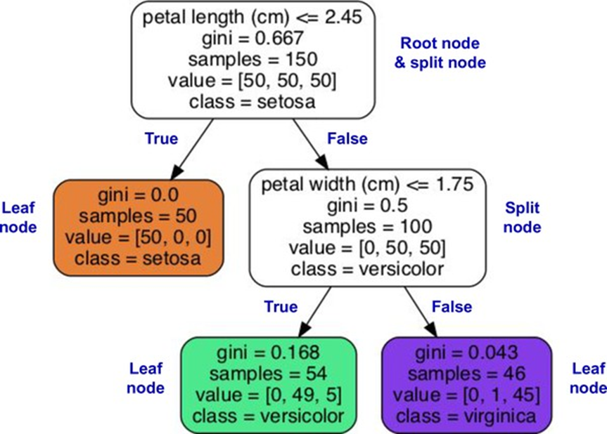

<!-- tabs:start -->

#### ** 📖 Lý thuyết **
# CHƯƠNG 6. CÂY QUYẾT ĐỊNH

Cây quyết định là các thuật toán học máy linh hoạt có thể thực hiện
cả tác vụ phân loại và hồi quy, và thậm chí cả các tác vụ đa đầu ra. Chúng là
các thuật toán mạnh mẽ, có khả năng khớp các tập dữ liệu phức tạp. Ví dụ, trong
Chương 2 bạn đã huấn luyện một mô hình DecisionTreeRegressor trên tập dữ liệu
California housing, khớp nó một cách hoàn hảo (thực ra, quá khớp nó). Cây quyết
định cũng là các thành phần cơ bản của rừng ngẫu nhiên (xem Chương 7), là một
trong những thuật toán học máy mạnh mẽ nhất hiện có. Trong chương này, chúng ta
sẽ bắt đầu bằng cách thảo luận về cách huấn luyện, trực quan hóa và đưa ra dự
đoán bằng cây quyết định. Sau đó, chúng ta sẽ đi qua thuật toán huấn luyện CART
được sử dụng bởi Scikit-Learn, và chúng ta sẽ khám phá cách chính quy hóa cây
và sử dụng chúng cho các tác vụ hồi quy. Cuối cùng, chúng ta sẽ thảo luận về một
số hạn chế của cây quyết định.


### Huấn luyện và trực quan hóa cây quyết định

Để hiểu cây quyết định, hãy xây dựng một cây và xem cách nó đưa ra dự
đoán. Đoạn mã sau đây huấn luyện một DecisionTreeClassifier trên tập dữ liệu
iris (xem Chương 4):


sklearn.datasets import load_iris sklearn.tree import
DecisionTreeClassifier


iris = load_iris(as_frame=True) X_iris = iris.data[[“petal length
(cm)”, “petal width (cm)”]].values y_iris = iris.target


tree_clf = DecisionTreeClassifier(max_depth=2, random_state=42)
tree_clf.fit(X_iris, y_iris)


Bạn có thể trực quan hóa cây quyết định đã được huấn luyện bằng cách
trước tiên sử dụng hàm export_graphviz() để xuất một tệp định nghĩa đồ thị có
tên iris_tree.dot:


from sklearn.tree import export_graphviz


export_graphviz( tree_clf, out_file=“iris_tree.dot”,
feature_names=[“petal length (cm)”, “petal width (cm)”],
class_names=iris.target_names, rounded=True, filled=True )


Sau đó, bạn có thể sử dụng graphviz.Source.from_file() để tải và hiển
thị tệp trong sổ tay Jupyter:


from graphviz import Source


Source.from_file(“iris_tree.dot”)


Graphviz là một gói phần mềm trực quan hóa đồ thị mã nguồn mở. Nó
cũng bao gồm một công cụ dòng lệnh dot để chuyển đổi các tệp .dot sang nhiều định
dạng khác nhau, chẳng hạn như PDF hoặc PNG. Cây quyết định đầu tiên của bạn
trông giống như Hình 6-1.





*Hình 6-1. Cây quyết định Iris*


### Đưa ra dự đoán

Hãy xem cây được biểu thị trong Hình 6-1 đưa ra dự đoán như thế nào.
Giả sử bạn tìm thấy một bông hoa iris và bạn muốn phân loại nó dựa trên cánh
hoa của nó. Bạn bắt đầu ở nút gốc (độ sâu 0, ở trên cùng): nút này hỏi liệu chiều
dài cánh hoa của bông hoa có nhỏ hơn 2.45 cm hay không. Nếu có, thì bạn di chuyển
xuống nút con bên trái của gốc (độ sâu 1, bên trái). Trong trường hợp này, đó
là một nút lá (tức là nó không có bất kỳ nút con nào), vì vậy nó không hỏi bất
kỳ câu hỏi nào: chỉ cần nhìn vào lớp dự đoán cho nút đó, và cây quyết định dự
đoán rằng bông hoa của bạn là một Iris setosa (class=setosa). Bây giờ giả sử bạn
tìm thấy một bông hoa khác, và lần này chiều dài cánh hoa lớn hơn 2.45 cm. Bạn
lại bắt đầu ở nút gốc nhưng bây giờ di chuyển xuống nút con bên phải của nó (độ
sâu 1, bên phải). Đây không phải là một nút lá, nó là một nút phân tách, vì vậy
nó hỏi một câu hỏi khác: chiều rộng cánh hoa có nhỏ hơn 1.75 cm không? Nếu có,
thì bông hoa của bạn rất có thể là một Iris versicolor (độ sâu 2, bên trái). Nếu
không, nó có thể là một Iris virginica (độ sâu 2, bên phải). Nó thực sự đơn giản
như vậy.


Thuộc tính samples của một nút đếm số lượng trường hợp huấn luyện mà
nó áp dụng. Ví dụ, 100 trường hợp huấn luyện có chiều dài cánh hoa lớn hơn 2.45
cm (độ sâu 1, bên phải), và trong số 100 trường hợp đó, 54 trường hợp có chiều
rộng cánh hoa nhỏ hơn 1.75 cm (độ sâu 2, bên trái). Thuộc tính value của một
nút cho bạn biết có bao nhiêu trường hợp huấn luyện của mỗi lớp mà nút này áp dụng:
ví dụ, nút dưới cùng bên phải áp dụng cho 0 Iris setosa, 1 Iris versicolor và
45 Iris virginica. Cuối cùng, thuộc tính gini của một nút đo độ không tinh khiết
Gini của nó: một nút là “thuần khiết” (gini=0) nếu tất cả các trường hợp huấn
luyện mà nó áp dụng thuộc cùng một lớp. Ví dụ, vì nút bên trái ở độ sâu 1 chỉ
áp dụng cho các trường hợp huấn luyện Iris setosa, nó là thuần khiết và độ
không tinh khiết Gini của nó là 0. Phương trình 6-1 cho thấy cách thuật toán huấn
luyện tính toán độ không tinh khiết Gini Gi của nút thứ i. Nút bên trái ở độ
sâu 2 có độ không tinh khiết Gini bằng 

 .


Phương trình 6-1. Độ không tinh khiết Gini


Trong phương trình này:


·        


 là độ không tinh khiết Gini của
nút thứ i.


·        


 là tỷ lệ các trường hợp thuộc
lớp k trong số các trường hợp huấn luyện ở nút thứ i.


![Hình 6-2 cho thấy các đường biên quyết định của cây quyết định này.
Đường dọc dày biểu thị đường biên quyết định của nút gốc (độ sâu 0): chiều dài
cánh hoa = 2.45 cm. Vì khu vực bên trái là thuần khiết (chỉ Iris setosa), nó
không thể được phân chia thêm nữa. Tuy nhiên, khu vực bên phải là không thuần
khiết, vì vậy nút bên phải ở độ sâu 1 phân chia nó tại chiều rộng cánh hoa =
1.75 cm (được biểu thị bằng đường nét đứt). Vì max_depth được đặt thành 2, cây
quyết định dừng lại ở đó. Nếu bạn đặt max_depth thành 3, thì hai nút ở độ sâu 2
sẽ thêm một đường biên quyết định khác (được biểu thị bằng hai đường chấm chấm
dọc).](../Figures/CH06/Hinh_6-2.png)


*Hình 6-2 cho thấy các đường biên quyết định của cây quyết định này.
Đường dọc dày biểu thị đường biên quyết định của nút gốc (độ sâu 0): chiều dài
cánh hoa = 2.45 cm. Vì khu vực bên trái là thuần khiết (chỉ Iris setosa), nó
không thể được phân chia thêm nữa. Tuy nhiên, khu vực bên phải là không thuần
khiết, vì vậy nút bên phải ở độ sâu 1 phân chia nó tại chiều rộng cánh hoa =
1.75 cm (được biểu thị bằng đường nét đứt). Vì max_depth được đặt thành 2, cây
quyết định dừng lại ở đó. Nếu bạn đặt max_depth thành 3, thì hai nút ở độ sâu 2
sẽ thêm một đường biên quyết định khác (được biểu thị bằng hai đường chấm chấm
dọc).*


*Hình 6-2. Đường biên quyết định
của cây quyết định*


### Ước tính xác suất lớp

Một cây quyết định cũng có thể ước tính xác suất một trường hợp thuộc
về một lớp 

 cụ thể. Đầu tiên, nó duyệt
cây để tìm nút lá cho trường hợp này, sau đó nó trả về tỷ lệ các trường hợp huấn
luyện thuộc lớp 

 trong nút này. Ví dụ, giả sử
bạn tìm thấy một bông hoa có cánh dài 5 cm và rộng 1.5 cm. Nút lá tương ứng là
nút bên trái ở độ sâu 2, vì vậy cây quyết định xuất ra các xác suất sau: 0% cho
Iris setosa (0/54), 90.7% cho Iris versicolor (49/54), và 9.3% cho Iris
virginica (5/54). Và nếu bạn yêu cầu nó dự đoán lớp, nó sẽ xuất ra Iris
versicolor (lớp 1) vì nó có xác suất cao nhất. Hãy kiểm tra điều này:


```python
>>>
tree_clf.predict_proba([[5, 1.5]]).round(3)
array([[0. , 0.907, 0.093]])

>>> tree_clf.predict([[5, 1.5]])
array([1])
```

Hoàn hảo! Lưu ý rằng các xác suất ước tính sẽ giống
hệt nhau ở bất kỳ vị trí nào khác trong hình chữ nhật dưới cùng bên phải của
Hình 6-2—ví dụ, nếu cánh hoa dài 6 cm và rộng 1.5 cm (mặc dù rõ ràng là trong
trường hợp này nó rất có thể là một Iris virginica).


### Thuật toán huấn luyện CART

Scikit-Learn sử dụng thuật toán Cây phân loại và hồi quy (CART) để
huấn luyện cây quyết định (còn gọi là “phát triển” cây). Thuật toán hoạt động bằng
cách đầu tiên chia tập huấn luyện thành hai tập con bằng cách sử dụng một đặc
trưng 

 duy nhất và một ngưỡng 

 (ví dụ: “chiều dài cánh hoa 

 2.45 cm”). Làm thế nào để nó
chọn 

 và 

 ? Nó tìm kiếm cặp 

 tạo ra các tập con thuần khiết
nhất, có trọng số theo kích thước của chúng. Phương trình 6-2 đưa ra hàm chi
phí mà thuật toán cố gắng tối thiểu hóa.


Phương trình 6-2. Hàm chi phí CART cho phân loại


Trong đó:


·        


 đo độ không tinh khiết của tập
con trái/phải


·        


 là số lượng trường hợp trong
tập con trái/phải


Một khi thuật toán CART đã chia tập huấn luyện thành hai thành công,
nó sẽ chia các tập con bằng cách sử dụng logic tương tự, sau đó là các tập
con-con, cứ thế tiếp tục một cách đệ quy. Nó dừng đệ quy khi đạt đến độ sâu tối
đa (được định nghĩa bởi siêu tham số max_depth), hoặc nếu
nó không thể tìm thấy một cách chia nào làm giảm độ không tinh khiết. Một vài
siêu tham số khác (sẽ được mô tả ngay sau đây) kiểm soát các điều kiện dừng bổ
sung: min_samples_split, min_samples_leaf, min_weight_fraction_leaf, và max_leaf_nodes.


### Độ phức tạp tính toán

Việc đưa ra dự đoán đòi hỏi phải duyệt cây quyết định từ gốc đến một
nút lá. Cây quyết định thường cân bằng gần đúng, vì vậy việc duyệt cây quyết định
đòi hỏi phải đi qua khoảng 

 nút, trong đó 

 là logarit nhị phân của 

 , bằng 

 . Vì mỗi nút chỉ yêu cầu kiểm
tra giá trị của một đặc trưng, độ phức tạp dự đoán tổng thể là 

 , không phụ thuộc vào số lượng
đặc trưng. Vì vậy, dự đoán rất nhanh, ngay cả khi xử lý các tập huấn luyện lớn.
Thuật toán huấn luyện so sánh tất cả các đặc trưng (hoặc ít hơn nếu max_features được đặt) trên tất cả các mẫu tại mỗi nút. So sánh tất cả các đặc
trưng trên tất cả các mẫu tại mỗi nút dẫn đến độ phức tạp huấn luyện là 

 .


### Độ không tinh khiết Gini hay Entropy?

Theo mặc định, lớp DecisionTreeClassifier sử dụng độ đo độ
không tinh khiết Gini, nhưng bạn có thể chọn độ đo độ không tinh khiết entropy
thay thế bằng cách đặt siêu tham số criterion thành
“entropy”. Khái niệm entropy bắt nguồn từ nhiệt động lực học như một độ đo sự hỗn
loạn phân tử: entropy tiến gần về 0 khi các phân tử đứng yên và được sắp xếp tốt.
Entropy sau đó lan rộng sang nhiều lĩnh vực khác nhau, bao gồm lý thuyết thông
tin của Shannon, nơi nó đo lượng thông tin trung bình của một thông điệp, như
chúng ta đã thấy trong Chương 4. Entropy bằng 0 khi tất cả các thông điệp giống
hệt nhau. Trong học máy, entropy thường được sử dụng làm độ đo độ không tinh
khiết: entropy của một tập hợp bằng 0 khi nó chỉ chứa các trường hợp của một lớp.
Phương trình 6-3 cho thấy định nghĩa entropy của nút thứ 

 . Ví dụ, nút bên trái ở độ
sâu 2 trong Hình 6-1 có entropy bằng 

 . Phương trình 6-3. Entropy


Vậy, bạn nên sử dụng độ không tinh khiết Gini hay entropy? Sự thật
là, hầu hết thời gian nó không tạo ra sự khác biệt lớn: chúng dẫn đến các cây
tương tự. Độ không tinh khiết Gini nhanh hơn một chút để tính toán, vì vậy đó
là một lựa chọn mặc định tốt. Tuy nhiên, khi chúng khác nhau, độ không tinh khiết
Gini có xu hướng cô lập lớp phổ biến nhất trong nhánh riêng của cây, trong khi
entropy có xu hướng tạo ra các cây cân bằng hơn một chút.


### Siêu tham số chính quy hóa

Cây quyết định đưa ra rất ít giả định về dữ liệu huấn luyện (ngược lại
với các mô hình tuyến tính, giả định rằng dữ liệu là tuyến tính, chẳng hạn). Nếu
không bị ràng buộc, cấu trúc cây sẽ tự điều chỉnh theo dữ liệu huấn luyện, khớp
nó rất chặt chẽ—thực tế, rất có thể là quá khớp. Một mô hình như vậy thường được
gọi là mô hình phi tham số, không phải vì nó không có bất kỳ tham số nào (nó
thường có rất nhiều) mà vì số lượng tham số không được xác định trước khi huấn
luyện, vì vậy cấu trúc mô hình có thể tự do bám sát dữ liệu. Ngược lại, một mô
hình tham số, chẳng hạn như mô hình tuyến tính, có số lượng tham số được xác định
trước, vì vậy mức độ tự do của nó bị hạn chế, giảm nguy cơ quá khớp (nhưng tăng
nguy cơ dưới khớp). Để tránh quá khớp dữ liệu huấn luyện, bạn cần hạn chế sự tự
do của cây quyết định trong quá trình huấn luyện. Như bạn đã biết, điều này được
gọi là chính quy hóa. Các siêu tham số chính quy hóa phụ thuộc vào thuật toán
được sử dụng, nhưng nói chung bạn có thể ít nhất hạn chế độ sâu tối đa của cây
quyết định. Trong Scikit-Learn, điều này được kiểm soát bởi siêu tham số max_depth. Giá trị mặc định là None, có nghĩa là không giới hạn. Giảm max_depth sẽ chính quy hóa mô hình và do đó giảm nguy cơ quá khớp. Lớp DecisionTreeClassifier có một vài tham số khác tương tự hạn chế hình dạng của cây quyết định:


·        
max_features: Số lượng đặc trưng tối đa được đánh giá để phân chia tại mỗi nút.


·        
max_leaf_nodes: Số lượng nút lá tối đa.


·        
min_samples_split: Số lượng mẫu tối thiểu mà một nút phải có trước khi nó có thể được
phân chia.


·        
min_samples_leaf: Số lượng mẫu tối thiểu mà một nút lá phải có để được tạo.


·        
min_weight_fraction_leaf: Tương tự như min_samples_leaf nhưng được biểu thị dưới
dạng một phần của tổng số lượng trường hợp có trọng số. Tăng các siêu tham số min_* hoặc giảm các siêu tham số max_* sẽ chính quy
hóa mô hình.


Hãy kiểm tra chính quy hóa trên tập dữ liệu
moons, được giới thiệu trong Chương 5. Chúng ta sẽ huấn luyện một cây quyết định
không có chính quy hóa, và một cây khác với min_samples_leaf=5. Đây là đoạn mã; Hình 6-3 cho thấy các đường biên quyết định của mỗi
cây:


```python
from sklearn.datasets import
make_moons

X_moons, y_moons = make_moons(n_samples=150,
noise=0.2, random_state=42)

tree_clf1 = DecisionTreeClassifier(random_state=42)
tree_clf2 =
DecisionTreeClassifier(min_samples_leaf=5, random_state=42)
tree_clf1.fit(X_moons, y_moons)
tree_clf2.fit(X_moons, y_moons)
```


*Hình 6-3. Đường biên quyết định
của một cây không chính quy hóa (trái) và một cây chính quy hóa (phải)*

Mô hình không chính quy hóa ở bên trái rõ ràng
đang bị quá khớp, và mô hình chính quy hóa ở bên phải có thể sẽ tổng quát hóa tốt
hơn. Chúng ta có thể xác minh điều này bằng cách đánh giá cả hai cây trên một tập
kiểm tra được tạo bằng cách sử dụng một hạt giống ngẫu nhiên khác:


```python
>>> X_moons_test,
y_moons_test = make_moons(n_samples=1000, noise=0.2, random_state=43)

>>> tree_clf1.score(X_moons_test,
y_moons_test)
0.898

>>> tree_clf2.score(X_moons_test,
y_moons_test)
0.92
```

Thực vậy, cây thứ hai có độ chính xác tốt hơn
trên tập kiểm tra.


### Hồi quy

Cây quyết định cũng có khả năng thực hiện các tác
vụ hồi quy. Hãy xây dựng một cây hồi quy sử dụng lớp DecisionTreeRegressor của Scikit-Learn, huấn luyện nó trên một tập dữ liệu bậc hai nhiễu
với max_depth=2:


```python
DecisionTreeRegressor

np.random.seed(42)
X_quad = np.random.rand(200, 1) - 0.5 # một đặc trưng
đầu vào ngẫu nhiên duy nhất
y_quad = X_quad ** 2 + 0.025 * np.random.randn(200,
1)

tree_reg = DecisionTreeRegressor(max_depth=2,
random_state=42)
tree_reg.fit(X_quad, y_quad)
```

Cây kết quả được biểu thị trong Hình 6-4.


*Hình 6-4. Một cây quyết định
cho hồi quy*

Cây này trông rất giống với cây phân loại mà bạn đã xây dựng trước
đó. Sự khác biệt chính là thay vì dự đoán một lớp trong mỗi nút, nó dự đoán một
giá trị. Ví dụ, giả sử bạn muốn đưa ra dự đoán cho một trường hợp mới với 

 . Nút gốc hỏi liệu 

 hay không. Vì không phải, thuật
toán đi đến nút con bên phải, nút này hỏi liệu 

 . Vì có, thuật toán đi đến
nút con bên trái. Đây là một nút lá, và nó dự đoán giá trị = 0.111. Dự đoán này
là giá trị mục tiêu trung bình của 110 trường hợp huấn luyện liên quan đến nút
lá này, và nó dẫn đến một sai số bình phương trung bình bằng 0.015 trên 110 trường
hợp này. Các dự đoán của mô hình này được biểu thị ở bên trái trong Hình 6-5. Nếu
bạn đặt max_depth=3, bạn sẽ nhận được các dự
đoán được biểu thị ở bên phải. Lưu ý rằng giá trị dự đoán cho mỗi vùng luôn là
giá trị mục tiêu trung bình của các trường hợp trong vùng đó. Thuật toán chia mỗi
vùng theo cách làm cho hầu hết các trường hợp huấn luyện gần nhất có thể với
giá trị dự đoán đó.


*Hình 6-5. Dự đoán của hai mô
hình hồi quy cây quyết định*

Thuật toán CART hoạt động như đã mô tả trước đó, ngoại trừ việc thay
vì cố gắng chia tập huấn luyện theo cách giảm thiểu độ không tinh khiết, giờ
đây nó cố gắng chia tập huấn luyện theo cách giảm thiểu MSE. Phương trình 6-4
cho thấy hàm chi phí mà thuật toán cố gắng tối thiểu hóa. Phương trình 6-4. Hàm
chi phí CART cho hồi quy


Cũng giống như đối với các tác vụ phân loại, cây quyết định dễ bị
quá khớp khi xử lý các tác vụ hồi quy. Nếu không có bất kỳ chính quy hóa nào (tức
là sử dụng các siêu tham số mặc định), bạn sẽ nhận được các dự đoán ở bên trái
trong Hình 6-6. Những dự đoán này rõ ràng đang quá khớp tập huấn luyện rất tệ.
Chỉ cần đặt min_samples_leaf=10 sẽ tạo ra một mô
hình hợp lý hơn nhiều, được biểu thị ở bên phải trong Hình 6-6.


*Hình 6-6. Dự đoán của một cây
hồi quy không chính quy hóa (trái) và một cây được chính quy hóa (phải)*


### Độ nhạy với hướng trục

Hy vọng bây giờ bạn đã bị thuyết phục rằng cây quyết định có rất nhiều
ưu điểm: chúng tương đối dễ hiểu và giải thích, đơn giản để sử dụng, linh hoạt
và mạnh mẽ. Tuy nhiên, chúng có một vài hạn chế. Đầu tiên, như bạn có thể đã nhận
thấy, cây quyết định thích các đường biên quyết định trực giao (tất cả các phân
chia đều vuông góc với một trục), điều này làm cho chúng nhạy cảm với hướng của
dữ liệu. Ví dụ, Hình 6-7 cho thấy một tập dữ liệu có thể phân tách tuyến tính
đơn giản: ở bên trái, một cây quyết định có thể chia nó dễ dàng, trong khi ở
bên phải, sau khi tập dữ liệu được xoay 45°, đường biên quyết định trông không
cần thiết. Mặc dù cả hai cây quyết định đều khớp tập huấn luyện hoàn hảo, rất
có khả năng mô hình bên phải sẽ không tổng quát hóa tốt.


*Hình 6-7. Độ nhạy với việc
xoay tập huấn luyện*

Một cách để hạn chế vấn đề này là chuẩn hóa dữ liệu, sau đó áp dụng
phép biến đổi phân tích thành phần chính (PCA). Chúng ta sẽ xem xét PCA chi tiết
trong Chương 8, nhưng hiện tại bạn chỉ cần biết rằng nó xoay dữ liệu theo cách
giảm sự tương quan giữa các đặc trưng, điều này thường (không phải luôn luôn)
làm cho mọi thứ dễ dàng hơn cho cây. Hãy tạo một pipeline nhỏ để chuẩn hóa dữ
liệu và xoay nó bằng PCA, sau đó huấn luyện một DecisionTreeClassifier trên dữ liệu đó. Hình 6-8 cho thấy các đường biên quyết định của
cây đó: như bạn có thể thấy, việc xoay giúp có thể khớp tập dữ liệu khá tốt chỉ
bằng một đặc trưng, 

 , là một hàm tuyến tính của
chiều dài và chiều rộng cánh hoa gốc. Đây là đoạn mã:


```python
sklearn.decomposition import PCA
sklearn.pipeline import make_pipeline
sklearn.preprocessing import StandardScaler

pca_pipeline = make_pipeline(StandardScaler(), PCA())
X_iris_rotated = pca_pipeline.fit_transform(X_iris)
tree_clf_pca = DecisionTreeClassifier(max_depth=2,
random_state=42)
tree_clf_pca.fit(X_iris_rotated, y_iris)
```


*Hình 6-8. Đường biên quyết định
của cây trên tập dữ liệu iris đã được chuẩn hóa và xoay PCA*


### Cây quyết định có phương sai cao

Tổng quát hơn, vấn đề chính với cây quyết định là chúng có phương
sai khá cao: những thay đổi nhỏ đối với các siêu tham số hoặc dữ liệu có thể tạo
ra các mô hình rất khác nhau. Trên thực tế, vì thuật toán huấn luyện được sử dụng
bởi Scikit-Learn là ngẫu nhiên—nó chọn ngẫu nhiên tập hợp các đặc trưng để đánh
giá tại mỗi nút—ngay cả việc huấn luyện lại cùng một cây quyết định trên cùng một
dữ liệu cũng có thể tạo ra một mô hình rất khác, chẳng hạn như mô hình được biểu
thị trong Hình 6-9 (trừ khi bạn đặt siêu tham số random_state). Như bạn có thể thấy, nó trông rất khác so với cây quyết định trước
đó (Hình 6-2).


*Hình 6-9. Huấn luyện lại cùng
một mô hình trên cùng dữ liệu có thể tạo ra một mô hình rất khác*

May mắn thay, bằng cách tính trung bình các dự đoán trên nhiều cây,
có thể giảm đáng kể phương sai. Một tập hợp các cây như vậy được gọi là rừng ngẫu
nhiên, và nó là một trong những loại mô hình mạnh mẽ nhất hiện có, như bạn sẽ
thấy trong chương tiếp theo.


### Bài tập

1.     
Độ sâu xấp xỉ của một cây quyết
định được huấn luyện (không giới hạn) trên một tập huấn luyện với một triệu trường
hợp là bao nhiêu?


2.     
Độ không tinh khiết Gini của một
nút thường thấp hơn hay cao hơn so với nút cha của nó? Nó thường thấp hơn/cao
hơn, hay luôn luôn thấp hơn/cao hơn?


3.     
Nếu một cây quyết định đang quá
khớp tập huấn luyện, có phải là một ý hay khi thử giảm max_depth không?


4.     
Nếu một cây quyết định đang dưới
khớp tập huấn luyện, có phải là một ý hay khi thử chuẩn hóa các đặc trưng đầu
vào không?


5.     
Nếu mất một giờ để huấn luyện một
cây quyết định trên một tập huấn luyện chứa một triệu trường hợp, thì sẽ mất
khoảng bao nhiêu thời gian để huấn luyện một cây quyết định khác trên một tập
huấn luyện chứa mười triệu trường hợp? Gợi ý: xem xét độ phức tạp tính toán của
thuật toán CART.


6.     
Nếu mất một giờ để huấn luyện một
cây quyết định trên một tập huấn luyện nhất định, thì sẽ mất khoảng bao nhiêu
thời gian nếu bạn tăng gấp đôi số lượng đặc trưng?


7.     
Huấn luyện và tinh chỉnh một
cây quyết định cho tập dữ liệu moons bằng cách làm theo các bước sau: a. Sử dụng
make_moons(n_samples=10000,
noise=0.4) để tạo một tập dữ liệu moons. b. Sử dụng
train_test_split() để chia tập dữ liệu thành một tập huấn luyện và một tập kiểm tra.
c. Sử dụng tìm kiếm lưới với xác thực chéo (với sự trợ giúp của lớp GridSearchCV) để tìm các giá trị siêu tham số tốt cho một DecisionTreeClassifier. Gợi ý: thử các giá trị khác nhau cho max_leaf_nodes. d. Huấn luyện nó trên toàn bộ tập huấn luyện bằng cách sử dụng
các siêu tham số này, và đo hiệu suất của mô hình trên tập kiểm tra. Bạn sẽ đạt
được độ chính xác khoảng 85% đến 87%.


8.     
Phát triển một rừng bằng cách
làm theo các bước sau: a. Tiếp tục bài tập trước, tạo 1.000 tập con của tập huấn
luyện, mỗi tập con chứa 100 trường hợp được chọn ngẫu nhiên. Gợi ý: bạn có thể
sử dụng lớp ShuffleSplit của Scikit-Learn cho việc
này. b. Huấn luyện một cây quyết định trên mỗi tập con, sử dụng các giá trị
siêu tham số tốt nhất được tìm thấy trong bài tập trước. Đánh giá 1.000 cây quyết
định này trên tập kiểm tra. Vì chúng được huấn luyện trên các tập nhỏ hơn, các
cây quyết định này có thể sẽ hoạt động kém hơn cây quyết định đầu tiên, chỉ đạt
độ chính xác khoảng 80%. c. Bây giờ đến phần kỳ diệu. Đối với mỗi trường hợp
tập kiểm tra, tạo các dự đoán của 1.000 cây quyết định, và chỉ giữ lại dự đoán
phổ biến nhất (bạn có thể sử dụng hàm mode() của SciPy cho
việc này). Cách tiếp cận này cho bạn các dự đoán bỏ phiếu đa số trên tập kiểm
tra. d. Đánh giá các dự đoán này trên tập kiểm tra: bạn sẽ đạt được độ
chính xác cao hơn một chút so với mô hình đầu tiên của bạn (cao hơn khoảng 0.5
đến 1.5%). Chúc mừng, bạn đã huấn luyện một bộ phân loại rừng ngẫu nhiên! Các
giải pháp cho các bài tập này có sẵn ở cuối sổ tay của chương này, tại https://homl.info/colab3 .

#### ** 🎦 Slide Bài Giảng **
<object data="TaiLieu/slideML/Slide_ML_Chap06.pdf#view=FitH" type="application/pdf" class="pdf-container">
    <p>Trình duyệt của bạn không hỗ trợ xem PDF nhúng. <a href="TaiLieu/slideML/Slide_ML_Chap06.pdf" target="_blank">Nhấn vào đây để tải Slide Bài Giảng</a>.</p>
</object>
<p style="text-align: right;"><a href="TaiLieu/slideML/Slide_ML_Chap06.pdf" target="_blank" style="font-weight: bold; color: #1a73e8;">📥 Tải về Slide Bài Giảng (PDF)</a></p>

#### ** 🎥 Video **

<iframe src="Video/Chapter_06/index.html" width="100%" height="600px" style="border: none; border-radius: 8px; box-shadow: 0 4px 12px rgba(0,0,0,0.1);" allowfullscreen></iframe>


#### ** 📝 Trắc nghiệm **

<iframe src="quizzes/Chapter06/index.html" style="width: 100%; min-height: 700px; border: none; border-radius: 8px; box-shadow: 0 4px 12px rgba(0,0,0,0.15);"></iframe>

#### ** 💻 Thực hành **

<div class="practice-container" style="background: #f8faff; border: 1px solid #cce0ff; border-radius: 8px; padding: 20px; margin-top: 15px;">
  <div style="display:flex; justify-content:space-between; align-items:center; flex-wrap:wrap; gap:10px;">
    <h3 style="margin-top:0; color: #1a73e8; display:flex; align-items:center; gap:8px; margin-bottom:0;">🚀 Bài tập Thực hành Jupyter Notebook</h3>
    <div class="lang-toggle" style="display:flex; gap:8px;">
      <button id="btn-vn" onclick="togglePracticeLang('VN')" style="background: #fbbc04; color: #fff; border:none; padding:6px 12px; border-radius:20px; cursor:pointer; font-weight:bold; transition:all 0.2s;">🇻🇳 VN</button>
      <button id="btn-en" onclick="togglePracticeLang('EN')" style="background: #f1f3f4; color: #5f6368; border:none; padding:6px 12px; border-radius:20px; cursor:pointer; font-weight:bold; opacity: 0.4; transition:all 0.2s;">🇬🇧 EN</button>
    </div>
  </div>
  <p style="margin-top: 10px;">Dưới đây là các sổ tay (notebook) chứa mã nguồn Python thực hành cho chương này. Bạn có thể mở trực tiếp trên Google Colab để chạy thử nghiệm, hoặc tải file về máy.</p>
  
  <ul id="notebook-list-VN" style="list-style-type: none; padding-left: 0; display: block;">
    <li style="margin-bottom: 15px; padding: 15px; background: white; border-radius: 6px; box-shadow: 0 2px 4px rgba(0,0,0,0.05);">
      <strong style="font-size:16px;">Thực hành: 1. Decision Trees</strong><br>
      <div style="margin-top: 10px; display: flex; gap: 10px; flex-wrap: wrap;">
        <a href="https://colab.research.google.com/github/tranthanhthangbmt/M-n-M-y-h-c_2026/blob/main/machineLearningWeb/TaiLieu/NotebookJupyter/06_decision_trees_VN.ipynb" target="_blank" style="background: #fbbc04; color: #fff; padding: 6px 14px; border-radius: 6px; text-decoration: none; font-size: 14px; font-weight: 600; box-shadow: 0 2px 4px rgba(251,188,4,0.3);">🔥 Mở trên Google Colab</a>
        <a href="TaiLieu/NotebookJupyter/06_decision_trees_VN.ipynb" download style="background: #1a73e8; color: white; padding: 6px 14px; border-radius: 6px; text-decoration: none; font-size: 14px; font-weight: 600; box-shadow: 0 2px 4px rgba(26,115,232,0.3);">💾 Tải file .ipynb về máy</a>
      </div>
    </li>
  </ul>
  
  <ul id="notebook-list-EN" style="list-style-type: none; padding-left: 0; display: none;">
    <li style="margin-bottom: 15px; padding: 15px; background: white; border-radius: 6px; box-shadow: 0 2px 4px rgba(0,0,0,0.05);">
      <strong style="font-size:16px;">Thực hành: 1. Decision Trees</strong><br>
      <div style="margin-top: 10px; display: flex; gap: 10px; flex-wrap: wrap;">
        <a href="https://colab.research.google.com/github/tranthanhthangbmt/M-n-M-y-h-c_2026/blob/main/machineLearningWeb/TaiLieu/NotebookJupyter/06_decision_trees_EN.ipynb" target="_blank" style="background: #fbbc04; color: #fff; padding: 6px 14px; border-radius: 6px; text-decoration: none; font-size: 14px; font-weight: 600; box-shadow: 0 2px 4px rgba(251,188,4,0.3);">🔥 Mở trên Google Colab</a>
        <a href="TaiLieu/NotebookJupyter/06_decision_trees_EN.ipynb" download style="background: #1a73e8; color: white; padding: 6px 14px; border-radius: 6px; text-decoration: none; font-size: 14px; font-weight: 600; box-shadow: 0 2px 4px rgba(26,115,232,0.3);">💾 Tải file .ipynb về máy</a>
      </div>
    </li>
  </ul>

  <div style="margin-top: 20px; border-top: 1px dashed #cce0ff; padding-top: 15px;">
    <strong>Hoặc truy cập toàn bộ kho tài liệu:</strong> <a href="https://drive.google.com/drive/folders/1nRV7W748VkSldg-BaKdcejBV-sBP47_M?usp=sharing" target="_blank" style="color: #1a73e8; font-weight: bold;">Thư mục Google Drive Thực hành</a>
  </div>
</div>

<!-- tabs:end -->
