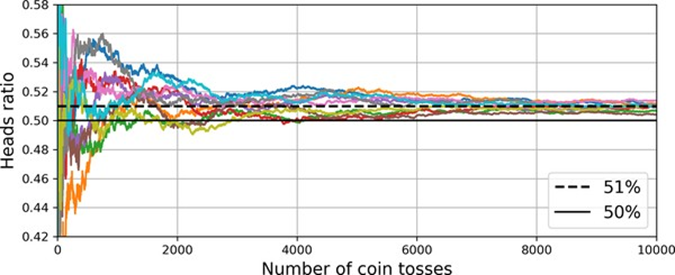

<!-- tabs:start -->

#### ** 📖 Lý thuyết **
# CHƯƠNG 7. HỌC TỔ HỢP VÀ RỪNG NGẪU NHIÊN

Giả sử bạn đặt một câu hỏi phức tạp cho hàng nghìn người ngẫu nhiên,
sau đó tổng hợp câu trả lời của họ. Trong nhiều trường hợp, bạn sẽ thấy rằng
câu trả lời tổng hợp này tốt hơn câu trả lời của một chuyên gia. Đây được gọi
là “sự khôn ngoan của đám đông”. Tương tự, nếu bạn tổng hợp các dự đoán của một
nhóm các bộ dự đoán (chẳng hạn như bộ phân loại hoặc bộ hồi quy), bạn thường sẽ
nhận được các dự đoán tốt hơn so với bộ dự đoán riêng lẻ tốt nhất. Một nhóm các
bộ dự đoán được gọi là một tập hợp (ensemble); do đó, kỹ thuật này được gọi là
học tổ hợp (ensemble learning), và một thuật toán học tổ hợp được gọi là một
phương pháp tổ hợp (ensemble method).


Ví dụ về một phương pháp tổ hợp, bạn có thể huấn luyện một nhóm các
bộ phân loại cây quyết định, mỗi bộ trên một tập con ngẫu nhiên khác nhau của tập
huấn luyện. Sau đó, bạn có thể lấy các dự đoán của tất cả các cây riêng lẻ, và
lớp nhận được nhiều phiếu bầu nhất là dự đoán của tập hợp (xem bài tập cuối
cùng trong Chương 6). Một tập hợp các cây quyết định như vậy được gọi là rừng
ngẫu nhiên, và mặc dù đơn giản, đây là một trong những thuật toán học máy mạnh
mẽ nhất hiện có.


Như đã thảo luận trong Chương 2, bạn thường sẽ sử dụng các phương
pháp tổ hợp gần cuối một dự án, một khi bạn đã xây dựng được một vài bộ dự đoán
tốt, để kết hợp chúng thành một bộ dự đoán thậm chí còn tốt hơn. Trên thực tế,
các giải pháp chiến thắng trong các cuộc thi học máy thường liên quan đến một số
phương pháp tổ hợp—nổi tiếng nhất trong cuộc thi Netflix Prize.


Trong chương này, chúng ta sẽ xem xét các phương pháp tổ hợp phổ biến
nhất, bao gồm bộ phân loại bỏ phiếu, các tập hợp bagging và pasting, rừng ngẫu
nhiên, và các tập hợp boosting và stacking.


### Bộ phân loại biểu quyết

Giả sử bạn đã huấn luyện một vài bộ phân loại, mỗi bộ đạt độ chính
xác khoảng 80%. Bạn có thể có một bộ phân loại hồi quy logistic, một bộ phân loại
SVM, một bộ phân loại rừng ngẫu nhiên, một bộ phân loại k-láng giềng gần nhất,
và có lẽ một vài bộ nữa (xem Hình 7-1).


*Hình 7-1. Huấn luyện các bộ
phân loại đa dạng*

Một cách rất đơn giản để tạo ra một bộ phân loại thậm chí còn tốt
hơn là tổng hợp các dự đoán của từng bộ phân loại: lớp nhận được nhiều phiếu bầu
nhất là dự đoán của tập hợp. Bộ phân loại bỏ phiếu đa số này được gọi là bộ
phân loại bỏ phiếu cứng (hard voting classifier) (xem Hình 7-2).


*Hình 7-2. Dự đoán của bộ phân
loại bỏ phiếu cứng*

Hơi đáng ngạc nhiên, bộ phân loại bỏ phiếu này thường đạt được độ
chính xác cao hơn so với bộ phân loại tốt nhất trong tập hợp. Trên thực tế,
ngay cả khi mỗi bộ phân loại là một bộ học yếu (weak learner) (nghĩa là nó chỉ
tốt hơn một chút so với đoán ngẫu nhiên), tập hợp vẫn có thể là một bộ học mạnh
(strong learner) (đạt độ chính xác cao), miễn là có đủ số lượng bộ học yếu
trong tập hợp và chúng đủ đa dạng.


Làm thế nào điều này có thể xảy ra? Phép tương tự sau đây có thể
giúp làm sáng tỏ bí ẩn này. Giả sử bạn có một đồng xu hơi lệch, có 51% cơ hội
ra mặt sấp và 49% cơ hội ra mặt ngửa. Nếu bạn tung nó 1.000 lần, bạn thường sẽ
nhận được ít nhiều 510 mặt sấp và 490 mặt ngửa, và do đó đa số là mặt sấp. Nếu
bạn tính toán, bạn sẽ thấy rằng xác suất thu được đa số mặt sấp sau 1.000 lần
tung là gần 75%. Bạn càng tung đồng xu nhiều, xác suất càng cao (ví dụ: với
10.000 lần tung, xác suất tăng lên hơn 97%). Điều này là do luật số lớn: khi bạn
tiếp tục tung đồng xu, tỷ lệ mặt sấp ngày càng gần với xác suất mặt sấp (51%).
Hình 7-3 cho thấy 10 chuỗi tung đồng xu lệch. Bạn có thể thấy rằng khi số lần
tung tăng, tỷ lệ mặt sấp tiến gần đến 51%. Cuối cùng, tất cả 10 chuỗi đều kết
thúc gần 51% đến mức chúng luôn cao hơn 50%.





*Hình 7-3. Luật số lớn*

Tương tự, giả sử bạn xây dựng một tập hợp chứa 1.000 bộ phân loại mà
từng bộ chỉ đúng 51% thời gian (chỉ tốt hơn một chút so với đoán ngẫu nhiên). Nếu
bạn dự đoán lớp được bỏ phiếu đa số, bạn có thể hy vọng đạt độ chính xác lên đến
75%! Tuy nhiên, điều này chỉ đúng nếu tất cả các bộ phân loại hoàn toàn độc lập,
mắc lỗi không tương quan, điều này rõ ràng không phải là trường hợp vì chúng được
huấn luyện trên cùng một dữ liệu. Chúng có khả năng mắc cùng loại lỗi, vì vậy sẽ
có nhiều phiếu bầu đa số cho lớp sai, làm giảm độ chính xác của tập hợp.


Scikit-Learn cung cấp một lớp VotingClassifier khá
dễ sử dụng: chỉ cần cung cấp cho nó một danh sách các cặp tên/bộ dự đoán, và sử
dụng nó như một bộ phân loại thông thường. Hãy thử nó trên tập dữ liệu moons
(được giới thiệu trong Chương 5). Chúng ta sẽ tải và chia tập dữ liệu moons
thành tập huấn luyện và tập kiểm tra, sau đó chúng ta sẽ tạo và huấn luyện một
bộ phân loại bỏ phiếu gồm ba bộ phân loại đa dạng:


```python
from sklearn.datasets import
make_moons
from sklearn.ensemble import RandomForestClassifier,
VotingClassifier
from sklearn.linear_model import LogisticRegression
from sklearn.model_selection import train_test_split
from sklearn.svm import SVC

X, y = make_moons(n_samples=500, noise=0.30,
random_state=42)
X_train, X_test, y_train, y_test =
train_test_split(X, y, random_state=42)

voting_clf = VotingClassifier(
   
estimators=[
        ('lr',
LogisticRegression(random_state=42)),
        ('rf',
RandomForestClassifier(random_state=42)),
        ('svc',
SVC(random_state=42))
    ]
)
voting_clf.fit(X_train, y_train)
```

Khi bạn huấn luyện một VotingClassifier, nó sẽ sao chép mọi bộ ước lượng và huấn luyện các bản sao. Các bộ
ước lượng gốc có sẵn thông qua thuộc tính estimators, trong khi
các bản sao đã được huấn luyện có sẵn thông qua thuộc tính estimators_. Nếu bạn thích một từ điển hơn là một danh sách, bạn có thể sử dụng
named_estimators hoặc named_estimators_ thay thế. Để bắt đầu,
hãy xem độ chính xác của từng bộ phân loại đã được huấn luyện trên tập kiểm
tra:


```python
>>> for name, clf in
voting_clf.named_estimators_.items():
...    
print(name, "=", clf.score(X_test, y_test))
...
lr = 0.864
rf = 0.896
svc = 0.896
```

Khi bạn gọi phương thức predict() của bộ phân loại bỏ phiếu, nó thực hiện bỏ phiếu cứng. Ví dụ, bộ
phân loại bỏ phiếu dự đoán lớp 1 cho trường hợp đầu tiên của tập kiểm tra, bởi
vì hai trong số ba bộ phân loại dự đoán lớp đó:


```python
>>>
voting_clf.predict(X_test[:1])
array([1])

>>> [clf.predict(X_test[:1]) for clf in
voting_clf.estimators_]
[array([1]), array([1]), array([0])]
```

Bây giờ hãy xem hiệu suất của bộ phân loại bỏ phiếu
trên tập kiểm tra:


```python
>>>
voting_clf.score(X_test, y_test)
0.912
```

Đó! Bộ phân loại bỏ phiếu vượt trội hơn tất cả
các bộ phân loại riêng lẻ. Nếu tất cả các bộ phân loại đều có khả năng ước tính
xác suất lớp (tức là nếu tất cả chúng đều có phương thức predict_proba()), thì bạn có thể yêu cầu Scikit-Learn dự đoán lớp có xác suất lớp
cao nhất, được tính trung bình trên tất cả các bộ phân loại riêng lẻ. Đây được
gọi là bỏ phiếu mềm (soft voting). Nó thường đạt được hiệu suất cao hơn bỏ phiếu
cứng vì nó ưu tiên hơn các phiếu bầu có độ tin cậy cao. Tất cả những gì bạn cần
làm là đặt siêu tham số voting của bộ phân loại bỏ phiếu thành
“soft”, và đảm bảo rằng tất cả các bộ phân loại đều có thể ước tính xác suất lớp.
Điều này không đúng với lớp SVC theo mặc định, vì vậy bạn cần đặt
siêu tham số probability của nó thành True (điều này sẽ làm cho lớp SVC sử dụng
cross-validation để ước tính xác suất lớp, làm chậm quá trình huấn luyện, và nó
sẽ thêm một phương thức predict_proba()). Hãy thử điều đó:


```python
>>> voting_clf.voting =
"soft"
>>>
voting_clf.named_estimators["svc"].probability = True
>>> voting_clf.fit(X_train, y_train)
>>> voting_clf.score(X_test, y_test)
0.92
```

Chúng ta đạt được độ chính xác 92% chỉ bằng cách
sử dụng bỏ phiếu mềm—không tệ!


### Túi hóa (Bagging) và Dán nhãn (Pasting)

Một cách để có được một tập hợp các bộ phân loại
đa dạng là sử dụng các thuật toán huấn luyện rất khác nhau, như vừa thảo luận.
Một cách tiếp cận khác là sử dụng cùng một thuật toán huấn luyện cho mỗi bộ dự
đoán nhưng huấn luyện chúng trên các tập con ngẫu nhiên khác nhau của tập huấn
luyện. Khi việc lấy mẫu được thực hiện có thay thế , phương pháp này được
gọi là túi hóa (bagging) (viết tắt của bootstrap aggregating ). Khi việc
lấy mẫu được thực hiện không thay thế, nó được gọi là dán nhãn
(pasting).


Nói cách khác, cả túi hóa và dán nhãn đều cho phép các trường hợp huấn
luyện được lấy mẫu nhiều lần trên nhiều bộ dự đoán, nhưng chỉ túi hóa mới cho
phép các trường hợp huấn luyện được lấy mẫu nhiều lần cho cùng một bộ dự đoán.
Quá trình lấy mẫu và huấn luyện này được biểu thị trong Hình 7-4.


*Hình 7-4. Túi hóa và dán nhãn
bao gồm việc huấn luyện nhiều bộ dự đoán trên các mẫu ngẫu nhiên khác nhau của
tập huấn luyện*

Sau khi tất cả các bộ dự đoán được huấn luyện, tập hợp có thể đưa ra
dự đoán cho một trường hợp mới bằng cách đơn giản tổng hợp các dự đoán của tất
cả các bộ dự đoán. Hàm tổng hợp thường là chế độ thống kê (statistical mode)
cho phân loại (tức là dự đoán thường xuyên nhất, giống như với bộ phân loại bỏ
phiếu cứng), hoặc giá trị trung bình cho hồi quy. Mỗi bộ dự đoán riêng lẻ
có độ lệch cao hơn nếu nó được huấn luyện trên tập huấn luyện gốc, nhưng tổng hợp
giúp giảm cả độ lệch và phương sai. Nói chung, kết quả cuối cùng là tập hợp có
độ lệch tương tự nhưng phương sai thấp hơn so với một bộ dự đoán duy nhất được
huấn luyện trên tập huấn luyện gốc.


Như bạn có thể thấy trong Hình 7-4, các bộ dự đoán đều có thể được
huấn luyện song song, thông qua các lõi CPU khác nhau hoặc thậm chí các máy chủ
khác nhau. Tương tự, các dự đoán có thể được đưa ra song song. Đây là một trong
những lý do tại sao túi hóa và dán nhãn là những phương pháp phổ biến như vậy:
chúng mở rộng rất tốt.


#### Túi hóa và Dán nhãn trong Scikit-Learn

Scikit-Learn cung cấp một API đơn giản cho cả túi hóa và dán nhãn: lớp
BaggingClassifier (hoặc BaggingRegressor cho hồi quy). Đoạn mã
sau đây huấn luyện một tập hợp gồm 500 bộ phân loại cây quyết định: mỗi bộ được
huấn luyện trên 100 trường hợp huấn luyện được lấy mẫu ngẫu nhiên từ tập huấn
luyện có thay thế (đây là một ví dụ về túi hóa, nhưng nếu bạn muốn sử dụng dán
nhãn thay vào đó, chỉ cần đặt bootstrap=False). Tham số n_jobs cho Scikit-Learn biết số lượng lõi CPU để sử dụng cho việc huấn luyện
và dự đoán, và –1 cho Scikit-Learn biết sử dụng tất cả các lõi có sẵn:


```python
from sklearn.ensemble import
BaggingClassifier
from sklearn.tree import DecisionTreeClassifier

bag_clf = BaggingClassifier(DecisionTreeClassifier(),
n_estimators=500,
                            max_samples=100,
n_jobs=-1, random_state=42)
bag_clf.fit(X_train, y_train)
```


*Hình 7-5 so sánh đường biên quyết định của một
cây quyết định đơn lẻ với đường biên quyết định của một tập hợp túi hóa gồm 500
cây (từ đoạn mã trước), cả hai đều được huấn luyện trên tập dữ liệu moons. Như
bạn có thể thấy, các dự đoán của tập hợp có khả năng tổng quát hóa tốt hơn nhiều
so với dự đoán của cây quyết định đơn lẻ: tập hợp có độ lệch tương đương nhưng
phương sai nhỏ hơn (nó mắc cùng số lỗi trên tập huấn luyện, nhưng đường biên
quyết định ít bất thường hơn). Túi hóa đưa vào một chút đa dạng hơn trong các tập
con mà mỗi bộ dự đoán được huấn luyện, vì vậy túi hóa cuối cùng có độ lệch cao
hơn một chút so với dán nhãn; nhưng sự đa dạng bổ sung cũng có nghĩa là các bộ
dự đoán cuối cùng ít tương quan hơn, do đó phương sai của tập hợp được giảm.
Nhìn chung, túi hóa thường mang lại các mô hình tốt hơn, điều này giải thích tại
sao nó thường được ưu tiên. Nhưng nếu bạn có thời gian rảnh và sức mạnh CPU, bạn
có thể sử dụng xác thực chéo để đánh giá cả túi hóa và dán nhãn và chọn cái nào
hoạt động tốt nhất.*


*Hình 7-5. Một cây quyết định
đơn lẻ (trái) so với một tập hợp túi hóa gồm 500 cây (phải)*


#### Đánh giá ngoài mẫu (Out-of-Bag
Evaluation)

Với túi hóa, một số trường hợp
huấn luyện có thể được lấy mẫu nhiều lần cho bất kỳ bộ dự đoán nhất định nào,
trong khi những trường hợp khác có thể không được lấy mẫu chút nào. Theo mặc định,
một BaggingClassifier lấy mẫu 

 trường hợp huấn luyện có thay
thế (bootstrap=True), trong đó 

 là kích thước của tập huấn
luyện. Với quy trình này, có thể chứng minh toán học rằng trung bình chỉ có khoảng
63% các trường hợp huấn luyện được lấy mẫu cho mỗi bộ dự đoán. 37% còn lại của
các trường hợp huấn luyện không được lấy mẫu được gọi là các trường hợp
ngoài mẫu (out-of-bag - OOB). Lưu ý rằng chúng không phải là cùng 37% đối với
tất cả các bộ dự đoán. Một tập hợp túi hóa có thể được đánh giá bằng cách sử dụng
các trường hợp OOB, không cần một tập xác thực riêng biệt: thực tế, nếu có đủ
các bộ ước lượng, thì mỗi trường hợp trong tập huấn luyện có thể sẽ là một trường
hợp OOB của một số bộ ước lượng, vì vậy các bộ ước lượng này có thể được sử dụng
để đưa ra một dự đoán tập hợp công bằng cho trường hợp đó. Một khi bạn có dự
đoán cho mỗi trường hợp, bạn có thể tính toán độ chính xác dự đoán của tập hợp
(hoặc bất kỳ số liệu nào khác). Trong Scikit-Learn, bạn có thể đặt oob_score=True khi tạo một BaggingClassifier để yêu cầu đánh giá
OOB tự động sau khi huấn luyện. Đoạn mã sau đây minh họa điều này. Điểm đánh
giá kết quả có sẵn trong thuộc tính oob_score_:


```python
>>> bag_clf =
BaggingClassifier(DecisionTreeClassifier(), n_estimators=500,
...                             oob_score=True,
n_jobs=-1, random_state=42)
...
>>> bag_clf.fit(X_train, y_train)
>>> bag_clf.oob_score_
0.896
```

Theo đánh giá OOB này, BaggingClassifier này có khả năng đạt độ chính xác khoảng 89.6% trên tập kiểm tra.
Hãy xác minh điều này:


```python
>>> from sklearn.metrics
import accuracy_score
>>> y_pred = bag_clf.predict(X_test)
>>> accuracy_score(y_test, y_pred)
0.92
```

Chúng ta đạt 92% độ chính xác trên tập kiểm tra.
Đánh giá OOB hơi quá bi quan, thấp hơn hơn 2%. Hàm quyết định OOB cho mỗi trường
hợp huấn luyện cũng có sẵn thông qua thuộc tính oob_decision_function_. Vì bộ ước lượng cơ sở có phương thức predict_proba(), hàm quyết định trả về xác suất lớp cho mỗi trường hợp huấn luyện.
Ví dụ, đánh giá OOB ước tính rằng trường hợp huấn luyện đầu tiên có 67.6% xác
suất thuộc về lớp dương và 32.4% xác suất thuộc về lớp âm:


```python
>>>
bag_clf.oob_decision_function_[:3] # probas for the first 3 instances
array([[0.32352941, 0.67647059],
      
[0.3375    , 0.6625    ],
       [1.        , 0.        ]])
```


#### Random Patches và Random Subspaces

Lớp BaggingClassifier cũng hỗ trợ lấy mẫu
các đặc trưng. Việc lấy mẫu được kiểm soát bởi hai siêu tham số: max_features và bootstrap_features. Chúng hoạt động
tương tự như max_samples và bootstrap, nhưng là để lấy mẫu đặc trưng thay vì lấy mẫu trường hợp. Do đó, mỗi
bộ dự đoán sẽ được huấn luyện trên một tập con ngẫu nhiên của các đặc trưng đầu
vào. Kỹ thuật này đặc biệt hữu ích khi bạn đang xử lý các đầu vào có chiều cao
(chẳng hạn như hình ảnh), vì nó có thể tăng tốc đáng kể quá trình huấn luyện. Lấy
mẫu cả các trường hợp huấn luyện và đặc trưng được gọi là phương pháp random
patches. Giữ tất cả các trường hợp huấn luyện (bằng cách đặt bootstrap=False và max_samples=1.0) nhưng lấy mẫu đặc trưng
(bằng cách đặt bootstrap_features thành True và/hoặc max_features thành một giá trị nhỏ hơn
1.0) được gọi là phương pháp random subspaces.


Việc lấy mẫu đặc trưng dẫn đến sự đa dạng của bộ dự đoán thậm chí
còn lớn hơn, đổi một chút độ lệch cao hơn lấy phương sai thấp hơn.


### Rừng ngẫu nhiên

Như chúng ta đã thảo luận, rừng ngẫu nhiên là một tập hợp các
cây quyết định, thường được huấn luyện thông qua phương pháp túi hóa (hoặc đôi
khi là dán nhãn), thường với max_samples được đặt bằng kích thước của
tập huấn luyện. Thay vì xây dựng một BaggingClassifier và
truyền cho nó một DecisionTreeClassifier, bạn có thể sử dụng
lớp RandomForestClassifier, tiện lợi hơn và
được tối ưu hóa cho cây quyết định (tương tự, có một lớp RandomForestRegressor cho các tác vụ hồi quy). Đoạn mã sau đây huấn luyện một bộ phân loại
rừng ngẫu nhiên với 500 cây, mỗi cây giới hạn tối đa 16 nút lá, sử dụng tất cả
các lõi CPU có sẵn:


```python
from sklearn.ensemble import
RandomForestClassifier

rnd_clf = RandomForestClassifier(n_estimators=500,
max_leaf_nodes=16,
                                n_jobs=-1,
random_state=42)
rnd_clf.fit(X_train, y_train)
y_pred_rf = rnd_clf.predict(X_test)
```

Với một vài ngoại lệ, một RandomForestClassifier có tất cả các siêu tham số của một DecisionTreeClassifier (để kiểm soát cách cây được phát triển), cộng với tất cả các siêu
tham số của một BaggingClassifier để kiểm soát chính tập
hợp. Thuật toán rừng ngẫu nhiên đưa thêm sự ngẫu nhiên khi phát triển cây; thay
vì tìm kiếm đặc trưng tốt nhất khi chia một nút (xem Chương 6), nó tìm kiếm đặc
trưng tốt nhất trong một tập con ngẫu nhiên của các đặc trưng. Theo mặc định,
nó lấy mẫu 

 đặc trưng (trong đó 

 là tổng số đặc trưng). Thuật
toán dẫn đến sự đa dạng cây lớn hơn, điều này (một lần nữa) đổi một độ lệch cao
hơn lấy phương sai thấp hơn, thường mang lại một mô hình tổng thể tốt hơn. Vì vậy,
BaggingClassifier sau đây tương đương với RandomForestClassifier trước đó:


```python
bag_clf = BaggingClassifier(
   
DecisionTreeClassifier(max_features="sqrt",
max_leaf_nodes=16),
   
n_estimators=500, n_jobs=-1, random_state=42
)
```


#### Cây ngẫu nhiên cực đại (Extra-Trees)

Khi bạn phát triển một cây trong rừng ngẫu nhiên,
tại mỗi nút chỉ một tập con ngẫu nhiên của các đặc trưng được xem xét để phân
chia (như đã thảo luận trước đó). Có thể làm cho cây thậm chí còn ngẫu nhiên
hơn bằng cách cũng sử dụng các ngưỡng ngẫu nhiên cho mỗi đặc trưng thay vì tìm
kiếm các ngưỡng tốt nhất có thể (như các cây quyết định thông thường làm). Để
làm điều này, chỉ cần đặt splitter="random" khi tạo một DecisionTreeClassifier. Một rừng các cây cực kỳ ngẫu nhiên như vậy được gọi là tập hợp cây
ngẫu nhiên cực đại (hoặc viết tắt là extra-trees). Một lần nữa, kỹ thuật
này đổi nhiều độ lệch hơn lấy phương sai thấp hơn. Nó cũng làm cho các bộ phân
loại extra-trees nhanh hơn nhiều để huấn luyện so với rừng ngẫu nhiên thông thường,
bởi vì việc tìm kiếm ngưỡng tốt nhất có thể cho mỗi đặc trưng tại mỗi nút là một
trong những tác vụ tốn thời gian nhất của việc phát triển cây.


Bạn có thể tạo một bộ phân loại extra-trees bằng cách sử dụng lớp ExtraTreesClassifier của Scikit-Learn. API của nó giống hệt với lớp RandomForestClassifier, ngoại trừ bootstrap mặc định là False. Tương tự, lớp ExtraTreesRegressor có cùng API với lớp RandomForestRegressor, ngoại trừ bootstrap mặc định là False.


#### Tầm quan trọng của đặc trưng

Một phẩm chất tuyệt vời khác của rừng ngẫu nhiên là chúng giúp dễ
dàng đo lường tầm quan trọng tương đối của mỗi đặc trưng. Scikit-Learn đo tầm
quan trọng của một đặc trưng bằng cách xem xét mức độ các nút cây sử dụng đặc
trưng đó làm giảm độ không tinh khiết trung bình, trên tất cả các cây trong rừng.
Chính xác hơn, đó là một trung bình có trọng số, trong đó trọng số của mỗi nút
bằng số lượng mẫu huấn luyện liên quan đến nó (xem Chương 6). Scikit-Learn tự động
tính toán điểm này cho mỗi đặc trưng sau khi huấn luyện, sau đó nó chuẩn hóa kết
quả để tổng tất cả các độ quan trọng bằng 1. Bạn có thể truy cập kết quả bằng
biến feature_importances_. Ví dụ, đoạn mã sau
đây huấn luyện một RandomForestClassifier trên tập dữ liệu
iris (được giới thiệu trong Chương 4) và xuất ra tầm quan trọng của mỗi đặc
trưng. Dường như các đặc trưng quan trọng nhất là chiều dài cánh hoa (44%) và
chiều rộng (42%), trong khi chiều dài và chiều rộng đài hoa khá không quan trọng
so với (lần lượt là 11% và 2%):


```python
>>> from sklearn.datasets
import load_iris
>>> iris = load_iris(as_frame=True)
>>> rnd_clf =
RandomForestClassifier(n_estimators=500, random_state=42)
>>> rnd_clf.fit(iris.data, iris.target)

>>> for score, name in
zip(rnd_clf.feature_importances_, iris.data.columns):
...    
print(round(score, 2), name)
...
0.11 sepal length (cm)
0.02 sepal width (cm)
0.44 petal length (cm)
0.42 petal width (cm)
```

Tương tự, nếu bạn huấn luyện một bộ phân loại rừng
ngẫu nhiên trên tập dữ liệu MNIST (được giới thiệu trong Chương 3) và vẽ tầm
quan trọng của mỗi pixel, bạn sẽ nhận được hình ảnh được biểu thị trong Hình
7-6.


*Hình 7-6. Tầm quan trọng của
pixel MNIST (theo bộ phân loại rừng ngẫu nhiên)*

Rừng ngẫu nhiên rất tiện lợi để nhanh chóng hiểu được những đặc
trưng nào thực sự quan trọng, đặc biệt nếu bạn cần thực hiện lựa chọn đặc
trưng.


### Boosting

Boosting (ban đầu được gọi là tăng cường giả thuyết) đề cập đến
bất kỳ phương pháp tổ hợp nào có thể kết hợp nhiều bộ học yếu thành một bộ học
mạnh. Ý tưởng chung của hầu hết các phương pháp boosting là huấn luyện các bộ dự
đoán theo trình tự, mỗi bộ cố gắng sửa lỗi của bộ tiền nhiệm. Có nhiều phương
pháp boosting có sẵn, nhưng cho đến nay phổ biến nhất là AdaBoost (viết tắt của
adaptive boosting) và gradient boosting. Hãy bắt đầu với AdaBoost.


#### AdaBoost

Một cách để một bộ dự đoán mới điều chỉnh bộ dự
đoán tiền nhiệm của nó là tập trung hơn một chút vào các trường hợp huấn luyện
mà bộ dự đoán tiền nhiệm đã dưới khớp. Điều này dẫn đến việc các bộ dự đoán mới
ngày càng tập trung vào các trường hợp khó. Đây là kỹ thuật được sử dụng bởi
AdaBoost. Ví dụ, khi huấn luyện một bộ phân loại AdaBoost, thuật toán đầu tiên
huấn luyện một bộ phân loại cơ sở (chẳng hạn như cây quyết định) và sử dụng nó
để đưa ra dự đoán trên tập huấn luyện. Sau đó, thuật toán tăng trọng số tương đối
của các trường hợp huấn luyện bị phân loại sai. Sau đó, nó huấn luyện một bộ
phân loại thứ hai, sử dụng các trọng số đã cập nhật, và lại đưa ra dự đoán trên
tập huấn luyện, cập nhật trọng số trường hợp, v.v. (xem Hình 7-7). Hình 7-8 cho
thấy các đường biên quyết định của năm bộ dự đoán liên tiếp trên tập dữ liệu
moons (trong ví dụ này, mỗi bộ dự đoán là một bộ phân loại SVM được chính quy
hóa cao với kernel RBF). Bộ phân loại đầu tiên mắc lỗi với nhiều trường hợp, vì
vậy trọng số của chúng được tăng cường. Bộ phân loại thứ hai do đó làm tốt hơn
trên các trường hợp này, và cứ thế tiếp tục. Biểu đồ bên phải thể hiện cùng một
chuỗi các bộ dự đoán, ngoại trừ tốc độ học bị giảm một nửa (tức là trọng số của
trường hợp bị phân loại sai được tăng cường ít hơn nhiều ở mỗi lần lặp). Như bạn
có thể thấy, kỹ thuật học tuần tự này có một số điểm tương đồng với giảm độ dốc,
ngoại trừ việc thay vì điều chỉnh các tham số của một bộ dự đoán duy nhất để tối
thiểu hóa hàm chi phí, AdaBoost thêm các bộ dự đoán vào tập hợp, dần dần làm
cho nó tốt hơn.


*Hình 7-7. Huấn luyện AdaBoost
tuần tự với các cập nhật trọng số trường hợp*

Sau khi tất cả các bộ dự đoán được huấn luyện, tập hợp đưa ra dự
đoán rất giống với túi hóa hoặc dán nhãn, ngoại trừ việc các bộ dự đoán có trọng
số khác nhau tùy thuộc vào độ chính xác tổng thể của chúng trên tập huấn luyện
có trọng số.


*Hình 7-8. Đường biên quyết định
của các bộ dự đoán liên tiếp*

Hãy xem xét kỹ hơn thuật toán AdaBoost. Mỗi trọng số trường hợp 

 ban đầu được đặt thành 

 . Một bộ dự đoán đầu tiên được
huấn luyện, và tỷ lệ lỗi có trọng số 

 của nó được tính toán trên tập
huấn luyện; xem Phương trình 7-1.


Phương trình 7-1. Tỷ lệ lỗi có trọng số của bộ dự đoán thứ j


Trọng số 

 của bộ dự đoán sau đó được
tính toán bằng Phương trình 7-2, trong đó 

 là siêu tham số tốc độ học (mặc
định là 1). Bộ dự đoán càng chính xác, trọng số của nó càng cao. Nếu nó chỉ
đoán ngẫu nhiên, thì trọng số của nó sẽ gần bằng không. Tuy nhiên, nếu nó thường
xuyên sai (tức là kém chính xác hơn đoán ngẫu nhiên), thì trọng số của nó sẽ là
âm.


Phương trình 7-2. Trọng số bộ dự đoán


Tiếp theo, thuật toán AdaBoost cập nhật trọng số trường hợp, sử dụng
Phương trình 7-3, làm tăng trọng số của các trường hợp bị phân loại sai. Phương
trình 7-3. Quy tắc cập nhật trọng số cho


Sau đó tất cả các trọng số trường hợp được chuẩn hóa (tức là chia
cho 

).


Cuối cùng, một bộ dự đoán mới được huấn luyện bằng cách sử dụng các
trọng số đã cập nhật, và toàn bộ quá trình được lặp lại: trọng số của bộ dự
đoán mới được tính toán, trọng số trường hợp được cập nhật, sau đó một bộ dự
đoán khác được huấn luyện, v.v. Thuật toán dừng lại khi đạt được số lượng bộ dự
đoán mong muốn, hoặc khi tìm thấy một bộ dự đoán hoàn hảo. Để đưa ra dự đoán,
AdaBoost chỉ đơn giản tính toán các dự đoán của tất cả các bộ dự đoán và trọng
số chúng bằng cách sử dụng các trọng số bộ dự đoán 

 . Lớp dự đoán là lớp nhận được
đa số phiếu có trọng số (xem Phương trình 7-4). Phương trình 7-4. Dự đoán của
AdaBoost


Trong đó 

 là số lượng bộ dự đoán.


Scikit-Learn sử dụng một phiên bản đa lớp của AdaBoost được gọi là
SAMME (viết tắt của Stagewise Additive Modeling using a Multiclass Exponential
loss function). Khi chỉ có hai lớp, SAMME tương đương với AdaBoost. Nếu các bộ
dự đoán có thể ước tính xác suất lớp (tức là nếu chúng có phương thức predict_proba()), Scikit-Learn có thể sử dụng một biến thể của SAMME được gọi là
SAMME.R (chữ R là viết tắt của “Real”), dựa vào xác suất lớp thay vì dự đoán và
thường hoạt động tốt hơn. Đoạn mã sau đây huấn luyện một bộ phân loại AdaBoost
dựa trên 30 cây quyết định một nút (decision stumps) bằng cách sử dụng lớp AdaBoostClassifier của Scikit-Learn (như bạn có thể mong đợi, cũng có một lớp AdaBoostRegressor). Một cây quyết định một nút là một cây quyết định với max_depth=1—nói cách khác, một cây bao gồm một nút quyết định duy nhất cộng với
hai nút lá. Đây là bộ ước lượng cơ sở mặc định cho lớp AdaBoostClassifier:


```python
from sklearn.ensemble import
AdaBoostClassifier

ada_clf = AdaBoostClassifier(
   
DecisionTreeClassifier(max_depth=1), n_estimators=30,
   
learning_rate=0.5, random_state=42
)
ada_clf.fit(X_train, y_train)
```


#### Gradient Boosting

Một thuật toán boosting rất phổ biến khác là
gradient boosting. Giống như AdaBoost, gradient boosting hoạt động bằng cách tuần
tự thêm các bộ dự đoán vào một tập hợp, mỗi bộ sửa lỗi của bộ tiền nhiệm. Tuy
nhiên, thay vì điều chỉnh trọng số trường hợp ở mỗi lần lặp như AdaBoost,
phương pháp này cố gắng khớp bộ dự đoán mới với các lỗi còn lại do bộ dự đoán
trước đó tạo ra.


Hãy xem xét một ví dụ hồi quy đơn giản, sử dụng cây quyết định làm bộ
dự đoán cơ sở; điều này được gọi là tăng cường cây gradient (gradient
tree boosting), hoặc cây hồi quy tăng cường gradient (GBRT). Đầu tiên,
hãy tạo một tập dữ liệu bậc hai nhiễu và khớp một DecisionTreeRegressor với nó:


```python
DecisionTreeRegressor

np.random.seed(42)
X = np.random.rand(100, 1) - 0.5
y = 3 * X[:, 0] ** 2 + 0.05 * np.random.randn(100) #
y = 3x² + nhiễu Gaussian

tree_reg1 = DecisionTreeRegressor(max_depth=2,
random_state=42)
tree_reg1.fit(X, y)
```

Tiếp theo, chúng ta sẽ huấn luyện một DecisionTreeRegressor thứ hai trên các lỗi còn lại do bộ dự đoán đầu tiên tạo ra:


```python
y2 = y - tree_reg1.predict(X)
tree_reg2 = DecisionTreeRegressor(max_depth=2,
random_state=43)
tree_reg2.fit(X, y2)
```

Và sau đó chúng ta sẽ huấn luyện một bộ hồi quy
thứ ba trên các lỗi còn lại do bộ dự đoán thứ hai tạo ra:


```python
y3 = y2 - tree_reg2.predict(X)
tree_reg3 = DecisionTreeRegressor(max_depth=2,
random_state=44)
tree_reg3.fit(X, y3)
```

Bây giờ chúng ta có một tập hợp chứa ba cây. Nó
có thể đưa ra dự đoán trên một trường hợp mới chỉ bằng cách cộng các dự đoán của
tất cả các cây:


```python
>>> X_new =
np.array([[-0.4], [0.], [0.5]])

>>> sum(tree.predict(X_new) for tree in
(tree_reg1, tree_reg2, tree_reg3))
array([0.49484029, 0.04021166, 0.75026781])
```


![Hình 7-9 biểu thị các dự đoán của ba cây này ở cột
bên trái, và các dự đoán của tập hợp ở cột bên phải. Trong hàng đầu tiên, tập hợp
chỉ có một cây, vì vậy các dự đoán của nó chính xác là các dự đoán của cây đầu
tiên. Trong hàng thứ hai, một cây mới được huấn luyện trên các lỗi còn lại của
cây đầu tiên. Ở bên phải, bạn có thể thấy rằng các dự đoán của tập hợp bằng tổng
các dự đoán của hai cây đầu tiên. Tương tự, trong hàng thứ ba, một cây khác được
huấn luyện trên các lỗi còn lại của cây thứ hai. Bạn có thể thấy rằng các dự
đoán của tập hợp dần dần tốt hơn khi các cây được thêm vào tập hợp. Bạn có thể
sử dụng lớp GradientBoostingRegressor của
Scikit-Learn để huấn luyện các tập hợp GBRT dễ dàng hơn (cũng có một lớp GradientBoostingClassifier cho phân loại). Giống như lớp RandomForestRegressor,
nó có các siêu tham số để kiểm soát sự phát triển của cây quyết định (ví dụ: max_depth, min_samples_leaf), cũng như các siêu
tham số để kiểm soát việc huấn luyện tập hợp, chẳng hạn như số lượng cây (n_estimators). Đoạn mã sau đây tạo ra cùng một tập hợp như đoạn mã trước đó:](../Figures/CH07/Hinh_7-9.png)


*Hình 7-9 biểu thị các dự đoán của ba cây này ở cột
bên trái, và các dự đoán của tập hợp ở cột bên phải. Trong hàng đầu tiên, tập hợp
chỉ có một cây, vì vậy các dự đoán của nó chính xác là các dự đoán của cây đầu
tiên. Trong hàng thứ hai, một cây mới được huấn luyện trên các lỗi còn lại của
cây đầu tiên. Ở bên phải, bạn có thể thấy rằng các dự đoán của tập hợp bằng tổng
các dự đoán của hai cây đầu tiên. Tương tự, trong hàng thứ ba, một cây khác được
huấn luyện trên các lỗi còn lại của cây thứ hai. Bạn có thể thấy rằng các dự
đoán của tập hợp dần dần tốt hơn khi các cây được thêm vào tập hợp. Bạn có thể
sử dụng lớp GradientBoostingRegressor của
Scikit-Learn để huấn luyện các tập hợp GBRT dễ dàng hơn (cũng có một lớp GradientBoostingClassifier cho phân loại). Giống như lớp RandomForestRegressor,
nó có các siêu tham số để kiểm soát sự phát triển của cây quyết định (ví dụ: max_depth, min_samples_leaf), cũng như các siêu
tham số để kiểm soát việc huấn luyện tập hợp, chẳng hạn như số lượng cây (n_estimators). Đoạn mã sau đây tạo ra cùng một tập hợp như đoạn mã trước đó:*


```python
from sklearn.ensemble import
GradientBoostingRegressor

gbrt = GradientBoostingRegressor(max_depth=2,
n_estimators=3,
                                
learning_rate=1.0, random_state=42)
gbrt.fit(X, y)
```


*Hình 7-9. Trong mô tả này về
gradient boosting, bộ dự đoán đầu tiên (trên cùng bên trái) được huấn luyện
bình thường, sau đó mỗi bộ dự đoán liên tiếp (giữa bên trái và dưới bên trái)
được huấn luyện trên các lỗi còn lại của bộ dự đoán trước đó; cột bên phải hiển
thị các dự đoán của tập hợp kết quả*

Siêu tham số learning_rate điều chỉnh sự đóng góp của mỗi cây. Nếu bạn đặt nó thành một giá trị
thấp, chẳng hạn như 0.05, bạn sẽ cần nhiều cây hơn trong tập hợp để khớp tập huấn
luyện, nhưng các dự đoán thường sẽ tổng quát hóa tốt hơn. Đây là một kỹ thuật
chính quy hóa được gọi là shrinkage. Hình 7-10 cho thấy hai tập hợp GBRT
được huấn luyện với các siêu tham số khác nhau: tập hợp bên trái không có đủ
cây để khớp tập huấn luyện, trong khi tập hợp bên phải có số lượng cây vừa đủ.
Nếu chúng ta thêm nhiều cây hơn, GBRT sẽ bắt đầu quá khớp tập huấn luyện.


*Hình 7-10. Các tập hợp GBRT với
không đủ bộ dự đoán (trái) và vừa đủ (phải)*

Để tìm số lượng cây tối ưu, bạn có thể thực hiện xác thực chéo bằng
cách sử dụng GridSearchCV hoặc RandomizedSearchCV, như thường lệ, nhưng có một cách đơn giản hơn: nếu bạn đặt siêu
tham số n_iter_no_change thành một giá trị số
nguyên, chẳng hạn 10, thì GradientBoostingRegressor sẽ tự động ngừng
thêm cây trong quá trình huấn luyện nếu nó thấy rằng 10 cây cuối cùng không
giúp ích. Đây đơn giản là dừng sớm (được giới thiệu trong Chương 4), nhưng với
một chút kiên nhẫn: nó chịu đựng việc không có tiến triển trong một vài lần lặp
trước khi dừng lại. Hãy huấn luyện tập hợp bằng cách sử dụng dừng sớm:


```python
gbrt_best =
GradientBoostingRegressor(
   
max_depth=2, learning_rate=0.05, n_estimators=500,
   
n_iter_no_change=10, random_state=42
)
gbrt_best.fit(X, y)
```

Nếu bạn đặt n_iter_no_change quá
thấp, quá trình huấn luyện có thể dừng quá sớm và mô hình sẽ bị dưới khớp.
Nhưng nếu bạn đặt nó quá cao, nó sẽ quá khớp thay vào đó. Chúng tôi cũng đặt tốc
độ học khá nhỏ và số lượng bộ ước lượng cao, nhưng số lượng bộ ước lượng thực tế
trong tập hợp đã huấn luyện thấp hơn nhiều, nhờ vào dừng sớm:


```python
>>>
gbrt_best.n_estimators_
92
```

Khi n_iter_no_change được đặt, phương thức fit() tự động chia tập huấn luyện thành một tập huấn luyện nhỏ hơn và một
tập xác thực: điều này cho phép nó đánh giá hiệu suất của mô hình mỗi khi nó
thêm một cây mới. Kích thước của tập xác thực được kiểm soát bởi siêu tham số validation_fraction, mặc định là 10%. Siêu tham số tol xác định cải thiện hiệu suất tối đa vẫn được coi là không đáng kể.
Nó mặc định là 0.0001. Lớp GradientBoostingRegressor cũng hỗ trợ
siêu tham số subsample, chỉ định tỷ lệ các trường hợp
huấn luyện được sử dụng để huấn luyện mỗi cây. Ví dụ, nếu subsample=0.25, thì mỗi cây được huấn luyện trên 25% các trường hợp huấn luyện, được
chọn ngẫu nhiên. Như bạn có thể đoán được, kỹ thuật này đổi một độ lệch cao hơn
lấy phương sai thấp hơn. Nó cũng tăng tốc đáng kể quá trình huấn luyện. Đây được
gọi là tăng cường gradient ngẫu nhiên (stochastic gradient boosting).


#### Tăng cường Gradient dựa trên Biểu đồ
(Histogram-Based Gradient Boosting)

Scikit-Learn cũng cung cấp một triển khai GBRT
khác, được tối ưu hóa cho các tập dữ liệu lớn: tăng cường gradient dựa trên biểu
đồ (HGB). Nó hoạt động bằng cách nhóm các đặc trưng đầu vào lại, thay thế chúng
bằng các số nguyên. Số lượng nhóm được kiểm soát bởi siêu tham số max_bins, mặc định là 255 và không thể đặt cao hơn giá trị này. Việc nhóm có
thể giảm đáng kể số lượng ngưỡng khả thi mà thuật toán huấn luyện cần đánh giá.
Hơn nữa, làm việc với các số nguyên giúp sử dụng các cấu trúc dữ liệu nhanh hơn
và hiệu quả bộ nhớ hơn. Và cách các nhóm được xây dựng giúp loại bỏ nhu cầu sắp
xếp các đặc trưng khi huấn luyện mỗi cây.


Kết quả là, triển khai này có độ phức tạp tính toán là 

 thay vì 

 , trong đó 

 là số lượng nhóm, 

 là số lượng trường hợp huấn
luyện, và 

 là số lượng đặc trưng. Trong
thực tế, điều này có nghĩa là HGB có thể huấn luyện nhanh hơn hàng trăm lần so
với GBRT thông thường trên các tập dữ liệu lớn. Tuy nhiên, việc nhóm gây ra mất
mát độ chính xác, hoạt động như một bộ chính quy hóa: tùy thuộc vào tập dữ liệu,
điều này có thể giúp giảm quá khớp, hoặc có thể gây dưới khớp.


Scikit-Learn cung cấp hai lớp cho HGB: HistGradientBoostingRegressor và HistGradientBoostingClassifier. Chúng
tương tự như GradientBoostingRegressor và GradientBoostingClassifier, với một vài khác biệt đáng chú ý:


·        
Dừng sớm được tự động kích hoạt
nếu số lượng trường hợp lớn hơn 10.000. Bạn có thể bật hoặc tắt dừng sớm bằng
cách đặt siêu tham số early_stopping thành True hoặc False.


·        
Lấy mẫu phụ (subsampling) không
được hỗ trợ.


·        
n_estimators được đổi tên thành max_iter.


·        
Các siêu tham số cây quyết định
duy nhất có thể được điều chỉnh là max_leaf_nodes, min_samples_leaf và max_depth.


Các lớp HGB cũng có hai tính năng hay: chúng hỗ
trợ cả các đặc trưng phân loại và các giá trị bị thiếu. Điều này giúp đơn giản
hóa đáng kể việc tiền xử lý. Tuy nhiên, các đặc trưng phân loại phải được biểu
diễn dưới dạng số nguyên từ 0 đến một số nhỏ hơn max_bins. Bạn có thể sử dụng OrdinalEncoder cho việc này. Ví dụ, đây
là cách xây dựng và huấn luyện một pipeline hoàn chỉnh cho tập dữ liệu
California housing được giới thiệu trong Chương 2:


```python
from sklearn.pipeline import
make_pipeline
from sklearn.compose import make_column_transformer
from sklearn.ensemble import
HistGradientBoostingRegressor
from sklearn.preprocessing import OrdinalEncoder

hgb_reg = make_pipeline(
   
make_column_transformer((OrdinalEncoder(),
["ocean_proximity"]),
                           
remainder="passthrough"),
   
HistGradientBoostingRegressor(categorical_features=[0], random_state=42)
)
hgb_reg.fit(housing, housing_labels)
```

Toàn bộ pipeline chỉ ngắn gọn như các lệnh
import! Không cần bộ điền thiếu (imputer), bộ chuẩn hóa (scaler) hoặc bộ mã hóa
một-nóng (one-hot encoder), vì vậy nó thực sự tiện lợi. Lưu ý rằng categorical_features phải được đặt thành các chỉ số cột phân loại (hoặc một mảng
Boolean). Không cần điều chỉnh siêu tham số, mô hình này cho RMSE khoảng
47.600, không quá tệ.


### Phân lớp xếp chồng (Stacking)

Phương pháp tập hợp cuối cùng chúng ta sẽ thảo luận trong chương này
được gọi là


phân lớp xếp chồng (stacking) (viết tắt
của stacked generalization). Nó dựa trên một ý tưởng đơn giản: thay vì sử dụng
các hàm tầm thường (chẳng hạn như bỏ phiếu cứng) để tổng hợp các dự đoán của tất
cả các bộ dự đoán trong một tập hợp, tại sao chúng ta không huấn luyện một mô
hình để thực hiện việc tổng hợp này? Hình 7-11 cho thấy một tập hợp như vậy thực
hiện một tác vụ hồi quy trên một trường hợp mới. Mỗi trong ba bộ dự đoán phía
dưới dự đoán một giá trị khác nhau (3.1, 2.7 và 2.9), và sau đó bộ dự đoán cuối
cùng (được gọi là bộ trộn (blender), hoặc meta learner) lấy các dự
đoán này làm đầu vào và đưa ra dự đoán cuối cùng (3.0).


*Hình 7-11. Tổng hợp các dự
đoán bằng cách sử dụng bộ dự đoán pha trộn*

Để huấn luyện bộ trộn, trước tiên bạn cần xây dựng tập huấn luyện
pha trộn. Bạn có thể sử dụng cross_val_predict() trên mỗi bộ dự đoán
trong tập hợp để nhận các dự đoán ngoài mẫu (out-of-sample predictions) cho mỗi
trường hợp trong tập huấn luyện gốc (Hình 7-12), và sử dụng các dự đoán này làm
đặc trưng đầu vào để huấn luyện bộ trộn; và các mục tiêu có thể đơn giản được
sao chép từ tập huấn luyện gốc. Lưu ý rằng bất kể số lượng đặc trưng trong tập
huấn luyện gốc (chỉ một trong ví dụ này), tập huấn luyện pha trộn sẽ chứa một đặc
trưng đầu vào cho mỗi bộ dự đoán (ba trong ví dụ này). Một khi bộ trộn được huấn
luyện, các bộ dự đoán cơ sở sẽ được huấn luyện lại lần cuối trên toàn bộ tập huấn
luyện gốc.


*Hình 7-12. Huấn luyện bộ trộn
trong một tập hợp xếp chồng*

Thực tế có thể huấn luyện một số bộ trộn khác nhau theo cách này (ví
dụ: một bộ sử dụng hồi quy tuyến tính, một bộ khác sử dụng hồi quy rừng ngẫu
nhiên) để có được toàn bộ một lớp các bộ trộn, và sau đó thêm một bộ trộn khác
lên trên đó để tạo ra dự đoán cuối cùng, như trong Hình 7-13. Bạn có thể tận dụng
thêm một chút hiệu suất bằng cách này, nhưng nó sẽ tốn kém cả về thời gian huấn
luyện và độ phức tạp của hệ thống.


*Hình 7-13. Dự đoán trong một
tập hợp xếp chồng đa lớp*

Scikit-Learn cung cấp hai lớp cho các tập hợp xếp chồng: StackingClassifier và StackingRegressor. Ví dụ, chúng ta có thể
thay thế VotingClassifier mà chúng ta đã sử dụng ở
đầu chương này trên tập dữ liệu moons bằng một StackingClassifier:


```python
from sklearn.ensemble import
StackingClassifier

stacking_clf = StackingClassifier(
   
estimators=[
        ('lr',
LogisticRegression(random_state=42)),
        ('rf',
RandomForestClassifier(random_state=42)),
        ('svc',
SVC(probability=True, random_state=42))
    ],
   
final_estimator=RandomForestClassifier(random_state=43),
    cv=5 # số lần
cross-validation
)
stacking_clf.fit(X_train, y_train)
```

Đối với mỗi bộ dự đoán, bộ phân loại xếp chồng sẽ
gọi predict_proba() nếu có; nếu không, nó sẽ
quay lại decision_function() hoặc, là phương án
cuối cùng, gọi predict(). Nếu bạn không cung cấp một bộ
ước lượng cuối cùng, StackingClassifier sẽ sử dụng LogisticRegression và StackingRegressor sẽ sử dụng RidgeCV. Nếu bạn đánh giá mô hình xếp chồng này trên tập kiểm tra, bạn sẽ
thấy độ chính xác 92.8%, tốt hơn một chút so với bộ phân loại bỏ phiếu sử dụng
bỏ phiếu mềm, đã đạt 92%.


Tóm lại, các phương pháp tập hợp rất linh hoạt, mạnh mẽ và khá đơn
giản để sử dụng. Rừng ngẫu nhiên, AdaBoost và GBRT là một trong những mô hình đầu
tiên bạn nên thử cho hầu hết các tác vụ học máy, và chúng đặc biệt hiệu quả với
dữ liệu dạng bảng không đồng nhất. Hơn nữa, vì chúng yêu cầu rất ít tiền xử lý,
chúng rất tuyệt vời để nhanh chóng xây dựng và chạy một nguyên mẫu. Cuối cùng,
các phương pháp tập hợp như bộ phân loại bỏ phiếu và bộ phân loại xếp chồng có
thể giúp đẩy hiệu suất hệ thống của bạn đến giới hạn.


### Bài tập

1.     
Nếu bạn đã huấn luyện năm mô
hình khác nhau trên cùng một dữ liệu huấn luyện, và tất cả chúng đều đạt độ
chính xác 95%, liệu có cơ hội nào bạn có thể kết hợp các mô hình này để có được
kết quả tốt hơn không? Nếu có, bằng cách nào? Nếu không, tại sao?


2.     
Sự khác biệt giữa bộ phân loại
bỏ phiếu cứng và bỏ phiếu mềm là gì?


3.     
Có thể tăng tốc quá trình huấn
luyện của một tập hợp bagging bằng cách phân tán nó trên nhiều máy chủ không?
Còn các tập hợp pasting, boosting, random forests, hay stacking thì sao?


4.     
Lợi ích của đánh giá out-of-bag
là gì?


5.     
Điều gì làm cho các tập hợp
extra-trees ngẫu nhiên hơn rừng ngẫu nhiên thông thường? Sự ngẫu nhiên bổ sung
này có thể giúp ích như thế nào? Bộ phân loại extra-trees chậm hơn hay nhanh
hơn rừng ngẫu nhiên thông thường?


6.     
Nếu tập hợp AdaBoost của bạn dưới
khớp dữ liệu huấn luyện, bạn nên điều chỉnh siêu tham số nào và như thế nào?


7.     
Nếu tập hợp gradient boosting của
bạn quá khớp tập huấn luyện, bạn nên tăng hay giảm tốc độ học?


8.     
Tải tập dữ liệu MNIST (được giới
thiệu trong Chương 3), và chia nó thành một tập huấn luyện, một tập xác thực và
một tập kiểm tra (ví dụ: sử dụng 50.000 trường hợp để huấn luyện, 10.000 cho
xác thực và 10.000 cho kiểm tra). Sau đó, huấn luyện các bộ phân loại khác
nhau, chẳng hạn như bộ phân loại rừng ngẫu nhiên, bộ phân loại extra-trees và bộ
phân loại SVM. Tiếp theo, thử kết hợp chúng thành một tập hợp vượt trội hơn mỗi
bộ phân loại riêng lẻ trên tập xác thực, sử dụng bỏ phiếu mềm hoặc cứng. Một
khi bạn đã tìm thấy một tập hợp, hãy thử nó trên tập kiểm tra. Nó hoạt động tốt
hơn bao nhiêu so với các bộ phân loại riêng lẻ?


9.     
Chạy các bộ phân loại riêng lẻ
từ bài tập trước để đưa ra dự đoán trên tập xác thực, và tạo một tập huấn luyện
mới với các dự đoán thu được: mỗi trường hợp huấn luyện là một vector chứa tập
hợp các dự đoán từ tất cả các bộ phân loại của bạn cho một hình ảnh, và mục
tiêu là lớp của hình ảnh đó. Huấn luyện một bộ phân loại trên tập huấn luyện mới
này. Chúc mừng — bạn vừa huấn luyện một bộ trộn, và cùng với các bộ phân loại,
nó tạo thành một tập hợp xếp chồng! Bây giờ hãy đánh giá tập hợp trên tập kiểm
tra. Đối với mỗi hình ảnh trong tập kiểm tra, đưa ra dự đoán với tất cả các bộ
phân loại của bạn, sau đó đưa các dự đoán đó cho bộ trộn để nhận được các dự
đoán của tập hợp. Nó so sánh như thế nào với bộ phân loại bỏ phiếu mà bạn đã huấn
luyện trước đó? Bây giờ hãy thử lại bằng cách sử dụng StackingClassifier thay thế. Bạn có nhận được hiệu suất tốt hơn không? Nếu có, tại
sao?


Các giải pháp cho các bài tập này có sẵn ở cuối sổ
tay của chương này, tại https://homl.info/colab3 .

#### ** 🇻🇳 Tiếng Việt (pdf) **

<object data="TaiLieu/pdf_chapter/Chapter_07_VN.pdf#view=FitH" type="application/pdf" class="pdf-container">
    <p>Trình duyệt của bạn không hỗ trợ xem PDF nhúng. <a href="TaiLieu/pdf_chapter/Chapter_07_VN.pdf" target="_blank">Nhấn vào đây để tải tài liệu tiếng Việt</a>.</p>
</object>
<p style="text-align: right;"><a href="TaiLieu/pdf_chapter/Chapter_07_VN.pdf" target="_blank" style="font-weight: bold; color: #1a73e8;">📥 Tải về tài liệu Tiếng Việt (PDF)</a></p>

#### ** 🎦 Slide Bài Giảng **
<object data="TaiLieu/slideML/Slide_ML_Chap07.pdf#view=FitH" type="application/pdf" class="pdf-container">
    <p>Trình duyệt của bạn không hỗ trợ xem PDF nhúng. <a href="TaiLieu/slideML/Slide_ML_Chap07.pdf" target="_blank">Nhấn vào đây để tải Slide Bài Giảng</a>.</p>
</object>
<p style="text-align: right;"><a href="TaiLieu/slideML/Slide_ML_Chap07.pdf" target="_blank" style="font-weight: bold; color: #1a73e8;">📥 Tải về Slide Bài Giảng (PDF)</a></p>

#### ** 🎥 Video **

<iframe src="Video/Chapter_07/index.html" width="100%" height="600px" style="border: none; border-radius: 8px; box-shadow: 0 4px 12px rgba(0,0,0,0.1);" allowfullscreen></iframe>


#### ** 📝 Trắc nghiệm **

<iframe src="quizzes/Chapter07/index.html" style="width: 100%; min-height: 700px; border: none; border-radius: 8px; box-shadow: 0 4px 12px rgba(0,0,0,0.15);"></iframe>

#### ** 💻 Thực hành **

<div class="practice-container" style="background: #f8faff; border: 1px solid #cce0ff; border-radius: 8px; padding: 20px; margin-top: 15px;">
  <div style="display:flex; justify-content:space-between; align-items:center; flex-wrap:wrap; gap:10px;">
    <h3 style="margin-top:0; color: #1a73e8; display:flex; align-items:center; gap:8px; margin-bottom:0;">🚀 Bài tập Thực hành Jupyter Notebook</h3>
    <div class="lang-toggle" style="display:flex; gap:8px;">
      <button id="btn-vn" onclick="togglePracticeLang('VN')" style="background: #fbbc04; color: #fff; border:none; padding:6px 12px; border-radius:20px; cursor:pointer; font-weight:bold; transition:all 0.2s;">🇻🇳 VN</button>
      <button id="btn-en" onclick="togglePracticeLang('EN')" style="background: #f1f3f4; color: #5f6368; border:none; padding:6px 12px; border-radius:20px; cursor:pointer; font-weight:bold; opacity: 0.4; transition:all 0.2s;">🇬🇧 EN</button>
    </div>
  </div>
  <p style="margin-top: 10px;">Dưới đây là các sổ tay (notebook) chứa mã nguồn Python thực hành cho chương này. Bạn có thể mở trực tiếp trên Google Colab để chạy thử nghiệm, hoặc tải file về máy.</p>
  
  <ul id="notebook-list-VN" style="list-style-type: none; padding-left: 0; display: block;">
    <li style="margin-bottom: 15px; padding: 15px; background: white; border-radius: 6px; box-shadow: 0 2px 4px rgba(0,0,0,0.05);">
      <strong style="font-size:16px;">Thực hành: 1. Ensemble Learning And Random Forests</strong><br>
      <div style="margin-top: 10px; display: flex; gap: 10px; flex-wrap: wrap;">
        <a href="https://colab.research.google.com/github/tranthanhthangbmt/M-n-M-y-h-c_2026/blob/main/machineLearningWeb/TaiLieu/NotebookJupyter/07_ensemble_learning_and_random_forests_VN.ipynb" target="_blank" style="background: #fbbc04; color: #fff; padding: 6px 14px; border-radius: 6px; text-decoration: none; font-size: 14px; font-weight: 600; box-shadow: 0 2px 4px rgba(251,188,4,0.3);">🔥 Mở trên Google Colab</a>
        <a href="TaiLieu/NotebookJupyter/07_ensemble_learning_and_random_forests_VN.ipynb" download style="background: #1a73e8; color: white; padding: 6px 14px; border-radius: 6px; text-decoration: none; font-size: 14px; font-weight: 600; box-shadow: 0 2px 4px rgba(26,115,232,0.3);">💾 Tải file .ipynb về máy</a>
      </div>
    </li>
  </ul>
  
  <ul id="notebook-list-EN" style="list-style-type: none; padding-left: 0; display: none;">
    <li style="margin-bottom: 15px; padding: 15px; background: white; border-radius: 6px; box-shadow: 0 2px 4px rgba(0,0,0,0.05);">
      <strong style="font-size:16px;">Thực hành: 1. Ensemble Learning And Random Forests</strong><br>
      <div style="margin-top: 10px; display: flex; gap: 10px; flex-wrap: wrap;">
        <a href="https://colab.research.google.com/github/tranthanhthangbmt/M-n-M-y-h-c_2026/blob/main/machineLearningWeb/TaiLieu/NotebookJupyter/07_ensemble_learning_and_random_forests_VN.ipynb" target="_blank" style="background: #fbbc04; color: #fff; padding: 6px 14px; border-radius: 6px; text-decoration: none; font-size: 14px; font-weight: 600; box-shadow: 0 2px 4px rgba(251,188,4,0.3);">🔥 Mở trên Google Colab</a>
        <a href="TaiLieu/NotebookJupyter/07_ensemble_learning_and_random_forests_VN.ipynb" download style="background: #1a73e8; color: white; padding: 6px 14px; border-radius: 6px; text-decoration: none; font-size: 14px; font-weight: 600; box-shadow: 0 2px 4px rgba(26,115,232,0.3);">💾 Tải file .ipynb về máy</a>
      </div>
    </li>
  </ul>

  <div style="margin-top: 20px; border-top: 1px dashed #cce0ff; padding-top: 15px;">
    <strong>Hoặc truy cập toàn bộ kho tài liệu:</strong> <a href="https://drive.google.com/drive/folders/1nRV7W748VkSldg-BaKdcejBV-sBP47_M?usp=sharing" target="_blank" style="color: #1a73e8; font-weight: bold;">Thư mục Google Drive Thực hành</a>
  </div>
</div>


#### ** 📝 Bài Tập **


<script>
if (typeof checkPasswordAndShow !== 'function') {
  window.checkPasswordAndShow = function(btn) {
    let password = prompt("Vui lòng nhập mật khẩu để xem lời giải:");
    if (password === "donga2026") {
      let content = btn.nextElementSibling;
      if (content && content.classList.contains("solution-content")) {
        content.style.display = "block";
        btn.style.display = "none";
      }
    } else {
      alert("Mật khẩu không đúng!");
    }
  };
}
</script>

<div class="exercise-box" style="background: #fff; border: 1px solid #e0e0e0; border-radius: 8px; padding: 20px; margin-bottom: 20px; box-shadow: 0 2px 5px rgba(0,0,0,0.05);">
<h4 style="color: #1a73e8; margin-top: 0;">Câu 1: Nếu bạn đã huấn luyện năm mô hình khác nhau trên cùng một dữ liệu huấn luyện, và tất cả đều đạt độ chính xác 95%, liệu có cơ hội nào bạn có thể kết hợp các mô hình này để có được kết quả tốt hơn không? Nếu có, bằng cách nào? Nếu không, tại sao?</h4>


<details style="margin-top: 15px; margin-bottom: 15px; background: #f8faff; padding: 10px; border-radius: 6px; border-left: 4px solid #1a73e8;">
<summary style="font-weight: bold; cursor: pointer; color: #1a73e8;">💡 Gợi ý</summary>
<div style="margin-top: 10px;">
Hãy phân tích kỹ các khái niệm trong bài học và áp dụng vào yêu cầu của đề bài. Đọc lại phần lý thuyết liên quan nếu cần.
</div>
</details>

<div class="solution-section">
<button onclick="checkPasswordAndShow(this)" style="background: #34a853; color: white; border: none; padding: 8px 16px; border-radius: 20px; font-weight: bold; cursor: pointer; transition: background 0.3s;">🔑 Xem lời giải</button>
<div class="solution-content" style="display: none; margin-top: 15px; padding-top: 15px; border-top: 1px dashed #ccc;">

*   **Lời giải chi tiết**:
*   **Có cơ hội lớn để đạt kết quả tốt hơn** bằng cách kết hợp chúng thành một **bộ phân loại bỏ phiếu (Voting Classifier)** [cite: 823].
*   **Điều kiện cốt lõi**: Sự kết hợp này chỉ thực sự hiệu quả nếu 5 mô hình này **đủ đa dạng** (tức là chúng sử dụng các thuật toán huấn luyện rất khác nhau hoặc học trên các khía cạnh khác nhau của dữ liệu) [cite: 823, 825]. Khi đó, chúng sẽ mắc các sai số không tương quan (mô hình này đoán sai mẫu này nhưng mô hình khác lại đoán đúng) [cite: 824].
*   **Tại sao không hiệu quả nếu tương quan**: Nếu cả 5 mô hình đều rất giống nhau (ví dụ: huấn luyện cùng một thuật toán với các hạt giống ngẫu nhiên khác nhau một chút), chúng sẽ có xu hướng **mắc cùng một loại sai lầm trên cùng một mẫu dữ liệu** [cite: 824]. Khi đó, việc bỏ phiếu đa số sẽ chỉ củng cố thêm dự đoán sai và không giúp cải thiện hiệu suất [cite: 824].

</div>
</div>
</div>

<div class="exercise-box" style="background: #fff; border: 1px solid #e0e0e0; border-radius: 8px; padding: 20px; margin-bottom: 20px; box-shadow: 0 2px 5px rgba(0,0,0,0.05);">
<h4 style="color: #1a73e8; margin-top: 0;">Câu 2: Sự khác biệt giữa bộ phân loại bỏ phiếu cứng và bỏ phiếu mềm là gì?</h4>


<details style="margin-top: 15px; margin-bottom: 15px; background: #f8faff; padding: 10px; border-radius: 6px; border-left: 4px solid #1a73e8;">
<summary style="font-weight: bold; cursor: pointer; color: #1a73e8;">💡 Gợi ý</summary>
<div style="margin-top: 10px;">
Hãy phân tích kỹ các khái niệm trong bài học và áp dụng vào yêu cầu của đề bài. Đọc lại phần lý thuyết liên quan nếu cần.
</div>
</details>

<div class="solution-section">
<button onclick="checkPasswordAndShow(this)" style="background: #34a853; color: white; border: none; padding: 8px 16px; border-radius: 20px; font-weight: bold; cursor: pointer; transition: background 0.3s;">🔑 Xem lời giải</button>
<div class="solution-content" style="display: none; margin-top: 15px; padding-top: 15px; border-top: 1px dashed #ccc;">

*   **Lời giải chi tiết**:
*   **Bỏ phiếu cứng (Hard Voting)**: Hệ thống thu thập dự đoán lớp (nhãn rời rạc) từ tất cả các bộ phân loại thành phần, và **lớp nào nhận được số phiếu bầu nhiều nhất** sẽ là dự đoán cuối cùng của tập hợp [cite: 823].
*   **Bỏ phiếu mềm (Soft Voting)**: Hệ thống sẽ **tính giá trị trung bình của xác suất lớp được dự đoán** từ tất cả các bộ phân loại, sau đó chọn lớp có xác suất trung bình cao nhất [cite: 825]. 
*   **So sánh hiệu suất**: Bỏ phiếu mềm thường mang lại hiệu suất vượt trội hơn bỏ phiếu cứng vì nó cho phép các mô hình có độ tự tin cao (xác suất gần 1 hoặc 0) đóng góp trọng số lớn hơn vào quyết định chung [cite: 825]. Tuy nhiên, bỏ phiếu mềm chỉ hoạt động khi tất cả các mô hình thành phần đều có khả năng ước lượng xác suất lớp (ví dụ: có phương thức `predict_proba()`) [cite: 825].

</div>
</div>
</div>

<div class="exercise-box" style="background: #fff; border: 1px solid #e0e0e0; border-radius: 8px; padding: 20px; margin-bottom: 20px; box-shadow: 0 2px 5px rgba(0,0,0,0.05);">
<h4 style="color: #1a73e8; margin-top: 0;">Câu 3: Có thể tăng tốc quá trình huấn luyện của một tập hợp bagging bằng cách phân tán nó trên nhiều máy chủ không? Còn các tập hợp pasting, boosting, random forests, hay stacking thì sao?</h4>


<details style="margin-top: 15px; margin-bottom: 15px; background: #f8faff; padding: 10px; border-radius: 6px; border-left: 4px solid #1a73e8;">
<summary style="font-weight: bold; cursor: pointer; color: #1a73e8;">💡 Gợi ý</summary>
<div style="margin-top: 10px;">
Hãy phân tích kỹ các khái niệm trong bài học và áp dụng vào yêu cầu của đề bài. Đọc lại phần lý thuyết liên quan nếu cần.
</div>
</details>

<div class="solution-section">
<button onclick="checkPasswordAndShow(this)" style="background: #34a853; color: white; border: none; padding: 8px 16px; border-radius: 20px; font-weight: bold; cursor: pointer; transition: background 0.3s;">🔑 Xem lời giải</button>
<div class="solution-content" style="display: none; margin-top: 15px; padding-top: 15px; border-top: 1px dashed #ccc;">

*   **Lời giải chi tiết**:
*   **Bagging, Pasting và Random Forests**: Hoàn toàn **có thể chạy song song và phân tán rất hiệu quả** trên nhiều CPU hoặc máy chủ khác nhau [cite: 825, 828]. Lý do là các bộ dự đoán thành phần trong các tập hợp này được huấn luyện hoàn toàn độc lập với nhau (mẫu dữ liệu của cây này không liên quan đến cây kia) [cite: 825, 826].
*   **Boosting (như AdaBoost, Gradient Boosting)**: **Không thể** song song hóa dễ dàng [cite: 830]. Bản chất của các thuật toán boosting là huấn luyện tuần tự (mô hình sau được xây dựng dựa trên sai số của mô hình đi trước để sửa sai), nghĩa là mô hình tiếp theo bắt buộc phải đợi mô hình trước đó hoàn thành quá trình huấn luyện [cite: 830, 831].
*   **Stacking**: Có thể song song hóa **một phần** [cite: 840, 841]. Các mô hình cơ sở ở cùng một tầng (layer) có thể được huấn luyện song song một cách độc lập [cite: 840, 841]. Tuy nhiên, bộ trộn (blender/meta-learner) ở tầng tiếp theo bắt buộc phải đợi cho đến khi tất cả các mô hình cơ sở ở tầng trước đó huấn luyện xong và đưa ra dự đoán để làm dữ liệu đầu vào cho nó [cite: 840, 841].

</div>
</div>
</div>

<div class="exercise-box" style="background: #fff; border: 1px solid #e0e0e0; border-radius: 8px; padding: 20px; margin-bottom: 20px; box-shadow: 0 2px 5px rgba(0,0,0,0.05);">
<h4 style="color: #1a73e8; margin-top: 0;">Câu 4: Lợi ích của đánh giá out-of-bag (OOB) là gì?</h4>


<details style="margin-top: 15px; margin-bottom: 15px; background: #f8faff; padding: 10px; border-radius: 6px; border-left: 4px solid #1a73e8;">
<summary style="font-weight: bold; cursor: pointer; color: #1a73e8;">💡 Gợi ý</summary>
<div style="margin-top: 10px;">
Hãy phân tích kỹ các khái niệm trong bài học và áp dụng vào yêu cầu của đề bài. Đọc lại phần lý thuyết liên quan nếu cần.
</div>
</details>

<div class="solution-section">
<button onclick="checkPasswordAndShow(this)" style="background: #34a853; color: white; border: none; padding: 8px 16px; border-radius: 20px; font-weight: bold; cursor: pointer; transition: background 0.3s;">🔑 Xem lời giải</button>
<div class="solution-content" style="display: none; margin-top: 15px; padding-top: 15px; border-top: 1px dashed #ccc;">

*   **Lời giải chi tiết**:
*   Trong phương pháp Bagging (lấy mẫu có thay thế), trung bình chỉ có khoảng 63% các trường hợp huấn luyện được chọn cho mỗi bộ dự đoán, còn lại **37% trường hợp không được chọn** (được gọi là các thực thể out-of-bag - OOB).
*   **Lợi ích lớn nhất**: Bạn có thể sử dụng các thực thể OOB này để đánh giá hiệu suất của từng bộ dự đoán mà **không cần một tập xác thực (validation set) riêng biệt** [cite: 79]. Điều này cực kỳ có lợi khi dữ liệu khan hiếm, giúp bạn giữ lại được 100% dữ liệu gốc cho việc huấn luyện tập hợp mà vẫn có được thước đo đánh giá khách quan, không thiên vị về sai số khái quát hóa của mô hình [cite: 79].

</div>
</div>
</div>

<div class="exercise-box" style="background: #fff; border: 1px solid #e0e0e0; border-radius: 8px; padding: 20px; margin-bottom: 20px; box-shadow: 0 2px 5px rgba(0,0,0,0.05);">
<h4 style="color: #1a73e8; margin-top: 0;">Câu 5: Điều gì làm cho các tập hợp extra-trees ngẫu nhiên hơn rừng ngẫu nhiên thông thường? Sự ngẫu nhiên bổ sung này có thể giúp ích như thế nào? Bộ phân loại extra-trees chậm hơn hay nhanh hơn rừng ngẫu nhiên thông thường?</h4>


<details style="margin-top: 15px; margin-bottom: 15px; background: #f8faff; padding: 10px; border-radius: 6px; border-left: 4px solid #1a73e8;">
<summary style="font-weight: bold; cursor: pointer; color: #1a73e8;">💡 Gợi ý</summary>
<div style="margin-top: 10px;">
Hãy phân tích kỹ các khái niệm trong bài học và áp dụng vào yêu cầu của đề bài. Đọc lại phần lý thuyết liên quan nếu cần.
</div>
</details>

<div class="solution-section">
<button onclick="checkPasswordAndShow(this)" style="background: #34a853; color: white; border: none; padding: 8px 16px; border-radius: 20px; font-weight: bold; cursor: pointer; transition: background 0.3s;">🔑 Xem lời giải</button>
<div class="solution-content" style="display: none; margin-top: 15px; padding-top: 15px; border-top: 1px dashed #ccc;">

*   **Lời giải chi tiết**:
*   **Nguyên nhân ngẫu nhiên hơn**: Rừng ngẫu nhiên thông thường tìm kiếm ngưỡng phân tách tối ưu nhất cho từng đặc trưng tại mỗi nút của cây quyết định. Ngược lại, **Extra-Trees (Extremely Randomized Trees)** sẽ tự động chọn các ngưỡng phân tách hoàn toàn **ngẫu nhiên** cho mỗi đặc trưng, rồi chọn ngưỡng tốt nhất trong số các ngưỡng ngẫu nhiên đó.
*   **Sự ngẫu nhiên này giúp ích thế nào**: Nó hoạt động giống như một bộ điều chuẩn (chính quy hóa), giúp **giảm phương sai (variance)** của mô hình tổng thể, mặc dù có thể làm tăng nhẹ độ chệch (bias).
*   **Tốc độ**: Extra-Trees **huấn luyện nhanh hơn nhiều** so với Rừng ngẫu nhiên thông thường. Việc tính toán và tìm kiếm ngưỡng tối ưu tại mỗi nút là bước tốn tài nguyên nhất của cây quyết định; việc chọn ngưỡng ngẫu nhiên giúp loại bỏ hoàn toàn gánh nặng tính toán này.

</div>
</div>
</div>

<div class="exercise-box" style="background: #fff; border: 1px solid #e0e0e0; border-radius: 8px; padding: 20px; margin-bottom: 20px; box-shadow: 0 2px 5px rgba(0,0,0,0.05);">
<h4 style="color: #1a73e8; margin-top: 0;">Câu 6: Nếu tập hợp AdaBoost của bạn dưới khớp dữ liệu huấn luyện, bạn nên điều chỉnh siêu tham số nào và như thế nào?</h4>


<details style="margin-top: 15px; margin-bottom: 15px; background: #f8faff; padding: 10px; border-radius: 6px; border-left: 4px solid #1a73e8;">
<summary style="font-weight: bold; cursor: pointer; color: #1a73e8;">💡 Gợi ý</summary>
<div style="margin-top: 10px;">
Hãy phân tích kỹ các khái niệm trong bài học và áp dụng vào yêu cầu của đề bài. Đọc lại phần lý thuyết liên quan nếu cần.
</div>
</details>

<div class="solution-section">
<button onclick="checkPasswordAndShow(this)" style="background: #34a853; color: white; border: none; padding: 8px 16px; border-radius: 20px; font-weight: bold; cursor: pointer; transition: background 0.3s;">🔑 Xem lời giải</button>
<div class="solution-content" style="display: none; margin-top: 15px; padding-top: 15px; border-top: 1px dashed #ccc;">

*   **Lời giải chi tiết**:
Khi tập hợp AdaBoost bị dưới khớp (underfitting), bạn cần **giảm bớt lượng chính quy hóa hoặc tăng sức mạnh cho mô hình** bằng cách [cite: 73]:
1.  **Tăng số lượng bộ ước lượng (`n_estimators`)**: Cho phép tập hợp có thêm nhiều bước sửa sai tuần tự hơn [cite: 73].
2.  **Giảm bớt chính quy hóa của bộ phân loại cơ sở**: Cho phép mô hình nền tảng (thường là cây quyết định nông - decision stump) có độ phức tạp cao hơn (ví dụ: tăng `max_depth` hoặc giảm `min_samples_leaf`) [cite: 73].
3.  **Tăng nhẹ tốc độ học (`learning_rate`)** [cite: 73].

</div>
</div>
</div>

<div class="exercise-box" style="background: #fff; border: 1px solid #e0e0e0; border-radius: 8px; padding: 20px; margin-bottom: 20px; box-shadow: 0 2px 5px rgba(0,0,0,0.05);">
<h4 style="color: #1a73e8; margin-top: 0;">Câu 7: Nếu tập hợp gradient boosting của bạn quá khớp tập huấn luyện, bạn nên tăng hay giảm tốc độ học?</h4>


<details style="margin-top: 15px; margin-bottom: 15px; background: #f8faff; padding: 10px; border-radius: 6px; border-left: 4px solid #1a73e8;">
<summary style="font-weight: bold; cursor: pointer; color: #1a73e8;">💡 Gợi ý</summary>
<div style="margin-top: 10px;">
Hãy phân tích kỹ các khái niệm trong bài học và áp dụng vào yêu cầu của đề bài. Đọc lại phần lý thuyết liên quan nếu cần.
</div>
</details>

<div class="solution-section">
<button onclick="checkPasswordAndShow(this)" style="background: #34a853; color: white; border: none; padding: 8px 16px; border-radius: 20px; font-weight: bold; cursor: pointer; transition: background 0.3s;">🔑 Xem lời giải</button>
<div class="solution-content" style="display: none; margin-top: 15px; padding-top: 15px; border-top: 1px dashed #ccc;">

*   **Lời giải chi tiết**:
*   Nếu tập hợp Gradient Boosting bị quá khớp (overfitting), bạn nên **giảm tốc độ học (`learning_rate`)** [cite: 73].
*   **Tại sao**: Việc giảm tốc độ học (áp dụng kỹ thuật gọi là *shrinkage*) buộc mô hình phải sử dụng nhiều cây quyết định hơn để khớp dữ liệu [cite: 838]. Mỗi cây chỉ đóng góp một phần nhỏ vào kết quả dự đoán, giúp làm mượt ranh giới quyết định và cải thiện đáng kể khả năng tổng quát hóa [cite: 838].
*   *Mẹo bổ sung*: Khi giảm tốc độ học, bạn cũng nên áp dụng kỹ thuật **dừng sớm (early stopping)** để tìm ra số lượng cây (`n_estimators`) tối ưu nhất, ngăn không cho thuật toán tiếp tục thêm các cây dư thừa gây quá khớp [cite: 73, 839].

</div>
</div>
</div>

<div class="exercise-box" style="background: #fff; border: 1px solid #e0e0e0; border-radius: 8px; padding: 20px; margin-bottom: 20px; box-shadow: 0 2px 5px rgba(0,0,0,0.05);">
<h4 style="color: #1a73e8; margin-top: 0;">Bài 8: Bộ phân loại bỏ phiếu (Voting Classifier) trên MNIST</h4>

Tải dữ liệu MNIST, chia thành tập huấn luyện (50,000 mẫu), tập xác thực (10,000 mẫu) và tập kiểm thử (10,000 mẫu) [cite: 80]. Huấn luyện nhiều bộ phân loại khác nhau (Random Forest, Extra-Trees, SVM, MLP) [cite: 82], sau đó kết hợp chúng thành một bộ phân loại bỏ phiếu (Voting Classifier) đạt hiệu suất cao hơn tất cả các mô hình đơn lẻ trên tập xác thực [cite: 83].

##### **Bước 1: Phân tích & Đánh giá hiệu suất độc lập (Train 50k, Valid 10k)**
Chúng ta huấn luyện độc lập 4 mô hình cơ sở trên 50,000 mẫu đầu tiên và đo điểm số trên tập xác thực [cite: 81, 82]:
1.  **Random Forest Classifier**: Đạt **97.36%** [cite: 83].
2.  **Extra-Trees Classifier**: Đạt **97.43%** [cite: 83].
3.  **Linear SVM (SVC)**: Chỉ đạt **86.62%** [cite: 83]. (Lý do: SVM tuyến tính không đủ mạnh để học các ranh giới quyết định phi tuyến phức tạp của ảnh viết tay mức xám mà không có hạt nhân phi tuyến) [cite: 23, 98, 855].
4.  **MLP Classifier (Mạng nơ-ron đa lớp)**: Đạt **96.60%** [cite: 83].

##### **Bước 2: Phân nhánh tư duy tổ hợp (Bỏ phiếu cứng vs Bỏ phiếu mềm)**

<details style="margin-top: 15px; margin-bottom: 15px; background: #f8faff; padding: 10px; border-radius: 6px; border-left: 4px solid #1a73e8;">
<summary style="font-weight: bold; cursor: pointer; color: #1a73e8;">💡 Gợi ý</summary>
<div style="margin-top: 10px;">
Hãy phân tích kỹ các khái niệm trong bài học và áp dụng vào yêu cầu của đề bài. Đọc lại phần lý thuyết liên quan nếu cần.
</div>
</details>

<div class="solution-section">
<button onclick="checkPasswordAndShow(this)" style="background: #34a853; color: white; border: none; padding: 8px 16px; border-radius: 20px; font-weight: bold; cursor: pointer; transition: background 0.3s;">🔑 Xem lời giải</button>
<div class="solution-content" style="display: none; margin-top: 15px; padding-top: 15px; border-top: 1px dashed #ccc;">

*   **Nhánh 1 - Bỏ phiếu cứng (Hard Voting) với cả 4 mô hình**: Đạt **97.58%** trên tập xác thực [cite: 84]. Điểm số này tuy tốt hơn phần lớn các mô hình nhưng vẫn bị kéo tụt bởi mô hình SVM rất yếu (86.62%) [cite: 83, 85].
*   **Nhánh 2 - Loại bỏ mắt xích yếu (SVM) ra khỏi tổ hợp**:
Bằng cách sử dụng phương thức `set_params(svm_clf="drop")` để loại bỏ bộ phân loại SVM [cite: 85], tổ hợp bỏ phiếu cứng lúc này chỉ còn 3 mô hình mạnh (Random Forest, Extra-Trees, MLP) [cite: 85, 86].
*   **Kết quả Bỏ phiếu cứng (không SVM)**: Độ chính xác trên tập xác thực tăng lên **97.69%** [cite: 88].
*   **Kết quả Bỏ phiếu mềm (không SVM)**: Đặt `voting_clf.voting = "soft"` chỉ đạt **97.24%** [cite: 88].
*   *Lập luận*: Trong trường hợp này, **bỏ phiếu cứng chiến thắng** [cite: 88]. Một số mô hình (như MLP) có thể đưa ra các ước lượng xác suất cực đoan nhưng sai lệch, làm nhiễu kết quả tính trung bình xác suất của bỏ phiếu mềm [cite: 77].

##### **Bước 3: Đánh giá cuối cùng trên tập kiểm thử (Test Set 10k)**
Sử dụng mô hình tốt nhất (Bỏ phiếu cứng không có SVM) để dự đoán trên tập kiểm thử độc lập [cite: 88, 89]:
*   **Độ chính xác của tổ hợp bỏ phiếu**: **97.27%** [cite: 89].
*   **So sánh với các mô hình đơn lẻ**: Random Forest đạt 96.8%, Extra-Trees đạt 97.03%, MLP đạt 96.5% [cite: 89].
*   *Nhận xét*: Bộ phân loại bỏ phiếu đã giúp **giảm tỉ lệ lỗi của mô hình đơn lẻ tốt nhất từ khoảng 3% xuống còn 2.7%** (tương đương với việc giảm được **10% số lỗi** thực tế) [cite: 89].

</div>
</div>
</div>

<div class="exercise-box" style="background: #fff; border: 1px solid #e0e0e0; border-radius: 8px; padding: 20px; margin-bottom: 20px; box-shadow: 0 2px 5px rgba(0,0,0,0.05);">
<h4 style="color: #1a73e8; margin-top: 0;">Bài 9: Tổ hợp xếp chồng (Stacking Ensemble) trên MNIST</h4>

Chạy các bộ phân loại riêng lẻ từ Bài 8 để đưa ra dự đoán trên tập xác thực, tạo một tập huấn luyện mới từ các dự đoán này làm đầu vào để huấn luyện một bộ trộn (blender) [cite: 89]. Đánh giá hệ thống stacking này trên tập kiểm thử [cite: 90]. Sau đó, so sánh với việc sử dụng lớp `StackingClassifier` chính thức của Scikit-Learn [cite: 91, 92].

##### **Nhánh tư duy 1: Tự triển khai bộ trộn thủ công (Custom Blender)**
1.  **Xây dựng tập huấn luyện mới**: Ta cho 3 mô hình cơ sở đã huấn luyện ở Bài 8 dự đoán trên 10,000 mẫu của tập xác thực [cite: 89]. Mỗi mẫu dữ liệu mới lúc này là một vector 3 chiều chứa nhãn dự đoán của 3 mô hình [cite: 89].
2.  **Huấn luyện bộ siêu học (Meta-Learner)**: Huấn luyện một `RandomForestClassifier` với 200 cây làm bộ trộn trên tập dữ liệu dự đoán này [cite: 90]. Bộ trộn đạt điểm OOB rất cao: 97.22% [cite: 90].
3.  **Đánh giá trên tập kiểm thử**: Cho 3 mô hình cơ sở dự đoán trên tập kiểm thử để tạo ra dữ liệu đầu vào cho bộ trộn, sau đó dùng bộ trộn để đưa ra dự đoán cuối cùng [cite: 90, 91].

<details style="margin-top: 15px; margin-bottom: 15px; background: #f8faff; padding: 10px; border-radius: 6px; border-left: 4px solid #1a73e8;">
<summary style="font-weight: bold; cursor: pointer; color: #1a73e8;">💡 Gợi ý</summary>
<div style="margin-top: 10px;">
Hãy phân tích kỹ các khái niệm trong bài học và áp dụng vào yêu cầu của đề bài. Đọc lại phần lý thuyết liên quan nếu cần.
</div>
</details>

<div class="solution-section">
<button onclick="checkPasswordAndShow(this)" style="background: #34a853; color: white; border: none; padding: 8px 16px; border-radius: 20px; font-weight: bold; cursor: pointer; transition: background 0.3s;">🔑 Xem lời giải</button>
<div class="solution-content" style="display: none; margin-top: 15px; padding-top: 15px; border-top: 1px dashed #ccc;">

*   **Độ chính xác đạt được**: **97.05%** [cite: 91].
*   *Nhận xét*: **Thất bại nhẹ**. Tổ hợp xếp chồng tự chế này hoạt động kém hơn bộ phân loại bỏ phiếu cứng đã huấn luyện ở Bài 8 (97.27%) [cite: 89, 91].

##### **Nhánh tư duy 2: Triển khai bằng `StackingClassifier` của Scikit-Learn**
Thay vì chia tách thủ công tập xác thực khiến mô hình bị thiếu hụt dữ liệu huấn luyện, ta sử dụng `StackingClassifier` tích hợp sẵn [cite: 91, 92].

1.  **Gộp dữ liệu**: Vì `StackingClassifier` sử dụng kiểm định chéo K-Fold (mặc định 5-folds) để tự động sinh dự đoán ngoài mẫu [cite: 92], chúng ta không cần giữ riêng tập xác thực nữa [cite: 92]. Ta gộp tập Train (50k) và Valid (10k) thành tập huấn luyện đầy đủ **60,000 mẫu** [cite: 92].
2.  **Huấn luyện**: Mô hình sẽ chạy kiểm định chéo để huấn luyện tổng cộng 25 mô hình thành phần dưới nền (mất khoảng 15-30 phút) [cite: 92].
3.  **Đánh giá trên tập kiểm thử**:
*   **Độ chính xác đạt được**: **97.84%** [cite: 93].

##### **Tại sao `StackingClassifier` hoạt động vượt trội vượt bậc?**
Sự cải thiện hiệu suất mạnh mẽ này (từ 97.05% lên 97.84%) đến từ hai nguyên nhân cốt lõi [cite: 91, 93]:
1.  **Quy mô dữ liệu lớn hơn**: Mô hình được huấn luyện trên toàn bộ **60,000 mẫu** thay vì bị giới hạn ở 50,000 mẫu như phiên bản tự chế [cite: 92, 93].
2.  **Đầu vào chất lượng cao (Nuanced Inputs)**: Thay vì nhận đầu vào là các nhãn lớp số nguyên thô (ví dụ: ``) từ phương thức `predict()`, `StackingClassifier` tự động trích xuất các giá trị xác suất liên tục từ `predict_proba()` hoặc điểm quyết định từ `decision_function()` của các mô hình thành phần [cite: 93]. Điều này cung cấp cho bộ trộn (blender) lượng thông tin phong phú và chi tiết hơn rất nhiều để đưa ra quyết định tối ưu [cite: 93].

</div>
</div>
</div>


<!-- tabs:end -->
