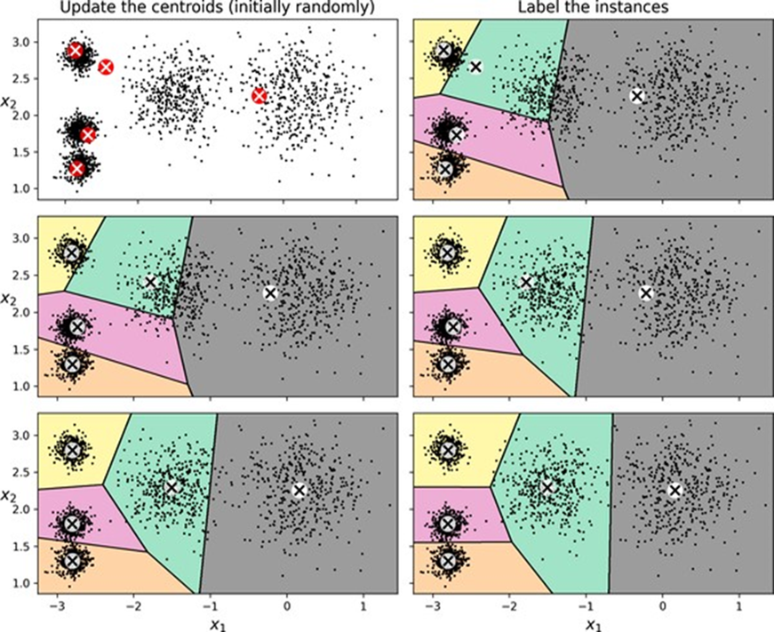

<!-- tabs:start -->

#### ** 📖 Lý thuyết **
# CHƯƠNG 9. CÁC KỸ THUẬT HỌC KHÔNG GIÁM SÁT

Mặc dù hầu hết các ứng dụng học máy ngày nay đều dựa trên học có
giám sát (và do đó, đây là nơi phần lớn các khoản đầu tư được đổ vào),
nhưng phần lớn dữ liệu có sẵn là không được gắn nhãn: chúng ta có các đặc trưng
đầu vào 

 , nhưng chúng ta không có
nhãn 

 . Nhà khoa học máy tính Yann
LeCun đã nổi tiếng nói rằng “nếu trí thông minh là một chiếc bánh, thì học
không giám sát sẽ là chiếc bánh, học có giám sát sẽ là lớp kem trên bánh, và học
tăng cường sẽ là quả anh đào trên bánh.” Nói cách khác, có một tiềm năng rất lớn
trong học không giám sát mà chúng ta mới chỉ bắt đầu khai thác.


Giả sử bạn muốn tạo một hệ thống sẽ chụp vài bức ảnh của mỗi mặt
hàng trên dây chuyền sản xuất và phát hiện mặt hàng nào bị lỗi. Bạn có thể khá
dễ dàng tạo một hệ thống tự động chụp ảnh, và điều này có thể cung cấp cho bạn
hàng nghìn bức ảnh mỗi ngày. Sau đó, bạn có thể xây dựng một tập dữ liệu khá lớn
chỉ trong vài tuần. Nhưng đợi đã, không có nhãn! Nếu bạn muốn huấn luyện một bộ
phân loại nhị phân thông thường sẽ dự đoán một mặt hàng có bị lỗi hay không, bạn
sẽ cần gắn nhãn từng bức ảnh là “bị lỗi” hoặc “bình thường”. Điều này thường sẽ
yêu cầu các chuyên gia con người ngồi xuống và xem xét thủ công tất cả các bức ảnh.
Đây là một công việc dài, tốn kém và tẻ nhạt, vì vậy nó thường chỉ được thực hiện
trên một tập con nhỏ của các bức ảnh có sẵn. Kết quả là, tập dữ liệu được gắn
nhãn sẽ khá nhỏ, và hiệu suất của bộ phân loại sẽ đáng thất vọng. Hơn nữa, mỗi
khi công ty thay đổi sản phẩm của mình, toàn bộ quá trình sẽ cần được bắt đầu lại
từ đầu. Sẽ không tuyệt vời sao nếu thuật toán có thể khai thác dữ liệu không được
gắn nhãn mà không cần con người gắn nhãn từng bức ảnh? Hãy đến với học không
giám sát.


Trong Chương 8, chúng ta đã xem xét tác vụ học không giám sát phổ biến
nhất: giảm chiều dữ liệu. Trong chương này, chúng ta sẽ xem xét thêm một vài
tác vụ không giám sát nữa:


·        
Phân cụm (Clustering) Mục tiêu là nhóm các trường hợp tương tự lại với nhau thành các cụm.
Phân cụm là một công cụ tuyệt vời để phân tích dữ liệu, phân khúc khách hàng, hệ
thống đề xuất, công cụ tìm kiếm, phân đoạn hình ảnh, học bán giám sát, giảm chiều
dữ liệu, và nhiều hơn nữa.


·        
Phát hiện dị thường (Anomaly
detection) (còn gọi là phát hiện ngoại lệ - outlier
detection) Mục tiêu là học cách dữ liệu “bình thường” trông như thế nào, và sau
đó sử dụng điều đó để phát hiện các trường hợp bất thường. Các trường hợp này
được gọi là dị thường, hoặc ngoại lệ, trong khi các trường hợp
bình thường được gọi là nội lệ (inliers). Phát hiện dị thường hữu ích
trong nhiều ứng dụng khác nhau, chẳng hạn như phát hiện gian lận, phát hiện sản
phẩm bị lỗi trong sản xuất, xác định các xu hướng mới trong chuỗi thời gian, hoặc
loại bỏ các ngoại lệ khỏi tập dữ liệu trước khi huấn luyện một mô hình khác, điều
này có thể cải thiện đáng kể hiệu suất của mô hình kết quả.


·        
Ước tính mật độ (Density
estimation) Đây là tác vụ ước tính hàm mật độ xác
suất (PDF) của quá trình ngẫu nhiên đã tạo ra tập dữ liệu. Ước tính mật độ thường
được sử dụng để phát hiện dị thường: các trường hợp nằm trong các vùng mật độ rất
thấp có khả năng là dị thường. Nó cũng hữu ích cho phân tích và trực quan hóa dữ
liệu.


Sẵn sàng cho một ít bánh chưa? Chúng ta sẽ bắt đầu
với hai thuật toán phân cụm, k-means và DBSCAN, sau đó chúng ta sẽ thảo luận về
các mô hình hỗn hợp Gaussian và xem cách chúng có thể được sử dụng để ước tính
mật độ, phân cụm và phát hiện dị thường.


### Các thuật toán phân cụm: k-means và
DBSCAN

Khi bạn đang đi bộ đường dài trên núi, bạn tình cờ gặp một loài thực
vật mà bạn chưa từng thấy trước đây. Bạn nhìn xung quanh và nhận thấy thêm một
vài cây nữa. Chúng không giống hệt nhau, nhưng chúng đủ giống nhau để bạn biết
rằng chúng rất có thể thuộc cùng một loài (hoặc ít nhất là cùng một chi). Bạn
có thể cần một nhà thực vật học để cho bạn biết đó là loài gì, nhưng bạn chắc
chắn không cần một chuyên gia để xác định các nhóm vật thể trông tương tự. Đây
được gọi là phân cụm: đó là nhiệm vụ xác định các trường hợp tương tự và
gán chúng vào các cụm, hoặc các nhóm trường hợp tương tự. Cũng giống như
trong phân loại, mỗi trường hợp được gán vào một nhóm. Tuy nhiên, không giống
như phân loại, phân cụm là một tác vụ không giám sát. Xem xét Hình 9-1: ở bên
trái là tập dữ liệu iris (được giới thiệu trong Chương 4), trong đó loài của mỗi
trường hợp (tức là lớp của nó) được biểu thị bằng một ký hiệu khác nhau. Đây là
một tập dữ liệu được gắn nhãn, rất phù hợp cho các thuật toán phân loại như hồi
quy logistic, SVM hoặc bộ phân loại rừng ngẫu nhiên. Ở bên phải là cùng một tập
dữ liệu, nhưng không có nhãn, vì vậy bạn không thể sử dụng thuật toán phân loại
nữa. Đây là lúc các thuật toán phân cụm xuất hiện: nhiều thuật toán trong số
chúng có thể dễ dàng phát hiện cụm dưới cùng bên trái. Cũng khá dễ nhìn thấy bằng
mắt thường của chúng ta, nhưng không rõ ràng rằng cụm trên cùng bên phải bao gồm
hai phân cụm riêng biệt. Điều đó nói rằng, tập dữ liệu có thêm hai đặc trưng
(chiều dài và chiều rộng đài hoa) không được biểu thị ở đây, và các thuật toán
phân cụm có thể tận dụng tốt tất cả các đặc trưng, vì vậy trên thực tế chúng
xác định ba cụm khá tốt (ví dụ, sử dụng mô hình hỗn hợp Gaussian, chỉ có 5
trong số 150 trường hợp bị gán sai cụm).


*Hình 9-1. Phân loại (trái) so
với phân cụm (phải)*

Phân cụm được sử dụng trong nhiều ứng dụng khác nhau, bao gồm:


·        
Phân khúc khách hàng Bạn có thể phân cụm khách hàng của mình dựa trên các giao dịch mua
hàng và hoạt động của họ trên trang web của bạn. Điều này hữu ích để hiểu khách
hàng của bạn là ai và họ cần gì, để bạn có thể điều chỉnh sản phẩm và chiến dịch
tiếp thị của mình cho từng phân khúc. Ví dụ, phân khúc khách hàng có thể hữu
ích trong các hệ thống đề xuất để gợi ý nội dung mà những người dùng khác trong
cùng cụm đã thích.


·        
Phân tích dữ liệu Khi bạn phân tích một tập dữ liệu mới, việc chạy một thuật toán
phân cụm và sau đó phân tích từng cụm riêng biệt có thể hữu ích.


·        
Giảm chiều dữ liệu Khi một tập dữ liệu đã được phân cụm, thường có thể đo lường độ
tương đồng của mỗi trường hợp với mỗi cụm; độ tương đồng là bất kỳ độ đo nào về
mức độ một trường hợp phù hợp với một cụm. Vector đặc trưng 

 của mỗi trường hợp sau đó có
thể được thay thế bằng vector các độ tương đồng cụm của nó. Nếu có 

 cụm, thì vector này có 

 chiều. Vector mới thường có
chiều thấp hơn nhiều so với vector đặc trưng gốc, nhưng nó có thể bảo toàn đủ
thông tin để xử lý tiếp.


·        
Kỹ thuật đặc trưng Các độ tương đồng cụm thường có thể hữu ích như các đặc trưng bổ
sung. Ví dụ, chúng ta đã sử dụng k-means trong Chương 2 để thêm các đặc trưng độ
tương đồng cụm địa lý vào tập dữ liệu California housing, và chúng đã giúp
chúng ta đạt được hiệu suất tốt hơn.


·        
Phát hiện dị thường (còn gọi là phát hiện ngoại lệ) Bất kỳ trường hợp nào có độ tương đồng
thấp với tất cả các cụm có khả năng là một dị thường. Ví dụ, nếu bạn đã phân cụm
người dùng trang web của mình dựa trên hành vi của họ, bạn có thể phát hiện những
người dùng có hành vi bất thường, chẳng hạn như số lượng yêu cầu mỗi giây bất
thường.


·        
Học bán giám sát Nếu bạn chỉ có một vài nhãn, bạn có thể thực hiện phân cụm và truyền
nhãn cho tất cả các trường hợp trong cùng cụm. Kỹ thuật này có thể làm tăng
đáng kể số lượng nhãn có sẵn cho một thuật toán học có giám sát tiếp theo, và
do đó cải thiện hiệu suất của nó.


·        
Công cụ tìm kiếm Một số công cụ tìm kiếm cho phép bạn tìm kiếm hình ảnh tương tự một
hình ảnh tham chiếu. Để xây dựng một hệ thống như vậy, bạn sẽ phải áp dụng một
thuật toán phân cụm cho tất cả các hình ảnh trong cơ sở dữ liệu của bạn; các
hình ảnh tương tự sẽ nằm trong cùng một cụm. Sau đó, khi người dùng cung cấp một
hình ảnh tham chiếu, tất cả những gì bạn cần làm là sử dụng mô hình phân cụm đã
được huấn luyện để tìm cụm của hình ảnh này, và sau đó bạn có thể chỉ cần trả về
tất cả các hình ảnh từ cụm này.


·        
Phân đoạn hình ảnh Bằng cách phân cụm các pixel theo màu sắc của chúng, sau đó thay thế
màu sắc của mỗi pixel bằng màu trung bình của cụm của nó, có thể giảm đáng kể số
lượng màu sắc khác nhau trong một hình ảnh. Phân đoạn hình ảnh được sử dụng
trong nhiều hệ thống phát hiện và theo dõi đối tượng, vì nó giúp dễ dàng phát
hiện đường viền của mỗi đối tượng.


Không có định nghĩa phổ quát nào về một cụm là
gì: nó thực sự phụ thuộc vào ngữ cảnh, và các thuật toán khác nhau sẽ nắm bắt
các loại cụm khác nhau. Một số thuật toán tìm kiếm các trường hợp tập trung
xung quanh một điểm cụ thể, được gọi là tâm cụm (centroid). Những thuật
toán khác tìm kiếm các vùng liên tục của các trường hợp được đóng gói dày đặc:
các cụm này có thể có bất kỳ hình dạng nào. Một số thuật toán là phân cấp, tìm
kiếm các cụm của các cụm. Và danh sách cứ thế tiếp tục. Trong phần này, chúng
ta sẽ xem xét hai thuật toán phân cụm phổ biến, k-means và DBSCAN, và khám phá
một số ứng dụng của chúng, chẳng hạn như giảm chiều phi tuyến tính, học bán
giám sát và phát hiện dị thường.


#### k-means

Xem xét tập dữ liệu không được gắn nhãn được biểu
thị trong Hình 9-2: bạn có thể thấy rõ năm khối trường hợp. Thuật toán k-means
là một thuật toán đơn giản có khả năng phân cụm loại tập dữ liệu này rất nhanh
chóng và hiệu quả, thường chỉ trong vài lần lặp. Nó được đề xuất bởi Stuart
Lloyd tại Bell Labs vào năm 1957 như một kỹ thuật điều chế mã xung, nhưng mãi đến
năm 1982 nó mới được công bố bên ngoài công ty. Năm 1965, Edward W. Forgy đã
công bố hầu như cùng một thuật toán, vì vậy k-means đôi khi được gọi là thuật
toán Lloyd–Forgy.


*Hình 9-2. Một tập dữ liệu
không được gắn nhãn bao gồm năm khối trường hợp*

Hãy huấn luyện một bộ phân cụm k-means trên tập dữ liệu này. Nó sẽ cố
gắng tìm tâm của mỗi khối và gán mỗi trường hợp vào khối gần nhất:


```python
from sklearn.cluster import KMeans
from sklearn.datasets import make_blobs

X, y = make_blobs([...]) # tạo các khối: y chứa ID cụm,
nhưng chúng ta
# sẽ không sử dụng chúng; đó là những gì chúng ta muốn
dự đoán
k = 5
kmeans = KMeans(n_clusters=k, random_state=42)
y_pred = kmeans.fit_predict(X)
```

Lưu ý rằng bạn phải chỉ định số lượng cụm 

 mà thuật toán phải tìm. Trong
ví dụ này, rõ ràng khi nhìn vào dữ liệu rằng 

 nên được đặt thành 5, nhưng
nói chung điều đó không dễ dàng như vậy. Chúng ta sẽ thảo luận điều này ngay
sau đây. Mỗi trường hợp sẽ được gán vào một trong năm cụm. Trong bối cảnh phân
cụm, nhãn của một trường hợp là chỉ số của cụm mà thuật toán gán trường hợp
này; điều này không nên nhầm lẫn với các nhãn lớp trong phân loại, được sử dụng
làm mục tiêu (hãy nhớ rằng phân cụm là một tác vụ học không giám sát). Thể hiện
KMeans giữ lại các nhãn dự đoán của các trường hợp mà nó đã được huấn luyện,
có sẵn thông qua biến thể hiện labels_:


```python
>>> y_pred
array([4, 0, 1, ..., 2, 1, 0], dtype=int32)

>>> y_pred is kmeans.labels_
True
```

Chúng ta cũng có thể xem xét năm tâm cụm mà thuật
toán đã tìm thấy:


```python
>>>
kmeans.cluster_centers_

array([[-2.80389616, 
1.80117999],
       [
0.20876306,  2.25551336],
      
[-2.79290307,  2.79641063],
      
[-1.46679593,  2.28585348],
      
[-2.80037642,  1.30082566]])
```

Bạn có thể dễ dàng gán các trường hợp mới vào cụm
có tâm cụm gần nhất:


```python
>>> import numpy as np
>>> X_new = np.array([[0, 2], [3, 2], [-3,
3], [-3, 2.5]])
>>> kmeans.predict(X_new)
array([1, 1, 2, 2], dtype=int32)
```

Nếu bạn vẽ các đường biên quyết định của cụm, bạn
sẽ có một phép phân vùng Voronoi: xem Hình 9-3, trong đó mỗi tâm cụm được biểu
thị bằng một chữ X.


*Hình 9-3. Đường biên quyết định
của k-means (phép phân vùng Voronoi)*

Phần lớn các trường hợp rõ ràng được gán vào cụm thích hợp, nhưng một
vài trường hợp có lẽ bị gán sai nhãn, đặc biệt gần ranh giới giữa cụm trên cùng
bên trái và cụm trung tâm. Thật vậy, thuật toán k-means hoạt động không tốt lắm
khi các khối có đường kính rất khác nhau bởi vì tất cả những gì nó quan tâm khi
gán một trường hợp vào một cụm là khoảng cách đến tâm cụm. Thay vì gán mỗi trường
hợp vào một cụm duy nhất, được gọi là phân cụm cứng (hard clustering),
có thể hữu ích khi cho mỗi trường hợp một điểm số cho mỗi cụm, được gọi là phân
cụm mềm (soft clustering). Điểm số có thể là khoảng cách giữa trường hợp và
tâm cụm hoặc một điểm số tương tự (hoặc độ tương đồng), chẳng hạn như hàm cơ sở
xuyên tâm Gaussian mà chúng ta đã sử dụng trong Chương 2. Trong lớp KMeans, phương thức transform() đo khoảng cách từ mỗi trường
hợp đến mọi tâm cụm:


```python
>>>
kmeans.transform(X_new).round(2)

array([[2.81, 0.33, 2.9 , 1.49, 2.89],
       [5.81,
2.8 , 5.85, 4.48, 5.84],
       [1.21,
3.29, 0.29, 1.69, 1.71],
       [0.73,
3.22, 0.36, 1.55, 1.22]])
```

Trong ví dụ này, trường hợp đầu tiên trong X_new nằm ở khoảng cách khoảng 2.81 từ tâm cụm đầu tiên, 0.33 từ tâm cụm
thứ hai, 2.90 từ tâm cụm thứ ba, 1.49 từ tâm cụm thứ tư và 2.89 từ tâm cụm thứ
năm. Nếu bạn có một tập dữ liệu có chiều cao và bạn biến đổi nó theo cách này,
bạn sẽ có một tập dữ liệu 

 -chiều: phép biến đổi này có
thể là một kỹ thuật giảm chiều phi tuyến tính rất hiệu quả. Ngoài ra, bạn có thể
sử dụng các khoảng cách này làm các đặc trưng bổ sung để huấn luyện một mô hình
khác, như trong Chương 2.


#### Thuật toán k-means

Vậy, thuật toán hoạt động như thế nào? Chà, giả sử bạn được cung cấp
các tâm cụm. Bạn có thể dễ dàng gắn nhãn tất cả các trường hợp trong tập dữ liệu
bằng cách gán mỗi trường hợp vào cụm có tâm cụm gần nhất. Ngược lại, nếu bạn được
cung cấp tất cả các nhãn trường hợp, bạn có thể dễ dàng xác định vị trí tâm cụm
của mỗi cụm bằng cách tính trung bình các trường hợp trong cụm đó. Nhưng bạn
không được cung cấp cả nhãn lẫn tâm cụm, vậy làm thế nào bạn có thể tiếp tục? Bắt
đầu bằng cách đặt các tâm cụm một cách ngẫu nhiên (ví dụ: bằng cách chọn 

 trường hợp ngẫu nhiên từ tập
dữ liệu và sử dụng vị trí của chúng làm tâm cụm). Sau đó gắn nhãn các trường hợp,
cập nhật các tâm cụm, gắn nhãn các trường hợp, cập nhật các tâm cụm, v.v. cho đến
khi các tâm cụm ngừng di chuyển. Thuật toán được đảm bảo hội tụ trong một số bước
hữu hạn (thường khá nhỏ). Điều đó là do khoảng cách bình phương trung bình giữa
các trường hợp và các tâm cụm gần nhất của chúng chỉ có thể giảm xuống ở mỗi bước,
và vì nó không thể là số âm, nó được đảm bảo hội tụ. Bạn có thể thấy thuật toán
hoạt động trong Hình 9-4: các tâm cụm được khởi tạo ngẫu nhiên (trên cùng bên
trái), sau đó các trường hợp được gắn nhãn (trên cùng bên phải), sau đó các tâm
cụm được cập nhật (giữa bên trái), các trường hợp được gắn nhãn lại (giữa bên
phải), v.v. Như bạn có thể thấy, chỉ trong ba lần lặp, thuật toán đã đạt được một
phân cụm dường như gần tối ưu.





*Hình 9-4. Thuật toán k-means*

Mặc dù thuật toán được đảm bảo hội tụ, nó có thể không hội tụ đến giải
pháp đúng (tức là nó có thể hội tụ đến một tối ưu cục bộ): việc nó có hội tụ
hay không phụ thuộc vào việc khởi tạo tâm cụm. Hình 9-5 cho thấy hai giải pháp
dưới tối ưu mà thuật toán có thể hội tụ nếu bạn không may mắn với bước khởi tạo
ngẫu nhiên.


*Hình 9-5. Các giải pháp dưới
tối ưu do khởi tạo tâm cụm không may mắn*

Hãy cùng xem xét một vài cách bạn có thể giảm thiểu rủi ro này bằng
cách cải thiện việc khởi tạo tâm cụm. Các phương pháp khởi tạo tâm cụm Nếu bạn
tình cờ biết xấp xỉ vị trí các tâm cụm (ví dụ: nếu bạn đã chạy một thuật toán
phân cụm khác trước đó), thì bạn có thể đặt siêu tham số init thành một mảng NumPy chứa danh sách các tâm cụm, và đặt n_init thành 1:


```python
good_init = np.array([[-3, 3],
[-3, 2], [-3, 1], [-1, 2], [0, 2]])
kmeans = KMeans(n_clusters=5, init=good_init,
n_init=1, random_state=42)
kmeans.fit(X)
```

Một giải pháp khác là chạy thuật toán nhiều lần với
các khởi tạo ngẫu nhiên khác nhau và giữ lại giải pháp tốt nhất. Số lần khởi tạo
ngẫu nhiên được kiểm soát bởi siêu tham số n_init: theo mặc định, nó bằng 10, có nghĩa là toàn bộ thuật toán được mô
tả trước đó chạy 10 lần khi bạn gọi fit(), và
Scikit-Learn giữ lại giải pháp tốt nhất. Nhưng chính xác thì làm thế nào nó biết
giải pháp nào là tốt nhất? Nó sử dụng một thước đo hiệu suất! Thước đo đó được
gọi là quán tính (inertia) của mô hình, là tổng khoảng cách bình phương
giữa các trường hợp và tâm cụm gần nhất của chúng. Nó xấp xỉ bằng 219.4 cho mô
hình ở bên trái trong Hình 9-5, 258.6 cho mô hình ở bên phải trong Hình 9-5, và
chỉ 211.6 cho mô hình trong Hình 9-3. Lớp KMeans chạy thuật
toán n_init lần và giữ lại mô hình có quán
tính thấp nhất. Trong ví dụ này, mô hình trong Hình 9-3 sẽ được chọn (trừ khi
chúng ta rất không may mắn với n_init khởi tạo ngẫu nhiên liên tiếp). Nếu
bạn tò mò, quán tính của mô hình có thể truy cập được thông qua biến thể hiện inertia_:


```python
>>> kmeans.inertia_
211.59853725816836
```

Phương thức score() trả về quán
tính âm (nó âm vì phương thức score() của một bộ dự đoán phải luôn
tuân thủ quy tắc “lớn hơn là tốt hơn” của Scikit-Learn: nếu một bộ dự đoán tốt
hơn một bộ dự đoán khác, phương thức score() của nó phải
trả về một điểm số lớn hơn):


```python
>>> kmeans.score(X)
-211.5985372581684
```

Một cải tiến quan trọng cho thuật toán k-means, k-means++,
đã được đề xuất trong một bài báo năm 2006 của David Arthur và Sergei
Vassilvitskii. Họ đã giới thiệu một bước khởi tạo thông minh hơn có xu hướng chọn
các tâm cụm cách xa nhau, và cải tiến này làm cho thuật toán k-means ít có khả
năng hội tụ đến một giải pháp dưới tối ưu hơn nhiều. Bài báo đã chỉ ra rằng việc
tính toán bổ sung cần thiết cho bước khởi tạo thông minh hơn rất đáng giá vì nó
giúp giảm đáng kể số lần thuật toán cần được chạy để tìm ra giải pháp tối ưu.
Thuật toán khởi tạo k-means++ hoạt động như sau:


1.     
Lấy một tâm cụm 

 , được chọn ngẫu nhiên đồng đều
từ tập dữ liệu.


2.     
Lấy một tâm cụm mới 

 , chọn một trường hợp 

 với xác suất 

 , trong đó 

 là khoảng cách giữa trường hợp


 và tâm cụm gần nhất đã được
chọn. Phân phối xác suất này đảm bảo rằng các trường hợp ở xa các tâm cụm đã chọn
có nhiều khả năng được chọn làm tâm cụm hơn.


3.  
Lặp lại bước trước cho đến khi
tất cả 

 tâm cụm đã được chọn. Lớp KMeans sử dụng phương pháp khởi tạo này theo mặc định. K-means tăng tốc và
k-means theo mini-batch Một cải tiến quan trọng khác cho thuật toán k-means đã
được đề xuất trong một bài báo năm 2003 của Charles Elkan. Trên một số tập dữ
liệu lớn với nhiều cụm, thuật toán có thể được tăng tốc bằng cách tránh nhiều
phép tính khoảng cách không cần thiết. Elkan đã đạt được điều này bằng cách
khai thác bất đẳng thức tam giác (tức là một đường thẳng luôn là khoảng cách ngắn
nhất giữa hai điểm) và bằng cách theo dõi các cận dưới và cận trên cho khoảng
cách giữa các trường hợp và tâm cụm. Tuy nhiên, thuật toán của Elkan không phải
lúc nào cũng tăng tốc quá trình huấn luyện, và đôi khi nó thậm chí có thể làm
chậm quá trình huấn luyện đáng kể; điều đó phụ thuộc vào tập dữ liệu. Tuy
nhiên, nếu bạn muốn thử, hãy đặt algorithm="elkan". Một biến thể
quan trọng khác của thuật toán k-means đã được đề xuất trong một bài báo năm
2010 của David Sculley. Thay vì sử dụng toàn bộ tập dữ liệu ở mỗi lần lặp, thuật
toán có khả năng sử dụng các mini-batch, di chuyển các tâm cụm chỉ một chút ở mỗi
lần lặp. Điều này tăng tốc thuật toán (thường gấp ba đến bốn lần) và giúp có thể
phân cụm các tập dữ liệu khổng lồ không vừa trong bộ nhớ. Scikit-Learn triển
khai thuật toán này trong lớp MiniBatchKMeans, mà bạn có thể sử dụng
giống như lớp KMeans:


```python
from sklearn.cluster import
MiniBatchKMeans

minibatch_kmeans = MiniBatchKMeans(n_clusters=5,
random_state=42)
minibatch_kmeans.fit(X)
```

Nếu tập dữ liệu không vừa trong bộ nhớ, lựa chọn
đơn giản nhất là sử dụng lớp memmap, như chúng ta đã làm cho PCA tăng
dần trong Chương 8. Ngoài ra, bạn có thể truyền từng mini-batch một cho phương
thức partial_fit(), nhưng điều này sẽ yêu cầu
nhiều công việc hơn, vì bạn sẽ cần thực hiện nhiều lần khởi tạo và tự mình chọn
giải pháp tốt nhất. Mặc dù thuật toán k-means theo mini-batch nhanh hơn nhiều
so với thuật toán k-means thông thường, nhưng quán tính của nó nói chung hơi tệ
hơn. Bạn có thể thấy điều này trong Hình 9-6: biểu đồ bên trái so sánh quán
tính của các mô hình k-means theo mini-batch và k-means thông thường được huấn
luyện trên tập dữ liệu năm khối trước đó bằng cách sử dụng các số lượng cụm 

 khác nhau. Sự khác biệt giữa
hai đường cong là nhỏ, nhưng có thể nhìn thấy. Trong biểu đồ bên phải, bạn có
thể thấy rằng k-means theo mini-batch nhanh hơn k-means thông thường khoảng 3.5
lần trên tập dữ liệu này.


*Hình 9-6. K-means theo
mini-batch có quán tính cao hơn k-means (trái) nhưng nó nhanh hơn nhiều (phải),
đặc biệt khi k tăng*

Tìm số lượng cụm tối ưu Cho đến nay, chúng ta đã đặt số lượng cụm 

 là 5 vì rõ ràng khi nhìn vào
dữ liệu rằng đây là số lượng cụm chính xác. Nhưng nói chung, sẽ không dễ dàng để
biết cách đặt 

 , và kết quả có thể khá tệ nếu
bạn đặt nó thành một giá trị sai. Như bạn có thể thấy trong Hình 9-7, đối với tập
dữ liệu này, việc đặt 

 thành 3 hoặc 8 dẫn đến các mô
hình khá tệ. Bạn có thể nghĩ rằng bạn có thể chỉ cần chọn mô hình có quán tính
thấp nhất. Thật không may, điều đó không đơn giản. Quán tính cho 

 là khoảng 653.2, cao hơn nhiều
so với 

 (211.6). Nhưng với 

 , quán tính chỉ là 119.1.
Quán tính không phải là một thước đo hiệu suất tốt khi cố gắng chọn 

 vì nó tiếp tục giảm khi chúng
ta tăng 

 . Thật vậy, càng có nhiều cụm,
mỗi trường hợp sẽ càng gần với tâm cụm gần nhất của nó, và do đó quán tính sẽ
càng thấp. Hãy vẽ quán tính như một hàm của 

 . Khi chúng ta làm điều này,
đường cong thường chứa một điểm uốn được gọi là khuỷu tay (elbow) (xem
Hình 9-8).


*Hình 9-7. Lựa chọn số lượng cụm
kém: khi k quá nhỏ, các cụm riêng biệt bị hợp nhất (trái), và khi k quá lớn, một
số cụm bị chia thành nhiều mảnh (phải)*


*Hình 9-8. Vẽ quán tính như một
hàm của số lượng cụm k*

Như bạn có thể thấy, quán tính giảm rất nhanh khi chúng ta tăng 

 lên đến 4, nhưng sau đó nó giảm
chậm hơn nhiều khi chúng ta tiếp tục tăng 

 . Đường cong này gần giống
hình cánh tay, và có một khuỷu tay tại 

 . Vì vậy, nếu chúng ta không
có cách nào tốt hơn, chúng ta có thể nghĩ 4 là một lựa chọn tốt: bất kỳ giá trị
thấp hơn nào cũng sẽ rất tệ, trong khi bất kỳ giá trị cao hơn nào cũng sẽ không
giúp ích nhiều, và chúng ta có thể chỉ đang chia các cụm tốt thành hai mà không
có lý do chính đáng. Kỹ thuật này để chọn giá trị tốt nhất cho số lượng cụm khá
thô. Một cách tiếp cận chính xác hơn (nhưng cũng tốn kém tính toán hơn) là sử dụng
điểm silhouette (silhouette score), là hệ số silhouette trung bình trên
tất cả các trường hợp. Hệ số silhouette của một trường hợp bằng 

 , trong đó 

 là khoảng cách trung bình đến
các trường hợp khác trong cùng cụm (tức là khoảng cách nội cụm trung bình) và 

 là khoảng cách cụm gần nhất
trung bình (tức là khoảng cách trung bình đến các trường hợp của cụm gần nhất
tiếp theo, được định nghĩa là cụm làm tối thiểu 

 , không bao gồm cụm của chính
trường hợp). Hệ số silhouette có thể thay đổi từ –1 đến +1. Hệ số gần +1 có
nghĩa là trường hợp nằm sâu trong cụm của chính nó và cách xa các cụm khác,
trong khi hệ số gần 0 có nghĩa là nó gần ranh giới cụm; cuối cùng, hệ số gần –1
có nghĩa là trường hợp có thể đã bị gán sai cụm. Để tính điểm silhouette, bạn
có thể sử dụng hàm silhouette_score() của Scikit-Learn,
cung cấp cho nó tất cả các trường hợp trong tập dữ liệu và các nhãn mà chúng được
gán:


```python
>>> from sklearn.metrics
import silhouette_score
>>> silhouette_score(X, kmeans.labels_)
0.655517642572828
```

Hãy so sánh các điểm silhouette cho các số lượng
cụm khác nhau (xem Hình 9-9).


*Hình 9-9. Chọn số lượng cụm k
bằng cách sử dụng điểm silhouette*

Như bạn có thể thấy, trực quan hóa này phong phú hơn nhiều so với trực
quan hóa trước đó: mặc dù nó xác nhận rằng 

 là một lựa chọn rất tốt, nó
cũng làm nổi bật thực tế rằng 

 cũng khá tốt, và tốt hơn nhiều
so với 

 hoặc 7. Điều này không thể
nhìn thấy khi so sánh quán tính. Một trực quan hóa mang lại nhiều thông tin hơn
nữa được tạo ra khi chúng ta vẽ hệ số silhouette của mỗi trường hợp, được sắp xếp
theo các cụm mà chúng được gán và theo giá trị của hệ số. Đây được gọi là biểu
đồ silhouette (xem Hình 9-10). Mỗi biểu đồ chứa một hình dao cho mỗi cụm.
Chiều cao của hình dạng cho biết số lượng trường hợp trong cụm, và chiều rộng của
nó biểu thị các hệ số silhouette đã được sắp xếp của các trường hợp trong cụm
(càng rộng càng tốt). Các đường nét đứt dọc biểu thị điểm silhouette trung bình
cho mỗi số lượng cụm. Khi hầu hết các trường hợp trong một cụm có hệ số thấp
hơn điểm này (tức là nếu nhiều trường hợp dừng lại trước đường nét đứt, kết
thúc ở bên trái của nó), thì cụm đó khá tệ vì điều này có nghĩa là các trường hợp
của nó quá gần các cụm khác. Ở đây chúng ta có thể thấy rằng khi 

 hoặc 6, chúng ta có các cụm tệ.
Nhưng khi 

 hoặc 5, các cụm trông khá tốt:
hầu hết các trường hợp mở rộng ra ngoài đường nét đứt, sang bên phải và gần 1.0
hơn. Khi 

 , cụm ở chỉ số 1 (thứ hai từ
dưới lên) khá lớn. Khi 

 , tất cả các cụm có kích thước
tương tự nhau. Vì vậy, mặc dù điểm silhouette tổng thể từ 

 hơi lớn hơn so với 

 , có vẻ như nên sử dụng 

 để có các cụm có kích thước
tương tự.


*Hình 9-10. Phân tích các biểu
đồ silhouette cho các giá trị khác nhau của k*

Giới hạn của k-means


Mặc dù có nhiều ưu điểm, đáng chú ý nhất là nhanh
và có khả năng mở rộng, k-means không hoàn hảo. Như chúng ta đã thấy, cần phải
chạy thuật toán nhiều lần để tránh các giải pháp dưới tối ưu, cộng với việc bạn
cần chỉ định số lượng cụm, điều này có thể khá phiền phức. Hơn nữa, k-means
không hoạt động tốt lắm khi các cụm có kích thước khác nhau, mật độ khác nhau
hoặc hình dạng không cầu. Ví dụ, Hình 9-11 cho thấy cách k-means phân cụm một tập
dữ liệu chứa ba cụm hình elip có kích thước, mật độ và định hướng khác nhau.


Như bạn có thể thấy, không giải pháp nào trong số này là tốt cả. Giải
pháp bên trái tốt hơn, nhưng nó vẫn cắt bỏ 25% cụm giữa và gán nó cho cụm bên
phải. Giải pháp bên phải thì tệ hại, mặc dù quán tính của nó thấp hơn. Vì vậy,
tùy thuộc vào dữ liệu, các thuật toán phân cụm khác nhau có thể hoạt động tốt
hơn. Trên các loại cụm hình elip này, các mô hình hỗn hợp Gaussian hoạt động rất
tốt.


*Hình 9-11. k-means không phân
cụm các khối hình elip này đúng cách*

Bây giờ chúng ta hãy xem xét một vài cách chúng ta có thể hưởng lợi
từ việc phân cụm. Chúng ta sẽ sử dụng k-means, nhưng bạn có thể thoải mái thử
nghiệm với các thuật toán phân cụm khác.


#### Sử dụng phân cụm cho phân đoạn hình ảnh

Phân đoạn hình ảnh là nhiệm vụ phân chia một hình ảnh thành nhiều
phân đoạn. Có một số biến thể:


·        
Trong phân đoạn màu sắc,
các pixel có màu tương tự được gán vào cùng một phân đoạn. Điều này đủ trong
nhiều ứng dụng. Ví dụ, nếu bạn muốn phân tích hình ảnh vệ tinh để đo tổng diện
tích rừng trong một khu vực, phân đoạn màu sắc có thể là đủ.


·        
Trong phân đoạn ngữ nghĩa,
tất cả các pixel là một phần của cùng một loại đối tượng được gán vào cùng một
phân đoạn. Ví dụ, trong hệ thống thị giác của một chiếc xe tự lái, tất cả các
pixel là một phần của hình ảnh người đi bộ có thể được gán vào phân đoạn “người
đi bộ” (sẽ có một phân đoạn chứa tất cả những người đi bộ).


·        
Trong phân đoạn thể hiện,
tất cả các pixel là một phần của cùng một đối tượng riêng lẻ được gán vào cùng
một phân đoạn. Trong trường hợp này, sẽ có một phân đoạn khác cho mỗi người đi
bộ. Hiện trạng của phân đoạn ngữ nghĩa hoặc thể hiện ngày nay đạt được bằng
cách sử dụng các kiến trúc phức tạp dựa trên mạng lưới thần kinh tích chập (xem
Chương 14). Trong chương này, chúng ta sẽ tập trung vào tác vụ phân đoạn màu sắc
(đơn giản hơn nhiều), sử dụng k-means. Chúng ta sẽ bắt đầu bằng cách nhập gói Pillow (kế thừa từ Thư viện hình ảnh Python, PIL), sau đó chúng ta sẽ sử dụng
nó để tải hình ảnh ladybug.png (xem hình ảnh trên cùng bên
trái trong Hình 9-12), giả sử nó nằm ở đường dẫn tệp:


```python
>>> import numpy as np
>>> import PIL.Image
>>> filepath =
"path/to/ladybug.png" # Placeholder for the actual file path
>>> image =
np.asarray(PIL.Image.open(filepath))
>>> image.shape
(533, 800, 3)
```

Hình ảnh được biểu diễn dưới dạng một mảng 3D.
Kích thước của chiều thứ nhất là chiều cao; chiều thứ hai là chiều rộng; và chiều
thứ ba là số kênh màu, trong trường hợp này là đỏ, xanh lá cây và xanh lam
(RGB). Nói cách khác, đối với mỗi pixel có một vector 3D chứa cường độ của màu
đỏ, xanh lá cây và xanh lam dưới dạng số nguyên 8 bit không dấu từ 0 đến 255. Một
số hình ảnh có thể có ít kênh hơn (chẳng hạn như hình ảnh thang độ xám, chỉ có
một), và một số hình ảnh có thể có nhiều kênh hơn (chẳng hạn như hình ảnh có
kênh alpha bổ sung để trong suốt, hoặc hình ảnh vệ tinh, thường chứa các kênh
cho các tần số ánh sáng bổ sung (như hồng ngoại). Đoạn mã sau định hình lại mảng
để có được một danh sách dài các màu RGB, sau đó nó phân cụm các màu này bằng
k-means với tám cụm. Nó tạo một mảng segmented_img chứa
tâm cụm gần nhất cho mỗi pixel (tức là màu trung bình của cụm của mỗi pixel),
và cuối cùng nó định hình lại mảng này thành hình dạng hình ảnh gốc. Dòng thứ
ba sử dụng lập chỉ mục NumPy nâng cao; ví dụ, nếu 10 nhãn đầu tiên trong kmeans.labels_ bằng 1, thì 10 màu đầu tiên trong segmented_img bằng kmeans.cluster_centers_[1]:


```python
X = image.reshape(-1, 3)
kmeans = KMeans(n_clusters=8, random_state=42,
n_init=10).fit(X) # Thêm n_init=10 để tránh lỗi cảnh báo
segmented_img =
kmeans.cluster_centers_[kmeans.labels_]
segmented_img = segmented_img.reshape(image.shape)
```

Điều này xuất ra hình ảnh được hiển thị ở phía
trên bên phải của Hình 9-12. Bạn có thể thử nghiệm với các số lượng cụm khác
nhau, như trong hình. Khi bạn sử dụng ít hơn tám cụm, hãy lưu ý rằng màu đỏ rực
rỡ của bọ rùa không có cụm riêng: nó bị hợp nhất với các màu từ môi trường. Điều
này là do k-means ưu tiên các cụm có kích thước tương tự. Bọ rùa nhỏ—nhỏ hơn
nhiều so với phần còn lại của hình ảnh—vì vậy ngay cả khi màu của nó rực rỡ,
k-means không phân bổ một cụm cho nó.


*Hình 9-12. Phân đoạn hình ảnh
sử dụng k-means với các số lượng cụm màu khác nhau*

Điều đó không quá khó, phải không? Bây giờ chúng ta hãy xem một ứng
dụng khác của phân cụm.


#### Sử dụng phân cụm cho học bán giám sát

Một trường hợp sử dụng khác cho phân cụm là trong học bán giám
sát, khi chúng ta có rất nhiều trường hợp không được gắn nhãn và rất ít trường
hợp được gắn nhãn. Trong phần này, chúng ta sẽ sử dụng tập dữ liệu chữ số, là một
tập dữ liệu đơn giản giống MNIST chứa 1.797 hình ảnh thang độ xám 8 × 8 biểu thị
các chữ số từ 0 đến 9. Đầu tiên, hãy tải và chia tập dữ liệu (nó đã được xáo trộn):


```python
from sklearn.datasets import
load_digits

X_digits, y_digits = load_digits(return_X_y=True)
X_train, y_train = X_digits[:1400], y_digits[:1400]
X_test, y_test = X_digits[1400:], y_digits[1400:]
```

Chúng ta sẽ giả vờ rằng chúng ta chỉ có nhãn cho
50 trường hợp. Để có hiệu suất cơ sở, hãy huấn luyện một mô hình hồi quy
logistic trên 50 trường hợp được gắn nhãn này:


```python
from sklearn.linear_model import
LogisticRegression

n_labeled = 50
log_reg = LogisticRegression(max_iter=10_000,
random_state=42) # Thêm random_state để có kết quả tái tạo được
log_reg.fit(X_train[:n_labeled], y_train[:n_labeled])
```

Sau đó, chúng ta có thể đo độ chính xác của mô
hình này trên tập kiểm tra (lưu ý rằng tập kiểm tra phải được gắn nhãn):


```python
>>> log_reg.score(X_test,
y_test)
0.7481108312342569
```

Độ chính xác của mô hình chỉ là 74.8%. Điều đó
không tốt: thực tế, nếu bạn thử huấn luyện mô hình trên toàn bộ tập huấn luyện,
bạn sẽ thấy rằng nó sẽ đạt độ chính xác khoảng 90.7%. Hãy xem cách chúng ta có
thể làm tốt hơn. Đầu tiên, hãy phân cụm tập huấn luyện thành 50 cụm. Sau đó, đối
với mỗi cụm, chúng ta sẽ tìm hình ảnh gần nhất với tâm cụm. Chúng ta sẽ gọi những
hình ảnh này là các hình ảnh đại diện:


```python
k = 50
kmeans = KMeans(n_clusters=k, random_state=42,
n_init=10) # Thêm n_init=10
kmeans.fit(X_train)
X_digits_dist = kmeans.transform(X_train)
representative_digit_idx = np.argmin(X_digits_dist,
axis=0)
X_representative_digits =
X_train[representative_digit_idx]
```


*Hình 9-13 cho thấy 50 hình ảnh đại diện.*


*Hình 9-13. Năm mươi hình ảnh
chữ số đại diện (một hình ảnh cho mỗi cụm)*

Hãy xem xét từng hình ảnh và gắn nhãn thủ công cho chúng:


```python
y_representative_digits =
np.array([
    4, 9, 2, 0,
1, 6, 8, 0, 7, 8, 3, 5, 0, 4, 6, 2, 7, 5, 1, 9,
    1, 2, 4, 3,
9, 8, 4, 7, 6, 3, 0, 2, 5, 7, 1, 9, 3, 8, 6, 4,
    2, 0, 7, 5,
1, 9, 3, 8, 6, 4
]) # Đây là một mảng ví dụ, bạn cần tự gắn nhãn dựa
trên Hình 9-13
```

Bây giờ chúng ta có một tập dữ liệu chỉ với 50
trường hợp được gắn nhãn, nhưng thay vì là các trường hợp ngẫu nhiên, mỗi trường
hợp là một hình ảnh đại diện của cụm của nó. Hãy xem hiệu suất có tốt hơn
không:


```python
>>> log_reg =
LogisticRegression(max_iter=10_000, random_state=42)
>>> log_reg.fit(X_representative_digits,
y_representative_digits)
>>> log_reg.score(X_test, y_test)
0.8488664987405542
```

Tuyệt vời! Chúng ta đã nhảy từ độ chính xác 74.8%
lên 84.9%, mặc dù chúng ta vẫn chỉ huấn luyện mô hình trên 50 trường hợp. Vì việc
gắn nhãn các trường hợp thường tốn kém và đau đớn, đặc biệt khi phải thực hiện
thủ công bởi các chuyên gia, nên việc gắn nhãn các trường hợp đại diện thay vì
chỉ các trường hợp ngẫu nhiên là một ý hay.


Nhưng có lẽ chúng ta có thể tiến thêm một bước nữa: điều gì sẽ xảy
ra nếu chúng ta truyền nhãn cho tất cả các trường hợp khác trong cùng cụm? Điều
này được gọi là truyền nhãn (label propagation):


```python
y_train_propagated =
np.empty(len(X_train), dtype=np.int64)
for i in range(k):
   
y_train_propagated[kmeans.labels_ == i] = y_representative_digits[i]
```

Bây giờ hãy huấn luyện lại mô hình và xem hiệu suất
của nó:


```python
>>> log_reg =
LogisticRegression(max_iter=10_000, random_state=42)
>>> log_reg.fit(X_train, y_train_propagated)
>>> log_reg.score(X_test, y_test)
0.8942065491183879
```

Chúng ta đã nhận được một sự tăng cường độ chính
xác đáng kể khác! Hãy xem liệu chúng ta có thể làm tốt hơn nữa bằng cách bỏ qua
1% các trường hợp cách xa tâm cụm của chúng nhất: điều này sẽ loại bỏ một số
ngoại lệ. Đoạn mã sau đây đầu tiên tính khoảng cách từ mỗi trường hợp đến tâm cụm
gần nhất của nó, sau đó đối với mỗi cụm, nó đặt 1% khoảng cách lớn nhất thành
–1. Cuối cùng, nó tạo một tập hợp không có các trường hợp này được đánh dấu bằng
khoảng cách –1:


```python
percentile_closest = 99

X_cluster_dist =
X_digits_dist[np.arange(len(X_train)), kmeans.labels_]

for i in range(k):
    in_cluster
= (kmeans.labels_ == i)
   
cluster_dist = X_cluster_dist[in_cluster]
   
cutoff_distance = np.percentile(cluster_dist, percentile_closest)
   
above_cutoff = (X_cluster_dist > cutoff_distance)
   
X_cluster_dist[in_cluster & above_cutoff] = -1

partially_propagated = (X_cluster_dist != -1)
X_train_partially_propagated =
X_train[partially_propagated]
y_train_partially_propagated =
y_train_propagated[partially_propagated]
```

Bây giờ hãy huấn luyện lại mô hình trên tập dữ liệu
đã được truyền nhãn một phần này và xem độ chính xác chúng ta nhận được:


```python
>>> log_reg =
LogisticRegression(max_iter=10_000, random_state=42)
>>>
log_reg.fit(X_train_partially_propagated, y_train_partially_propagated)
>>> log_reg.score(X_test, y_test)
0.9093198992443325
```

Tuyệt vời! Chỉ với 50 trường hợp được gắn nhãn
(trung bình chỉ 5 ví dụ cho mỗi lớp!) chúng ta đã đạt độ chính xác 90.9%, thực
tế cao hơn một chút so với hiệu suất chúng ta nhận được trên tập dữ liệu chữ số
đã được gắn nhãn đầy đủ (90.7%). Điều này một phần nhờ vào việc chúng ta đã loại
bỏ một số ngoại lệ, và một phần vì các nhãn được truyền thực sự khá tốt—độ
chính xác của chúng khoảng 97.5%, như đoạn mã sau cho thấy:


```python
>>>
(y_train_partially_propagated == y_train[partially_propagated]).mean()
0.9755555555555555
```

HỌC TÍCH CỰC (ACTIVE LEARNING) Để tiếp tục cải
thiện mô hình và tập huấn luyện của bạn, bước tiếp theo có thể là thực hiện một
vài vòng học tích cực (active learning), là khi một chuyên gia con người
tương tác với thuật toán học, cung cấp nhãn cho các trường hợp cụ thể khi thuật
toán yêu cầu chúng. Có nhiều chiến lược khác nhau cho học tích cực, nhưng một
trong những chiến lược phổ biến nhất được gọi là lấy mẫu không chắc chắn
(uncertainty sampling). Cách hoạt động của nó như sau:


4.     
Mô hình được huấn luyện trên
các trường hợp đã được gắn nhãn thu thập được cho đến nay, và mô hình này được
sử dụng để đưa ra dự đoán trên tất cả các trường hợp không được gắn nhãn.


5.     
Các trường hợp mà mô hình không
chắc chắn nhất (tức là nơi xác suất ước tính của nó thấp nhất) được đưa cho
chuyên gia để gắn nhãn.


6.     
Bạn lặp lại quá trình này cho đến
khi cải thiện hiệu suất không còn đáng để nỗ lực gắn nhãn nữa. Các chiến lược học
tích cực khác bao gồm gắn nhãn các trường hợp sẽ dẫn đến thay đổi mô hình lớn
nhất hoặc giảm lỗi xác thực của mô hình lớn nhất, hoặc các trường hợp mà các mô
hình khác nhau không đồng ý (ví dụ: một SVM và một rừng ngẫu nhiên).


Trước khi chúng ta chuyển sang các mô hình hỗn hợp
Gaussian, hãy xem DBSCAN, một thuật toán phân cụm phổ biến khác minh họa một
cách tiếp cận rất khác dựa trên ước tính mật độ cục bộ. Cách tiếp cận này cho
phép thuật toán xác định các cụm có hình dạng tùy ý.


#### DBSCAN

Thuật toán phân cụm không gian dựa trên mật độ
cho các ứng dụng có nhiễu (DBSCAN) định nghĩa các cụm là các vùng liên tục
có mật độ cao. Cách hoạt động của nó như sau:


·        
Đối với mỗi trường hợp, thuật
toán đếm xem có bao nhiêu trường hợp nằm trong khoảng cách nhỏ 

 (epsilon) từ nó. Vùng này được
gọi là vùng lân cận 

  của trường hợp.


·    
Nếu một trường hợp có ít nhất min_samples trường hợp trong vùng lân cận 

 của nó (bao gồm chính nó),
thì nó được coi là một trường hợp lõi. Nói cách khác, các trường hợp lõi
là những trường hợp nằm trong các vùng dày đặc.


·        
Tất cả các trường hợp trong
vùng lân cận của một trường hợp lõi thuộc cùng một cụm. Vùng lân cận này có thể
bao gồm các trường hợp lõi khác; do đó, một chuỗi dài các trường hợp lõi lân cận
tạo thành một cụm duy nhất.


·        
Bất kỳ trường hợp nào không phải
là trường hợp lõi và không có trường hợp lõi nào trong vùng lân cận của nó được
coi là một dị thường.


Thuật toán này hoạt động tốt nếu tất cả các cụm
được phân tách tốt bởi các vùng mật độ thấp. Lớp DBSCAN trong Scikit-Learn đơn giản như bạn mong đợi. Hãy thử nghiệm nó
trên tập dữ liệu moons, được giới thiệu trong Chương 5:


```python
from sklearn.cluster import DBSCAN
from sklearn.datasets import make_moons

X, y = make_moons(n_samples=1000, noise=0.05,
random_state=42) # Thêm random_state để có kết quả tái tạo được
dbscan = DBSCAN(eps=0.05, min_samples=5)
dbscan.fit(X)
```

Các nhãn của tất cả các trường hợp hiện có sẵn
trong biến thể hiện labels_:


```python
>>> dbscan.labels_
array([ 0,  2,
-1, ..., -1,  0,  0]) # Mảng thực tế có thể khác do tính ngẫu
nhiên.
```

Lưu ý rằng một số trường hợp có chỉ số cụm bằng
–1, có nghĩa là chúng được thuật toán coi là dị thường. Các chỉ số của các trường
hợp lõi có sẵn trong biến thể hiện core_sample_indices_,
và chính các trường hợp lõi có sẵn trong biến thể hiện components_:


```python
>>>
dbscan.core_sample_indices_
array([ 
0,   4,   5,  
6,   7,   8, 
10,  11, ..., 993, 995, 997, 998,
999]) # Mảng thực tế có thể khác

>>> dbscan.components_
array([[-0.02137124, 
0.40618608],
      
[-0.84192557,  0.53058695],
       ...,
       [
0.79419406,  0.60777171]]) # Mảng thực tế
có thể khác
```

Phân cụm này được biểu thị trong biểu đồ bên trái
của Hình 9-14. Như bạn có thể thấy, nó đã xác định khá nhiều dị thường, cộng với
bảy cụm khác nhau. Thật đáng thất vọng! May mắn thay, nếu chúng ta mở rộng vùng
lân cận của mỗi trường hợp bằng cách tăng eps lên 0.2, chúng ta
sẽ nhận được phân cụm bên phải, trông hoàn hảo. Hãy tiếp tục với mô hình này.


*Hình 9-14. Phân cụm DBSCAN sử
dụng hai bán kính vùng lân cận khác nhau*

Đáng ngạc nhiên, lớp DBSCAN không có phương thức predict(), mặc dù nó có phương thức fit_predict(). Nói
cách khác, nó không thể dự đoán một trường hợp mới thuộc cụm nào. Quyết định
này được đưa ra vì các thuật toán phân loại khác nhau có thể tốt hơn cho các
tác vụ khác nhau, vì vậy các tác giả đã quyết định để người dùng chọn cái nào sẽ
sử dụng. Hơn nữa, việc triển khai không khó. Ví dụ, hãy huấn luyện một KNeighborsClassifier:


```python
from sklearn.neighbors import
KNeighborsClassifier

knn = KNeighborsClassifier(n_neighbors=50)
knn.fit(dbscan.components_,
dbscan.labels_[dbscan.core_sample_indices_])
```

Bây giờ, với một vài trường hợp mới, chúng ta có
thể dự đoán chúng có khả năng thuộc cụm nào nhất và thậm chí ước tính xác suất
cho mỗi cụm:


```python
>>> X_new =
np.array([[-0.5, 0], [0, 0.5], [1, -0.1], [2, 1]])

>>> knn.predict(X_new)
array([1, 0, 1, 0])

>>> knn.predict_proba(X_new)

array([[0.18, 0.82],
       [1.  , 0. 
],
       [0.12,
0.88],
       [1.  , 0. 
]])
```

Lưu ý rằng chúng ta chỉ huấn luyện bộ phân loại
trên các trường hợp lõi, nhưng chúng ta cũng có thể chọn huấn luyện nó trên tất
cả các trường hợp, hoặc tất cả trừ các dị thường: lựa chọn này phụ thuộc vào
tác vụ cuối cùng. Đường biên quyết định được biểu thị trong Hình 9-15 (các dấu
thập biểu thị bốn trường hợp trong X_new). Lưu ý rằng vì
không có dị thường nào trong tập huấn luyện, bộ phân loại luôn chọn một cụm,
ngay cả khi cụm đó ở xa. Khá đơn giản để đưa ra một khoảng cách tối đa, trong
trường hợp đó hai trường hợp cách xa cả hai cụm sẽ được phân loại là dị thường.
Để làm điều này, hãy sử dụng phương thức kneighbors() của KNeighborsClassifier. Với một tập hợp các trường hợp, nó trả về khoảng cách và chỉ số của


 láng giềng gần nhất trong tập
huấn luyện (hai ma trận, mỗi ma trận có 

 cột):


```python
>>> y_dist, y_pred_idx =
knn.kneighbors(X_new, n_neighbors=1)
>>> y_pred =
dbscan.labels_[dbscan.core_sample_indices_][y_pred_idx]
>>> y_pred[y_dist > 0.2] = -1
>>> y_pred.ravel()
array([-1, 
0,  1, -1])
```


*Hình 9-15. Đường biên quyết định
giữa hai cụm*

Tóm lại, DBSCAN là một thuật toán rất đơn giản
nhưng mạnh mẽ có khả năng xác định bất kỳ số lượng cụm nào có hình dạng bất kỳ.
Nó mạnh mẽ với các ngoại lệ, và nó chỉ có hai siêu tham số (eps và min_samples). Tuy nhiên, nếu mật độ thay
đổi đáng kể giữa các cụm, hoặc nếu không có vùng mật độ đủ thấp xung quanh một
số cụm, DBSCAN có thể gặp khó khăn trong việc nắm bắt tất cả các cụm một cách
đúng đắn. Hơn nữa, độ phức tạp tính toán của nó xấp xỉ 

 , vì vậy nó không mở rộng tốt
với các tập dữ liệu lớn.


#### Các thuật toán phân cụm khác

Scikit-Learn triển khai một số thuật toán phân cụm khác mà bạn nên
xem xét. Tôi không thể trình bày chi tiết tất cả ở đây, nhưng đây là một cái
nhìn tổng quan ngắn gọn:


·        
Phân cụm phân cấp
(Agglomerative clustering) Một hệ thống phân cấp
các cụm được xây dựng từ dưới lên. Hãy nghĩ về nhiều bong bóng nhỏ nổi trên mặt
nước và dần dần gắn vào nhau cho đến khi có một nhóm bong bóng lớn. Tương tự, ở
mỗi lần lặp, phân cụm phân cấp kết nối cặp cụm gần nhất (bắt đầu bằng các trường
hợp riêng lẻ). Nếu bạn vẽ một cây với một nhánh cho mỗi cặp cụm đã hợp nhất, bạn
sẽ nhận được một cây nhị phân các cụm, trong đó các lá là các trường hợp riêng
lẻ. Cách tiếp cận này có thể nắm bắt các cụm có hình dạng khác nhau; nó cũng tạo
ra một cây cụm linh hoạt và nhiều thông tin thay vì buộc bạn phải chọn một
thang đo cụm cụ thể, và nó có thể được sử dụng với bất kỳ khoảng cách cặp nào.
Nó có thể mở rộng tốt với số lượng lớn các trường hợp nếu bạn cung cấp một ma
trận kết nối, là một ma trận 

 thưa thớt cho biết những cặp
trường hợp nào là láng giềng (ví dụ: được trả về bởi sklearn.neighbors.kneighbors_graph()). Không có ma trận kết nối, thuật toán không mở rộng tốt với các tập
dữ liệu lớn.


·        
BIRCH Thuật toán balanced iterative reducing and clustering using
hierarchies (BIRCH) được thiết kế đặc biệt cho các tập dữ liệu rất lớn, và
nó có thể nhanh hơn k-means theo lô, với kết quả tương tự, miễn là số lượng đặc
trưng không quá lớn (<20). Trong quá trình huấn luyện, nó xây dựng một cấu
trúc cây chứa đủ thông tin để nhanh chóng gán mỗi trường hợp mới vào một cụm,
mà không cần phải lưu trữ tất cả các trường hợp trong cây: cách tiếp cận này
cho phép nó sử dụng bộ nhớ hạn chế trong khi xử lý các tập dữ liệu khổng lồ.


·        
Mean-shift Thuật toán này bắt đầu bằng cách đặt một vòng tròn có tâm tại mỗi
trường hợp; sau đó đối với mỗi vòng tròn, nó tính toán giá trị trung bình của tất
cả các trường hợp nằm trong đó, và nó dịch chuyển vòng tròn sao cho nó có tâm tại
giá trị trung bình. Tiếp theo, nó lặp lại bước dịch chuyển trung bình này cho đến
khi tất cả các vòng tròn ngừng di chuyển (tức là cho đến khi mỗi vòng tròn có
tâm tại giá trị trung bình của các trường hợp nó chứa). Mean-shift dịch chuyển
các vòng tròn theo hướng mật độ cao hơn, cho đến khi mỗi vòng tròn tìm thấy một
cực đại mật độ cục bộ. Cuối cùng, tất cả các trường hợp có vòng tròn đã ổn định
ở cùng một vị trí (hoặc đủ gần) được gán vào cùng một cụm. Mean-shift có một số
tính năng giống như DBSCAN, chẳng hạn như cách nó có thể tìm thấy bất kỳ số lượng
cụm nào có hình dạng bất kỳ, nó có rất ít siêu tham số (chỉ một—bán kính của
các vòng tròn, được gọi là bandwidth), và nó dựa vào ước tính mật độ cục bộ.
Nhưng không giống như DBSCAN, mean-shift có xu hướng cắt các cụm thành nhiều mảnh
khi chúng có sự biến đổi mật độ bên trong. Thật không may, độ phức tạp tính
toán của nó là 

 , vì vậy nó không phù hợp cho
các tập dữ liệu lớn.


·        
Lan truyền tương đồng
(Affinity propagation) Trong thuật toán này, các
trường hợp liên tục trao đổi thông điệp với nhau cho đến khi mỗi trường hợp đã
bầu một trường hợp khác (hoặc chính nó) để đại diện cho nó. Các trường hợp được
bầu này được gọi là exemplar. Mỗi exemplar và tất cả các trường hợp đã bầu
nó tạo thành một cụm. Trong chính trị đời thực, bạn thường muốn bỏ phiếu cho một
ứng cử viên có quan điểm tương tự bạn, nhưng bạn cũng muốn họ thắng cử, vì vậy
bạn có thể chọn một ứng cử viên mà bạn không hoàn toàn đồng ý, nhưng người đó
phổ biến hơn. Bạn thường đánh giá sự phổ biến thông qua các cuộc thăm dò. Lan
truyền tương đồng hoạt động theo cách tương tự, và nó có xu hướng chọn các
exemplar nằm gần tâm của các cụm, tương tự k-means. Nhưng không giống như k-means,
bạn không phải chọn số lượng cụm trước: nó được xác định trong quá trình huấn
luyện. Hơn nữa, lan truyền tương đồng có thể xử lý tốt các cụm có kích thước
khác nhau. Đáng buồn thay, thuật toán này có độ phức tạp tính toán là 

 , vì vậy nó không phù hợp cho
các tập dữ liệu lớn.


·        
Phân cụm quang phổ (Spectral
clustering) Thuật toán này lấy một ma trận tương đồng
giữa các trường hợp và tạo ra một nhúng chiều thấp từ đó (tức là nó giảm chiều
của ma trận), sau đó nó sử dụng một thuật toán phân cụm khác trong không gian
chiều thấp này (triển khai của Scikit-Learn sử dụng k-means). Phân cụm quang phổ
có thể nắm bắt các cấu trúc cụm phức tạp, và nó cũng có thể được sử dụng để cắt
đồ thị (ví dụ: để xác định các cụm bạn bè trên mạng xã hội). Nó không mở rộng tốt
với số lượng lớn các trường hợp, và nó không hoạt động tốt khi các cụm có kích
thước rất khác nhau.


Bây giờ chúng ta hãy đi sâu vào các mô hình hỗn hợp
Gaussian, có thể được sử dụng để ước tính mật độ, phân cụm và phát hiện dị thường.


### Hỗn hợp Gaussian (Gaussian Mixtures)

Một mô hình hỗn hợp Gaussian (GMM) là một
mô hình xác suất giả định rằng các trường hợp được tạo ra từ một hỗn hợp của một
số phân phối Gaussian với các tham số chưa biết. Tất cả các trường hợp được tạo
ra từ một phân phối Gaussian duy nhất tạo thành một cụm thường trông giống một
hình elip. Mỗi cụm có thể có hình dạng, kích thước, mật độ và hướng elip khác
nhau, giống như trong Hình 9-11. Khi bạn quan sát một trường hợp, bạn biết nó
được tạo ra từ một trong các phân phối Gaussian, nhưng bạn không được cho biết
là cái nào, và bạn không biết các tham số của các phân phối này là gì.


Có một số biến thể GMM. Trong biến thể đơn giản nhất, được triển
khai trong lớp GaussianMixture, bạn phải biết trước số
lượng 

 phân phối Gaussian. Tập dữ liệu


 được giả định đã được tạo ra
thông qua quá trình xác suất sau:


·    
Đối với mỗi trường hợp, một cụm
được chọn ngẫu nhiên từ 

 cụm. Xác suất chọn cụm thứ 

 là trọng số 

 của cụm. Chỉ số của cụm được
chọn cho trường hợp thứ 

 được ghi là 

 .


·    
Nếu trường hợp thứ 

 được gán cho cụm thứ 

 (tức là 

 ), thì vị trí 

 của trường hợp này được lấy mẫu
ngẫu nhiên từ phân phối Gaussian với giá trị trung bình 

 và ma trận hiệp phương sai 

 . Điều này được ghi là 

 .


Vậy bạn có thể làm gì với một mô hình như vậy?
Chà, với tập dữ liệu 

 , bạn thường muốn bắt đầu bằng
cách ước tính các trọng số 

 và tất cả các tham số phân phối


 đến 

 và 

 đến 

 . Lớp GaussianMixture của Scikit-Learn làm cho việc này trở nên siêu dễ dàng:


```python
from sklearn.mixture import
GaussianMixture

gm = GaussianMixture(n_components=3, n_init=10,
random_state=42) # Thêm random_state để có kết quả tái tạo được
gm.fit(X)
```

Hãy xem xét các tham số mà thuật toán đã ước
tính:


```python
>>> gm.weights_
array([0.39025715, 0.40007391, 0.20966893])

>>> gm.means_
array([[ 0.05131611, 
0.07521837],
      
[-1.40763156,  1.42708225],
       [
3.39893794,  1.05928897]])

>>> gm.covariances_
array([[[0.68799922, 0.79606357],
       
[0.79606357, 1.21236106]],

      
[[0.63479409, 0.72970799],
       
[0.72970799, 1.1610351 ]],

      
[[1.14833585, -0.03256179],
       
[-0.03256179, 0.95490931]]])
```

Tuyệt vời, nó hoạt động tốt! Thật vậy, hai trong
số ba cụm được tạo ra với 500 trường hợp mỗi cụm, trong khi cụm thứ ba chỉ chứa
250 trường hợp. Vì vậy, trọng số cụm thực sự lần lượt là 0.4, 0.4 và 0.2, và đó
là xấp xỉ những gì thuật toán đã tìm thấy. Tương tự, các giá trị trung bình và
ma trận hiệp phương sai thực sự khá gần với những gì thuật toán tìm thấy. Nhưng
bằng cách nào? Lớp này dựa vào thuật toán mong đợi-tối đa hóa (EM), có
nhiều điểm tương đồng với thuật toán k-means: nó cũng khởi tạo các tham số cụm
một cách ngẫu nhiên, sau đó lặp lại hai bước cho đến khi hội tụ, đầu tiên gán
các trường hợp vào các cụm (đây được gọi là bước mong đợi) và sau đó cập nhật
các cụm (đây được gọi là bước tối đa hóa). Nghe quen thuộc phải không? Trong bối
cảnh phân cụm, bạn có thể nghĩ EM như một sự tổng quát hóa của k-means mà không
chỉ tìm thấy các tâm cụm ( 

 đến 

 ), mà còn cả kích thước, hình
dạng và hướng của chúng ( 

 đến 

 ), cũng như trọng số tương đối
của chúng ( 

 đến 

 ). Tuy nhiên, không giống như
k-means, EM sử dụng gán cụm mềm, không phải gán cứng. Đối với mỗi trường hợp,
trong bước mong đợi, thuật toán ước tính xác suất nó thuộc về mỗi cụm (dựa trên
các tham số cụm hiện tại). Sau đó, trong bước tối đa hóa, mỗi cụm được cập nhật
bằng cách sử dụng tất cả các trường hợp trong tập dữ liệu, với mỗi trường hợp
được trọng số bằng xác suất ước tính rằng nó thuộc về cụm đó. Các xác suất này
được gọi là trách nhiệm (responsibilities) của các cụm đối với các trường
hợp. Trong bước tối đa hóa, việc cập nhật mỗi cụm sẽ chủ yếu bị ảnh hưởng bởi
các trường hợp mà nó chịu trách nhiệm nhiều nhất.


Bạn có thể kiểm tra xem thuật toán có hội tụ hay không và mất bao
nhiêu lần lặp:


```python
>>> gm.converged_
True

>>> gm.n_iter_
4
```

Bây giờ bạn đã có một ước tính về vị trí, kích
thước, hình dạng, hướng và trọng số tương đối của mỗi cụm, mô hình có thể dễ
dàng gán mỗi trường hợp vào cụm có khả năng nhất (phân cụm cứng) hoặc ước tính
xác suất nó thuộc về một cụm cụ thể (phân cụm mềm). Chỉ cần sử dụng phương thức
predict() cho phân cụm cứng, hoặc phương thức predict_proba() cho phân cụm mềm:


```python
>>> gm.predict(X)
array([0, 0, 1, ..., 2, 2, 2])

>>> gm.predict_proba(X).round(3)
array([[0.977, 0.  
, 0.023],
       [0.983,
0.001, 0.016],
       [0.   , 1.  
, 0.   ],
       ...,
       [0.   , 0.  
, 1.   ],
       [0.   , 0.  
, 1.   ],
       [0.   , 0.  
, 1.   ]])
```

Một mô hình hỗn hợp Gaussian là một mô hình
sinh thành, có nghĩa là bạn có thể lấy mẫu các trường hợp mới từ nó (lưu ý
rằng chúng được sắp xếp theo chỉ số cụm):


```python
>>> X_new, y_new =
gm.sample(6)

>>> X_new
array([[-0.86944074, -0.32767626],
       [
0.29836051,  0.28297011],
      
[-2.8014927 , -0.09047309],
       [
3.98203732,  1.49951491],
       [
3.81677148,  0.53095244],
       [
2.84104923, -0.73858639]])

>>> y_new
array([0, 0, 1, 2, 2, 2])
```

Cũng có thể ước tính mật độ của mô hình tại bất kỳ
vị trí nào. Điều này được thực hiện bằng phương thức score_samples(): đối với mỗi trường hợp được cung cấp, phương thức này ước tính log
của hàm mật độ xác suất (PDF) tại vị trí đó. Điểm càng lớn, mật độ càng cao:


```python
>>>
gm.score_samples(X).round(2)
array([-2.61, -3.57, -3.33, ..., -3.51, -4.4 ,
-3.81])
```

Nếu bạn tính lũy thừa của các điểm này, bạn sẽ nhận
được giá trị của PDF tại vị trí của các trường hợp đã cho. Đây không phải là
xác suất, mà là mật độ xác suất: chúng có thể nhận bất kỳ giá trị dương nào,
không chỉ giá trị từ 0 đến 1. Để ước tính xác suất một trường hợp sẽ nằm trong
một vùng cụ thể, bạn sẽ phải tích phân PDF trên vùng đó (nếu bạn làm như vậy
trên toàn bộ không gian các vị trí trường hợp có thể có, kết quả sẽ là 1). Hình
9-16 cho thấy các giá trị trung bình của cụm, các đường biên quyết định (đường
nét đứt), và các đường đồng mật độ của mô hình này.


*Hình 9-16. Các giá trị trung
bình của cụm, đường biên quyết định và đường đồng mật độ của một mô hình hỗn hợp
Gaussian đã được huấn luyện*

Tuyệt vời! Thuật toán rõ ràng đã tìm thấy một giải pháp xuất sắc. Tất
nhiên, chúng ta đã làm cho nhiệm vụ của nó dễ dàng bằng cách tạo dữ liệu bằng
cách sử dụng một tập hợp các phân phối Gaussian 2D (thật không may, dữ liệu thực
tế không phải lúc nào cũng Gaussian và có chiều thấp như vậy). Chúng ta cũng đã
cung cấp cho thuật toán số lượng cụm chính xác. Khi có nhiều chiều, hoặc nhiều
cụm, hoặc ít trường hợp, EM có thể gặp khó khăn trong việc hội tụ đến giải pháp
tối ưu. Bạn có thể cần giảm độ khó của tác vụ bằng cách giới hạn số lượng tham
số mà thuật toán phải học. Một cách để làm điều này là giới hạn phạm vi hình dạng
và hướng mà các cụm có thể có. Điều này có thể đạt được bằng cách áp đặt các
ràng buộc lên các ma trận hiệp phương sai. Để làm điều này, đặt siêu tham số covariance_type thành một trong các giá trị sau:


·        
“spherical” Tất cả các cụm phải
là hình cầu, nhưng chúng có thể có đường kính khác nhau (tức là phương sai khác
nhau).


·        
“diag” Các cụm có thể có bất kỳ
hình dạng elip nào với bất kỳ kích thước nào, nhưng các trục của hình elip phải
song song với các trục tọa độ (tức là các ma trận hiệp phương sai phải là đường
chéo).


·        
“tied” Tất cả các cụm phải có
cùng hình dạng, kích thước và hướng elip (tức là tất cả các cụm chia sẻ cùng một
ma trận hiệp phương sai).


Theo mặc định, covariance_type bằng “full”, có nghĩa là mỗi cụm có thể có bất kỳ hình dạng, kích
thước và hướng nào (nó có ma trận hiệp phương sai không bị ràng buộc riêng).
Hình 9-17 vẽ các giải pháp được tìm thấy bởi thuật toán EM khi covariance_type được đặt thành “tied” hoặc “spherical”.


*Hình 9-17. Hỗn hợp Gaussian
cho các cụm liên kết (trái) và các cụm hình cầu (phải)*

Các mô hình hỗn hợp Gaussian cũng có thể được sử dụng để phát hiện dị
thường. Chúng ta sẽ xem cách thực hiện trong phần tiếp theo.


#### Sử dụng Hỗn hợp Gaussian để phát hiện dị
thường

Sử dụng mô hình hỗn hợp Gaussian để phát hiện dị
thường khá đơn giản: bất kỳ trường hợp nào nằm trong vùng mật độ thấp đều có thể
được coi là một dị thường. Bạn phải định nghĩa ngưỡng mật độ bạn muốn sử dụng.
Ví dụ, trong một công ty sản xuất cố gắng phát hiện sản phẩm bị lỗi, tỷ lệ sản
phẩm bị lỗi thường được biết rõ. Giả sử nó bằng 2%. Sau đó, bạn đặt ngưỡng mật
độ là giá trị dẫn đến 2% số trường hợp nằm trong các khu vực dưới ngưỡng mật độ
đó. Nếu bạn nhận thấy có quá nhiều sai số dương (tức là sản phẩm hoàn toàn tốt
bị gắn cờ là bị lỗi), bạn có thể hạ thấp ngưỡng. Ngược lại, nếu bạn có quá nhiều
sai số âm (tức là sản phẩm bị lỗi mà hệ thống không gắn cờ là bị lỗi), bạn có
thể tăng ngưỡng. Đây là sự đánh đổi độ chính xác/độ thu hồi thông thường (xem
Chương 3). Đây là cách bạn xác định các ngoại lệ bằng cách sử dụng mật độ thấp
nhất ở phân vị thứ tư làm ngưỡng (tức là khoảng 4% số trường hợp sẽ bị gắn cờ
là dị thường):


```python
densities = gm.score_samples(X)
density_threshold = np.percentile(densities, 2)
anomalies = X[densities < density_threshold]
```


*Hình 9-18 biểu thị các dị thường này dưới dạng
các ngôi sao. Một tác vụ liên quan chặt chẽ là phát hiện điểm mới (novelty
detection): nó khác với phát hiện dị thường ở chỗ thuật toán được giả định
được huấn luyện trên một tập dữ liệu “sạch”, không bị nhiễm ngoại lệ, trong khi
phát hiện dị thường không đưa ra giả định này. Thật vậy, phát hiện ngoại lệ thường
được sử dụng để làm sạch tập dữ liệu.*


*Hình 9-18. Phát hiện dị thường
sử dụng mô hình hỗn hợp Gaussian*

Giống như k-means, thuật toán GaussianMixture yêu cầu
bạn chỉ định số lượng cụm. Vậy làm thế nào bạn có thể tìm thấy số đó?


#### Chọn số lượng cụm

Với k-means, bạn có thể sử dụng quán tính hoặc điểm silhouette để chọn
số lượng cụm phù hợp. Nhưng với các hỗn hợp Gaussian, không thể sử dụng các chỉ
số này vì chúng không đáng tin cậy khi các cụm không có hình cầu hoặc có kích
thước khác nhau. Thay vào đó, bạn có thể cố gắng tìm mô hình tối thiểu hóa một
tiêu chí thông tin lý thuyết, chẳng hạn như tiêu chí thông tin Bayesian
(BIC) hoặc tiêu chí thông tin Akaike (AIC), được định nghĩa trong
Phương trình 9-1.


Phương trình 9-1. Tiêu chí thông tin Bayesian (BIC) và tiêu chí
thông tin Akaike (AIC)


Trong các phương trình này:


·     

 là số lượng trường hợp, như mọi
khi.


·     

 là số lượng tham số được học
bởi mô hình.


·        


 là giá
trị tối đa của hàm khả năng xảy ra (likelihood function) của mô hình.


Cả BIC và AIC đều phạt các mô hình có nhiều tham
số cần học (ví dụ: nhiều cụm hơn) và thưởng các mô hình khớp dữ liệu tốt. Chúng
thường chọn cùng một mô hình. Khi chúng khác nhau, mô hình được chọn bởi BIC có
xu hướng đơn giản hơn (ít tham số hơn) so với mô hình được chọn bởi AIC, nhưng
có xu hướng không khớp dữ liệu tốt bằng (điều này đặc biệt đúng đối với các tập
dữ liệu lớn hơn).


HÀM KHẢ NĂNG XẢY RA (LIKELIHOOD FUNCTION) Các thuật ngữ “xác suất”
(probability) và “khả năng xảy ra” (likelihood) thường được sử dụng thay thế
cho nhau trong ngôn ngữ hàng ngày, nhưng chúng có ý nghĩa rất khác nhau trong
thống kê. Cho một mô hình thống kê với một số tham số 

 , từ “xác suất” được sử dụng
để mô tả một kết quả 

 trong tương lai có thể xảy ra
đến mức nào (biết giá trị tham số 

 ), trong khi từ “khả năng xảy
ra” được sử dụng để mô tả một tập hợp giá trị tham số 

 cụ thể có thể xảy ra đến mức
nào, sau khi kết quả 

 đã được biết. Xem xét một mô
hình hỗn hợp 1D của hai phân phối Gaussian có tâm tại –4 và +1. Để đơn giản, mô
hình đồ chơi này có một tham số duy nhất 

 kiểm soát độ lệch chuẩn của cả
hai phân phối. Biểu đồ đường đồng mức trên cùng bên trái trong Hình 9-19 hiển
thị toàn bộ mô hình 

 như một hàm của cả 

 và 

 . Để ước tính phân phối xác
suất của một kết quả 

 trong tương lai, bạn cần đặt
tham số mô hình 

 . Ví dụ, nếu bạn đặt 

 thành 1.3 (đường ngang), bạn
sẽ nhận được hàm mật độ xác suất 

 được hiển thị trong biểu đồ
dưới cùng bên trái. Giả sử bạn muốn ước tính xác suất 

 sẽ nằm giữa –2 và +2. Bạn phải
tính tích phân của PDF trên phạm vi này (tức là diện tích của vùng được tô
bóng). Nhưng điều gì sẽ xảy ra nếu bạn không biết 

 , và thay vào đó bạn đã quan
sát một trường hợp duy nhất 

 (đường dọc trong biểu đồ trên
cùng bên trái)? Trong trường hợp này, bạn nhận được hàm khả năng xảy ra 

 , được biểu diễn trong biểu đồ
trên cùng bên phải.


*Hình 9-19. Hàm tham số của mô
hình (trên cùng bên trái), và một số hàm dẫn xuất: PDF (dưới cùng bên trái),
hàm khả năng xảy ra (trên cùng bên phải), và hàm log khả năng xảy ra (dưới cùng
bên phải)*

Tóm lại, PDF là một hàm của 

 (với 

 cố định), trong khi hàm khả
năng xảy ra là một hàm của 

 (với 

 cố định). Điều quan trọng là
phải hiểu rằng hàm khả năng xảy ra không phải là một phân phối xác suất:
nếu bạn tích phân một phân phối xác suất trên tất cả các giá trị có thể có của 

 , bạn luôn nhận được 1, nhưng
nếu bạn tích phân hàm khả năng xảy ra trên tất cả các giá trị có thể có của 

 , kết quả có thể là bất kỳ
giá trị dương nào. Cho một tập dữ liệu 

 , một tác vụ phổ biến là cố gắng
ước tính các giá trị có khả năng nhất cho các tham số mô hình. Để làm điều này,
bạn phải tìm các giá trị tối đa hóa hàm khả năng xảy ra, cho 

 . Trong ví dụ này, nếu bạn đã
quan sát một trường hợp duy nhất 

 , ước tính khả năng xảy ra tối
đa (MLE) của 

 là 

 . Nếu tồn tại một phân phối
xác suất tiên nghiệm 

 trên 

 , có thể tính đến nó bằng
cách tối đa hóa 

 thay vì chỉ tối đa hóa 

. Đây được gọi là ước tính hậu nghiệm tối đa (MAP). Vì MAP
ràng buộc các giá trị tham số, bạn có thể coi nó là một phiên bản được chính
quy hóa của MLE.


Lưu ý rằng việc tối đa hóa hàm khả năng xảy ra tương đương với việc
tối đa hóa logarit của nó (được biểu diễn trong biểu đồ dưới cùng bên phải
trong Hình 9-19). Thật vậy, logarit là một hàm tăng nghiêm ngặt, vì vậy nếu 

 tối đa hóa log khả năng xảy
ra, nó cũng tối đa hóa khả năng xảy ra. Hóa ra thường dễ dàng hơn để tối đa hóa
log khả năng xảy ra. Ví dụ, nếu bạn quan sát một số trường hợp độc lập 

 đến 

 , bạn sẽ cần tìm giá trị của 

 tối đa hóa tích của các hàm
khả năng xảy ra riêng lẻ. Nhưng tương đương, và đơn giản hơn nhiều, là tối đa
hóa tổng (không phải tích) của các hàm log khả năng xảy ra, nhờ vào phép thuật
của logarit chuyển đổi các tích thành tổng: 

 . Một khi bạn đã ước tính 

 , giá trị của 

 tối đa hóa hàm khả năng xảy
ra, thì bạn đã sẵn sàng tính toán 

 , là giá trị được sử dụng để
tính AIC và BIC; bạn có thể coi nó là một thước đo mức độ phù hợp của mô hình với
dữ liệu.


Để tính BIC và AIC, hãy gọi các phương thức bic() và aic():


```python
>>> gm.bic(X)
8189.747000497186

>>> gm.aic(X)
8102.521720382148
```


*Hình 9-20 cho thấy BIC cho các số lượng cụm 

 khác nhau. Như bạn có thể thấy,
cả BIC và AIC đều thấp nhất khi 

 , vì vậy đây rất có thể là lựa
chọn tốt nhất.*


*Hình 9-20. AIC và BIC cho các
số lượng cụm k khác nhau*


#### Mô hình hỗn hợp Gaussian Bayes (Bayesian
Gaussian Mixture Models)

Thay vì tìm kiếm thủ công số lượng cụm tối ưu, bạn
có thể sử dụng lớp BayesianGaussianMixture, lớp này có khả
năng gán trọng số bằng (hoặc gần bằng) 0 cho các cụm không cần thiết. Đặt số lượng
cụm n_components thành một giá trị mà bạn có
lý do chính đáng để tin rằng lớn hơn số lượng cụm tối ưu (điều này giả định một
số kiến thức tối thiểu về vấn đề đang xem xét), và thuật toán sẽ tự động loại bỏ
các cụm không cần thiết. Ví dụ, hãy đặt số lượng cụm là 10 và xem điều gì xảy
ra:


```python
>>> from sklearn.mixture
import BayesianGaussianMixture

>>> bgm =
BayesianGaussianMixture(n_components=10, n_init=10, random_state=42) # Thêm
random_state để có kết quả tái tạo được

>>> bgm.fit(X)

>>> bgm.weights_.round(2)
array([0.4 , 0.21, 0.4 , 0.  , 0.  ,
0.  , 0. 
, 0.  , 0.  , 0. 
])
```

Hoàn hảo: thuật toán tự động phát hiện rằng chỉ cần
ba cụm, và các cụm kết quả gần như giống hệt các cụm trong Hình 9-16. Một lưu ý
cuối cùng về các mô hình hỗn hợp Gaussian: mặc dù chúng hoạt động rất tốt trên
các cụm có hình elip, nhưng chúng không hoạt động tốt với các cụm có hình dạng
rất khác nhau. Ví dụ, hãy xem điều gì xảy ra nếu chúng ta sử dụng mô hình hỗn hợp
Gaussian Bayes để phân cụm tập dữ liệu moons (xem Hình 9-21).


*Hình 9-21. Khớp hỗn hợp
Gaussian với các cụm không hình elip*

Ôi! Thuật toán đã tuyệt vọng tìm kiếm các hình elip, vì vậy nó đã
tìm thấy tám cụm khác nhau thay vì hai. Việc ước tính mật độ không quá tệ, vì vậy
mô hình này có lẽ có thể được sử dụng để phát hiện dị thường, nhưng nó đã thất
bại trong việc xác định hai “mặt trăng”. Để kết thúc chương này, hãy xem nhanh
một vài thuật toán có khả năng xử lý các cụm có hình dạng tùy ý.


### Các thuật toán khác để phát hiện dị thường
và điểm mới

Scikit-Learn triển khai các
thuật toán khác dành riêng cho phát hiện dị thường hoặc phát hiện điểm mới:


·        
Fast-MCD (minimum covariance
determinant) Được triển khai bởi lớp EllipticEnvelope, thuật toán này hữu ích cho việc phát hiện ngoại lệ, đặc biệt để
làm sạch tập dữ liệu. Nó giả định rằng các trường hợp bình thường (nội lệ) được
tạo ra từ một phân phối Gaussian duy nhất (không phải là hỗn hợp). Nó cũng giả
định rằng tập dữ liệu bị nhiễm các ngoại lệ không được tạo ra từ phân phối
Gaussian này. Khi thuật toán ước tính các tham số của phân phối Gaussian (tức
là hình dạng của bao elip xung quanh các nội lệ), nó cẩn thận bỏ qua các trường
hợp có khả năng cao là ngoại lệ. Kỹ thuật này đưa ra ước tính tốt hơn về bao
elip và do đó làm cho thuật toán tốt hơn trong việc xác định các ngoại lệ.


·        
Rừng cách ly (Isolation
forest) Đây là một thuật toán hiệu quả để phát hiện
ngoại lệ, đặc biệt trong các tập dữ liệu có chiều cao. Thuật toán xây dựng một
rừng ngẫu nhiên trong đó mỗi cây quyết định được phát triển ngẫu nhiên: tại mỗi
nút, nó chọn ngẫu nhiên một đặc trưng, sau đó nó chọn một giá trị ngưỡng ngẫu
nhiên (giữa giá trị min và max) để chia tập dữ liệu thành hai. Tập dữ liệu dần
dần bị chia thành các mảnh theo cách này, cho đến khi tất cả các trường hợp bị
cô lập khỏi các trường hợp khác. Các dị thường thường ở xa các trường hợp khác,
vì vậy trung bình (trên tất cả các cây quyết định) chúng có xu hướng bị cô lập
trong ít bước hơn so với các trường hợp bình thường.


·        
Hệ số ngoại lệ cục bộ (Local
outlier factor - LOF) Thuật toán này cũng tốt cho
việc phát hiện ngoại lệ. Nó so sánh mật độ của các trường hợp xung quanh một
trường hợp đã cho với mật độ xung quanh các láng giềng của nó. Một dị thường
thường bị cô lập hơn các 

 láng giềng gần nhất của nó.


·        
One-class SVM Thuật toán này phù hợp hơn để phát hiện điểm mới. Nhớ lại rằng một
bộ phân loại SVM kernel hóa tách hai lớp bằng cách đầu tiên (ngầm định) ánh xạ
tất cả các trường hợp vào một không gian có chiều cao, sau đó tách hai lớp bằng
cách sử dụng bộ phân loại SVM tuyến tính trong không gian có chiều cao này (xem
Chương 5). Vì chúng ta chỉ có một lớp trường hợp, thuật toán one-class SVM thay
vào đó cố gắng tách các trường hợp trong không gian có chiều cao khỏi gốc.
Trong không gian gốc, điều này sẽ tương ứng với việc tìm một vùng nhỏ bao trùm
tất cả các trường hợp. Nếu một trường hợp mới không nằm trong vùng này, nó là một
dị thường. Có một vài siêu tham số để điều chỉnh: các siêu tham số thông thường
cho SVM kernel hóa, cộng với một siêu tham số biên tương ứng với xác suất một
trường hợp mới bị coi là điểm mới một cách nhầm lẫn khi nó thực tế là bình thường.
Nó hoạt động rất tốt, đặc biệt với các tập dữ liệu có chiều cao, nhưng giống
như tất cả các SVM, nó không mở rộng được cho các tập dữ liệu lớn.


·        
PCA và các kỹ thuật giảm chiều
khác có phương thức inverse_transform() Nếu bạn so sánh
sai số tái tạo của một trường hợp bình thường với sai số tái tạo của một dị thường,
cái sau thường sẽ lớn hơn nhiều. Đây là một cách tiếp cận phát hiện dị thường
đơn giản và thường khá hiệu quả (xem các bài tập của chương này để biết ví dụ).


### Bài tập

1.     
Bạn sẽ định nghĩa phân cụm như
thế nào? Bạn có thể kể tên một vài thuật toán phân cụm không?


2.     
Một số ứng dụng chính của thuật
toán phân cụm là gì?


3.     
Mô tả hai kỹ thuật để chọn số
lượng cụm phù hợp khi sử dụng k-means.


4.     
Truyền nhãn là gì? Tại sao bạn
lại triển khai nó, và bằng cách nào?


5.     
Bạn có thể kể tên hai thuật
toán phân cụm có thể mở rộng cho các tập dữ liệu lớn không? Và hai thuật toán
tìm kiếm các vùng mật độ cao?


6.     
Bạn có thể nghĩ ra một trường hợp
sử dụng nào mà học tích cực sẽ hữu ích không? Bạn sẽ triển khai nó như thế nào?


7.     
Sự khác biệt giữa phát hiện dị
thường và phát hiện điểm mới là gì?


8.     
Hỗn hợp Gaussian là gì? Bạn có
thể sử dụng nó cho những tác vụ nào?


9.     
Bạn có thể kể tên hai kỹ thuật
để tìm số lượng cụm phù hợp khi sử dụng mô hình hỗn hợp Gaussian không?


10. Tập dữ liệu khuôn mặt Olivetti cổ điển chứa 400 hình ảnh thang độ
xám 64 × 64 pixel của khuôn mặt. Mỗi hình ảnh được làm phẳng thành một vector
1D kích thước 4.096. Bốn mươi người khác nhau đã được chụp ảnh (mỗi người 10 lần),
và nhiệm vụ thông thường là huấn luyện một mô hình có thể dự đoán người nào được
biểu diễn trong mỗi bức ảnh. Tải tập dữ liệu bằng cách sử dụng hàm sklearn.datasets.fetch_olivetti_faces(), sau đó chia nó thành một tập huấn luyện, một tập xác thực và một tập
kiểm tra (lưu ý rằng tập dữ liệu đã được chuẩn hóa giữa 0 và 1). Vì tập dữ liệu
khá nhỏ, bạn có thể sẽ muốn sử dụng lấy mẫu phân tầng để đảm bảo rằng có cùng số
lượng hình ảnh cho mỗi người trong mỗi tập hợp. Tiếp theo, phân cụm các hình ảnh
bằng k-means, và đảm bảo rằng bạn có một số lượng cụm tốt (sử dụng một trong
các kỹ thuật đã thảo luận trong chương này). Trực quan hóa các cụm: bạn có thấy
các khuôn mặt tương tự trong mỗi cụm không?


11. Tiếp tục với tập dữ liệu khuôn mặt Olivetti, huấn luyện một bộ phân
loại để dự đoán người nào được biểu diễn trong mỗi bức ảnh, và đánh giá nó trên
tập xác thực. Tiếp theo, sử dụng k-means như một công cụ giảm chiều, và huấn
luyện một bộ phân loại trên tập đã giảm chiều. Tìm số lượng cụm cho phép bộ
phân loại đạt hiệu suất tốt nhất: bạn có thể đạt được hiệu suất nào? Điều gì sẽ
xảy ra nếu bạn nối các đặc trưng từ tập đã giảm chiều vào các đặc trưng gốc (một
lần nữa, tìm kiếm số lượng cụm tốt nhất)?


12. Huấn luyện một mô hình hỗn hợp Gaussian trên tập dữ liệu khuôn mặt
Olivetti. Để tăng tốc thuật toán, bạn có lẽ nên giảm chiều của tập dữ liệu (ví
dụ: sử dụng PCA, bảo toàn 99% phương sai). Sử dụng mô hình để tạo ra một số
khuôn mặt mới (sử dụng phương thức sample()), và trực
quan hóa chúng (nếu bạn sử dụng PCA, bạn sẽ cần sử dụng phương thức inverse_transform() của nó). Thử sửa đổi một số hình ảnh (ví dụ: xoay, lật, làm tối) và
xem liệu mô hình có thể phát hiện các dị thường không (tức là so sánh đầu ra của
phương thức score_samples() cho hình ảnh bình thường
và cho các dị thường).


13. Một số kỹ thuật giảm chiều cũng có thể được sử dụng để phát hiện dị
thường. Ví dụ, lấy tập dữ liệu khuôn mặt Olivetti và giảm chiều nó bằng PCA, bảo
toàn 99% phương sai. Sau đó tính sai số tái tạo cho mỗi hình ảnh. Tiếp theo, lấy
một số hình ảnh đã sửa đổi mà bạn đã xây dựng trong bài tập trước và xem sai số
tái tạo của chúng: lưu ý rằng nó lớn hơn nhiều. Nếu bạn vẽ một hình ảnh đã được
tái tạo, bạn sẽ thấy lý do: nó cố gắng tái tạo một khuôn mặt bình thường. Các
giải pháp cho các bài tập này có sẵn ở cuối sổ tay của chương này, tại https://homl.info/colab3 .


# PHẦN II. MẠNG NƠ-RON VÀ HỌC SÂU

#### ** 🎦 Slide Bài Giảng **
<object data="TaiLieu/slideML/Slide_ML_Chap09.pdf#view=FitH" type="application/pdf" class="pdf-container">
    <p>Trình duyệt của bạn không hỗ trợ xem PDF nhúng. <a href="TaiLieu/slideML/Slide_ML_Chap09.pdf" target="_blank">Nhấn vào đây để tải Slide Bài Giảng</a>.</p>
</object>
<p style="text-align: right;"><a href="TaiLieu/slideML/Slide_ML_Chap09.pdf" target="_blank" style="font-weight: bold; color: #1a73e8;">📥 Tải về Slide Bài Giảng (PDF)</a></p>

#### ** 🎥 Video **

<iframe src="Video/Chapter_09/index.html" width="100%" height="600px" style="border: none; border-radius: 8px; box-shadow: 0 4px 12px rgba(0,0,0,0.1);" allowfullscreen></iframe>


#### ** 📝 Trắc nghiệm **

<iframe src="quizzes/Chapter09/index.html" style="width: 100%; min-height: 700px; border: none; border-radius: 8px; box-shadow: 0 4px 12px rgba(0,0,0,0.15);"></iframe>

#### ** 💻 Thực hành **

<div class="practice-container" style="background: #f8faff; border: 1px solid #cce0ff; border-radius: 8px; padding: 20px; margin-top: 15px;">
  <div style="display:flex; justify-content:space-between; align-items:center; flex-wrap:wrap; gap:10px;">
    <h3 style="margin-top:0; color: #1a73e8; display:flex; align-items:center; gap:8px; margin-bottom:0;">🚀 Bài tập Thực hành Jupyter Notebook</h3>
    <div class="lang-toggle" style="display:flex; gap:8px;">
      <button id="btn-vn" onclick="togglePracticeLang('VN')" style="background: #fbbc04; color: #fff; border:none; padding:6px 12px; border-radius:20px; cursor:pointer; font-weight:bold; transition:all 0.2s;">🇻🇳 VN</button>
      <button id="btn-en" onclick="togglePracticeLang('EN')" style="background: #f1f3f4; color: #5f6368; border:none; padding:6px 12px; border-radius:20px; cursor:pointer; font-weight:bold; opacity: 0.4; transition:all 0.2s;">🇬🇧 EN</button>
    </div>
  </div>
  <p style="margin-top: 10px;">Dưới đây là các sổ tay (notebook) chứa mã nguồn Python thực hành cho chương này. Bạn có thể mở trực tiếp trên Google Colab để chạy thử nghiệm, hoặc tải file về máy.</p>
  
  <ul id="notebook-list-VN" style="list-style-type: none; padding-left: 0; display: block;">
    <li style="margin-bottom: 15px; padding: 15px; background: white; border-radius: 6px; box-shadow: 0 2px 4px rgba(0,0,0,0.05);">
      <strong style="font-size:16px;">Thực hành: 1. Unsupervised Learning</strong><br>
      <div style="margin-top: 10px; display: flex; gap: 10px; flex-wrap: wrap;">
        <a href="https://colab.research.google.com/github/tranthanhthangbmt/M-n-M-y-h-c_2026/blob/main/machineLearningWeb/TaiLieu/NotebookJupyter/09_unsupervised_learning_VN.ipynb" target="_blank" style="background: #fbbc04; color: #fff; padding: 6px 14px; border-radius: 6px; text-decoration: none; font-size: 14px; font-weight: 600; box-shadow: 0 2px 4px rgba(251,188,4,0.3);">🔥 Mở trên Google Colab</a>
        <a href="TaiLieu/NotebookJupyter/09_unsupervised_learning_VN.ipynb" download style="background: #1a73e8; color: white; padding: 6px 14px; border-radius: 6px; text-decoration: none; font-size: 14px; font-weight: 600; box-shadow: 0 2px 4px rgba(26,115,232,0.3);">💾 Tải file .ipynb về máy</a>
      </div>
    </li>
  </ul>
  
  <ul id="notebook-list-EN" style="list-style-type: none; padding-left: 0; display: none;">
    <li style="margin-bottom: 15px; padding: 15px; background: white; border-radius: 6px; box-shadow: 0 2px 4px rgba(0,0,0,0.05);">
      <strong style="font-size:16px;">Thực hành: 1. Unsupervised Learning</strong><br>
      <div style="margin-top: 10px; display: flex; gap: 10px; flex-wrap: wrap;">
        <a href="https://colab.research.google.com/github/tranthanhthangbmt/M-n-M-y-h-c_2026/blob/main/machineLearningWeb/TaiLieu/NotebookJupyter/09_unsupervised_learning_VN.ipynb" target="_blank" style="background: #fbbc04; color: #fff; padding: 6px 14px; border-radius: 6px; text-decoration: none; font-size: 14px; font-weight: 600; box-shadow: 0 2px 4px rgba(251,188,4,0.3);">🔥 Mở trên Google Colab</a>
        <a href="TaiLieu/NotebookJupyter/09_unsupervised_learning_VN.ipynb" download style="background: #1a73e8; color: white; padding: 6px 14px; border-radius: 6px; text-decoration: none; font-size: 14px; font-weight: 600; box-shadow: 0 2px 4px rgba(26,115,232,0.3);">💾 Tải file .ipynb về máy</a>
      </div>
    </li>
  </ul>

  <div style="margin-top: 20px; border-top: 1px dashed #cce0ff; padding-top: 15px;">
    <strong>Hoặc truy cập toàn bộ kho tài liệu:</strong> <a href="https://drive.google.com/drive/folders/1nRV7W748VkSldg-BaKdcejBV-sBP47_M?usp=sharing" target="_blank" style="color: #1a73e8; font-weight: bold;">Thư mục Google Drive Thực hành</a>
  </div>
</div>


#### ** 📝 Bài Tập **


<script>
if (typeof checkPasswordAndShow !== 'function') {
  window.checkPasswordAndShow = function(btn) {
    let password = prompt("Vui lòng nhập mật khẩu để xem lời giải:");
    if (password === "donga2026") {
      let content = btn.nextElementSibling;
      if (content && content.classList.contains("solution-content")) {
        content.style.display = "block";
        btn.style.display = "none";
      }
    } else {
      alert("Mật khẩu không đúng!");
    }
  };
}
</script>

<div class="exercise-box" style="background: #fff; border: 1px solid #e0e0e0; border-radius: 8px; padding: 20px; margin-bottom: 20px; box-shadow: 0 2px 5px rgba(0,0,0,0.05);">
<h4 style="color: #1a73e8; margin-top: 0;">Câu 1: Bạn sẽ định nghĩa phân cụm như thế nào? Bạn có thể kể tên một vài thuật toán phân cụm không?</h4>


<details style="margin-top: 15px; margin-bottom: 15px; background: #f8faff; padding: 10px; border-radius: 6px; border-left: 4px solid #1a73e8;">
<summary style="font-weight: bold; cursor: pointer; color: #1a73e8;">💡 Gợi ý</summary>
<div style="margin-top: 10px;">
Hãy phân tích kỹ các khái niệm trong bài học và áp dụng vào yêu cầu của đề bài. Đọc lại phần lý thuyết liên quan nếu cần.
</div>
</details>

<div class="solution-section">
<button onclick="checkPasswordAndShow(this)" style="background: #34a853; color: white; border: none; padding: 8px 16px; border-radius: 20px; font-weight: bold; cursor: pointer; transition: background 0.3s;">🔑 Xem lời giải</button>
<div class="solution-content" style="display: none; margin-top: 15px; padding-top: 15px; border-top: 1px dashed #ccc;">

*   **Lời giải chi tiết**: 
*   **Định nghĩa**: Trong học máy, **phân cụm (clustering)** là một tác vụ không giám sát nhằm mục đích nhóm các thể hiện (instances) tương tự nhau vào các nhóm riêng biệt gọi là các **cụm** [cite: 108, 628]. Tiêu chí đánh giá sự tương đồng phụ thuộc vào từng bài toán cụ thể: có trường hợp các điểm ở gần nhau trong không gian đặc trưng được coi là tương tự, nhưng trong các trường hợp khác, các điểm nằm cách xa nhau vẫn có thể tương tự nếu chúng thuộc cùng một cấu trúc nhóm được đóng gói dày đặc [cite: 108].
*   **Một số thuật toán phân cụm phổ biến**: K-Trung bình (K-Means), DBSCAN, phân cụm kết tụ (agglomerative clustering), BIRCH, Dịch chuyển Trung bình (Mean-Shift), lan truyền quan hệ (affinity propagation), và phân cụm phổ (spectral clustering) [cite: 108, 634].

</div>
</div>
</div>

<div class="exercise-box" style="background: #fff; border: 1px solid #e0e0e0; border-radius: 8px; padding: 20px; margin-bottom: 20px; box-shadow: 0 2px 5px rgba(0,0,0,0.05);">
<h4 style="color: #1a73e8; margin-top: 0;">Câu 2: Một số ứng dụng chính của thuật toán phân cụm là gì?</h4>


<details style="margin-top: 15px; margin-bottom: 15px; background: #f8faff; padding: 10px; border-radius: 6px; border-left: 4px solid #1a73e8;">
<summary style="font-weight: bold; cursor: pointer; color: #1a73e8;">💡 Gợi ý</summary>
<div style="margin-top: 10px;">
Hãy phân tích kỹ các khái niệm trong bài học và áp dụng vào yêu cầu của đề bài. Đọc lại phần lý thuyết liên quan nếu cần.
</div>
</details>

<div class="solution-section">
<button onclick="checkPasswordAndShow(this)" style="background: #34a853; color: white; border: none; padding: 8px 16px; border-radius: 20px; font-weight: bold; cursor: pointer; transition: background 0.3s;">🔑 Xem lời giải</button>
<div class="solution-content" style="display: none; margin-top: 15px; padding-top: 15px; border-top: 1px dashed #ccc;">

*   **Lời giải chi tiết**: 
Phân cụm là một công cụ đa năng được ứng dụng rộng rãi trong nhiều lĩnh vực thực tế [cite: 628]:
1.  **Phân đoạn khách hàng (customer segmentation)**: Nhóm khách hàng dựa trên hành vi tiêu dùng và lịch sử mua sắm để thiết kế các chiến dịch tiếp thị cá nhân hóa hoặc xây dựng hệ thống đề xuất [cite: 628, 631].
2.  **Phân tích dữ liệu**: Chạy thuật toán phân cụm để tự động gom nhóm và phân tích độc lập các phân khúc đặc trưng trong tập dữ liệu mới [cite: 632].
3.  **Giảm chiều dữ liệu (dimensionality reduction)**: Thay thế vector đặc trưng nhiều chiều ban đầu bằng vector đo độ tương đồng của thể hiện đó đối với từng cụm dữ liệu [cite: 632].
4.  **Học bán giám sát (semisupervised learning)**: Gán nhãn cho một số ít mẫu đại diện rồi lan truyền nhãn đó ra toàn cụm dữ liệu để tạo tập huấn luyện lớn cho thuật toán học có giám sát [cite: 633].
5.  **Công cụ tìm kiếm**: Tìm kiếm các hình ảnh tương tự với một hình ảnh tham chiếu bằng cách truy xuất các mẫu nằm chung cụm [cite: 633].
6.  **Phân đoạn ảnh (image segmentation)**: Phân cụm các pixel theo màu sắc để giảm số lượng màu, phục vụ cho việc phát hiện đường viền và theo dõi đối tượng [cite: 634].
7.  **Phát hiện dị thường (anomaly detection)** và **phát hiện tính mới (novelty detection)** [cite: 109].

</div>
</div>
</div>

<div class="exercise-box" style="background: #fff; border: 1px solid #e0e0e0; border-radius: 8px; padding: 20px; margin-bottom: 20px; box-shadow: 0 2px 5px rgba(0,0,0,0.05);">
<h4 style="color: #1a73e8; margin-top: 0;">Câu 3: Mô tả hai kỹ thuật để chọn số lượng cụm phù hợp khi sử dụng k-means.</h4>


<details style="margin-top: 15px; margin-bottom: 15px; background: #f8faff; padding: 10px; border-radius: 6px; border-left: 4px solid #1a73e8;">
<summary style="font-weight: bold; cursor: pointer; color: #1a73e8;">💡 Gợi ý</summary>
<div style="margin-top: 10px;">
Hãy phân tích kỹ các khái niệm trong bài học và áp dụng vào yêu cầu của đề bài. Đọc lại phần lý thuyết liên quan nếu cần.
</div>
</details>

<div class="solution-section">
<button onclick="checkPasswordAndShow(this)" style="background: #34a853; color: white; border: none; padding: 8px 16px; border-radius: 20px; font-weight: bold; cursor: pointer; transition: background 0.3s;">🔑 Xem lời giải</button>
<div class="solution-content" style="display: none; margin-top: 15px; padding-top: 15px; border-top: 1px dashed #ccc;">

*   **Lời giải chi tiết**: 
Do K-Means bắt buộc người dùng phải chỉ định trước số lượng cụm \\(k\\) [cite: 636], chúng ta có hai kỹ thuật chính để xác định giá trị tối ưu này:
1.  **Quy tắc cùi chỏ (elbow rule)**: Tiến hành vẽ đồ thị biểu diễn giá trị quán tính (inertia - tổng bình phương khoảng cách từ các mẫu đến tâm cụm gần nhất của chúng) theo hàm của số lượng cụm \\(k\\) [cite: 109, 640]. Điểm uốn trên đường cong nơi mà quán tính ngừng giảm nhanh (trông giống như một chiếc cùi chỏ) chính là số lượng cụm tối ưu [cite: 109, 640].
2.  **Điểm số hình bóng (silhouette score)**: Tính toán giá trị trung bình của hệ số hình bóng (silhouette coefficient) trên tất cả các thể hiện và vẽ theo hàm của \\(k\\) [cite: 109, 641]. Số lượng cụm tối ưu thường nằm ở đỉnh cao nhất của đồ thị này [cite: 109]. Ngoài ra, ta có thể vẽ **sơ đồ hình bóng (silhouette diagram)** để phân tích sâu hơn: một giá trị \\(k\\) tốt là khi tất cả các cụm đều có độ rộng (kích thước) đồng đều và tất cả đều vượt qua đường gạch ngang biểu diễn điểm số hình bóng trung bình [cite: 98, 109, 641].

</div>
</div>
</div>

<div class="exercise-box" style="background: #fff; border: 1px solid #e0e0e0; border-radius: 8px; padding: 20px; margin-bottom: 20px; box-shadow: 0 2px 5px rgba(0,0,0,0.05);">
<h4 style="color: #1a73e8; margin-top: 0;">Câu 4: Truyền nhãn (label propagation) là gì? Tại sao bạn lại triển khai nó, và bằng cách nào?</h4>


<details style="margin-top: 15px; margin-bottom: 15px; background: #f8faff; padding: 10px; border-radius: 6px; border-left: 4px solid #1a73e8;">
<summary style="font-weight: bold; cursor: pointer; color: #1a73e8;">💡 Gợi ý</summary>
<div style="margin-top: 10px;">
Hãy phân tích kỹ các khái niệm trong bài học và áp dụng vào yêu cầu của đề bài. Đọc lại phần lý thuyết liên quan nếu cần.
</div>
</details>

<div class="solution-section">
<button onclick="checkPasswordAndShow(this)" style="background: #34a853; color: white; border: none; padding: 8px 16px; border-radius: 20px; font-weight: bold; cursor: pointer; transition: background 0.3s;">🔑 Xem lời giải</button>
<div class="solution-content" style="display: none; margin-top: 15px; padding-top: 15px; border-top: 1px dashed #ccc;">

*   **Lời giải chi tiết**: 
*   **Khái niệm**: Truyền nhãn là kỹ thuật tự động lan truyền nhãn từ một số ít các thể hiện đã được gán nhãn sang các thể hiện chưa được gán nhãn lân cận hoặc nằm chung một cụm dữ liệu [cite: 633, 648].
*   **Tại sao cần triển khai**: Trong thực tế, việc thu thập dữ liệu thô chưa gán nhãn rất dễ dàng và rẻ tiền, nhưng việc thuê chuyên gia gán nhãn thủ công lại cực kỳ tốn kém và mất thời gian [cite: 110, 627]. Truyền nhãn giúp nhanh chóng tạo ra một lượng lớn dữ liệu có nhãn chất lượng cao từ một số lượng rất nhỏ nhãn thủ công ban đầu, phục vụ hiệu quả cho các mô hình học có giám sát [cite: 633].
*   **Cách triển khai**: 
1. Chạy thuật toán phân cụm (như K-Means) trên toàn bộ tập dữ liệu (gồm cả dữ liệu có nhãn và không nhãn) [cite: 647].
2. Xác định các **hình ảnh/mẫu đại diện** nằm gần tâm của từng cụm nhất [cite: 647].
3. Gán nhãn thủ công cho các mẫu đại diện này [cite: 647].
4. Tiến hành lan truyền nhãn của mẫu đại diện cho tất cả các mẫu không nhãn khác nằm trong cùng một cụm [cite: 633] (hoặc truyền nhãn cho các mẫu nằm trong một phạm vi khoảng cách gần nhất định) [cite: 102].

</div>
</div>
</div>

<div class="exercise-box" style="background: #fff; border: 1px solid #e0e0e0; border-radius: 8px; padding: 20px; margin-bottom: 20px; box-shadow: 0 2px 5px rgba(0,0,0,0.05);">
<h4 style="color: #1a73e8; margin-top: 0;">Câu 5: Bạn có thể kể tên hai thuật toán phân cụm có thể mở rộng cho các tập dữ liệu lớn không? Và hai thuật toán tìm kiếm các vùng mật độ cao?</h4>


<details style="margin-top: 15px; margin-bottom: 15px; background: #f8faff; padding: 10px; border-radius: 6px; border-left: 4px solid #1a73e8;">
<summary style="font-weight: bold; cursor: pointer; color: #1a73e8;">💡 Gợi ý</summary>
<div style="margin-top: 10px;">
Hãy phân tích kỹ các khái niệm trong bài học và áp dụng vào yêu cầu của đề bài. Đọc lại phần lý thuyết liên quan nếu cần.
</div>
</details>

<div class="solution-section">
<button onclick="checkPasswordAndShow(this)" style="background: #34a853; color: white; border: none; padding: 8px 16px; border-radius: 20px; font-weight: bold; cursor: pointer; transition: background 0.3s;">🔑 Xem lời giải</button>
<div class="solution-content" style="display: none; margin-top: 15px; padding-top: 15px; border-top: 1px dashed #ccc;">

*   **Lời giải chi tiết**: 
*   **Mở rộng tốt cho tập dữ liệu lớn**: **K-Trung bình (K-Means)** (bao gồm cả biến thể Mini-Batch K-Means để xử lý ngoài bộ nhớ) và thuật toán **BIRCH** (đặc biệt hiệu quả khi số lượng đặc trưng không quá lớn, dưới 20) [cite: 110, 653].
*   **Tìm kiếm các vùng có mật độ cao**: Thuật toán **DBSCAN** và thuật toán **Dịch chuyển Trung bình (Mean-Shift)** [cite: 110, 634].

</div>
</div>
</div>

<div class="exercise-box" style="background: #fff; border: 1px solid #e0e0e0; border-radius: 8px; padding: 20px; margin-bottom: 20px; box-shadow: 0 2px 5px rgba(0,0,0,0.05);">
<h4 style="color: #1a73e8; margin-top: 0;">Câu 6: Bạn có thể nghĩ ra một trường hợp sử dụng nào mà học tích cực (active learning) sẽ hữu ích không? Bạn sẽ triển khai nó như thế nào?</h4>


<details style="margin-top: 15px; margin-bottom: 15px; background: #f8faff; padding: 10px; border-radius: 6px; border-left: 4px solid #1a73e8;">
<summary style="font-weight: bold; cursor: pointer; color: #1a73e8;">💡 Gợi ý</summary>
<div style="margin-top: 10px;">
Hãy phân tích kỹ các khái niệm trong bài học và áp dụng vào yêu cầu của đề bài. Đọc lại phần lý thuyết liên quan nếu cần.
</div>
</details>

<div class="solution-section">
<button onclick="checkPasswordAndShow(this)" style="background: #34a853; color: white; border: none; padding: 8px 16px; border-radius: 20px; font-weight: bold; cursor: pointer; transition: background 0.3s;">🔑 Xem lời giải</button>
<div class="solution-content" style="display: none; margin-top: 15px; padding-top: 15px; border-top: 1px dashed #ccc;">

*   **Lời giải chi tiết**: 
*   **Trường hợp sử dụng thực tế**: Phân loại ảnh y khoa (ví dụ: phát hiện khối u ác tính từ ảnh chụp X-quang hoặc MRI) [cite: 716]. Việc này đòi hỏi các bác sĩ chuyên khoa có trình độ cao tham gia dán nhãn, khiến chi phí dán nhãn cho hàng trăm nghìn bức ảnh trở nên vô cùng đắt đỏ [cite: 110, 627].
*   **Cách triển khai**: Áp dụng chiến lược **lấy mẫu không chắc chắn (uncertainty sampling)** [cite: 110, 648]:
1. Huấn luyện một mô hình phân loại ban đầu trên một lượng rất nhỏ ảnh chụp đã được bác sĩ dán nhãn sẵn [cite: 101].
2. Sử dụng mô hình này để dự đoán và tính toán xác suất lớp cho toàn bộ kho ảnh khổng lồ chưa được gán nhãn [cite: 102, 648].
3. Thuật toán sẽ tự động lọc ra những hình ảnh mà mô hình **ít chắc chắn nhất** (ví dụ: xác suất dự đoán ung thư và bình thường gần xấp xỉ nhau, khoảng 50-50) [cite: 102, 648].
4. Gửi các mẫu nghi ngờ này cho bác sĩ để gán nhãn thủ công [cite: 102, 648].
5. Cập nhật các mẫu mới dán nhãn này vào tập huấn luyện, huấn luyện lại mô hình và lặp lại quy trình [cite: 102, 648].

</div>
</div>
</div>

<div class="exercise-box" style="background: #fff; border: 1px solid #e0e0e0; border-radius: 8px; padding: 20px; margin-bottom: 20px; box-shadow: 0 2px 5px rgba(0,0,0,0.05);">
<h4 style="color: #1a73e8; margin-top: 0;">Câu 7: Sự khác biệt giữa phát hiện dị thường (anomaly detection) và phát hiện điểm mới (novelty detection) là gì?</h4>


<details style="margin-top: 15px; margin-bottom: 15px; background: #f8faff; padding: 10px; border-radius: 6px; border-left: 4px solid #1a73e8;">
<summary style="font-weight: bold; cursor: pointer; color: #1a73e8;">💡 Gợi ý</summary>
<div style="margin-top: 10px;">
Hãy phân tích kỹ các khái niệm trong bài học và áp dụng vào yêu cầu của đề bài. Đọc lại phần lý thuyết liên quan nếu cần.
</div>
</details>

<div class="solution-section">
<button onclick="checkPasswordAndShow(this)" style="background: #34a853; color: white; border: none; padding: 8px 16px; border-radius: 20px; font-weight: bold; cursor: pointer; transition: background 0.3s;">🔑 Xem lời giải</button>
<div class="solution-content" style="display: none; margin-top: 15px; padding-top: 15px; border-top: 1px dashed #ccc;">

*   **Lời giải chi tiết**: 
*   **Phát hiện dị thường (Anomaly/Outlier Detection)**: Thuật toán được huấn luyện trên một tập dữ liệu **không hoàn toàn sạch**, tức là tập dữ liệu ban đầu có thể đã bị nhiễm các ngoại lệ (outliers) hoặc các mẫu lỗi ẩn chứa bên trong [cite: 628, 659]. Mục tiêu là học cấu trúc dữ liệu bình thường để phát hiện và loại bỏ các điểm bất thường này ra khỏi tập dữ liệu [cite: 628, 659].
*   **Phát hiện điểm mới (Novelty Detection)**: Thuật toán được giả định là huấn luyện trên một tập dữ liệu **hoàn toàn sạch**, hoàn toàn không chứa bất kỳ dị thường nào [cite: 659]. Mục tiêu là xác định xem một điểm dữ liệu hoàn toàn mới xuất hiện sau này có phải là một "điểm mới" (mang đặc tính khác biệt so với dữ liệu huấn luyện sạch ban đầu) hay không [cite: 659].

</div>
</div>
</div>

<div class="exercise-box" style="background: #fff; border: 1px solid #e0e0e0; border-radius: 8px; padding: 20px; margin-bottom: 20px; box-shadow: 0 2px 5px rgba(0,0,0,0.05);">
<h4 style="color: #1a73e8; margin-top: 0;">Câu 8: Hỗn hợp Gaussian (Gaussian Mixture) là gì? Bạn có thể sử dụng nó cho những tác vụ nào?</h4>


<details style="margin-top: 15px; margin-bottom: 15px; background: #f8faff; padding: 10px; border-radius: 6px; border-left: 4px solid #1a73e8;">
<summary style="font-weight: bold; cursor: pointer; color: #1a73e8;">💡 Gợi ý</summary>
<div style="margin-top: 10px;">
Hãy phân tích kỹ các khái niệm trong bài học và áp dụng vào yêu cầu của đề bài. Đọc lại phần lý thuyết liên quan nếu cần.
</div>
</details>

<div class="solution-section">
<button onclick="checkPasswordAndShow(this)" style="background: #34a853; color: white; border: none; padding: 8px 16px; border-radius: 20px; font-weight: bold; cursor: pointer; transition: background 0.3s;">🔑 Xem lời giải</button>
<div class="solution-content" style="display: none; margin-top: 15px; padding-top: 15px; border-top: 1px dashed #ccc;">

*   **Lời giải chi tiết**: 
*   **Khái niệm**: Mô hình hỗn hợp Gaussian (GMM) là một mô hình xác suất giả định rằng các điểm dữ liệu trong tập huấn luyện được tạo ra từ một tổ hợp của một số phân phối Gaussian (hình elip) với các tham số chưa biết (trung bình, ma trận hiệp phương sai và trọng số cụm) [cite: 654]. Thuật toán sử dụng phương pháp cực đại hóa kỳ vọng (EM) để ước lượng các tham số này [cite: 655].
*   **Các tác vụ ứng dụng**:
1.  **Phân cụm (Clustering)**: Đặc biệt mạnh mẽ cho phân cụm mềm (gán xác suất thuộc về từng cụm) và xử lý các cụm có hình dạng elip, kích thước và mật độ khác nhau mà K-Means thất bại [cite: 654, 656, 657].
2.  **Ước tính mật độ (Density estimation)**: Tính toán hàm mật độ xác suất (PDF) của quá trình ngẫu nhiên sinh ra dữ liệu [cite: 629, 654].
3.  **Phát hiện dị thường (Anomaly detection)**: Các điểm dữ liệu nằm trong các vùng có mật độ xác suất cực thấp (score thấp) sẽ bị coi là dị thường [cite: 629, 659].

</div>
</div>
</div>

<div class="exercise-box" style="background: #fff; border: 1px solid #e0e0e0; border-radius: 8px; padding: 20px; margin-bottom: 20px; box-shadow: 0 2px 5px rgba(0,0,0,0.05);">
<h4 style="color: #1a73e8; margin-top: 0;">Câu 9: Bạn có thể kể tên hai kỹ thuật để tìm số lượng cụm phù hợp khi sử dụng mô hình hỗn hợp Gaussian không?</h4>


<details style="margin-top: 15px; margin-bottom: 15px; background: #f8faff; padding: 10px; border-radius: 6px; border-left: 4px solid #1a73e8;">
<summary style="font-weight: bold; cursor: pointer; color: #1a73e8;">💡 Gợi ý</summary>
<div style="margin-top: 10px;">
Hãy phân tích kỹ các khái niệm trong bài học và áp dụng vào yêu cầu của đề bài. Đọc lại phần lý thuyết liên quan nếu cần.
</div>
</details>

<div class="solution-section">
<button onclick="checkPasswordAndShow(this)" style="background: #34a853; color: white; border: none; padding: 8px 16px; border-radius: 20px; font-weight: bold; cursor: pointer; transition: background 0.3s;">🔑 Xem lời giải</button>
<div class="solution-content" style="display: none; margin-top: 15px; padding-top: 15px; border-top: 1px dashed #ccc;">

*   **Lời giải chi tiết**: 
Khác với K-Means, chúng ta không thể dùng quán tính hay điểm silhouette cho GMM vì chúng không đáng tin cậy khi các cụm có hình dạng elip phi cầu [cite: 660]. Thay vào đó, ta sử dụng:
1.  **Tối thiểu hóa tiêu chí thông tin**: Huấn luyện nhiều mô hình GMM với số cụm \\(k\\) khác nhau, vẽ đồ thị và chọn số lượng cụm giúp tối thiểu hóa **tiêu chí thông tin Bayesian (BIC)** hoặc **tiêu chí thông tin Akaike (AIC)** [cite: 111, 660].
2.  **Sử dụng Mô hình hỗn hợp Gaussian Bayes (Bayesian Gaussian Mixture model)**: Khởi tạo mô hình với số cụm lớn hơn mức cần thiết, thuật toán dựa trên cơ chế phân phối Bayes sẽ tự động triệt tiêu các cụm dư thừa bằng cách gán trọng số cụm (weights) của chúng bằng hoặc xấp xỉ bằng \\(0\\) [cite: 111, 664].

</div>
</div>
</div>

<div class="exercise-box" style="background: #fff; border: 1px solid #e0e0e0; border-radius: 8px; padding: 20px; margin-bottom: 20px; box-shadow: 0 2px 5px rgba(0,0,0,0.05);">
<h4 style="color: #1a73e8; margin-top: 0;">Bài 10: Phân cụm K-Means và Ứng dụng giảm chiều dữ liệu</h4>


<details style="margin-top: 15px; margin-bottom: 15px; background: #f8faff; padding: 10px; border-radius: 6px; border-left: 4px solid #1a73e8;">
<summary style="font-weight: bold; cursor: pointer; color: #1a73e8;">💡 Gợi ý</summary>
<div style="margin-top: 10px;">
Hãy phân tích kỹ các khái niệm trong bài học và áp dụng vào yêu cầu của đề bài. Đọc lại phần lý thuyết liên quan nếu cần.
</div>
</details>

<div class="solution-section">
<button onclick="checkPasswordAndShow(this)" style="background: #34a853; color: white; border: none; padding: 8px 16px; border-radius: 20px; font-weight: bold; cursor: pointer; transition: background 0.3s;">🔑 Xem lời giải</button>
<div class="solution-content" style="display: none; margin-top: 15px; padding-top: 15px; border-top: 1px dashed #ccc;">

*   **Mã nguồn Python tối ưu**:

```python
import numpy as np
import matplotlib.pyplot as plt
from sklearn.datasets import fetch_olivetti_faces
from sklearn.model_selection import StratifiedShuffleSplit
from sklearn.decomposition import PCA
from sklearn.cluster import KMeans
from sklearn.ensemble import RandomForestClassifier
from sklearn.metrics import accuracy_score

# 1. Tải tập dữ liệu Olivetti faces [cite: 102]
olivetti = fetch_olivetti_faces() [cite: 102]
X, y = olivetti.data, olivetti.target [cite: 105]

# 2. Phân chia tập dữ liệu thành Train (280), Valid (80), Test (40) bằng phân tầng [cite: 105, 106]
strat_split = StratifiedShuffleSplit(n_splits=1, test_size=40, random_state=42) [cite: 105]
train_valid_idx, test_idx = next(strat_split.split(X, y)) [cite: 105]

X_train_valid, y_train_valid = X[train_valid_idx], y[train_valid_idx] [cite: 105]
X_test, y_test = X[test_idx], y[test_idx] [cite: 105]

# Tiếp tục chia train_valid thành train và validation
strat_split_2 = StratifiedShuffleSplit(n_splits=1, test_size=80, random_state=43) [cite: 106]
train_idx, valid_idx = next(strat_split_2.split(X_train_valid, y_train_valid)) [cite: 106]

X_train, y_train = X_train_valid[train_idx], y_train_valid[train_idx] [cite: 106]
X_valid, y_valid = X_train_valid[valid_idx], y_train_valid[valid_idx] [cite: 106]

# 3. Áp dụng PCA giữ 99% phương sai để tăng tốc [cite: 106, 107]
pca = PCA(0.99, random_state=42) [cite: 107]
X_train_pca = pca.fit_transform(X_train) [cite: 107]
X_valid_pca = pca.transform(X_valid) [cite: 107]
X_test_pca = pca.transform(X_test) [cite: 107]

# 4. Huấn luyện K-Means với k = 120 (Số cụm tối ưu từ quán tính và sơ đồ hình bóng) [cite: 108, 109]
best_k = 120 [cite: 108]
kmeans = KMeans(n_clusters=best_k, n_init=10, random_state=42) [cite: 107]
kmeans.fit(X_train_pca) [cite: 107]

# 5. Đánh giá bộ phân loại trên dữ liệu gốc (Baseline) [cite: 650]
rf_clf = RandomForestClassifier(n_estimators=150, random_state=42)
rf_clf.fit(X_train_pca, y_train)
y_pred_baseline = rf_clf.predict(X_valid_pca)
baseline_acc = accuracy_score(y_valid, y_pred_baseline)
print(f"1. Độ chính xác trên không gian PCA gốc: {baseline_acc * 100:.2f}%")

# 6. Sử dụng K-Means làm công cụ giảm chiều (Khoảng cách tới các tâm cụm) [cite: 650]
X_train_reduced = kmeans.transform(X_train_pca) [cite: 650]
X_valid_reduced = kmeans.transform(X_valid_pca)

rf_clf_reduced = RandomForestClassifier(n_estimators=150, random_state=42)
rf_clf_reduced.fit(X_train_reduced, y_train)
y_pred_reduced = rf_clf_reduced.predict(X_valid_reduced)
reduced_acc = accuracy_score(y_valid, y_pred_reduced)
print(f"2. Độ chính xác chỉ dùng đặc trưng khoảng cách K-Means: {reduced_acc * 100:.2f}%")

# 7. Nối đặc trưng K-Means vào đặc trưng gốc để nâng cao hiệu suất [cite: 650]
X_train_combined = np.c_[X_train_pca, X_train_reduced] [cite: 650]
X_valid_combined = np.c_[X_valid_pca, X_valid_reduced]

rf_clf_combined = RandomForestClassifier(n_estimators=150, random_state=42)
rf_clf_combined.fit(X_train_combined, y_train)
y_pred_combined = rf_clf_combined.predict(X_valid_combined)
combined_acc = accuracy_score(y_valid, y_pred_combined)
print(f"3. Độ chính xác khi gộp cả đặc trưng gốc và K-Means: {combined_acc * 100:.2f}%")
```

*   **Phân tích kết quả**:
*   Độ chính xác chỉ dùng khoảng cách K-Means thường sẽ thấp hơn đặc trưng PCA gốc [cite: 650]. Lý do là K-Means chuyển thông tin khuôn mặt thành các khoảng cách hình học thô, làm mất đi các chi tiết tần số cao [cite: 650].
*   Tuy nhiên, khi **nối gộp đặc trưng gốc và đặc trưng K-Means**, hiệu suất phân loại thường được cải thiện nhẹ [cite: 650]. Điều này là do thông tin khoảng cách cụm bổ sung các đặc trưng phi tuyến giúp bộ phân loại rừng ngẫu nhiên dễ dàng thiết lập ranh giới quyết định tốt hơn [cite: 650].

</div>
</div>
</div>

<div class="exercise-box" style="background: #fff; border: 1px solid #e0e0e0; border-radius: 8px; padding: 20px; margin-bottom: 20px; box-shadow: 0 2px 5px rgba(0,0,0,0.05);">
<h4 style="color: #1a73e8; margin-top: 0;">Bài 11: Huấn luyện GMM, Sinh ảnh khuôn mặt mới và Phát hiện ảnh dị thường</h4>


<details style="margin-top: 15px; margin-bottom: 15px; background: #f8faff; padding: 10px; border-radius: 6px; border-left: 4px solid #1a73e8;">
<summary style="font-weight: bold; cursor: pointer; color: #1a73e8;">💡 Gợi ý</summary>
<div style="margin-top: 10px;">
Hãy phân tích kỹ các khái niệm trong bài học và áp dụng vào yêu cầu của đề bài. Đọc lại phần lý thuyết liên quan nếu cần.
</div>
</details>

<div class="solution-section">
<button onclick="checkPasswordAndShow(this)" style="background: #34a853; color: white; border: none; padding: 8px 16px; border-radius: 20px; font-weight: bold; cursor: pointer; transition: background 0.3s;">🔑 Xem lời giải</button>
<div class="solution-content" style="display: none; margin-top: 15px; padding-top: 15px; border-top: 1px dashed #ccc;">

*   **Mã nguồn Python tối ưu**:

```python
from sklearn.mixture import GaussianMixture

# 1. Huấn luyện mô hình hỗn hợp Gaussian (GMM) trên không gian PCA [cite: 651]
# Dùng covariance_type="type" phù hợp, ở đây dùng "class" hoặc mặc định là "full" [cite: 645]
gmm = GaussianMixture(n_components=30, covariance_type="full", random_state=42)
gmm.fit(X_train_pca)

# 2. Sinh ra 10 ảnh khuôn mặt mới từ GMM [cite: 651]
X_gen_pca, y_gen = gmm.sample(n_samples=10) [cite: 651]

# Chiếu ngược lại không gian 4096 chiều từ PCA [cite: 651]
X_gen_original = pca.inverse_transform(X_gen_pca) [cite: 651]

# Vẽ các khuôn mặt được sinh ra
fig, axes = plt.subplots(2, 5, figsize=(10, 5))
for i, ax in enumerate(axes.flat):
ax.imshow(X_gen_original[i].reshape(64, 64), cmap="gray")
ax.axis("off")
ax.set_title(f"Gen {i+1}")
plt.suptitle("Khuôn mặt được sinh ra ngẫu nhiên từ GMM")
plt.show()

# 3. Tạo tập dữ liệu dị thường (Xoay ảnh 180 độ, làm tối mạnh) [cite: 651]
X_normal = X_valid[:10]
# Tạo bản sao và xoay ngược ảnh 180 độ (lật dọc và lật ngang ảnh 64x64) [cite: 651]
X_rotated = np.array([np.rot90(img.reshape(64, 64), 2).flatten() for img in X_normal]) [cite: 651]
# Tạo ảnh bị làm tối đi 80% [cite: 651]
X_darkened = X_normal * 0.2 [cite: 651]

# Biến đổi các tập ảnh này qua không gian PCA [cite: 107]
X_normal_pca = pca.transform(X_normal)
X_rotated_pca = pca.transform(X_rotated)
X_darkened_pca = pca.transform(X_darkened)

# 4. Tính toán điểm mật độ xác suất (score_samples) [cite: 651]
scores_normal = gmm.score_samples(X_normal_pca) [cite: 651]
scores_rotated = gmm.score_samples(X_rotated_pca) [cite: 651]
scores_darkened = gmm.score_samples(X_darkened_pca) [cite: 651]

print("--- Đánh giá điểm Log-Likelihood từ GMM ---")
print(f"Ảnh bình thường (Trung bình): {scores_normal.mean():.2f}")
print(f"Ảnh bị xoay 180 độ (Trung bình): {scores_rotated.mean():.2f}")
print(f"Ảnh bị làm tối mạnh (Trung bình): {scores_darkened.mean():.2f}")
```

*   **Phân tích kết quả**:
*   **Sinh khuôn mặt mới**: Các khuôn mặt do GMM sinh ra trông khá thuyết phục [cite: 541]. Chúng có đầy đủ các bộ phận mắt, mũi, miệng nhưng có thể hơi mờ hoặc mang các đặc điểm lai giữa nhiều người khác nhau do quá trình nội suy trong không gian tiềm ẩn [cite: 541, 547].
*   **Phát hiện dị thường**: Điểm log-likelihood của các bức ảnh bị lật ngược hoặc làm tối **thấp hơn rất nhiều** (thường âm sâu hơn hàng trăm đơn vị) so với ảnh bình thường [cite: 625, 651]. Điều này chứng tỏ GMM là một công cụ phát hiện dị thường cực kỳ mạnh mẽ dựa trên mật độ xác suất của phân phối đa biến [cite: 625, 651].

</div>
</div>
</div>

<div class="exercise-box" style="background: #fff; border: 1px solid #e0e0e0; border-radius: 8px; padding: 20px; margin-bottom: 20px; box-shadow: 0 2px 5px rgba(0,0,0,0.05);">
<h4 style="color: #1a73e8; margin-top: 0;">Bài 12: Phát hiện dị thường bằng sai số tái tạo PCA</h4>


<details style="margin-top: 15px; margin-bottom: 15px; background: #f8faff; padding: 10px; border-radius: 6px; border-left: 4px solid #1a73e8;">
<summary style="font-weight: bold; cursor: pointer; color: #1a73e8;">💡 Gợi ý</summary>
<div style="margin-top: 10px;">
Hãy phân tích kỹ các khái niệm trong bài học và áp dụng vào yêu cầu của đề bài. Đọc lại phần lý thuyết liên quan nếu cần.
</div>
</details>

<div class="solution-section">
<button onclick="checkPasswordAndShow(this)" style="background: #34a853; color: white; border: none; padding: 8px 16px; border-radius: 20px; font-weight: bold; cursor: pointer; transition: background 0.3s;">🔑 Xem lời giải</button>
<div class="solution-content" style="display: none; margin-top: 15px; padding-top: 15px; border-top: 1px dashed #ccc;">

*   **Mã nguồn Python tối ưu**:

```python
# 1. Tính toán sai số tái tạo cho ảnh bình thường và ảnh dị thường [cite: 652]
def get_reconstruction_error(X_original, pca_model):
X_pca = pca_model.transform(X_original) [cite: 107]
X_reconstructed = pca_model.inverse_transform(X_pca) [cite: 652]
# Sai số bình phương trung bình (MSE) giữa ảnh gốc và tái tạo [cite: 652]
mse_errors = np.mean((X_original - X_reconstructed) ** 2, axis=1) [cite: 652]
return mse_errors, X_reconstructed

# Tính toán sai số
errors_normal, X_rec_normal = get_reconstruction_error(X_normal, pca)
errors_rotated, X_rec_rotated = get_reconstruction_error(X_rotated, pca) [cite: 652]

print("--- Sai số tái tạo (MSE) của PCA ---")
print(f"Ảnh bình thường: {errors_normal.mean():.6f}")
print(f"Ảnh bị xoay 180 độ (Dị thường): {errors_rotated.mean():.6f}")

# 2. Trực quan hóa so sánh ảnh gốc và ảnh tái tạo của ảnh dị thường [cite: 652]
fig, axes = plt.subplots(2, 2, figsize=(6, 6))
axes.imshow(X_rotated.reshape(64, 64), cmap="gray")
axes.set_title("Gốc: Ảnh xoay 180°")
axes.axis("off")

axes.imshow(X_rec_rotated.reshape(64, 64), cmap="gray")
axes.set_title("Tái tạo từ PCA")
axes.axis("off")

axes.imshow(X_normal.reshape(64, 64), cmap="gray")
axes.set_title("Gốc: Ảnh bình thường")
axes.axis("off")

axes.imshow(X_rec_normal.reshape(64, 64), cmap="gray")
axes.set_title("Tái tạo từ PCA")
axes.axis("off")

plt.tight_layout()
plt.show()
```

*   **Phân tích kết quả**:
*   Sai số tái tạo của ảnh dị thường (bị xoay \\(180^\circ\\)) **lớn hơn gấp nhiều lần** so với ảnh bình thường [cite: 652].
*   **Giải thích hiện tượng**: Bản chất của PCA là tìm các trục trực giao (thành phần chính) đại diện cho hướng biến thiên mạnh nhất của các bức ảnh khuôn mặt thẳng đứng có sẵn trong tập huấn luyện [cite: 652]. Khi đưa một bức ảnh bị lật ngược \\(180^\circ\\) vào, mô hình PCA không có khả năng hiểu được hướng xoay này [cite: 652]. Nó sẽ cố gắng chiếu ảnh lên "không gian khuôn mặt thẳng đứng" và tái tạo ra một bức ảnh thẳng đứng mờ nhạt [cite: 652]. Điều này tạo ra sự sai khác rất lớn (MSE cao) so với ảnh gốc lật ngược, giúp ta dễ dàng gán nhãn dị thường bằng cách đặt một ngưỡng (threshold) sai số thích hợp [cite: 652].

</div>
</div>
</div>


<!-- tabs:end -->
